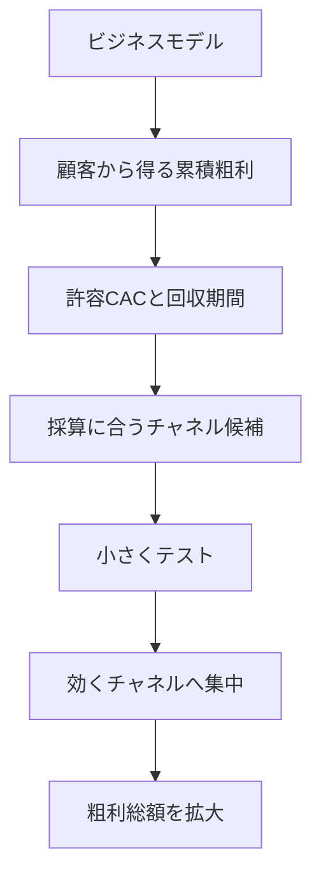
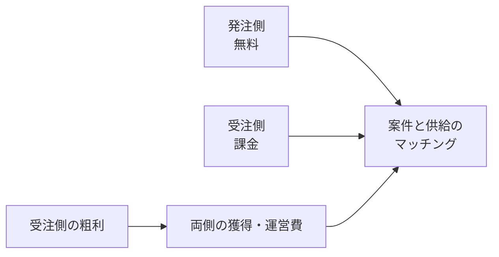

「広告単価が高すぎる」「展示会から商談につながらない」と感じたとき、私たちはつい媒体や代理店を替えたくなります。しかし、先に確認すべきなのは、そもそも自社のビジネスモデルが顧客獲得にいくら払える構造なのかです。

この記事では、[田中翔理氏の投稿](https://x.com/1edec/status/2076863925149438240)を入口に、許容CAC（Customer Acquisition Cost）を粗利から計算し、チャネル選択へつなげる方法を整理します。読み終えると、次のことを自社の数字で判断できるようになります。

- 売上ではなく粗利を使って許容CACと回収期間を求める
- 平均CACと限界CACを分けて、追加投資の可否を決める
- 19の獲得チャネルを、探索期と拡大期で使い分ける
- 両面市場など、単純なLTV:CACでは判断できないモデルを見分ける


*この記事の全体像。以下、順に解説します。*

## チャネルより先にビジネスモデルを見る理由

同じ商品でも、単価、粗利率、継続率、アップセル、入金時期が違えば、顧客獲得に使える金額は変わります。[StrategyzerのBusiness Model Canvas](https://www.strategyzer.com/library/the-business-model-canvas)も、ビジネスモデルを価値提案だけではなく、顧客、チャネル、収益、コスト、主要活動などを含む構造として扱っています。

マーケティング施策は、この構造の下流にあります。



粗利が薄く継続も短い商品は、広告運用を改善しても早く限界に達します。反対に、高粗利で継続や追加契約が見込める商品は、高価でも良質な商談を生むチャネルを選べます。

したがって、チャネルの評価は「CPAが市場平均より安いか」ではなく、「自社の粗利とキャッシュ回収に耐えられるか」で行う必要があります。

## 許容CACは粗利LTVと回収期間で考える

CACは、一定期間の営業・マーケティング費用を、その期間に獲得した新規顧客数で割ったものです。[David SkokのSaaS Metrics 2.0](https://www.forentrepreneurs.com/saas-metrics-2-definitions/)では、粗利を考慮したLTVの簡易式を次のように整理しています。

```text
CAC = 営業・マーケティング費用 / 新規顧客数
顧客寿命 = 1 / 月次チャーン率
粗利LTV = 月次ARPA × 粗利率 / 月次チャーン率
回収月数 = CAC / 月次粗利
```

たとえば月次ARPAが10万円、粗利率が80%、月次チャーン率が2%なら、単純計算の粗利LTVは400万円です。

```text
100,000円 × 0.8 / 0.02 = 4,000,000円
```

ただし、この400万円をそのまま「広告に使ってよい上限」と読むのは危険です。人件費、開発費、管理費、資本コスト、将来キャッシュの割引を残す必要があるからです。Skokが示した「LTVはCACの約3倍」「CAC回収は12か月未満」という目安は、損益分岐そのものではなく、健全に成長投資するための経験則です。Skok自身も、企業の段階や割引率を考慮する必要を説明しています。

実務では、少なくとも次の2本を分けて持つと判断しやすくなります。

| 指標 | 意味 | 主な用途 |
|---|---|---|
| 損益上の上限CAC | これを超えると顧客単位で価値を失う天井 | 投資停止ライン |
| 運用上の目標CAC | 間接費と不確実性を残して成長できる水準 | 予算配分と入札目標 |

LTV:CACが1:1になる水準を「許容」と呼ぶのか、3:1を維持できる水準を「許容」と呼ぶのかで、同じ言葉でも金額は3倍変わります。社内では必ず定義を明示してください。

また、LTVが十分でも回収が遅いと、顧客を増やすほど先にキャッシュが減ります。年払い、前払い、契約期間、与信条件は、広告運用と同じくらい成長速度を左右します。

## 許容CPCを受注までのCVRから逆算する

クリック課金広告なら、許容CACとクリックから受注までのCVRを使って、許容CPCを逆算できます。

```text
CPA = CPC / CVR
CPC = 許容CPA × CVR
```

許容CACを30万円、クリックから受注までのCVRを0.2%とすると、許容CPCは600円です。

```text
300,000円 × 0.002 = 600円
```

ここでよくある誤りは、CVRの終点をそろえないことです。クリックからリード獲得までのCVRしかない場合は、さらにリードから受注までの率を掛けなければなりません。

```text
クリック→受注CVR
= クリック→リードCVR × リード→受注CVR
```

クリックからリードが5%、リードから受注が4%なら、最終CVRは0.2%です。リードCVRの5%をそのまま使うと、許容CPCを25倍に見積もってしまいます。

[Google Adsの目標コンバージョン単価制](https://support.google.com/google-ads/answer/6268632)のような自動入札では、実際のCPCはオークションごとに変わります。それでも逆算は不要になりません。自動入札へ渡す目標CPAが、事業の粗利と整合しているかを確認する基準になるからです。

## 平均CACでは追加投資を判断できない

これまで100社を平均10万円で獲得できたとしても、次の1社も10万円で取れるとは限りません。安く反応する顧客層を取り切り、媒体の在庫や営業担当者の処理能力に近づくほど、追加1社の獲得費用は上がります。

この追加1社にかかる費用が限界CACです。

```text
限界CAC = 追加した営業・マーケティング費用 / 追加で獲得できた顧客数
```

たとえば累計では次の状態だとします。

| 予算帯 | 追加顧客 | 追加費用 | 限界CAC |
|---|---:|---:|---:|
| 最初の1,000万円 | 100社 | 1,000万円 | 10万円 |
| 次の900万円 | 30社 | 900万円 | 30万円 |
| 次の500万円 | 10社 | 500万円 | 50万円 |

130社までの平均CACは約14.6万円ですが、131社目以降を含む直近の限界CACは50万円です。許容CACが30万円なら、平均だけを見ると好調に見えても、追加予算は価値を毀損します。

予算変更の実験では、チャネルごとに「費用をいくら増やし、商談と受注が何件純増したか」を記録してください。広告費だけでなく、コンテンツ制作、インサイドセールス、展示会運営などの人件費も含めます。

## 成長レバーは3つに整理できる

粗利総額を増やすレバーは、大きく3つです。

| レバー | 動かす変数 | 施策例 |
|---|---|---|
| 許容CACを上げる | 単価、粗利率、継続率、アップセル | 値付け、契約、提供原価の見直し |
| 実現CACを下げる | CVR、営業生産性、紹介率 | 訴求、対象顧客、商談プロセスの改善 |
| 採算内の獲得数を増やす | チャネル、市場、用途 | 新チャネルと隣接市場の探索 |

広告が高いときに実現CACだけを下げようとすると、LPやクリエイティブの改善を延々と続けがちです。しかし、粗利が薄いなら商品と契約を直す方が効きます。既存チャネルが飽和しているなら、運用改善より新しい獲得経路の探索が必要です。

一方で、値上げやアップセルが許容CACを自動的に上げるわけではありません。値上げで受注率や継続率が下がれば、LTVは想定どおりに増えません。価格変更は、新規顧客の獲得率と既存顧客の残留率をコホートで追って評価します。

## Tractionの19チャネルは探索漏れを防ぐ棚として使う

Gabriel WeinbergとJustin Maresの『Traction』は、顧客獲得の手段を19チャネルに整理しています。[著者による19チャネルの解説](https://medium.com/swlh/the-19-channels-you-can-use-to-get-traction-93c762d19339)の価値は、19個すべてを同時に実行することではありません。チームが広告、SEO、展示会など、慣れた手段だけで考える偏りを外すことにあります。

[Bullseye Framework](https://medium.com/@yegg/the-bullseye-framework-for-getting-traction-ef49d05bfd7e)は、次の3段階で進めます。

1. 外側のリングで、19チャネルすべての可能性を発想する
2. 中間のリングで、有望な候補を安価かつ短期間にテストする
3. 内側のリングで、効いたコアチャネル1本へ資源を集中する

各テストで答える問いは、費用、獲得可能数、顧客の質です。BtoBならクリックやリードだけでなく、商談化率、受注率、粗利、回収期間までつなげます。

原典が重視するのは、テスト後の集中です。「単一チャネルへの依存は怖いから、最初から3本を均等に育てる」と考えると、どのチャネルも学習量が足りず、コアが見つからないことがあります。

ポートフォリオ化が有効なのは、コアが見つかった後です。限界CACが上がり始めた、媒体ルール変更の影響が大きい、営業採用が上限に達した、といった段階で、異なる制約を持つチャネルを加えます。

## フロー型とストック型は時間軸で組み合わせる

チャネルは、即時の活動量に比例するフロー型と、資産が蓄積するストック型に分けて考えられます。

| 型 | 例 | 強み | 弱み |
|---|---|---|---|
| フロー型 | 広告、アウトバウンド営業、展示会 | 立ち上がりが速く、投入量を調整しやすい | 停止すると獲得も止まりやすい |
| ストック型 | SEO、事例、コミュニティ、ブランド | 将来の説明コストとCACを下げる | 効果が出るまで時間がかかる |

探索初期は、結果を早く観測できるフロー型で顧客像を学びやすくなります。コアチャネルが見つかった後は、そこで得た顧客の質問、導入理由、反対意見を事例やコンテンツへ変換します。するとストック型が指名検索や商談CVRを改善し、フロー型のCACにも間接的に効きます。

チャネル別の直接CACだけで評価すると、この間接効果を切り捨てます。ポートフォリオは本数ではなく、各チャネルの役割と時間軸で設計してください。

## 両面市場では片側のLTVだけで決めない

発注者と受注者、買い手と売り手など、二種類の顧客を結ぶプラットフォームでは、通常のLTV:CACを片側だけに適用できません。[Strategies for Two-Sided Markets](https://hbr.org/2006/10/strategies-for-two-sided-markets)が説明するように、どちらの側から料金を取り、どちらを優遇するかという価格構造が取引量に影響します。

たとえば発注側が無料で、受注側から月額料金を取るモデルを考えます。発注企業の獲得費はゼロになるわけではなく、受注側の収益で賄われます。



このモデルでは、少なくとも次を別々に持ちます。

- 発注側CACと、発注企業が生む有効案件数
- 受注側CACと、受注側の粗利LTV
- 案件あたりのマッチング率と継続率
- 需要と供給の比率、処理能力、待ち時間

受注側LTVだけを見て発注側の広告費を増やすと、供給不足や案件品質の低下を見落とします。反対に受注側を増やしすぎると、案件不足による離反が起きます。両面市場では「顧客1社」ではなく、取引が成立するシステム全体で許容獲得費を決めます。

## 自社で使える診断手順

施策や代理店を替える前に、次の順で数字をそろえます。

1. **全負荷CACを出す**: 媒体費だけでなく、営業・制作・ツール・展示会運営の人件費を含める
2. **粗利LTVを出す**: 売上LTVではなく、提供原価を引く。チャーンは全社平均ではなくコホートで見る
3. **回収月数を出す**: CACを月次粗利で割り、資金繰りが耐えられるか確認する
4. **限界CACを出す**: 追加予算による純増顧客で計算し、平均CACと分ける
5. **受注CVRで許容CPCを逆算する**: リード獲得で計算を止めない
6. **ボトルネックを分類する**: 許容CAC、実現CAC、採算内の獲得数のどこが詰まっているかを決める
7. **チャネル候補を広げて小さく試す**: 費用、獲得数、顧客の質を短期間で測る
8. **効いたコアへ集中する**: 飽和や依存リスクが現れてから次のチャネルを追加する

判断は次のように整理できます。

| 状態 | 優先する判断 |
|---|---|
| 実現CACが粗利LTVを超える | 拡大を止め、価格、継続、提供原価を見直す |
| 粗利LTVは十分だが回収が遅い | 前払い、年契、与信、資金調達を検討する |
| 平均CACは良いが限界CACが高い | 増額を止め、LTV改善か新チャネルを試す |
| コアチャネルがない | 広く発想し、小さくテストして1本に寄せる |
| コアが飽和または単一障害点になった | 制約の異なる第2チャネルを育てる |
| 供給や処理能力が不足している | 獲得ではなく供給・運用能力を先に増やす |

PMF前で顧客数が少なく、LTVやチャーンを安定して推定できない場合は例外です。この段階ではCACの最適化より、顧客インタビュー、継続利用、課題の再現性を優先します。また、貢献利益が負なら、獲得効率を上げるほど損失が増えます。

## まとめ

成長チャネルの選択は、流行や媒体の相場から始めるものではありません。単価、粗利率、継続、アップセル、入金条件から顧客獲得に使える金額を決め、その範囲でチャネルを探索します。

その際、損益上の上限CACと運用上の目標CACを分け、平均CACではなく限界CACで追加投資を判断することが重要です。Bullseyeは「19個を並行運用する手法」ではなく、広く探索した後にコアへ集中する手法です。複数チャネルへの分散は、コア発見後の飽和や依存リスクに対する設計として扱います。

まずは直近3か月の全負荷CAC、粗利LTV、回収月数、追加予算帯ごとの限界CACを1枚に並べてください。広告の高低を議論する前に、どの成長レバーを動かすべきかが見えてきます。

この記事が少しでも参考になった、あるいは改善点などがあれば、ぜひリアクションやコメント、SNSでのシェアをいただけると励みになります！

## 参考リンク

- [田中翔理氏の対象投稿](https://x.com/1edec/status/2076863925149438240)
- [David Skok, SaaS Metrics 2.0](https://www.forentrepreneurs.com/saas-metrics-2/)
- [David Skok, SaaS Metrics 2.0 Detailed Definitions](https://www.forentrepreneurs.com/saas-metrics-2-definitions/)
- [David Skok, What is your TRUE customer lifetime value?](https://www.forentrepreneurs.com/ltv/)
- [Gabriel Weinberg, The 19 Channels You Can Use to Get Traction](https://medium.com/swlh/the-19-channels-you-can-use-to-get-traction-93c762d19339)
- [Gabriel Weinberg, The Bullseye Framework for Getting Traction](https://medium.com/@yegg/the-bullseye-framework-for-getting-traction-ef49d05bfd7e)
- [オライリー・ジャパン『トラクション』](https://www.oreilly.co.jp/books/9784873117225/)
- [Strategyzer, Business Model Canvas](https://www.strategyzer.com/library/the-business-model-canvas)
- [Eisenmann, Parker, Van Alstyne, Strategies for Two-Sided Markets](https://hbr.org/2006/10/strategies-for-two-sided-markets)
- [Google Ads, 目標コンバージョン単価制について](https://support.google.com/google-ads/answer/6268632)
