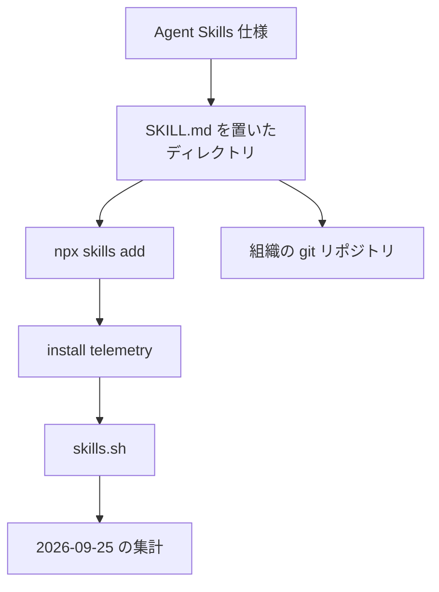

エージェントスキルは、ある仕事の手順を `SKILL.md` に書いて、エージェントへ渡す単位です。公開ディレクトリ [skills.sh](https://www.skills.sh/about) は、Vercel が運営しています。2026-09-25 の [State of agent skills](https://vercel.com/blog/state-of-agent-skills) は、運営者自身がレジストリの集計カウンタを書いたものです。記事は、7カ月でカタログが100万スキル、インストールが nearly 280 million になった、と書いています。

この記事では、そのカウンタが数えているもの、公開ディレクトリで未知のスキルを試す順番、自チームの手順をリポジトリへ置く条件を整理します。

## エージェントスキルとは

Anthropic は 2025-10-16 のエンジニアリング記事で Agent Skills を紹介し、2025-12-18 の更新でオープン標準にした、と書いています。Vercel は 2026-01-20 の changelog で、インストール用 CLI とディレクトリ skills.sh を同時に出しています。2026-09-25 の記事が辿るのは、何を教えるスキルが供給され、何がインストールされ、次に価値がどこへ移ると考えているかです。

### ファイルに必須な項目

仕様の必須フロントマターは、`name`（1〜64文字）と `description`（1〜1024文字）だけです。任意項目に `license`、`compatibility`（最大500文字）、`metadata`、実験的な `allowed-tools` があります。完了条件も、使ってよい権限も、必須ではありません。

読み込みは段階的です。仕様は、起動時には name と description、本文はスキルを使うとき、同梱ファイルはそのときだけ、と書いています。

最小の形は、次のとおりです。

```yaml
---
name: review-invoice
description: 請求書の行と発注を突き合わせ、差分を列挙する。
---
```

### 公開ディレクトリへ載る経路

インストールは `npx skills add <owner/repo>` です。2026-09-17 の CLI README（`v1.7.0`、commit `7407f389`）は、OpenCode、Claude Code、Codex、Cursor と、ほか75のエージェント名を載せています。CLI リポジトリ `vercel-labs/skills` は、2026-09-26 時点で約32.5k star あり、アーカイブではありません。

掲載は提出フォームではありません。公式ガイドは、git リポジトリを CLI で入れると、telemetry で skills.sh に出る、と書いています。ランキングは、匿名のインストール集計です。Privacy は、skill 識別子、エージェント名、粗い時刻、時間窓の重複排除用フィンガープリントを送る、と書いています。

2026-06-05 以降、カタログ API があります。認証は Vercel の OIDC トークンです。認証済みの上限は、チームとプロジェクトあたり毎分600リクエストです。直接ダウンロード URL の既定上限は、10 MiB、展開後 25 MiB、アーカイブ 1000 ファイルです。通常の git shorthand には、この文は掛かっていません。

### 2026-09-25 の集計が書く分布

記事の分類では、ソフトウェア工学が掲載の約4分の1で最大です。インストールは、ソフトウェア工学 18%、エージェントの仕事の進め方 15%、業務オペレーションと文書がそれぞれ nearly 11% です。

集中も書いています。375件（0.04%）がインストールの 62%、上位 1.2% が 94%、最上位の1件でも 1% 未満です。スキルのほぼ半数は、ちょうど1回だけインストールされた、と記事は書いています。

業種をまたぐ仕事は、分類したスキルの 66%、インストールの 87.5% です。listing あたりのインストールは、業種固有の 3.6 倍です。記事の言葉では、多くの人が使えるスキルがインストールを集めます。

listing あたりの倍率は、カテゴリのインストールシェアを掲載シェアで割った指数です。業務は +74%、文書は +50%、クラウドは +42%、ソフトウェア工学は約 -30%、教育は -39%、調査は -55% です。

### 同じファイルから分かれる二つの置き場

公開カタログに載る経路と、組織のリポジトリに留まる経路は、同じ `SKILL.md` から分かれます。2026-09-25 の記事が集計するのは、前者のカウンタです。



記事の分類図は、このカタログのうち「よくインストールされたスキル」を、仕事の種類と業種で分けたものです。About this report は、その分類を全カタログではなく classified sample だと書いています。

記事の次段は、公開カタログが全員の基礎になり、差は「その組織だけが知っている判断」へ移る、と書いています。返金の条件や、再レビューなしで出してよいものの例を挙げています。

## 注意点

上の数字は、記事の自己申告として読める範囲と、そこから先に出ない範囲が分かれます。

### 件数と期間

| 記事の言い方 | 一次で揃う範囲 | 揃わない点 |
|---|---|---|
| one million skills | 本文は "one million" | 図の alt は "more than one million"。ちょうど100万とは記事内で揃っていない |
| nearly 280 million installs | 本文と図が nearly | 280,000,000 ちょうど、ともユニーク人数、とも書いていない |
| seven months | changelog の公開は 2026-01-20。記事は 2026-09-25 | この二日の完了月数は8。100万件に達した日は記事に無い |

About this report は、インストールを aggregate registry counters だと書いています。ユニークな人でも、独立な選択でもない、と同じ注記が書いています。

### カウンタの定義

Privacy は、IP 由来ハッシュと JA4 を時間単位の重複排除に使い、集計後に捨てる、と書いています。1時間を超えた再インストールを1人1件に潰す、とは書いていません。

CLI 文書は、telemetry が既定でオンであり、`DISABLE_TELEMETRY=1` で外す、と書いています。外したインストールはカウントに入らない、と Privacy が書いています。about は "when users opt in" と書いています。既定オンの CLI 文書と、opt-in の about は、同じ運営のページで食い違います。README は、GitHub が public と確認できないリポジトリの識別子は送らない、と書いています。GitHub 以外のリモートは、公開確認ができなくても識別子を送ることがある、とも書いています。

カウンタは生ログのままではありません。[vercel-labs/skills#322](https://github.com/vercel-labs/skills/issues/322) は 2026-02-10 に close されています。Andrew Qu（GitHub `quuu`、company `@Vercel`）は、自動化を検知してリーダーボードを公平に保つ処理がある、とコメントしています。自動で入れるなら `DISABLE_TELEMETRY=1` を勧めています。何件減ったかは書いていません。[vercel-labs/skills#764](https://github.com/vercel-labs/skills/issues/764) は 2026-09-26 も open で、tag や branch を指定した add はカウントされない、という報告です。

次の点は、公開された一次だけでは閉じていません。

- 分類サンプルは何件で、誰が、どの手順でラベルしたか
- 100万件に達した暦日と、nearly 280 million の集計窓
- hourly dedup のあと、別時刻の再インストールと、複数エージェントへの同時インストールを何件と数えるか
- 2026-09-26 時点で、監査がまだ無い listing、`isDuplicate: true` の listing、自動生成スキルがそれぞれ何件か
- [vercel-labs/skills#353](https://github.com/vercel-labs/skills/issues/353) の名前取り違えが、`v1.7.0` の既定インストールでまだ起きるか。issue は 2026-09-26 も open で、v1.7.0 で閉じたかは issue の状態だけでは確定しない
- App Store の 63カ月を、Apple の公開日一次だけで再現できるか

### 他のレジストリとの月数

記事は、100万到達を GitHub 27カ月、App Store 63カ月、npm 117カ月と比べます。

| 比較先 | Vercel の月数 | 一次の範囲 | 読み |
|---|---|---|---|
| GitHub | 27 | 公開は 2008-04-10。100万 repository は 2010-07-25 | 完了月数は27。同じ GitHub 記事は、gist も repository だと書く |
| App Store | 63 | Apple Newsroom 2014-01-07 が "more than one million apps" | 63という月数自体は Vercel の図。起算日を Apple の公開日だけで固定する一次は、ここでは挙げない |
| npm | 117 | npm のブログが June 2019 に100万 package、10周年を 2019-09-29 と書く | 2009-09 から 2019-06 の月インデックス差は117。100万件の日は npm 一次に無い |

速度の比較は、単位がリポジトリ、アプリ、package、スキル listing で違います。100万件の GitHub 記事は、gist も full-fledged repositories だと書いています。その100万件に gist が何割入るかは書いていません。Vercel の記事は、作れる人の多さと再利用で速度差を説明しています。

### 内訳の分母

分類の対象は、よくインストールされたスキルであり、それらで全インストールの 4/5 超だと記事は書いています。ソフトウェア工学 18%、エージェント手順 15%、業務と文書が nearly 11% という文は、分母を「全インストール」とも「分類サンプル」とも繰り返しません。14.8% だけが "in the classified sample" と明示されます。サンプル件数、分類手順、CSV は、記事本文にも記事の Markdown にもありません。methodology のパスは、2026-09-26 時点で 404 です。

listing あたりの倍率は、1件のスキルの品質スコアではありません。375件が 0.04% という対は、母数をちょうど100万とすると 0.0375% であり、記事の丸めと読めます。上位 1.2% の絶対件数は記事にありません。図注の「下位 98.8% は 6% 未満」と、本文の「上位 1.2% が 94%」は、丸めの桁が違います。94% の補集合を厳密に 6% 未満と検算する材料は、記事の中にはありません。

図のキャプションは、ソフトウェア工学が掲載では最大で、インストールの 4/5 超はそれ以外の仕事だ、と書いています。本文の 18% から 4/5 を引き直して、全カタログの需要と呼ばない、がここでの読みです。

### 監査のカバー率

記事に、100万件のうちチームの手順としてレビューされた割合はありません。公式ガイドは、registry への submission flow は無い、と書いています。あるのはセキュリティ監査の話で、時点によって母数が違います。

| 文書 | 日付 | 監査について言うこと |
|---|---|---|
| changelog | 2026-02-17 | Gen、Socket、Snyk で 60,000 skills and counting。悪意フラグは leaderboard と検索から隠す |
| Skills Night | 2026-02-20 | 当時の母数は 69,000超、CLI インストールは 200万。all skills and every new one を監査する、と書く |
| about | ページに日付なし。2026-09-26 に取得 | Every indexed skill が partner の routine security audit を通る。すべての partner が fail ならディレクトリから外す |
| API Reference | 2026-09-26 に取得 | 監査がまだ無い skill は 404。初回インストール後に生成され、数分遅れる、と書く |
| State of agent skills | 2026-09-25 | 監査カバー率も、人手の手順レビュー率も書かない |

2026-02-17 の 60,000 を、2026-09 の100万で割るカバー率にはできません。about の「every indexed skill」は、9月記事が示さなかったチーム手順のレビュー率でもありません。API の 404 と、about の全件監査は、同じ日に読んでも一文に潰れません。

Trail of Bits は 2026-06-03 のブログで、自作の悪意スキルが skills.sh の Gen、Socket、Snyk で pass した、と書いています。skills.sh 向けに書いた系統は、`.docx` に埋めたスクリプト、`.pyc` のバイトコード、パッケージレジストリを攻撃者側へ向けるプロンプトです。所要の「4件中3件は1時間未満、残り1件は数時間」は、ClawHub 向けの1件を含んだ4件全体の話です。数時間なのはプロンプトの1件で、これも skills.sh のスキャナを通過した、とブログは書いています。Terms は、自動スキャンをしても品質と安全は保証しない、と書いています。

## 公開カタログと社内手順は層が違う

混ぜやすい層を分けると、採用基準に置いたときに起きることが変わります。

| 層 | 何を見ているか | 2026-09-26 時点で一次が言うこと | 採用基準にすると起きること |
|---|---|---|---|
| フォルダ仕様 | ファイルの形 | 必須は `name` と `description`。完了条件も権限も必須ではない | 「仕様を満たす」は、手順がレビューされたことにはならない |
| レジストリ規模 | 公開カウンタ | 9月記事の100万件規模と nearly 280 million。分類はサンプル。人数ではない | 規模の記事根拠にはなる。社内の完了証明にはならない |
| 公開発見の prior | どれを先に試すか | 記事は現行の品質信号が install count だと言う。`find-skills` は 1,000以上を優先せよと言う | 未知の公開スキルを探す順番には使える。自チームの手順の採否には使えない |
| 社内の配布 | このリポジトリの手順をエージェントに渡すか | 仕様は強制しない。KB は "how to know we're done" を推奨の節として示す。Anthropic は、信頼できないソースは読むまで入れるな、と書く | 完了の見方と、使ってよい権限が本文にあるものだけを配る、は運用判断である |

9月記事は、公開レジストリの規模と偏りの自己申告です。チーム手順のレビュー率は示していません。インストール数は、Vercel が公開カタログの現行信号と呼ぶものであり、社内配布のゲートではありません。

記事は "Today, the best signal of a skill's quality is its install count." と書いています。次の測り方は、スキルの有無で仕事が良くなったかを見る tests and benchmarks だと書いています。インストール数を社内の採用基準にする、という読みは、この文の引用にはなりません。

ほぼ半数がちょうど1回なので、その帯ではインストール数は大小を分けません。最上位の1件でも全インストールの 1% 未満なので、1つの勝者のシェアとしても読まない、と記事は書いています。

次の読みは、一次が今示す範囲を超えます。

- 「2.8億は起きたインストールの全数」は強すぎます。オプトアウト、GitHub が public と確認できないリポジトリ、時間窓の重複排除、自動実行の調整があります。
- 「公開スキルを探すときもインストール数を見るな」は強すぎます。`find-skills` と記事の "best signal" が、発見の信号としては install count を残しています。
- 「監査が無い」は偽です。あるのは、カバー率の未公表と、通過が安全証明にならないという実験報告です。

Vercel が分類サンプルの件数と手順、またはチーム手順としてのレビュー率を一次データで出したら、規模と内訳の限定をその数字に置き換えます。インストール数の定義がユニークな人だと Privacy に書かれたら、人数ではない、という文を下ろします。

## 未知の公開スキルを試す順番

公開ディレクトリから未知のスキルを試す順番に、インストール数を使ってよい、と記事と `find-skills` が書いています。同じ CLI の `find-skills`（commit `7407f389`）は、検索結果だけでは勧めるな、と書いたうえで、1,000以上を優先し、100未満は慎重にせよ、と書いています。100未満は慎重、はこの指示の側です。

これは、公開ディレクトリから探すときの指示です。社内手順を配ってよいかの検査項目にはなっていません。

需要のパーセントを使うときは、classified sample であり、件数は非公開だと併記します。サンプルの中身を、全カタログの需要として引用する判断は、ここで止めます。9月記事を規模の集計として使う判断は、止まりません。

## 自チームの手順を配る条件

自チームの手順をエージェントへ配るゲートは、別です。完了したとみなす条件と、使ってよい権限が本文にあるものに限ります。仕様はこれを必須にしていないので、配布側の規則として書きます。

Vercel の Knowledge Base は、"how to know we're done" を推奨の節として示しています。Anthropic は、信頼できないソースのスキルは、読むまで入れるな、と書いています。

配る前に本文へ足す項目は、次の2つです。

- 完了の見方。差分が0件、指定の検査が通る、人が確認する、のどれで終わったとみなすか
- 使ってよい権限。読める範囲、書いてよい範囲、外部へ送ってよい範囲

セキュリティ監査のバッジは、2026-02 の 6万件、2026-02-20 の「全件」、2026-09 の about、API の 404 を、一つのカバー率にまとめません。Trail of Bits の通過報告は、ブログが書いた実験として扱います。名前の取り違えで攻撃者の `SKILL.md` が入りうる、という [#353](https://github.com/vercel-labs/skills/issues/353) は、2026-09-26 も open です。

業種横断がインストールの 87.5% という結果は、汎用の手順がカウンタを集める、という記事の読みです。返金条件や、再レビューなしで出してよいものの境界は、公開カタログの順位では決まりません。組織のリポジトリに残す判断です。

## 常時読む知識と、起動する仕事

「スキルは常に AGENTS.md より劣る」は、範囲を超えます。2026-01-27 の Vercel の評価は、Next.js 16 の文書検索です。baseline は 53%、スキルを既定のままにすると 53%（未呼び出しは 56%）、明示して指示すると 79%、8KB の `AGENTS.md` 索引は 100% です。インストール数は変数にしていません。

同じ記事は、常時必要な知識は受動コンテキスト、明示して起動する垂直の仕事はスキル、と分けています。文書を探し続ける索引と、請求や返金のように起動する手順は、置き場が違います。公開ディレクトリの順位は、この分け方の入力ではありません。

## まとめ

フォルダ仕様は、配れる形を定義しています。中身の正しさまでは定義していません。100万件と nearly 280 million は、2026-09-25 の運営者集計です。ユニーク利用者でも、レビュー済み手順の件数でもありません。7カ月は、公開 changelog から記事の日までを数えると8カ月で、到達日は記事にありません。

需要のパーセントは classified sample です。件数は非公開です。未知の公開スキルを試す順番には、インストール数を使えます。自チームの手順を配るゲートは、完了の見方と使ってよい権限が本文にあるかに置きます。監査バッジの時点の違う数字は、一つのカバー率にまとめません。

この記事が少しでも参考になった、あるいは改善点などがあれば、ぜひリアクションやコメント、SNSでのシェアをいただけると励みになります！

## 参考リンク

- [Vercel, "State of agent skills", 2026-09-25](https://vercel.com/blog/state-of-agent-skills)
- [Vercel changelog, "Introducing skills", 2026-01-20](https://vercel.com/changelog/introducing-skills-the-open-agent-skills-ecosystem)
- [Vercel changelog, "Automated security audits", 2026-02-17](https://vercel.com/changelog/automated-security-audits-now-available-for-skills-sh)
- [Vercel changelog, "The skills.sh API", 2026-06-05](https://vercel.com/changelog/the-skills-sh-api-is-now-available)
- [Vercel, "Skills Night", 2026-02-20](https://vercel.com/blog/skills-night-69000-ways-agents-are-getting-smarter)
- [Vercel, "AGENTS.md outperforms skills in our agent evals", 2026-01-27](https://vercel.com/blog/agents-md-outperforms-skills-in-our-agent-evals)
- [Vercel Knowledge Base, "Agent Skills: Creating, Installing, and Sharing", 2026-02-13](https://vercel.com/kb/guide/agent-skills-creating-installing-and-sharing-reusable-agent-context)
- [Anthropic, "Equipping agents for the real world with Agent Skills", 2025-10-16](https://www.anthropic.com/engineering/equipping-agents-for-the-real-world-with-agent-skills)
- [Agent Skills specification](https://agentskills.io/specification)
- [skills.sh About](https://www.skills.sh/about)
- [skills.sh Privacy](https://www.skills.sh/privacy)
- [skills.sh Terms](https://www.skills.sh/terms)
- [skills.sh CLI](https://www.skills.sh/docs/cli)
- [skills.sh API](https://www.skills.sh/docs/api)
- [vercel-labs/skills v1.7.0（7407f389、2026-09-17）](https://github.com/vercel-labs/skills/blob/7407f3893ad4dceab546ac002c3ef806e4000c73/README.md)
- [vercel-labs/skills find-skills](https://github.com/vercel-labs/skills/blob/7407f3893ad4dceab546ac002c3ef806e4000c73/skills/find-skills/SKILL.md)
- [GitHub Blog, "We Launched", 2008-04-10](https://github.blog/news-insights/we-launched/)
- [GitHub Blog, "One Million Repositories", 2010-07-25](https://github.blog/news-insights/the-library/one-million-repositories/)
- [Apple Newsroom, "App Store Sales Top $10 Billion in 2013", 2014-01-07](https://www.apple.com/newsroom/2014/01/07App-Store-Sales-Top-10-Billion-in-2013/)
- [npm blog, "So long, and thanks for all the packages!"](https://blog.npmjs.org/post/615388323067854848/so-long-and-thanks-for-all-the-packages.html)
- [Trail of Bits, "The sorry state of skill distribution", 2026-06-03](https://blog.trailofbits.com/2026/06/03/the-sorry-state-of-skill-distribution/)
- [vercel-labs/skills#322（closed、2026-02-10）](https://github.com/vercel-labs/skills/issues/322)
- [vercel-labs/skills#764（open、2026-09-26 確認）](https://github.com/vercel-labs/skills/issues/764)
- [vercel-labs/skills#353（open、2026-09-26 確認）](https://github.com/vercel-labs/skills/issues/353)
