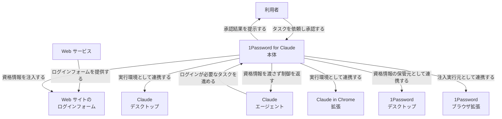
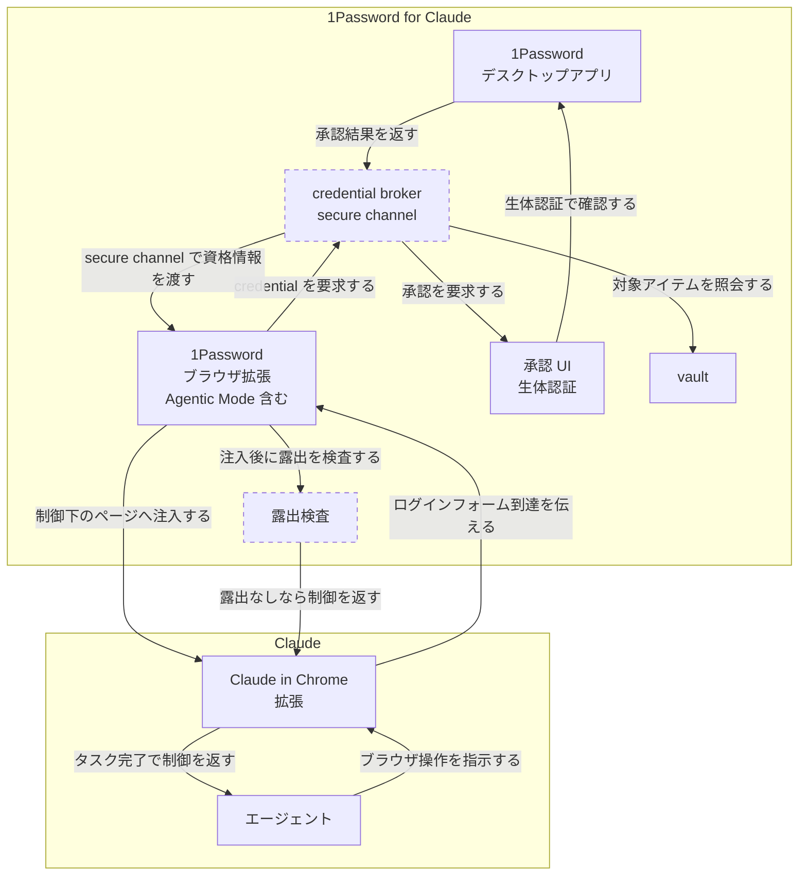
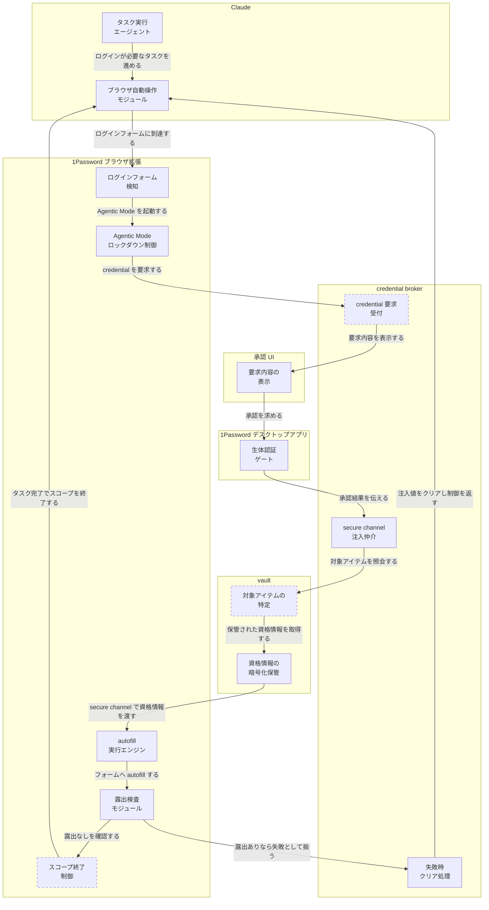
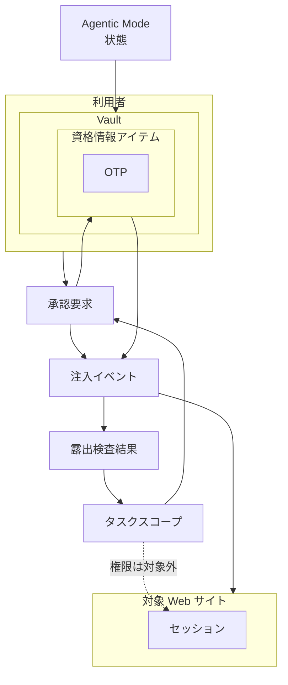
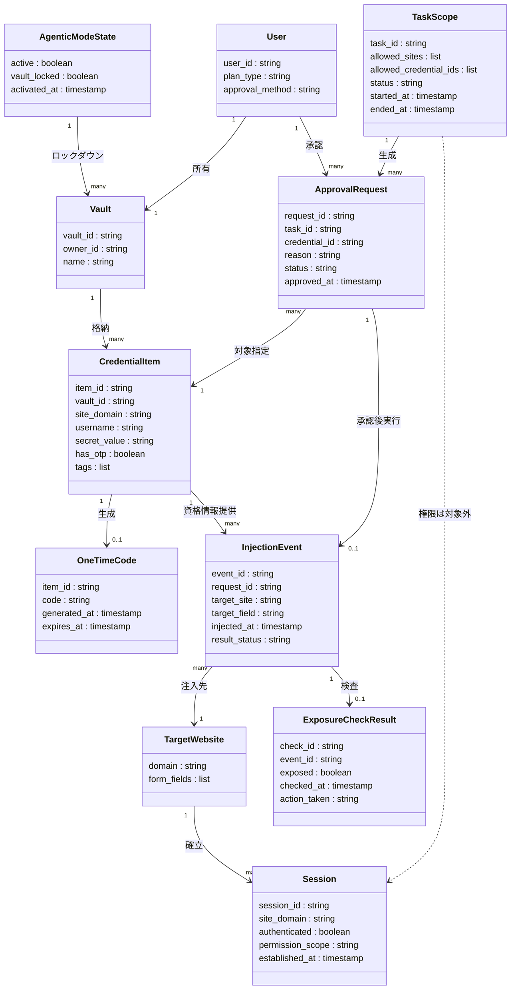

> 対象: 1Password for Claude（2026-07-16 発表 / macOS のみ〔2026-07-18 時点〕 / ベータ提供）
> 一次情報の確認日: 2026-07-18

## 概要

「1Password for Claude」は、1Password と Anthropic による統合機能です。2026-07-16 に発表されました。

AI エージェントがブラウザ上でタスクを実行する時代には、次の課題があります。

- ログインを要するタスクをエージェントに任せたい
- しかし資格情報（パスワード・ワンタイムコード）をエージェントに渡すと、モデルのコンテキストやメモリに秘密が残るリスクがある

従来は「秘密を渡すか、タスクを中断するか」の二択でした。1Password for Claude は、この二択を解消します。1Password CTO の Nancy Wang は次のように述べています。

> "The answer isn't handing agents your secrets. It is to let a user give an agent permission to use a credential without letting the agent see it."

仕組みは次の通りです。

- Claude はブラウザ操作でログインが必要になると、1Password に資格情報を要求します
- 1Password は「どの資格情報を・何のために」使うかを本人に提示します
- 本人が生体認証（Touch ID 等）で承認します
- 1Password が資格情報をページのフォームへ直接注入します
- Claude はパスワードやワンタイムコードを一切受け取りません

秘密を渡す代わりに、「承認済みの資格情報利用だけを本人の同意のもとで仲介する」という設計です。1Password が承認するのは、選んだ資格情報を特定のエージェントセッションへ解放することであって、認証後のブラウザ操作そのものではありません。この記事の核心は、**「秘密（資格情報）の受け渡し」と「認証後セッションで得られる操作権限」を分離する認可設計**にあります。

なお本機能は、公式ヘルプセンターの記載では現状 **ベータ提供**（Claude 側は Pro / Max / Team / Enterprise の有料プラン対象）です。


## 特徴

| 特徴 | 内容 |
|---|---|
| zero-exposure architecture | パスワード・ワンタイムコードがモデルのコンテキスト・メモリ・Anthropic 基盤に一切入りません |
| task-scoped access | アクセスは現在のタスクにスコープされます。タスク完了でアクセスは終了します |
| biometric 承認 | Touch ID 等の生体認証で、ユーザーが資格情報の使用を都度承認します。スタンディング承認はありません |
| Agentic Mode | 1Password ブラウザ拡張の新機能です。互換 AI エージェントがブラウザ操作を始めると自動で起動し、拡張機能の UI をロックダウンします。エージェントは現在のタスクに明示承認されたログイン・OTP のみ使用でき、vault の残りには到達できません。Claude 統合とは独立して機能し、他の互換エージェントにも作動します |
| autofill 後の露出検査 | 資格情報の注入後、1Password が秘密がページ上に露出していないか検査します。送信失敗時は注入値をクリアし、制御を Claude に返します |
| 複数サイトの資格情報仲介 | 1 つのタスク内で複数サイトの資格情報を仲介できます。多段ワークフローを再ログインなしで進められます |
| 対象製品 | 1Password デスクトップアプリ + ブラウザ拡張、Claude デスクトップアプリ + Claude in Chrome ブラウザ拡張が必要です |
| 対応プラットフォーム | 現状 macOS のみです |
| プラン | 1Password 側は business / family / individual の各プランで利用できます。Claude 側は Pro / Max / Team / Enterprise の有料プラン対象（ベータ）です。Team / Enterprise は組織 Owner による有効化が必要です。新規は 14 日間の無料トライアルがあります |

補足として、この macOS ローンチ時点のセットアップ要件は Claude デスクトップアプリ + Claude in Chrome 拡張です（公式ヘルプは Cowork を利用例に挙げます）。1Password の先行発表（2026-03 の Unified Access）は、Anthropic 統合対象として「Claude browser extension・Cowork・Claude Code」を挙げているため、Claude Code も統合ロードマップ上の対象です。ただし本ローンチのセットアップ記事は Claude Code の手順を明示していません。

### 資格情報アクセスの 3 手法比較

AI エージェントに資格情報が必要な操作を任せる場合、大きく 3 つの手法があります。1Password for Claude は、このうち「ブラウザ操作エージェント向けの runtime credential broker」という新しい位置づけです。

> 用語注記: 本記事の「credential broker」「credential brokering」は、実行時に資格情報を仲介する**一般的な設計パターン**を指します。1Password が CI/CD（GitHub Actions）向けに提供する固有名の製品「1Password Credential Broker」とは別物です。

| 観点 | エージェントに秘密を渡す従来手法 | シークレットマネージャ（1Password CLI / `op://` 参照 / HashiCorp Vault 等） | 1Password for Claude |
|---|---|---|---|
| 秘密のモデル露出 | あり。プロンプトや環境変数経由でモデルのコンテキストに入ります | なし。CLI やスクリプトのプロセスに注入され、通常モデルへは渡しません | なし。ブラウザのフォームへ直接注入され、モデルのコンテキスト・メモリ・Anthropic 基盤に入りません |
| 承認単位 | 都度確認なし、または会話冒頭の一括許可が多いです | プロセス実行単位・CI 実行単位です。事前設定したポリシーに基づきます | 資格情報要求単位です。許可範囲は現在のタスク／エージェントセッションに限定され、生体認証でその場承認します |
| スコープ | 会話・セッション全体に及びやすいです | ポリシーで定義した vault / item 範囲です | 現在のタスクに限定されます。完了で終了します |
| 主な利用シーン | チャットにパスワードを貼り付ける等、非推奨だが実際に起こりがちな運用です | スクリプト・CI/CD・サーバーサイド処理へのシークレット注入です | ブラウザ操作エージェントによるログイン代行です |
| 主な利用者 | 人間が明示的に貼り付けます | 開発者・DevOps がパイプラインを構築します | Claude デスクトップ / Claude in Chrome の利用者（macOS）です |

**1Password CLI（`op` コマンド）との違い**

1Password for Claude は、既存の 1Password CLI とは別の製品です。

- 1Password CLI: スクリプト・CI/CD 向けに、`op://` 参照でシークレットを実行環境へ注入する仕組みです
- 1Password for Claude: ブラウザ操作エージェント向けに、ログインフォームへ資格情報を runtime で仲介注入する仕組みです

両者は「秘密をモデル/コードに直接埋め込まない」という思想は共通ですが、対象とする実行主体（CI パイプライン vs ブラウザ操作エージェント）と注入先（環境変数/コード vs ブラウザページ）が異なります。

## 構造

1Password for Claude のアーキテクチャを、C4 model の 3 段階（システムコンテキスト図・コンテナ図・コンポーネント図）で図解します。

> ⚠️ 1Password 公式は secure channel や注入プロトコルの内部実装を開示していません。以下の図は公式ブログが明示する処理フロー（承認 → 注入 → 露出検査 → スコープ終了）に基づいています。内部実装の推測部分は、各説明テーブルに「公式未開示・一般的設計からの推定」と注記します。

### システムコンテキスト図

利用者・Claude エージェント・Web サービスという 3 つのアクターと、1Password for Claude 本体、それを取り巻く外部システムの関係です。



| 要素名 | 説明 |
|---|---|
| 利用者 | 1Password for Claude にタスクを依頼し、資格情報の利用を生体認証で承認する人 |
| Claude エージェント | ログインを要するタスクを進める役割。資格情報そのものは受け取らない |
| Web サービス | 利用者がアカウントを持ち、ログインフォームを公開する外部の相手先サービス |
| 1Password for Claude 本体 | 資格情報を要求・承認・注入まで仲介する対象システム。既存の Claude 側アプリと 1Password 側アプリにまたがって成立する機能 |
| Claude in Chrome 拡張 | Claude エージェントがブラウザを操作するための外部システム |
| Claude デスクトップ | Claude エージェントの実行基盤となる外部システム |
| 1Password デスクトップ | 資格情報の管理・承認処理を担う外部システム |
| 1Password ブラウザ拡張 | 資格情報の注入と Agentic Mode によるロックダウンを担う外部システム |
| Web サイトのログインフォーム | 資格情報が注入される技術的な入力対象。Web サービスが提供する |

### コンテナ図

1Password for Claude を構成する主要な要素（1Password デスクトップアプリ / 1Password ブラウザ拡張 / credential broker / 承認 UI / vault）と、Claude 側（エージェント / Claude in Chrome 拡張）との連携です。



> 破線ノード（credential broker / 露出検査）は、個別コンテナとしての切り出しが公式未開示で、一般的な設計からの推定です。

#### 1Password for Claude

| 要素名 | 説明 |
|---|---|
| 1Password デスクトップアプリ | 生体認証による承認処理を実行し、資格情報の管理を担う |
| 1Password ブラウザ拡張（Agentic Mode 含む） | ログインフォームを検知し、credential broker を介して資格情報をページへ注入する。Agentic Mode はエージェントがブラウザを操作し始めると自動起動し、UI をロックダウンして現在のタスクで承認済みの login / one-time code だけを使用可能にする |
| credential broker（secure channel） | 資格情報の要求受付・vault への照会・承認依頼・secure channel での受け渡しを仲介する。secure channel の内部実装は公式未開示・一般的な credential broker 設計からの推定 |
| 承認 UI（生体認証） | どの資格情報を何のために要求しているかを表示し、Touch ID 等の生体認証で承認を得る |
| vault | 資格情報の暗号化された保管場所。secret の source of truth |
| 露出検査 | autofill 後に資格情報がページ上へ露出していないかを検査する。露出ありや送信失敗なら注入値をクリアして制御を返す。個別要素としての切り出しは公式未開示・一般的設計からの推定 |

#### Claude

| 要素名 | 説明 |
|---|---|
| エージェント | ログインを要するタスクを計画・実行する。vault item / password / one-time code を一切受け取らない |
| Claude in Chrome 拡張 | エージェントの指示に従いブラウザを操作する。1Password ブラウザ拡張が資格情報を注入する対象ページを制御する |

### コンポーネント図

各コンテナをドリルダウンし、credential 要求 → 表示・承認 → secure channel での注入 → autofill → 露出検査 → task 完了でスコープ終了、の制御経路を示します。



> 破線ノード（credential 要求受付 / 対象アイテムの特定 / スコープ終了制御）は、個別モジュールとしての切り出しが公式未開示で、一般的な設計からの推定です。

#### Claude

| 要素名 | 説明 |
|---|---|
| タスク実行エージェント | 認証を要するタスクを計画・進行する |
| ブラウザ自動操作モジュール | エージェントの指示に基づきページ遷移やクリックを実行する。autofill 中は Claude はサイトの読み取り・追跡を止めるため、資格情報を観測できない |

#### 1Password ブラウザ拡張

| 要素名 | 説明 |
|---|---|
| ログインフォーム検知 | ページ上のログインフォームを検知する |
| Agentic Mode ロックダウン制御 | エージェントがブラウザを操作し始めると自動でロックダウンし、拡張の UI を隠して現在のタスクで承認済みの login / one-time code だけを使用可能にする |
| autofill 実行エンジン | secure channel 経由で受け取った資格情報をフォームへ直接入力する |
| 露出検査モジュール | autofill 後、資格情報がページ上に露出していないかを検査する |
| スコープ終了制御 | タスク完了を検知しアクセスのスコープを終了する。個別モジュールとしての切り出しは公式未開示・一般的設計からの推定 |

#### credential broker

| 要素名 | 説明 |
|---|---|
| credential 要求受付 | 1Password ブラウザ拡張からの credential 要求を受け付ける。個別モジュールとしての切り出しは公式未開示・一般的な credential broker 設計からの推定 |
| secure channel 注入仲介 | vault から取得した資格情報を、secure channel を介して 1Password ブラウザ拡張へ渡す。secure channel の内部プロトコルは公式未開示 |
| 失敗時クリア処理 | 送信失敗など露出検査で問題が見つかった場合に、注入済みの値をクリアしてから制御を返す |

#### 承認 UI

| 要素名 | 説明 |
|---|---|
| 要求内容の表示 | どの資格情報が何のために要求されているかを利用者に表示する |

#### 1Password デスクトップアプリ

| 要素名 | 説明 |
|---|---|
| 生体認証ゲート | Touch ID 等の生体認証で利用者本人の承認を得る。コンテナ図で 1Password デスクトップアプリが担う生体認証確認のドリルダウンにあたる |

#### vault

| 要素名 | 説明 |
|---|---|
| 対象アイテムの特定 | 承認後、credential broker からの照会に基づき要求された資格情報アイテムを特定する。個別モジュールとしての切り出しは公式未開示・一般的設計からの推定 |
| 資格情報の暗号化保管 | password や one-time code の source of truth。暗号化された状態で保管し、承認後に secure channel へ値を渡す |

## データ

### 概念モデル

1Password for Claude に登場するエンティティは、大きく 2 つの所有関係に分かれます。利用者は Vault を所有します。Vault は資格情報アイテムを格納します。資格情報アイテムは OTP を生成します。対象 Web サイトはセッションを保有します。

タスクスコープ・承認要求・注入イベント・露出検査結果は、いずれの Vault にも対象 Web サイトにも属さない独立したエンティティです。これらは「秘密の保管・承認・注入」を仲介する処理の連なりを表します。認証後のセッションは対象 Web サイト側が保有する別エンティティであり、この仲介処理からは直接生成されません。破線（権限は対象外）が、1Password の保証範囲の境界を示します。

Agentic Mode 状態は、Vault のロックダウンを担う独立した仕組みです。タスクスコープ（タスク単位・1Password for Claude 統合に依存）とは別のライフサイクル（タブ単位・統合非依存で拡張レベルの既定 ON）を持ちます。両者を親子（生成）関係でなく、独立した 2 つのスコープ概念として扱います。



#### 利用者

| 要素名 | 説明 |
|---|---|
| 利用者 | 1Password と Claude の双方を使う本人。承認要求に対して生体認証で応答する主体 |
| Vault | 利用者が所有する資格情報の保管庫 |
| 資格情報アイテム | Vault に格納される 1 件のログイン情報。パスワードと OTP の発行元 |
| OTP | 資格情報アイテムから都度生成されるワンタイムコード |

#### 対象 Web サイト

| 要素名 | 説明 |
|---|---|
| 対象 Web サイト | Claude が操作するログイン先の Web サイト。注入イベントの宛先 |
| セッション | ログイン成功後に対象 Web サイトが発行する認証済み状態。権限の管理は対象 Web サイト側の別統制であり、1Password の保証範囲に含まれない |

#### 秘密の仲介プロセス（タスクスコープ〜Agentic Mode 状態）

| 要素名 | 説明 |
|---|---|
| タスクスコープ | Claude が開始した 1 タスクに対して許可される資格情報アクセスの範囲。タスク完了で終了する |
| 承認要求 | どの資格情報アイテムが何のために要求されているかを利用者に提示し、生体認証での承認を求める要求 |
| 注入イベント | 承認後に 1Password が資格情報を対象 Web サイトのフォームへ直接入力する処理 |
| 露出検査結果 | 注入後にページ上へ秘密が露出していないかを検査した結果。送信失敗時は注入値をクリアして制御をタスクスコープへ返す |
| Agentic Mode 状態 | 互換 AI エージェントがブラウザを操作し始めると自動起動する、1Password ブラウザ拡張の状態。UI を隠し Vault をロックダウンする |

### 情報モデル

公式ブログは内部のデータ構造（テーブル定義・API スキーマ等）を開示していません。以下は公式の記述（承認対象の表示内容、タスクスコープの発生・終了条件、注入と露出検査の挙動、Agentic Mode の挙動）から導ける概念的なモデルです。公式に明記のない属性は説明テーブルで「公式未開示・概念的推定」と注記します。



| 要素名 | 説明 |
|---|---|
| User | plan_type（business/family/individual）は公式ブログに明記。approval_method（生体認証）は公式ブログの記述に基づく。user_id は公式未開示・概念的推定 |
| Vault | 資格情報アイテムの保管庫。属性は一般的な credential broker / secretless 設計から補完した公式未開示・概念的推定 |
| CredentialItem | 公式ブログは「vault item / password / one-time code」を秘密として言及。secret_value は Claude に一切渡らない値であることが公式ブログの核心。その他の属性は公式未開示・概念的推定 |
| OneTimeCode | 公式ブログは one-time code を Claude が受け取らない対象として言及。属性（code / generated_at / expires_at）は一般的な OTP 実装から補完した公式未開示・概念的推定 |
| TaskScope | "Access is scoped to the current task and ends when the task is complete" に基づく。allowed_sites・allowed_credential_ids・status 等の具体的な属性名は公式未開示・概念的推定 |
| ApprovalRequest | "1Password shows the user which credential is being requested and why" に基づく。reason は表示内容から導出。request_id 等の識別子は公式未開示・概念的推定 |
| InjectionEvent | "1Password injects the credential directly into the page" "If submission fails, it clears the filled values before returning control" に基づく。result_status は失敗時のクリア処理を反映した概念的推定 |
| ExposureCheckResult | "After autofill, 1Password checks that secrets were not exposed on the page" に基づく。exposed・action_taken の具体的な値は公式未開示・概念的推定 |
| AgenticModeState | 互換エージェントがブラウザを操作すると 1Password 拡張が自動でロックダウンし UI を隠す、という公式記述に基づく。属性名自体は公式未開示・概念的推定 |
| TargetWebsite | Claude が操作するログイン先サイト。属性は公式未開示・概念的推定 |
| Session | 認証後にサイトが発行するセッション。公式ブログはこの権限管理に触れておらず、1Password の保証範囲外の別統制として扱われる。属性は公式未開示・概念的推定 |

## 構築方法

### 前提条件

1Password for Claude を有効化するには、次のソフトウェア・環境が必要です。

- Mac 端末
- 1Password for Mac（バージョン 8.12.28 以降）
- 1Password ブラウザ拡張機能（バージョン 8.12.28 以降）
- Claude デスクトップアプリ
- Claude in Chrome ブラウザ拡張機能
- 1Password アカウント（individual / family / business のいずれか）
- Claude の有料プラン（Pro / Max / Team / Enterprise）

対応時期・地域は次のとおりです。

- 提供開始: 2026-07-16
- 対応プラットフォーム: macOS のみ（初期）
- 新規契約者向けに 14 日間の無料トライアルあり

補足として、Claude 公式ヘルプは本機能を「Claude Desktop on macOS を使う有料プラン向けのベータ」と位置づけています。ベータという語の扱いは情報源により差があるため、正確な提供ステータスは公式ページで都度確認してください。

### 有効化手順

個人 / ファミリー / ビジネスの利用者は、次の手順で 1Password と Claude を接続します。

1. Claude デスクトップアプリを開く
2. **Customize > Connectors** を選択する
3. 一覧から 1Password コネクターを見つけて **Connect** を選択する
4. 1Password アプリ側にプロンプトが表示されるので、Touch ID または 1Password のパスワードで認可する

複数の 1Password アカウントを登録している場合は、アカウント名の下矢印から接続先アカウントを切り替えられます。

セットアップの入口は上記の Connectors 画面以外にも複数あります。

- Claude Desktop 上に 1Password 検出時に出るバナーから
- チャット内でログインが必要なタスクを依頼した際に出るプロンプトから
- **Settings > Connectors** から直接

#### ビジネスアカウント管理者側の設定

1Password Business アカウントを使う組織では、管理者が事前に agentic autofill を許可する必要があります。

1. 1Password.com に管理者アカウントでサインインする
2. サイドバーの **Policies** を選択する
3. **Sharing and permissions** 配下の **Manage** を選択する
4. **Allow AI agents to autofill for users** をオンにする

#### Claude Team / Enterprise 側の設定

Claude の Team / Enterprise プランでは、統合が既定で無効になっています。Owner（または Primary Owner）が有効化します。

1. Owner アカウントでサインインする
2. **Organization settings > Claude in Chrome** を選択する
3. **Enable for your team** をオンにする
4. **Password managers** をオンにする

上記より詳細な画面遷移や最新の手順は、公式ヘルプ記事（support.1password.com / support.claude.com）を参照してください。本レポートでは公式が明示していない画面詳細を補完・推測していません。

### Agentic Mode の位置づけ

Agentic Mode は 1Password ブラウザ拡張機能の機能の一つです。上記の統合セットアップとは別に動作します。

- ブラウザを制御する互換 AI エージェントが操作を開始すると自動でトリガーされる
- 1Password 拡張機能の UI をロックダウンし、インターフェースを隠す
- エージェントは現在のタスクで明示的に承認されたログイン / ワンタイムコードのみ使用できる
- vault の残りにはエージェントから到達できない
- 統合（1Password for Claude）を未セットアップでも動作する
- 拡張機能レベルで既定オンになっている
- Claude 以外の互換エージェントにも対応する

ビジネスアカウントでは追加設定が不要です。従業員が仕事用の認証情報に 1Password を使っていれば、AI エージェントからの認証情報要求はすべて可視化・明示化され、承認が必須になります。

## 利用方法

### 前提要件

| 項目 | 要件 |
|---|---|
| OS | macOS |
| Claude 側 | Claude デスクトップアプリ + Claude in Chrome 拡張機能、有料プラン（Pro / Max / Team / Enterprise） |
| 1Password 側 | 1Password デスクトップアプリ + ブラウザ拡張機能（8.12.28 以降）、individual / family / business プラン |
| 対応アイテム | ログインアイテムのユーザー名・パスワード・ワンタイムパスワードのみ |
| 未対応 | ソーシャルログイン、パスキー、支払いカード、身元情報（現時点では非対応。将来対応を約束する公式ロードマップは未確認） |
| 事前設定 | Business は管理者が agentic autofill を許可、Claude Team/Enterprise は Owner が統合を有効化 |

### ログインを要するタスクの依頼例

Claude デスクトップアプリで **Cowork > New task** を選び、サインインが必要なタスクをチャットで依頼します。

```
Amazon のウェブサイトにサインインして、最新の注文のステータスを確認して
```

公式ブログが挙げている例も、依頼文の書き方の参考になります。

```
ウィッシュリストを確認して、Audible のクレジットで新しいタイトルを選んで
```

```
Stripe にサインインして、直近の売上サマリーと不審な取引がないか教えて
```

これらはいずれも「ログインが必要な操作を、資格情報を渡さずに Claude へ依頼する」という同じパターンです。ただし後半 2 例は 1Password の発表上のマーケティング例で、Claude in Chrome のポリシー上の扱いは分かれます。

- Amazon の注文状況確認は読み取りで、ポリシーと矛盾しません。
- Audible のクレジットでタイトルを取得する部分は、実質的に購入を完了する操作です。Claude in Chrome は「購入・金融取引」を権限設定にかかわらず禁止するため、これは実行できません。
- Stripe の売上サマリー閲覧・不審取引の確認は、それ自体は金融取引ではありません。ただし金融サイトはアクセス時に許可を要求され、金融アカウントの操作は強く非推奨です。

試すなら、非購入・非金融の読み取りタスクから始めるのが安全です。

### 承認フロー

Claude がログインを要するタスクに到達すると、次の順で処理が進みます。

1. **要求表示**: 1Password が、どの資格情報を・何のために要求しているかをユーザーに表示する（推奨ログインを提示し、候補が複数あれば下矢印で選択変更できる）
2. **生体認証承認**: ユーザーが承認・変更・拒否のいずれかを選び、Touch ID または 1Password のパスワードで確認する
3. **注入**: 1Password ブラウザ拡張機能が、パスワードを画面に表示しないままフォームへ資格情報を直接注入する
4. **露出検査**: オートフィル後、1Password が秘密情報がページ上に露出していないかを検査する
5. **完了 / 失敗時のクリア**: 送信に失敗した場合は、注入した値をクリアしてから制御を返す

この間、Claude はパスワード・ワンタイムコードなどの秘密値を受け取りません。モデルのコンテキストやメモリ、Anthropic 基盤に秘密情報が入ることはありません。ただし公式セキュリティ記事によれば、Claude は承認済みアイテムのメタデータ（アイテムのタイトル、username / email、保存された website）は受け取ります。開示されないのは秘密値（secret value）だけです。

### 複数サイトを跨ぐ多段タスク

1Password は 1 つのタスクの中で、複数サイトの資格情報を仲介できます。

- タスクの対象サイトが変わっても、承認 → 注入という仕組み自体は同じです
- Claude in Chrome が操作できるサイトであれば、対応するログインが 1Password にある限り同じパターンが適用されます
- サイトが変わるたびに再ログインの手間を挟まず、多段ワークフローを進められます

### タスク完了でスコープ終了

アクセス権限は現在のタスクにスコープされます。

- 承認は「このタスクのために」発行される
- タスクが完了すると、アクセスはそこで終了する
- 次のタスクで再度ログインが必要になった場合は、あらためて要求表示・承認のフローが走る

### Agentic Mode 中の vault ロックダウン

ブラウザベースのエージェントがブラウザを制御し始めると、Agentic Mode が自動で作動します。

- 1Password 拡張機能の UI が隠れ、ユーザーからの通常操作用インターフェースがロックダウンされる
- エージェントは、現在のタスクで明示的に承認されたログイン / ワンタイムコードだけを使える
- vault 内のそれ以外の項目には、エージェントからアクセスできない
- 1Password for Claude の統合を設定していなくても、Agentic Mode 自体は作動する

この仕組みにより、エージェントがブラウザを操作している間に 1Password の拡張機能そのものへ干渉しようとしても、vault 全体への到達を防ぎます。

## 運用

### 承認の可視化・監査

- 資格情報へのアクセスは毎回 1Password デスクトップアプリのプロンプトで可視化されます。プロンプトは「どのアイテムを・なぜ要求しているか」を表示します。
- スタンディング承認（一度許可したら以降は無審査で通す仕組み）は存在しません。公式は次のように明記しています。

  > "There are no standing approvals: a new agent session means a new prompt."

- 承認した記録は、アカウントの item usage history（アイテム利用履歴）に自動で残ります。

  > "Every grant is also recorded in the account's item usage history."

- 運用では、この利用履歴を定期的に確認します。想定外の時刻・想定外のアイテムへのアクセスがないかを見る監査ポイントになります。
- 監査を自動化する場合は、1Password Business の Events Reporting / activity log 連携（SIEM 転送）を検討します。ただし agentic autofill イベントが Events Reporting API に収録されるか、および item usage history の保持期間は、公式ドキュメントで要確認です（本調査では未確認）。
- 1Password Business アカウントでは、管理者ポリシー「Allow AI agents to autofill for users」の有効・無効自体が監査対象です。1Password.com の管理コンソールの Policies から状態を確認します。
- Claude Team / Enterprise 側では、Organization settings > Claude in Chrome の「Enable for your team」「Password managers」の 2 つのトグル状態が監査対象です。Owner または Primary Owner のみが変更できます。

定期監査で確認する項目をチェックリストとしてまとめます。

```
□ 1Password の item usage history に、想定外の時刻・アイテムへのアクセスがないか
□ Business ポリシー「Allow AI agents to autofill for users」の有効状態と変更履歴
□ Claude Organization settings の「Enable for your team」「Password managers」の状態
□ Team / Enterprise の allowlist / blocklist で許可しているサイト範囲
□ 各サイト側アカウントの権限（RBAC・スコープ）が最小権限のままか
```

### Agentic Mode の on/off とロックダウン確認

- Agentic Mode は 1Password ブラウザ拡張機能のレベルで **デフォルト ON** です。1Password for Claude の連携設定をしていなくても動作します。

  > "Agentic Mode is on by default at the extension level and works even if you haven't set up 1Password for Claude."

- 対応するエージェントがブラウザの制御を握ると自動的にロックダウンします。ロックダウン中は 1Password 拡張機能の UI が非表示になり、inline autofill 候補・自動保存プロンプト・通知が一切出なくなります。
- 明示的な on/off スイッチはありません。稼働確認は「1Password 拡張機能を開いて、アクティブかどうかを見る」方法だけが公式手順です。

  > "Open the 1Password extension at any time to confirm it's active or to cancel the current task."

- ロックダウンを解除したい場合、Agentic Mode 自体を無効化する設定はなく、エージェントが制御するタブ（Claude のタブグループ）を閉じてセッションを終了させます。
- Agentic Mode のスコープはタブ単位です。エージェントが制御するタブに限定され、エージェントセッションの終了かタブのクローズで終わります。

### タスクスコープの終了確認

- アクセスは現在のタスクにスコープされ、タスク完了で終了します。

  > "Access is scoped to the current task and ends when the task is complete."

- 技術的には、承認された資格情報はブラウザ拡張機能のメモリ内にセッション鍵で暗号化されたまま保持され、ディスクには書き込まれません。破棄条件は次の 3 つです。
  - エージェントがタスク完了を通知したとき
  - ブラウザを閉じたとき
  - 9 時間のハードキャップに達したとき（"a hard cap of nine hours"）
- 長時間稼働するワークフローを設計する場合、この 9 時間の上限をタスク分割の目安にします。
- フォーム送信が失敗した場合、1Password は制御を Claude に戻す前に注入済みの値をページから消去します。タスク終了の確認は「Claude が次に何を見ているか」ではなく「1Password が成功/失敗を報告したか」を基準にする設計です。

### 対応 OS・製品の更新

- 提供は現状 macOS 限定です。
- バージョン要件は次のとおりです。

  | 製品 | 要件 |
  |---|---|
  | 1Password for Mac | version 8.12.28 以降 |
  | 1Password ブラウザ拡張 | version 8.12.28 以降 |
  | Claude デスクトップアプリ | 最新版（Claude in Chrome と接続できること） |
  | Claude in Chrome ブラウザ拡張 | 最新版 |

- 4 つの製品はそれぞれ独立して更新されます。片方だけを更新すると連携が壊れることがあるため、更新後は Claude Desktop の Settings > Connectors で 1Password の接続状態を確認します。
- Claude 側は Pro / Max / Team / Enterprise の有料プランが対象で、機能自体がベータです。ベータのため挙動が変わる可能性があります。

### 複数サイトを跨ぐタスクの制御

- 1 つのタスク内で複数サイトの資格情報を仲介できます。タスクが変わっても承認モデルは同じで、資格情報は 1Password の外に出ません。

  > "Even when the task changes, the access model stays the same, and your credentials never leave 1Password."

- 承認はアイテム単位の粒度です。承認画面では対象アイテムの入れ替え・追加・拒否ができ、「選んだアイテムだけを・そのエージェントセッションにだけ・セッション終了まで」解放します。新しい credential 要求が発生するたびに、あらためてプロンプトが出ます。
- Claude Team / Enterprise の管理者は、allowlist / blocklist で Claude が到達できるサイトの範囲そのものを制限できます。複数サイトを跨ぐタスクの範囲を絞りたい場合は、この allowlist で制御します。

## ベストプラクティス

### 保証範囲と保証外を分けて設計・監査する

1Password for Claude が公式に明言する保証範囲は次のとおりです。

> "1Password's guarantees cover the storage, approval, delivery, and filling of credentials, not the agent's behavior once a session exists."

この一文が、運用設計の核になります。

| レイヤー | 内容 | 担保する主体 |
|---|---|---|
| 資格情報の非開示 | 秘密がモデルのコンテキスト・メモリ・Anthropic 基盤に入らないこと | 1Password（技術的に保証） |
| ログイン後の操作権限 | サインイン後のセッションでエージェントが何をできるか | アプリ側（訪問先サイトの権限設計・Claude in Chrome の安全機構・組織のガバナンス） |

- ①秘密の非開示と②ログイン後の操作権限は、独立したレイヤーとして設計・監査します。①だけを見て「安全」と判断しないことが重要です。
- 監査は 2 つの記録を突き合わせます。1Password 側の item usage history（誰が・いつ・どの資格情報を使ったか）と、Claude 側で利用可能な記録（会話・タスク履歴、in-chat feedback 等）です。ただし Claude 側に監査用の実行ログ API・保持期間・相関 ID の公式保証は確認できていません。相関付けは限定的である前提で運用します。

### 認証後の操作権限は RBAC・スコープ付きアクセス・監査ログ・異常検知で別統制する

- 訪問先サービス側のアカウントは最小権限で設計します。閲覧専用ロール、読み取り専用の API キー等です。1Password はどのロールでログインするかまでは制御しません。
- 人間の本アカウントとエージェント専用アカウントを分離します。専用のサービスアカウントを用意すると、item usage history と突き合わせたときに「どのアカウントがエージェント専用か」を台帳化でき、異常検知がしやすくなります。
- サービス側の API・UI でレート制限や操作回数の上限を設定します。エージェントが暴走しても、被害をその上限で止められます。
- 承認ゲートを 1Password の資格情報承認だけに任せません。なお Claude in Chrome は「購入・金融取引」「恒久的な削除（ゴミ箱を空にする・メール / ファイル / メッセージの削除）」を権限設定にかかわらず禁止しています。これらは承認を追加しても実行できません。許可される他の高リスク操作には、サインイン後の別レイヤーで明示的な確認ステップ（多段階承認、Claude in Chrome の action confirmation 等）を挟みます。

### prompt injection / agentic browser の脅威に注意する

- Claude in Chrome は prompt injection 対策として、受信コンテンツの分類器とアクション実行前の分類器の 2 段構えを持ちます。モデル訓練・コンテンツ分類器・granular permissions・サイトのブロックリスト・高リスク操作の確認を組み合わせた多層防御です。ただし自動のアクション審査は権限モード依存です。「Automatically approve」では各アクションを安全審査して危険と判断したものを自動ブロックしますが、「Skip all approvals」では自動審査が働きません（"nothing checks its actions automatically"）。
- 1Password 統合が守るのは資格情報の非開示だけです。悪意あるページが Claude を誘導し「別のタスクを実行させる」「意図しないデータを送信させる」といった prompt injection そのものは、1Password の保証範囲外です。1Password の「Accepted risks（許容しているリスク）」には次の記述があります。

  > "The agent acts inside the signed-in session. After a successful sign-in, what the agent does on the website is governed by the agent product's own safeguards."

- 実務対応:
  - 信頼済みサイトから始めます。未知のサイトやユーザー生成コンテンツを含むサイトは避けます。
  - Claude の挙動が急に変わったら（無関係な話題、想定外サイトへのアクセス、機密情報の要求）、即座にタスクを停止します。
  - Team / Enterprise 管理者は allowlist / blocklist で到達可能サイトを制限し、組織単位で拡張機能の on/off を切り替えます。
  - 疑わしい挙動は in-chat feedback や prompt injection 疑いとして報告します。

### 設計思想の背景: 主体分離という発想（概念的な類比）

1Password for Claude は RFC 8628（OAuth 2.0 Device Authorization Grant、いわゆる Device Flow）を実装しているわけではありません。ここでは、実装ではなく **設計思想の類比** として、関連する概念を背景整理します。

- **RFC 8628 の主体分離**: Device Flow は、入力手段が乏しいデバイス（スマート TV 等）がユーザーの認証情報（パスワード）を直接扱わず、別のユーザーエージェント（ブラウザ）上で人間が承認する構造を規定します（デバイス自身は最終的に access token を受け取ります）。「要求する主体」と「承認する主体」を分離する発想が核です。1Password for Claude では、Claude が要求し、別の信頼された面（1Password デスクトップアプリのプロンプト）で人間が承認します。この「要求する主体と承認する主体を分ける」という発想は共通していますが、プロトコルとしての実装は別物です。なお RFC 8628 はトークン形式・失効方式・attribution を規定せず、それらは実装依存である点にも注意します。
- **secretless / credential broker パターン**: アプリケーションやエージェントに秘密そのものを渡さず、ブローカーが実行時にのみ資格情報を注入する一般的な設計パターンです。1Password が掲げる "zero-exposure architecture" は、この一般的なパターンの一実装として位置づけられます。
- **workload identity**: 実行主体（この場合はエージェントセッション）に対して短命でスコープされた識別子や鍵を発行し、静的な共有シークレットを持たせない、という一般的な設計思想です。1Password が「エージェントセッションごとにセッション固有の暗号鍵を発行する」と説明する仕組みは、この考え方に沿います。
- **MCP authorization**: Model Context Protocol の認可仕様は現状 OPTIONAL（実装必須ではない）です。HTTP ベースのトランスポートで実装する場合は OAuth 2.1 準拠が求められ、stdio トランスポートでは環境由来の資格情報が想定されます。エージェントの認可設計はまだ発展途上で、1Password for Claude のようなベンダ固有の資格情報ブローカーは、その一実装例と位置づけられます。

これらはいずれも「背景となる設計論」であり、1Password が公式にこれらのプロトコル・標準を採用していると述べているわけではありません。

## トラブルシューティング

| 症状 | 原因 | 対処 |
|---|---|---|
| 承認プロンプトが出ない | 1Password for Mac / ブラウザ拡張が v8.12.28 未満 | バージョンを確認し、最新版に更新する |
| 承認プロンプトが出ない（Business アカウント） | 管理者が「Allow AI agents to autofill for users」ポリシーを有効化していない | 管理者に 1Password.com > Policies > Sharing and permissions からポリシーを有効化してもらう |
| 承認プロンプトが出ない（Claude Team / Enterprise） | 1Password for Claude はデフォルト OFF。Owner が組織設定を有効化していない | Owner が Organization settings > Claude in Chrome で「Enable for your team」と「Password managers」を ON にする |
| 資格情報の注入（autofill）が失敗する、想定と違うログイン項目が提案される | 保存済みアイテムの website 欄の URL がサインイン URL と完全一致していない | 1Password デスクトップアプリでアイテムを編集し、website 欄の URL をサインインページの URL に合わせて更新する |
| ソーシャルログイン・パスキーのサイトで注入が失敗する | サポート対象は Login 項目の username / password / OTP。ソーシャルログイン（「Sign in with Google」等）とパスキーはサポート対象外 | 該当サイトは人手でのサインインに切り替える |
| Agentic Mode が起動しない、拡張のロックダウンが効かない | Claude in Chrome 拡張が古い、または非対応のエージェント経由でブラウザを操作している | Claude in Chrome 拡張を最新化し、拡張アイコンを開いて Agentic Mode がアクティブか確認する（一般的な切り分け。公式に個別のエラーカタログはない） |
| macOS 以外（Windows / Linux / モバイル）で使えない | 2026-07-16 時点で macOS 限定提供 | 対応プラットフォーム拡大を待つ。他 OS では手動ログインで代替する（本統合の自動化は使えない） |
| OTP（ワンタイムコード）が入力されない | 該当ログイン項目に OTP シークレットが未登録、またはサイトが SMS・プッシュ通知型の 2 要素認証を使っている | 1Password 側のログイン項目に OTP シークレットを登録し直す。SMS・プッシュ型は対応対象外の可能性が高い（一般的な切り分け） |
| Claude Desktop / Claude in Chrome が 1Password と接続できない | 拡張機能が古い、または Claude Desktop の Connector 設定でトグルが有効化されていない | Claude in Chrome 拡張と Claude Desktop を再起動・更新する。Settings > Connectors で 1Password の接続状態を確認する（Claude in Chrome troubleshooting の一般的な切り分けを準用） |
| タスク完了後も Agentic Mode のロックダウンが解除されない | エージェントセッションの終了シグナルが送られていない、対象タブが残っている | エージェントが制御するタブ（Claude のタブグループ）を閉じてセッションを終了させる。9 時間のハードキャップで自動的に資格情報キャッシュは破棄される |
| 意図しないサイトに Claude がアクセスしようとする、挙動が急に変わる | prompt injection の疑い | ただちにタスクを停止する。in-chat feedback や prompt injection 疑いとして報告し、信頼済みサイトのみで再実行する |

## まとめ

1Password for Claude は、AI エージェントに秘密値を渡さず、ログインに必要な資格情報だけを本人承認のもとで仲介する仕組みです。設計としては secretless な credential brokering パターンに位置づけられます。ただし本機能が保証するのは資格情報の保管・承認・安全な配送・フォーム入力までで、認証後のセッションでエージェントが何をするかは別レイヤーの統制（最小権限・監査・prompt injection 対策）に委ねられます。この「秘密の非開示」と「認証後の操作権限」を分けて設計・監査する視点こそ、エージェント時代の認可設計の要点です。

この記事が少しでも参考になった、あるいは改善点などがあれば、ぜひリアクションやコメント、SNSでのシェアをいただけると励みになります！

## 参考リンク

- 公式ドキュメント
  - [1Password for Claude: Give Claude access without giving up your credentials（1Password 公式ブログ）](https://1password.com/blog/1password-for-claude)
  - [Use 1Password to sign in to websites with Claude | 1Password Support](https://support.1password.com/1password-claude/)
  - [About the security of 1Password for Claude | 1Password Support](https://support.1password.com/1password-claude-security/)
  - [Get started with 1Password for Claude | Claude Help Center](https://support.claude.com/en/articles/15936181-get-started-with-1password-for-claude)
  - [Use Claude in Chrome safely | Claude Help Center](https://support.claude.com/en/articles/12902428-use-claude-in-chrome-safely)
  - [Claude in Chrome permissions guide | Claude Help Center](https://support.claude.com/en/articles/12902446-claude-in-chrome-permissions-guide)
  - [Claude in Chrome troubleshooting | Claude Help Center](https://support.claude.com/en/articles/12902405-claude-in-chrome-troubleshooting)
  - [1Password Unified Access announcement（2026-03）](https://1password.com/press/2026/mar/1password-unified-access)
  - [Introducing 1Password Credential Broker（別製品・CI/CD 向け。用語注記の参照）](https://1password.com/blog/introducing-1password-credential-broker)
- 報道記事
  - [You can now grant Claude access to your 1Password credentials - Engadget](https://www.engadget.com/2216405/1password-anthropic-claude-integration/)
  - [Claude can now sign into websites with 1Password without exposing your credentials - Help Net Security](https://www.helpnetsecurity.com/2026/07/17/1password-anthropic-claude-integration/)
  - [1Password for Claude Lets AI Log In Without Seeing Your Passwords - MacRumors](https://www.macrumors.com/2026/07/16/1password-claude-integration/)
  - [1Password now lets Claude sign in to websites without seeing your passwords - 9to5Mac](https://9to5mac.com/2026/07/16/1password-now-lets-claude-sign-in-to-websites-without-seeing-your-passwords/)
  - [1Password brings secure credential access to Anthropic's Claude - SiliconANGLE](https://siliconangle.com/2026/07/16/1password-brings-secure-credential-access-anthropics-claude/)
  - [1Password lets Claude log you into websites without ever seeing your passwords - TheNextWeb](https://thenextweb.com/news/1password-claude-credential-zero-exposure-agentic-mode)
- 標準・仕様（設計思想の背景）
  - [RFC 8628: OAuth 2.0 Device Authorization Grant | IETF Datatracker](https://datatracker.ietf.org/doc/html/rfc8628)
  - [Authorization | Model Context Protocol Specification](https://modelcontextprotocol.io/specification/draft/basic/authorization)
