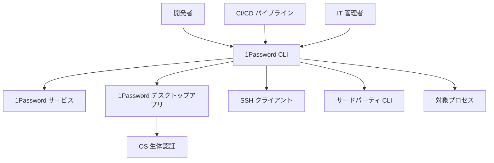
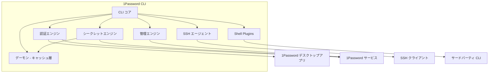
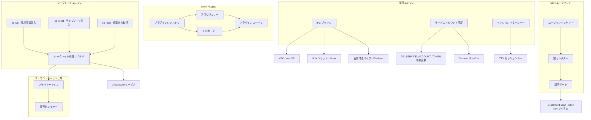
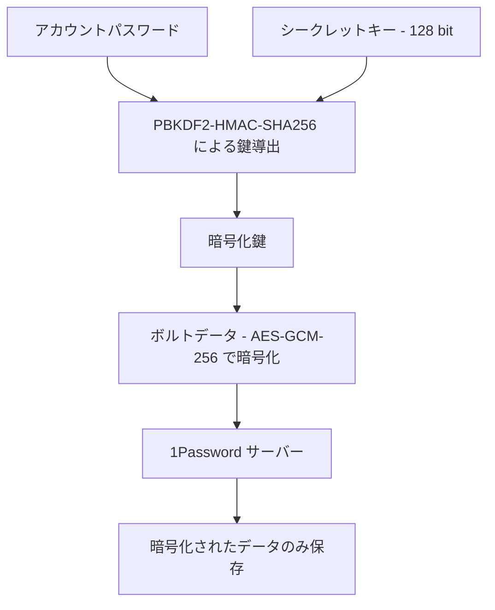
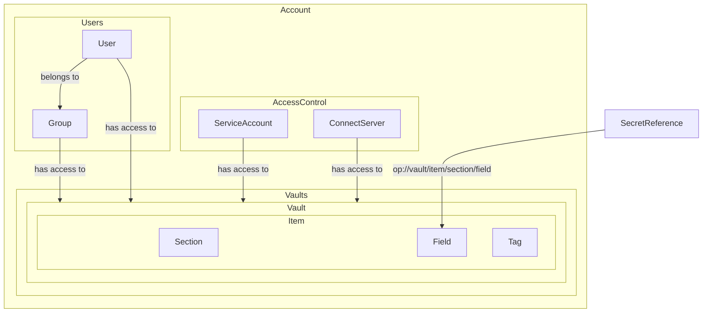
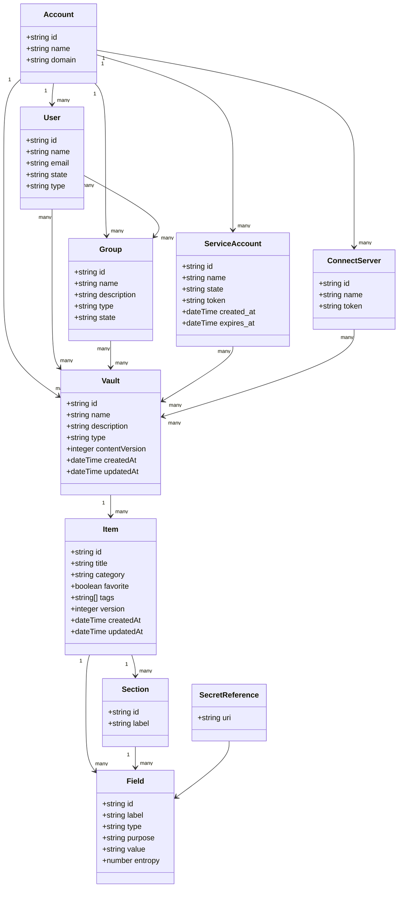
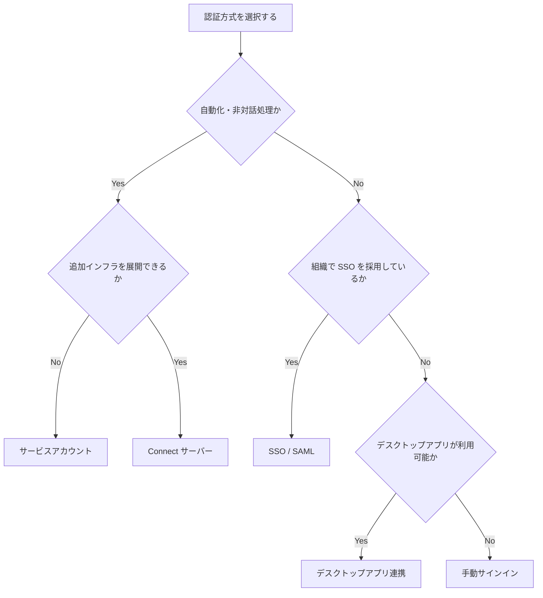

## 概要

1Password CLI（`op` コマンド）は、1Password のシークレット管理機能をターミナル・スクリプト・CI/CD パイプラインから利用するための公式コマンドラインツールです。

この記事では、1Password CLI の全体像を構造・データ・認証・構築・利用・運用の各観点から整理します。導入検討から実運用まで、必要な箇所を参照してください。

### 解決する課題

| 課題 | 解決方法 |
|------|----------|
| コード・設定ファイルへの平文シークレット埋め込み | シークレット参照構文（`op://`）による実行時注入 |
| 複数 CLI ツールの API キー管理 | Shell Plugins による生体認証統合 |
| CI/CD パイプラインへのシークレット配布 | サービスアカウントと `op run` による安全な環境変数注入 |
| SSH 秘密鍵の手動管理 | SSH エージェント統合による 1Password 内での鍵管理 |

### 対象ユーザー

| ユーザー | 用途 |
|----------|------|
| 開発者 | ローカル開発環境でのシークレット管理・CLI 認証 |
| DevOps / 運用者 | チームメンバーのプロビジョニング・権限管理の自動化 |
| CI/CD パイプライン | サービスアカウントを利用した無人環境でのシークレット取得 |

### バージョン情報

| 項目 | 内容 |
|------|------|
| 現行バージョン | CLI 2.x 系（2024年の CLI 2.0 リリース以降） |
| 最新バージョン | 2.32.1（2026年2月5日リリース） |
| 主な変更点（CLI 2.x） | noun-verb 形式のコマンド体系、JSON 出力の拡充、標準入力のパイプ処理の改善 |

## 特徴

1Password CLI の主要機能を以下にまとめます。

| 機能 | 概要 |
|------|------|
| シークレット参照構文 | `op://` URI でシークレットを参照し、平文の埋め込みを排除 |
| `op run` | 環境変数にシークレットを注入してプロセスを起動 |
| 生体認証連携 | Touch ID / Face ID / Windows Hello でパスワードレス認証 |
| Shell Plugins | 70 以上の外部 CLI ツールの認証を 1Password で一元管理 |
| サービスアカウント | CI/CD 向けトークンベース認証。最小権限の原則を実現 |
| SSH エージェント統合 | SSH 秘密鍵を 1Password 内で管理し、鍵ファイルの外部保存を排除 |
| `op inject` | テンプレートファイルにシークレットを注入して設定ファイルを生成 |
| ゼロナレッジ暗号化 | クライアント側で暗号化鍵を導出。サーバーは復号不可 |

以降、各機能の詳細を説明します。

### シークレット参照構文（Secret References）

`op://` スキームを用いてシークレットを URI で参照します。実行時に 1Password から値を取得するため、ソースコードや設定ファイルに平文シークレットが残りません。

```
op://<vault>/<item>/[section/]<field>
```

### `op run` によるシークレット注入

環境変数にシークレット参照を設定し、`op run` でコマンドを実行すると、サブプロセスの環境変数に解決済みシークレットが注入されます。

```bash
export DB_PASSWORD="op://app-dev/db/password"
op run -- node app.js
```

### 生体認証連携

Touch ID・Face ID など OS の生体認証機能と統合しています。パスワード入力なしで 1Password のボルトにアクセスできます。

### Shell Plugins

AWS CLI・GitHub CLI など対応する外部 CLI ツールの API キーを 1Password に保存し、実行時に生体認証で自動注入します。平文の認証情報をシェル設定ファイルに記述する必要がなくなります。

### サービスアカウント（Service Accounts）

CI/CD 環境など対話操作のない環境向けに、トークンベースの認証を提供します。アクセス可能なボルトを限定できるため、最小権限の原則を実現できます。

### SSH エージェント統合

1Password を SSH エージェントとして動作させます。SSH 秘密鍵は 1Password 外に保存されず、SSH・Git クライアントの認証に利用できます。

### `op inject` による設定ファイルへの注入

テンプレート形式の設定ファイル内のシークレット参照を解決し、シークレット入りファイルを生成します。Kubernetes の Secret マニフェストや `.env` ファイルの生成に利用できます。

### アイテム・ボルト管理

スクリプトからアイテムの作成・取得・更新・削除、ボルトの管理、ユーザー・グループの権限操作が可能です。チームメンバーのプロビジョニング自動化に活用できます。

### 複数アカウント対応

複数の 1Password アカウント（個人・チーム・Business など）を切り替えながら操作できます。

### シェル補完

Bash・Zsh・fish・PowerShell 向けのシェル補完をサポートしています。

### ゼロナレッジ暗号化

1Password はゼロナレッジアーキテクチャを採用しています。アカウントパスワードとシークレットキーからクライアント側で暗号化鍵を導出し、データは AES-GCM-256 で暗号化されます。1Password サーバーには暗号化済みデータのみが保存されるため、1Password 社がユーザーデータを復号することはできません。

## 構造

### システムコンテキスト図



| 要素名 | 説明 |
|---|---|
| 開発者 | CLI を対話的に操作してシークレットを取得・注入するユーザー |
| CI/CD パイプライン | サービスアカウントや Connect 経由でシークレットを自動取得する自動化環境 |
| IT 管理者 | ユーザー・グループ・Vault の管理操作を実行するユーザー |
| 1Password CLI | シークレット管理・認証・管理操作を提供するコマンドラインツール |
| 1Password サービス | Vault・アイテムデータを保持するクラウドバックエンド |
| 1Password デスクトップアプリ | 生体認証を仲介する常駐デスクトップアプリ |
| OS 生体認証 | Touch ID / Windows Hello / PolKit などのプラットフォーム認証機構 |
| SSH クライアント | SSH エージェントソケット経由で鍵操作を要求する SSH・Git クライアント |
| サードパーティ CLI | Shell Plugins が認証を肩代わりする外部 CLI ツール |
| 対象プロセス | `op run` がシークレットを環境変数として渡して起動するサブプロセス |

### コンテナ図



| 要素名 | 説明 |
|---|---|
| CLI コア | コマンドパース・ルーティング・フラグ処理を担うエントリポイント |
| 認証エンジン | デスクトップアプリ IPC・サービスアカウント・セッションキー管理を担う認証基盤 |
| シークレットエンジン | シークレット参照の解決・環境変数注入・テンプレート注入を提供 |
| Shell Plugins | サードパーティ CLI へのクレデンシャル自動プロビジョニングを担当 |
| SSH エージェント | UNIX ソケット経由で SSH 鍵操作リクエストに応答するエージェント |
| 管理エンジン | Vault・アイテム・ユーザー・グループの CRUD 操作を提供 |
| デーモン - キャッシュ層 | セッション中のアイテム・Vault 情報をメモリ上に暗号化キャッシュする常駐プロセス |
| 1Password デスクトップアプリ | 生体認証プロンプトを提示し CLI に認可を返す |
| 1Password サービス | Vault データを保持するクラウド API |
| SSH クライアント | エージェントソケットに接続して鍵署名を要求するクライアント |
| サードパーティ CLI | Shell Plugins 経由でクレデンシャルを受け取る外部ツール |

### コンポーネント図



| 要素名 | 説明 |
|---|---|
| IPC ブリッジ | プラットフォームごとの IPC 方式でデスクトップアプリと通信 |
| XPC - macOS | macOS の NSXPCConnection API を使った IPC チャネル |
| Unix ソケット - Linux | onepassword-cli グループ GID 検証付き Unix ソケット |
| 名前付きパイプ - Windows | Authenticode 署名検証付き Windows 名前付きパイプ |
| サービスアカウント認証 | OP_SERVICE_ACCOUNT_TOKEN または Connect サーバー経由で認証 |
| セッションマネージャー | TTY と起動時刻に基づく一意のセッションキーを管理し 10 分で失効させる |
| Connect サーバー | 自己ホスト型 REST API サーバー。シークレットをローカルキャッシュして返す |
| シークレット参照リゾルバー | `op://vault/item/field` URI を解析して実際のシークレット値に変換 |
| op run - 環境変数注入 | 環境変数内のシークレット参照を解決し、サブプロセスに渡して起動 |
| op inject - テンプレート注入 | テンプレートファイルにシークレットを埋め込む |
| op read - 標準出力取得 | シークレット参照を解決して標準出力またはファイルに書き出す |
| プラグインレジストリ | 50 以上のサードパーティ CLI プラグインを自動検出・動的ロード |
| プロビジョナー | 環境変数・設定ファイル・コマンド引数経由でクレデンシャルを注入 |
| インポーター | 既存のシステム設定や環境変数からクレデンシャルを発見して取り込む |
| プラグインスキーマ | schema.Plugin / schema.CredentialType / schema.Executable で構成される定義仕様 |
| エージェントソケット | ~/.1password/agent.sock で待ち受ける SSH エージェント UNIX ソケット |
| 鍵セレクター | Ed25519 / RSA 形式の SSH Key アイテムを対象 Vault から選択 |
| 認可ゲート | 明示的に許可された SSH クライアントのみ鍵署名を許可 |
| 1Password Vault - SSH Key アイテム | SSH 秘密鍵を保持する Vault 内アイテム。鍵はアプリ外に出ない |
| メモリキャッシュ | セッション中のアイテム・Vault 情報を保持するインメモリストア |
| 暗号化レイヤー | 1Password.com と同方式でキャッシュデータを暗号化 |

### セキュリティアーキテクチャ

#### 暗号化の階層構造



| 要素名 | 説明 |
|--------|------|
| アカウントパスワード | ユーザーが設定するマスターパスワード |
| シークレットキー - 128 bit | デバイスごとに保持される 128 bit の秘密鍵 |
| PBKDF2-HMAC-SHA256 による鍵導出 | パスワードとシークレットキーから暗号化鍵を導出する鍵導出関数 |
| 暗号化鍵 | Vault データの暗号化・復号に使用する鍵 |
| ボルトデータ - AES-GCM-256 で暗号化 | AES-GCM-256 で暗号化された Vault の実データ |
| 1Password サーバー | 暗号化されたデータを保管するクラウドサーバー |
| 暗号化されたデータのみ保存 | サーバーには暗号化済みデータのみが保存され、1Password 社は復号不可 |

#### 使用されている暗号アルゴリズム

| 用途 | アルゴリズム |
|------|-------------|
| データ暗号化 | AES-GCM-256 |
| 鍵導出 | PBKDF2-HMAC-SHA256 |
| 認証プロトコル | SRP（Secure Remote Password） |
| 通信路暗号化 | TLS |

#### SRP プロトコルの概要

SRP（Secure Remote Password）は、パスワードをネットワーク上に送信せずに認証を行う暗号プロトコルです。

| 特徴 | 説明 |
|------|------|
| パスワード非送信 | アカウントパスワードもシークレットキーもネットワーク越しに送信されない |
| 相互認証 | クライアントはサーバーの正当性を検証でき、中間者攻撃を防止 |
| セッション固有の暗号化 | セッションごとに異なる暗号化鍵が生成され、リプレイ攻撃を防止 |

デスクトップアプリ連携の場合はデスクトップアプリが SRP を処理し、手動サインイン（`op signin`）の場合は CLI が直接 SRP を使用します。サービスアカウントはトークンベースの認証であり、SRP とは異なる仕組みを使用します。

## データ

### 概念モデル



| 要素名 | 説明 |
|--------|------|
| Account | 1Password の組織単位。Users、Vaults、AccessControl を保持 |
| User | 人間の操作者。Group に所属し、Vault へのアクセス権を持つ |
| Group | User の集合。まとめて Vault へのアクセス権を付与する単位 |
| ServiceAccount | 自動化処理向けの非対話型認証エンティティ。トークンで認証 |
| ConnectServer | 自社インフラにデプロイする自己ホスト型 REST API サーバ |
| Vault | Item を格納するアクセス制御の単位 |
| Item | 1 件のシークレット情報。Category で種別が決まる |
| Section | Item 内のフィールドをグループ化する論理的な区画 |
| Field | Item が保持する個別の値。型と目的を持つ |
| Tag | Item に付与する文字列ラベル。階層タグ対応 |
| SecretReference | `op://vault/item/[section/]field` 形式の URI。Field の値を参照 |

### 情報モデル



| 要素名 | 説明 |
|--------|------|
| Account.id | アカウントの一意識別子 |
| Account.domain | 1Password のサブドメイン（例: company.1password.com） |
| User.state | `ACTIVE` / `SUSPENDED` / `TRANSFER_PENDING` |
| User.type | `MEMBER` / `ADMIN` / `OWNER` / `GUEST` |
| Group.type | `USER_DEFINED` / `RECOVERY` / `ADMINISTRATORS` / `OWNERS` |
| ServiceAccount.token | 発行時のみ取得可能な認証トークン文字列 |
| Vault.type | `EVERYONE` / `PERSONAL` / `USER_CREATED` |
| Item.category | `LOGIN` / `PASSWORD` / `API_CREDENTIAL` / `SERVER` / `DATABASE` / `CREDIT_CARD` / `SECURE_NOTE` / `SSH_KEY` 等 20 種 |
| Field.type | `STRING` / `CONCEALED` / `EMAIL` / `URL` / `OTP` / `DATE` / `MONTH_YEAR` / `MENU` |
| Field.purpose | `USERNAME` / `PASSWORD` / `NOTES`（ビルトインフィールドの役割識別子） |
| Field.entropy | パスワード強度を示すエントロピー値（bit） |
| SecretReference.uri | `op://vault/item/[section/]field` 形式の URI。`?attribute=otp` 等のクエリパラメータ付加可能 |

## 認証方式の選択

### 認証方式の選択フローチャート



### 認証方式の判断基準

| 認証方式 | 主な用途 | 前提条件 | 設定方法 |
|----------|----------|----------|----------|
| デスクトップアプリ連携 | 開発者の日常利用 | 1Password デスクトップアプリのインストール | Settings > Developer > Integrate with 1Password CLI を有効化 |
| 手動サインイン | デスクトップアプリ非利用環境 | 1Password アカウント | `eval $(op signin --account acme.1password.com)` |
| サービスアカウント | CI/CD・自動化スクリプト | 1Password CLI 2.18.0 以降 | `OP_SERVICE_ACCOUNT_TOKEN` 環境変数を設定 |
| Connect サーバー | 本番環境・高スループット処理 | Connect サーバーのデプロイ | `OP_CONNECT_HOST` と `OP_CONNECT_TOKEN` を設定 |
| SSO / SAML | 企業での統合認証 | 1Password Unlock with SSO の有効化 | デスクトップアプリ連携後に `op signin` で SSO アカウントを選択 |

### 各方式の特性比較

| 認証方式 | 対話操作 | レート制限 | キャッシュ | ネットワーク依存 |
|----------|----------|------------|------------|----------------|
| デスクトップアプリ連携 | 生体認証で最小化 | なし | アプリが担保 | 初回認証時のみ |
| 手動サインイン | セッションごとに必要 | なし | セッショントークンを保持 | 必要 |
| サービスアカウント | 不要 | 1 時間・1 日単位の制限あり | なし | 必要 |
| Connect サーバー | 不要 | 実質なし（自前インフラ） | インフラ内にキャッシュ | ローカル完結可能 |
| SSO / SAML | IdP 認証が必要 | なし | アプリが担保 | IdP に依存 |

### Connect サーバーとサービスアカウントの使い分け

サービスアカウントは追加インフラなしで利用できますが、厳格なレート制限があります。Connect サーバーはインフラの展開が必要ですが、データをインフラ内にキャッシュするためレート制限を事実上回避できます。テスト環境ではサービスアカウント、本番環境では Connect サーバーを使い分けることが推奨されています。

## 構築方法

### macOS へのインストール

Homebrew を使ったインストールを推奨します。

```bash
brew install 1password-cli
op --version
```

手動インストールの場合、公式サイトから `op.pkg` または `op.zip` をダウンロードして `/usr/local/bin` に配置します。

動作要件: macOS Big Sur 11.0.0 以降、1Password for Mac アプリ

### Linux へのインストール

Debian / Ubuntu 系は APT リポジトリを追加します。

```bash
curl -sS https://downloads.1password.com/linux/keys/1password.asc \
  | sudo gpg --dearmor --output /usr/share/keyrings/1password-archive-keyring.gpg
echo "deb [signed-by=/usr/share/keyrings/1password-archive-keyring.gpg] \
  https://downloads.1password.com/linux/debian $(lsb_release -cs) main" \
  | sudo tee /etc/apt/sources.list.d/1password.list
sudo apt update && sudo apt install 1password-cli
```

RPM 系（RHEL / CentOS / Fedora）は YUM を使います。

```bash
sudo rpm --import https://downloads.1password.com/linux/keys/1password.asc
sudo yum install 1password-cli
```

動作要件: 1Password for Linux アプリ、PolKit、認証エージェント

### Windows へのインストール

winget を使ったインストールを推奨します。

```powershell
winget install 1Password.1PasswordCLI
```

手動インストールの場合、`op.exe` をダウンロードして任意のフォルダ（例: `C:\Program Files\1Password CLI`）に配置し、システム PATH に追加します。

動作要件: 1Password for Windows アプリ、PowerShell

### デスクトップアプリとの連携設定

| OS | 手順 |
|---------|------|
| macOS | 1Password アプリを開く → 環境設定 → Developer → "Integrate with 1Password CLI" を有効化 |
| Windows | 1Password アプリを開く → 設定 → Developer → "Integrate with 1Password CLI" を有効化 |
| Linux | 1Password アプリを開く → 設定 → セキュリティ → "システム認証でロック解除" を有効化 → Developer 連携を有効化 |

### 生体認証の有効化

| OS | 設定方法 |
|----|----------|
| macOS | デスクトップアプリ連携を有効化すると Touch ID / Apple Watch が利用可能 |
| Windows | Windows Hello を有効化した状態でデスクトップアプリ連携を設定 |
| Linux | システム認証（polkit）を通じて生体認証を利用 |

設定後、初回コマンド実行時（例: `op vault list`）に認証プロンプトが表示されます。

### サービスアカウントの設定

サービスアカウントは CI/CD や自動化スクリプト向けの非対話型認証手段です。対応バージョンは 1Password CLI 2.18.0 以降です。

**Web UI での作成手順:**

1. `1password.com` にサインインします
2. Developer > Directory > Other（Infrastructure Secrets Management）に移動します
3. ウィザードでサービスアカウント名、Vault アクセス権限、Environment を設定します
4. "Create Account" を選択するとトークンが表示されます
5. トークンは **一度だけ表示される** ため、直ちに 1Password へ保存します

**CLI での作成:**

```bash
op service-account create "ci-bot" \
  --vaults "app-prod:read_items,write_items"
```

**環境変数として設定:**

```bash
export OP_SERVICE_ACCOUNT_TOKEN="ops_eyJz..."
op vault list
```

### 初回サインイン

デスクトップアプリ連携を設定した場合、`op vault list` などのコマンド実行時に自動的に認証プロンプトが起動します。

複数アカウントを管理する場合は `op signin` を使います。

```bash
op signin
# アカウント URL、メールアドレス、Secret Key を入力してサインイン
```

## 利用方法

### コマンド体系の全体マップ

1Password CLI は `op <noun> <verb> [flags]` という noun-verb 構造を採用しています。noun はトピック（管理対象）、verb はそのトピックに対する操作を表します。

#### 管理系コマンド

| Noun | Verb 一覧 | 概要 |
|------|-----------|------|
| `account` | `get`, `list`, `forget` | ローカルに設定されたアカウントの管理 |
| `vault` | `create`, `get`, `list`, `edit`, `delete` | ボルトの CRUD 操作と権限管理 |
| `item` | `create`, `get`, `list`, `edit`, `delete`, `move`, `share` | アイテムの CRUD 操作 |
| `document` | `create`, `get`, `list`, `edit`, `delete` | ドキュメントアイテムの CRUD 操作 |
| `user` | `get`, `list`, `invite`, `confirm`, `edit`, `suspend`, `reactivate`, `delete` | アカウントユーザーの管理 |
| `group` | `create`, `get`, `list`, `edit`, `delete` | グループの管理とメンバー・ボルトの権限制御 |
| `connect` | `server create/get/list/edit/delete`, `token create/list/edit/delete` | Connect サーバーとトークンの管理 |
| `events-api` | `create`, `get`, `list` | Events API 連携の管理 |
| `plugin` | `init`, `list`, `run`, `inspect`, `clear` | Shell Plugins の管理 |
| `service-account` | `create`, `list`, `ratelimit`, `revoke` | サービスアカウントの管理 |

#### ユーティリティコマンド

| コマンド | 概要 |
|----------|------|
| `op read <secret-reference>` | シークレット参照から値を読み取り |
| `op run -- <command>` | シークレットを環境変数として展開しながらコマンドを実行 |
| `op inject` | テンプレートファイルにシークレットを注入して出力 |
| `op signin` | 1Password アカウントにサインイン |
| `op signout` | サインインセッションを終了 |
| `op whoami` | 現在サインインしているアカウント情報を表示 |
| `op update` | CLI のアップデートを確認してダウンロード |
| `op completion` | シェル補完スクリプトを生成 |

### シークレット参照構文

シークレット参照は `op://` スキームで Vault / Item / Field を指定します。

```
op://<vault>/<item>/<field>
op://<vault>/<item>/<section>/<field>  # セクションを含む場合
```

**例:**

```
op://app-prod/db/password
op://prod/mysql/username
op://app-dev/api/credentials/token
```

### op read: シークレットの取得

シークレット参照を標準出力へ展開します。

```bash
# 標準出力へ出力
op read "op://app-prod/db/password"

# ファイルへ書き出し
op read "op://app-prod/tls/cert" --out-file ./cert.pem

# JSON 形式で出力
op read "op://app-prod/db/password" --format json
```

### op run: プロセスへのシークレット注入

環境変数に設定したシークレット参照を展開してプロセスを実行します。

```bash
# 環境変数にシークレット参照をセット
export DB_USER="op://app-dev/db/user"
export DB_PASSWORD="op://app-dev/db/password"

# op run 経由でアプリを起動
op run -- node app.js

# 単一コマンドでまとめて指定
op run --env-file=.env -- python server.py
```

デフォルトでシークレット値はマスクされます（`<concealed by 1Password>`）。`--no-masking` フラグで実際の値を表示できます。

### op inject: テンプレートへのシークレット注入

テンプレートファイル内のシークレット参照をシークレットに置換します。

**テンプレートファイル（config.yml.tpl）:**

```yaml
database:
  host: http://localhost
  port: 5432
  username: {{ op://prod/mysql/username }}
  password: {{ op://prod/mysql/password }}
```

**実行例:**

```bash
# 標準入力から処理
echo "db_password: {{ op://app-prod/db/password }}" | op inject

# ファイル指定
op inject --in-file config.yml.tpl --out-file config.yml

# 環境変数で参照先を切り替え
echo "db_password: op://$env/db/password" | env=prod op inject
```

### Item の CRUD 操作

#### 作成（Create）

```bash
# 基本的な Login アイテムの作成
op item create \
  --category Login \
  --title "My App DB" \
  --vault "app-prod" \
  --url "https://db.example.com" \
  --generate-password \
  username=admin@example.com

# テンプレートから作成（機密値の直接指定を避ける場合）
op item template get Login > login_template.json
# login_template.json を編集後
op item create --template login_template.json
```

#### 取得（Get）

```bash
# アイテム全体を取得
op item get "My App DB"

# 特定フィールドのみ取得
op item get "My App DB" --fields label=username,label=password

# JSON 形式で出力
op item get "My App DB" --format json

# Vault を指定して取得
op item get "My App DB" --vault "app-prod"
```

#### 更新（Edit）

```bash
# フィールドの値を変更
op item edit "My App DB" username="newuser@example.com"

# パスワードを再生成
op item edit "My App DB" --generate-password

# タグを追加
op item edit "My App DB" --tags "production,database"
```

#### 削除（Delete）

```bash
# アーカイブ（30 日間は復元可能）
op item delete "Old API Key" --archive

# 完全削除
op item delete "Old API Key"
```

#### 一覧表示（List）

```bash
# Vault 内のアイテム一覧
op item list --vault "app-prod"

# カテゴリと JSON 形式を組み合わせ
op item list --category Login --format json

# タグでフィルタ
op item list --tags "production"
```

### Vault の管理

```bash
# Vault 一覧
op vault list

# Vault の作成
op vault create "new-project"

# Vault の詳細確認
op vault get "app-prod"

# Vault の削除
op vault delete "old-project"
```

### フォーマット指定

| フラグ / 環境変数 | 説明 |
|------------------------|------|
| `--format json` | JSON 形式で出力 |
| `--format human-readable` | 人が読みやすい形式で出力（デフォルト） |
| `OP_FORMAT=json` | 環境変数でデフォルト形式を設定 |

```bash
# jq と組み合わせてフィールドを抽出
op item get "My App DB" --format json | jq '.fields[] | select(.label=="password") | .value'

# Vault 一覧を JSON で取得
op vault list --format json
```

### Shell Plugins の基本的な使い方

Shell Plugins は第三者 CLI ツールの認証情報を 1Password で管理し、生体認証でサインインする機能です。

```bash
# 利用可能なプラグイン一覧を確認
op plugin list

# プラグインを初期化（例: GitHub CLI）
op plugin init gh

# プラグインを経由してコマンドを実行
op plugin run -- gh repo list

# Shell プロファイルへ登録（永続化）
# ~/.zshrc または ~/.bashrc に追加
source ~/.config/op/plugins.sh
```

`op plugin init` 実行時に既存の認証情報のインポートまたは 1Password への新規保存を選択できます。`plugins.sh` を source するとプラグインのエイリアスが有効になり、以降は通常のコマンドと同様に利用できます。

### 対応 Shell Plugins 一覧（主要カテゴリ）

2025 年 2 月時点で 70 以上の CLI ツールに対応しています。最新の対応状況は [公式 Shell Plugins ページ](https://developer.1password.com/docs/cli/shell-plugins/) を参照してください。

| カテゴリ | 主要ツール |
|----------|-----------|
| クラウドプロバイダー | `aws`, `cdk`, `doctl`, `hcloud`, `flyctl` |
| DevOps・CI/CD | `circleci`, `argocd`, `terraform`, `pulumi` |
| バージョン管理 | `gh`, `glab`, `tea`, `cargo`, `brew` |
| データベース | `psql`, `mysql`, `mongocli`, `snowsql`, `influx` |
| SaaS・API | `stripe`, `twilio`, `vercel`, `openai`, `heroku`, `wrangler`, `ngrok`, `snyk` |

### カスタム Shell Plugin の作成

対応していないツールを自作プラグインとして追加できます。

```bash
# リポジトリをクローンしてスキャフォールドを生成
git clone https://github.com/1Password/shell-plugins
cd shell-plugins
make new-plugin

# plugin.go にプラットフォーム情報を定義
# credentials/ に認証情報スキーマとプロビジョナーを定義
# executables/ に実行ファイルと認証情報のマッピングを定義

# バリデーションとビルドを実行
make validate
make build
```

前提条件: Go 1.18 以降、Git、GNU Make

### SSH エージェントの設定

#### Step 1: SSH エージェントの有効化

1Password デスクトップアプリの Settings > Developer > SSH Agent を有効化します。

#### Step 2: ~/.ssh/config の設定

**macOS:**

```
Host *
    IdentityAgent "~/Library/Group Containers/2BUA8C4S2C.com.1password/t/agent.sock"
```

**Linux:**

```
Host *
    IdentityAgent ~/.1password/agent.sock
```

**Windows（WSL）:**

```
Host *
    IdentityAgent \\.\pipe\openssh-ssh-agent
```

#### Step 3: agent.toml による鍵の制御（任意）

デフォルトでは Personal、Private、Employee ボルトの鍵が使用されます。追加のボルトの鍵を使用する場合は `~/.config/1Password/ssh/agent.toml` を作成します。

```toml
[[ssh-keys]]
item = "github ssh key - work"
vault = "Work"

[[ssh-keys]]
vault = "Private"
```

#### Step 4: 動作確認

```bash
ssh-add -l
```

SSH キーは `SSH Key` アイテムタイプ（Ed25519 または RSA）として保存されている必要があります。OpenSSH サーバーは通常 6 キーまでしか認証試行を受け付けないため、キーが多い場合は `agent.toml` で鍵の順序を制御します。

## 運用

### セッション管理

セッショントークンは非アクティブ状態が **30分** 続くと失効します。失効後は再度サインインしてトークンを取得します。`OP_SESSION` 環境変数にトークンがセットされます。

| 操作 | コマンド |
|------|---------|
| サインイン（Bash/Zsh） | `eval $(op signin)` |
| サインイン（PowerShell） | `Invoke-Expression $(op signin)` |
| トークン取得（手動エクスポート用） | `op signin --raw` |
| サインアウト | `op signout` |
| 現在のアカウント確認 | `op whoami` |
| アカウント一覧 | `op account list` |

**セキュリティ上の注意点:**

- `op signin` による手動サインインは、同一ユーザーの他プロセスからセッションキーにアクセスされる可能性があります
- 1Password アプリ連携によるサインインは、より堅牢なセキュリティ保証を提供します
- セッションを即座に終了する場合は `op signout` を使用します

### サービスアカウントの運用

**初期設定:**

```bash
# サービスアカウントトークンを環境変数にセット
export OP_SERVICE_ACCOUNT_TOKEN="ops_eyJh..."

# 設定確認
op vault list
```

**トークンの注意点:**

- サービスアカウント作成ウィザードはトークンを **一度しか表示しません**
- 作成直後にトークンを 1Password に保存します
- トークンは Base64 エンコードされた JWT 形式です

**トークンローテーション:**

```bash
# サービスアカウント一覧
op service-account list

# レートリミット確認
op service-account ratelimit
```

| ローテーション操作 | 手順 |
|------------------|------|
| 1. 新トークン生成 | 1Password.com の管理画面でトークンをローテーション |
| 2. 旧トークン有効期限設定 | 即時 / 1時間 / 3日後 から選択 |
| 3. 新トークンを CI/CD シークレットに反映 | 各プラットフォームの設定を更新 |
| 4. 旧トークン失効確認 | 有効期限後にアクセス不可であることを確認 |

**権限の制約:**

- 作成後にボルトアクセスや権限を変更できません
- 変更が必要な場合は、新しいサービスアカウントを作成します
- サービスアカウントは他のサービスアカウントを作成できません

### CI/CD パイプラインでの利用

#### GitHub Actions

```yaml
jobs:
  deploy:
    runs-on: ubuntu-latest
    steps:
      - name: Configure 1Password
        uses: 1password/load-secrets-action/configure@v2
        with:
          service-account-token: ${{ secrets.OP_SERVICE_ACCOUNT_TOKEN }}

      - name: Load secrets
        uses: 1password/load-secrets-action@v2
        env:
          APP_SECRET_KEY: op://prod-vault/app-config/secret_key
          DB_PASSWORD: op://prod-vault/database/password

      - name: Deploy
        run: ./deploy.sh
```

**設定手順:**

1. GitHub リポジトリの Settings > Secrets にシークレット `OP_SERVICE_ACCOUNT_TOKEN` を作成します
2. シークレット値にサービスアカウントトークンをセットします
3. ワークフロー内でシークレット参照 URI（`op://vault/item/field`）を指定します

**制約:**

- Linux および macOS ランナーのみサポート（Windows ランナーは非対応）
- ログ出力にシークレットが露出した場合、1Password が自動的に `<concealed by 1Password>` に置換

#### CircleCI

```yaml
version: 2.1
orbs:
  onepassword: 1password/secrets@1.0.0

jobs:
  build:
    executor: onepassword/default
    steps:
      - onepassword/install-cli
      - onepassword/exec:
          command: ./run-tests.sh
```

`OP_SERVICE_ACCOUNT_TOKEN` を CircleCI のプロジェクト環境変数に設定します。

#### 汎用シェルスクリプト

```bash
#!/bin/bash
# OP_SERVICE_ACCOUNT_TOKEN は事前にセット済みとする

# シークレット参照で環境変数を注入してコマンド実行
op run --env-file=.env.op -- node server.js

# 特定フィールドを直接読み込む
DB_PASSWORD=$(op read "op://prod-vault/database/password")
```

### 監査・イベントログ

1Password Business アカウントの管理者は **Events API** でアクティビティを監視できます。

| 監視対象 | 内容 |
|---------|------|
| アカウントアクティビティ | ボルト・グループ・ユーザーへの変更 |
| アイテム使用状況 | 閲覧・コピー・編集の履歴 |
| 認証ログ | サインイン試行・場所・失敗詳細 |

```bash
# Events Reporting 統合を作成後、SIEM と連携
# API エンドポイント: https://events.1password.com/api/v1/
```

Events API は SIEM（Splunk, Datadog 等）との連携で監査証跡を一元管理できます。

### バージョンアップ手順

```bash
# 現在のバージョン確認
op --version

# 最新バージョンの確認とダウンロード
op update
```

**パッケージマネージャー経由のアップデート:**

```bash
# macOS (Homebrew)
brew upgrade 1password-cli

# Linux (APT)
sudo apt update && sudo apt upgrade 1password-cli
```

**CLI 1 から CLI 2 への移行:**

1Password CLI 1 は 2024年10月1日に非推奨になりました。

| 移行戦略 | 用途 |
|---------|------|
| 即時置換 | 小規模チームで同時移行可能な場合 |
| Docker コンテナ活用 | プロジェクト単位で段階移行する場合 |
| 並行インストール | 旧版を `op1`、新版を `op` として共存させて段階移行 |

**コマンド構文の主な変更点:**

```bash
# CLI 1（旧）
create item

# CLI 2（新）
op item create --category Login
```

デフォルト出力形式が JSON からテーブル形式に変わりました。JSON 形式が必要な場合は `--format json` を使用します。

### バックアップ・リカバリ

**シークレット参照の管理:**

- `.env` ファイルの代わりにシークレット参照 URI（`op://vault/item/field`）をリポジトリに保存します
- シークレット参照 URI はシークレットそのものではないため、バージョン管理に安全です

**アカウントリカバリ:**

```bash
# チームメンバーのアカウントリカバリ
op user recover <user-uuid>
```

**設定ファイルのバックアップ:**

- CLI 設定: `~/.config/op/config`
- このファイルにはデバイス ID が含まれます。サービスアカウントトークンと一致している必要があります。

## ベストプラクティス

### シークレット管理のベストプラクティス

シークレットをソースコードやファイルに平文で保存せず、`op://` 参照を使用します。

`op item create` でアイテムを作成する際は、インライン入力ではなく JSON テンプレートファイルを使用します。

```bash
# 推奨: テンプレートファイルを使用
op item create --template ./item-template.json

# 非推奨: コマンドライン上にシークレットを直接記述
op item create --category Login --title "My App" \
  --field "password=mysecretpassword"
```

環境変数へのシークレット注入には `op run` を使用します。

```bash
# シークレット参照ファイルを使用して実行
op run --env-file=.env.tpl -- ./app
```

`.env.tpl` の記述例:

```dotenv
DB_PASSWORD=op://prod-vault/database/password
API_KEY=op://prod-vault/api-service/api_key
```

### 権限設計（最小権限の原則）

サービスアカウントには必要なボルトのみアクセス権を付与します。用途別にサービスアカウントを作成します（例：本番用・ステージング用・読み取り専用）。

| 権限タイプ | 用途例 |
|-----------|--------|
| READ のみ | シークレットを読み取るだけの CI/CD ジョブ |
| READ + WRITE | シークレットを更新する自動化スクリプト |

```bash
# サービスアカウント作成時にボルトとロールを指定
op service-account create "prod-deployer" \
  --expires-in 90d \
  --vault "prod-secrets:read_items"
```

### 環境別の設定管理

本番・ステージング・開発環境ごとに専用のボルトを作成します。各環境専用のサービスアカウントを発行します。

```
1Password ボルト構成例:
├── prod-vault         ← 本番環境（サービスアカウント: sa-prod）
├── staging-vault      ← ステージング（サービスアカウント: sa-staging）
└── dev-vault          ← 開発環境（サービスアカウント: sa-dev）
```

シークレット参照 URI でボルトを明示します:

```bash
op read "op://prod-vault/app-config/secret_key"
op read "op://staging-vault/app-config/secret_key"
```

### チーム運用のガイドライン

| ガイドライン | 詳細 |
|------------|------|
| サービスアカウント作成権限 | オーナー・管理者のみに限定（デフォルト設定を維持） |
| トークン管理 | 生成トークンを即座に 1Password に保存 |
| 定期ローテーション | 組織のセキュリティポリシーに従い定期的にトークンをローテーション |
| 使用状況モニタリング | 管理画面でボルトアクセス履歴・アイテムアクセス履歴を定期確認 |
| 不要アカウントの削除 | 使用されなくなったサービスアカウントは速やかに削除 |

```bash
# サービスアカウントの使用状況確認
op service-account list

# 特定サービスアカウントの詳細確認
op service-account get <account-id>
```

### セキュリティ上の推奨設定

- **アプリ連携サインインを優先します。** 手動サインイン（`eval $(op signin)`）は同一ユーザーの他プロセスからアクセスされる可能性があります
- **1Password Connect との混在に注意します。** `OP_CONNECT_HOST` と `OP_CONNECT_TOKEN` が設定されている場合、`OP_SERVICE_ACCOUNT_TOKEN` より優先されます
- **トークンの即時失効手順を確立します。** 侵害が疑われる場合、管理画面からトークンを即時失効します

```bash
# 1Password Connect 変数のクリア（サービスアカウントを使用する場合）
unset OP_CONNECT_HOST
unset OP_CONNECT_TOKEN
export OP_SERVICE_ACCOUNT_TOKEN="ops_eyJh..."
```

## トラブルシューティング

### よくあるエラーと解決方法

| エラー | 原因 | 解決策 |
|--------|------|--------|
| `No session token found` | セッション未確立または失効 | `eval $(op signin)` を再実行 |
| `Authentication required` | `OP_SESSION` 未設定 | `eval $(op signin)` または `OP_SERVICE_ACCOUNT_TOKEN` を設定 |
| `error initializing client: RequestDelegatedSession` | 1Password アプリとの接続失敗 | CLI とアプリを最新版に更新 |
| `Signin credentials are not compatible` | 非インタラクティブ環境でのサインイン失敗 | サービスアカウントトークンを使用 |
| `connection reset` | 1Password アプリが未起動 | アプリを起動し「CLI との統合」設定を有効化 |

### 認証関連のトラブル

**セッション失効:**

```bash
# セッション失効の確認
op whoami

# 再サインイン
eval $(op signin)
```

**サービスアカウントトークンの問題:**

```bash
# 設定確認
echo $OP_SERVICE_ACCOUNT_TOKEN

# 1Password Connect 変数が優先されていないか確認
echo $OP_CONNECT_HOST
echo $OP_CONNECT_TOKEN
# 値が設定されている場合はクリア
unset OP_CONNECT_HOST
unset OP_CONNECT_TOKEN
```

**デスクトップアプリ連携の問題:**

1. 1Password アプリを起動します
2. Settings > Developer > 「Integrate with 1Password CLI」を有効にします
3. CLI を再インストールします（必要な場合）

### 接続・ネットワーク関連の問題

```bash
# 接続テスト
op account list --debug 2>&1 | head -50

# プロキシ設定の確認
echo $HTTPS_PROXY
echo $HTTP_PROXY
```

**タイムアウトエラー:**

- SSO 認証使用時に `authorization timeout` が発生する場合、初回認証後に数分待ってから新しいターミナルを開きます
- ネットワーク制限環境では `OP_CONNECT_HOST` で 1Password Connect サーバーを使用します

### 権限関連の問題

```bash
# 使用可能なボルト一覧（アクセス可能なボルトのみ表示）
op vault list

# アイテムへのアクセステスト
op item get "item-name" --vault "vault-name" --debug
```

| 問題 | 原因 | 解決策 |
|------|------|--------|
| ボルトが一覧に表示されない | サービスアカウントのアクセス権なし | 新しいサービスアカウントを作成して権限を再設定 |
| `Forbidden` エラー | 権限不足（READ/WRITE） | 管理者に権限確認を依頼 |
| Personal/Private ボルトにアクセスできない | サービスアカウントの制約 | ユーザーアカウントで認証するか共有ボルトを使用 |

### デバッグ方法

```bash
# --debug フラグでデバッグ出力を有効化（stderr に出力）
op vault list --debug

# デバッグ出力をファイルに保存
op vault list --debug 2> debug.log

# 詳細なリクエスト情報を確認
op item get "my-item" --vault "my-vault" --debug 2>&1

# バージョン確認
op --version

# アカウント設定の確認
cat ~/.config/op/config
```

**シェルプラグインのデバッグ:**

```bash
# プラグインが非インタラクティブシェルで動作しない場合
# op plugin run でラップして実行
op plugin run -- doctl compute droplet list

# プラグイン設定の確認
op plugin list
```

**サービスアカウントのレートリミット確認:**

```bash
# レートリミット状況の確認
op service-account ratelimit

# ID 指定でリクエスト数を最適化（3リクエスト → 1リクエスト）
# 名前指定（非推奨）
op item get "my-item" --vault "my-vault"

# ID 指定（推奨）
op item get <item-id> --vault <vault-id>
```

## 参考リンク

- 公式ドキュメント
  - [1Password CLI 公式ドキュメント](https://developer.1password.com/docs/cli/)
  - [1Password CLI ダウンロード](https://1password.com/downloads/command-line)
  - [リリースノート](https://releases.1password.com/developers/cli/)
  - [1Password CLI はじめかた](https://developer.1password.com/docs/cli/get-started/)
  - [1Password CLI コマンドリファレンス](https://developer.1password.com/docs/cli/reference/)
  - [シークレット参照の使用方法](https://developer.1password.com/docs/cli/secret-references/)
  - [デスクトップアプリ連携](https://developer.1password.com/docs/cli/app-integration)
  - [SSO サインイン](https://developer.1password.com/docs/cli/sign-in-sso/)
  - [SRP プロトコルによる保護](https://support.1password.com/secure-remote-password/)
  - [ゼロナレッジ暗号化](https://1password.com/features/zero-knowledge-encryption/)
  - [1Password セキュリティモデル](https://support.1password.com/1password-security/)
  - [op run ドキュメント](https://developer.1password.com/docs/cli/reference/management-commands/run/)
  - [op inject ドキュメント](https://developer.1password.com/docs/cli/reference/management-commands/inject/)
  - [Shell Plugins](https://developer.1password.com/docs/cli/shell-plugins/)
  - [カスタム Shell Plugin の作成](https://developer.1password.com/docs/cli/shell-plugins/contribute/)
  - [SSH エージェント](https://developer.1password.com/docs/ssh/agent/)
  - [SSH エージェント設定ファイル](https://developer.1password.com/docs/ssh/agent/config/)
  - [サービスアカウントでの利用](https://developer.1password.com/docs/service-accounts/use-with-1password-cli/)
  - [1Password Events API](https://developer.1password.com/docs/events-api/)
  - [1Password 開発者向けドキュメント](https://developer.1password.com/)
  - [1Password Connect](https://developer.1password.com/docs/connect/)
  - [1Password CLI FAQ](https://developer.1password.com/docs/cli/get-started/#faqs)
  - [1Password Homebrew Formulae](https://formulae.brew.sh/cask/1password-cli)
- GitHub
  - [Shell Plugins リポジトリ](https://github.com/1Password/shell-plugins)
  - [GitHub Actions 統合](https://github.com/marketplace/actions/install-1password-cli)
- コミュニティ
  - [1Password コミュニティフォーラム](https://www.1password.community/)
