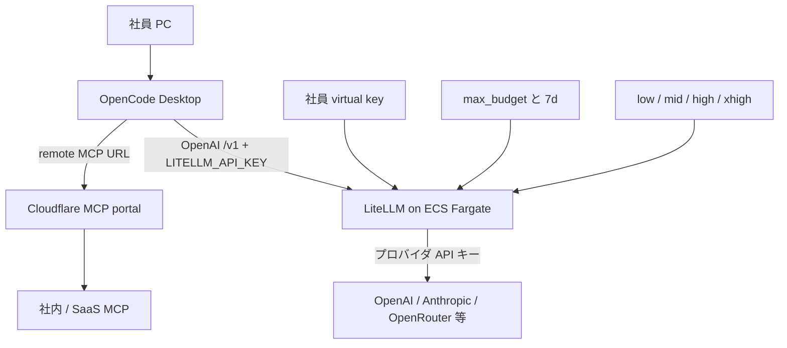

2026-09-18、日本トレカセンターの Takashi Nakagawa 氏が [全社に OpenCode + LiteLLM を導入してコストを抑えつつ AI 活用を進めている話](https://zenn.dev/jtcc/articles/7e74fef42580a1) を公開しました。対象は約 200 名の全社員が使う生成 AI の入り口です。手元の OpenCode と、自前ホストの LiteLLM を役割で分けています。

この記事では、当該社の公開構成を、OpenCode / LiteLLM / Cloudflare の公式仕様と突き合わせて整理します。読者が得るものは、入口とモデル実体の分離、推論強度の社内名、個人キー予算の失敗モード、プロンプト本文ログの権限、200 人規模の SSO、MCP 集約時の前提です。出典は 1 社の実践記事と公式ドキュメントであり、他社での再現実験ではありません。

*この記事の全体像。以下、順に解説します。*

## OpenCodeとLiteLLMの全社AI入口とは

日本トレカセンターは、全社員向けの生成 AI を 2 層に置いています。手元のクライアントは OpenCode Desktop です。モデル接続と予算は、AWS ECS Fargate 上のセルフホスト LiteLLM が持ちます。社員は Google Workspace の SSO で自分用の LiteLLM キーを発行し、OpenCode からそのキーで社内ゲートウェイへ送ります。プロバイダ API キー、モデルの実体、予算上限はゲートウェイ側にあります。

社内向けのモデル名はベンダー名ではありません。Low / Mid / High / XHigh の推論強度です。MCP 連携は Cloudflare One の MCP server portal を 1 URL にまとめています。一部のエンジニアは、クライアント側で OpenAI Codex サブスクリプションへ切り替えます。

公開記事が示す構成の要点は次のとおりです。

- クライアント（OpenCode Desktop）とモデル接続（LiteLLM）を別レイヤにする
- 社員キーとプロバイダキーを分離する。プロバイダキーはゲートウェイだけが持つ
- 社内モデル名を effort 4 段階にし、`model_name` のつなぎ先だけを差し替える
- 全社の月予算に対して、個人キーに `max_budget` と `budget_duration: 7d` を付ける
- 上限を超えた利用は Slack ワークフローで追加申請する
- LiteLLM は AWS ECS Fargate 上のセルフホストである
- MCP は Cloudflare Access 配下の portal URL（`/mcp`）に集約する
- OpenCode の接続は OpenAI 互換の `/v1`（`@ai-sdk/openai-compatible`）である

概念上の配置は次の図です。

処理の流れは次の 4 段です。

1. 社員が社内 SSO で LiteLLM 用キーを発行する
2. 配布スクリプトが OpenCode Desktop と `opencode.json` を置く。既定モデルは `litellm/mid`
3. 推論は LiteLLM の `model_name`（low〜xhigh）へ行き、設定の `litellm_params.model` が実体へ中継する
4. ツール呼び出しは MCP portal が上流サーバーへプロキシする

## 注意点

公開記事の到達宣言と、公式仕様のあいだには、定義を分けて読む箇所があります。

「導入前の 10 分の 1 以下」は記事著者の自己申告です。期間、分母（全社請求かゲートウェイ経由か）、Codex サブスクリプションの扱いが本文にありません。著者自身も主因を、高価なフロンティアを使いっぱなしにしなくなったことと、可視化に置いています。スタック固有の効果とは書いていません。Discussion の「社員全体で平均すると月20万ぐらい」はコメント欄です。単位と導入前後の対応が本文にありません。

「プロンプトをログで把握」は、LiteLLM の既定では成立しません。本文保存は `store_prompts_in_spend_logs` のオプトインです。成功ログとエラーログは既定で残ります。リクエスト / レスポンス本文は既定で保存しません。

記事が挙げた Claude Code 不具合 [BerriAI/litellm#16679](https://github.com/BerriAI/litellm/issues/16679) と [#19984](https://github.com/BerriAI/litellm/issues/19984) は、2026-09-20 時点でともに closed / fixed です。同じ系統の 400 は後続 Issue でも出ています。GitHub スターは変動します。同日の `gh repo view` では LiteLLM 約 5.9 万、OpenCode 約 20.9 万です。`pushedAt` は任意ブランチへの push です。

`7d` のリセット時刻は、LiteLLM 公式の一次ソースが食い違います。[Budget Reset Times](https://docs.litellm.ai/docs/proxy/budget_reset_and_tz) は設定タイムゾーンの月曜 0:00 です。[Users の複数窓表](https://docs.litellm.ai/docs/proxy/users) は日曜 0:00 UTC です。リセットジョブは既定 10 分間隔です。

MCP を LiteLLM に載せる場合、[GHSA-7488-6r32-c95q / CVE-2026-59822](https://github.com/advisories/GHSA-7488-6r32-c95q) の影響範囲は 1.84.0 未満です。任意 Bearer で MCP セッションが取れる、という内容です。修正版は 1.84.0 です。ワークアラウンドは MCP 経路の無効化です。

公開されていない点もあります。当該社が本文ログを実際にオンにしているか、超過時の OpenCode UI 表示と Slack 申請の SLA、自作 SSO が LiteLLM の custom_sso か完全外付けか、router fallbacks を本番で使っているか、導入後の shadow AI 残量は、公開テキストからは分かりません。

## クライアントとゲートウェイを分ける契約

公開記事の構成は「OpenCode → LiteLLM → 各プロバイダ」です。入口プロトコルは OpenAI 互換の `/v1` です。LiteLLM 公式の `model_name` と `litellm_params.model` は、クライアントが見る名前と実体を分けて書きます。[OpenCode Quickstart](https://docs.litellm.ai/docs/tutorials/opencode_integration) と OpenCode 公式は、カスタムプロバイダ `npm: @ai-sdk/openai-compatible` と `baseURL: .../v1` を同じ形で示します。同じ LiteLLM でも、Claude Desktop on 3P は Anthropic Messages API（`POST /v1/messages`）をゲートウェイに要求します。入口を揃えないと、クライアント差し替えはゲートウェイ実装の差し替えになります。

発注側が見る契約は次の 2 点です。手元 UI を配る単位と、モデル実体を変える単位を分けること。社員キーはゲートウェイ認証用であり、プロバイダキーではないこと。この分離ができると、ベンダー交換のたびに全社クライアントを再配布しなくて済みます。

## 社内モデル名を推論強度にする

公開記事は `low` / `mid` / `high` / `xhigh` を LiteLLM の `model_list` に定義し、OpenCode の `models` に同名で載せます。Low の実体は記事時点で OpenRouter 経由 DeepSeek-V4.1-Flash です。差し替えても手元 JSON は変えない、と書いています。

名前の抽象化は、テキスト用途では「再教育なしのベンダー交換」を支えます。一方で、vision / reasoning / コンテキスト長が変わると、同じ「High」でも期待がずれます。OpenCode はカスタム OpenAI 互換について、vision を `/v1/models` から発見しません。画像を使うモデルは `modalities` を手で書きます。LiteLLM 側の `supports_vision` は OpenCode に届きません。

OpenCode は reasoning モデルに `reasoningSummary` を付けます。Chat Completions が拒否するので、LiteLLM 側で `additional_drop_params: ["reasoningSummary"]` が公式トラブルシュートです。OpenCode を配るなら、effort 名だけでなく、この 2 点を配布 JSON とゲートウェイ設定に含めます。

## 個人キー予算の失敗モード

公開記事の予算設計は、月の全社予算に加え、個人キーへ `max_budget` と `budget_duration: 7d` を付ける形です。超過時は Slack で追加申請します。公式では、キー超過後はリクエストが失敗します。error catalog の `budget_exceeded` は HTTP 429 です。同一 users ページのサンプルは `"code": "400"` です。顧客予算のサンプルは 401 です。OpenCode 側は 400 と 429 を予算切れとして扱います。

この個人キー上限は、Postgres 等の DB に対して効きます。グローバル `litellm_settings.max_budget` は DB 無しで fail-open です。起動時警告のみで、リクエストは通ります。キー / チーム / ユーザー予算は仮想キー解決に DB が必要です。DB 無しでは `No connected db.` となり、上限検査以前に使えません。

既定のホットパスは Redis カウンタです。古いスナップショットでは上限を超えて通ります。ハード天井は `fail_closed_budget_enforcement: true` で、非既定です。チーム付きキーは個人予算を見ません。チーム / チームメンバー予算だけが効きます。ゼロコスト（`input_cost_per_token: 0` かつ `output_cost_per_token: 0`）は予算検査をスキップします。

公式は単一窓では「悪い 1 日が月を焼く」と書き、`24h` と `30d` の複数窓を勧めます。サイレントな安価モデルへの reroute は `budget_fallbacks` です。発動条件はキーの `model_max_budget` 超過で、`model_max_budget` は Enterprise です。記事の「週次で意識させる + Slack で例外」は、公式のハード失敗と整合します。請求のハード保証や、ユーザーに見えないダウングレードではありません。

## プロンプト本文ログの権限

本文を残すには `general_settings.store_prompts_in_spend_logs: true`、または Logs UI の Store Prompts が要ります。UI 設定は config を上書きし、再起動は不要です。新規ログだけに効きます。RBAC に「本文だけ見る」権限はありません。本文は spend log 行に入り、Logs を開けるロールが見ます。

ロールの範囲は次のとおりです。

- `proxy_admin`: 全操作
- `proxy_admin_viewer`: 全キー・全 spend を閲覧、変更不可
- `internal_user`: 自分のキーと自分の spend

`/spend/keys` と `/spend/users` は、非管理者なら自分のデータにスコープされます。他ユーザー指定は 403 です。公式 Security FAQ では、spend log の prompt/completion は暗号化されず、平文 JSON です。

「把握する」には明示オプトインが要ります。オプトインすると、管理者と viewer が全社プロンプトを読めます。ガバナンスと内部漏洩面は同じスイッチです。本文をゲートウェイ DB に置けない制約があるなら、「プロンプト全社監査」を成果にしない、という判断になります。

## 障害時の代替モデル

公開記事は、障害時の自動切替手順を書いていません。運用は「LiteLLM 側でつなぎ先を調整」です。OSS のプロバイダ障害対策は [router fallbacks](https://docs.litellm.ai/docs/proxy/reliability) です。形は `fallbacks: [{model_a: [model_b]}]` で、リトライ後に別 `model_name` へ移ります。content policy / context window 用の別リストもあります。

`budget_fallbacks` は予算超過用であり、プロバイダ 5xx 用ではありません。fallback 先のモデルがキーに許可されていないと、`enforce_fallback_model_access: true` でスキップできます。既定はキー権限を見ません。ゼロコスト primary が有料 fallback に落ちると、認証時予算検査をすり抜けて課金し得ます。公式は再検査を書き、`enforce_fallback_budget: false` で切れると書きます。

障害時の代替は `config.yaml` の router fallbacks で、クライアント再配布なしに置けます。effort 名のまま裏を変える運用と併用できます。当該社がその設定を公開しているわけではありません。

## 200人規模のSSO

LiteLLM Admin UI SSO は Enterprise です。v1.76.0 から 5 ユーザーまで契約なしで使えます。超過はライセンスです。Custom SSO フックも同じ Enterprise ページにあります。公開記事は、公式枠のため自作 SSO にした、と書きます。実装が公式フックか完全外付けかは、公開コードがありません。

Custom auth（リクエスト認証の差し替え）自体は OSS ドキュメントがあります。仮想キー併用と、キーのスカラー `max_budget` 非対応は、custom auth の表の話です。Admin UI SSO とは別経路です。200 人は公式 5 ユーザー枠の 40 倍です。自作は「SSO のためだけに契約しない」判断として記事に書かれています。公式が推奨する代替ではありません。キー予算の欠落は custom auth 経路の公式表であり、SSO 画面の自作と同一視しません。

## クライアント選択とMCP集約

公開記事が Claude Desktop 3P を見送った理由は、開発者モードと Configure Third-Party Inference を非エンジニアに案内する負荷です。公式は MDM で Gateway URL と資格情報を配る経路も持ちます。既存が Claude Code / Desktop で、Messages API をゲートウェイが実装できるなら、そちらの入口もあり得ます。

Claude Code × LiteLLM の 400 には複数系統があります。記事引用の `#16679`（Bedrock が `input_examples` を拒否）と `#19984`（Vertex が `prompt-caching-scope` ヘッダを拒否）は、2026-09-20 時点で closed / fixed です。別系統として、`/v1/messages` の Anthropic フィールドを OpenAI 形式へ変換し損なう open Issue があります。例は `#33075` の `stop_sequences` です。Bedrock/Vertex 素通しと同一ではありません。

OpenCode 配布は JSON 配置です。公式 README の第一手段は `curl -fsSL https://opencode.ai/install | bash` です。公開記事もワンライナーです。全社配布なら、署名付き経路を別途検討する判断材料になります。

Cloudflare MCP portal は、複数 MCP を 1 HTTP に集約します。全プラン open beta です。既定上限は 20 portal、80 server/portal です。アカウント上限と 2025 系クライアントの非活性タイムアウトは 24h です。MCP `2026-07-28` は stateless で、プロトコルセッションを作りません。Access で隠しても直接 URL は残ります。stdio 専用サーバーは入りません。ポータル経由では独立 MFA が強制されません。MCP を使うなら、portal の直接 URL 封鎖を別途設計します。ゲートウェイ側で MCP を載せるなら、LiteLLM 1.84.0 以降が前提です。

## 比較と向きやすい条件

入口の置き方を 3 つに分けると、向きやすさは次のとおりです。

| 基準 | A. OpenCode + LiteLLM | B. Claude Code / Desktop 3P + LiteLLM | C. ベンダー管理テナントのみ |
|---|---|---|---|
| 入口と接続の分離 | OpenAI `/v1` で分離 | Anthropic `/v1/messages` が必要 | ベンダー内で完結。自前接続は薄い |
| モデル契約の抽象化 | effort 名を `model_name` に置ける | ゲートウェイ別名は可。クライアントは Claude 系 ID を期待しやすい | ベンダーのモデル名に従う |
| 予算 | キー `max_budget` + `7d`（OSS）。超過はエラー | 同様。互換 400 が先に出ることがある | 席・クレジット契約 |
| プロンプト監査 | ゲートウェイ opt-in。平文 | 同上（通過分） | ベンダーの保持ポリシー |
| 配布 | JSON + Desktop | MDM / 開発者モード、または Claude Code 設定 | 管理コンソール招待 |
| 200 人 SSO | 公式 5 人枠。当該社は自作 | Desktop 3P は IdP JWT をゲートウェイへ | ベンダー IdP |

A が向きやすい条件は、非エンジニアを含む全員に同じエージェント UI を配ること、モデル実体を週次で入れ替えたいこと、OpenAI 互換で複数プロバイダを束ねたいことです。

B が向きやすい条件は、既存が Claude Code / Desktop で、Messages API をゲートウェイが実装できること、MDM で Desktop を配れることです。

C が向きやすい条件は、自前プロキシの CVE / Redis / DB 運用を持ちたくないこと、ベンダーの保持と席課金で足りることです。

逆転条件は次の 3 点です。全社クライアントが Anthropic Messages 必須であること。プロンプト本文をゲートウェイ DB に置けないこと。セルフホストの Redis / DB / CVE 運用を持てないことです。

## 発注側が先に決めること

クライアントとゲートウェイを分け、社内モデル名を用途・強度で置く設計は、公式機能で実装できます。コスト 1/10 や「これで実務標準」は、1 社自己申告を超えて一般化できません。標準化の根拠は「再現可能なレイヤ分け」であり、「安くなった」「全部見える」「SSO を契約せずに済ませた」ではありません。

判断支援者として、先に決める契約は次です。

1. **採用してよい核**: 手元クライアントと中央ゲートウェイの分離。社内モデル名はベンダー名ではなく用途・推論強度
2. **数字を計画に入れない**: 1/10 は当該社の自己申告。自社試算は「フロンティア固定をやめ、安い別名を既定にする」効果で置く
3. **週次上限の契約**: 超過はエラー（キーは 400 または 429。顧客予算の公式サンプルは 401）。例外は人手申請。サイレント fallback は Enterprise の `model_max_budget` 前提。可能なら日次 + 月次の複数窓。仮想キー予算には DB が要る。グローバル上限は DB 無しで fail-open する。チームキーでは個人予算が効かない
4. **ログの契約**: 本文を残すならオプトインと保持期間、viewer の範囲、平文であることを先に決める。残さないなら「プロンプト全社監査」を成果にしない
5. **障害**: `router_settings.fallbacks` を effort 名の裏に置く。`budget_fallbacks` と混同しない
6. **SSO**: 200 人は公式 5 人枠の外。自作が Admin UI SSO 相当ならライセンス面を先に見る
7. **クライアント**: OpenCode を配るなら `modalities` と `reasoningSummary` の drop を配布 JSON / ゲートウェイ設定に含める。インストールは `curl | bash` 以外の署名付き経路を検討する
8. **ゲートウェイ版**: MCP を載せるなら LiteLLM 1.84.0 以降。CVE-2026-59822

直近の確認は 5 点です。自社の「入口」「モデル契約名」「個人上限の失敗モード」「本文ログの可否」を 1 枚に書く。LiteLLM の版、DB、Redis、MCP 経路の有無を確認する。OpenCode 設定に effort 名、limit、必要な modalities を固定する。予算超過をステージングで 400/429 まで踏む。MCP を使うなら portal の直接 URL 封鎖を別途設計する。

## まとめ

全社 AI の入口を OpenCode と LiteLLM に分ける設計の核は、手元 UI とモデル実体の分離です。社内名を推論強度にすると、ベンダー差し替えの再教育をテキスト用途では避けられます。個人キーの週次上限、本文ログ、SSO、MCP、パッチレベルは、別契約として先に決める対象です。1 社の自己申告コストを、自社の標準化根拠にしない、という読み方が残ります。

この記事が少しでも参考になった、あるいは改善点などがあれば、ぜひリアクションやコメント、SNSでのシェアをいただけると励みになります！

## 参考リンク

1. Takashi Nakagawa, 日本トレカセンター, [全社に OpenCode + LiteLLM を導入してコストを抑えつつ AI 活用を進めている話](https://zenn.dev/jtcc/articles/7e74fef42580a1), Zenn, 表示 2026-09-18
2. LiteLLM, [Budgets, Rate Limits](https://docs.litellm.ai/docs/proxy/users)
3. LiteLLM, [Budget Reset Times and Timezones](https://docs.litellm.ai/docs/proxy/budget_reset_and_tz)
4. LiteLLM, [Budget Fallbacks](https://docs.litellm.ai/docs/proxy/budget_fallbacks)
5. LiteLLM, [Fallbacks / Provider Failover](https://docs.litellm.ai/docs/proxy/reliability)
6. LiteLLM, [UI Logs](https://docs.litellm.ai/docs/proxy/ui_logs)
7. LiteLLM, [RBAC](https://docs.litellm.ai/docs/proxy/access_control)
8. LiteLLM, [SSO for Admin UI](https://docs.litellm.ai/docs/proxy/admin_ui_sso)
9. LiteLLM, [OpenCode Quickstart](https://docs.litellm.ai/docs/tutorials/opencode_integration)
10. OpenCode, [Models](https://opencode.ai/docs/models/), [Providers](https://opencode.ai/docs/providers/)
11. Anthropic, [Claude Desktop on 3P gateway](https://claude.com/docs/third-party/claude-desktop/gateway)
12. Cloudflare, [MCP server portals](https://developers.cloudflare.com/cloudflare-one/access-controls/ai-controls/mcp-portals/)
13. GitHub, [BerriAI/litellm#16679](https://github.com/BerriAI/litellm/issues/16679) closed/fixed; [BerriAI/litellm#19984](https://github.com/BerriAI/litellm/issues/19984) closed/fixed
14. GitHub Advisory, [GHSA-7488-6r32-c95q / CVE-2026-59822](https://github.com/advisories/GHSA-7488-6r32-c95q), affected `< 1.84.0`, patched `1.84.0`
