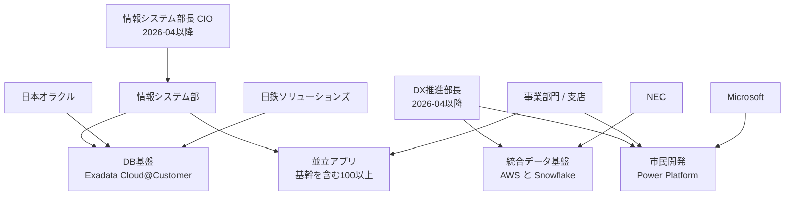

「350億円かけた基幹システム刷新を、ベンダー丸投げせずIT部門主導で完遂した」。こういう見出しは、社内稟議の資料に貼りたくなります。ただ、貼る前に確かめておきたいことがあります。**その金額は何の金額で、「完遂」はどのレイヤの完遂なのか**です。

この記事では、2026年8月に報じられた大東建託の基幹刷新事例を題材に、公開されている一次情報（IR、リリース、DX戦略資料、ベンダー発表、会社ブログ）だけを突き合わせて、次を整理します。

- 報道の見出しと、公式資料で確認できる事実のズレ
- 大規模刷新の「完了」を、なぜレイヤ別に定義しないと誤読するのか
- 「内製化」を実装比率ではなく**主権**で測るときの、具体的な測り方

対象読者は、基幹刷新やモダナイゼーションを発注する側の方、他社事例を自社の意思決定に持ち込む立場の方です。特定企業の是非を論じるのが目的ではなく、**事例を読むときの検証手順**を残すのが目的です。

:::message
本文の事実関係は2026年8月24日時点の公開情報に基づきます。有料記事の本文は参照していないため、そこにしか書かれていない内訳が存在する可能性は残ります。
:::

*この記事の全体像。以下、順に解説します。*

## 報道の読みと、公開情報で確認できる読み

まず結論を先に置きます。報道の見出しをそのまま受け取る読み方と、公開されている一次情報に合わせた読み方は、次のように分かれます。

| 基準 | 見出しの読み | 一次情報に合わせた読み |
|---|---|---|
| 投資 | 基幹刷新の確定実績350億円 | 3年間のIT・DX投資計画枠300億円以上。基幹専用の実績額は非公開 |
| 完了 | プロジェクト完遂 | データベース基盤の移行開始、一部処理の性能改善、アプリケーションは並立 |
| 内製 | IT部門が実装を貫いた | 制度・組織・兼務体制は自社。設計構築はパートナーが支援 |
| 順序 | 刷新の後にAI・市民開発 | 人材育成と一部AIが先行し、基盤刷新が後追い |
| 使える示唆 | 成功事例の模倣 | 「主権」の操作的定義を契約とRACIに落とす |
| 主なリスク | 過大な一般化 | 非公開のゲートを「存在しない」と誤読する |

見出しの読みが正しくなる条件は明確です。有料本文が350億円の内訳と完了定義を当事者の発言で固定し、全レイヤのカットオーバー完了を示すこと。その確認が取れない限りは、右列で読むのが安全です。

## なぜ「1本の完了プロジェクト」として読むと誤るのか

公開情報を並べると、進行しているものは1本ではなく、**完了時点が揃わない4つのレイヤ**であることが分かります。

図は2026年4月1日以降の体制です。2026年3月までは、同一の執行役員が情報システム部長・CDO・DX推進部長を兼務していました。

レイヤごとに、公開情報が示している進捗の質が違います。

| レイヤ | 公開情報が示す状態 | 情報の種類 |
|---|---|---|
| DB基盤 | 約40のデータベースをExadata Cloud@Customerへ**移行開始**（2026年3月30日発表） | ベンダー発表 |
| 統合データ基盤 | 100以上のシステムが個別にデータを保有。統合基盤の構築を**開始**（2024年5月） | 会社ブログ |
| アプリケーション | 基幹を含む100以上が並立 | 会社ブログ |
| 市民開発 | Power Platform。本社と一部支店で稼働、全社展開は予定（2024年6月時点） | 会社メディア |

DBのリフトとアプリケーションの刷新を同一視すると、並立する100超のアプリケーションが視界から消えます。2026年3月の「移行開始」と2026年8月の「完遂」は5か月しか離れておらず、40データベースすべてのカットオーバー完了は公開情報からは確認できません。

**自社案件に持ち帰るなら、この4レイヤ分解そのものが最初の成果物です。** 完了定義をレイヤ別に書き分けないと、稟議では「刷新完了」と言いながら現場では並立アプリが残る、という状態を説明できません。

## 350億円という数字はどこから来たのか

公式資料で確認できる金額は、350億円ではありません。

- 2024年5月2日のリリース: 設備投資は「3年で600億円以上（うちIT・DX 300億円以上）」
- IR中期経営計画ページ（2026年8月24日時点）: 本文は「計画期間中には600億円の設備投資」、表は「3年で600億円以上」。IT・DXは「300億円以上」「予定」
- DX戦略PDF、中期経営計画ページ、リリース本文に「350億円」の記載は見当たらない

つまり公式で確認できるのは、**FY2024-2026のIT・DX全般に対する計画下限**です。この枠には人材育成、データ基盤、生成AI環境、基幹モダナイゼーションが同居します。基幹刷新だけの実績額ではありません。

350億円という数字の候補は、少なくとも2つ考えられます。

1. 中期経営計画の「IT・DX 300億円以上」の丸め
2. 週刊ダイヤモンド（2024年9月23日）が会社コメント付きで報じた、家賃管理基幹のオープン化案件（2013年着手、当初193億円から357億円へ、完成予定2025年、工期は4回延伸）

どちらも公式一次資料が「350億円」と書いているわけではありません。特に2つ目は、**工期延伸と予算膨張の記録**であり、成功ナラティブの反証材料にもなります。同一案件かどうかは公開情報では確認できません。

もう1つ、実務で踏みやすい罠があります。決算資料に現れる「現金及び現金同等物の増減 350億円」はキャッシュフロー項目であり、IT投資額ではありません。数字検索で拾ったスニペットをそのまま投資額として引用しないことです。

:::message alert
他社事例の金額をベンチマークに使う前に、**その金額が計画値か実績値か、対象範囲は何か**を一次資料で確認してください。この事例では、計画値・全社IT枠・非公開の実績が混ざっています。
:::

## 検証できる中核は、性能とコストの数字

金額と「完遂」の解像度は低い一方で、基盤刷新そのものには検証可能な数字が発表されています。

- 会計、営業支援、社内ポータルなど60以上の基幹業務が使う約40のデータベースを、Oracle Exadata Cloud@Customer上のExadata Database Serviceへ寄せる
- ETL処理: 約1時間から約15分へ（達成形で発表）
- 月次請求処理: 約306分から約141分へ（達成形で発表）
- 構築コスト約25%減、運用コスト約32%減（オンプレミス更改比の**見込み**）

ここで注意したいのは、**達成形と見込みが混在している**ことです。処理時間は達成値、コスト削減は見込み値。事例を引用するときにこの区別を落とすと、「コスト32%減を実現した企業がある」という誤った要約が生まれます。

製品選定の理由も明快で、既存のOracle RACとの親和性が挙げられています。脱Oracleの事例ではありません。設計・構築支援は日鉄ソリューションズが担い、対外発表の主語は日本オラクルです。

## IT部門主導とベンダー依存は同時に成り立つ

「内製を貫いた」という表現は、実装比率の話にすると公開情報と矛盾します。確認できる範囲では次のとおりです。

| 領域 | 自社が持っているもの | 外部が担っているもの |
|---|---|---|
| 組織 | 2021年にDX推進室を独立。2026年3月まで情シスとDXの長を兼務 | — |
| DB基盤 | 製品選定理由を自社課長が説明 | 設計・構築支援は日鉄ソリューションズ、運用管理はOracle |
| データ基盤 | 全体デザインの意思決定 | NECが週2日常駐して相談に対応 |
| 市民開発 | 認定制度、コミュニティ運営 | コミュニティに外部ベンダーが参加 |
| AI | 全社員向けAIアシスタントは社内完結の内製と説明 | 高度な業務AIは社外パートナー |

この並びから言えるのは、**「丸投げではない」は支持できるが、「実装まで内製で貫いた」は支持できない**ということです。自社が持っているのは、優先順位を決める装置と人材制度です。

そこで内製を測る軸を、実装比率から**主権**へ置き換えます。主権とは、業務モデル・優先順位・移行判定・ベンダー成果物の受け入れを自社が持っているか、です。この軸で公開情報を点検すると、こうなります。

| 問うべき主権 | 公開情報で見えるもの | 見えないもの |
|---|---|---|
| 誰が投資枠を決めたか | 中期経営計画の設備投資方針 | 基幹専用の実績額 |
| 誰が製品を選んだか | RAC親和性を理由とする説明 | 選定会議、段階ゲート |
| 誰が設計し切ったか | パートナーが設計・構築を支援 | 自社の詳細設計比率 |
| 誰が移行判定するか | 未公開 | UAT、カットオーバー権限、障害時の最終判断者 |
| 誰が刷新後に改善するか | 認定制度、市民開発コミュニティ、社内アワード | 基幹そのものの継続改修能力 |

**穴は「受け入れRACIと障害時の最終判断者が公開されていない」ことです。** ここが空白のまま「内製で勝てた事例」として引用するのは危険です。

なお、当事者が「職種単位の優先順位は正直ない」「ほぼ全職種を並行してAIに取り組む」と述べている取材記事もあります。主権の定義に「優先順位を持つこと」を含めるなら、この発言は主権の評価を弱める方向に働きます。事例を読むときは、都合のよい発言だけを拾わないことです。

## 刷新後に改善し続ける力はあるか

もう1つの論点は、刷新が終わったあとに自社で改善し続けられるかです。この会社は、人材認定と市民開発という形で可視化しています。

- 社内認定は研修修了状況に基づく4段階（Beginner / Bronze / Silver / Gold）
- 2025年度実績は、Beginner 7,037名、Bronze 2,545名、Silver 274名、Gold 71名（合計9,927名）
- 2030年目標は Gold 200名、Silver 800名
- 社内DXアワードの応募は234件。最大効果の市民開発アプリは年間1,270万円以上の人件費削減と会社ブログが記載

グループ従業員は約18,000人超と発表されているので、Beginnerは相当な比率まで届いています。一方で、上級層はまだ薄いことが数字から読めます。

ここでも読み方の注意が2つあります。

1. **認定人数は活動量のKPIであり、基幹刷新の投資回収KPIではありません。** 混ぜて語ると、投資判断の材料になりません。
2. 集計定義が資料間でずれる余地があります。DX戦略PDFのスナップショット（2026年1月末、合計8,325名）とWebページの2025年度実績（合計9,927名）は時点が違い、さらに会社ブログの図には「複数資格は上位のみ加算」という注記があります。**他社数字を自社目標に転記する前に、集計定義を確認してください。**

市民開発については、過去2度うまくいかなかったという報道があり、それを会社のDXページ自身がリンクしています。失敗を隠していない点は参考になります。同時に、BIの定着が難しいことは当事者自身が述べており、**基盤が未完のまま市民開発を全社展開すると同じ失敗が再発しうる**という自己認識も示されています。

## 発注側が持ち帰れること

事例から模倣すべきものと、してはいけないものを分けます。

**模倣しないもの**

- 「350億円完遂」をベンチマーク金額にすること。公式に確認できるのは3年で300億円以上の計画枠です
- 「基盤刷新が終わってからAIへ進む」という順序。この事例では、人材育成と一部AIが基盤より先行しています

**模倣するもの**

- 情報システム部門とDX推進部門の長を整理し、ベンダー窓口を二重化しない体制
- 認定制度を研修修了ベースで始めて裾野を広げ、上位認定を事業変革リーダーに接続する設計
- 市民開発が一度失敗しても、ツールを変えるのではなく支援コミュニティと権限設計を変えて再挑戦すること

**契約に落とすべき主権**

次の6点を、自社の役職名で設計書の1ページ目に書きます。「内製率○%」という目標値は二次指標に落とします。

1. 業務モデルの決定者
2. 優先順位の決定者
3. 移行判定（カットオーバー可否）の責任者
4. 成果物受け入れの責任者
5. 障害時の停止判断者
6. 次期更改の決定者

**他社事例を読むときの検証手順**

1. 案件をアプリケーション / DB / データ / 市民開発の4レイヤに分け、完了定義をレイヤ別に書く
2. ベンダー発表の主語と、当該企業のIR資料の主語が一致するか確認する
3. 数字が達成値か見込み値か、計画か実績かを1つずつラベル付けする
4. 有料記事の見出しにしか存在しない数字は、稟議の根拠に使わない

## この事例で、まだ分かっていないこと

公開情報だけでは埋まらない空白を、あえて明示しておきます。ここを「無い」ではなく「未公開」として扱うことが、事例の誤読を防ぎます。

- 350億円の定義、対象システム、完了基準
- 約40データベースの移行完了率、残るアプリケーションのリライト有無
- 段階ゲート、UAT責任、障害時の最終判断者
- 認定者数がユニーク人数かランク合算か
- 市民開発が2度うまくいかなかった具体的な要因
- 3,000人工削減（2027年度予定）、運用費7.04億円削減（2025年度予定）の実績クローズ

意思決定への影響はこう切り分けられます。金額と完了宣言を根拠に「大規模刷新は内製で勝てる」と社内稟議に使うのは、現時点では止めたほうが安全です。一方で、「主権を自社に残す組織設計」の参考にするのは、確信度を中程度に保ったまま進めて構いません。

## まとめ

- 「350億円」は公式一次資料に見当たらず、確認できるのは3年でIT・DX 300億円以上という**計画枠**です
- 「完遂」と報じられた対象は、公開情報では約40データベースの**移行開始**であり、アプリケーションは100以上が並立しています
- 検証できる成果は、ETL 約1時間→約15分、月次請求 約306分→約141分という達成値です。コスト削減率は見込み値であり、区別が必要です
- 「内製」は実装比率ではなく主権（業務モデル・優先順位・移行判定・受け入れ）で測るべきで、この事例では**受け入れRACIと障害時の最終判断者が非公開**という穴があります
- 他社事例を持ち帰るときは、4レイヤ分解・主語の一致確認・達成値と見込み値のラベル付けを機械的に行うと、見出しに引きずられずに済みます

事例そのものは、組織設計と人材制度の面で参考になる部分が多くあります。ただし持ち帰るべきは金額と完了宣言ではなく、**主権をどこに置いたかという構造**です。

この記事が少しでも参考になった、あるいは改善点などがあれば、ぜひリアクションやコメント、SNSでのシェアをいただけると励みになります！

## 参考リンク

一次・準一次情報:

- [大東建託 中期経営計画 FY2024-2026](https://www.kentaku.co.jp/ir/management/midplan/)
- [大東建託グループ中期経営計画の要旨について（2024-05-02）](https://www.kentaku.co.jp/news/release/2024/release_managementplan_240502.html)
- [大東建託 DX戦略](https://www.kentaku.co.jp/sustainability/dx/)
- [大東建託 DX戦略PDF（2024-09-30策定 / 2026-04-14改定）](https://www.kentaku.co.jp/sustainability/dx/pdf/dx_senryaku.pdf)
- [審査AIシステムに関する会社ブログ（2023-09-12）](https://www.kentaku.co.jp/sustainability/blog/dx-yachinshinsa_20230912.html)
- [社内DXプラットフォームに関する会社ブログ（2024-05-29）](https://www.kentaku.co.jp/sustainability/blog/datadx_20240529.html)
- [2025年度 人材育成の経過（2025-09-29）](https://www.kentaku.co.jp/sustainability/blog/dxaward_20250929.html)
- [大東建託 役員紹介](https://www.kentaku.co.jp/corporate/outline/executive.html)
- [dotDataを活用した予防型内部監査（2026-07-08）](https://www.kentaku.co.jp/news/release/2026/release_AIkansa_20260708.html)
- [日本オラクル発表（PR TIMES）](https://prtimes.jp/main/html/rd/p/000000464.000057729.html)
- [同発表の転載（ASCII.jp、2026-03-30）](https://ascii.jp/elem/000/004/385/4385190/)

二次情報（本文中で区別して扱ったもの）:

- [日経クロステック（2026-08-24）](https://xtech.nikkei.com/atcl/nxt/column/18/01159/081000085/)
- [日本経済新聞「2度の失敗を経た全社DX」（2026-06-19）](https://www.nikkei.com/article/DGXZQOUC042FN0U6A600C2000000/)
- [BUILT（2024-05-07）](https://built.itmedia.co.jp/bt/articles/2405/07/news055.html)
- [東洋経済オンライン NECブランド企画（2024-03-21）](https://toyokeizai.net/articles/-/734359)
- [グロービス学び放題 導入事例](https://gce.globis.co.jp/service/hodai/case/kentaku/)
- [Yahoo!ニュース エキスパート 土橋克寿](https://news.yahoo.co.jp/expert/articles/c13a4250457992c08ae3abdc66d0a4a0cb746b53)
- [週刊ダイヤモンド（2024-09-23）](https://diamond.jp/articles/-/350761)
