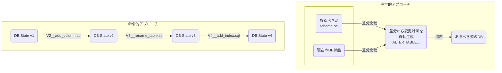
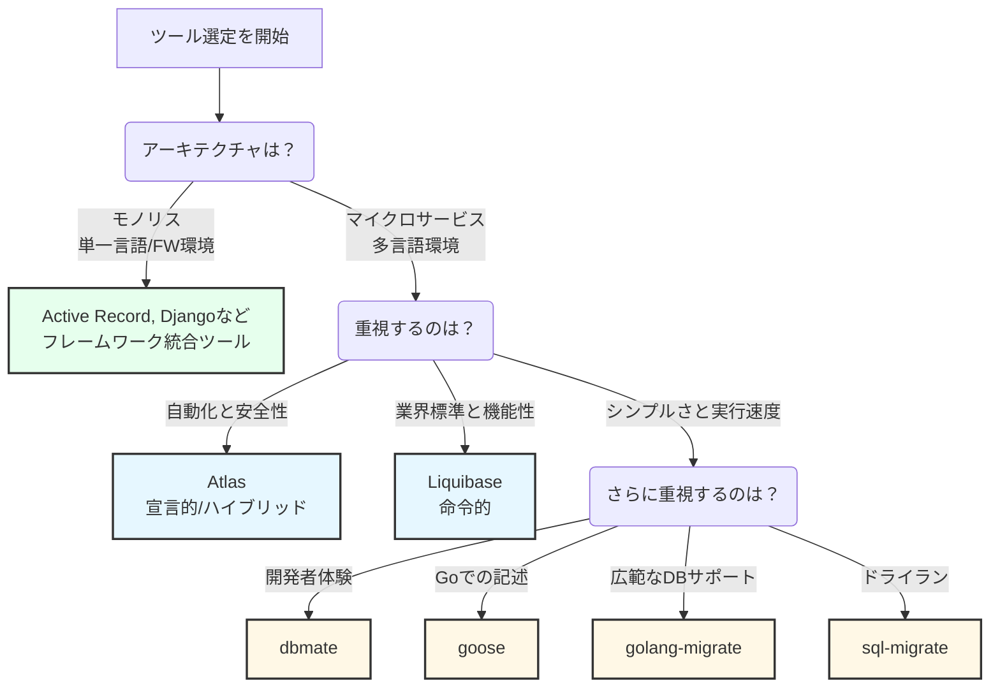

「手動でのスキーマ変更で、本番環境に意図しない差分が生まれてしまった」「レビューが困難なマイグレーションファイルによって、ヒューマンエラーが頻発している」「これらを避けるために、リリース手順に時間を割かれている」…このような課題に直面していませんか？

手動でのスキーマ変更は、こうしたエラーの温床であり、現代の高速な開発サイクルにおいて深刻なボトルネックになり得ます。この課題を解決するのが、データベースへの変更をバージョン管理し、複数環境間での一貫性を保ち、煩雑な手作業を自動化する「データベースマイグレーションツール」です。

適切なツールの選定は、単なる利便性の向上に留まりません。開発の生産性、デプロイの安全性、そして将来のアーキテクチャの柔軟性まで、長期にわたり影響を及ぼす重要な技術的意思決定と言えるでしょう。

## ■データベースマイグレーションの2つのアプローチ

データベースマイグレーションツールは、その設計思想によって「命令的アプローチ」と「宣言的アプローチ」の2つに大別されます。まずはこの違いを理解することが、ツール選定の第一歩です。

### ●命令的アプローチ（Imperative Approach）

データベースをある状態から次の状態へ移行させるための「手順書（SQLスクリプト）」を、バージョン番号を付けて一つずつ実行していく方法です。

  - **利点**
      - 開発者がすべてのSQL文を完全にコントロールできる。
      - 実行内容が明確で、結果を予測しやすい。
      - 複雑なデータ移行や変換処理も自由に記述できる。
  - **欠点**
      - 開発者が正確で、かつ安全にロールバック（元に戻す）できるスクリプトを作成する責任を負う。
      - ツール外での手動変更などによる**スキーマドリフト**（※）が発生しやすい。
      - 多くのスクリプトが積み重なると、現在のスキーマに至るまでの変更履歴を追うのが大変になる。
  - **代表的なツール**
      - Flyway, Liquibase, golang-migrate, goose, dbmate

:::message
**スキーマドリフトとは？**
バージョン管理されているマイグレーションファイルが示す「あるべきスキーマの姿」と、実際のデータベースの状態が、管理外の変更によって乖離してしまう問題のこと。
:::

### ●宣言的アプローチ（Declarative Approach）

スキーマの「最終的なあるべき姿」をコードで定義し、ツールが現在のデータベース状態と比較して、その姿に至るためのALTER文などを自動的に生成・実行する方法です。

  - **利点**
      - スキーマドリフトを自動で検出し、修正できる。
      - マイグレーションスクリプトを手で書く手間が大幅に削減される。
      - スキーマ定義ファイルが、常に信頼できる唯一の情報源（Single Source of Truth）となる。
  - **欠点**
      - ツールが生成するSQLを完全に制御できない場合がある。
      - ツールの意図しない挙動（例：カラム名の変更を「DROP & CREATE」と誤認する）のリスク。
      - データの変換や移行といった複雑な操作の扱いが課題となることがある。
  - **代表的なツール**
      - Atlas

### ●ハイブリッドアプローチ：双方の利点を両立

宣言的アプローチの**自動化**と、命令的アプローチの**制御性**を組み合わせた、いわば「良いとこ取り」の新しい手法です。宣言的なエンジンを用いて、「あるべき姿」からバージョン管理された命令的スクリプト（手順書）を**自動生成**します。

このアプローチは、コードレビュー可能で安全なSQLスクリプトを維持しつつ、宣言的ツールの「手間を省き、ミスを防ぐ」というメリットを享受したいという現代的なニーズに応えます。

  - **代表的なツール**
      - Atlas

## ■ツールの統合モデル

ツールは、特定のフレームワークから独立しているか、密接に統合されているかによっても分類できます。

### ●スタンドアロンツール

特定のアプリケーションフレームワークやORMに依存しない、自己完結型のツールです。主にコマンドラインインターフェース（CLI）として提供されます。

  - **利点**
      - Go、Python、Node.jsなど異なる言語（ポリグロット）で構成されるマイクロサービスアーキテクチャでも、データベース管理ツールを統一できる。
      - 組織全体のデータベース変更管理プロセスを標準化できる。
  - **背景**
      - マイクロサービスアーキテクチャの普及により、各サービスが最適な言語で開発されるケースが増えました。スタンドアロンツールは、このような環境で知識のサイロ化を防ぎ、運用の一貫性を保つために重要な役割を果たします。
  - **代表的なツール**
      - Flyway, Liquibase, Atlas, dbmate, goose

### ●フレームワーク統合ツール

特定の言語、フレームワーク、またはORM（Object-Relational Mapper）と密接に結合したツールです。

  - **利点**
      - アプリケーションのモデル定義を変更すると、対応するマイグレーションスクリプトを自動生成してくれるなど、シームレスで非常に優れた開発者体験を提供する。
  - **代表的なツール**
      - Active Record Migrations (Ruby on Rails)
      - Django Migrations
      - Alembic (Python/SQLAlchemy)
      - Laravel Migrations

## ■ツール分類の概要

本稿で分析する主要なツールを、アプローチと統合モデルの2軸で分類します。

| ツール名 | 主要言語/エコシステム | マイグレーション哲学 | 統合モデル |
| :--- | :--- | :--- | :--- |
| [Flyway](https://github.com/flyway/flyway) | Java | 命令的 | スタンドアロン |
| [Liquibase](https://github.com/liquibase/liquibase) | Java | 命令的 | スタンドアロン |
| [Atlas](https://github.com/ariga/atlas) | Go (言語非依存) | **宣言的/ハイブリッド** | スタンドアロン |
| [golang-migrate](https://github.com/golang-migrate/migrate) | Go | 命令的 | スタンドアロン |
| [goose](https://github.com/pressly/goose) | Go | 命令的 | スタンドアロン |
| [dbmate](https://github.com/amacneil/dbmate) | Go (言語非依存) | 命令的 | スタンドアロン |
| [sql-migrate](https://github.com/rubenv/sql-migrate) | Go | 命令的 | スタンドアロン |
| [Active Record Migrations](https://github.com/rails/rails) | Ruby (Rails) | 命令的 | フレームワーク統合 |
| [Django Migrations](https://github.com/django/django) | Python (Django) | 命令的 | フレームワーク統合 |
| [Alembic](https://github.com/sqlalchemy/alembic) | Python (SQLAlchemy) | 命令的 | フレームワーク統合 |
| [Laravel Migrations](https://github.com/laravel/framework) | PHP (Laravel) | 命令的 | フレームワーク統合 |
| [Knex.js](https://github.com/knex/knex) | Node.js (JavaScript/TypeScript) | 命令的 | フレームワーク統合 |

## ■スタンドアロンマイグレーションツールの詳細

特定のフレームワークに依存しない独立したツールの詳細を紹介します。これらのツールは、マイクロサービスアーキテクチャや多言語環境での利用に適しています。

### ●Javaエコシステム：業界標準の2ツール

FlywayとLiquibaseは、Javaエコシステムで生まれ、長年にわたり業界標準としての地位を確立しています。

#### ▷Flyway

「設定より規約（Convention over Configuration）」を重視する、シンプルで人気の高いツールです。主にプレーンなSQLスクリプトでマイグレーションを管理します。

  - **マイグレーション形式**: `V<VERSION>__Description.sql`という命名規則のSQLファイル。Javaベースのマイグレーションもサポート。
  - **主要コマンド**: `migrate`, `clean`, `info`, `validate`, `baseline`, `repair`。
  - **履歴テーブル**: `flyway_schema_history`テーブルで適用済みマイグレーションを追跡。
  - **ドライラン**: `dryRunOutput`設定で、実行予定のSQLをファイルに出力可能。
  - **ロールバック**: `undo`コマンドは**商用機能**（Flyway Teams/Enterprise）であり、Community Editionでは利用不可。
  - **スキーマ差分検出**: 2つのスキーマを比較してスクリプトを自動生成する機能も**商用機能**。
  - **対応データベース**: SQLおよび一部のNoSQLを含む50以上のプラットフォームをサポート。

#### ▷Liquibase

柔軟性と抽象化能力が特徴の、非常に高機能なツールです。SQLだけでなく、データベースに依存しないXML、YAML、JSON形式で変更を記述できます。

  - **マイグレーション形式**: SQL形式に加え、XML、YAML、JSON形式の「チェンジログ」をサポート。
  - **主要な概念**: 変更の単位は`changeset`と呼ばれ、`id`, `author`, `filepath`で一意に識別。
  - **履歴テーブル**: `DATABASECHANGELOG`（変更履歴）と`DATABASECHANGELOGLOCK`（実行ロック）で管理。
  - **ドライラン**: `updateSQL`コマンドで、適用前に実行されるSQLを確認可能。
  - **ロールバック**: コア機能として`rollback`コマンドを強力にサポート。
  - **スキーマ差分検出**: `diff`と`diffChangeLog`コマンドがオープンソース版で提供され、データベース間の差分を検出可能。
  - **データシーディング**: `loadData`変更タイプでCSVファイルからデータを投入可能。
  - **対応データベース**: 60以上のプラットフォームをサポート。

#### ▷FlywayとLiquibaseの比較

両ツールは業界のリーダーですが、オープンソース版で提供される機能に大きな差があります。特に、スキーマの差分検出とロールバックは、安全な変更管理ワークフローにおいて極めて重要な機能です。

| 機能 | Flyway Community Edition | Liquibase (Open Source) |
| :--- | :--- | :--- |
| **スキーマ差分検出** | 商用機能 | **標準機能** |
| **ロールバック** | 商用機能 | **標準機能** |

### ●Goエコシステム：シンプル＆高速

Go言語製のツールは、シンプルさ、パフォーマンス、単一バイナリとして配布できる手軽さから人気を集めています。

#### ▷golang-migrate/migrate

  - **特徴**: Go製ツールで最も人気（GitHubスター数 17.2k）。多数のデータベースドライバと多様なマイグレーションソースをサポート。
  - **形式**: タイムスタンプまたはシーケンス番号を付与した`up`/`down`形式のSQLファイル。
  - **制約**: 差分検出やネイティブなドライラン機能は提供されていません。

#### ▷pressly/goose

  - **特徴**: SQLファイルに加え、Goのネイティブ関数でマイグレーションを記述可能。複雑なデータ変換に強力。
  - **履歴テーブル**: `goose_db_version`。

#### ▷amacneil/dbmate

  - **特徴**: 開発者体験とシンプルさに焦点。`schema.sql`ファイルを自動でダンプ・管理し、スキーマ全体のバージョン管理と差分確認を容易にします。
  - **履歴テーブル**: `schema_migrations`（カスタマイズ可能）。

#### ▷rubenv/sql-migrate

  - **特徴**: `--dryrun`フラグがあり、実行されるSQLを事前にプレビューできるのが強みです。
  - **形式**: `-- +migrate Up`と`-- +migrate Down`コメントを用いた`up`/`down`形式のSQLファイル。

### ●宣言的アプローチの革新：Atlas

「Schema as Code」の原則をデータベース管理にもたらす、モダンで言語非依存のツールです。

  - **ワークフロー**
      - **宣言的 (`schema apply`)**: あるべきスキーマ（HCL、SQL等）とターゲットデータベースの差分を計算し、適用。スキーマドリフト防止に絶大な効果を発揮します。
      - **バージョン管理 (`migrate diff`)**: あるべきスキーマと現在のマイグレーションディレクトリの状態を比較し、新しいバージョン管理されたSQLファイルを**自動生成**（ハイブリッドアプローチ）。
  - **主な特徴**
      - **自動計画**: SQLマイグレーションを手書きする手間を削減。
      - **スキーマのリント (`migrate lint`)**: 破壊的な変更やパフォーマンスに影響のある変更を自動検出し、CIパイプラインに統合可能。
      - **安全なロールバック (`migrate down`)**: `down`スクリプトに頼らず、適用前後のスキーマ定義からロールバック計画を自動計算。
      - **履歴テーブル**: `atlas_schema_revisions`（カスタマイズ可能）。

## ■フレームワーク統合ツールの詳細

特定のアプリケーションフレームワークやORMと密接に連携するツールの詳細を紹介します。

### ●共通のパラダイム：ORM駆動のマイグレーション生成

これらのツールは、アプリケーションのモデル定義（クラスなど）を信頼できる唯一の情報源とし、そこからマイグレーションスクリプトを自動生成します。これにより、開発者はモデルとデータベーススキーマの同期を気にすることなく、効率的なフィードバックループを得られます。

### ●各ツールの特徴

  - **Active Record Migrations (Ruby on Rails)**
      - このパラダイムの先駆的実装。Ruby DSLでスキーマ変更を記述。`up`/`down`または可逆的な`change`メソッドを使用。データシーディングは`db/seeds.rb`ファイルで処理。
  - **Django Migrations (Python)**
      - `makemigrations`コマンドがモデルの変更を検出し、ファイルを自動生成。スキーマ変更に加え、`RunPython`操作によるデータ移行も強力にサポート。
  - **Alembic (for SQLAlchemy, Python)**
      - SQLAlchemyエコシステムの標準ツール。`autogenerate`機能でモデルとデータベースを比較し、スクリプトを作成。Gitのようなブランチングとリビジョンモデルが特徴。
  - **Laravel Migrations (PHP)**
      - `up`/`down`メソッドを持つPHPクラスで変更を定義。ロールバック、リセット、リフレッシュ用のコマンドが豊富。データシーディングは独立した「シーダー」システムで処理。
  - **Knex.js (Node.js)**
      - JavaScript/TypeScript向けのSQLクエリビルダーが提供するマイグレーションシステム。`up`/`down`関数をエクスポートするファイルでマイグレーションを定義。独立したシーディング機能を持つ。

## ■機能比較

各ツールを横断的に比較します。

### ●機能比較マトリクス

| ツール | カテゴリ | スキーマ差分/自動生成 | ドライラン | ロールバック機構 | データシーディング | 履歴テーブル (デフォルト) |
| :--- | :--- | :--- | :--- | :--- | :--- | :--- |
| **Flyway** | Java/スタンドアロン | 商用機能 | あり | 手動 U\*.sql (undoは商用) | SQLマイグレーションとして | flyway\_schema\_history |
| **Liquibase** | Java/スタンドアロン | **あり** | **あり** | **あり (コマンド)** | loadData (CSV) | DATABASECHANGELOG |
| **Atlas** | Go/スタンドアロン | **あり** | **あり** | **自動生成** | SQLマイグレーションとして | atlas\_schema\_revisions |
| **golang-migrate**| Go/スタンドアロン | なし | なし | 手動 down.sql | SQLマイグレーションとして | schema\_migrations |
| **goose** | Go/スタンドアロン | なし | なし | 手動 down.sql / Go関数 | SQL / Goマイグレーションとして | goose\_db\_version |
| **dbmate** | Go/スタンドアロン | schema.sqlによるGit差分 | なし | 手動 down.sql | SQLマイグレーションとして | schema\_migrations |
| **sql-migrate** | Go/スタンドアロン | なし | **あり** | 手動 down.sql | SQLマイグレーションとして | migrations |
| **Active Record**| Ruby/統合 | **あり** | なし | down / changeメソッド | db/seeds.rb | schema\_migrations |
| **Django Migrations** | Python/統合 | **あり** | SQL表示 | migrateコマンド | RunPython操作 | django\_migrations |
| **Alembic** | Python/統合 | **あり** | SQL出力 | downgrade関数 | SQL/Pythonコードとして | alembic\_version |
| **Laravel Migrations**| PHP/統合 | **あり** | **あり** | downメソッド / rollback | Seederクラス | migrations |
| **Knex.js** | Node.js/統合 | なし | なし | down関数 / rollback | Seeder機能 | knex\_migrations |

### ●高度な機能に関する考慮事項

  - **ゼロダウンタイムデプロイメント**: PostgreSQLのコンカレントインデックス作成など、トランザクション外で実行する必要がある操作をサポートする機能が重要です（例：gooseの`-- +goose no transaction`）。
  - **チームワークフローとブランチング**: マイグレーションの衝突を避けるため、Alembicはブランチングモデルを、Atlasはインテグリティファイル(`atlas.sum`)を提供します。
  - **トランザクショナルDDL**: PostgreSQLのようにDDLをトランザクション内で実行できるデータベースでは、マイグレーションの安全性が向上します。多くのツールはこの機能を活用します。

## ■ツール選定のための意思決定フレームワーク

あなたのチームの状況と要件に応じて最適なツールを選定するためのフレームワークです。

### ●あなたのチームの状況を定義する質問リスト

1.  **エコシステムと言語**:
      - RailsやDjangoのような単一フレームワークのモノリスですか？
      - それとも、Go, Python, Node.jsなどが混在する多言語のマイクロサービスアーキテクチャですか？
2.  **チームの哲学と自動化への期待**:
      - SQLを完全に手でコントロールすることを好みますか？
      - それとも、ヒューマンエラーを防ぐ自動化を重視しますか？
3.  **リスク許容度と安全性**:
      - 問題発生時のロールバックは、どの程度重要ですか？
      - スキーマドリフトの防止や、危険な変更の自動検出をどの程度重視しますか？
4.  **データベース戦略**:
      - PostgreSQLなど、単一のデータベース技術を使用しますか？
      - 複数の種類のデータベースをサポートする必要がありますか？

### ●状況とツールのマッチング

上記の回答に基づき、具体的なシナリオ別の推奨ツールを以下に示します。

#### ▷シナリオ1：フレームワーク中心のモノリス開発

  - **推奨ツール**: **各種フレームワーク統合ツール**
      - Active Record Migrations (Rails), Django Migrations (Django) など
  - **理由**: ORMとの深い統合によるシームレスな開発者体験と高い生産性は、他の何物にも代えがたい強みです。モデル変更からマイグレーション生成までが一貫して行える効率性を最大限に活かすべきです。

#### ▷シナリオ2：多言語マイクロサービスを開発する組織

  - **推奨ツール**: **言語非依存のスタンドアロンツール**
      - **Liquibase**: 柔軟性、広範なDBサポート、そして無料版でも強力な機能（差分検出、ロールバック）を求める場合に最適な選択肢です。
      - **Go製ツール (dbmate, goose, golang-migrate)**: CIにおけるシンプルさと実行速度を優先する場合に優れています。特に`dbmate`は開発者体験を重視する場合におすすめです。
      - **Atlas**: 自動化、安全性、モダンなDevOpsプラクティスを最優先する場合の、最も未来志向の選択肢です。自動計画、リント機能、安全なロールバックがヒューマンエラーを劇的に削減します。

#### ▷シナリオ3：多様なニーズを持つエンタープライズ環境

  - **推奨ツール**: **商用サポートが充実したツール**
      - Liquibase Pro, Flyway Enterprise
  - **理由**: 大規模で複雑な環境に特化した高度な機能、専門的なサポート、ガバナンス機能を提供します。

## ■まとめ

データベースマイグレーションツールの選定は、技術スタックにおける根本的な決定であり、プロジェクトの成功を左右します。この記事では、ツールが**命令的か宣言的か**、**スタンドアロンかフレームワーク統合か**という2軸で整理できることを解説しました。

最終的な決定は、この記事で提示したフレームワークを参考に、あなたのチームの技術的背景、アーキテクチャ戦略、そして将来のビジョンを反映するべきです。重要なのは、単に流行りのツールを選ぶのではなく、「なぜそのツールが自分たちに最適なのか」を明確に説明できることです。

  * **Flyway**と**Liquibase**は長年の業界標準ですが、オープンソースで提供される機能セット、特に安全性に関わる機能には明確な違いがあります。
  * **Goエコシステム**のツールは、軽量かつ高速なソリューションを提供します。
  * **Atlas**は、「Schema as Code」という新しいパラダイムを提示し、自動化と安全性で大きな革新をもたらしています。
  * **フレームワーク統合ツール**は、各エコシステム内で比類のない生産性を発揮します。

この記事が、あなたのチームにとって最適なツールを選び、より安全で生産性の高い開発プロセスを構築するための一助となれば幸いです。

この記事が少しでも参考になった、あるいは改善点などがあれば、ぜひリアクションやコメント、SNSでのシェアをいただけると励みになります！

---
## ■引用リンク

### ●全般・概念

#### ▷ 記事・ブログ
-   [The Data Engineers Guide to Declarative vs Imperative for Data - DataOps.live](https://www.dataops.live/blog/the-data-engineers-guide-to-declarative-vs-imperative-for-data)
-   [Declarative Schemas for simpler database management - Hacker News](https://news.ycombinator.com/item?id=43572544)
-   [Top 14 Cloud Migration Tools and How to Choose the Right One - Cortex](https://www.cortex.io/post/a-guide-to-cloud-migration-tools)
-   [Picking a database migration tool for Go projects in 2023 | Atlas](https://atlasgo.io/blog/2022/12/01/picking-database-migration-tool)
-   [Bytebase vs. Flyway: a side-by-side comparison for database schema migration](https://www.bytebase.com/blog/bytebase-vs-flyway/)

#### ▷ 公式ドキュメント
-   [Using the Automation Cloud Migration Tool - UiPath Documentation](https://docs.uipath.com/automation-cloud/automation-cloud/latest/admIN-guide/using-the-migration-tool)

### ●Flyway

#### ▷ 公式
-   [Flyway by Redgate • Database Migrations Made Easy. - GitHub](https://github.com/flyway/flyway)
-   [Redgate Flyway Community - Database migrations made easy](https://www.red-gate.com/products/flyway/community/)
-   [Documentation - Flyway by Boxfuse • Database Migrations Made ...](https://brunomendola.github.io/flywaydb.org/documentation/)
-   [Flyway Dry Run Output Setting - Redgate Flyway - Product ...](https://documentation.red-gate.com/fd/flyway-dry-run-output-setting-277578992.html)
-   [Tutorial - Dry Runs - Redgate Flyway - Product Documentation](https://documentation.red-gate.com/fd/tutorial-dry-runs-277579342.html)
-   [Supported databases and versions - Redgate Flyway - Product Documentation](https://documentation.red-gate.com/fd/supported-databases-and-versions-143754067.html)
-   [flywaydb.org/documentation/concepts/dryruns.md at gh-pages · flyway/flywaydb.org · GitHub](https://github.com/flyway/flywaydb.org/blob/gh-pages/documentation/concepts/dryruns.md)
-   [Would it be possible to use flyway to compare two database schemas and upgrade one's schema to match the other? #2667 - GitHub](https://github.com/flyway/flyway/issues/2667)

#### ▷ 記事・チュートリアル
-   [How to Effectively Manage Database Changes Using Flyway | by Ali Hamza - Medium](https://medium.com/h7w/how-to-effectively-manage-database-changes-using-flyway-66bacd158b7d)
-   [Using Flyway - Chado documentation](https://chado.readthedocs.io/en/rtd/using_flyway.html)
-   [Database Migrations with Flyway | Baeldung](https://www.baeldung.com/database-migrations-with-flyway)
-   [How to Perform Seamless Database Schema Migrations with Flyway - Chat2DB](https://chat2db.ai/resources/blog/database-schema-migrations-with-flyway)
-   [The Flyway Migrate Command Explained Simply - Redgate Software](https://www.red-gate.com/hub/product-learning/flyway/the-flyway-migrate-command-explained-simply)
-   [Rolling Back Migrations with Flyway | Baeldung](https://www.baeldung.com/flyway-roll-back)
-   [Paid Flyway Advantages–Undo and Check | Voice of the DBA](https://voiceofthedba.com/2022/10/31/paid-flyway-advantages-undo-and-check/)
-   [Comparing Databases and Generating Schema Models with Flyway - Redgate Software](https://www.red-gate.com/hub/product-learning/flyway/comparing-databases-and-generating-schema-models-with-flyway)
-   [Using the new Flyway Diff commands - Redgate Software](https://www.red-gate.com/blog/using-the-new-flyway-diff-commands)
-   [Flyway diff tool - Stack Overflow](https://stackoverflow.com/questions/28319967/flyway-diff-tool)
-   [Flyway (software) - Wikipedia](https://en.wikipedia.org/wiki/Flyway_(software))

#### ▷ 動画
-   [Create a Dry Run Script with Flyway - YouTube](https://www.youtube.com/watch?v=pd2EdfwResU)
-   [Compare Databases and Generate Schema Models with Flyway | The Tony and Tonie Show](https://www.youtube.com/watch?v=ZFOSNfY5RDY)

### ●Liquibase

#### ▷ 公式
-   [liquibase/liquibase: Main Liquibase Source - GitHub](https://github.com/liquibase/liquibase)
-   [Liquibase: Database Change Management & CI/CD Automation | Database DevOps](https://www.liquibase.com/)
-   [Liquibase Community](https://www.liquibase.com/community)
-   [Liquibase Documentation](https://docs.liquibase.com/)
-   [Get Started | Core Liquibase Usage Concepts | Liquibase.org](https://www.liquibase.org/get-started/core-usage)
-   [Get Started | Core Liquibase Concepts | Author Database Changes](https://www.liquibase.org/get-started/core-usage/liquibase-core-concepts-author-database-changes)
-   [update-sql - Liquibase Documentation](https://docs.liquibase.com/commands/update/update-sql.html)
-   [update - Liquibase Documentation](https://docs.liquibase.com/commands/update/update.html)
-   [Update Commands - Liquibase Documentation](https://docs.liquibase.com/commands/update/home.html)
-   [diff - Liquibase Documentation](https://docs.liquibase.com/commands/inspection/diff.html)
-   [loadData - Liquibase Documentation](https://docs.liquibase.com/change-types/load-data.html)
-   [Maven updateSQL - Liquibase Documentation](https://docs.liquibase.com/tools-integrations/maven/commands/maven-updatesql.html)

#### ▷ 記事・チュートリアル
-   [How To Execute Database Migrations With Liquibase | by CT - Medium](https://medium.com/@tgt1022/how-to-execute-database-migrations-with-liquibase-9318b8e5da19)
-   [Liquibase: Liqui-basics | Credera](https://credera.com/en-us/insights/liquibase-liqui-basics)
-   [Does Liquibase support dry run? - General Discussion](https://forum.liquibase.org/t/does-liquibase-support-dry-run/2905)
-   [Will Liquibase updateSQL command line throw error if the changeset was already applied](https://stackoverflow.com/questions/24435001/will-liquibase-updatesql-command-line-throw-error-if-the-changeset-was-already-a)
-   [Detecting Database Changes to Improve Security & Quality - Liquibase](https://www.liquibase.com/blog/detecting-database-changes-to-improve-security-quality)
-   [Diffing Multiple Schemas in Liquibase](https://docs.liquibase.com/workflows/liquibase-community/diffing-multiple-schemas-in-liquibase.html)
-   [Liquibase diff change sets and a database - Stack Overflow](https://stackoverflow.com/questions/36295574/liquibase-diff-change-sets-and-a-database)
-   [What does loadData utility uses for Oracle? - Liquibase Forum](https://forum.liquibase.org/t/what-does-loaddata-utility-uses-for-oracle/7329)
-   [Liquibase load data in a format other than CSV - Stack Overflow](https://stackoverflow.com/questions/31488927/liquibase-load-data-in-a-format-other-than-csv)
-   [Which databases does Liquibase support? - Lemon.io](https://lemon.io/answers/liquibase/which-databases-does-liquibase-support/)

#### ▷ 動画
-   [Go Faster with Provisioning & Database Change with Open Source Tools - Liquibase](https://www.liquibase.com/videos/faster-data-provisioning-database-change)

### ●Atlas

#### ▷ 公式
-   [ariga/atlas: Manage your database schema as code - GitHub](https://github.com/ariga/atlas)
-   [Atlas | Manage your database schema as code](https://atlasgo.io/)
-   [Welcome to Atlas | Atlas | Manage your database schema as code](https://atlasgo.io/docs)
-   [Declarative vs Versioned Workflows | Atlas | Manage your database schema as code](https://atlasgo.io/concepts/declarative-vs-versioned)
-   [Migration Analyzers | Atlas | Manage your database schema as code](https://atlasgo.io/lint/analyzers)
-   [CLI Reference | Atlas | Manage your database schema as code](https://atlasgo.io/cli-reference)
-   [Versioned Migrations - ent](https://entgo.io/docs/versioned-migrations/)

#### ▷ 記事・チュートリアル
-   [Database migrations made easy with Atlas | by Glauber Costa | Turso blog - Medium](https://medium.com/chiselstrike/database-migrations-made-easy-with-atlas-df2b259862db)
-   [A Guide to Set Up Safe and Simple Database Schema Migration Workflow for SQLAlchemy with Atlas - Masato Naka](https://nakamasato.medium.com/a-guide-to-set-up-safe-and-simple-database-schema-migration-sqlalchemy-workflow-with-atlas-e5d1eb4363d5)

### ●golang-migrate

#### ▷ 公式
-   [golang-migrate/migrate: Database migrations. CLI and ... - GitHub](https://github.com/golang-migrate/migrate)
-   [postgres package - github.com/golang-migrate/migrate/v4/database/postgres - Go Packages](https://pkg.go.dev/github.com/golang-migrate/migrate/v4/database/postgres)

#### ▷ 記事・チュートリアル
-   [How to Perform Database Migrations using Go Migrate - freeCodeCamp](https://www.freecodecamp.org/news/database-migration-golang-migrate/)

### ●goose

#### ▷ 公式
-   [pressly/goose: A database migration tool. Supports SQL ... - GitHub](https://github.com/pressly/goose)
-   [Overview - pressly/goose](https://pressly.github.io/goose/)
-   [SQL file annotations - pressly/goose](https://pressly.github.io/goose/documentation/annotations/)

#### ▷ 記事・チュートリアル
-   [Goose: A Database Migration Tool for Go | Leapcell](https://leapcell.io/blog/goose-a-database-migration-tool-for-go)
-   [Moving to Migrate from Goose-Apache Mail Archives](https://lists.apache.org/thread/lrd7monm1cytgj45d0kg4lwh88hqyoqs)

### ●dbmate

#### ▷ 公式
-   [amacneil/dbmate: A lightweight, framework-agnostic ... - GitHub](https://github.com/amacneil/dbmate)

#### ▷ 記事・チュートリアル
-   [Dbmate: https://github.com/amacneil/dbmate I found most database migration tools... | Hacker News](https://news.ycombinator.com/item?id=27175432)
-   [dbmate: database schema migration tool with automatic support for .env files - feedback appreciated : r/golang - Reddit](https://www.reddit.com/r/golang/comments/6b5qbd/dbmate_database_schema_migration_tool_with/)
-   [Production-ready Backend with dbmate, PugSQL, PropelAuth, and FastAPI](https://www.propelauth.com/post/production-ready-backend-with-dbmate-pugsql-propelauth-and-fastapi)

### ●sql-migrate

#### ▷ 公式
-   [rubenv/sql-migrate: SQL schema migration tool for Go. - GitHub](https://github.com/rubenv/sql-migrate)

### ●Active Record (Ruby on Rails)

#### ▷ 公式
-   [Active Record Migrations — Ruby on Rails Guides](https://guides.rubyonrails.org/active_record_migrations.html)
-   [Migrations - Ruby on Rails Guides](https://guides.rubyonrails.org/v3.2/migrations.html) (旧バージョン)

### ●Django Migrations (Python)

#### ▷ 公式
-   [Migrations - Django documentation](https://docs.djangoproject.com/en/5.2/topics/migrations/)
-   [Migration Operations - Django documentation](https://docs.djangoproject.com/en/5.2/ref/migration-operations/)

#### ▷ 記事・チュートリアル
-   [Digging Deeper Into Django Migrations - Real Python](https://realpython.com/digging-deeper-into-migrations/)
-   [Django Basic App Model - Makemigrations and Migrate - GeeksforGeeks](https://www.geeksforgeeks.org/python/django-basic-app-model-makemigrations-and-migrate/)

### ●Laravel Migrations (PHP)

#### ▷ 公式
-   [Database: Migrations - Laravel 12.x - The PHP Framework For Web Artisans](https://laravel.com/docs/12.x/migrations)
-   [Database: Migrations - Laravel 5.7 - The PHP Framework For Web Artisans](https://laravel.com/docs/5.7/migrations) (旧バージョン)
-   [Generate migration - Laravel Doctrine](https://laraveldoctrine.org/docs/current/migrations/generate)

#### ▷ 記事・チュートリアル
-   [Laravel Migrations Guide: Simplify Database Version Control - Bacancy Technology](https://www.bacancytechnology.com/blog/laravel-migrations)
-   [Laravel Migrations: Manage Your Database Migrations with Our Guide - Butter CMS](https://buttercms.com/blog/laravel-migrations-ultimate-guide/)

### ●Knex.js (Node.js)

#### ▷ 公式
-   [Knex.js: SQL Query Builder for Javascript](https://knexjs.org/)
-   [Migrations | Knex.js](https://knexjs.org/guide/migrations)

### ●Entity Framework Core (C#/.NET)

#### ▷ 公式
-   [EF Core Database Migrations | ABP.IO Documentation](https://abp.io/docs/latest/framework/data/entity-framework-core/migrations)
