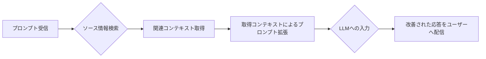
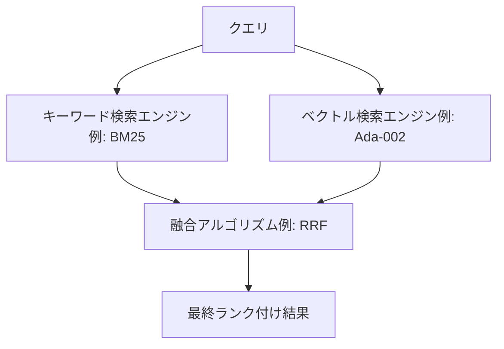
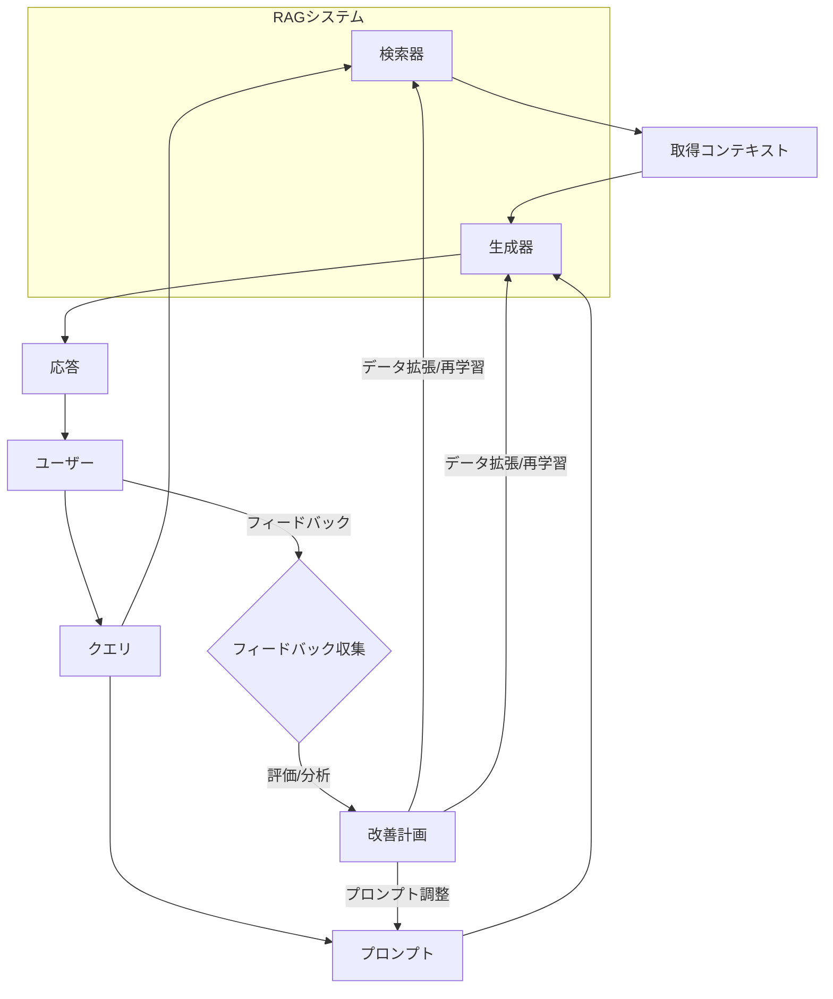
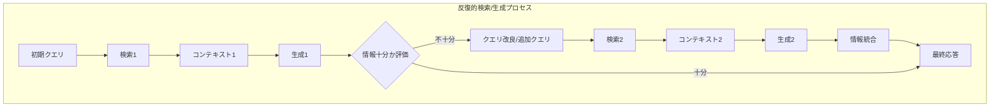

## 1. RAGと精度向上の重要性

### 1.1. 検索拡張生成（RAG）の定義

検索拡張生成（Retrieval Augmented Generation: RAG）は、検索ベースの手法と生成モデル（特に大規模言語モデル、LLM）を組み合わせる技術です。この技術は、特に自然言語処理（NLP）において出力を強化します 。RAGはLLMの出力を最適化するプロセスです。そのプロセスでは、LLMが訓練データ外の権威ある知識ベースを参照してから応答を生成します 。

RAGの基本的なメカニズムは、ユーザーのクエリ（プロンプト）に応じて関連性の高い文書やデータ断片を取得します。そして、これらの情報を後続のLLMが利用し、より正確で文脈に即した出力を生成します 。このプロセスは、一般的に以下のステップを含みます 。

| 要素名                                 | 説明                                                                 |
| :------------------------------------- | :------------------------------------------------------------------- |
| プロンプト受信                         | ユーザーからの質問や指示を受け付けます。                                   |
| ソース情報検索                         | 受け取ったプロンプトに基づいて、関連情報を含むデータソースを検索します。                 |
| 関連コンテキスト取得                   | 検索結果から、プロンプトに最も関連性の高い情報を抽出します。                         |
| 取得コンテキストによるプロンプト拡張   | 元のプロンプトに取得したコンテキスト情報を追加し、LLMへの指示をより明確にします。         |
| LLMへの入力                            | 拡張されたプロンプトを大規模言語モデルに入力します。                               |
| 改善された応答をユーザーへ配信         | LLMが生成した、より正確で文脈に即した応答をユーザーに提供します。                   |

RAGの重要な点は、モデルを再訓練することなくLLMの能力を特定のドメインや組織の内部知識ベースに拡張できることです 。これにより、広大なデータリザーブと精密な生成の必要性との間のギャップを埋めることができます 。

### 1.2. RAGシステムにおける精度の決定的役割

RAGシステムの精度は、ユーザーの信頼とシステムの信頼性に直接影響します。不正確なRAGシステムは誤情報を拡散させ、その有用性を低下させる可能性があります。

精度は、質疑応答、要約、そして事実の正確性を要求するコンテンツ生成などのタスクにおけるRAGの有効性に直接影響します 。例えば企業環境では、正確なRAGは意思決定のための信頼できる情報を提供することにより、業務効率を大幅に改善できます 。

RAGの主要な利点の一つは、ハルシネーションを削減する能力です。ハルシネーションとは、もっともらしいが事実とは異なる、あるいは誤解を招く情報のことです。RAGは、検証済みの取得文書に生成プロセスを固定することで、この問題を軽減します 。これはRAGを採用する主要な動機となっています。

### 1.3. RAGの精度を妨げる一般的な課題

RAGシステムの精度は、複数の段階で課題に直面する可能性があります。主な課題を以下に示します。

| フェーズ       | 課題内容                                                               |
| :------------- | :--------------------------------------------------------------------- |
| **検索フェーズ** | 無関係または不完全な文書の取得                                               |
|                | ユーザーのクエリ意図の誤解釈                                                 |
|                | 最適でないデータチャンキングによる、断片的または過剰なコンテキストの生成                   |
|                | ドメイン固有のニュアンスを捉える上での埋め込みモデルの限界                               |
| **生成フェーズ** | LLMによる提供コンテキストの見落としや誤解                                        |
|                | ノイズが多い、または矛盾するコンテキストの場合に持続するハルシネーション                  |
|                | 複数の取得文書からの情報を首尾一貫して統合することの難しさ                             |
| **システム全体** | 外部データの陳腐化（定期的な更新がない場合）                                       |
|                | 多コンポーネントシステムの評価とデバッグの複雑さ                                   |

RAGシステムの精度は、本質的に依存関係の連鎖の問題です。クエリ理解、検索、コンテキスト拡張、生成といったいずれかのコンポーネントの弱点が、エンドツーエンドの精度を不均衡に低下させる可能性があります。この相互接続性は、全体的な最適化が鍵であることを意味します 。

さらに、RAGにおける「精度」の定義は多面的です。事実の正確性だけでなく、関連性、一貫性、そしてソースへの忠実性も包含します。これは、評価もまた多面的である必要があることを示唆しています 。外部データの陳腐化の問題 は、単なるデータメンテナンスの問題ではありません。最新情報を提供するというRAGの約束に対する中核的な課題です。このため、RAGシステムの設計において、データ取り込みと更新のパイプラインを後付けではなく、不可欠な部分として組み込む必要があります 。

## 2. 優れた精度を実現するための検索フェーズの強化

検索フェーズの品質は、RAGシステム全体の精度に大きく貢献します。このセクションでは、検索精度を高めるための主要な戦略について説明します。

### 2.1. データ前処理とチャンキング戦略の最適化

「Garbage In, Garbage Out（ゴミを入れればゴミが出る）」の原則はRAGシステムにおいて極めて重要です。取得データの品質は、前処理とチャンキングに大きく左右され、RAGの有効性に直接影響します。不適切にセグメント化されたデータは、最適とは言えない結果につながります 。

**チャンクサイズとオーバーラップの影響**

チャンクサイズは非常に重要です。

  * 大きすぎるチャンク: 重要な詳細が薄れたり、LLMのトークン制限を超えたりする可能性があります。
  * 小さすぎるチャンク: コンテキストが失われたり、無関係な情報が混入したりする可能性があります 。

最適なチャンクサイズはタスクとデータに依存し、多くの場合実験が必要です 。小さなチャンクは詳細な検索を可能にしますが、コンテキストに欠けることが多いです。一方、大きなチャンクはより多くのコンテキストを保持しますが、特定のマッチを薄める可能性があります 。チャンクのオーバーラップは、チャンク境界を越えてコンテキストを維持し、重要な情報が失われないようにするのに役立ちます 。例えば、LangChainのCharacterTextSplitterはチャンクサイズとオーバーラップの指定を可能にします 。

**高度なチャンキング戦略**

以下に代表的なチャンキング戦略とその特徴を示します。

| 戦略名                      | 説明                                                                                             | メリット                                                                   | デメリット                                                                                       |
| :-------------------------- | :----------------------------------------------------------------------------------------------- | :------------------------------------------------------------------------- | :----------------------------------------------------------------------------------------------- |
| 固定長チャンキング          | テキストを単純に固定の文字数やトークン数で分割します。                                                               | 実装が容易です。                                                               | 文の途中で分割される可能性があり、コンテキストが失われることがあります 。                                   |
| セクションベース／文書要素チャンキング | 段落、見出し、リストアイテムなど、文書の構造的な要素に基づいて分割します。                                                     | 文書の構造を保持しやすいです。                                                           | 意味的な境界と一致しない場合や、詳細なチャンクが得られないことがあります 。                                 |
| 文チャンキング              | テキストを個々の文に分割します。                                                                     | 各チャンクが完全な思考を維持しやすいです。                                                     | 文の長さのばらつきが大きく、非常に短い文は非効率的なチャンクを生成する可能性があります 。                         |
| セマンティックチャンキング    | テキストの意味内容と言葉やフレーズ間の関係に基づいて分割します。NLPモデルや埋め込みを利用します。                                        | 各チャンクがコンテキストと関連性を保持しやすく、取得データの関連性と精度を高めます 。           | 計算コストが高く、リソースを消費します 。                                                              |
| 階層的チャンキング          | 文書を複数の粒度（例：章、セクション、段落）でチャンク化します。                                                       | クエリに応じて適切な詳細レベルの情報と一致させやすくなります 。                                | 管理が複雑になる可能性があります。                                                                   |
| 動的チャンキング            | クエリの複雑さや内容に応じてチャンクサイズを動的に調整します。                                                           | クエリに最適化されたコンテキストを提供できる可能性があります 。                                | 実装が複雑で、計算コストも変動します 。                                                               |
| 命題チャンキング            | 文をより基本的な意味単位である命題に分割します。                                                                 | より精密な情報検索を可能にします 。                                                      | 前処理が複雑で、文脈が断片化しすぎる可能性があります 。                                                     |
| コンテキストチャンクヘッダー  | 各チャンクの冒頭に、そのチャンクの文脈を示すヘッダー情報を付与します 。                                                       | LLMがチャンクの内容を理解しやすくなります 。                                                | ヘッダーの設計が適切でないと効果が薄い場合があります。                                                         |

**データセットの整理**

データをカテゴリごとに分類し、関連情報を一箇所にまとめ、古い情報を削除して新しい情報を追加することは、効率的な検索と新鮮で正確な回答を得るために不可欠です 。

チャンキングにおいては、文脈的完全性と検索精度の間に根本的なトレードオフが存在します。セマンティックチャンキングや命題チャンキングは、チャンクを意味と整合させることでこの問題を解決しようとしますが、計算コストが高くなります。単純な固定長分割や文分割 は計算コストが低いですが、文脈を壊したり無関係な情報を含んだりするリスクがあります。セマンティックチャンキング は「意味のある」単位を作成しようとします。これにはより深い言語処理が必要となり、前処理コストが増加しますが、LLMにとってより関連性の高い文脈を提供し、それによって生成エラーを削減する可能性があります。したがって、チャンキング戦略の選択は、精度のニーズとリソース制約のバランスを取るエンジニアリング上の決定となります。

チャンキング戦略の進化は、単純な固定長分割からセマンティックチャンキングや動的チャンキングのようなより洗練された手法へと進んでいます。これは、「検索単位」自体がRAG性能にとって重要なハイパーパラメータであるというより深い理解を反映しています。当初、チャンキングはコンテキストをLLMのウィンドウに収めるための必要悪と見なされていたかもしれません。しかし、研究 は、それがどのような情報が取得され、LLMがそれをどれだけうまく利用できるかに大きな影響を与えることを示しています。高度な技術 はチャンキングを最適化問題として扱い、最適に「検索可能」かつ「生成に適した」チャンクを作成することを目指しています。効果的なチャンキングは、下流のLLM生成ステップの効率とコストに直接影響します。より良く、より簡潔なチャンク（例えば、セマンティックチャンキングやで言及されているコンテキスト圧縮から得られるもの）は、LLMに渡される無関係な情報が少なくなることを意味します。これにより、LLMによって処理されるトークン数が削減され、レイテンシとコストが低減し、ノイズの削減により応答品質が向上する可能性があります 。

### 2.2. 埋め込みモデルの卓越性：選択とファインチューニング

埋め込みモデルは、テキストを意味的意味を捉えたベクトル表現に変換し、セマンティック検索と再ランキングに不可欠です 。

**適切な埋め込みモデルの選択**

様々なモデルが存在します。

  * **高密度モデル**: セマンティックな意味を捉えるためのE5、OpenAIのAda-002、text-embedding-3-largeなどがあります 。
  * **疎なモデル**: キーワードマッチングのためのBM25やSPLADEなどがあります 。

選択は、ドメイン特異性、リアルタイム性能、スケーラビリティ、計算リソースといった特定の要件に依存します 。実世界のユースケースに対するベンチマークが不可欠です 。人気のあるモデルには、Sentence-BERT、OpenAIのtext-embedding-ada-002、BioBERTのようなドメイン固有のオプションが含まれます 。

**ドメイン固有データでの埋め込みのファインチューニング**

汎用的な埋め込みモデルは、しばしば金融、法律、医療などの語彙といったドメイン固有の知識に欠けます 。ファインチューニングは、類似性メトリクスをドメイン固有のコンテキストと言語に整合させます。これにより、関連文書の検索を改善し、より正確で文脈に適したRAG応答をもたらします 。

ファインチューニングのプロセスには、以下の要素が含まれます。

  * ドメイン固有のデータセットの使用 。
  * 合成データセット生成 。
  * 適切な損失関数（例：検索タスクのためのMultipleNegativesRankingLoss） 。

大幅な改善が示されており、例えば、金融データセットでのファインチューニング後、bge-base-en\_dot\_ndcg@10メトリックが0.59から0.82に改善しました 。ファインチューニングは、専門用語の扱いやドメイン固有の構造的・文脈的パターンの把握に役立ちます 。

**継続的な評価と更新**

埋め込みモデルは定期的に評価し、必要に応じて更新または再調整する必要があります 。

汎用埋め込みとドメイン固有言語との間の「意味的ギャップ」は、専門分野におけるRAG精度の主要なボトルネックです。ファインチューニングは単なる最適化ではなく、そのようなドメインで高性能を達成するための必要条件です。とは、汎用モデルが専門用語（「res ipsa loquitur」、「MI」など）を誤解釈したり過小評価したりすることを明確に示しています。これは直接的に質の悪い検索につながります。検索が悪ければ、生成器は最適でないコンテキストを受け取り、不正確または無関係な回答につながります。したがって、埋め込みのファインチューニングはこの意味的ギャップを埋め、直接的に検索の改善、そしてその後のより良い生成を引き起こします。

埋め込みモデルの選択とファインチューニングの決定は、RAGシステム設計における重要な初期段階の分岐点であり、精度、コスト、メンテナンスに長期的な影響を与えます。強力なプロプライエタリモデル を選択すると、すぐに使える優れたパフォーマンスが得られるかもしれませんが、コストがかかりカスタマイズ性が低い可能性があります。オープンソースモデル は柔軟性とファインチューニングの可能性を提供しますが、より多くのMLOpsの労力が必要となる場合があります 。この決定は、初期の精度だけでなく、ドメインやデータが進化するにつれてシステムを維持・改善するための継続的な労力にも影響します。

埋め込みファインチューニング技術の高度化（例えば、における合成データ生成、特化型損失関数）は、RAGの「検索」部分が「生成」部分と同様に複雑でモデル駆動型になっていることを示唆しています。当初、埋め込みはやや固定的なコンポーネントと見なされていたかもしれません。しかし、それらを深くファインチューニングする能力、本質的には特定のコーパス内の意味理解のための特化型モデルを訓練することは、その役割を高めます。これは、RAGシステムが単なる検索器と生成器ではなく、ますます複数の特化型ファインチューニングモデルで構成されるようになっていることを意味します。この傾向はシステムの能力を高めるが、その複雑さと構築・維持に必要な専門知識も増大させます。

### 2.3. 高度なクエリ理解と変換

ユーザーのクエリは曖昧であったり、不適切に表現されていたり、知識ベースの言語と完全に一致していなかったりすることがあります。単純な意味的マッチングは、表現のバリエーションに敏感である可能性があります 。

**クエリ書き換え／再構成**

検索精度を向上させるために、ユーザーのクエリを再構成または拡張します 。これには、書き換えやサブクエリへの分解が含まれます 。検索エンジンがユーザーの意図をより正確に理解するのを助けることを目的とします 。

**クエリ拡張技術**

以下に代表的なクエリ拡張技術を示します。

| 技術名                      | 説明                                                                                                                                                                                             |
| :-------------------------- | :----------------------------------------------------------------------------------------------------------------------------------------------------------------------------------------------- |
| 仮説的文書埋め込み（HyDE）    | クエリに対する仮の回答を生成し、それを埋め込みます。この埋め込みを使用して類似の実際の文書を見つけます。質問と関連情報とのマッチングを向上させます 。                                                                |
| 同義語拡張                  | 類語辞典やNLPツールを使用して、主要な用語の同義語を組み込みます。これにより、より広範な関連文書を捉えます 。                                                                                                      |
| 文脈的再表現                | 暗黙的な文脈を含むようにクエリを修正します 。                                                                                                                                                             |
| サブクエリ生成              | 複雑なクエリを、より単純で回答可能なサブクエリに分解します 。これは特に多段階推論に有用です。Flan-T5はクエリ拡張のためにファインチューニングできます 。                                                                    |
| 論理駆動型ターゲット検索      | クエリの論理（因果関係、条件付き制約など）を深く分析するための高度な推論により、単なる意味的類似性を超えて検索戦略を動的に洗練します 。例：「糖尿病患者の術後感染リスクを低減する方法は？」という質問に対し、一般的な「糖尿病術後ケア」よりも「血糖コントロール閾値」や「抗生物質使用ガイドライン」を優先します 。 |
| クエリ拡張と計画            | 特定のニュアンスに欠ける質問に必要な文脈を提供することを保証します 。クエリ計画は、元のクエリを文脈化するサブクエリを生成することを含みます 。階層的な質問構造化やフィードバックに基づく動的なクエリ調整が戦略となります 。                                  |
| LLMによる関連性チェックとクエリ改良 | 追加のLLMが、取得された断片の関連性チェックを実行します。必要に応じてユーザークエリを改良することで、最も関連性の高い情報のみが生成器に渡されるようにします 。                                                                           |

クエリ変換は、単純なキーワード拡張から、洗練されたLLM駆動の推論および計画プロセスへと進化しています。これは、RAGの「理解」コンポーネントがよりインテリジェントで適応的になっていることを示しています。初期のRAGは、ユーザーが良いクエリを作成することに依存していたかもしれません。HyDE のような技術は、LLMを使用して良い文書を「想像」し始めました。現在では、論理駆動型検索 やLLMベースのクエリ改良 のような手法は、LLMが複雑な情報ニーズに合わせて検索を最適化するために、クエリを能動的に分解し、推論し、戦略的に再構成できることを示唆しています。これにより、RAGシステムは不完全なユーザー入力に対してより堅牢になります。

クエリ分解とサブクエリ生成へのシフト は、RAGシステムにおける多段階推論能力の直接的な実現要因です。複雑な質問は、しばしば複数の情報源からの情報を統合したり、一連の論理をたどったりする必要があります。「マグネシウムとカルシウムの化学的性質は何か？」のようなクエリを、「マグネシウムの化学的性質は何か？」、「マグネシウムの物理的性質は何か？」などに分解する（の名詞句衝突分割のように、これは分解の一形態である）ことで、システムは各サブパートに対してターゲットを絞った検索を実行できます。その後、回答を統合することができます。これは、そのような構成的なクエリに苦労する可能性のある単純なRAGの限界に直接対処します。

クエリ変換段階（生成だけでなく）におけるLLMの利用増加は、検索フェーズと生成フェーズ間のより緊密な結合を生み出し、より一貫性があり文脈を意識したRAGシステムにつながる可能性があります。LLMがクエリを改良したり 、仮説的な文書を生成したり する場合、それはすでにどのような種類の情報が回答に役立つかについて「考えている」。この意図の事前処理は、最終的に生成LLMがそれらを使用する方法とより整合した取得文書につながる可能性があります。これにより、検索器が見つけるものと生成器が必要とするものとの間のインピーダンスミスマッチが減少します。

### 2.4. 高度な検索およびランキングメカニズム

**ハイブリッド検索（キーワード＋ベクトル）**

キーワードベースの検索（例：製品名のような重要な用語の完全一致のためのBM25）とセマンティック／ベクトル検索（文脈理解と曖昧なクエリのため）の長所を組み合わせます 。単一の検索手法を使用することの限界に対処します 。高密度ベクトルは文脈に優れ、疎ベクトルはキーワードに優れます 。Reciprocal Rank Fusion（RRF）のような融合アルゴリズムは、並列検索からの結果を組み合わせてランク付けします 。Weaviateはキーワード検索とベクトル検索の間の重み付け（アルファパラメータ）を可能にします 。

| 要素名                    | 説明                                                                 |
| :------------------------ | :------------------------------------------------------------------- |
| クエリ                      | ユーザーからの入力質問または指示。                                         |
| キーワード検索エンジン    | BM25などのアルゴリズムを使用し、クエリ内のキーワードに厳密に一致する文書を検索します。 |
| ベクトル検索エンジン      | Ada-002などの埋め込みモデルを使用し、クエリと意味的に類似した文書を検索します。      |
| 融合アルゴリズム          | RRFなどの手法を使用し、キーワード検索とベクトル検索の結果を統合して再ランク付けします。 |
| 最終ランク付け結果        | 統合され、関連性の高い順に並べられた検索結果。                                 |

**インテリジェントな再ランキング戦略**

初期検索では多くの候補が返される可能性があります。再ランキングはこれらを再評価し、最も関連性の高い情報を優先します 。単純な検索スコアを超えて、文脈的および意味的類似性を考慮します 。初期検索からのより小さな候補セットに対して、より計算量の多いモデル（例：MonoBERTのようなクロスエンコーダ ）を使用できます。

  * **HyperRAG**: 文書側のKVキャッシュを再利用することで再ランキング推論を最適化し、効率を向上させます 。
  * **ASRank**: 「回答の香り」を使用したゼロショット再ランキング。LLMによって計算される、文書由来の回答が期待される回答タイプと一致する可能性。これは大幅な改善を示します（例：NQ Top-1精度が19.2%から46.5%に） 。

**知識グラフ統合（例：GraphRAG）**

孤立したテキストチャンクを検索するだけでなく、知識グラフ（KG）に保存されている情報エンティティ間の関係を活用します 。特に多段階推論を必要とする複雑なクエリに対して、より文脈を意識した正確な情報検索を可能にします 。

  * **KG^2RAG**: チャンク間の事実レベルの関係のためにKGを使用し、多様で一貫性のある検索のためにチャンク拡張と編成を導きます 。
  * **KG-RAG**: 訓練なしでLLMとKGを統合し、多段階検索のための質問分解と説明可能性のためのCoTを使用します 。
  * **HopRAG**: 論理的な接続（エッジとしての疑似クエリ）を持つパッセージグラフを構築し、多段階探索のための検索-推論-枝刈りメカニズムを使用します 。

**その他の高度な検索技術**

  * アンサンブル検索: 複数の検索モデルを組み合わせます 。
  * 多面的フィルタリング: 複数のフィルタリング技術（メタデータ、類似性閾値）を適用します 。
  * 関連セグメント抽出、コンテキストエンリッチメント、階層的インデックス、ダーツボード検索、マルチモーダル検索 。

検索プロセスは、多段階パイプライン（例えば、初期検索 → 再ランキング → KGベースの改良）へと進化しています。これは複雑な情報ニーズに対して単一の検索ショットではしばしば不十分であるという認識を反映しています。単純なベクトル検索は広範囲をカバーするかもしれません。再ランキング はその後、より詳細な吟味を行います。ハイブリッド検索 は異なる検索パラダイムを組み合わせます。KG統合 は構造化された推論の別の層を追加します。この階層的なアプローチにより、各段階で速度と精度のトレードオフが可能になり、LLMに渡される最終的な文書セットで高い関連性を目指すことができます。

LLMは、最終的な生成器としてだけでなく、検索およびランキングプロセス内（例えば、ASRank 、HopRAGのLLM推論 ）でますます使用されるようになっています。これは検索器と生成器の間の境界線を曖昧にします。伝統的に、検索は統計的手法（BM25）またはベクトル類似性に基づいていました。現在、LLMは文書の「回答可能性」または「関連性」を評価するため（ASRank ）、あるいはグラフ構造内の探索を導くため（HopRAG ）に使用されています。これは、LLMの「知能」がRAGパイプラインのより早い段階で活用され、検索自体をより意味的に洗練されたものにしていることを意味します。

知識グラフの統合 は、明示的な関係と構造化された知識を理解し活用できるRAGシステムへの移行を示しており、より堅 exemplesな多段階推論と説明可能性を可能にします。テキストベースの検索は、エンティティや概念間の明示的な接続を見逃すことが多いです。KGはこれらの接続を明示的にします。これらのグラフを横断したり（HopRAG ）、チャンク拡張を導くために使用したり（KG^2RAG ）することで、RAGシステムは純粋にテキストベースのコーパスでは切断されている可能性のある情報を見つけるための論理的な経路をたどることができます。これは、複雑な多段階の質問に答える能力を直接強化し、回答がどのように導き出されたかについてのより明確な説明を提供することもできます（KG-RAG ）。これは、より「理解可能」で「推論可能」なRAGへの一歩です。

### 2.5. ベクトル検索パラメータの最適化

ベクトルデータベース／ライブラリの選択は重要です。FAISS、Annoy、ScaNNのようなライブラリは、近似最近傍（ANN）検索用に設計されていますが、アルゴリズム、性能トレードオフ、ユースケースが異なります 。

| ライブラリ | 主な特徴                                                                               | 最適なユースケース                                                                   | 留意点                                                                   |
| :--------- | :------------------------------------------------------------------------------------- | :--------------------------------------------------------------------------------- | :----------------------------------------------------------------------- |
| **FAISS** | 大規模データセットの効率に焦点。GPUアクセラレーション対応。ベクトル量子化（IVF, PQ）使用 。近似および完全kNN探索、増分更新可能 。 | 大量の動的データ、高速性が求められる場合。                                                     | 設定が複雑（クラスタ数、量子化レベルなど） 。                                       |
| **Annoy** | 単純さ、軽量デプロイ、メモリ効率優先。ランダム射影木使用。ディスクバックストレージ 。                               | 中程度の静的データセット、速度重視で厳密な精度が不要な場合。                                   | 不変インデックス（データ変更時再構築）。GPUサポートなし。精度はFAISS/ScaNNに劣る場合がある 。 |
| **ScaNN** | 内積類似性における高精度に最適化。異方性ベクトル量子化使用 。                                                 | NLPなど内積類似性が重要なタスク、高精度が求められる場合。                                     | メモリ集約的でチューニングが必要な場合がある 。                                     |

**パラメータチューニング**

  * インデックスタイプの選択（例：FAISSにおけるIndexFlatL2、IndexIVFPQ）。
  * `nlist`（IVFのボロノイセルの数）、`m`（PQのサブ量子化器の数）、`nbits`（PQのサブ量子化器あたりのビット数）などのパラメータ。
  * 検索時パラメータ（`k`：取得する近傍の数、`nprobe`：IVFの検索時に訪れるボロノイセルの数）。
  * リコール、精度、クエリレイテンシ、インデックス構築時間／メモリ使用量のバランスを取ります。

ANNアルゴリズムの選択とチューニングは、検索精度、速度、コスト（計算／メモリ）、およびデータの動態性の間の重要なエンジニアリング上のトレードオフを表します。普遍的に「最良」のセットアップは存在しません。 とはこれらのトレードオフを明確に概説しています。FAISSは大規模で動的なデータセットに対してGPUパワーを提供するが複雑です。Annoyは静的データに対してシンプルでメモリ効率が良いが、精度／スケーラビリティが低い。ScaNNは特定の類似性タイプに対して高精度をターゲットとする。これらのライブラリ内のパラメータ（例えば、FAISSのnlist、nprobe）は、検索の網羅性（精度）と速度のバランスを直接制御する。大規模で頻繁に更新されるデータセットに対してリアルタイム応答を必要とするシステムは、より小さく静的なデータセットに対するものとは異なる最適な選択肢を持つことになる。

ANNの「A」（近似）は、検索ステップがLLMがコンテキストを見る前に本質的にエラーまたは最適でない可能性のあるソースを導入することを意味します。ベクトル検索の最適化は、運用上の制約内でこの近似エラーを最小限に抑えることです。ANNアルゴリズムは速度のために完全なリコールを犠牲にする。ベクトル検索における積極的な近似設定のために本当に最も関連性の高い文書が見逃された場合、下流の再ランキングやLLMの素晴らしさではそれを回復できない（ハイブリッドセットアップにおけるキーワード検索のような代替検索パスが存在しない限り）。したがって、初期候補プールが十分に高品質であることを保証するために、これらのパラメータの慎重なチューニングが不可欠である。

ベクトルデータベースの規模の増大とリアルタイム性能の必要性は、ANNアルゴリズムとハードウェアアクセラレーション（例えば、GPU上のFAISS ）におけるイノベーションを推進しています。これは、RAGのインフラストラクチャがアルゴリズム自体と同じくらい重要になっていることを示唆しています。組織がRAGのためにますます多くのデータをインデックス化するにつれて、ベクトルストアの純粋なサイズが課題となる。数十億のベクトルをミリ秒単位で効率的に検索するには、巧妙なアルゴリズムだけでなく、特殊なハードウェアと分散システムも必要となる。これは、最先端のRAGシステムの構築が、高性能コンピューティングインフラストラクチャへのアクセスと専門知識にますます依存する可能性があることを意味する。

## 3. 生成品質と事実整合性の向上

検索フェーズで質の高いコンテキストを取得できたとしても、LLMがそれを効果的に利用し、高品質で事実に整合した応答を生成できなければ、RAGシステムの価値は損なわれます。このセクションでは、生成フェーズにおける精度向上のための戦略を詳述します。

### 3.1. RAGのための戦略的プロンプトエンジニアリング

プロンプトは、取得されたコンテキストをどのように使用してクエリに回答するかをLLMに指示する役割を果たします 。RAGでは、拡張プロンプト（元のクエリ＋取得されたコンテキスト）が鍵となります 。

**効果的なプロンプトの作成**

  * **明確な指示**: 提供されたコンテキストに基づいて回答するようにLLMに明確に指示します。例：「以下のコンテキストを使用して質問に答えてください...答えがわからない場合は、わからないとだけ言ってください...」 。
  * **出力形式の指定**: 必要に応じて、出力形式、スタイル、役割を指定します（はこれらをプロンプトの構成要素としてリストアップしています）。
  * **具体性**: 曖昧さを避けるために、プロンプトが明確かつ具体的であることを確認します 。

**RAGコンテキストにおける高度なプロンプト技術**

| 技術名              | 説明                                                                                                                                                              | RAGにおける応用                                                                                             |
| :------------------ | :---------------------------------------------------------------------------------------------------------------------------------------------------------------- | :---------------------------------------------------------------------------------------------------------- |
| フューショットプロンプト | プロンプト内で、タスクの実行方法を示す少数の例（ショット）を提供します。                                                                                                    | コンテキストを使用して質問に答える方法の具体例を提供し、LLMを誘導します 。                                                    |
| 思考の連鎖（CoT）プロンプト | LLMに最終的な回答を出す前に、中間的な推論ステップを生成させます。                                                                                                        | 取得されたコンテキストを利用して中間ステップを生成させ、複雑な情報に対する推論を向上させます 。はKG-RAGにおける説明可能性のためのCoTに言及しています。 |
| ロールプロンプト        | LLMに特定の役割（例：「あなたは提供された文書に基づいて回答する役立つアシスタントです」）を割り当てます。                                                                                | LLMの応答スタイルやコンテキストへの準拠度合いに影響を与えます 。                                                              |
| システムメッセージ      | 主にチャットモデルにおいて、モデルの振る舞いや応答のトーンを大局的に指示するメッセージです。                                                                                             | 一般的なRAGスタイルのシステムメッセージは、タスクを説明するためにファインチューニング中および推論中に使用できます 。                               |

**プロンプトの最適化**

プロンプト生成または改良を自動化するための技術（例：AutoPrompt、APE）が存在しますが 、複雑なRAGプロンプトへの具体的な適用については検討が必要です。評価結果に基づいてプロンプトを繰り返し改良することが不可欠です。

RAGにおけるプロンプトエンジニアリングは、単に質問をすることだけではありません。それは、提供されたコンテキストへの忠実性を強調し、必要に応じて無知を認めるなど、RAGシステムコンポーネントとしてどのように振る舞うべきかをLLMに指示することです。標準的なLLMプロンプトは知識や創造性を引き出すことに焦点を当てています。RAGプロンプト は、RAGの中核的な目標であるハルシネーションの削減と検証可能性の確保のために、LLMを取得文書に制約しなければなりません 。「\[コンテキストから\]答えがわからない場合は、わからないとだけ言ってください」という指示は、RAGの信頼性にとって重要な要素です。

CoTのような高度なプロンプト技術は、RAGと組み合わせることで、単純な抽出を超えて統合や推論へと、取得された情報に対するより洗練された推論を可能にします。基本的なRAGは事実を提供します。CoTは推論構造を提供します。CoT + RAGは、LLMが取得された事実を使用して「段階的に考える」ことができることを意味します。これは、複数の取得チャンクからの情報を統合したり、多段階推論を実行したりする必要がある複雑なクエリに答えるために不可欠です 。

RAGにおけるプロンプトエンジニアリングの有効性は、取得されたコンテキストの品質と関連性に大きく依存します。コンテキストが貧弱であれば、完璧なプロンプトでも応答を救うことはできません。プロンプトはLLMにコンテキストを使用するように指示します。コンテキストが無関係であったり、誤解を招くものであったり 、不十分であったりする場合、最高のプロンプトであっても最適とは言えない回答につながります。これは、検索フェーズ（セクション2）と生成フェーズの間の強い依存関係を強調しています。優れたプロンプトは優れた検索を補完するものであり、それを置き換えるものではありません。

### 3.2. 生成モデルのファインチューニング

事前訓練されたLLMは強力ですが、ファインチューニングにより、特定のタスクやドメインに合わせてその性能をさらに向上させることができます。RAGにおいては、主に以下の目的でファインチューニングが利用されます。

  * 取得されたコンテキストをよりよく理解し活用する能力の向上。
  * 特定のドメインのスタイル／形式で応答を生成する能力の向上。
  * ドメイン固有のクエリに対する事実の正確性の向上。

**ドメイン固有のファインチューニング**

RAGシステムの意図された用途に関連する、ドメイン固有のQ\&Aペア、文書、または会話データでファインチューニングします 。

  * **事例**: ChatDoctorは、医療ドメインの知識と実際の患者と医師の会話でLLaMAをファインチューニングしました 。Adobeは、製品Q\&Aシステムのために、Adobeデータと訓練済み検索器でLLMをファインチューニングしました 。

**検索対応ファインチューニング**

取得された文書が与えられた場合に回答を生成するタスクについて、LLMを具体的に訓練します 。ALoFTRAGフレームワーク は、参照テキストから生成されたQ\&A（識別を改善するための「ハードネガティブ」、つまり不正確だがもっともらしい参照テキストを含む）を使用した自動ローカルファインチューニングを提案しています。訓練データの形式は、`[システムメッセージ] ユーザー: [参照テキストのリスト][質問] アシスタント: [正解参照の順序数][回答]` です 。

**利点**

  * 提供されたコンテキストから情報を統合する能力の向上。
  * ドメイン固有の用語とスタイルへのより良い準拠。
  * 高品質で事実に基づいたデータでファインチューニングされた場合、ハルシネーションが潜在的に削減される。
  * 特に検索器もファインチューニングされた場合、最終的な生成品質の大幅な改善につながる可能性があります 。

生成LLMをRAGタスク（つまり、取得されたコンテキストからの生成）に合わせて特別にファインチューニングすることは、汎用LLMと特化型コンテキスト対応生成器との間のギャップを埋める強力な手法です。汎用LLMは、取得されたテキストの様々な断片を最適に利用、優先順位付け、または統合する方法を本質的に知らないかもしれません。ファインチューニング は、このスキルを教える。これは、学生に主題だけでなく、提供された参考資料を効果的に使用してオープンブック試験を書く方法を訓練するようなものである。

「検索対応」ファインチューニング やALoFTRAG のようなフレームワークの傾向は、検索器と生成器コンポーネントの共進化を示唆しており、両方が特定のRAG展開のために連携して最適化される。生成器が特定の検索器の典型的な出力でファインチューニングされる場合（そしてその逆も同様に、は検索器のファインチューニングが生成の大幅な改善につながると述べている）、2つのコンポーネントはより相乗効果を発揮する。この全体的な最適化アプローチは、それぞれを個別に最適化するよりも優れたエンドツーエンドのパフォーマンスにつながる可能性がある。

ファインチューニングのための自動生成されたQ\&Aペアとハードネガティブの使用（ALoFTRAG ）は、RAG固有のファインチューニングのための大規模で高品質な訓練データを取得するという課題に対処し、このアプローチをよりスケーラブルにする。手動で「コンテキスト＋質問＋良い回答」のトリプレットを作成するのはコストがかかる。これらを合成すること、特に困難な例（ハードネガティブ）を含めることで、より広範な訓練が可能になる。これは、大規模な手作業でキュレーションされたデータセットへの依存を減らすため、高度に専門化されたRAGシステムを構築する能力を民主化する。

### 3.3. ハルシネーションとの戦いと事実性の確保

RAGの中核的なメカニズム、つまり取得された検証可能な文書に応答を基づかせることは、ハルシネーションを削減するための基本的な技術です 。検索の関連性を向上させること（セクション2で議論）は、情報不足や誤解を招くコンテキストによるLLMのハルシネーションの可能性を直接的に低減します。

**ハルシネーション抑制と事実性確保のための主要戦略**

| 戦略                      | 説明                                                                                                                                                              |
| :------------------------ | :---------------------------------------------------------------------------------------------------------------------------------------------------------------- |
| 忠実性のためのプロンプト    | 提供された文書に固執し、答えが存在しない場合は「わからない」と述べるようにLLMに指示します 。                                                                                             |
| 知識グラフ統合            | KGは、一貫性と深さを改善し、応答をさらに根拠づけることができる構造化された事実知識を提供します 。RAG-KG-ILフレームワークは、このためにKGを使用します 。                                           |
| 自己改良／自己批判        | LLMは、取得されたコンテキストに基づいて自身の回答を批判し改良するように促すことができます（Self-RAG に関連）。Self-RAGは、LLMが取得された文書と自身の生成した応答を評価することを含みます 。                    |
| 事実検証と一貫性チェック  |                                                                                                                                                                   |
|   - RAGuardデータセット   | 誤解を招く検索（Redditからの自然発生的な誤情報）に対するRAGの堅牢性を評価するために設計されたベンチマークです。LLM RAGシステムのノイズの多い環境への脆弱性を強調します 。                                              |
|   - LLM誘導型アノテーション | 事実確認試験をシミュレートして、文書を支持的、誤解を招く、または無関係としてラベル付けします 。                                                                                                |
|   - LLM自己事実確認       | LLMが自身の生成コンテンツ内の主張の真実性を評価し、この検証のためにRAG自体を潜在的に使用します 。RAGプロンプトは、LLMが評価できない主張の数を大幅に削減します 。                                            |
|   - 名詞句衝突の分割      | 意味的に類似しているが異なる名詞句（例：「マグネシウムの化学的性質」対「カルシウムの化学的性質」）を分離するためにプロンプトを書き換え、混乱を避け事実の正確性を向上させます（RAGTruthの例 ）。                                |
| 検索結果とのクロスチェック  | 取得された検索エンジンの結果とクロスチェックすることで、根拠付けを奨励します 。                                                                                                           |

RAGにおけるハルシネーションは、しばしば情報の欠如によるものではなく、誤解を招く、無関係な、または矛盾する取得情報によるものです。したがって、高度なハルシネーション抑制は、ノイズの多いコンテキストを堅牢に処理することに焦点を当てています。基本的なRAGは、取得されたコンテキストが「良い」ことを前提としています。しかし、（RAGuard）は、実世界の検索がノイズが多い可能性があることを示しています。LLMに誤解を招く文書が与えられると、それは依然としてハルシネーションを起こす可能性があり、さらに悪いことに、「証拠」に基づいて自信を持って虚偽を述べる可能性があります。これにより、問題は「何かを取得する」ことから「正しいものを取得し、ノイズの中でもそれを正しく解釈する」ことへとシフトする。

LLM自体を事実確認とハルシネーション削減ループの一部として使用する傾向が高まっています。これは、自身の出力を批判したり、さらなる取得証拠に対して主張を検証したりすることによるものです。は、LLMが自身の生成したニュースレポートを事実確認することについて議論しています。Self-RAG には自己評価コンポーネントがある。このメタ認知能力、つまりLLMが証拠に基づいて自身の（または他者の）生成の品質について推論する能力は、より信頼できるAIに向けた洗練された一歩である。これは、RAGのような原則の再帰的な適用を意味する。

RAGにおける事実性の課題は、評価の限界を押し広げ、RAGuard のような新しいベンチマークの開発につながっています。これは、誤情報に対する堅牢性を具体的にテストするものである。これにより、より回復力のあるRAGシステムの開発が促進されるだろう。問題を測定できなければ、修正することはできない。従来のRAG評価はクリーンなコンテキストを前提としているかもしれない。RAGuardの「誤解を招く検索」への焦点は、この重大な障害モードのための特定のテストベッドを作成する。そのようなベンチマークで優れたパフォーマンスを発揮するシステムは、より高度なフィルタリング、推論、または競合解決メカニズムを組み込む可能性が高い。

### 3.4. フィードバックループと反復的改良

RAGシステムを持続的に改善し、高い精度を維持するためには、フィードバックループと反復的な改良プロセスが不可欠です。

| 要素名                     | 説明                                                                                                                                        |
| :------------------------- | :------------------------------------------------------------------------------------------------------------------------------------------ |
| **ユーザーフィードバック関連** |                                                                                                                                             |
| ユーザー                   | RAGシステムを利用する人。                                                                                                                     |
| クエリ                     | ユーザーからの質問や指示。                                                                                                                      |
| 検索器                     | クエリに基づいて関連情報を検索するコンポーネント。                                                                                                  |
| 取得コンテキスト           | 検索器によって取得された情報。                                                                                                                    |
| プロンプト                 | LLMへの指示（クエリ＋取得コンテキスト）。                                                                                                            |
| 生成器                     | プロンプトに基づいて応答を生成するLLM。                                                                                                             |
| 応答                       | RAGシステムが生成した回答。                                                                                                                     |
| フィードバック収集         | ユーザーからの評価（例：良い/悪い、星評価）、修正提案、コメントなどを収集する仕組み。                                                                                  |
| 改善計画                   | 収集されたフィードバックを分析し、システムのどの部分（検索器、生成器、プロンプトなど）をどのように改善するかを計画する。                                                                     |
| **反復的検索/生成プロセス関連** |                                                                                                                                             |
| 初期クエリ                 | 最初のユーザー入力。                                                                                                                              |
| 検索1, 検索2               | 情報を取得する検索ステップ。                                                                                                                        |
| コンテキスト1, コンテキスト2   | 各検索ステップで取得された情報。                                                                                                                    |
| 生成1, 生成2               | 各コンテキストに基づいて生成された中間的な応答や情報。                                                                                                      |
| 情報十分か評価             | 生成された情報が最終的な回答を構成するのに十分か、またはさらなる情報が必要かを判断するステップ。LLM自身が判断する場合もある（例：FLARE）。                                                              |
| クエリ改良/追加クエリ      | 情報が不十分な場合に、元のクエリをより具体的にしたり、新たな側面からの検索を行うためのクエリを生成するステップ。                                                                              |
| 情報統合                   | 複数の検索・生成ステップで得られた情報を組み合わせて、首尾一貫した最終応答を形成する。                                                                                                |
| 最終応答                   | 反復的なプロセスを経て生成された、より質の高い回答。                                                                                                         |

**ユーザーフィードバック**

生成された回答に対するユーザーフィードバック（評価、修正、コメントなど）を組み込み、RAGシステムを継続的に改善します 。このフィードバックは、埋め込みモデル、再ランキングモデル、または生成LLMのファインチューニングのための訓練データとして使用できます 。

**反復的検索／生成**

初期結果またはLLMの情報ギャップ評価に基づいて、クエリを改良したり、より多くの情報を求めたりするために、複数回の検索と生成を実行できるシステムです 。

  * **FLARE**: 生成中にいつ何を取得するかをLLMに能動的に決定させます。
  * **ITER-RETGEN**: 検索拡張生成と生成拡張検索を交互に行います。

**モニタリングと評価**

メトリクス（セクション5）を使用したRAGシステムのパフォーマンスの継続的なモニタリングは、改良すべき領域を特定するために不可欠です。

効果的なフィードバックループは、静的なRAGシステムを、ユーザーのニーズと進化するデータに時間とともに適応する動的な学習システムへと変革します。フィードバックメカニズムなしで展開されたRAGシステムは、静的なパフォーマンスを持つ（またはデータ／クエリが変化するにつれて低下する）。ユーザーフィードバック は、何が機能していて何が機能していないかについてのシグナルを提供する。このシグナルは、コンポーネントを再訓練／ファインチューニングするために使用でき、システムを徐々に改善する。これは成熟したAIシステムの特徴である。

「反復的改良」の概念は、単純なユーザーフィードバックから、RAGシステム自体の内部での自動化された多段階プロセスへと拡大している（反復的検索／生成 に見られるように）。ユーザーフィードバックは1つのループである。反復的検索は、システム自体が中間出力について「反省」し、より多くの／異なる情報を求めることを決定する、より高速な別のループである。この内部反復により、システムは単一の検索-生成パスでは解決できないより複雑な問題に取り組むことができ、問題解決においてより自律的になる。

堅牢なフィードバックメカニズムと反復的プロセスを実装することは、システムの複雑さを増大させるが、実世界の動的な環境で高い精度を達成し維持するために不可欠である。ユーザーフィードバックを保存し処理したり、多段階の内部対話（Auto-RAG ）を管理したりすることは、エンジニアリングのオーバーヘッドを増加させる。しかし、これらがなければ、システムは適応性が低く、新しいクエリや進化する情報ランドスケープに苦労する可能性がある。これは、初期の単純さと長期的なパフォーマンス／堅牢性の間のトレードオフである。

## 4. 高度なRAGアーキテクチャと方法論

RAG技術の進化は、精度、堅牢性、および推論能力の向上を目指し、より洗練されたアーキテクチャと方法論の出現につながっています。これらの高度なアプローチは、単純な検索と生成のパイプラインを超えて、自己修正メカニズム、反復的プロセス、およびエージェントベースのシステムを組み込んでいます。

### 4.1. 自己修正および適応型RAG

基本的なRAGシステムの限界に対処するために、自己修正および適応能力を組み込んだアーキテクチャが開発されています。

  * **Self-RAG**: このアプローチでは、LLMが自己反省を行い、検索が必要かどうかを判断し、取得した文書の品質を評価し、自身の生成した応答の関連性と事実性を評価します 。Self-RAGは、「リフレクショントークン」と呼ばれる特別なトークンを使用して、検索と生成を適応的に制御します 。主な目的は、事実の正確性、引用の精度を向上させ、不要な検索を回避することです 。
  * **Corrective RAG (CRAG)**: CRAGは、検索が不正確または無関係な文書を返した場合の堅牢性を向上させるために設計されています 。軽量な検索評価器を備えており、取得した文書の品質を評価し、それに応じてアクションをトリガーします。アクションには、取得した文書を使用する（「Correct」）、Web検索結果で補強または置換する（「Incorrect」/「Ambiguous」）などがあります 。さらに、CRAGは文書を改良し、重要な情報に焦点を当て、ノイズを除去するための分解・再構成アルゴリズムを含みます 。CRAGはプラグアンドプレイであり、様々なRAGベースのアプローチと組み合わせることができます 。

### 4.2. 反復的検索と生成

単一ステップの検索では、多段階の推論を必要とする複雑なクエリには限界があるため、反復的なアプローチが提案されています 。

  * **Auto-RAG**: LLMが検索器と複数回の対話を行い、検索を計画し、クエリを改良して十分な情報が得られるまで自律的に反復検索を行います。推論ベースの意思決定指示を使用します 。
  * **ReaRAG**: 知識誘導型の推論により、反復検索で事実性を強化します。LLMは意図的な思考を生成し、アクション（検索、終了）を選択します。検索アクションはRAGエンジンに対してクエリを実行し、その結果が後の推論ステップを導きます 。
  * **CoRAG**: LLMを反復的に検索し推論するように訓練します。訓練のために中間的な検索チェーンを生成するためにリジェクションサンプリングを使用します 。
  * その他のアプローチとして、**FLARE**（生成中にいつ何を取得するかをLLMが能動的に決定）、**ITER-RETGEN**（検索拡張生成と生成拡張検索を交互に行う）、**IRCoT**（思考の連鎖を利用して推論を反復的に改良）などがあります 。

### 4.3. 多段階検索と推論

複数の文書にまたがる情報を接続したり、複数の推論ステップを必要とする複雑な質問に答えるためには、多段階検索と推論が不可欠です 。

  * **論理駆動型検索** : クエリの深い論理分析により検索戦略を改良し、複雑なクエリを分解することで多段階検索をサポートします。
  * **知識グラフベースのアプローチ (KG^2RAG , KG-RAG , HopRAG )**: 知識グラフは多段階探索のための明示的な経路を提供します。HopRAGはパッセージグラフを構築し、検索-推論-枝刈りメカニズムを使用します。
  * **LevelRAG**: 複雑なクエリを原子的なクエリに分解し、低レベルの検索器（スパース、ウェブ、デンス）を用いて検索ロジックを調整し、多段階の質問応答に対応します 。
  * **Collab-RAG**: ホワイトボックスの小規模言語モデル（SLM）を使用して複雑なクエリをサブクエリに分解し、検索精度を向上させます。ブラックボックスLLMからのフィードバックを利用してSLMの分解能力を改善します 。

### 4.4. エージェントベースRAGシステム

自律的なAIエージェントをRAGパイプラインに組み込むことで、より動的で適応的なシステムが実現されます 。

  * エージェントは、リフレクション、プランニング、ツール使用（Web検索、KGクエリなど）、マルチエージェントコラボレーションといったエージェント設計パターンを活用します 。
  * 検索戦略を動的に管理し、文脈理解を反復的に改良し、ワークフローを適応させます 。
  * 中核コンポーネント（検索器、拡張器、生成器）は存在するが、エージェントがこれらを調整します 。例えば、エージェントはどのデータソースにクエリを発行するか、再クエリするかどうか、複数のツールからの情報をどのように統合するかを決定できます。
  * **AirRAG**: モンテカルロ木探索（MCTS）を使用して解空間を拡大し、システム分析と推論アクションを統合します。システム分析、直接回答、検索回答、クエリ変換、要約回答などのアクションを定義します 。

### 4.5. その他の高度なアーキテクチャと技術

  * **RAG-Fusion**: LLMが元のクエリから複数の関連クエリを生成し、それぞれについて検索を行い、結果を再ランキングして最終的なLLMに提示します。ユーザーの意図理解を深め、多様な視点からの情報を取得することを目指します 。
  * **Contrastive In-Context Learning RAG**: ICL中の検索のために、正解例と不正解例を含む知識ベースを使用し、識別能力を向上させます 。
  * **Focus Mode RAG**: 最も関連性の高い文のみを関連度順に取得し、高精度なコンテキストを提供します 。
  * **AttentionRAG**: アテンション誘導型のコンテキスト枝刈り。RAGクエリを次トークン予測に再定式化してクエリの意味的焦点を分離し、クエリとコンテキスト間の正確なアテンション計算を可能にし、枝刈りを行います 。
  * **Multimodal RAG**: RAGを拡張し、テキスト、画像、音声などの複数のモダリティからの情報を処理・統合します 。

**表1：高度なRAGアーキテクチャの概要**

| アーキテクチャ                                 | コアアイデア／メカニズム                                                                                                                                                            | 精度／堅牢性への主な利点                                                               | 関連資料                               |
| :--------------------------------------------- | :-------------------------------------------------------------------------------------------------------------------------------------------------------------------------------- | :----------------------------------------------------------------------------------- | :------------------------------------- |
| Self-RAG                                       | LLMが検索の必要性、取得文書の品質、自己生成応答を自己評価し、適応的に検索・生成を制御します。                                                                                                      | 事実の正確性向上、不要な検索の回避。                                                               |  |
| Corrective RAG (CRAG)                          | 軽量な検索評価器で取得文書の品質を評価し、不正確な場合はWeb検索等で補正します。文書の分解・再構成でノイズを除去します。                                                                                             | 不正確な検索結果に対する堅牢性の向上。                                                               |  |
| Iterative RAG (Auto-RAG, ReaRAG, CoRAG)        | 複数回の検索・生成サイクルを実行し、クエリを改良したり、LLMが情報不足と判断した場合に追加情報を探索します。Auto-RAGは自律的対話、ReaRAGは知識誘導型推論、CoRAGは反復的検索・推論の訓練を行います。                                             | 単一検索では困難な複雑なクエリや多段階推論への対応能力向上。                                                 |  |
| Multi-hop RAG (LevelRAG, HopRAG, Collab-RAG)   | 複数の情報源や推論ステップを繋ぎ合わせて回答を導出します。LevelRAGはクエリ分解、HopRAGはパッセージグラフ探索、Collab-RAGはSLMによるクエリ分解とLLMフィードバックを利用します。                                                                | 複雑な依存関係を持つ質問への回答精度向上。                                                               |  |
| Agentic RAG (AirRAG)                           | 自律型AIエージェントがプランニング、ツール使用、リフレクションを通じてRAGパイプラインを動的に管理・実行します。AirRAGはMCTSで解空間を探索します。                                                                           | 複雑なタスクに対する適応性と柔軟性の向上、より高度な問題解決能力。                                               |  |
| RAG-Fusion                                     | 元のクエリから複数の関連クエリを生成し、各検索結果を統合・再ランキングしてLLMに提示します。                                                                                                            | ユーザー意図の多角的な理解と、より多様で頑健な情報取得。                                                       |  |
| AttentionRAG                                   | アテンションスコアに基づき、取得コンテキストから不要な情報を枝刈りします。クエリの意味的焦点を分離し、効率的なアテンション計算を実現します。                                                                                        | 長大なコンテキストにおけるノイズ低減とLLMへの入力効率化、応答品質向上。                                              |  |

高度なRAGアーキテクチャへの進化は、静的なパイプラインから動的で推論駆動型、自己改善型のシステムへの根本的なシフトを反映しています。基本的なRAGは線形プロセスです。高度なRAGは、ループ（反復検索 ）、決定点（Self-RAG 、CRAG ）、複雑な計画（Agentic RAG 、AirRAG ）を導入します。これは、人間が複雑な問題を解決する方法、つまり一発勝負ではなく、探求、反省、戦略調整を通じて解決する方法を反映しています。これは、RAGが固定的な「技術」ではなく、より「インテリジェントなプロセス」になりつつあることを意味します。

高度なRAGシステムにおける「自律性」の増大（例えば、Auto-RAGの自律的対話 、Agentic RAGの独立した意思決定 ）は両刃の剣です。より強力で適応的なシステムにつながる可能性がある一方で、制御、予測可能性、評価における課題も生じます。エージェントが何を検索するか、何回検索するか、どのツールを使用するかを決定できる場合、潜在的に新しい解決策を発見できます。しかし、この自律性により、システムの動作を予測しデバッグすることが難しくなる。エージェントが初期段階で不適切な決定を下すと、プロセス全体が誤った方向に進む可能性がある。これは、これらのより自律的なRAGシステムを誘導、制約、評価するための新しいアプローチの必要性を示唆している（、における信頼性への懸念が示唆するように）。

多くの高度なRAGアーキテクチャは、暗黙的または明示的に、批判的思考（CRAGの評価器 ）、反復的問題解決（Iterative RAG ）、戦略的計画（Agentic RAG ）のような人間の認知プロセスを模倣しようとしています。CRAGは、人間が情報源を批判的に評価するように、使用前に取得情報を評価します。Iterative RAGは、最初の試みがうまくいかない場合に複数のアプローチを試みます。Agentic RAGは複雑なタスクを分解し、リソースを割り当てる。この生体模倣は、RAGの精度と能力向上の道筋が、これらのシステムにより人間らしい推論と問題解決戦略を付与することにあることを示唆している。

コンテキスト枝刈り（AttentionRAG ）や関連文への焦点化（Focus Mode RAG ）のような技術の開発は、特に検索がより広範になるにつれて（例えば、多段階検索、Web検索）、取得コンテキストにおける「シグナル対ノイズ」問題への意識の高まりを示している。より多くの情報を取得することは有益であるが、無関係または冗長な情報が多すぎるとLLM生成器を圧倒する可能性がある 。高度なRAGは、コンテキストにより多くのデータを取得することだけでなく、正しい、簡潔なデータを取得することにも関わっている。これは、精度と効率（LLMのトークン削減）の両方にとって不可欠である。

## 5. RAGシステムの精度評価

RAGシステムの精度を評価することは、その性能を理解し、改善領域を特定するために不可欠です。この評価は、検索コンポーネントと生成コンポーネントの両方、およびシステム全体を対象とする多面的なアプローチを必要とします。

### 5.1. 多面的な評価の重要性

RAGシステムは明確な検索コンポーネントと生成コンポーネントを持っており、それぞれ個別の評価とエンドツーエンドの評価が必要です 。精度目標は事前に定義されるべきです（例：「回答の正解率は5段階中平均4以上」） 。評価には、慎重に準備されたデータセット（質問、正解の回答、参照文書）が必要となります 。

### 5.2. 検索コンポーネントの主要メトリクス

検索コンポーネントの有効性は、関連性の高い情報をどれだけ効率的に取得できるかで測られます。

  * **Context Precision / Precision@k**: 上位k件の取得文書のうち、関連性の高い文書の割合 。はPrecision@kに基づくContext Precisionの計算式を提供しています。
  * **Context Recall / Recall@k**: コーパス内の全関連文書のうち、上位k件で取得された文書の割合 。
  * **Context Relevance（Ragasでは廃止予定だが概念は重要）**: 取得されたコンテキストがクエリにどれだけ関連しているか 。
  * **Mean Reciprocal Rank (MRR)**: 関連性の高い文書がどれだけ上位にランク付けされているかを評価します。
  * **Normalized Discounted Cumulative Gain (nDCG)**: 段階的な関連性を考慮してランキングの品質を評価します。ではbge-base-en\_dot\_ndcg@10が使用されています。
  * **Retrieval Correctness** : 取得された文書を使用して、正解をどれだけ正確に生成できるか（検索エンジンの性能を測定）。

### 5.3. 生成コンポーネントの主要メトリクス

生成コンポーネントの評価は、回答の品質、忠実性、関連性に焦点を当てます。

  * **Faithfulness**: 回答が提供されたコンテキストに忠実であるか。コンテキストと矛盾したり、コンテキストにない情報を作り上げたりしていないか 。回答内の主張を特定し、それらがコンテキストから推論できるかどうかを検証することで計算されます 。
  * **Answer Relevance/Relevancy**: 回答が元の質問に関連しているか 。事実の正確性に関わらず、不完全または冗長な回答にはペナルティが課されます 。回答から質問を再構築し、元の質問との類似性を測定することで計算されます 。
  * **Answer Correctness/Similarity (to Ground Truth)**: 正解の回答と比較して、回答がどれだけ事実として正しいか 。
  * **オーバーラップベースのメトリクス（しばしば代理として使用されるが限界あり）**:
      * **BLEU (Bilingual Evaluation Understudy)**: Nグラムのオーバーラップ、適合率重視、短さに対するペナルティ。翻訳用に開発されたが、他のタスクにも使用されます 。
      * **ROUGE (Recall-Oriented Understudy for Gisting Evaluation)**: Nグラム／最長共通部分列（LCS）のオーバーラップ、再現率重視。ROUGE-N（Nグラム）、ROUGE-L（LCS） 。ROUGE適合率と再現率のF1スコアがしばしば使用されます 。
      * **METEOR (Metric for Evaluation of Translation with Explicit ORdering)**: 単語のオーバーラップ、同義語／語幹処理を考慮、適合率と再現率のバランスを取ります 。

### 5.4. エンドツーエンド評価とフレームワーク

クエリから最終回答までのパイプライン全体を評価します。特に品質の微妙な側面については、人間による評価がしばしば不可欠ですが、費用と時間がかかる可能性があります。人間の評価者には明確なガイドラインが必要です 。RAGASのようなフレームワーク（でContext Relevancyが廃止予定とされている）は、メトリクスのスイートを提供します。

  * **MEMERAG**: 専門のアノテーターによる忠実性と関連性を評価する、ネイティブな多言語メタ評価RAGベンチマーク 。
  * **RAGuard**: 事実確認における誤解を招く検索に対するRAGの堅牢性のためのベンチマーク 。 実世界のノイズや複雑さを反映したベンチマークの必要性がある 。

### 5.5. メトリクスからの問題診断

例えば、Retrieval Correctnessが高いがAnswer Correctnessが低い場合は、検索器は機能しているが、LLMがハルシネーションを起こしているか、コンテキストをうまく利用できていないことを示唆します 。

RAG評価は、その多コンポーネント性と外部データへの依存性のため、標準的なLLM評価よりも本質的に複雑です。単一のメトリクスでは不十分です。LLMは直接的な出力で評価できる。RAGシステムの出力は、何を見つけたかとそれをどのように述べたかの両方に依存する。検索メトリクスが悪いと 、ほぼ確実に生成メトリクスも悪くなる 。これにより、障害を効果的に診断するために、異なるパイプライン段階を対象とした一連のメトリクスが必要となる 。

「忠実性」と「根拠性」がRAG固有の主要メトリクスとしてますます重視されており、BLEU/ROUGEのような従来のNLPメトリクス（コンテキストとの事実整合性を捉えない）を超えようとしている。BLEU/ROUGE は参照との表面的類似性を測定する。RAGにとっては、回答が提供されたコンテキストから導き出され、それと一致していることが重要である（Faithfulness ）。これは、根拠のない生成を減らすというRAGの中核的な価値提案を反映している。Faithfulnessのようなメトリクスや、それに焦点を当てたMEMERAG のようなベンチマークの開発は、これを強調している。

専門的なベンチマーク（RAGuard 、MEMERAG ）の開発は、既存の汎用NLPベンチマークが特定のRAG能力や障害モード（誤解を招く情報の処理や多言語性など）を評価する上での限界を認識している成熟した分野を示している。標準的なQAデータセットは、ノイズの多い、または矛盾する取得文書を処理するRAGの能力をテストしないかもしれない。RAGuard はこのために特別に構築されている。同様に、多言語RAGには、単なる翻訳ではなく、ネイティブ言語のベンチマークが必要である（MEMERAG ）。評価におけるこのような専門化は、RAGシステムのよりターゲットを絞った改善を促進するだろう。

費用はかかるものの、評価における「人間参加型」は、特に自動化されたメトリクスが見逃す可能性のある精度、関連性、忠実性の微妙な側面については、依然としてゴールドスタンダードである 。これは、RAG評価を完全に自動化するという継続的な課題を浮き彫りにしている。BLEUやFaithfulness（それ自体、しばしば判断にLLMを使用する ）のようなメトリクスは近似である。人間のアノテーター は、モデルが見逃す可能性のある微妙なエラー、論理的欠陥、または文脈的適切性を評価できる。「高いアノテーター間合意率を達成するための厳密なフローチャートベースのアノテーションプロセス」の必要性 は、人間の評価を信頼できるものにするために必要な労力を示しており、自動化されたメトリクスがまだ進化中であることを示唆している。

**表2：主要なRAG評価メトリクス**

| メトリック名             | 焦点（検索/生成/全体） | 説明（何を測定するか）                                                            | 一般的な計算／解釈方法                                                                 | 主な考慮事項／限界                                                            | 関連資料                                                                                                                                                                 |
| :----------------------- | :--------------------- | :-------------------------------------------------------------------------------- | :------------------------------------------------------------------------------------- | :-------------------------------------------------------------------------- | :--------------------------------------------------------------------------------------------------------------------------------------------------------------------- |
| Context Precision        | 検索                   | 取得された文書のうち、関連性の高いものの割合。                                                    | Precision@k = (上位k件中の関連文書数) / k                                                  | kの値の選択。バイナリな関連性判断。                                                 |  |
| Context Recall           | 検索                   | 全関連文書のうち、取得されたものの割合。                                                        | Recall@k = (上位k件中の関連文書数) / (全関連文書数)                                        | 全関連文書数の把握が困難な場合がある。                                               |  |
| MRR (Mean Reciprocal Rank) | 検索                   | 最初の関連文書がリストのどの高さにランク付けされたか。                                                | 最初の関連文書のランクの逆数の平均。                                                           | 単一の関連文書のみを考慮。                                                         |  |
| nDCG (Normalized Discounted Cumulative Gain) | 検索                   | ランク付けされた結果の品質。関連性の高い項目が上位にあるほど高スコア。                                        | 実際のDCGを理想的なDCGで割る。                                                               | 段階的な関連性スコアが必要。                                                       |  |
| Faithfulness             | 生成                   | 生成された回答が提供されたコンテキストに忠実であるか。                                                | 回答内の主張を特定し、各主張がコンテキストから推論可能かLLMで検証。推論可能な主張数/全主張数。                   | LLMによる評価の信頼性。主張の抽出の難しさ。                                         |  |
| Answer Relevance         | 生成                   | 生成された回答が元の質問にどれだけ関連しているか。                                                  | 回答から質問を複数生成し、元の質問とのコサイン類似度の平均を計算。                                       | 事実性は考慮されない。                                                             |  |
| Answer Correctness       | 生成／全体             | 生成された回答がグラウンドトゥルース（正解）と比較してどれだけ正しいか。                                     | 人手による評価（例：5段階評価）や、グラウンドトゥルースとの意味的類似性。                               | グラウンドトゥルースの作成コスト。                                                     |  |
| BLEU                     | 生成                   | 生成テキストと参照テキストのNグラムの適合率。                                                     | Nグラムの一致数に基づく。短い生成にはペナルティ。                                                     | 意味や流暢さを捉えきれない。主に翻訳用。                                             |  |
| ROUGE                    | 生成                   | 生成テキストと参照テキストのNグラムやLCSの再現率。                                                  | NグラムやLCSの一致数に基づく。                                                               | 意味よりも表層的な一致を評価。主に要約用。                                           |  |
| METEOR                   | 生成                   | 単語レベルの一致（同義語や語幹も考慮）。適合率と再現率の調和平均。                                          | WordNetなどを利用。BLEUやROUGEより相関が高いとされる場合がある。                                   | 外部辞書への依存。                                                             |  |

## 6. 結論と今後の展望

### 6.1. RAG精度向上のための重要戦略の総括

本報告では、RAGシステムの精度を向上させるための多岐にわたる戦略を検証しました。
検索フェーズにおいては、以下の点が重要です。

  * データ前処理とチャンキング戦略の最適化
  * ドメイン固有データを用いた埋め込みモデルのファインチューニング
  * 高度なクエリ理解と変換技術
  * ハイブリッド検索や知識グラフ統合を含む洗練された検索・ランキングメカニズムの導入

生成フェーズにおいては、以下の点が精度向上に寄与します。

  * 戦略的なプロンプトエンジニアリング
  * 生成モデルのファインチューニング
  * ハルシネーションの抑制と事実性の確保
  * ユーザーフィードバックや反復的改良プロセスの確立

これらの戦略は個別に有効であるだけでなく、相互に連携し合うことで相乗効果を生みます。RAGの精度は、単一のコンポーネントの最適化だけでなく、システム全体の設計と調和にかかっているという認識が不可欠です。

### 6.2. 新たなトレンドと今後の研究方向

RAG技術は急速に進化しており、今後も多くの革新が期待されます。主要なトレンドと研究方向は以下の通りです。

  * **ますます高度化する推論能力**: 単純な情報検索を超え、複雑な多段階推論や演繹的推論をRAG内部で実行する能力の向上が追求されます 。
  * **自律型およびエージェントベースRAG**: より自律的に計画を立て、自己修正し、検索・生成戦略を動的に適応させるシステムの開発が進みます 。
  * **マルチモーダルRAG**: テキスト以外の画像、音声、動画など、多様なデータタイプを処理・統合するRAGへの拡張 。
  * **GraphRAGと構造化知識**: 知識グラフやその他の構造化データソースの活用を拡大し、検索精度と推論能力を向上させます 。
  * **パーソナライズドRAG**: 個々のユーザーのコンテキスト、嗜好、過去の対話履歴に合わせてRAGシステムを調整します 。
  * **EdgeRAG**: RAGシステムをエッジデバイスに展開するための、効率とリソース制約の最適化 。
  * **信頼できるRAG**: 信頼性、プライバシー、安全性、公平性、説明可能性、説明責任への継続的な注力 。これには、誤解を招く情報 や敵対的攻撃に対する堅牢性も含まれます。
  * **高度なコンテキスト管理**: ATTENTIONRAGのような技術によるインテリジェントなコンテキスト枝刈りを行い、増大するコンテキスト長を処理しノイズを削減します 。
  * **評価ベンチマークと方法論の改善**: 実世界の複雑さを捉える、より包括的でニュアンスのある評価フレームワークの開発 。
  * **RAGにおける小規模で効率的なモデル**: クエリ分解（Collab-RAG ）のような特定のRAGタスクやリソース制約のある環境でのSLMの利用の探求。
  * **RAGと生成モデルのシームレスな統合**: LLMがRAGパイプラインの全段階で役割を果たすなど、境界線がさらに曖昧になります 。

RAGの将来は、現在のRAG実装よりもはるかに複雑な情報ニーズと相互作用を処理できる、高度に適応的で自律的、かつ推論集約的なシステムに向かっています。エージェントベースRAG 、反復的推論 、多段階推論能力 のようなトレンドはすべて、単に検索して生成するだけでなく、外部知識を使用して能動的に問題解決するシステムを示している。これは認知能力における大きな進歩である。

RAGシステムがより強力かつ自律的になるにつれて、その信頼性（信頼性、安全性、公平性、説明可能性）を確保することは、さらに重要な研究およびエンジニアリングの課題となるだろう。エージェントがどのツールを選択するか など、RAGシステムが独自に行う決定が増えるほど、障害やバイアスの潜在的なポイントが増える。とはRAGにおける信頼性を明示的に調査しており、これが大きな懸念事項であることを示している。エージェントベースRAGシステムがなぜある回答に至ったのかを説明する能力は、ハイステークスなドメインでの採用にとって不可欠となるだろう。

RAGの「知識源」は、単純なテキストコーパスから、構造化されたKG、マルチモーダルデータ、リアルタイムのWeb情報へと拡大しており、より汎用的な検索および統合メカニズムが必要となる。初期のRAGはしばしばテキスト文書検索に焦点を当てていた。将来のRAG は、KGをシームレスにクエリし、画像を解釈し、多様で動的な情報源からの情報を統合する必要がある。これには、より複雑な埋め込み戦略、クエリ言語、および融合技術が必要となる。

効率化への推進（EdgeRAG 、RAGにおけるSLM 、コンテキスト枝刈り ）は、これらの高度なRAGシステムを実世界のアプリケーションに展開するには、パフォーマンスと計算コストおよび財務コストのバランスを取る必要があるため、能力向上の推進と並行して進むだろう。学術研究が可能性の限界を押し広げる一方で（例えば、複雑なエージェントシステム）、実用的な展開はしばしばリソース制約に直面する。精度をあまり犠牲にすることなくRAGをより効率的にする技術は高く評価されるだろう。これは、モデルアーキテクチャとシステム最適化の両方におけるイノベーションを推進する健全な緊張関係を生み出す。

#### 引用文献

1\. Understanding RAG: 6 Steps of Retrieval Augmented Generation (RAG) - Acorn Labs, [https://www.acorn.io/resources/learning-center/retrieval-augmented-generation/](https://www.acorn.io/resources/learning-center/retrieval-augmented-generation/)
2\. What is RAG? - Retrieval-Augmented Generation AI Explained - AWS, [https://aws.amazon.com/what-is/retrieval-augmented-generation/](https://aws.amazon.com/what-is/retrieval-augmented-generation/)
3\. RAGの精度を向上させる方法は？チャンキングなど手法や落ちる ..., [https://ai-market.jp/technology/rag-accuracy/](https://ai-market.jp/technology/rag-accuracy/)
4\. Worse than Zero-shot? A Fact-Checking Dataset for Evaluating the Robustness of RAG Against Misleading Retrievals - arXiv, [https://arxiv.org/html/2502.16101v1](https://arxiv.org/html/2502.16101v1)
5\. RAGの評価のフレームワーク Ragas について 提供されているMetrics（評価指標）を調べる！, [https://qiita.com/warper/items/6b71e6b0325ac23039c4](https://qiita.com/warper/items/6b71e6b0325ac23039c4)
6\. 社内規程集について回答してくれる生成AIを評価してみた〜生成AIのアーキテクチャ「RAG」の評価プロセス | LAC WATCH - ラック, [https://www.lac.co.jp/lacwatch/people/20240118](https://www.lac.co.jp/lacwatch/people/20240118)\_003651.html
7\. AIにおけるRAG（検索拡張生成）の精度向上手法まとめ！知識や ..., [https://weel.co.jp/media/summary-of-rag-methods/](https://weel.co.jp/media/summary-of-rag-methods/)
8\. Enhancing Retrieval-Augmented Generation: A Study of Best Practices - arXiv, [https://arxiv.org/html/2501.07391v1](https://arxiv.org/html/2501.07391v1)
9\. Enhancing RAG performance with smart chunking strategies - IBM Developer, [https://developer.ibm.com/articles/awb-enhancing-rag-performance-chunking-strategies/](https://developer.ibm.com/articles/awb-enhancing-rag-performance-chunking-strategies/)
10\. A Guide to Chunking Strategies for Retrieval Augmented Generation (RAG) - Zilliz Learn, [https://zilliz.com/learn/guide-to-chunking-strategies-for-rag](https://zilliz.com/learn/guide-to-chunking-strategies-for-rag)
11\. Get better RAG by fine-tuning embedding models - Redis, [https://redis.io/blog/get-better-rag-by-fine-tuning-embedding-models/](https://redis.io/blog/get-better-rag-by-fine-tuning-embedding-models/)
12\. The Best Embedding Models for Retrieval-Augmented Generation (RAG) - Writingmate, [https://writingmate.ai/blog/the-best-embedding-models](https://writingmate.ai/blog/the-best-embedding-models)
13\. How can we evaluate different embedding models to decide which yields the best retrieval performance for our specific RAG use case? - Milvus, [https://milvus.io/ai-quick-reference/how-can-we-evaluate-different-embedding-models-to-decide-which-yields-the-best-retrieval-performance-for-our-specific-rag-use-case](https://milvus.io/ai-quick-reference/how-can-we-evaluate-different-embedding-models-to-decide-which-yields-the-best-retrieval-performance-for-our-specific-rag-use-case)
14\. Why might an embedding model fine-tuned on domain-specific data outperform a general-purpose embedding model in a specialized RAG application (for example, legal documents or medical texts)? - Milvus Blog, [https://blog.milvus.io/ai-quick-reference/why-might-an-embedding-model-finetuned-on-domainspecific-data-outperform-a-generalpurpose-embedding-model-in-a-specialized-rag-application-for-example-legal-documents-or-medical-texts](https://blog.milvus.io/ai-quick-reference/why-might-an-embedding-model-finetuned-on-domainspecific-data-outperform-a-generalpurpose-embedding-model-in-a-specialized-rag-application-for-example-legal-documents-or-medical-texts)
15\. Synergizing RAG and Reasoning: A Systematic Review - arXiv, [https://arxiv.org/html/2504.15909v1](https://arxiv.org/html/2504.15909v1)
16\. Similarity Search Techniques in Rag | Restackio, [https://www.restack.io/p/similarity-search-answer-techniques-in-rag-cat-ai](https://www.restack.io/p/similarity-search-answer-techniques-in-rag-cat-ai)
17\. arxiv.org, [https://arxiv.org/abs/2502.06872](https://arxiv.org/abs/2502.06872)
18\. LegalRAG: A Hybrid RAG System for Multilingual Legal Information Retrieval - arXiv, [https://arxiv.org/html/2504.16121](https://arxiv.org/html/2504.16121)
19\. 100% Elimination of Hallucinations on RAGTruth for GPT-4 and GPT-3.5 Turbo - arXiv, [https://arxiv.org/html/2412.05223v2](https://arxiv.org/html/2412.05223v2)
20\. About hybrid search | Vertex AI | Google Cloud, [https://cloud.google.com/vertex-ai/docs/vector-search/about-hybrid-search](https://cloud.google.com/vertex-ai/docs/vector-search/about-hybrid-search)
21\. Hybrid Search Explained | Weaviate, [https://weaviate.io/blog/hybrid-search-explained](https://weaviate.io/blog/hybrid-search-explained)
22\. HyperRAG: Enhancing Quality-Efficiency Tradeoffs in Retrieval-Augmented Generation with Reranker KV-Cache Reuse - arXiv, [https://arxiv.org/html/2504.02921v1](https://arxiv.org/html/2504.02921v1)
23\. \[2501.15245\] ASRank: Zero-Shot Re-Ranking with Answer Scent for Document Retrieval, [https://arxiv.org/abs/2501.15245](https://arxiv.org/abs/2501.15245)
24\. \[2502.06864\] Knowledge Graph-Guided Retrieval Augmented Generation - arXiv, [https://arxiv.org/abs/2502.06864](https://arxiv.org/abs/2502.06864)
25\. \[2504.08893\] Knowledge Graph-extended Retrieval Augmented Generation for Question Answering - arXiv, [https://arxiv.org/abs/2504.08893](https://arxiv.org/abs/2504.08893)
26\. HopRAG: Multi-Hop Reasoning for Logic-Aware Retrieval-Augmented Generation - arXiv, [https://arxiv.org/html/2502.12442v1](https://arxiv.org/html/2502.12442v1)
27\. What's the difference between FAISS, Annoy, and ScaNN? - Milvus, [https://milvus.io/ai-quick-reference/whats-the-difference-between-faiss-annoy-and-scann](https://milvus.io/ai-quick-reference/whats-the-difference-between-faiss-annoy-and-scann)
28\. Annoy vs Faiss on Vector Search - Zilliz blog, [https://zilliz.com/blog/annoy-vs-faiss-choosing-the-right-tool-for-vector-search](https://zilliz.com/blog/annoy-vs-faiss-choosing-the-right-tool-for-vector-search)
29\. The Prompt Report: A Systematic Survey of Prompt Engineering Techniques - arXiv, [https://arxiv.org/html/2406.06608v6](https://arxiv.org/html/2406.06608v6)
30\. Reverse Prompt Engineering - arXiv, [https://arxiv.org/html/2411.06729v1](https://arxiv.org/html/2411.06729v1)
31\. ALoFTRAG: Automatic Local Fine Tuning for Retrieval Augmented Generation - arXiv, [https://arxiv.org/html/2501.11929v1](https://arxiv.org/html/2501.11929v1)
32\. Retrieval Augmented Generation for Domain-specific Question Answering - arXiv, [https://arxiv.org/pdf/2404.14760](https://arxiv.org/pdf/2404.14760)?
33\. A Multi-Agent Hybrid Framework for Reducing Hallucinations and Enhancing LLM Reasoning through RAG and Incremental Knowledge Graph Learning Integration - arXiv, [https://arxiv.org/html/2503.13514v1](https://arxiv.org/html/2503.13514v1)
34\. Fact-checking AI-generated news reports: Can LLMs catch their own lies? - arXiv, [https://arxiv.org/html/2503.18293v1](https://arxiv.org/html/2503.18293v1)
35\. \[2411.19443\] Auto-RAG: Autonomous Retrieval-Augmented Generation for Large Language Models - arXiv, [https://arxiv.org/abs/2411.19443](https://arxiv.org/abs/2411.19443)
36\. \[2503.21729\] ReaRAG: Knowledge-guided Reasoning Enhances Factuality of Large Reasoning Models with Iterative Retrieval Augmented Generation - arXiv, [https://arxiv.org/abs/2503.21729](https://arxiv.org/abs/2503.21729)
37\. Chain-of-Retrieval Augmented Generation - arXiv, [https://arxiv.org/html/2501.14342v1](https://arxiv.org/html/2501.14342v1)
38\. arXiv:2401.15884v3 \[cs.CL\] 7 Oct 2024, [https://arxiv.org/pdf/2401.15884](https://arxiv.org/pdf/2401.15884)
39\. Corrective Retrieval Augmented Generation - arXiv, [https://arxiv.org/html/2401.15884v2](https://arxiv.org/html/2401.15884v2)
40\. \[2502.18139\] LevelRAG: Enhancing Retrieval-Augmented Generation with Multi-hop Logic Planning over Rewriting Augmented Searchers - arXiv, [https://arxiv.org/abs/2502.18139](https://arxiv.org/abs/2502.18139)
41\. arXiv:2504.04915v1 \[cs.CL\] 7 Apr 2025, [https://arxiv.org/pdf/2504.04915](https://arxiv.org/pdf/2504.04915)
42\. Agentic Retrieval-Augmented Generation: A Survey on Agentic RAG - arXiv, [https://arxiv.org/html/2501.09136v1](https://arxiv.org/html/2501.09136v1)
43\. \[2501.09136\] Agentic Retrieval-Augmented Generation: A Survey on Agentic RAG - arXiv, [https://arxiv.org/abs/2501.09136](https://arxiv.org/abs/2501.09136)
44\. arXiv:2501.10053v2 \[cs.AI\] 14 Feb 2025, [https://arxiv.org/pdf/2501.10053](https://arxiv.org/pdf/2501.10053)
45\. arXiv:2503.10720v1 \[cs.CL\] 13 Mar 2025, [https://arxiv.org/pdf/2503.10720](https://arxiv.org/pdf/2503.10720)
46\. A Survey on Knowledge-Oriented Retrieval-Augmented Generation - arXiv, [https://arxiv.org/html/2503.10677v2](https://arxiv.org/html/2503.10677v2)
47\. Retrieval Augmented Generation and Understanding in Vision: A Survey and New Outlook, [https://arxiv.org/html/2503.18016v1](https://arxiv.org/html/2503.18016v1)
48\. Towards Trustworthy Retrieval Augmented Generation for Large Language Models: A Survey - arXiv, [https://arxiv.org/pdf/2502.06872](https://arxiv.org/pdf/2502.06872)
49\. LLM evaluation metrics and methods, explained simply - Evidently AI, [https://www.evidentlyai.com/llm-guide/llm-evaluation-metrics](https://www.evidentlyai.com/llm-guide/llm-evaluation-metrics)
50\. arXiv:2502.17163v1 \[cs.CL\] 24 Feb 2025, [https://arxiv.org/pdf/2502.17163](https://arxiv.org/pdf/2502.17163)?
51\. LLM Evaluation Metrics Every Developer Should Know - Comet.ml, [https://www.comet.com/site/blog/llm-evaluation-metrics-every-developer-should-know/](https://www.comet.com/site/blog/llm-evaluation-metrics-every-developer-should-know/)
52\. Retrieval Augmented Generation Evaluation in the Era of Large Language Models: A Comprehensive Survey - arXiv, [https://arxiv.org/html/2504.14891v1](https://arxiv.org/html/2504.14891v1)
