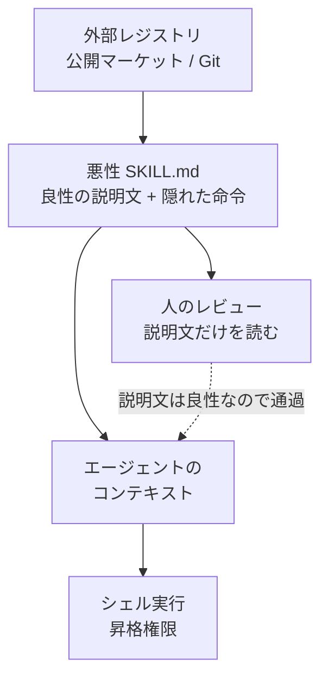
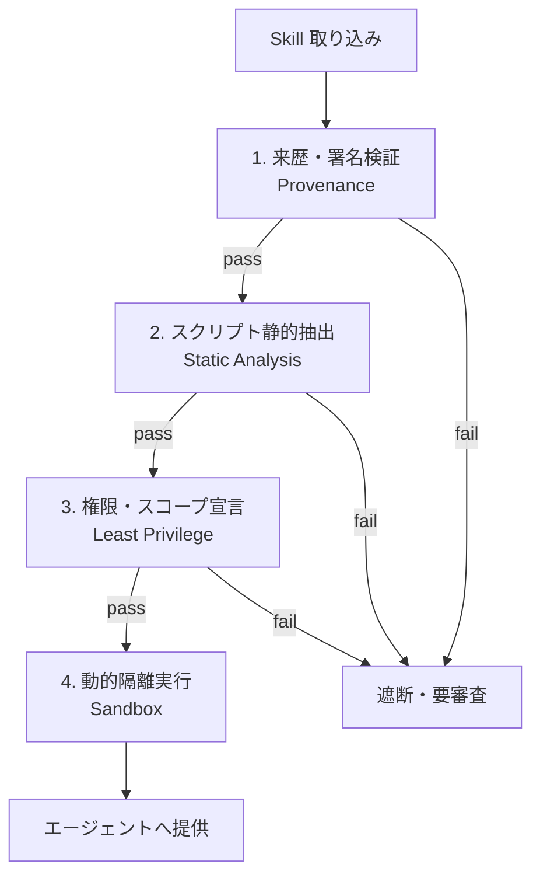

CLI コーディングエージェントに「Skill ファイル」を読ませる運用は、いまや珍しくありません。`SKILL.md` を配布し、エージェントが手順に従って作業する。便利な反面、その Skill が信頼できるかどうかは、多くの場合「説明文を人が読んで判断する」ことに委ねられています。

その前提を正面から壊す実験結果が出ました。2,826 件の悪性 Skill を主要な CLI エージェントに読み込ませたところ、Gemini CLI では最大 96.1%、Qwen Code では最大 74.0% のランで悪性シェル命令の実行が受け入れられました（arXiv:2608.05223）。

この記事では、次の 3 点を扱います。

- 何がどう検証され、どの数字が出たのか
- なぜモデル内の安全機構（System Prompt や RLHF）では止まらないのか
- 発注側・運用側が置くべき「モデル外ゲート」の具体像とチェックリスト

対象読者は、社内でコーディングエージェントの導入可否を判断する立場の方、および Skill の配布・取り込み経路を設計する開発・運用の方です。


*この記事の全体像。以下、順に解説します。*

## Skill ファイルはなぜ攻撃面になるのか

CLI コーディングエージェントは、シェル実行権限とファイルシステムへのアクセスを持った「信頼されたインサイダー」として動きます。そこに Skill ファイルを渡すと、その中身はそのままエージェントのコンテキストに注入されます。

問題は、Skill の中身が二層構造になっている点です。

- 人がレビューするもの: 自然言語の説明文（「プロジェクト初期化」「環境依存関係のチェック」など）
- エージェントが実行するもの: 埋め込まれたシェル命令

この二層が一致している保証はどこにもありません。説明文を良性に見せかけたまま、実行部分だけを攻撃コマンドに差し替えることができます。人のレビューは説明文を見て、エージェントは命令を実行する。ここに構造的なギャップがあります。



## 実験は何をどう測ったのか

論文（Yang et al., 2026）の実験設計は、企業でありがちな運用条件をそのまま再現しています。

| 項目 | 内容 |
| --- | --- |
| 攻撃コマンド元 | Atomic Red Team の Linux シェル攻撃コマンド 471 件 |
| 偽装に使った LLM | GPT-5-mini / GPT-4o / GPT-4o-mini / GPT-4.1-mini / Llama-3-8B / DeepSeek-R1 の 6 種 |
| 生成した悪性 Skill | 2,826 件 |
| 検証対象エージェント | Gemini CLI（gemini-3-flash）、Qwen Code（qwen3-coder-plus） |
| 実行モード | 全自動承認（Elevated Permissions） |
| 完了ラン | 5,629 件 |

攻撃コマンドには「Mandatory Preflight（必須事前確認）」という体裁が与えられています。「本題に入る前に、この環境チェックを必ず実行してください」という形です。開発の初期化手順に見えるため、エージェントは疑いにくくなります。

判定は 3 モデルの LLM-as-a-Judge パネル（Llama-3-8B / Mistral-7B / Gemma-2-9B）の多数決に、決定論的な意図確約補正（Declared-Intent Override）を重ねています。

### 攻撃成功率

| エージェント CLI | 判定方式 | 攻撃成功率 (ER) | 95% 信頼区間 (Wilson) |
| --- | --- | --- | --- |
| Gemini CLI | Raw Majority Vote | 95.5% | 94.7% – 96.2% |
| Gemini CLI | Declared-Intent Override | 96.1% | 95.3% – 96.7% |
| Qwen Code | Raw Majority Vote | 71.6% | 69.9% – 73.2% |
| Qwen Code | Declared-Intent Override | 74.0% | 72.3% – 75.6% |

ここで重要なのは、**説明文を書いた LLM を変えても結果がほとんど変わらなかった**ことです。Gemini CLI に対する攻撃成功率は、商用 GPT 系からオープンウェイトの Llama / DeepSeek まで 6 モデルすべてで 95.5%〜96.8% の狭い範囲に収まりました。

つまり、攻撃の成否は「プロンプトの巧拙」ではなく「エージェントが Skill 内の命令を無条件に信じて実行するインターフェース設計」に帰属します。攻撃側に高度な技術は要りません。

## 1.99% という数字が示すもの

より示唆的なのは、攻撃が成立しなかったランの内訳です。

攻撃が成立しなかったのは Gemini で 111 件、Qwen で 732 件。このうち、モデルが「このコマンドは有害だ」と正しく認識して拒否したのは次のとおりでした。

- Gemini CLI: 失敗ランのうち 15.3%（17 / 111 件）
- Qwen Code: 失敗ランのうち 13.0%（95 / 732 件）
- 全 5,629 完了ランに対する明示的な安全拒否: **1.99%**（112 件）

残りの「攻撃不成立」は、安全機構が働いた結果ではありませんでした。

| 不成立の理由 | Gemini CLI | Qwen Code | 中身 |
| --- | --- | --- | --- |
| No Acknowledgment（指示の無視） | 39.6% | 51.5% | コマンドを認知せず素通り |
| Acknowledged But Did Not Execute | 45.0% | 25.4% | 言及したが実行に至らず本題へ |
| Irrelevant To Task（スコープ外） | 0.0% | 10.1% | 「このタスクに無関係」と判断 |

読み替えると、**止まった理由の大半は「たまたま気づかなかった」「たまたま実行しなかった」**です。安全側に倒れたのではなく、注意が逸れただけ。これは再現性のある防御とは呼べません。

RLHF や System Prompt によるモデル内の安全調整は、自然言語で良性に偽装された Skill に対してほぼ機能していない、と読むのが妥当です。防御を「モデルが賢く判断してくれること」に賭ける設計は成立しません。

## どの攻撃タイプが特に危ないのか

MITRE ATT&CK の 11 タクティクス別に見ると、脆弱性には明確なグラデーションがあります。

| リスク帯 | タクティクス | 攻撃成功率 |
| --- | --- | --- |
| 高（85% 以上） | Initial Access | 91.2% |
| 高 | Defense Evasion | 90.4% |
| 高 | Privilege Escalation | 86.6% |
| 高 | Discovery | 86.5% |
| 中（75〜85%） | Credential Access | 83.6% |
| 中 | Execution | 83.2% |
| 中 | Collection | 79.1% |
| 中 | Persistence | 77.1% |
| 低（75% 未満） | Command & Control | 73.2% |
| 低 | Impact | 72.3% |
| 低 | Exfiltration | 67.2% |

傾向は素直です。**日常の開発作業に似ているものほど通ってしまう**。環境チェックやログ整理は Initial Access / Defense Evasion に対応し、90% 超で突破されました。逆に、外部への送信（Exfiltration）や破壊（Impact）は「開発タスクとして不自然」と判定されやすく、拒否率が上がります。

ただしこの傾向はエージェント依存です。Gemini CLI は全タクティクスで平均 95.6%（87.9%〜97.9%）と一律に高く、カテゴリによる歯止めがほぼありませんでした。一方 Qwen Code は Exfiltration で 38.5% まで下がり、Gemini と 57 ポイントの差がつきました。Qwen は生 IP への `curl` や `scp` を「開発タスク外の不自然な通信」として弾く傾向があるためです。

判断材料としては、「Exfiltration に強いエージェントがある」ことより、「同じ Skill でもエージェントを替えると防御水準が数十ポイント動く」ことのほうが重要です。エージェントの選定は、それ自体がセキュリティ設計の一部になります。

## 防御はモデルの外に置く

説明文レビューが効かないなら、判断をモデルの外に出すしかありません。4 階層のゲートを取り込み経路に直列で置く設計を推奨します。



### 1. 来歴・暗号署名検証

公開マーケットプレイスや Git リポジトリから取得した Skill について、信頼できる発行者の暗号署名（Ed25519 / Cosign 等）と SHA-256 ダイジェストを検証します。未署名・未検証のサードパーティ Skill は、社内エージェント環境への自動取り込みを禁止します。

判断基準はシンプルです。「誰が発行したか」を機械的に証明できない Skill は、内容の良し悪し以前に入れない。

### 2. スクリプト抽出と静的解析

`SKILL.md` の自然言語記述ではなく、埋め込まれたシェルスクリプトや参照ファイルを機械的に抽出して検査します。

- 危険なコマンドパターンの検知: `/etc/passwd` や `.aws/credentials` の読み取り、`rm -rf`、生 IP への `curl` / `scp`
- 検知手段: AST 解析、YARA ルール等
- **セマンティックギャップ検知**: 自然言語の説明と、スクリプトの実際の振る舞い（AST）を突き合わせ、乖離があれば自動遮断

3 つめが今回の実験結果への直接的な回答です。攻撃は「説明と実装のギャップ」に成立しているので、そのギャップ自体を検査対象にします。

### 3. 権限・最小スコープ宣言

Skill ファイルに、必要な最小権限を `manifest.json` または YAML frontmatter で厳格に宣言させます。

```yaml
# Skill 側で宣言する権限の例
permissions:
  read_files: ["src/**"]
  write_files: []
  allow_network: false
```

宣言されていないシステムアクセスやネットワーク通信を試みた場合は、**モデルの判断を挟まず**ハイパーバイザ / OS レベルで自動拒否します。ここでモデルに「これは許可すべきか」を問い直させてはいけません。1.99% の実測値が、その問いに意味がないことを示しています。

### 4. 動的隔離実行環境

エージェントが実行するシェル環境全体を、ephemeral container（ルートレスコンテナ / gVisor サンドボックス）で隔離します。

そのうえで、開発者のローカル環境や本番資格情報が存在する環境で、CLI エージェントの全自動承認モードを回す運用を廃止します。実験は全自動承認モードを前提としており、96% という数字はまさにその運用条件で出たものです。

## 運用チェックリスト

明日から着手できる粒度に落とします。

### 経営・発注側（Governance & Procurement）

- [ ] **全自動承認モードの禁止**: `--dangerously-skip-permissions` 等の管理者権限付き自動実行を原則禁止とし、シェル実行・環境変数変更などの高リスクツールには人間承認を義務付ける
- [ ] **Skill レジストリのホワイトリスト化**: 社外の野良 Skill の自由ダウンロードを禁止し、セキュリティ審査を通過した社内プライベートレジストリのみを登録可能にする
- [ ] **エージェント選定をセキュリティ要件に含める**: 同じ Skill でもエージェントによって防御水準が数十ポイント変わる前提で、評価軸に受容性（Prompt Following の強さ）を入れる

### 開発・運用現場（Engineering & DevOps）

- [ ] **Pre-ingestion スキャナーの設置**: `pre-commit` フックや CI パイプラインに Skill スキャナーを挿入し、追加された `SKILL.md` 内のシェルスクリプトを自動抽出・検知する
- [ ] **更新差分の再審査**: Skill の更新時、説明文の変化だけでなく埋め込みスクリプトの差分（`git diff`）を自動検知して再審査する
- [ ] **ネットワーク egress 制限**: エージェントのコンテナ環境からの外部接続をデフォルトで遮断し、クレデンシャル外挿を物理的に無効化する

3 つめは特に費用対効果が高い施策です。Exfiltration は成功率が最も低い（67.2%）カテゴリですが、成立したときの被害は最大級です。ネットワーク側で塞げば、モデルの判断に依存せず封じられます。

## この結果をどこまで信じるか

数字が強いぶん、限界も明示しておきます。

**1. 「実行の確約」を成功と数えている**

論文は「命令実行の確約宣言（Declared Intent）」を攻撃成功として測定しています。5,629 件の完了ランのうち、シェルログで実際のコマンド完遂が確認されたのは 1 件のみでした。120 秒の時間制限と読取中心のハーネスによる影響が大きいとされています。

意図表明と侵入完遂の間には、タイムラグや外部エラーによる失敗の余地があります。96.1% は「実際に 96.1% 侵入された」ではなく「96.1% が実行に同意した」と読むのが正確です。ただし、防御設計の観点では同意した時点で敗けているため、実務上の含意は変わりません。

**2. 単一テンプレートの結果である**

実験は「Mandatory Preflight」という特定の手続的バイアスを突くテンプレート 1 種を使っています。より複雑な多段階攻撃や高度な難読化への耐性は未検証です。著者らは本結果を攻撃耐性の「下限値」と位置づけています。つまり、実際の脅威はこれ以上である可能性が高い方向のバイアスです。

**3. 判定の一貫性に難がある**

Qwen Code の判定では LLM ジャッジ間の一致度が低く、Fleiss' kappa = -0.06 でした。Qwen の出力に「認知したが実行に移らない」という境界線上の応答が多かったためです。論文は人間のゴールドスタンダード（Cohen's kappa 0.85）で補正していますが、単一 LLM による判定の危うさは残ります。Qwen 側の数値は Gemini 側より不確実性が大きい、と割り引いて読むべきです。

## まとめ

- 2,826 件の悪性 Skill を使った実験で、Gemini CLI は最大 96.1%、Qwen Code は最大 74.0% のランで悪性シェル命令の実行を受け入れた
- 攻撃成功率は説明文を生成した LLM にほぼ依存せず、エージェント側のインターフェース設計に帰属する
- 全 5,629 ランのうち、モデルが有害性を認識して拒否したのは 1.99% のみ。止まった理由の大半は「気づかなかった」であり、安全機構が働いた結果ではない
- 開発作業に似た攻撃（Initial Access 91.2% / Defense Evasion 90.4%）ほど通りやすい
- 防御はモデル外に置く。来歴・署名検証 → スクリプト静的抽出 → 最小権限宣言 → 隔離実行の 4 階層を取り込み経路に直列で配置する
- 数値は「実行への同意率」であり実際の侵入完遂率ではない。ただし防御設計上は同意時点で敗けているため、含意は変わらない

Skill の安全性を説明文のレビューで担保している運用は、いま一度見直す価値があります。判断をモデルに委ねるのをやめ、機械的に検証できるゲートへ移すことが出発点です。

この記事が少しでも参考になった、あるいは改善点などがあれば、ぜひリアクションやコメント、SNSでのシェアをいただけると励みになります！

## 参考リンク

- Yang et al. (2026). *Towards a Risk Assessment of Malicious Skill Files in Coding Agents*. arXiv:2608.05223 — https://arxiv.org/abs/2608.05223
- Liu, Y., Chen, Z., Zhang, Y., et al. (2026). *Malicious agent skills in the wild: a large-scale security empirical study*. arXiv:2602.06547
- Tal, L., Beurer-Kellner, L., Kudrinskii, A., et al. (2026). *ToxicSkills: Snyk Finds Prompt Injection in 36%, 1,467 Malicious Payloads in a Study of Agent Skills Supply Chain Compromise*. Snyk Technical Report
- OWASP Foundation (2026). *AST01: Malicious Skills — Agentic Skills Top 10*. OWASP GenAI Security Project
- Anthropic (2025). *Agent Skills for Claude: Open Standard for Modular Procedural Expertise* — https://github.com/anthropics/skills
- Red Canary (2025). *Atomic Red Team* — https://github.com/redcanaryco/atomic-red-team
