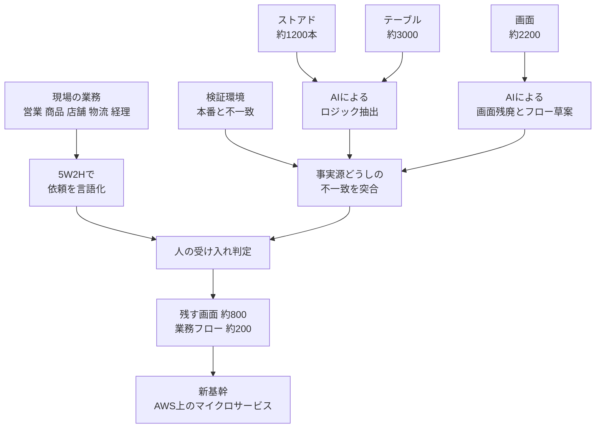

日経クロステックが 2026-08-31 に、ひとまいる（2025年7月までカクヤスグループ）の基幹システム刷新を報じました。1995年に構築された2層システムを、刷新の出発点になるはずの現行仕様が手元にない状態で作り直している、という内容です。現場へのヒアリングは「今と同じものが欲しい」以上に進まず、解析には Amazon Bedrock 上の Claude Code が入っています。

この記事では、この事例を発注側・経営側の視点で読み直します。扱うのは次の3点です。

- 単一の要件書が存在しないとき、事実源をどう分割し、生成AIに何を任せて何を人に残すか
- 「動いた」ではなく「どの事実源と一致したか」で受け入れを定義する方法
- 900人月・450人月・実質2カ月という数字が、それぞれ何を指しているかの読み分け

結論を先に置きます。**この事例から自組織へ移植できるのは工数の圧縮率ではなく、裁定ゲートの設計です。** AIは草案を出す装置であり、正本にはなりません。

*この記事の全体像。以下、順に解説します。*

## 何が確定していて、何が伝聞か

まず、公開情報の確度を切り分けます。

| 対象 | 確認できる内容 | 確度 |
|---|---|---|
| 現行構成 | 1995年構築のクライアントサーバ2層。画面は VB.NET、ロジックの大半はオンプレ Oracle のストアドプロシージャ | 高（日経） |
| 規模 | 日経は「2000画面以上、1200本のストアド」。講演再録は画面約2200、テーブル約3000、ストアド約1200 | 中（二次情報を含む） |
| 資産の欠落 | 設計書が残っておらず、ソースの一部も失われている | 中（講演再録） |
| 要件の状態 | 現場ヒアリングは「今と同じものが欲しい」に止まる | 高（日経） |
| 期限 | 開始 2024年10月。刷新期限 2027年8月（日経）、VMware 契約切れ 2027年7月（ITmedia）、全面移行 2027年秋（AWS Special） | 高（ただし出典ごとに対象が違う） |
| AIの用途 | 約1200本のストアドから業務ロジックの草案を抽出 | 高 |
| 再設計の進行値 | 画面 約2200 → 約800、業務フロー 約200 | 中（当事者申告） |

注意点が2つあります。

1つは実装言語です。VB.NET は 2002年の製品なので、1995年時点の実装が VB.NET だったとは読めません。ITmedia は「当時 Visual Basic（現在の VB.NET）」と修飾しており、現在の画面が VB.NET であることと、構築当時の言語は別の話です。

もう1つは「要件書が1枚も無い」という表現です。公開された現行仕様は見つからなかった、というのが確認できる範囲で、社内に何も無いことまでは確かめられません。**刷新の難所は「文書がゼロ」ではなく「文書が正本として機能していない」ことにあります。**

## 事実源はひとつではない

要件書が正本として機能しないとき、正本は消えるのではなく分散します。この案件で参照されている事実源は、少なくとも次の5つです。

この図で重要なのは、AIの出力が**そのまま行き先に届かない**ことです。抽出結果も草案も、いったん突合を通り、人の受け入れ判定を経てからしか移行対象になりません。

正本は「動いている本番」と「現場が毎日やっている業務」の交差にあります。コードだけを正にすると、実行されていない死んだ分岐まで移植します。現場の口頭だけを正にすると、担当者が意識していない副作用が落ちます。**依存グラフによるモジュール境界は、この交差と重ねて初めて業務単位として閉じます。**

なお、講演者が挙げたAI活用の工夫は、記憶の補強、ルールのファイル化、役割の付与、プロンプトを作るプロンプトの2段構え、の4つでした。これらは仕様の正本を作る仕掛けではなく、**草案の再現性を上げる装置**です。位置づけを取り違えると、再現性が高いことを正しさの根拠にしてしまいます。

## AIに任せてよい範囲と、任せてはいけない範囲

当事者の発言から復元すると、線引きはかなりはっきりしています。

任せてよい範囲は、既存資産の読解と草案生成です。

- 1200本のストアドからの業務ロジック草案
- 抽出対象として挙げられた6つの中核ロジック（テーブル間移動、在庫評価、売価、与信、在庫引き当て、空容器回収）
- 本番 Oracle を AWS 側へ寄せた検証足場での差分確認の下書き
- 内製開発におけるコーディング補助

任せてはいけない範囲として、当人が自らの失敗として語っているのは次の2つです。

- 「AIは何でも覚えている」という前提での丸投げ
- 曖昧な依頼のまま動くものを作らせること

2つ目が本質的です。AIが動くものを出せるようになると、**ボトルネックは実装から言語化へ移ります。**この案件で人側に残っているのは、営業・商品・店舗・物流・経理による現場語への翻訳、残す画面の選定、5W2H による依頼の言語化、そして受け入れです。当事者は「AI駆動」と「業務駆動」の両輪と表現し、AI単独では破綻したと述べています。

## 受け入れ基準を「動いた」から「一致した」へ

取材と講演から復元できる操作手順は、次の6段です。

1. ルールは会話履歴ではなくファイルに置く
2. 役割と経歴を与えて思考の土台を固定する
3. コード生成プロンプトをいきなり書かない
4. 現場からの依頼を 5W2H に翻訳する。抜けやすいのは HOW MUCH（予算と期限）
5. AI草案を現場語に翻訳し、使われていない画面と似て非なる画面を人が仕分ける
6. 新旧比較で段階的に切り替える。一括置換ではない

会社側の開示は、これに運用上の制約を足します。現行と新系を同時に走らせるためのデータ連携基盤がハブになり、基幹の一部、家庭向け受注とマーケットプレイス、倉庫管理は 2026年3月期から来期へずれ込んでいます。**段階切替を選んだ以上、並行稼働の期間とその費用は計画の一部です。**

ここから導ける受け入れの最小セットは3点です。

- **どの事実源と一致したか。**コードとの一致か、現場業務との一致か、その両方かを行ごとに書く
- **誰が不一致を裁定したか。**AIが出した差分ではなく、人の判断に名前を付ける
- **本番相当で何を検証できなかったか。**検証環境が本番の完全再現でないことを、成果ではなくリスク登録簿に残す

3つ目を省くと、検証環境の不完全さがそのまま**AI突合の偽陰性**として本番に流れ込みます。当人もこの環境が全体テストではなく部分確認に留まることを認めています。

## 900人月という数字の読み方

この事例は数字が独り歩きしやすい構造になっています。対象が発信ごとに違うためです。

| 数字 | 何を指すか | 性格 | 出典 |
|---|---|---|---|
| 約2200 / 約3000 / 約1200 | 画面 / テーブル / ストアド | 講演スライドの規模 | ITmedia 2026-07-03 |
| 450人月 | 把握できた情報から出した必要工数 | 刷新側。計算式は非公開 | 日経 2026-08-31 |
| 450人月 | 人手による現行解析の試算 | 解析側。日経の450と同一視しない | ITmedia、キーマンズネット |
| 900人月 | 日経の450を倍にした当事者の感覚 | 「程度を要するのではないか、という感覚」 | 日経 2026-08-31 |
| 実質2カ月 | 解析工程 | 講演・取材 | ITmedia、キーマンズネット |
| 1カ月で突破 | 課題解決 | 広報表現。引用に使わない | 会社PR |
| 来期ずれ込み | 基幹の一部など | 公式開示 | 2026年3月期 決算説明 |

同じ「450人月」が、刷新に必要な工数と、人手で解析した場合の試算という**別の対象**に付いています。ここを重ねると、450を2カ月で消したという読みが生まれますが、それは成り立ちません。

削減根拠として使ってよいのは、「人手なら450人月と見積もった解析を、AIと現場の両輪で数カ月の解読作業に置き換えたという自己申告」までです。**解析の短縮を総人月の削減として書かないことが、この事例の一番の使いどころです。**刷新はまだ完了していません。

## 反証を通したうえで残るもの

主張を弱める材料も並べます。

- **数字の対象が食い違うため、圧縮倍率を計算できません。**広報、取材、当事者の感覚が別の粒度で混ざっています
- **解析完了と刷新完了が二次拡散で混線しています。**当人は「道半ば」と述べ、会社開示には遅延が残っています
- **検証環境の不全とソース紛失は、突合の偽陰性条件です。**当人が認めている制約であり、AIの精度以前の上限になります
- **Gartner は 2026年に開始するメインフレーム退出プロジェクトの70%超が、生成AIの能力の過大評価により意図した便益を出せないと予測しています。**この案件はメインフレームではないので、同じ約束構造への類推に止めます
- **Standish の CHAOS Report 1995 は、要件の不完全さを難航・中止の上位要因に置いています。**裁定ゲートは必要条件であって、工数圧縮の十分条件ではありません
- **第三者による工数監査はありません。**発信の多くが同一イベントの再構成です

一方、支持側の材料も相応にあります。

- 同じキーパーソンが、AI丸投げの失敗と、記憶・ルール・役割・2段プロンプトの必要性を**先に**語っています。成功譚だけの発信ではありません
- 画面削減を「物流ドメインへの再設計」と定義しています。酒販マスタ中心から配車・倉庫・在庫データ中心への転換という説明と整合します
- 中期経営計画は他人物配送と販売プラットフォーム化を公式方針にしています。現行モノリスでは接続性が足りないという刷新理由が、公式開示と一致します
- 内製化の動機をベンダー依存の反省として述べています

結論の核である「AIは草案、人は裁定、事実源は複数」は、失敗談を含む当事者発言と公式の遅延開示の**両方に耐えます。**核を「900人月を消した成功事例」へ伸ばすと、上の反証に負けます。

## 自組織へ移植するときの5つの操作

判断支援者の立場で、移植可能な操作に翻訳します。

1. **事実源を分けて抽出する。**コード、DB、画面、運用手順、現場業務の5つを別々に扱います。現行仕様が確認できず、ヒアリングが「今と同じ」に止まることを前提条件として計画に書きます
2. **AI出力を正本にしない。**不一致表を作り、人が裁定した行だけを移行単位の入力にします
3. **受け入れを一致で定義する。**突合できた事実源、突合できなかった範囲、裁定者の3点を成果物に残します
4. **工数を工程で分ける。**解析、再設計、切替、並行稼働を別の見積もりにします。解析の短縮を総人月の削減として報告しません
5. **検証環境と本番のギャップをリスク登録する。**これがAI突合の精度上限になります

自組織で試すなら、最初に確かめるのは次の3点です。

- 現行の業務ロジックが、コードとDBのどちら側にどれだけ寄っているか（ストアド偏重なら画面からの読解は成立しません）
- 検証環境が本番のどの範囲を再現できていないか
- 不一致が出たとき、誰が裁定者になるかが職掌として決まっているか

3つ目が決まっていない組織では、AIを入れても差分の山が積み上がるだけです。**ボトルネックは解析速度ではなく、裁定の帯域です。**

なお、この評価が覆る条件も置いておきます。2027年秋までに約800画面が本番で旧系を止め、障害と工数が第三者に開示されること。解析2カ月の人数・成果物・再現率が公開されること。この2つが揃えば、事例の再現性はもう一段強く言えるようになります。

## まとめ

- 現行仕様が公開されていない刷新では、正本は消えるのではなく、コード・DB・画面・現場業務・検証環境へ分散します。どれか1つを正にすると必ず欠けます
- 生成AIが担ってよいのは既存資産の読解と草案生成です。抽出された草案は突合と人の裁定を経てから移行対象になります
- 当事者が失敗として語ったのは「AIは何でも覚えている」前提の丸投げと、曖昧な依頼のまま作らせることの2つです。AIが動くものを出す時代のボトルネックは実装から言語化へ移ります
- 受け入れの最小セットは、どの事実源と一致したか、誰が不一致を裁定したか、本番相当で何を検証できなかったか、の3点です
- 450人月は刷新の必要工数と人手解析の試算という別対象に同じ数字が付いています。900人月はその倍という感覚値です。解析の短縮を総人月の削減として書かないでください
- Gartner は生成AIの能力の過大評価による便益未達を予測しています。移植すべきは工数の圧縮率ではなく、裁定ゲートの設計です

この記事が少しでも参考になった、あるいは改善点などがあれば、ぜひリアクションやコメント、SNSでのシェアをいただけると励みになります！

## 参考リンク

- [太田萌枝「カクヤスが挑む900人月プロジェクト、「要件なし」で始まったレガシー刷新」日経クロステック, 2026-08-31](https://xtech.nikkei.com/atcl/nxt/column/18/03734/082700001/)
- [林裕也「“開かずの基幹システム”、450人月→実質2カ月で解読」ITmedia NEWS, 2026-07-03](https://www.itmedia.co.jp/news/articles/2607/03/news050.html)
- [平行男「カクヤス「30年物の泥沼システム」をAIでどう解読？」キーマンズネット, 2026-07-06](https://kn.itmedia.co.jp/kn/articles/2607/06/news040.html)
- [日経クロステック Special「柔軟な基幹系システムを内製で構築する」（ひとまいる × AWS）](https://special.nikkeibp.co.jp/atclh/NXT/25/aws1113/)
- [ひとまいる, グループ中期経営計画 TRANSFORMATION PLAN 2028（2026年5月更新）](https://ssl4.eir-parts.net/doc/7686/tdnet/2815859/00.pdf)
- [ひとまいる, 2026年3月期 決算説明資料](https://www2.jpx.co.jp/disc/76860/140120260515538376.pdf)
- [PR TIMES, 社名変更のお知らせ, 2025-07-01](https://prtimes.jp/main/html/rd/p/000000289.000022125.html)
- [Gartner, "More Than 70% of Mainframe Exit Projects Will Fail Due to Overestimation of Generative AI's Capabilities", 2026-06-18](https://www.gartner.com/en/newsroom/press-releases/2026-06-18-gartner-predicts-more-than-70-percent-of-mainframe-exit-projects-will-fail-due-to-overestimation-of-generative-ais-capabilities)
- [The Standish Group, CHAOS Report 1995（spinroot.com 再掲）](https://www.spinroot.com/spin/Doc/course/Standish_Survey.htm)
