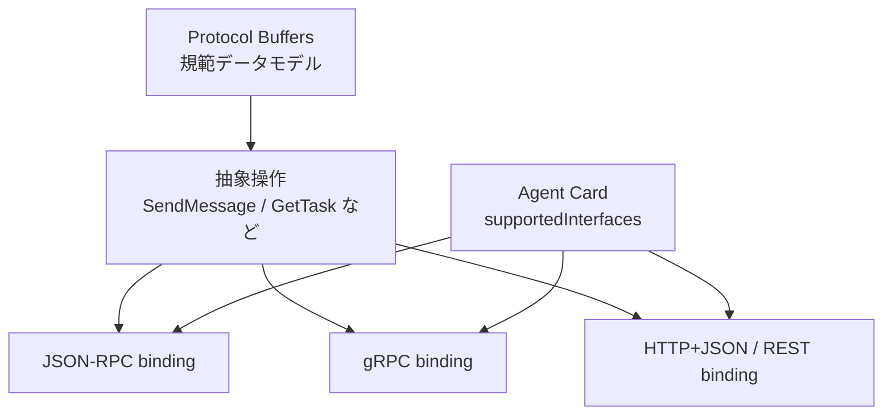

Google が Agent2Agent（A2A）Protocol を発表したのは 2025 年 4 月でした。当時の記事やサンプルを見て実装した人にとって、現在の A2A は同じ名前のままでも別物に近くなっています。

この記事では、2026 年 8 月 24 日時点の A2A を公開時点と比較します。読者が得られるのは次の3点です。

- Google 主導のドラフトから Linux Foundation、さらに Agentic AI Foundation（AAIF）へ移った経緯
- JSON-RPC 一本だった仕様が v1.0 系へ至るまでの破壊的変更
- 2025 年版の実装を移行するときに、コードと信頼境界のどこを直すべきか

結論を先に述べます。**A2A は仕様とガバナンスの面では成熟しました。一方、言語をまたぐ相互運用と Agent Card の信頼モデルは、業界標準として無条件に任せられる段階ではありません。** 2025 年 4 月のドラフト実装は現行サーバとそのまま通信できないため、移行が必要です。

*この記事の全体像。以下、順に解説します。*

## 16か月で変わったこと

公開時と現在の差を一枚にすると、次のようになります。

| 観点 | 2025年4月の公開時 | 2026年8月24日時点 |
|---|---|---|
| ガバナンス | Google 主導 | Linux Foundation 配下を経て AAIF hosted project |
| 安定版 | タグなしのドラフト | v1.0.1 が GitHub の Latest release |
| 規範ソース | JSON Schema と TypeScript schema | Protocol Buffers（`a2a.proto`） |
| 通信方式 | HTTP(S) 上の JSON-RPC 2.0、SSE | JSON-RPC、gRPC、HTTP+JSON/REST |
| 送信メソッド | `tasks/send` | `SendMessage` |
| Agent Card | `/.well-known/agent.json` | `/.well-known/agent-card.json` |
| SDK | Python、JavaScript のリポジトリ内サンプル | Python、JavaScript、Java、Go、.NET、Rust |
| セキュリティ | scheme 名を宣言、認可は実装依存 | OpenAPI 風 scheme、拡張 Card、任意の JWS 署名 |

変化は「機能が増えた」だけではありません。メソッド名、データモデル、識別子の生成主体が変わっています。公式の [v1.0 発表](https://a2a-protocol.org/latest/announcing-1.0/) も、interaction protocol に破壊的変更があると明記しています。

主な節目は次のとおりです。

| 日付 | 出来事 |
|---|---|
| 2025-04-09 | Google がドラフトを発表。50超のテックパートナーと「年内の production-ready」を掲げる |
| 2025-06-23 | Linux Foundation へ寄贈 |
| 2025-07-30 | v0.3.0。gRPC、REST、Card 署名、well-known の改名を導入 |
| 2025-08-29 | IBM の Agent Communication Protocol（ACP）が A2A へ合流 |
| 2026-03-12 | 最初の stable となる v1.0.0 を公開 |
| 2026-05-28 | v1.0.1 を公開 |
| 2026-08-17 | A2A が AAIF の hosted project に加わる |

当初の「2025年後半に production-ready」は、stable を v1.0.0 と見るなら約3〜6か月遅れました。2025 年 7 月の v0.3 は途中回答でしたが、その後の v1.0 でも interaction protocol に大きな変更が入りました。

## JSON-RPCの追加仕様ではなく、三つのbindingを持つプロトコルになった

公開時の A2A は、HTTP(S) 上の JSON-RPC 2.0 と Server-Sent Events（SSE）が前提でした。v0.3 で gRPC と HTTP+JSON/REST が加わり、v1.0 では構造が次の三層に整理されています。

現行の規範ソースは Protocol Buffers です。公開 JSON Schema はビルド成果物であり、規範ではありません。独自クライアントを維持する場合は、JSON Schema だけを正本として追う運用を見直す必要があります。

Agent Card も、単一の `url` を示す文書から、複数の `supportedInterfaces[]` を宣言する入口へ変わりました。各 interface は URL、protocol binding、protocol version を持ちます。0.3 と 1.0 の interface を並べて広告できるため、0.3 利用者には段階移行の道があります。

## 2025年版クライアントが壊れるポイント

メソッド名は公開後に二度変わりました。

| 機能 | 公開時 | v0.3 | v1.0系 |
|---|---|---|---|
| メッセージ送信 | `tasks/send` | `message/send` | `SendMessage` |
| ストリーム送信 | `tasks/sendSubscribe` | `message/stream` | `SendStreamingMessage` |
| タスク取得 | `tasks/get` | `tasks/get` | `GetTask` |
| タスク取消 | `tasks/cancel` | `tasks/cancel` | `CancelTask` |
| 再購読 | `tasks/resubscribe` | `tasks/resubscribe` | `SubscribeToTask` |

2025 年 4 月の `tasks/send` を実装したクライアントは、v0.3 にも v1.0 にもそのまま接続できません。メソッド名だけを書き換えても不十分です。[What's New in A2A Protocol v1.0](https://a2a-protocol.org/latest/whats-new-v1/) にあるデータモデル変更も影響します。

| 対象 | 公開時 | v1.0系 |
|---|---|---|
| セッション | `Task.sessionId` | `contextId` |
| `Task.id` | クライアント生成が前提 | サーバ生成 |
| Task state | `completed` などの小文字 | `TASK_STATE_COMPLETED` など |
| Message role | `user` / `agent` | `ROLE_USER` / `ROLE_AGENT` |
| Part の判別 | `type` または `kind` | `text` / `url` / `raw` / `data` のメンバ存在 |
| ファイル表現 | `file.bytes` / `file.uri`、`mimeType` | `raw` / `url`、`mediaType` |
| Artifact | `artifactId` なし | `artifactId` 必須 |

特に影響が大きいのは Part です。v1.0 では、次のような `type: "text"` や `kind: "text"` を見て分岐する設計ではありません。どのメンバが存在するかで Part の種類を判定します。enum も SCREAMING_SNAKE_CASE へ変わったため、文字列比較や永続化データを含めて確認が必要です。

REST 利用者にも変更があります。v0.3 の例にあった `POST /v1/message:send` は、v1.0 では `POST /message:send` となり、`/v1` が外れています。

## Googleのプロトコルから、AAIFのオープンスタックへ移った

仕様の置き場は、公開時の `github.com/google/A2A` から Linux Foundation の `a2aproject` へ移りました。現在の Technical Steering Committee には AWS、Cisco、Google、IBM Research、Microsoft、Salesforce、SAP、ServiceNow が参加しています。

さらに 2026 年 8 月、A2A は [AAIF の hosted project](https://aaif.io/blog/a2a-joins-aaif) になりました。AAIF は関連プロジェクトを次のように位置づけています。

- AGENTS.md: エージェントへの指示と文脈
- goose: エージェントランタイム
- MCP: エージェントとツールの接続
- agentgateway: トラフィック制御
- A2A: エージェント同士の接続

この位置づけは、公開時からの「A2A は MCP を置き換えず、補完する」という説明を制度面でも分かりやすくしました。MCP はエージェントからツールやデータへの接続、A2A はサービス境界を越えたエージェント間の委譲です。同一プロセス内のサブエージェント呼び出しまで A2A に置き換える必要はありません。

IBM の ACP が 2025 年 8 月に A2A へ合流したことも、中立化の成果です。一方、同じ Linux Foundation 系の Cisco AGNTCY は統合されておらず、公式の単一 MCP–A2A gateway spec もありません。「財団に入った」と「市場で一つに収斂した」は分けて考える必要があります。

## 認証宣言は成熟したが、信頼はプロトコルだけで完結しない

Google は公開時から「Secure by default」と OpenAPI 相当の認証方式を掲げていました。この骨格は維持されています。認証情報は JSON-RPC のペイロードではなく HTTP ヘッダなどで運び、Agent Card が利用可能な方式を宣言します。

現在は API key、HTTP authentication、OAuth 2.0、OpenID Connect、mTLS を OpenAPI 風の `securitySchemes` で表現できます。v1.0 では Device Authorization Grant と PKCE が加わり、認証後に拡張 Agent Card を取得する仕組みもあります。

ただし、次の境界は A2A の外側に残ります。

- どのエージェントへ、どの権限で委譲できるかという認可
- 再委譲時の権限減衰、利用者の同意、資格の失効
- レート制限、課金、SLA、リージョン
- Agent Card に書かれた能力や説明が誠実であることの保証

Agent Card の JWS 署名は v0.3 で追加されましたが、必須ではありません。署名は改ざんを検知しても、Card の記述が安全で正確かまでは保証しません。

加えて、2026 年 8 月時点では署名検証に関する open issue があります。[#2096](https://github.com/a2aproject/A2A/issues/2096) は signer が指定する `jku` を信頼根にすると自己署名 Card を受け入れ得る問題、[#2122](https://github.com/a2aproject/A2A/issues/2122) は RFC 8785 正規化に対する Python SDK と JavaScript SDK の不一致です。

したがって、署名を使う場合も verifier 側のキー許可リストを先に持ち、Card 内の `jku` をそのまま信頼根にしない設計が必要です。Card の description や skill examples を LLM のプロンプトへ無加工で渡すことも避けるべきです。

## SDKは6言語に増えたが、成熟度は揃っていない

公開時は Python と JavaScript のサンプルが中心でした。現在の公式 SDK ページには Python、JavaScript、Java、Go、.NET、Rust の6言語が並びます。仕様のコアリポジトリに加えて、TCK と A2A Inspector も用意されました。

ただし、言語ごとの成熟度には差があります。2026 年 8 月 24 日時点で .NET の NuGet は preview、Rust は 0.3 系です。Azure AI Foundry の incoming A2A にも Preview と本番非推奨の注記があります。AWS、Google Cloud、Microsoft の三大クラウドが A2A を扱っていることと、すべてが GA の本番既定であることは同義ではありません。

相互運用にも留保があります。[A2A discussion #1654](https://github.com/a2aproject/A2A/discussions/1654) では、2026 年 3 月時点の Python SDK v0.3 系と .NET SDK v0.2 系を使った公式サンプル間の試験が、`supportedInterfaces` の不一致により失敗したと報告されています。これは 2026 年 8 月の最新版を再試験した結果ではないため、現在も全滅すると断定はできません。一方で、公式サンプルや TCK が通ることだけを異言語間の相互運用証明にするのも危険です。

つまり現状は、**仕様の stable と各実装の成熟を別々に評価する段階**です。採用時は、自社が使う SDK の組み合わせで Card discovery、通常応答、ストリーム、再購読、認証、エラーを対向テストする必要があります。

## 旧実装を移行するためのチェックリスト

2025 年の実装を見直す場合は、次の順で進めると影響範囲を切り分けやすくなります。

1. `/.well-known/agent.json` を `/.well-known/agent-card.json` へ変更する
2. `tasks/send` や中間世代の `message/send` を `SendMessage` 系へ変更する
3. Agent Card を `supportedInterfaces[]` ベースへ移す
4. Part の `type` / `kind` 分岐をメンバ存在による判定へ変更する
5. Task state と Message role の enum を v1.0 系へ変更する
6. `sessionId` を `contextId` に読み替え、`Task.id` のサーバ生成を受け入れる
7. Artifact に `artifactId` を追加する
8. REST の `/v1` プレフィックスを外す
9. `google/A2A` のサンプル直結から現行の公式 SDK へ移す
10. 実際に組み合わせる言語間で対向テストを作る

0.3 実装では、Agent Card に 0.3 と 1.0 の interface を同時に載せて段階移行できます。公開時の `tasks/send` 世代には直接の互換経路がないため、0.3 相当を経由するか、v1.0 へまとめて移行します。

新規採用なら、まず「クロスベンダーかつクロスプロセスの委譲が本当にあるか」を確認します。同一フレームワーク内の composition や、エージェントからツールを呼ぶだけなら、A2A を増やさず MCP やフレームワークの primitive で足りる可能性があります。

## まとめ

A2A は、Google の JSON-RPC ドラフトから、三つの binding と6言語の SDK を持つ v1.0 系プロトコルへ進みました。Linux Foundation への寄贈と AAIF への加入により、ガバナンスの中立性も制度化されています。公開時の「MCP を補完するエージェント間通信」という役割は変わっていません。

一方、2025 年版とのワイヤ互換性はありません。Part、enum、Agent Card、識別子の扱いまで変更されているため、メソッド名だけの置換では移行できません。認証方式の宣言は成熟しましたが、認可、委譲の減衰、Card の内容を信じる根拠は実装側の責任です。

採用判断を一言でまとめるなら、**仕様は stable、相互運用と信頼モデルは検証が必要**です。既存実装は移行し、新規採用では SDK の組み合わせごとに対向試験を行うのが現実的です。

この記事が少しでも参考になった、あるいは改善点などがあれば、ぜひリアクションやコメント、SNSでのシェアをいただけると励みになります！

## 参考リンク

- [Announcing the Agent2Agent Protocol (A2A)](https://developers.googleblog.com/en/a2a-a-new-era-of-agent-interoperability/)
- [Linux Foundation Launches the Agent2Agent Protocol Project](https://www.linuxfoundation.org/press/linux-foundation-launches-the-agent2agent-protocol-project-to-enable-secure-intelligent-communication-between-ai-agents)
- [A2A Protocol Specification](https://a2a-protocol.org/latest/specification/)
- [A2A Protocol Specification v0.1.0](https://a2a-protocol.org/v0.1.0/specification/)
- [What's New in A2A Protocol v1.0](https://a2a-protocol.org/latest/whats-new-v1/)
- [Announcing Version 1.0](https://a2a-protocol.org/latest/announcing-1.0/)
- [A2A Protocol v1.0.0 release](https://github.com/a2aproject/A2A/releases/tag/v1.0.0)
- [A2A Protocol Surpasses 150 Organizations in Its First Year](https://www.linuxfoundation.org/press/a2a-protocol-surpasses-150-organizations-lands-in-major-cloud-platforms-and-sees-enterprise-production-use-in-first-year)
- [A2A joins AAIF's open agentic stack](https://aaif.io/blog/a2a-joins-aaif)
- [ACP Joins Forces with A2A](https://lfaidata.foundation/communityblog/2025/08/29/acp-joins-forces-with-a2a-under-the-linux-foundations-lf-ai-data/)
