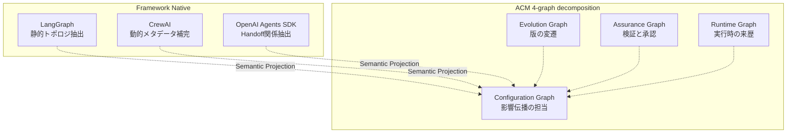

AIエージェントを本番で動かし始めると、必ず同じ問いにぶつかります。

**「なぜ今日のエージェントは、先週と違う答えを返したのか」**

プロンプトを直したのか、ツールの定義が変わったのか、モデルのバージョンが上がったのか。あるいはそのどれでもなく、実行時に解決された値が違っただけなのか。原因を切り分けようとしても、構成が 1 枚の設定ファイルにまとまっていると、変更履歴は「ファイルが変わった」以上のことを教えてくれません。

この問題に対する参照モデルが **ACM (Agentic Configuration Management)** です（arXiv:2608.11166）。エージェント構成を単一ファイルではなく、**独立に版管理できる構成要素**と**4 つの依存グラフ**へ分解し、フレームワークに依存しない形で影響分析とロールバックを可能にします。

この記事では、ACM の中心となる考え方と、それを自分の運用へ持ち込むときの判断基準を整理します。読み終えると、次の 3 つが分かります。

- エージェント構成を「何を単位に」分割すべきか
- なぜグラフを 1 本ではなく 4 本に分けるのか
- LangGraph / CrewAI / OpenAI Agents SDK のように実装が違っても共通に扱える理由と、その限界


*この記事の全体像。以下、順に解説します。*

## 単一の設定ファイルが行き詰まる理由

エージェント構成の初期実装は、たいてい 1 つの YAML や JSON にすべてを詰め込む形から始まります。この形は小さいうちは扱いやすい一方、運用が進むと 3 つの困りごとが出てきます。

| 困りごと | 単一ファイルで起きること |
| --- | --- |
| 影響範囲が読めない | プロンプトを 1 行直したとき、どのエージェント・どのツール経路に波及するかがファイル差分から判断できない |
| 来歴が追えない | ある実行結果が「どの版の構成」で生まれたのかを、実行ログから構成へ遡れない |
| 戻し先が決まらない | 不具合が出ても、承認済みの既知の良い状態がどれかを特定できない |

いずれも「構成が分割されていない」ことに起因します。ファイル単位でしか版が付かないため、変更の粒度と影響の粒度が一致しないのです。

## 中心の発想 — 構成要素を ACI として独立に版管理する

ACM はまず、構成を **ACI (Agentic Configuration Item)** という単位へ分解します。ACI とは、独立にバージョンを持てる構成要素のことです。

- エージェント定義
- プロンプト
- ツール（呼び出し定義）
- モデル

これらをそれぞれ独立した ACI として扱い、ACI 間の依存関係を明示します。ポイントは「ファイルを分ける」ことではなく、**変更の単位と影響の単位を揃える**ことにあります。プロンプトが独立した ACI であれば、「このプロンプトの改訂が、どのエージェント経由でどのツール呼び出しに届くか」を依存関係として辿れます。

そのうえで ACM は、構成リビジョンを **不変 (immutable)** に扱います。承認済みのリビジョンは書き換えず、変更は新しいリビジョンとして積む。この前提があるため「どの版へ戻すか」が一意に決まります。

判断の目安としては、次のどちらかに当てはまる要素は ACI として切り出す価値があります。

- 他の要素と**異なる頻度**で変更される（プロンプトは毎週、モデルは四半期に一度、など）
- 変更したときに**影響範囲を説明する責任**が生じる（監査・レビュー対象になる）

## なぜグラフを 4 本に分けるのか

ACM は依存関係を 1 本の巨大なグラフにまとめず、意味の異なる 4 つのビューへ分解します。



4 つのグラフはそれぞれ別の問いに答えます。

| グラフ | 答える問い |
| --- | --- |
| Configuration | この構成要素を変えると、どこまで影響が及ぶか |
| Evolution | この構成要素は、どの版からどの版へ変わってきたか |
| Assurance | この版は、どの検証を経て承認されたか |
| Runtime | この実行は、どの版の構成で、どの値に解決されて動いたか |

分ける実利は、**影響の伝播を Configuration Graph だけに限定できる**点にあります。もしすべてを 1 本に混ぜると、「昨日の実行ログがある」という事実だけでノードが繋がり、影響分析のたびに関係のない辺を辿ることになります。実行の記録（Runtime）や承認の記録（Assurance）は、影響を伝播させる辺ではなく、構成へ紐づく参照として持つ。この線引きが、影響分析を実用的な計算量と可読性に保ちます。

### 実行時解決値と承認済みベースラインを混ぜない

4 分割と対になるのが、**承認済みベースライン**と**実行時に解決された値**を分けて保持する設計です。

- 承認済みベースライン: 「こう動くはず」と合意された不変のリビジョン
- 実行時解決値: 実際にその実行で使われた具体値

両者を分けておくと、障害調査の問いが「設定ファイルの中身は何だったか」から「**合意した構成と、実際に動いた構成のどこが乖離したか**」へ変わります。前者は推測になりがちですが、後者は差分として提示できます。

説明のために書き下すと、実行の記録は次のような形になります（本稿での模式表現です）。

```yaml
run_id: 2026-08-13T09:12:04Z-7f2a
baseline:                 # 承認済みリビジョン (不変)
  agent: agent/reviewer@rev-114
  prompt: prompt/review-policy@rev-31
  tool: tool/repo-search@rev-9
  model: model/primary@rev-4
resolved:                 # その実行で実際に解決された値
  model: gpt-x-2026-07-30
  tool_endpoint: https://internal.example.com/search/v2
  temperature: 0.2
```

`baseline` はロールバックの単位、`resolved` は再現と差分検出の材料です。役割が違うので、同じ階層に混ぜないほうが後で効きます。

## フレームワークが違っても共通に扱える理由

現実のエージェントは、LangGraph、CrewAI、OpenAI Agents SDK など複数のフレームワークで実装されます。ACM はこれを **Semantic Projection**（意味的正規化）で吸収します。各フレームワーク固有の構造から依存情報を抽出し、共通のグラフ表現へ写像する、という考え方です。

重要なのは、**抽出の効きやすさがフレームワークによって違う**ことです。

| フレームワーク | 依存情報の取り方 | 静的抽出の効き方 |
| --- | --- | --- |
| LangGraph | グラフ構造からトポロジを直接抽出 | 完全に静的抽出できる |
| OpenAI Agents SDK | Handoff による委譲関係を抽出 | 委譲関係として抽出できる |
| CrewAI | アダプタのメタデータ宣言で補完 | 部分的。動的解決分は静的には取れない |

この差があっても等価な ACM 表現へ正規化できることが示されている、というのが ACM の主張です。裏を返すと、**動的にエッジが決まる実装では、静的解析だけで完全な依存グラフは作れません**。CrewAI の例が示すのは「メタデータ宣言による補完が不可欠になる」という運用上の要求です。

ここは導入時の判断ポイントになります。自分のエージェントが実行時にツールや委譲先を動的に選ぶ設計なら、**その動的な選択肢の集合を宣言として書き出す作業が別途必要**になります。宣言を書かないまま静的抽出だけに頼ると、依存グラフは実態より小さく見え、影響分析が過小評価になります。

## ACM がやらないこと

導入判断のために、スコープ外も押さえておきます。ACM は**構成管理と監査のためのガバナンスレイヤー**であり、次には介入しません。

- プランニングアルゴリズムそのもの
- 学習メカニズムの実行

これは能力の欠落ではなく、複雑性の増大を避けるための意図的な線引きです。したがって ACM は「エージェントを賢くする仕組み」ではなく、「エージェントの変更を説明可能にする仕組み」として評価するのが妥当です。エージェントの品質そのものを上げたい場合は、別の手当てが要ります。

## 自分の運用へ持ち込むときの順序

いきなり 4 グラフを実装する必要はありません。効果が出やすい順に並べると、次のようになります。

1. **依存構造を可視化する**
   既存のエージェント定義について、参照しているプロンプト・ツール・サブルーチン・ドキュメントを列挙し、依存グラフとして描く。ここで初めて「1 つのプロンプトが何箇所から参照されているか」が見えます。
2. **変更を版として記録する**
   定義ファイルの更新を「Markdown を編集した」ではなく「構成グラフ上の差分」として記録する。Evolution Graph の最小実装にあたります。
3. **実行ログから構成へ辿れるようにする**
   実行記録に、使った構成リビジョンの識別子を残す。Runtime Graph の最小実装で、これが入って初めてロールバックの起点が決まります。
4. **承認の記録を分けて持つ**
   検証を通った版にマークを付け、ベースラインとして固定する。Assurance Graph にあたります。

1 と 3 だけでも、冒頭の「なぜ先週と違う答えになったのか」にはかなり答えられるようになります。逆に、2 と 4 を先に整えても、実行と構成が紐づいていなければ調査には使えません。**着手順序としては可視化と来歴の記録が先**です。

なお、エージェント定義を複数の CLI やランタイムへ配布している場合は、配布先ごとに解決される値が変わるため、実行時解決値の記録は特に効きます。同じ定義から動いているつもりが、配布先で別の版に解決されていた、という乖離を差分として捕まえられます。

## まとめ

- ACM は、エージェント構成を **ACI という独立に版管理できる単位**へ分解する参照モデルです。
- 依存関係を **Configuration / Evolution / Assurance / Runtime** の 4 グラフへ分け、影響の伝播を Configuration Graph に限定することで、影響分析を実用的に保ちます。
- **承認済みベースラインと実行時解決値を分離**することで、障害調査の問いが「設定は何だったか」から「合意と実際の差分はどこか」へ変わります。
- **Semantic Projection** により異種フレームワークを共通表現へ正規化できますが、動的にエッジが決まる実装では静的抽出だけでは足りず、メタデータ宣言による補完が前提になります。
- ACM はプランニングや学習の実行には介入しません。狙いは「賢くする」ことではなく「**変更を説明可能にする**」ことです。
- 導入は 4 グラフの完全実装からではなく、**依存構造の可視化と実行来歴の記録**から始めるのが効率的です。

この記事が少しでも参考になった、あるいは改善点などがあれば、ぜひリアクションやコメント、SNSでのシェアをいただけると励みになります！

## 参考リンク

- [Agentic Configuration Management (arXiv:2608.11166)](https://arxiv.org/abs/2608.11166)
