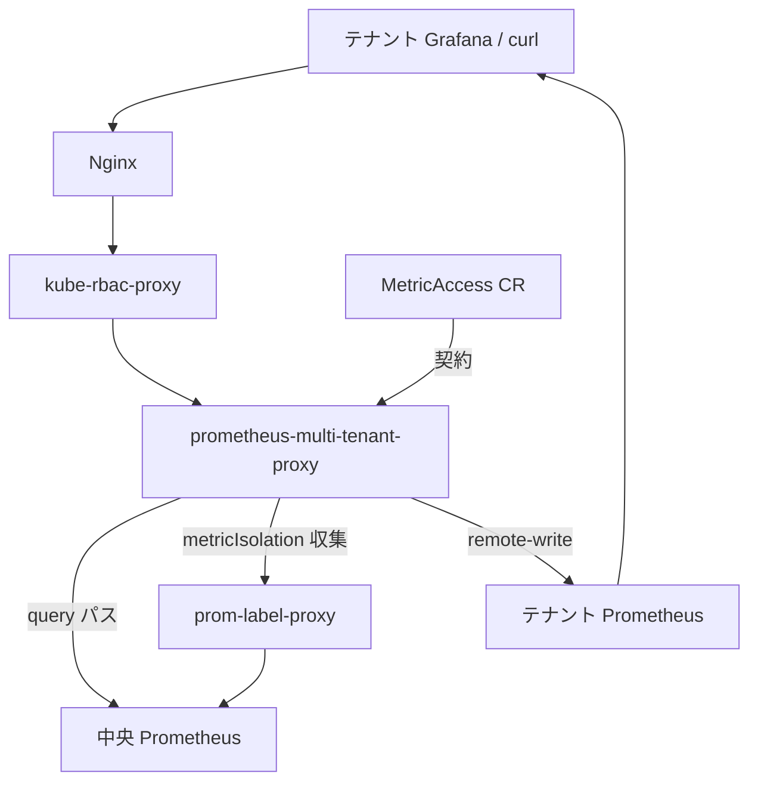
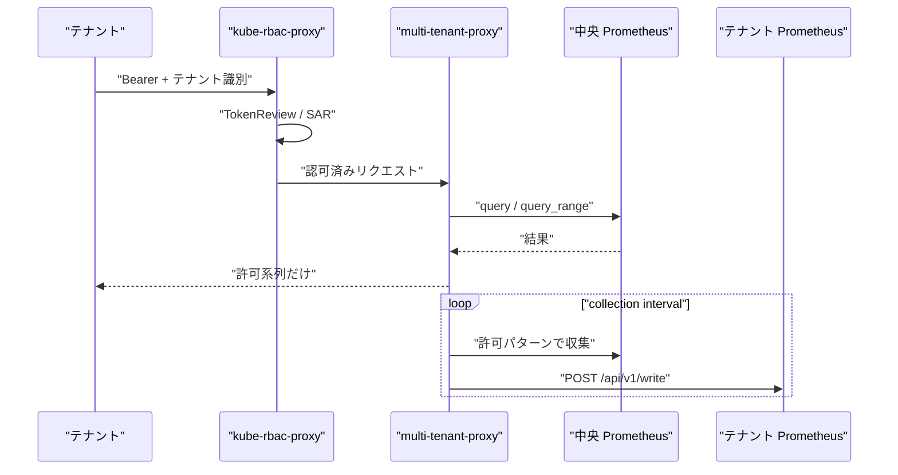

2026-09-09、CNCF Blog に [Whose GPUs are these, anyway? Secure, self-service metrics for multi-tenant Kubernetes](https://www.cncf.io/blog/2026/09/09/whose-gpus-are-these-anyway-secure-self-service-metrics-for-multi-tenant-kubernetes/) が公開されました。
著者は Bingi Narasimha Karthik 氏と Ramkumar Nagaraj 氏（Adobe）です。
共有 GPU クラスタで、中央 Prometheus に全テナントの利用率を溜めつつ、利用チームには自分の系列だけをセルフサービスで見せる運用解説です。
出典は CNCF 公式仕様ではなく、Adobe 所属技術者の寄稿です。

読者が得るものは、Identify / Isolate / Deliver の3手、読み取り経路の部品境界、公開実装と寄稿の差、フィルタ済み query とテナント Prometheus の分け方です。

:::message
寄稿の公開は 2026-09-09、公開実装の確認は 2026-09-10 時点です。拘束力のある正本は Prometheus HTTP API、prom-label-proxy、kube-rbac-proxy、NVIDIA DCGM Exporter の各公式ドキュメントです。実装の公開リポジトリは [adobe/prometheus-multi-tenant-proxy](https://github.com/adobe/prometheus-multi-tenant-proxy) です。
:::

*この記事の全体像。以下、順に解説します。*

## マルチテナントKubernetesのGPU指標セルフサービスとは

Adobe のプラットフォーム担当は、共有インフラの Prometheus をインフラ所有のまま残し、テナント向けの読み取り経路だけをプロキシの前に置く構成を公開しました。
中央ストアをそのまま開くと、PromQL が名前空間を区別しません。
他テナントの指標と容量計画が読めてしまいます。
同時に、多数の ad-hoc クエリが共有ストアの負荷になります。

対象読者は、共有 GPU クラスタで費用責任と指標閲覧権限を揃えたいプラットフォーム担当です。

寄稿の3手は次です。

| 手 | 役割 |
|---|---|
| Identify | 呼び出し元とテナントを確定する |
| Isolate | 名前空間に閉じた系列だけ見せる |
| Deliver | 任意でテナント所有の Prometheus へ remote-write する |

契約は Kubernetes の `MetricAccess` カスタムリソースです。
apiVersion は `observability.ethos.io/v1alpha1`、API group は `observability.ethos.io` です。
テナントは欲しい指標名、正規表現、PromQL セレクタを宣言します。
`metricIsolation: true` のとき、収集時にも名前空間フィルタが掛かります。
寄稿の typical tenant 例は、約 10,000+ 系列から約 300 系列へ減ります（roughly 97% cut）。

クエリ例の前提は、NVIDIA DCGM Exporter の `DCGM_FI_DEV_GPU_UTIL`（GPU 利用率 %）です。
公開実装のライセンスは Apache-2.0 です。
KubeCon + CloudNativeCon India 2025 の関連トーク [Unlocking Kubernetes Observability: Secure, Tenant-Centric Metrics for GPU Workloads](https://www.youtube.com/watch?v=gI40zpbES5w) があります。
寄稿自身が、小さなチームはフィルタ済みクエリだけで足り、remote-write はダッシュボードとアラートを持つチームに限ると書いています。

読み取り経路の部品は Nginx、kube-rbac-proxy、マルチテナントプロキシ、prom-label-proxy、Prometheus です。

責任は「誰か」と「何を見せるか」と「どこに置くか」で分かれます。

| 部品 | 持つもの | 持たないもの |
|---|---|---|
| kube-rbac-proxy | TokenReview / SubjectAccessReview。ヘッダまたは query から namespace を取り SAR | PromQL の意味 |
| prom-label-proxy | PromQL AST へのラベル強制。authn/authz はしない | 本人確認 |
| prometheus-multi-tenant-proxy | MetricAccess の監視、バックエンド発見、応答フィルタ、remote-write | それ単体での強い認証。OIDC/LDAP は Roadmap 未完了で、公開コードに実装なし |
| MetricAccess | 指標の許可リストと配信先 | クラスタ全体の RBAC |
| 中央 Prometheus | 全テナントのスクレイプ | テナント境界 |
| テナント Prometheus | 受け取った系列の長期保存とアラート | 他テナントの系列（収集時隔離が効いている場合） |

読み取りと配信は別経路です。

## 注意点

出典は CNCF プロジェクトの到達宣言ではありません。
寄稿者が portable idea と呼び、他手法もあると明記しています。
ハイライトされた CNCF プロジェクトは Kubernetes のみです。
`adobe/prometheus-multi-tenant-proxy` は CNCF プロジェクトではありません。
CRD の API group は Adobe Ethos 内部名 `observability.ethos.io` です。

| 記事の言い方 | 実装・公式側の限定 |
|---|---|
| Isolate は prom-label-proxy が全クエリへ `{namespace="your-namespace"}` を注入し、PromQL では迂回できない | 公開コードの query パスは AST 書き換えではない。中央へ元の PromQL を送り、返ってきた `result[]` を `ValidateAccess` で間引く。prom-label-proxy は `metricIsolation: true` の収集パスで `localhost:8082` に送るときに使う |
| kube-rbac-proxy が認証し、namespace assertion を下流へ運ぶ | プロキシ単体は `X-Tenant-Namespace` または `namespace` query を信頼する。寄稿の curl 例もヘッダだけ。OIDC/LDAP は README Roadmap 上未完了で、確認した公開コードに実装がない |
| metricIsolation で typical tenant が 10,000+ → 300（roughly 97%） | Adobe の typical 例。ベンチマークではない。`metricIsolation: false` は選択した指標を名前空間制限なしで収集する |
| Isolate は名前空間に閉じた系列だけ見せる | 公開実装の query 側 `ValidateAccess` は指標パターンと明示の `labelSelectors` だけを見る。CR の namespace を自動注入しない。パターンが指標名のみでセレクタが空なら、同名の他 namespace 系列も通り得る |
| 11 日間 0% の GPU を発見 | 寄稿の社内スナップショット。分母・クラスタ規模は未記載 |
| セットアップは CNCF-native だけで足りる | kube-rbac-proxy の README は alpha。flags / behavior が変わり得ると書く |

公開リポジトリの注目度（`gh repo view`、2026-09-10）は次です。

- `adobe/prometheus-multi-tenant-proxy`: 約 8 stars、archived ではない、最終 push 2026-09-05
- `prometheus-community/prom-label-proxy`: 約 348 stars
- `kube-rbac-proxy/kube-rbac-proxy`: 約 685 stars

「thousands of namespaces」の実数は寄稿以外に一次がありません。
Adobe 本番が公開リポジトリと同一か、社内フォークで query パスにも prom-label-proxy を挟んでいるかは未確認です。
複数 `MetricAccess` を同一 namespace でマージすると、query 側の tenant ID が `merged/<ns>` になり、`ValidateAccess` が `namespace/name` しか見ないため全拒否になり得ます。
これはコード読解であり、公開 issue には未記載です。

## 中央ストアをテナントに開けない理由

Prometheus HTTP API は名前空間を知りません。
1 クエリが通れば任意の PromQL が通ります。
寄稿はこれをセキュリティと noisy-neighbor の2壁として書きます。

公式の [prom-label-proxy](https://github.com/prometheus-community/prom-label-proxy) は、この読み取りマルチテナントのためにラベルを強制します。
認証は前段の仕事です。

データを持っていても、閲覧権限が費用責任と揃っていなければ、GPU 遊休の発見が遅れます。
解決の核は新しい時系列基盤ではなく、既存 Prometheus の前にテナント契約を置くことです。

## IdentifyとIsolateの信頼境界

寄稿のクエリ例は `X-Tenant-Namespace` です。
公開実装 `extractTenantInfo` の優先順は次です。

1. `X-Internal-Collection: true` なら内部テナント（パターン `.*`）を返す
2. `X-Tenant-Namespace`
3. 設定があれば Authorization（中身は再びヘッダ）
4. `namespace` query

query 経路では、内部テナント ID `internal-collection` を `ValidateAccess` が map 上の `namespace/name` と照合します。
現行コードでは結果が空になります。
非 query は識別成功後に無フィルタ転送します。
debug 系は識別処理自体を通りません。

[kube-rbac-proxy](https://github.com/kube-rbac-proxy/kube-rbac-proxy) は TokenReview のあと SAR します。
`byHttpHeader` / `byQueryParameter` でクライアント入力を namespace に埋め、その名前空間の Resource 権限を見ます。
OpenShift 4.0 以降の出荷例は query parameter `namespace` で kube-rbac-proxy と prom-label-proxy を揃えます（prom-label-proxy README）。
Grafana Mimir も `X-Scope-OrgID` を信頼し、前段プロキシ必須と公式が書きます。

ヘッダは認証ではありません。
認証済み主体が「どの名前空間を名乗ってよいか」を SAR で縛って、初めて Identify になります。
kube-rbac-proxy を外す、`--ignore-paths` で認証を飛ばす、NetworkPolicy なしで Pod 間通信を許す、とヘッダ偽装が通ります。
Adobe がヘッダ、OpenShift が query param なので、OpenShift 用 ConfigMap をそのまま前段に置くと SAR と識別がずれます。

公開 issue [adobe/prometheus-multi-tenant-proxy#12](https://github.com/adobe/prometheus-multi-tenant-proxy/issues/12)（CLOSED）は「Cannot filter query by namespace」です。
投稿者が誤った endpoint を使っていたと自己解決しています。

Isolate 側の確立事実は次です。

- prom-label-proxy は `/api/v1/query` と `/query_range` の AST を書き換えます。`/api/v1/labels` は既定オフです。古い Prometheus では `match[]` がなく全ラベルが漏れます
- Adobe の query/query_range は応答フィルタです。`ValidateAccess` は指標パターンと明示の `labelSelectors` を見るだけで、CR の namespace を自動では足しません
- `/api/v1/series` と `/api/v1/labels` は README 上 proxied です。実装は query 以外を reverse proxy 素通し（識別成功後）です
- `/debug/targets`、`/debug/tenants`、`/collected-metrics` にテナント認可がありません。`/collected-metrics` は収集キャッシュが空だと中央へ直接 query します
- `X-Internal-Collection: true` は識別を内部テナントへ切り替えます。query では後段 ID 照合で空になり、非 query では識別成功後に素通しします。ヘッダはバックエンドへコピーされます
- k8spin/prometheus-multi-tenant-proxy は既定で query / query_range / series だけを通します

寄稿が言う「PromQL では迂回できない」は、prom-label-proxy を全読み取り経路の前に置いたときの性質です。
公開されている Adobe プロキシの query パスは応答フィルタであり、namespace 自動強制ではありません。
ネットワーク到達できるクライアントにとって、debug と非 query API が残りの穴になります。

## GPU指標のnamespaceラベルが欠けるとき

NVIDIA 公式では、`pod` / `namespace` / `container` は `--kubernetes` かつ kubelet pod-resources の mapping 成功時に付きます。
dcgm-exporter README の Kubernetes 例は `namespace=""` `pod=""` を出します。

- [NVIDIA/dcgm-exporter#277](https://github.com/NVIDIA/dcgm-exporter/issues/277)（CLOSED）: ワークロードがあるときだけ Pod/Namespace ベースの GPU 使用量が取れる
- [NVIDIA/dcgm-exporter#497](https://github.com/NVIDIA/dcgm-exporter/issues/497)（CLOSED 2025-05-29）: native sidecar（`restartPolicy: Always` の initContainer）で namespace/pod/container が欠ける。同日 PR #498 が pod-resources API を v1 へ上げてマージ済み。利用中バージョンへの包含は別確認

`DCGM_FI_DEV_GPU_UTIL` は公式カウンタ CSV で「GPU utilization (in %)」です。
サンプル周期は製品依存です。
prom-label-proxy は write isolation をスコープ外とします。
scrape の `honor_labels: true` とテナント制御の relabel で、他テナントを汚染できます。

寄稿の 11 日 0% は、割り当て済み・電源オン・利用率ゼロです。
未割当とは書いていません。
割り当て済み Pod があり mapping が成功していれば `namespace` ラベルは付き、テナント側の低利用率クエリで検出できます。

mapping できない GPU（未割当、`--kubernetes` オフ、一時的な欠落）は `namespace=""` になります。
`metricIsolation: true` の `{namespace="tenant"}` 注入ではテナントへ届きません。
未割当カードの発見はクラスタ運営側のビューに残します。
time-slicing ではデバイス利用率が複数 Pod の合算になります。
名前空間合計は過大にも過小にも読めます。

## DeliverでテナントPrometheusへ渡す条件

テナント Prometheus は `--web.enable-remote-write-receiver` が必要です。
既定オフです。
Prometheus 3.x でも明示フラグが要ります（[prometheus/prometheus#16209](https://github.com/prometheus/prometheus/issues/16209)）。

[Prometheus Remote Write spec](https://prometheus.io/docs/specs/remote_write_spec/) は次です。

- Sender は 5xx を MUST retry
- 2xx と 4xx（429 以外）は MUST NOT retry
- 429 は MAY
- 永続バッファは推奨
- 指数 backoff と WAL は MUST ではない

Adobe `sendRemoteWrite` は最大 3 回、1s/2s/3s の線形 backoff です。
非 2xx をすべて再送します。
429 以外の 4xx 再送は仕様違反です。
永続バッファはありません。
失敗分は次の collection interval まで落ちます。

HA は StatefulSet の各 Pod DNS へ同一ペイロードを並行 POST します。
仕様は複数受信先への同時送信を禁止しません。
1 台失敗で Send 全体が error になります。
成功した replica には既に書かれているので、部分成功の扱いが要ります。

Prometheus の decoded body 上限は 32 MiB です（Adobe コメントおよび client_golang）。
確認した Prometheus 3.5.3 では、展開後サイズ超過が 400、圧縮 body 超過は 413 です。
Adobe の `batch_size`（設定例 1000）は系列数分割であり、バイト上限を保証しません。
4xx 再送は成功しません。

Pushgateway collector の `Send` は `return nil` の placeholder です。
README は機能として書きます。
公式 Prometheus sender は、受信側が約 2 時間落ちると WAL 圧縮で未送信を失います。
Adobe 送信側に WAL が無いので、落ちている間の interval 分はより短い単位で消えます。

寄稿の「Delivery の sharp edges を先に予算せよ」は、公開コードの再送実装と一致する問題意識です。
429 以外の 4xx 再送は仕様違反です。
永続バッファがなく、障害中の interval 分を失います。
指数 backoff と WAL は改善案です。

## フィルタ済みqueryと専用ストアの選び方

| 基準 | フィルタ済み query のみ | Adobe Deliver（テナント Prometheus） | OpenShift UWM + Thanos Querier | Mimir / Cortex |
|---|---|---|---|---|
| ユースケース | 小チーム、一時的な可視化 | 自前 Grafana / アラートを持つチーム | OpenShift 上の標準監視 | 大規模マルチテナント SaaS 型 |
| 隔離の場所 | クエリ時（正しいプロキシなら AST） | 収集時 + 応答フィルタ（実装は経路で違う） | クエリ時 AST + scrape 時 enforcedNamespaceLabel | 保存時（テナント別 TSDB） |
| 実装の複雑さ | 低い | CRD + remote-write + テナント TSDB | クラスタオペレータに乗る | 専用クラスタ |
| 運用負荷 | 中央の query 負荷が残る | テナント数 × Prometheus | 既存スタック | 一つの書き込み面 |
| 監査 | 中央ログに残る | テナント側と中央で二重 | クラスタ監視の監査モデル | テナント ID 付き ingestion |
| noisy-neighbor | 残りやすい | 日常クエリはテナント側へ移せる | Querier 側で制限 | ingestion quota |
| リスク | プロキシ欠落で全見え | ヘッダ信頼、非 query 素通し、WAL なし | kube-rbac-proxy は alpha | ヘッダ信頼は同じ。保存は分離済み |

フィルタ済み query がより良い場合は次です。

- ダッシュボードが少なく、中央の query 負荷が許容できる
- 遊休 GPU など namespace のない系列をプラットフォームが見る

Deliver がより良い場合は次です。

- チームが自分の PrometheusRule / 長期 retention を持つ
- 中央ストアを日常クエリのクリティカルパスから外したい
- `metricIsolation: true` と exporter の namespace ラベルが揃っている

OpenShift / Mimir がより良い場合は次です。

- すでにその基盤がある。Adobe プロキシを足す理由が薄い
- scrape 時点の `enforcedNamespaceLabel` やテナント別ストレージが欲しい

費用責任と指標閲覧を揃えるには、中央 Prometheus を全テナントに開きません。
認証の前段とラベル強制（または保存時テナント分割）を置きます。
Adobe 寄稿はその問題設定を現場の言葉で示しています。
公開プロキシを「PromQL 迂回不能な標準実装」として、そのまま本番の唯一の穴埋めにするのは早計です。

支持できる点は次です。

- 中央ストアを開くと PromQL が他テナントを読める、は Prometheus API の性質そのもの
- prom-label-proxy 公式が auth を前段に分離し、OpenShift 4.0 から kube-rbac-proxy と組んで出荷している
- 寄稿が「小さなチームは query だけでよい」「Delivery が鋭い」と自分で限定している
- DCGM の利用率・電力・フレームバッファ指標は公式フィールドとして存在する

確信度を下げる点は次です。

- Adobe query パスは AST 強制ではなく応答フィルタ。namespace 自動注入はない。noisy-neighbor は残る
- `X-Tenant-Namespace` はプロキシ単体ではクライアント入力。`X-Internal-Collection` は識別を迂回するが、現行 query では後段照合で空、非 query では素通し
- 非 query API は識別後に素通し。debug は識別なし
- 未割当 / mapping 失敗の GPU は `namespace=""` になり metricIsolation ではテナントへ届かない。割り当て済み・低利用率はラベルがあれば届く
- remote-write は 429 以外の 4xx を再送し、永続バッファがない。HA 並行 POST は部分成功を error にする
- 公開リポジトリの注目度は 2026-09-10 時点で約 8 stars と小さい。本番採用規模は不明

問題設定（見えない GPU は払っているのに遊休する）は強いです。
部品の組み合わせ（kube-rbac-proxy + prom-label-proxy + 任意の専用ストア）は再利用できます。
公開されている Adobe プロキシの読み取り隔離は、寄稿が描く prom-label-proxy 強制より弱いです。
本番では「寄稿の3手」を採用し、「公開バイナリの挙動」を盲信しません。

逆転条件は次です。

- テナントが scrape 設定を自分で持ち `honor_labels` を制御できる（書き込み汚染。prom-label-proxy 公式がスコープ外と書く）
- GPU が time-slice / MIG で複数テナント共有（namespace 合計がデバイス実態と一致しない）
- すでに OpenShift UWM または Mimir がある（同じ問題を既存機能で解ける）

## 本番に載せる前の検収

公式ドキュメントと公開コードから、セットアップ前に次を確認します。

| 項目 | 結果 |
|---|---|
| レート制限 | prom-label-proxy に inbound QPS なし。kube-rbac-proxy は kube-apiserver 向け `--kube-api-qps` / `--kube-api-burst` のみ。寄稿の Nginx は負荷分散 |
| API サンプル | 各 README の curl。Adobe は `X-Tenant-Namespace`。prom-label-proxy は query param または `-header-name` |
| エラー / リトライ | prom-label-proxy は欠落パラメータで error JSON、衝突で `-error-on-replace` なら 400。remote-write spec は 5xx MUST retry、4xx MUST NOT（429 以外） |
| 認証 | kube-rbac-proxy: TokenReview + SAR。prom-label-proxy: しない。Adobe プロキシ: ヘッダ識別。auth-header 伝播は TLS 必須（kube-rbac-proxy `WithAuthHeaders`） |
| ライフサイクル | kube-rbac-proxy README は alpha。prom-label-proxy labels API は Prometheus >= 2.24。remote-write receiver は `--web.enable-remote-write-receiver` |
| 制約 | PromQL labels API 既定オフ。Silences の複数テナント非対応。remote-write decoded 32 MiB。Adobe 収集は localhost:8082 固定 |

推奨は次です。

1. 問題設定は採用する。GPU 費用の責任者に、その名前空間の利用率を見せる。中央ストアの read を全員に渡さない
2. 隔離の正本は prom-label-proxy の AST 強制（または Mimir の保存時テナント）にする。Adobe プロキシの応答フィルタだけに頼らない
3. Identify は kube-rbac-proxy（または同等）の TokenReview + SAR を必須にする。クライアントが付けた `X-Tenant-Namespace` をプロキシが信じない。ヘッダ名と query param を前段と揃える
4. Deliver はダッシュボードとアラートを持つチームに限る。未割当 GPU と mapping 失敗はクラスタ運営のビューに残す。割り当て済みの低利用率はテナント側クエリで見る
5. 公開プロキシを入れるなら、query 以外のパスを閉じ、`X-Internal-Collection` と debug をクラスタ内 NetworkPolicy の外に出さない。remote-write は 5xx のみ再送し 4xx（429 以外）は落とす。永続バッファ付き sender への寄せは改善案

直近の確認手順は次です。

1. 中央 Prometheus の query 入口に、誰が何の namespace で SAR されているかを図にする
2. DCGM の `namespace` ラベルが付く条件（`--kubernetes`、device plugin、実際の GPU Pod）をクラスタで実測する
3. 遊休 GPU 用のクラスタ視点クエリと、テナント視点クエリを分ける
4. remote-write が必要なら受信側フラグと 32 MiB 制限を先に確認する

未確認のまま残る点もあります。

- Adobe 本番マニフェスト（kube-rbac-proxy の rewrite がヘッダか query か）
- `merged/<ns>` の ValidateAccess 不一致が本番で顕在化しているか
- 11 日遊休 GPU の台数・金額
- KubeCon India 2025 トークのデモが Nginx rate limit をどう設定したか
- Pushgateway / 外部 remote_write の本番利用。Pushgateway 実装は no-op

アーキテクチャ方針（権限と閲覧を揃える、query と配信を規模で分ける）はブロックしません。
公開プロキシをクラスタの唯一の隔離層にする判断は、確信度を下げます。
前段の kube-rbac-proxy と NetworkPolicy、query パスへのラベル強制、GPU 遊休用のクラスタ視点ダッシュボードが揃ってから採用します。

## まとめ

共有 GPU クラスタでは、中央 Prometheus の read を全員に渡しません。
費用責任者に、その名前空間の利用率だけを見せます。

核は新しい時系列基盤ではなく、認証の前段とラベル強制です。
小さなチームはフィルタ済み query で足ります。
自前 Grafana とアラートを持つチームだけ Deliver します。
未割当 GPU はクラスタ運営のビューに残します。

確信度を下げるべきなのは、公開 Adobe プロキシ単体の読み取り隔離です。
query パスは応答フィルタです。
namespace の自動強制はありません。
隔離の正本は prom-label-proxy の AST 強制、または保存時テナント分割です。

この記事が少しでも参考になった、あるいは改善点などがあれば、ぜひリアクションやコメント、SNSでのシェアをいただけると励みになります！

## 参考リンク

1. Bingi Narasimha Karthik, Ramkumar Nagaraj, “Whose GPUs are these, anyway? Secure, self-service metrics for multi-tenant Kubernetes,” CNCF Blog, 2026-09-09. https://www.cncf.io/blog/2026/09/09/whose-gpus-are-these-anyway-secure-self-service-metrics-for-multi-tenant-kubernetes/
2. adobe/prometheus-multi-tenant-proxy. https://github.com/adobe/prometheus-multi-tenant-proxy
3. prometheus-community/prom-label-proxy. https://github.com/prometheus-community/prom-label-proxy
4. kube-rbac-proxy. https://github.com/kube-rbac-proxy/kube-rbac-proxy
5. Prometheus Remote Write specification. https://prometheus.io/docs/specs/remote_write_spec/
6. Prometheus remote write practices. https://prometheus.io/docs/practices/remote_write/
7. NVIDIA DCGM Exporter. https://docs.nvidia.com/datacenter/cloud-native/gpu-telemetry/latest/dcgm-exporter.html
8. NVIDIA DCGM Exporter metrics / labels. https://docs.nvidia.com/datacenter/dcgm/latest/reference/dcgm-exporter-metrics.html
9. NVIDIA/dcgm-exporter default-counters.csv (`DCGM_FI_DEV_GPU_UTIL`). https://github.com/NVIDIA/dcgm-exporter/blob/main/etc/default-counters.csv
10. Grafana Mimir authentication and authorization. https://grafana.com/docs/mimir/latest/manage/secure/authentication-and-authorization/
11. KubeCon + CloudNativeCon India 2025 talk recording. https://www.youtube.com/watch?v=gI40zpbES5w
