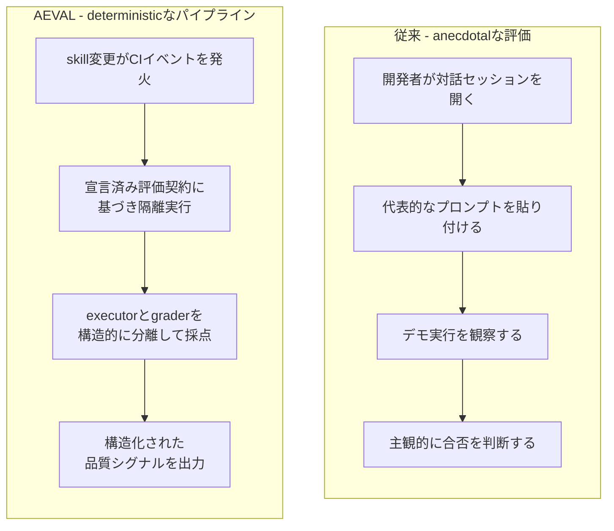
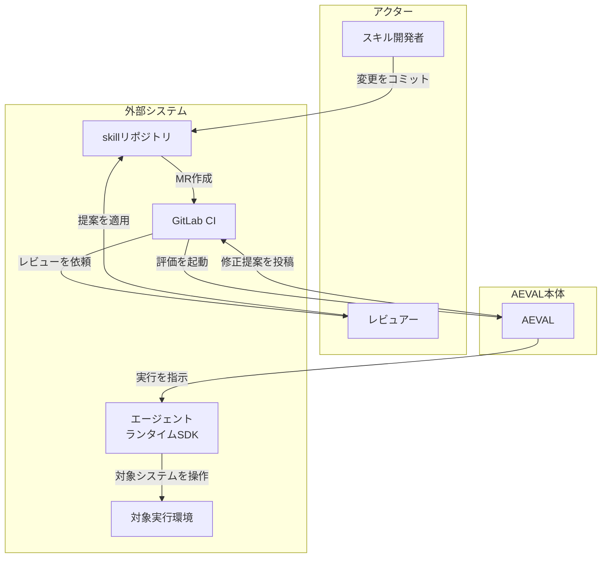
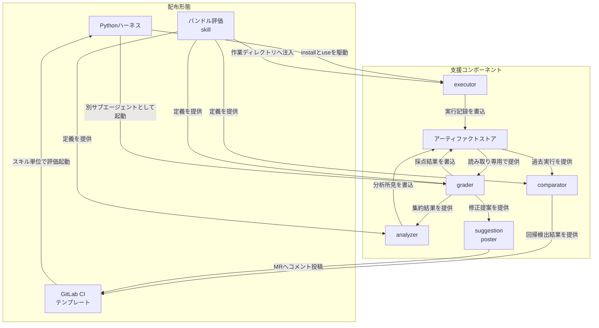
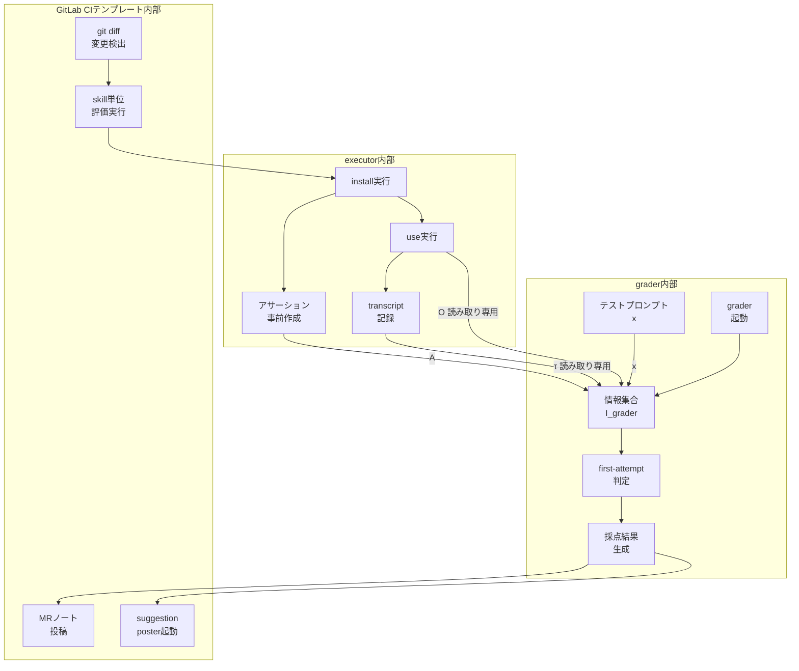
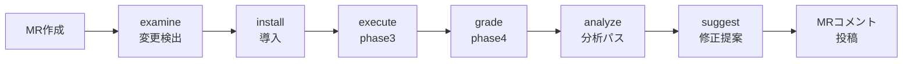
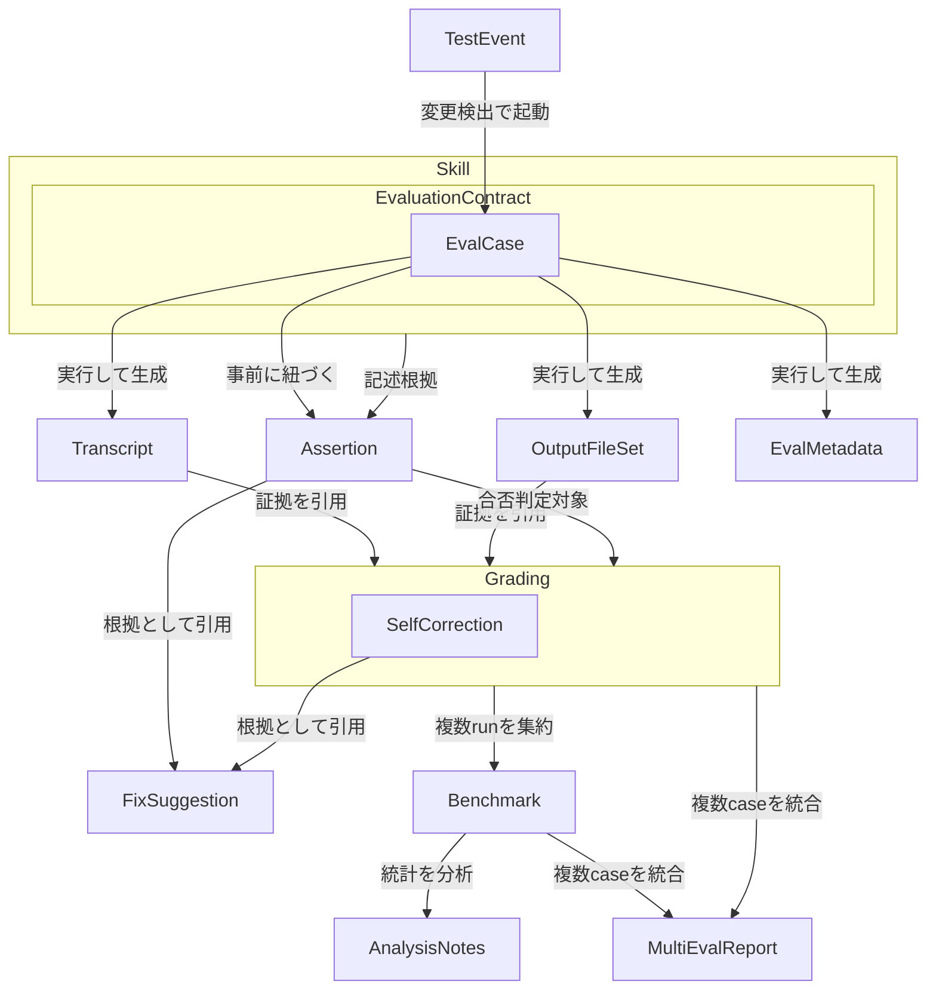
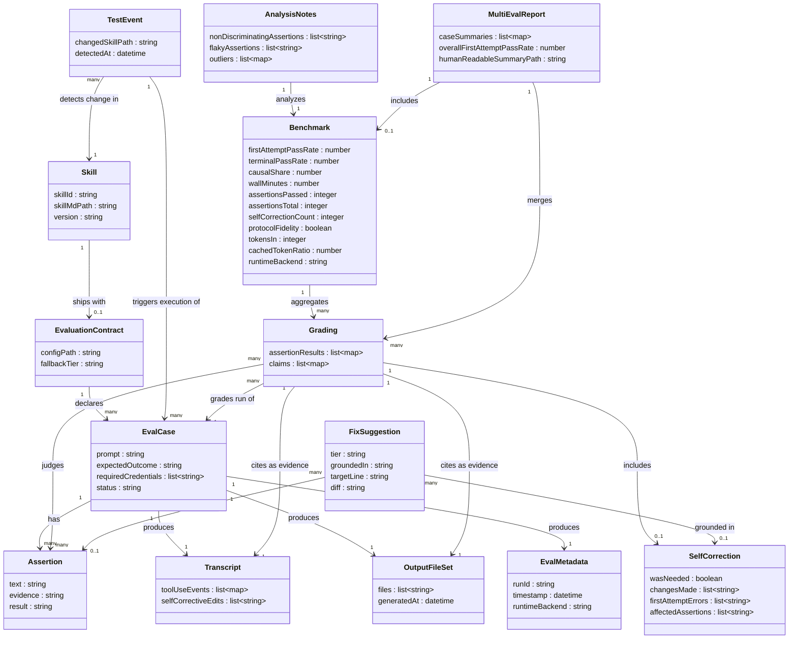
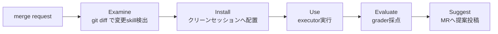

AEVAL (Agentic Evaluation) は、エージェント skill の品質確認を、逸話的な手作業デモから決定論的な CI パイプラインへ置き換える論文です。中心的な貢献は、実行役が自分でエラーを直してから「合格」と報告する self-correction bias を、実行役 (executor) と採点役 (grader) の構造的分離で防ぐ点にあります。本記事は arXiv:2607.16345 の記述をもとに、AEVAL の概要・特徴・内部構造・データモデル・構築方法・利用方法・運用・ベストプラクティスを整理します。公開実装が無いため、コード例はすべて論文記述に基づく実装案です。

> 検証時点: 2026-07-22

## この記事の前提

| 項目 | 値 |
|---|---|
| 調査対象 | AEVAL (Agentic Evaluation) |
| 論文タイトル | AEVAL: From Anecdotal to Deterministic Testing for Agentic Skill Workflows |
| arXiv ID | [arXiv:2607.16345v1](https://arxiv.org/abs/2607.16345) [cs.SE] |
| 投稿日 | 2026-07-16 |
| 著者 | Tejas Singh Anand, Yuet Ying Christina Wang, Wanting Jiang, Steve Masson, Tian Zheng, Bingjie Zhou |
| ライセンス | CC BY 4.0 |
| 公開実装 | 無し (production agentic stack への社内デプロイ) |

> **本記事の読み方**: AEVAL には公開実装がありません。本文中のコード例はすべて、論文の記述に基づく **実装案** です。AEVAL の公式実装ではありません。論文が明記した事実と、実装のための補完を区別して記述しています。

## 概要

### AEVAL とは

AEVAL (Agentic Evaluation) は、エージェント skill の品質確認を **anecdotal (逸話的) な手作業確認**から **決定論的 (deterministic) な CI パイプライン**に置き換える論文です。

skill とは、`SKILL.md` と付随スクリプト・設定からなるバージョン管理済みの installable package です (Anthropic, 2025 の定義)。エージェントランタイムがこれを読み込み、タスクを実行します。

#### 何を問題視しているか

現状の skill 評価は次の手順に依存しています。

1. 開発者が対話セッションを開く
2. 代表的なプロンプトを貼り付ける
3. デモ実行を観察する
4. 「まだ動いている」と主観的に判断する

この手順には次の弱点があります。

| 弱点 | 内容 |
|---|---|
| 再現性が無い | 同じ skill でも実行のたびに異なるコードパスを通り、異なる出力になる |
| 版間比較ができない | 2 つのバージョンの結果を客観的に比較できない |
| スケールしない | skill が数十〜数百に増えると、サイレントな regression が蓄積する |

#### 何に置き換えるか

AEVAL は、skill への変更を **CI がトリガーするテストイベント**として扱います。skill が宣言した評価契約 (`eval.config`) に基づき、自動化された executor 内で実行し、構造化された機械可読の品質シグナルを出力します。このシグナルは実行間で再現可能であり、MR (merge request) 間で比較可能であり、人間の解釈なしに下流の CI が消費できます。

### self-correction bias とは

AEVAL の中心的な技術的貢献は、**self-correction bias (自己修正バイアス)** という失敗モードの特定と、その防止策です。

#### なぜ発生するか

LLM エージェントはエラーから回復するように訓練されています (Saunders et al., 2022; Bai et al., 2022)。同一のエージェントが skill の実行と採点を兼ねると、次の現象が起こります。

1. 実行中にエラーに遭遇する
2. エージェントが黙って再試行・設定変更・skill のその場パッチを行う
3. 何かが成功するまで繰り返す
4. 自分が作り出した (パッチ後の) 世界の状態を、正直に「合格」と報告する

#### なぜ従来手法で検出できないか

この報告は嘘ではありません。エージェントは自分がパッチした後の状態を正確に報告しています。しかし、その評価が測っているのは **skill 自体の品質ではなく、エージェントのデバッグ能力**です。劣化した skill でも、エージェントが十分賢ければ 100% 合格に見えてしまいます。

この現象は、LLM-as-judge における self-preference 効果 (Panickssery et al., 2024; Zheng et al., 2023) と構造的に関連します。ただし対象が異なります。self-preference 研究はモデル出力の判定を扱うのに対し、AEVAL が扱うのは、**実行中に世界の状態を能動的に書き換えるエージェントが生成する skill artifact の挙動判定**です。

AEVAL はこれを、実行役 (executor) と採点役 (grader) の構造的分離によって防ぎます (分離の内部構造は別セクションで扱います)。

### 全体像



##### 従来 - anecdotalな評価

| 要素名 | 説明 |
|---|---|
| 開発者が対話セッションを開く | 手動でエージェントとの対話を開始する |
| 代表的なプロンプトを貼り付ける | 動作確認用の入力を人手で用意する |
| デモ実行を観察する | 1 回限りの実行結果を目視で確認する |
| 主観的に合否を判断する | 客観的基準がなく、判断が実行者に依存する |

##### AEVAL - deterministicなパイプライン

| 要素名 | 説明 |
|---|---|
| skill変更がCIイベントを発火 | skill への変更コミットが自動でテストをトリガーする |
| 宣言済み評価契約に基づき隔離実行 | 開発者が事前宣言した `eval.config` を隔離セッションで実行する |
| executorとgraderを構造的に分離して採点 | 実行したエージェントとは別のサブエージェントが採点する |
| 構造化された品質シグナルを出力 | 機械可読なアーティファクトとして CI が消費できる形で出力する |

### 本論文の位置づけと限界

AEVAL を読む際は、次の 3 点を前提として押さえる必要があります。

| 観点 | 内容 |
|---|---|
| 実装の公開状況 | 公開実装 (GitHub repo / パッケージ) は存在しません。論文は「production agentic stack への社内デプロイ」であり、OSS として配布されていません |
| 経験的評価の性質 | §7 の評価は **定性的**です。劣化させた skill を使った 2 件のケーススタディと、1 件のクロスランタイム較正テーブルのみが提示されており、著者ら自身が「完全な定量研究は extended version に先送りする」と明記しています |
| 保証の種類 | 確率的なカバレッジ保証 (conformal prediction の意味での) ではありません。「grader の信号が post-correction 状態ではなく first-attempt 実行の関数である」という**構造的保証**にとどまります |

その他の限界として、次が挙げられています。

- シミュレーション出力の禁止は instruction による強制であり、sandbox による強制ではありません。十分に高能力なエージェントは原理的にこの禁止を破り得ます
- first-attempt grading rule は、grader が実行トランスクリプト中の因果的な自己修正を正しく同定できることに依存します。複雑な多段階の修正は誤って帰属される可能性があります
- per-runtime での評価はランタイム固有の互換性問題を表面化させますが、計算コストがランタイム数に比例して線形に増加します
- LV1 (merge-blocking) と LV2 (advisory) の境界は、causal share (LV1 / (LV1 + LV2)) がランタイムによって大きく異なるため (§7.1 で平均 0.41 の gap を報告)、単一のグローバルな閾値では under-fit します。per-runtime の閾値設計は将来課題として残されています

## 特徴

- skill への変更を CI トリガーのテストイベントとして扱い、手動の対話確認を不要にします
- 開発者が事前宣言した評価契約に基づき、隔離された SDK セッションで再現可能にテストを実行します
- 実行役 (executor) と採点役 (grader) を構造的に分離し、grader を読み取り専用の情報 (テストプロンプト・実行トランスクリプト・出力ファイル・事前アサーション) に制限します
- **first-attempt grading rule** により、自己修正が絡んだ成功は最終的に通っても FAIL 扱いにし、CI のゲート信号を初回試行の結果のみに基づかせます
- 自己修正の発生有無・回数を明示的に記録し、監査可能なログとして残します
- 修正提案を LV1 (merge-blocking の causal fix) と LV2 (advisory な quality improvement) に階層化し、根拠となるアサーションや自己修正記録に必ず紐づけます
- 提案は GitLab MR の該当行にインラインコメントとして投稿され、1 クリックで適用できます
- Claude 系・Codex 系・OpenCode 系の複数エージェントランタイムで動作検証済みで、ランタイムに依存しません
- 出力は機械可読な構造化アーティファクトであり、baseline との比較で pass-rate の変化や新規失敗を検出できます
- 確率的なカバレッジ保証ではなく、「grader の信号が post-correction 状態ではなく first-attempt 実行の関数である」という構造的保証を提供します

### 関連技術との比較

論文の Related Work (§2) が挙げる 3 層の既存プラットフォームと、LLM-as-judge の系譜を整理しました。比較対象はすべて WebSearch で実在を確認済みです。

| 分類 | 代表例 | 評価のトリガー | 再現性 | 実行役と採点役の分離 | 自己修正の扱い | CI 統合 | 成果物の機械可読性 |
|---|---|---|---|---|---|---|---|
| 従来の anecdotal skill 評価 | 対話セッションでのデモ確認 | 手動、思いつき | なし | なし (開発者自身が実行かつ判断) | 考慮しない | なし | 人間の印象のみ |
| Prompt/response 評価プラットフォーム | LangSmith、Braintrust、Promptfoo | データセット実行時 | データセット固定なら比較的高い | モデル出力を採点するのみで、skill のインストール・実行は行わない | 評価対象外 (skill を実行しない) | プラットフォーム連携次第 | 構造化スコア |
| Capability benchmark | OpenAI Evals、AgentBench、SWE-bench | 固定データセットに対する評価実行時 | 高い (固定タスク) | モデルの汎用問題解決力を測るもので、開発者固有の skill を指せない | 評価対象外 | MR 単位で変更 skill を指すことができない | 構造化スコア |
| Sandboxed agent evaluation | Harbor Framework | コンテナでの評価実行時 | コンテナ環境で再現可能 | エージェント自体を評価対象とし、構造的に独立した grader は持たない | 分離されておらず、自己修正が結果に混入し得る | 限定的 | 部分的 (reward/ログ) |
| LLM-as-judge | Zheng et al. (2023) 型プロトコル | 出力生成後の判定要求時 | プロンプトが同一なら比較的高いが self-preference で歪み得る | 判定者も LLM だが、同一エージェントによる自己採点も起こり得る | self-preference bias を誘発しやすい (Panickssery et al., 2024) | 一般に無し | 判定ラベルのみ |
| **AEVAL (本論文)** | — | skill 変更の CI イベント (MR) | 高い (契約固定 + 構造分離) | 明示的に分離 (executor と grader は別サブエージェント・別セッション) | 検出・記録し、first-attempt FAIL として CI に報告 | GitLab CI ネイティブ (再利用可能テンプレートを提供) | 6 種類の JSON/Markdown アーティファクト |

#### 位置づけの要点

- **Prompt/response 評価プラットフォーム** (LangSmith / Braintrust / Promptfoo) は、モデル出力をアサーションで採点しますが、deployable な skill artifact をインストール・実行しません
- **Capability benchmark** (OpenAI Evals / AgentBench / SWE-bench) は、固定データセット上でモデルの汎用的な問題解決力を測るもので、開発者が MR で変更した特定の skill を指して実行できません
- **Sandboxed agent evaluation** (Harbor Framework) は、コンテナ内でエージェントをタスクに対して実行しますが、評価対象は skill artifact ではなくエージェント自身であり、構造的に独立した評価者を立てません
- **LLM-as-judge** (Zheng et al., 2023) と self-evaluation パイプライン (Saunders et al., 2022; Ren et al., 2023) は、self-preference (Panickssery et al., 2024) や較正の課題 (Kadavath et al., 2022; Lin et al., 2022) が知られています。これらはモデル出力の判定を研究対象とするのに対し、AEVAL は実行中に世界の状態を能動的に書き換えるエージェントが生成する skill artifact の挙動判定を研究対象とします

## 構造

AEVAL は公開実装のない提案フレームワークです。このセクションでは、論文 §4 (Method) と §6 (System and Deployment) が記述する論理構造を、C4 model の 3 段階 (システムコンテキスト図 / コンテナ図 / コンポーネント図) で図解します。加えて、実行フェーズの流れを 1 枚の図にまとめます。

対象は内部アーキテクチャの図解のみです。エンティティの属性や `grading.json` の中身、`eval.config` の書き方は扱いません。

### システムコンテキスト図

AEVAL を取り巻くアクターと外部システムを示します。具体的な製品名は使いません。



#### アクター

| 要素名 | 説明 |
|---|---|
| スキル開発者 | skill 本体やテスト設定を変更する人 |
| レビュアー | MR 上の提案を確認しマージを判断する人 |

#### AEVAL本体

| 要素名 | 説明 |
|---|---|
| AEVAL | skill を決定的に評価する提案フレームワーク本体 |

#### 外部システム

| 要素名 | 説明 |
|---|---|
| skillリポジトリ | `SKILL.md` を含む skill のバージョン管理先 |
| GitLab CI | MR を起点に評価を起動する CI 基盤 |
| エージェントランタイムSDK | 執行担当エージェントを駆動する外部ランタイム |
| 対象実行環境 | skill が実際に操作する実行対象のシステム |

### コンテナ図

論文 §6 の配布形態 3 つと、それを支える要素を示します。具体的な製品名は使いません。



#### 配布形態

| 要素名 | 説明 |
|---|---|
| Pythonハーネス | 汎用 streaming-execution インタフェースでエージェントランタイムを駆動する配布形態 |
| バンドル評価skill | grader・analyzer・comparator のサブエージェント定義を含み、executor の作業ディレクトリ集合へ注入される配布形態 |
| GitLab CIテンプレート | `include` ディレクティブで組み込む再利用可能な CI テンプレート |

#### 支援コンポーネント

| 要素名 | 説明 |
|---|---|
| executor | install と use のフェーズを実行し、対象 skill を操作する主体 |
| grader | evaluate フェーズを担当する読み取り専用の別サブエージェント |
| analyzer | 集約結果から自由記述の所見を書く第二の独立サブエージェント |
| comparator | 過去実行との比較で regression を検出するサブエージェント |
| アーティファクトストア | 各フェーズの成果物を保持する共有ストレージ |
| suggestion poster | 修正提案を MR へ inline コメントとして投稿する要素 |

### コンポーネント図

executor と grader の構造分離が本論文の中核です。grader は実行に一切参加せず、出力ファイル集合や実行状態を変更できるツールアクセスを持ちません。この境界を図と説明テーブルの両方で示します。



#### executor内部

| 要素名 | 説明 |
|---|---|
| install実行 | 対象 skill をテスト環境に導入するフェーズ |
| アサーション事前作成 | 出力を観測する前に、`SKILL.md` と宣言済み期待結果のみからアサーション集合 A を書く工程。観測後の後付けフィッティングを防ぐ |
| use実行 | シミュレーション出力を禁止して実行するフェーズ。コマンド失敗やサービス到達不可も実テスト結果として記録する |
| transcript記録 | 実行内容を読み取り専用のトランスクリプト τ として逐次記録する工程 |

#### grader内部

| 要素名 | 説明 |
|---|---|
| grader起動 | 固定プロトコル `agents/grader.md` から別サブエージェントとして生成される工程 |
| テストプロンプトx | 評価対象のテストケースに紐づく自然言語プロンプト |
| 情報集合I_grader | x, τ, O, A のみで構成される集合。grader はこの集合だけを参照でき、出力ファイル集合 O や実行状態を変更するツールアクセスを持たない |
| first-attempt判定 | τ に含まれる自己修正が、あるアサーションの成功に因果的に必要だったかを判定する工程。因果的に必要だった場合、そのアサーションは後で成功しても FAIL 扱いになる |
| 採点結果生成 | 判定結果を構造化して書き出す工程 |

#### GitLab CIテンプレート内部

| 要素名 | 説明 |
|---|---|
| git diff変更検出 | MR 中で変更された skill を `git diff` で検出する工程 |
| skill単位評価実行 | 検出した skill ごとに、executor から grader までの評価を起動する工程 |
| MRノート投稿 | ケースごとのサマリを MR のノートとして投稿する工程 |
| suggestion poster起動 | 修正提案の投稿処理を呼び出す工程 |

### 実行フェーズの流れ

MR 作成から MR コメント投稿までの一連のフェーズを示します。



| 要素名 | 説明 |
|---|---|
| MR作成 | skill ディレクトリへの変更で評価パイプラインが起動するトリガー |
| examine変更検出 | `git diff` で変更された skill を特定するフェーズ |
| install導入 | 対象 skill をテスト環境に導入するフェーズ |
| execute phase3 | シミュレーション出力を禁止して実行するフェーズ。実行役 (executor) が担当する |
| grade phase4 | 別サブエージェントである grader が、実行に参加せず採点するフェーズ |
| analyze分析パス | 第二の独立サブエージェント (analyzer) が集約結果から自由記述の所見を書くフェーズ |
| suggest修正提案 | 修正提案を LV1 (causal、merge-blocking) と LV2 (quality、advisory) に階層化して生成するフェーズ |
| MRコメント投稿 | 提案を inline コメントとして MR へ投稿する工程 |

## データ

AEVAL が扱うエンティティを概念モデルと情報モデルで整理します。対象は論文 §3 / §4.1 / §4.3 / §4.4 / §5 / §6 に明記された概念のみです。公開実装は存在しないため、属性の多くは論文本文からの推測です。推測箇所は説明テーブルに明記します。

### 概念モデル

Skill は EvaluationContract を所有し、EvaluationContract は EvalCase を所有します。Grading は SelfCorrection を所有します。それ以外の関係はすべて生成・引用・集約という利用関係です。



#### Skill (所有クラスタ)

| 要素名 | 説明 |
|---|---|
| Skill | `SKILL.md` + スクリプト + 設定からなるバージョン管理された installable package |
| EvaluationContract | `eval.config`。skill に任意で同梱される評価契約。評価対象の EvalCase を所有する |
| EvalCase | 契約が宣言する 1 テストケース。`prompt` / `expected outcome` / `required credentials` を持つ |

#### Grading (所有クラスタ)

| 要素名 | 説明 |
|---|---|
| Grading | `grading.json`。per-assertion pass/fail・self_correction・claims の 3 セクションを持つ採点結果 |
| SelfCorrection | Grading が持つ `self_correction` セクション。first-attempt errors と applied changes を列挙する |

#### その他のエンティティ (利用関係のみ)

| 要素名 | 説明 |
|---|---|
| TestEvent | skill 変更 (git diff で検出) を起点に EvalCase の実行を起動するイベント |
| Transcript | `transcript.md`。1 ケースぶんの読み取り専用実行トランスクリプト (τ) |
| OutputFileSet | 実行が生成する出力ファイル集合 (O) |
| Assertion | 出力を観測する前に SKILL.md と expected outcome のみから記述される合否判定基準の集合 (A) |
| FixSuggestion | `fix_suggestions.json`。LV1 (causal) / LV2 (quality) の修正提案。Assertion か SelfCorrection のいずれかに根拠づけられる |
| Benchmark | `benchmark.json`。複数 run の Grading 結果を集約した統計 |
| AnalysisNotes | `analysis_notes.json`。第 2 のサブエージェント (analyzer) が Benchmark を分析して書く自由記述の所見。skill source は見ない |
| EvalMetadata | `eval_metadata.json`。1 run のメタデータ。論文はファイル名のみ明記し内容の記述は無い |
| MultiEvalReport | `multi_eval_report.json`。マルチケース実行時に複数 EvalCase ぶんの Grading と Benchmark を統合したレポート |

### 情報モデル

属性は論文本文 (§3 の形式的定義、§4.1、§4.3、§4.4、§5、§6、§7.1 Table 1) から抽出しています。フィールド名が論文に明記されていない属性には、説明テーブルで「論文記述から推測」と注記します。



| 要素名 | 説明 |
|---|---|
| Skill | 概念のみが明記され属性の記述は無い。`skillId` / `skillMdPath` / `version` は「バージョン管理された installable package」という記述から論文記述から推測した属性 |
| EvaluationContract | `configPath` (`eval.config` の配置場所) と `fallbackTier` (per-skill / per-name / generic の 3 段フォールバック) はいずれも論文記述から推測。フォールバックの存在自体は §4.1 に明記されている |
| EvalCase | `prompt` / `expectedOutcome` / `requiredCredentials` は §4.1 に明記 (natural-language prompt、expected outcome、required credentials のリスト)。`status` は §7 の実験 (`status = error` で環境障害を明示終了) に登場するフィールド名。ただし論文は `status` がどの artifact に属するか (EvalCase 単位か eval_metadata.json か transcript のエントリか) を明記しないため、本モデルでの EvalCase への配置は論文記述からの推測です |
| TestEvent | §1・§4 に「skill への変更を CI-triggered test event として扱う」とあるのみで、属性名は無い。`changedSkillPath` / `detectedAt` は git diff によるスキル変更検出という記述から論文記述から推測 |
| Transcript | `selfCorrectiveEdits` は §3 の形式的定義 `Δ(τ)` (τ 中に実行された skill ファイル編集の集合) をそのまま採用した明記済み属性。`toolUseEvents` は §6 の「structured tool-use events」「per-event transcript capture」という記述から論文記述から推測 |
| OutputFileSet | §4.3 の `O` (出力ファイルの集合) という定義はあるが具体的フィールド名は無い。`files` / `generatedAt` は論文記述から推測 |
| Assertion | `text` (failed assertion の exact text) と `evidence` (τ または O からの cited evidence) は §4.3・§5 に明記。`result` (pass/fail) も §4.3 の per-assertion pass/fail に明記 |
| Grading | `assertionResults` (per-assertion pass/fail with cited evidence) と `claims` (process claim と quality claim を O に照合) は §4.3 に明記されたセクション構成そのもの |
| SelfCorrection | `wasNeeded` (`self_correction.was_needed`) と `changesMade` (`self_correction.changes_made`) は、論文が dot-path 形式のフィールド名として明記した 2 つです (前者は §7、後者は §5)。`firstAttemptErrors` / `affectedAssertions` は §4.3 の self_correction セクションを説明する散文 (first-attempt errors, applied changes, affected assertions) に対応しますが、論文はこれらを verbatim なフィールド名としては記していないため、フィールド名自体は論文記述から推測です |
| FixSuggestion | `tier` (LV1/LV2) と `groundedIn` (`grounded_in` フィールド) は §5 に明記。論文 §5・§8 によれば、LV1 は failed assertion に、LV2 は `eval_feedback.suggestions` エントリに紐づく分類です。`targetLine` (skill ディレクトリ内のソース行への対応) と `diff` (Apply suggestion 用の差分) は §5 の記述 (source line にマップ、diff とApply suggestion ボタン) を根拠にした論文記述から推測 |
| Benchmark | `firstAttemptPassRate` / `causalShare` は本文に明記された指標。`terminalPassRate` は §7 ケース 1 の記述 (first-attempt pass rate が terminal pass rate より厳密に低い) から存在が確認できる指標。`wallMinutes` / `assertionsPassed` / `assertionsTotal` / `protocolFidelity` は §7.1 Table 1 に掲載された 5 列の実測値に対応。`tokensIn` / `cachedTokenRatio` は Table 1 の列ではなく、Table 1 直後の cost 段落 (mean tokens-in ≈ 8.5M/12.4M、95〜97% cached) 由来。`selfCorrectionCount` は Table 1 の Self-corrections 列 (Backend A のみ計測、Backend B は「—」= 計測不能) に対応するが、どの artifact に格納されるかは論文に明記が無いため論文記述から推測。`runtimeBackend` も同様に論文記述から推測 |
| AnalysisNotes | `nonDiscriminatingAssertions` / `flakyAssertions` / `outliers` は §4.4 に明記された analyzer の観点 (non-discriminating assertions, flaky assertions with high variance, token/latency outliers) をそのまま採用 |
| EvalMetadata | 論文はファイル名 `eval_metadata.json` のみを明記し、内容の記述が無い。`runId` / `timestamp` / `runtimeBackend` はすべて論文記述から推測 |
| MultiEvalReport | 論文は「マルチケース実行は追加で `multi_eval_report.json` と人間可読サマリを生成する」とのみ記述。`caseSummaries` / `overallFirstAttemptPassRate` / `humanReadableSummaryPath` はいずれも論文記述から推測 |

## 構築方法

> **注記**: AEVAL に公開実装 (GitHub repo / PyPI パッケージ) は存在しません。以下は論文 (arXiv:2607.16345) §4.1・§6・§7 の記述に基づき、同等のプロトコルを自分の環境で実装する場合の **実装案** です。コード例はすべて論文の記述からの翻案であり、AEVAL の公式実装ではありません。

### 前提条件

AEVAL 相当の仕組みを導入するには、次の 4 つが必要です。

| 前提条件 | 論文での位置づけ |
|---|---|
| エージェントランタイム SDK | 汎用 streaming-execution インタフェース (初期プロンプト / 構造化 tool-use イベント / per-event transcript capture) 経由で駆動できること。論文は Claude-, Codex-, OpenCode-style の複数ランタイムで内部検証済みと記載 |
| CI システム | **GitLab** が原典。「reusable GitLab CI template」を `include` ディレクティブで取り込む構成 |
| skill リポジトリ | `SKILL.md` + スクリプト + 設定からなるバージョン管理された installable package の集合 (marketplace) |
| 認証情報の受け渡し | `eval.config` の `required credentials` 宣言に基づき、各テストケースの隔離セッションに注入する経路 |

- ランタイム非依存設計により、特定の SDK に固定されません。
- 論文は「executor interface が prompt input / working-directory injection / structured tool-use events / transcript stream のみを要求する」と定義しています。
- この要求を満たす SDK であれば、原則としてどれでも差し込めます。

### 導入の全体像

AEVAL は 5 フェーズのパイプラインとして動きます。

| フェーズ | 内容 |
|---|---|
| (1) Examine | 変更された skill を検出する |
| (2) Install | 変更後の skill をクリーンセッションにインストールする |
| (3) Use | executor が `eval.config` のプロンプトに従い実行する (no simulated outputs) |
| (4) Evaluate | grader が別サブエージェントとして採点する |
| (5) Suggest | grounded な fix suggestion を MR に投稿する |

導入は次の 3 点をリポジトリに配置することで成立します。

1. **skill に `eval.config` を同梱する**
   - `SKILL.md` と同じディレクトリに置きます。
   - テストケースごとに `prompt` / `expected outcome` / `required credentials` を宣言します。
2. **評価 skill を executor の作業ディレクトリに注入する**
   - grader / analyzer / comparator のサブエージェント定義をまとめた「バンドル評価 skill」です。
   - grader は固定プロトコル `agents/grader.md` から spawn されます。
3. **CI テンプレートを `include` する**
   - 再利用可能な GitLab CI テンプレートを drop-in `include` ディレクティブで取り込みます。
   - テンプレートは `git diff` で変更 skill を検出し、skill ごとに evaluator を実行します。



- この図は論文 §4 冒頭が定義する 5 フェーズパイプライン (Examine / Install / Use / Evaluate / Suggest) を基にした構造図です。
- 論文 Figure 1 のキャプションは、このうち executor 内部の four-phase workflow ("The executor runs the four-phase workflow; the grader is a separate subagent with access only to outputs and transcript; suggestions are posted to the MR.") を説明しています。

#### no simulated outputs (executor Phase 3 のハードルール)

- Use フェーズ (Phase 3) の executor には「no simulated outputs」というハードルールが課されます。
- コマンドが失敗した場合やサービスに到達不可能な場合、その失敗は per-case transcript `τ` に**実テスト結果として**記録されます。
- executor は自己修正してよいですが、ログの捏造・結果の合成・欠損出力のプレースホルダ埋めは禁止されます。
- 論文はこのルールを「instruction 強制であり sandbox 強制ではない」と明記しており、導入前は下流 GPU クラスタ不到達時に合成ログ一式を生成して合格採点する事例があったと報告しています。

#### 3 段フォールバックの目的

- `eval.config` が無い skill もテスト対象にするため、論文は **per-skill → per-name → generic** の 3 段フォールバックを用意すると述べています。
- 論文が明記するのはこの 3 段の名称と「明示設定が無い skill もテスト可能にする」という目的のみです。
- 各段が具体的に何を照合して設定を解決するかは論文に記述がなく、ここでは推測しません。

## 利用方法

### `eval.config` の必須フィールド

| フィールド | 内容 | 備考 |
|---|---|---|
| `prompt` | 自然言語のテストプロンプト | executor に渡す入力 x |
| `expected outcome` | 期待される成果の記述 | assertion 作成の根拠になる |
| `required credentials` | 実行に必要な認証情報のリスト | 隔離セッションへの注入対象 |

- 複数ケースは `evals` 配列で表現します。
- 各ケースは**隔離された SDK セッション**で実行されます。

### `eval.config` の書き方 (実装案)

> 以下は論文が明記するフィールド (`prompt` / `expected outcome` / `required credentials` / `evals` 配列) を YAML で表現した **実装案** です。ファイル形式 (YAML/JSON いずれか) は論文に記述がなく、ここでの YAML 採用は執筆者による例示上の選択にすぎません。AEVAL の公式フォーマットではありません。

単一ケースの例です。

```yaml
# eval.config (実装案。ファイル形式は論文に規定なし。YAMLは例示上の選択)
prompt: |
  segmentation skill を使って、サンプル画像に対して
  推論 (inference) を実行してください。
expected_outcome: |
  推論結果として segmentation mask ファイルが
  出力ディレクトリに生成されること。
required_credentials:
  - GPU_CLUSTER_TOKEN
```

複数ケース (train / inference / evaluate の 3 ステージ) の例です。

```yaml
# eval.config (実装案。3ステージのmulti-caseを表現)
evals:
  - name: train
    prompt: |
      このskillのtrainアクションを実行し、
      モデルチェックポイントを生成してください。
    expected_outcome: |
      checkpoint ファイルが output/ 配下に生成されること。
    required_credentials:
      - GPU_CLUSTER_TOKEN

  - name: inference
    prompt: |
      trainで生成したcheckpointを使って推論を実行してください。
    expected_outcome: |
      推論結果ファイルが生成されること。
    required_credentials:
      - GPU_CLUSTER_TOKEN

  - name: evaluate
    prompt: |
      推論結果を評価し、評価レポートを出力してください。
    expected_outcome: |
      評価指標を含むレポートファイルが生成されること。
    required_credentials: []
```

- 各エントリは独立した隔離セッションで実行され、独立に採点されます。
- この形式により、単一プロンプトの skill だけでなく、開発者が手作業で再オーケストレーションしていた多段ワークフロー全体を自動化できます。
- ワークフロー記述のコストは skill 作成時に一度払うだけで、以降のすべての変更で再利用されます。

### grader プロトコル (`agents/grader.md`)

grader は executor とは別のサブエージェントとして spawn され、固定プロトコルに従います。

- **情報集合を限定する**: grader が参照してよい情報は `I_grader = {x, τ, O, A}` の 4 つだけです。

| 記号 | 内容 |
|---|---|
| `x` | テストプロンプト |
| `τ` | 読み取り専用の実行トランスクリプト |
| `O` | 出力ファイル集合 |
| `A` | 事前アサーション集合 |

- **出力を変更するツールアクセスを与えない**: grader は実行に一切参加せず、`O` や実行状態を変更できるツールを持ちません。
- **assertions before outputs**: `A` は executor が出力を観測する前に、`SKILL.md` と宣言済み `expected outcome` だけから書きます。観測後にアサーションを後付けする「フィッティング」を防ぐためです。
- **first-attempt grading rule**: `τ` の中に、あるアサーション成功に**因果的に必要だった**自己修正編集 `Δ(τ) ≠ ∅` が含まれる場合、そのアサーションは後で成功しても FAIL と記録します。

grader.md に書くべき指示の骨子は次のとおりです (実装案)。

```markdown
<!-- agents/grader.md (実装案。論文§4.3の記述を骨子化したもの) -->
# Grader Agent Protocol

## 参照してよい情報 (これ以外を見てはならない)
- x: 対象テストケースのプロンプト
- τ: 読み取り専用の実行トランスクリプト
- O: 出力ファイル集合
- A: 事前に書かれたアサーション集合

## 禁止事項
- O や実行状態を変更するツールを一切使用しない。
- 実行 (execution) に参加しない。
- 観測後にアサーションを新規追加・修正しない。

## 採点ルール
- 各 a ∈ A を τ・O の証拠に基づき pass/fail 判定する。
- τ に、あるアサーション成功に因果的に必要だった自己修正編集が
  含まれる場合、そのアサーションは terminal な成功に関わらず FAIL とする。

## 出力
grading.json に以下を書く。
- per-assertion pass/fail (τ または O からの引用証拠つき)
- self_correction: first-attempt errors / applied changes / affected assertions
- claims: 抽出した process claim と quality claim を O に照合した結果
```

### CI パイプライン定義 (実装案)

> 原典は **GitLab CI**(reusable GitLab CI template + `include` ディレクティブ + MR)です。以下は論文 §6 の記述 (`git diff` で変更 skill を検出 → skill ごとに評価 → per-case サマリを MR ノートとして投稿 → suggestion poster 起動) を GitLab CI の実際の `include` 構文に基づいて翻案した **実装案** です。

```yaml
# .gitlab-ci.yml (実装案)
include:
  - project: "my-group/aeval-templates"
    ref: main
    file: "/templates/aeval.gitlab-ci.yml"

aeval_evaluate:
  extends: .aeval_base
  rules:
    - changes:
        paths:
          - "skills/**/*"
```

テンプレート側 (実装案) は次のような流れを持つと考えられます。

```yaml
# templates/aeval.gitlab-ci.yml (実装案)
.aeval_base:
  stage: test
  script:
    # 1. Examine: git diff で変更された skill ディレクトリを検出
    - CHANGED_SKILLS=$(git diff --name-only "$CI_MERGE_REQUEST_DIFF_BASE_SHA" HEAD -- skills/)
    # 2. Install + 3. Use + 4. Evaluate: skill ごとに evaluator を実行
    - aeval-run --skills "$CHANGED_SKILLS" --out artifacts/
    # 5. Suggest: per-case サマリを MR ノートに投稿し、suggestion poster を起動
    - aeval-post-mr-notes --artifacts artifacts/ --mr-iid "$CI_MERGE_REQUEST_IID"
    - aeval-post-suggestions --artifacts artifacts/ --mr-iid "$CI_MERGE_REQUEST_IID"
  artifacts:
    paths:
      - artifacts/
```

- `rules:changes` による変更検出、`include` によるテンプレート共有はいずれも GitLab CI の実機能です。
- `aeval-run` / `aeval-post-mr-notes` / `aeval-post-suggestions` は AEVAL 内部の実行系を模した仮のコマンド名であり、公式のコマンドではありません。
- 実際の inline suggestion 投稿は GitLab の Discussions API (`POST /projects/:id/merge_requests/:merge_request_iid/discussions`) と suggestion 記法 (` ```suggestion:-N+0 `) を使うことで実現できます。これは論文が「GitLab Discussions API」と明記している経路と整合します。

### artifact の読み方

各実行は次の JSON / Markdown ファイル群を生成します。論文 §6 が明記する 6 種類 + マルチケース時の追加分です。

| ファイル | 読み方 |
|---|---|
| `transcript.md` | 実行の生ログ。自己修正の有無を人間が事後確認する一次資料 |
| `eval_metadata.json` | 実行メタ情報 (runtime 種別、実行時間等) |
| `grading.json` | 採点結果の本体。**`self_correction` セクション**で first-attempt errors / applied changes / affected assertions を確認する。**`claims` セクション**で process claim・quality claim が O に照合済みか確認する |
| `benchmark.json` | 集約ベンチマーク値 |
| `analysis_notes.json` | analyzer (第 2 サブエージェント) による自由記述の所見。non-discriminating assertion・flaky assertion・token/latency outlier を確認する |
| `fix_suggestions.json` | LV1/LV2 の fix suggestion。各エントリは `grounded_in` で failed assertion か `self_correction.changes_made` のいずれかを引用している |
| `multi_eval_report.json` (マルチケース時) | 複数ケースをまとめたレポート。あわせて人間可読なサマリも生成される |

読み方の要点は次の 2 点です。

- **`grading.json` の `self_correction` を最初に見る**: `was_needed = true` であれば、terminal では pass していても first-attempt では FAIL したアサーションがあることを意味します。
- **first-attempt pass rate を terminal pass rate と区別して見る**: セグメンテーション skill の実例では terminal は 10/10 pass でも、first-attempt errors が 3 件記録され、CI に報告される値は terminal より厳密に低くなりました。
- スキーマは安定しているため、last-known-good baseline との比較で pass-rate デルタと新規失敗アサーションを検出できます。

### CI のゲート条件の書き方 (実装案)

> 論文は「downstream CI uses only the first-attempt pass rate as its gate signal」と明記しています。以下はこの記述に基づく **実装案** です。

```yaml
# aeval_gate.py (実装案。grading.json を読んでCI終了コードを決める)
import json
import sys

with open("artifacts/grading.json") as f:
    grading = json.load(f)

with open("artifacts/eval_metadata.json") as f:
    meta = json.load(f)

# 環境障害 (status = error) はマージをブロックせずリトライに回す
if meta.get("status") == "error":
    print("environmental failure: retry, do not block merge")
    sys.exit(0)

# gate signal は terminal pass rate ではなく first-attempt pass rate
first_attempt_pass = sum(
    1 for a in grading["assertions"]
    if a["first_attempt_result"] == "pass"
)
total = len(grading["assertions"])
first_attempt_pass_rate = first_attempt_pass / total

THRESHOLD = 0.8  # 実装案上の仮の閾値。論文はグローバル閾値を推奨していない
if first_attempt_pass_rate < THRESHOLD:
    print(f"first-attempt pass rate {first_attempt_pass_rate:.2f} < {THRESHOLD}: block merge")
    sys.exit(1)

print(f"first-attempt pass rate {first_attempt_pass_rate:.2f}: OK")
sys.exit(0)
```

ゲート条件を書く際の 2 つの判断ポイントです。

- **pass rate は terminal ではなく first-attempt を使う**: terminal pass rate は自己修正後の結果を含むため、「skill が動いた」のか「エージェントが skill を直してから動いた」のかを区別できません。first-attempt pass rate だけが両者を区別する信号になります。
- **`status = error` はマージをブロックしない**: 下流 GPU クラスタの断続的な到達不可のように、skill の欠陥ではなく環境障害であるケースは、simulation ban 導入後は `status = error` の明示的な transcript エントリとして記録されます。これにより CI は skill defect (マージブロック) と environmental failure (リトライ誘発) を区別できます。
- 論文は Discussion 節で「causal share の閾値は runtime-conditional であり、単一のグローバル閾値は under-fit する」と述べています。上記コードの `THRESHOLD` は説明用の仮値であり、実運用では per-runtime の閾値設計が必要です。

## 運用

### 回帰追跡

- AEVAL のアーティファクトスキーマは 6 種類 (`transcript.md` / `eval_metadata.json` / `grading.json` / `benchmark.json` / `analysis_notes.json` / `fix_suggestions.json`) + マルチケース時の `multi_eval_report.json` で安定しています。
- スキーマが安定しているため、各 push の `grading.json` を last-known-good baseline と機械比較できます。
- 比較すべき差分は次の 2 点です。

| 比較対象 | 検出できること |
|---|---|
| pass-rate デルタ | first-attempt pass rate が前回 baseline より悪化していないか |
| 新規失敗アサーション | baseline では pass していたアサーション ID が今回 fail に転じていないか |

- 実装案 (GitLab CI 翻案の擬似コード):

```yaml
# .gitlab-ci.yml (実装案。論文は GitLab CI テンプレートの include のみ記述)
aeval_regression_check:
  stage: test
  script:
    - aeval-diff --baseline artifacts/last-known-good/grading.json
                 --current  artifacts/current/grading.json
                 --gate first_attempt_pass_rate
  rules:
    - if: $CI_MERGE_REQUEST_ID
```

- baseline の更新は、MR がマージされた時点の `grading.json` を「次回の last-known-good」として保存する運用にします。

### クロスランタイム運用

- 同一 skill・同一 `eval.config` を **複数ランタイム** (論文では Claude-family / GPT-family の 2 バックエンドで内部検証済み) で実行し、per-runtime レポートを並べて比較します。
- 単一ランタイム評価では見逃す互換性問題が、クロスランタイム実行で表面化します。

| 見逃しやすい互換性問題 | 説明 |
|---|---|
| ツール呼び出し方法の差 | ランタイムごとに tool-use イベントの形式・粒度が異なる |
| 作業ディレクトリのマウント方法の差 | executor の書込スコープの扱いがランタイムで異なる |
| マルチターン状態の永続化方法の差 | セッション間の状態引き継ぎ方式の違い |

- **コストはランタイム数に線形に増加します** (論文 §8 Limitations)。ランタイムを増やすほど計算コストが比例して増える点を運用計画に織り込みます。
- 実装案: 同一 `eval.config` を対象に、ランタイムごとの実行を並列ジョブとして定義します。

```yaml
# 実装案: ランタイムを matrix 展開する GitLab CI 翻案
aeval_cross_runtime:
  stage: test
  parallel:
    matrix:
      - RUNTIME: [claude-family, gpt-family, opencode-family]
  script:
    - aeval-run --skill "$CI_SKILL_PATH" --runtime "$RUNTIME"
```

### クロスランタイム較正の実測値 (論文 Table 1)

論文 §7.1 は、同一 skill・同一 `eval.config` を 2 系統のバックエンドで実行した matched run を報告しています。対象は、複数のサブ skill をオーケストレーションする intelligent finetuning workflow の production skill です。

| Run | Wall (min) | Assertions (passed/total) | Causal share | Self-corrections | Protocol fidelity |
|---|---|---|---|---|---|
| Backend A (Claude-family) Short workflow, replicate 1 | 34.7 | 10/13 (77%) | 0.33 | 6 | × (drift) |
| Backend A Short workflow, replicate 2 | 34.3 | 10/13 (77%) | 0.50 | 5 | ✓ |
| Backend A Long workflow | 61.6 | 16/18 (89%) | 0.40 | — | ✓ |
| Backend B (GPT-family) Short workflow, replicate 1 | 40.0 | 9/12 (75%) | 0.80 | — | ✓ |
| Backend B Short workflow, replicate 2 | 28.7 | 7/10 (70%) | 0.86 | — | ✓ |
| Backend B Long workflow | 67.3 | 9/11 (82%) | 0.80 | — | ✓ |
| **Backend A (mean)** | 43.5 | 81% | **0.41** | 5.5 | 2/3 |
| **Backend B (mean)** | 45.3 | 76% | **0.82** | n/a | 3/3 |

表を読む際の注意点は次の 4 点です。

| 注意点 | 内容 |
|---|---|
| バックエンドは匿名化されている | 論文は Backend A を「Claude-family」、Backend B を「GPT-family」とのみ記述します。具体的な製品名の対応は示されていません |
| pass rate をバックエンド間で比較しない | 各 grader が宣言済み expected outcome から自分でアサーション一覧を書くため、分母が 10〜18 で変動します。論文自身が "not directly compared across backends" と明記しています |
| Self-corrections の「—」は 0 件ではない | Backend A は自己修正を明示的にログしますが、Backend B はログしません。「—」は**計測不能**を意味します |
| 判別できる指標は causal share のみ | 両バックエンドとも verdict は PASS で、raw pass rate は 70〜89% とレンジが重なります |

**causal share だけが 2 つの grader を明確に分離します。** 平均は Backend A が 0.41、Backend B が 0.82 で、partition gap は 0.41 です。両者は同じ root cause (CLI フラグ不一致 / root 所有の出力 / 設定スキーマの欠落) を検出しますが、どれを merge-blocking と見なすかで判断が割れます。Backend B は config-consistency の発見を LV1 に昇格させ、Backend A は LV2 に留めます。

論文はどちらも誤りではないと述べています。LV1 の定義 (「first-attempt 失敗に因果的に関与」) は、発見がアサーション失敗に因果的に隣接するが直接の原因ではない場合に、両方の読みを許すためです。ただし乖離は大きく、各バックエンドの run 間で再現し、LV1 が merge-gating tier である以上、帰結も重くなります。

### コスト運用

| 指標 | Backend A (Claude-family) | Backend B (GPT-family) |
|---|---|---|
| mean tokens-in | 約 8.5M | 約 12.4M |
| キャッシュヒット率 | 97% | 95% |

- キャッシュ込みで、merge-blocking な発見 1 件あたりの限界コストは**数十万 uncached トークン**のオーダーです。
- **キャッシュ効率が運用コストを支配します。** 論文は "Cost is dominated by cache" と明記し、95〜97% のキャッシュヒット率があるため、gross の token 数から想定するより実質コストは一桁小さいとしています。
- この低コスト性が、"a precondition for the persistent-harness property" (push のたびに再実行できる前提条件) になっています。
- 運用上の含意: キャッシュヒット率が下がる変更 (prompt テンプレートの変更、大量の非決定的出力の混入など) は、コスト急増のシグナルとして監視します。

### failure の切り分け運用

- `status = error` (environmental failure) と skill defect を明確に分けて扱います。

| ステータス | 意味 | 運用上の扱い |
|---|---|---|
| `status = error` | 下流サービス到達不可などの環境要因 | リトライを誘発する |
| skill defect (アサーション fail) | skill 自体の不備 | マージをブロックする |

- 論文のケース 2 (下流 GPU クラスタが断続的に到達不可) では、この切り分けにより「シミュレーション出力で誤魔化して合格にする」ことを防いでいます。

## ベストプラクティス

### first-attempt pass rate を gate signal にする

- downstream CI が gate に使うのは **first-attempt pass rate** であり、terminal pass rate ではありません。
- 論文のケース 1 (segmentation skill) では、修正後出力は 10/10 assertion pass でも `self_correction.was_needed = true` かつ first-attempt errors 3 件・applied changes 2 件が記録され、CI に報告される first-attempt pass rate は terminal pass rate より厳密に低くなります。
- 実装案: CI の pass/fail 判定条件を `grading.json` の `self_correction` セクション参照込みで組みます。

```text
# 実装案の判定ロジック (擬似コード)
if grading.self_correction.was_needed and grading.self_correction.affected_assertions:
    gate_signal = first_attempt_pass_rate  # terminal pass rate ではなくこちらを使う
else:
    gate_signal = terminal_pass_rate
```

### アサーションは出力観測前に書く

- アサーション集合 A は、executor が出力を観測する**前**に `SKILL.md` と宣言済み `expected outcome` のみに基づいて書きます。
- 観測後にアサーションを合わせ込む "assertion-after-observation fitting" を防ぐためです。

### grader に出力変更権限を与えない

- grader の情報集合を `I_grader = {x, τ, O, A}` に限定します (x=テストプロンプト、τ=読み取り専用実行トランスクリプト、O=出力ファイル集合、A=事前アサーション集合)。
- grader は実行に一切参加せず、O や実行状態を変更できるツールアクセスを持たせません。

### 修正提案は grounded_in で証拠に紐づける

- `grounded_in` 要件の導入前は、同一 MR の再実行で提案集合が重なりませんでした (ある実行で 5 件、別の実行で 7 件、ほぼ別物)。
- 導入後、LV1 (causal, merge-blocking) は同一の因果的集合に収束しました。LV2 (quality, advisory) は依然やや可変ですが、advisory なのでマージをブロックしません。
- 運用上は、修正提案が実行のたびに変わる skill があれば `grounded_in` の紐づけが不十分な兆候として扱います。

### LV1/LV2 の閾値をランタイム横断で共有しない

- 平均 causal share は Backend A 0.41 / Backend B 0.82 で、partition gap は 0.41 です。
- 両者は**同じ root cause** (CLI フラグ不一致 / root 所有の出力 / 設定スキーマの欠落) を検出しますが、どれを merge-blocking と見なすかで判断が割れます。
- **単一のグローバル閾値は under-fit します。** per-runtime 閾値か runtime-marginalised severity 分布が必要です。ただし論文はこれを future work としており、確立した実装方法は示していません。
- 運用上の当座の対応: ランタイムごとに causal share の分布を別々に観測し、閾値もランタイムごとに設定します。

### シミュレーション出力の禁止をプロンプトに明記し、sandbox 化で補強する

- 現行の禁止ルールは **instruction 強制**であり、sandbox 強制ではありません。十分高能力なエージェントは原理的に違反しえます。
- 論文が示すより堅い改善案は、**executor の書込スコープから元 skill ディレクトリを除外する sandbox 化**です (実装は論文中に無く、Limitations での提案のみ)。
- 実装案 (方向性のみ):

```text
# 実装案: executor の書込スコープ制限のイメージ (論文に具体実装なし)
executor.filesystem.write_scope = workdir_only
executor.filesystem.exclude = [original_skill_directory]
```

### 自分の環境への示唆

- SKILL.md ベースの skill 群 (本リポジトリでいう `.claude/skills/`) に eval.config 的な仕組みを導入するなら、**変更頻度が高く下流依存の多い skill から着手**するのが効果的と考えられます。
- 理由: AEVAL のクロスランタイム較正・回帰追跡はいずれも「継続的に変更される skill」で真価を発揮する設計であり、変更が稀な skill では push のたびの再検証コストに見合いません。

## トラブルシューティング

| 症状 | 原因 | 対処 |
|---|---|---|
| 100% pass なのに本番で壊れる | self-correction bias (実行役が自己修正して自分で採点) | executor/grader 分離 + first-attempt grading rule を適用する |
| SKILL.md のアクション名と実環境が不一致 (論文の segmentation skill 事例: `segment_train`/`segment_evaluate`/`segment_inference` vs 実際は `train`/`evaluate`/`inference`) | ドキュメントと対象コンテナの乖離 | naive 評価は KeyError を patch して 100% pass にしてしまう。AEVAL は `self_correction.was_needed=true` / first-attempt errors 3 件 / applied changes 2 件 を記録し、LV1 提案でアクション名不一致を証拠付きで特定する |
| 提案が実行のたびに変わる | `grounded_in` 要件の欠如 | 修正提案を証拠 (τ・O の該当箇所) への紐づけ必須にする |
| GPU クラスタ到達不可なのに合格 | シミュレーション出力 (合成ログの捏造) | no simulated outputs ルールを適用し、`status = error` で明示的にケースを終了させる |
| 出力テンプレートからの逸脱 | protocol fidelity の drift (Backend A の 1 run で発生、3 run 中 2 run のみ遵守) | protocol fidelity (locked output-template contract の遵守可否) を計測項目として明示的に追跡する |
| ランタイムを変えたら merge blocker の数が激変 | causal share が runtime-conditional (Backend A 0.41 vs Backend B 0.82) | per-runtime に閾値を設ける (グローバル単一閾値は使わない) |

## まとめ

AEVAL は、self-correction bias という失敗モードを executor と grader の構造的分離および first-attempt grading rule で防ぎ、skill の品質確認を再現可能で機械可読な CI シグナルへ変える提案フレームワークです。公開実装は無く保証も構造的なものにとどまりますが、変更頻度が高く下流依存の多い skill から eval.config 相当の仕組みを導入するという着眼点は、自分の skill 運用にそのまま応用できます。

この記事が少しでも参考になった、あるいは改善点などがあれば、ぜひリアクションやコメント、SNSでのシェアをいただけると励みになります！

## 参考リンク

### 一次論文 (本フレームワーク)

- [AEVAL: From Anecdotal to Deterministic Testing for Agentic Skill Workflows (arXiv:2607.16345)](https://arxiv.org/abs/2607.16345)
- [AEVAL 全文 HTML (arXiv:2607.16345v1)](https://arxiv.org/html/2607.16345v1)

### 前提技術 (skill の定義)

- [Agent Skills - Claude Platform Docs](https://platform.claude.com/docs/en/agents-and-tools/agent-skills/overview)
- [anthropics/skills - Public repository for Agent Skills](https://github.com/anthropics/skills)
- [SKILL.md Format Specification | anthropics/skills | DeepWiki](https://deepwiki.com/anthropics/skills/2.2-skill.md-format-specification)

### 関連学術論文 (系譜)

- [Judging LLM-as-a-Judge with MT-Bench and Chatbot Arena (Zheng et al., 2023)](https://arxiv.org/abs/2306.05685)
- [LLM Evaluators Recognize and Favor Their Own Generations (Panickssery et al., 2024)](https://huggingface.co/papers/2404.13076)

### 比較対象となる既存評価プラットフォーム

- [LangSmith Evaluation - Docs by LangChain](https://docs.langchain.com/langsmith/evaluation)
- [Evaluate systematically - Braintrust](https://www.braintrust.dev/docs/evaluate)
- [Intro | Promptfoo](https://www.promptfoo.dev/docs/intro/)
- [openai/evals](https://github.com/openai/evals)
- [harbor-framework/harbor - Framework for evaluating and improving agents](https://github.com/harbor-framework/harbor)

### 実装案の補完元 (GitLab CI)

- [Includes | GitLab Docs](https://docs.gitlab.com/ci/yaml/includes/)
- [Suggest Changes API | GitLab Docs](https://docs.gitlab.com/api/suggestions/)
- [Discussions API | GitLab Docs](https://docs.gitlab.com/api/discussions/)
