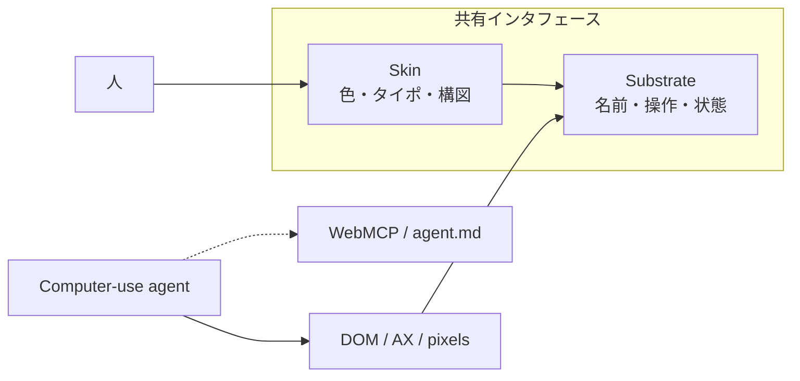
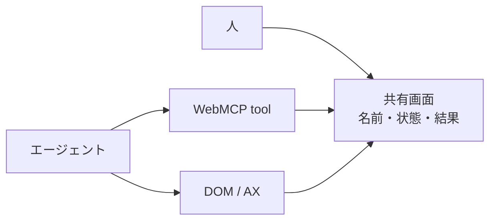

人と computer-use agent が同じ画面を操作するとき、失敗の多くはモデル能力だけでなく、画面に操作名・状態・結果が機械から読める形で残っているかに寄ります。Affora は、その表し方をデザインシステムにした提案です。出典は査読前プレプリント [arXiv:2609.19125v1](https://arxiv.org/abs/2609.19125)（Jin Gao、Independent Researcher、2026-09-16 投稿）です。会議・ジャーナル採録は一次未確認のため、本稿では v1 の記述範囲に限ります。

この記事では次を整理します。

- Affora が皮膚（skin）と意味基板（semantic substrate）をどう分けるか
- 成功率の数字を、どの条件まで読んでよいか
- ARIA、agent.md、WebMCP とどこが重なり、どこが役割分担か
- 既存 GUI をエージェントに触らせる側が、今採用してよいこととまだ採用しないこと

対象読者は、エージェントに既存 GUI を操作させるプロダクトと、その品質を検査したい設計者です。

*この記事の全体像。以下、順に解説します。*

## Afforaとは

**Affora** は、人と computer-use agent が同じアプリを操作するときの、操作可能性とタスク状態の表し方を規則にしたデザインシステムです。名前は Gibson の affordance（行為可能性は行為者の能力との関係で決まる）に由来します。

中核は、見た目と意味を分けることです。

- **skin**: 人が見る色、タイポ、構図
- **semantic substrate**: 機械が DOM、アクセシビリティツリー、マーク付きスクリーンショットなどから読む宣言層。コントロール名、関係、状態、選択肢、結果を残す

エージェント専用の別画面を立てず、共有インタフェースの構造を直す、という立場です。視覚トークンは独立に変えてよい、と論文は書きます（substrate invariant, skin variable）。規則は component / layout / flow / site の 4 スケールです。成果物として、再利用コンポーネント、テーマ・レイアウトトークン、実行可能チェック、コーディングエージェント向けの規則テキストを挙げます。公開実装の有無は後述します。

人とエージェントは同じアプリに対して異なる投影を読みます。WebMCP と agent.md は、共有面を迂回できる操作・案内チャネルとして位置づけられます。

基板への介入は 3 種です（論文 Fig.2）。

| 介入 | よくある実装 | Affora 側 |
|---|---|---|
| 操作を宣言する | 見た目だけの `div` + `onclick` | 名前付きの本物のコントロール |
| 選択肢を先に置く | 開いてから載る option | 機械可読な列挙が開く前からある |
| 結果を残す | 消える toast | `role="status"` など持続する読出し |

スケールと原則族は付録にあります。検査 ID もスケール別に振られます。

| スケール | 原則 | 何を固定するか | 検査 ID |
|---|---|---|---|
| Component | P1〜P10 | 操作・名前・状態・選択肢・結果 | S1〜S8 |
| Layout | P5, P9 をページへ | 意味階層と構造の対応 | - |
| Flow | F1〜F7 | 進捗・前提・回復・完了 | FC1〜FC8、FP1〜FP5 |
| Site | SC1〜SC3 | 機能と名前の対応の安定 | K1〜K3 |

## 注意点

数値は著者ハーネス上の episode 成功数です。表注は「色は有意差を示さない」と繰り返し書きます。統計的有意差の主張としては読めません。

モデルは OpenAI ChatGPT 5.6 の Luna / Terra、**low reasoning** です。frontier モデルでの効果は未測定です。Luna / Terra の製品対応は論文内呼称であり、外部製品ページとの照合は未確認です。

人間の使いやすさ、信頼、監督しやすさは未評価です。監督しやすさは「含意」であり測定ではありません（§7.1）。実行可能チェックのスイート自体の定量検証も報告されていません（§6.4）。合格は適合の下限であり、タスク成功の保証ではありません（§5.3）。

公開コンポーネント、チェックコード、評価ハーネスの公式 URL は、2026-09-18 時点の GitHub 検索（`affora` 73 件、公式候補なし）と npm `affora` 404 では見つかりません。現場再現は現時点で論文記述に閉じます。

Study 2 の「視覚は自由」は、DOM 完了 99.5%、visual-cue 98.7〜99.8% の天井付近です。marked-pixel 読者は候補が列挙済みです。raw-pixel 一般化は著者が否定します。

WCAG 2.1 の Name, Role, Value（4.1.2）は、近い層を既に要求します。Affora の検査を「新しい義務の発明」と読む必要はありません。Storybook への追加は論文に無い外挿です。

## 3つの実験は何を測ったか

論文は 3 つの制御実験を報告します。実装差、視覚差、古典原則の再測定です。対象は mid-tier モデルです。

### Study 1: 失敗は実装の基板差に寄る

60 部品を native HTML と 8 ライブラリで同じタスクにします。Fig.3 overall は次です。

| 実装 | 成功率 |
|---|---|
| native HTML | 91% |
| tailwind / bootstrap / chakra / antd | 87% / 86% / 84% / 82% |
| mantine / reactaria / shadcn / mui | 77% / 76% / 70% / 68% |

本文のライブラリ範囲は 86.7%〜68.3% です。セルは 3 試行です。失敗は「開くまで見えない選択肢」「role/state が取れない」「結果が残らない」に寄ります。修復系列は、意味の修正で 43%→67%、選択肢と状態の露出を足すと 90% です。

### Study 2: 基板を固定すると見た目を大きく変えても完了が落ちにくい

5 部品 × 16 テーマ × 6 レイアウトです。DOM 完了 99.5% は、Study 2 で基板を固定した native presentation と同じ値です。Study 1 の native 91% とは別測定です。pixel は 92%（同実験の native controls 94%）です。極端テーマは両チャネル全成功です。キュー強化に単調改善はありません。

天井付近の数字なので、「見た目を自由にしてよい」を raw-pixel の一般エージェントへ伸ばす根拠にはなりません。

### Study 3: 人間向け原則はエージェントでは一様に移らない

Luna、原則あたり目標 10 episodes です。語彙パネルはパイロット n=3 です。

| 原則 | 著者ラベル | 観測 |
|---|---|---|
| Nielsen #9 エラー回復 | 増幅 | generic 10% vs 明示 100%（vision） |
| Nielsen #6 再認 > 再生 | 再読が要る | 持ち越し 0%。画面に再掲すると vision 100% |
| Norman シグニファイア | 再読 | 無名 5.6 ステップ vs 可視テキスト 2.0 |
| Miller 分割 | 逆転 | 単票 7.1 ステップ vs wizard 8.0（低いほど良い） |
| Shneiderman 確認 | 増幅（コスト） | undo 2.0 vs typed confirm 6.4 |

明示回復は効きます。確認ダイアログはコスト増です。フォーム分割は完了改善なしです。disabled 説明は複製間で一貫しません。認知負荷や安全価値の直接測定ではありません。

## ARIA、agent.md、WebMCPとの違いは何か

同じ失敗に対する介入比較が Table 2 です。著者は一機構の普遍的優位を主張しません。

| 介入 | Primary | Harder |
|---|---|---|
| Baseline | 46/60 (77%) | 28/33 (85%) |
| ARIA + structured data | 45/60 (75%) | 29/33 (88%) |
| Instruction file (agent.md) | 60/60 (100%) | 32/33 (97%) |
| Affora | 60/60 (100%) | 33/33 (100%) |
| WebMCP-style（適用可能な action 集合。マッチ比較ではない） | 対象外 | 55/55 (100%) |

ARIA 条件は primary で baseline より 1 件低いです。agent.md は primary で Affora と同点です。WebMCP は分母が違うため、同じ土俵の勝者比較ではありません。

独立画面への転移（Table 3〜4）は、規則が対象にする欠損があるときに改善が寄ります。

- Magento: 意図的欠損で 33/216 (15%)→16/216 (7%)。修復で 34/216 (16%) と元付近へ戻る。既に健全な部品は 7/40→7/40
- WebShop: 公開ルールは 9/117 (8%) のまま。hidden-radio を後から足すと 80/117 (68%)。これは元集合の一般化証拠ではありません
- 予測できないラベルの裏: shadcn-admin 16/71 (23%)→46/72 (64%)、Ant Design Pro 12/18 (67%)→18/18 (100%)
- 予測できるラベルは mixed。shadcn-admin 70/89 (79%)→66/89 (74%) は低下。Ant Design Pro 0/79 (0%)→11/78 (14%) は上昇
- 既に可視なターゲットの変化は小さい
- MUI 95/120→97/120、Atomic CRM 71/98→70/99 は component レベルでほぼ null。分母はアーム間で異なり、ペア証拠ではありません

Table 5 は著者作のリリースワークフローです。予備です。成功ペアのみコスト比較し、pairs は 1 または 2 です。行動数は約 21〜40% 減、総トークンは約 24〜41% 減です。reasoning トークンは Terra vision で 608→925 (+52%) と増える条件があります。完了率改善は Luna vision の 1/2→2/2 のみです。一般効率の推定ではありません。壁時計は未測定です。

WebMCP は W3C Web Machine Learning Community Group の Draft（2026-09-17）です。[W3C Standard ではありません](https://webmachinelearning.github.io/webmcp)。API は `document.modelContext.registerTool` / `getTools` / `executeTool` です。Chrome は origin trial です（[ドキュメント更新 2026-08-07](https://developer.chrome.com/docs/ai/webmcp)、trial は Chrome 149 から）。GitHub [`webmachinelearning/webmcp`](https://github.com/webmachinelearning/webmcp) は 約 4.1k stars（4074、2026-09-18、archived ではない）です。

Chrome Labs デモの見出しは [“WebMCP — Give agents tools, not DOM”](https://googlechromelabs.github.io/webmcp-tools/demos/explainer/) です。Chrome for Developers の文書は、同じ対比を「DOM を scrape する vs tool を呼ぶ」として書きます。操作を schema 付き tool として渡します。Affora は画面上の意味基板を残します。論文 §7.3 は共存を述べます。エージェントは tool で動き、帰結状態を共有面に戻す、という分担です。

## いま採用してよいこと、まだ採用しないこと

現在の主要な結論は次です。Affora は「画面に操作名・状態・結果・復帰を機械が読める形で残す」問題を、デザイン規則と検査 ID まで書きました。欠損がある独立画面では完了が上がる行があります。欠損が無い、カバレッジ外では上がりません。公開実装は確認できません。

支持に使える材料は、Study 1 のライブラリ差と 43%→90% の修復系列、unpredictable label クラスの上昇、Magento の欠損導入と修復が対称に動くこと、著者が coverage 限界と checks の floor 性を本文に書いていることです。

反証と限界は、公式 GitHub / npm が見つからないこと、人間評価がないこと、agent.md が primary で同点なこと、ARIA がほぼ無効果なこと、WebShop の公開ルールが不変なこと、predictably labelled が mixed なこと、Study 2 の天井、Table 5 の n=1〜2、mid-tier only です。対照として、Liu et al. 2026（[arXiv:2605.02729](https://arxiv.org/abs/2605.02729)）は human studies があります。

判断基準は、再現性、欠損クラスへの選択性、WebMCP との役割分担、人間側の未測定です。

1. **概念として採用してよいこと**: エージェント失敗をモデル能力だけに帰さない。画面に「操作名 / 今の状態 / 結果 / 復帰」が残るかを見る
2. **今は採用しないこと**: Affora ライブラリの本番導入、未公開チェックの CI 必須化
3. **WebMCP との分担**: 操作の確実な実行は tool。人が追い、エージェントが再読する状態は共有 DOM/AX。どちらか一方の置換ではない
4. **検査を足すなら既存スタックで最小に**: 論文外の翻訳です。欠損クラスに合わせるなら次の 4 問をストーリー単位で見ます。合格をタスク成功と読まない
   - 操作に安定したアクセス可能な名前があるか
   - 現在状態が DOM/AX から取れるか
   - 結果が次の観測でも残るか
   - 失敗時に復帰手段が名前付きで出るか
5. **期待を下げる条件**: 既に可視なターゲット、MUI/Atomic CRM 型の near-null、未知イディオム。predictably labelled は mixed なので、shadcn-admin 行の低下だけを一般化しない

逆転条件は、公式実装とチェックが公開され、人間評価が退行なしを示し、公開ルールが hidden-radio 以外にも汎化することです。

直近の棚卸しは次です。

1. 自プロダクトで「開くまで選択肢が無い」「toast が消える」「div ボタン」を列挙する
2. WebMCP を足す画面では、tool 実行後の帰結を `role="status"` 等で共有面に戻す
3. Affora 本体の採用判断は artifact 公開待ちにする

未解決の問いは、コンポーネントとチェックの公開場所、frontier / raw-pixel / デスクトップへの転移、人間が同じ画面を使いやすくなるか、ChatGPT 5.6 Luna/Terra の製品実体、著者 ORCID の公開業績です。デザインシステム採用や CI ゲート化は、成果物公開と人間評価がブロックします。問題設定と欠損クラスの話としては使えます。現場の品質ゲートとして「今すぐ足せ」とは言えません。

## まとめ

Affora は、人とエージェントが同じ画面を読むための意味基板を、component / layout / flow / site の規則と検査 ID まで書いた提案です。失敗の一部は「開くまで見えない選択肢」「取れない role/state」「消える結果」に寄ります。欠損がある画面では完了が上がる行があります。欠損が無い画面、カバレッジ外、公開実装の不在、人間評価の欠如は、そのまま本番ゲートにはなりません。操作の確実な実行は WebMCP のような tool、人が追う状態は共有 DOM/AX、という分担が論文の共存の書き方です。

この記事が少しでも参考になった、あるいは改善点などがあれば、ぜひリアクションやコメント、SNSでのシェアをいただけると励みになります！

## 参考リンク

- Jin Gao. 2026. Affora: A Design System for Agent-Friendly Interfaces. arXiv:2609.19125v1. https://arxiv.org/abs/2609.19125 https://arxiv.org/html/2609.19125v1
- Web Machine Learning Community Group. WebMCP. Draft Community Group Report, 17 September 2026. https://webmachinelearning.github.io/webmcp
- Chrome for Developers. WebMCP. Updated 2026-08-07. https://developer.chrome.com/docs/ai/webmcp
- Chrome Labs. WebMCP. Give agents tools, not DOM. https://googlechromelabs.github.io/webmcp-tools/demos/explainer/
- webmachinelearning/webmcp. GitHub. 約4.1k stars（4074、2026-09-18 時点）. https://github.com/webmachinelearning/webmcp
- Jiateng Liu et al. 2026. Augmenting Interface Usability Heuristics for Reliable Computer-Use Agents. arXiv:2605.02729. https://arxiv.org/abs/2605.02729
- W3C. 2018. WCAG 2.1. Name, Role, Value は 4.1.2
