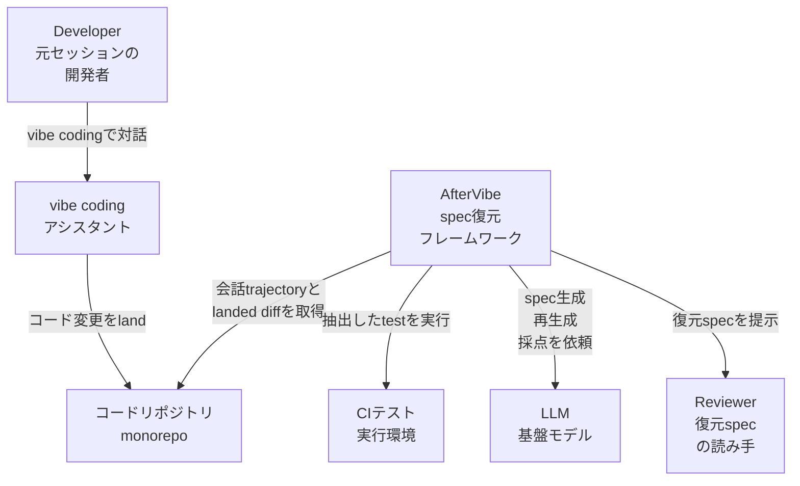
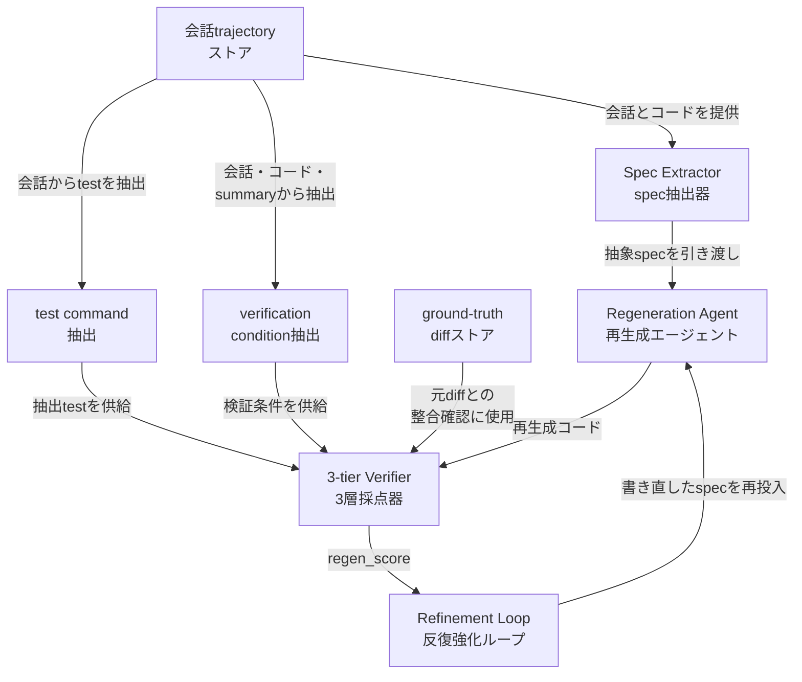
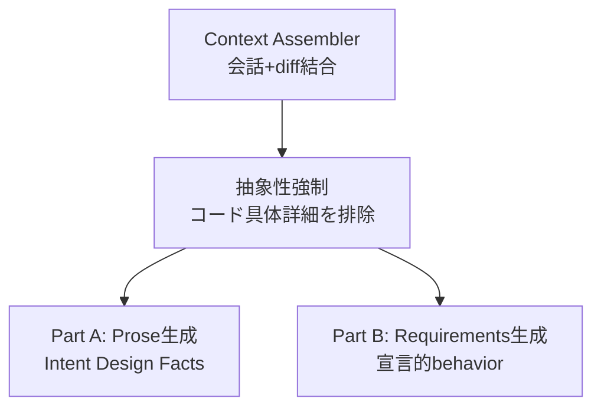
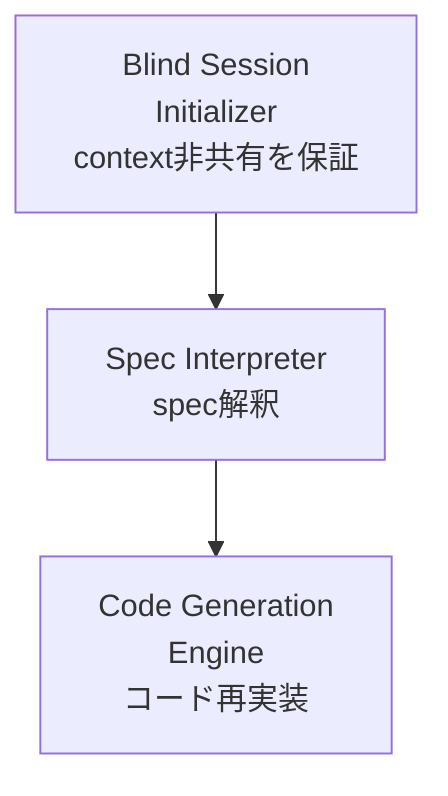
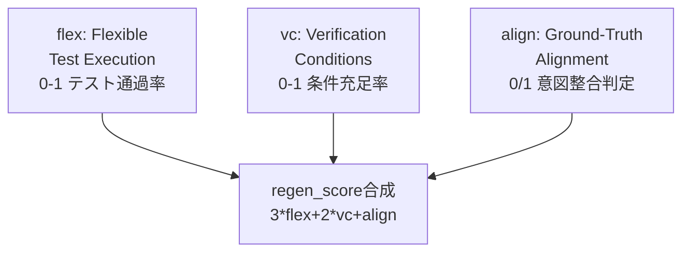
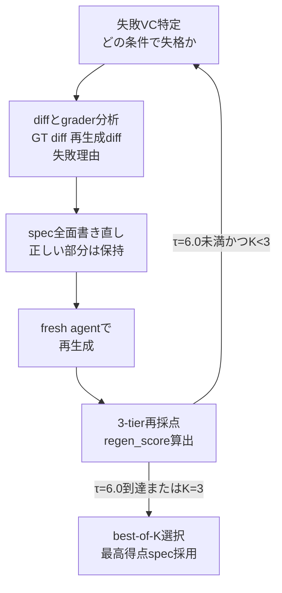
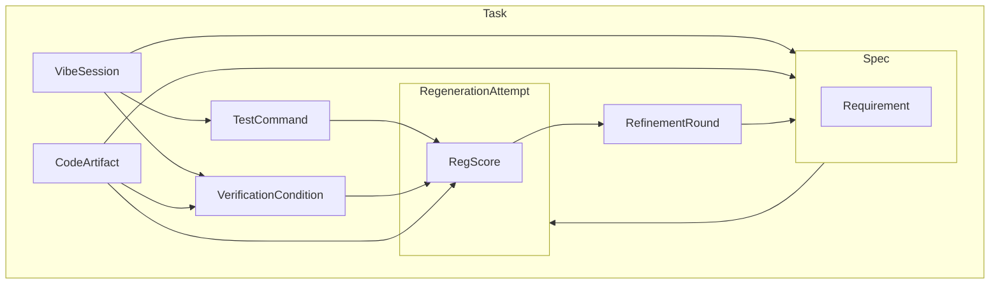
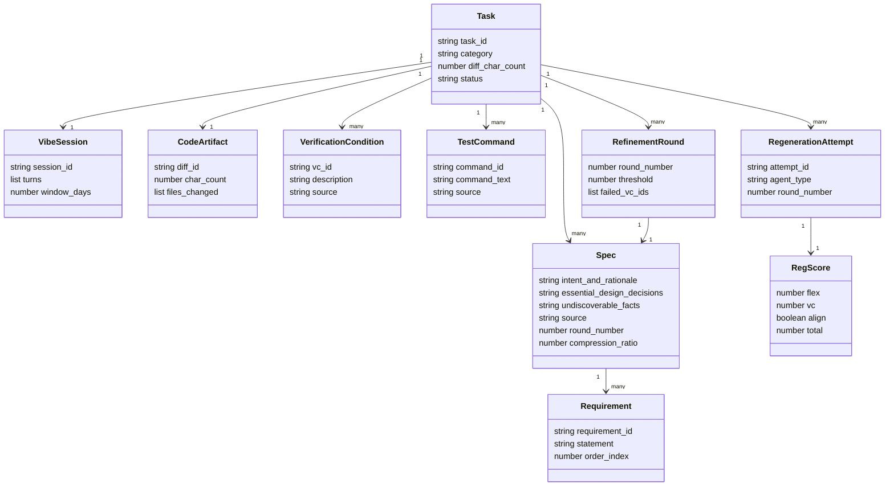
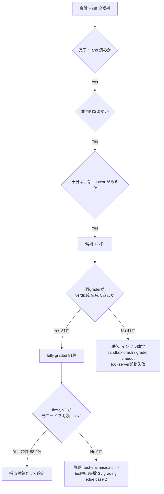
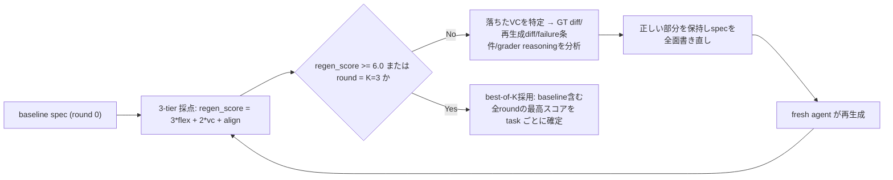

> 対象論文: [AfterVibe: What Remains When the Conversation Ends (arXiv:2607.09900)](https://arxiv.org/abs/2607.09900) / Matteo Paltenghi, Satish Chandra
> 調査日: 2026-07-15

AfterVibe は、vibe coding セッションが残したコードと会話履歴から、抽象的な自然言語仕様 (spec) を事後的に復元する手法です。復元した spec は、別の AI エージェントが spec だけから同等のコードを再生成できるか (regeneration test) で品質を機械検証します。本記事は論文提案手法を対象とするため、C4 model を「提案フレームワークの論理構造」に読み替えて図解します。またコード実装は非公開のため、コード例はすべて論文の記述に基づく実装案です。

## 概要

### 解こうとしている問題

vibe coding では、開発者が会話で LLM にコードを生成させます。

セッションが終わると、次の情報が会話ログに埋もれて失われます。

- 何を達成したかったか (Intent)
- なぜその設計を選んだか (Rationale)
- コードだけからは読み取れない外部制約 (Undiscoverable Facts)

コードだけが残り、コードを生んだ理由が消えます。

### AfterVibe が復元するもの

AfterVibe は、次の 2 つの入力から抽象的な自然言語 spec を復元する手法です。

- vibe coding セッションのコード成果物 (diff)
- そのコードを生んだ会話 trajectory

spec は「コード・識別子・パス・行番号を書くな」という制約のもとで抽出します。抽象度をプロンプトで強制する点が特徴です。

### なぜ重要か: spec 品質を機械検証する

自然言語 spec の品質は、人手評価では属人的になりがちです。

AfterVibe は品質を **regeneration test** で機械的に検証します。

- 抽出した spec だけを、抽出セッションとは無関係な別の blind AI agent に渡す
- その agent が spec だけからコードを再実装する
- 再実装したコードを 3 つの観点 (flex/VC/align) で採点する

spec が元の意図を過不足なく伝えていれば、blind agent は機能的に等価なコードを再生成できるはずです。この着想を spec の品質判定基準に据えている点が、AfterVibe の中心です。

### 位置づけ: pre-hoc 仕様駆動開発との対比

GitHub SpecKit や Amazon Kiro に代表される spec-first ワークフローは、コーディングの**前に**仕様を書くことを前提とします。

AfterVibe は逆方向です。仕様を書かずにコーディングした後から、事後的 (post-hoc) に仕様を復元します。vibe coding の実態 (仕様を書かない) を変えずに、spec-driven development の恩恵を後付けで得られる設計です。

### 関連手法との比較

| 手法 | 仕様の位置づけ | 記述する内容 | 品質の検証方法 |
|---|---|---|---|
| 人間が書く PR summary (diff title + description + test plan) | コーディング後、人間レビュー向けに手動記述 | 「何を変更したか」の高レベル説明。挙動制約・設計判断・undiscoverable facts は省略されがち | 検証の仕組みなし (人間読者が目視確認) |
| [VibeContract](https://arxiv.org/abs/2603.15691) (arXiv 2603.15691) | コーディング前、開発者が意図をタスク列に分解し contract を事前定義 | タスクごとの入出力・制約・振る舞い特性を明示する契約 | LLM が contract に沿ってテスト・ランタイム検証・デバッグを継続実施 |
| [Variability by Regeneration](https://arxiv.org/abs/2606.19042) (VbR, arXiv 2606.19042) | 開発者が宣言的仕様を書き、LLM が variant ごとにコードを再生成 | 製品ライン (product line) の variability を仕様側に閉じ込める宣言的記述 | 各 variant のバイナリが仕様と整合するかを SPL 派生の枠組みで確認 |
| **AfterVibe** | コーディング後、会話 trajectory + コードから事後的に LLM が抽出 | 抽象自然言語 spec (Intent / Design Decisions / Undiscoverable Facts) + 宣言的 requirements | 別の blind agent が spec のみから再生成し、3-tier スコアで機械採点 |

3 手法はいずれも「仕様を明示化する」点で共通します。決定的な違いは 2 点です。

- **仕様を書くタイミング**: VibeContract・VbR はコーディング前 (pre-hoc)。AfterVibe はコーディング後 (post-hoc)
- **品質の確かめ方**: 人間 summary は無検証、VibeContract・VbR は契約や派生整合性で確認。AfterVibe は「spec だけから同等コードを再生成できるか」という regeneration test で機械検証する

## 特徴

- **regeneration test による機械検証**: spec 品質を人手評価でなく、「別の blind agent が spec だけから同等コードを再生成できるか」で判定します。抽出セッションと再生成セッションは context を共有しません。抽出側の情報が再生成側に漏れる (情報リーク) を遮断する設計です。

- **抽象 spec の 2 部構成**: Part A は prose 3 節 (Intent and Rationale / Essential Design Decisions / Undiscoverable Facts) で、抽象度の高い順に並びます。Part B は簡潔な宣言的 behavioral requirements です。"how" ではなく "outcome" を記述する制約を課しています。

- **3-tier validation によるスコアリング**: 再生成コードを 3 観点で採点し、`regen_score = 3×flex + 2×vc + align` (0〜6 スケール) を算出します。

  | 観点 | 検証内容 | 値域 | 重み |
  |---|---|---|---|
  | flex (Flexible Test Execution) | 会話から抽出したテストを再生成コードに実行 | 0〜1 (連続) | 3 |
  | VC (Verification Conditions) | 独立な behavioral property の充足を検査 | 0〜1 (連続) | 2 |
  | align (Ground-Truth Alignment) | 再生成が会話上の意図に conform するかを LLM が二値判定 | 0 または 1 | 1 |

  実行接地したテスト (flex) を最重視し、LLM の主観判定に近い alignment を最も低く重み付けします。

- **best-of-K の反復強化**: regen_score が τ=6.0 未満の task だけを対象に、per-task で spec を書き直します。失敗した VC の特定 → diff とスコアの分析 → spec の全面書き直し → fresh agent による再生成、を最大 K=3 round 繰り返し、6.0 到達で早期終了します。baseline と全 round のうち最高スコアの spec を採用するため、スコアは単調非減少です。

- **実企業 monorepo での評価**: ある企業内部の大規模 monorepo・7 日窓の実セッションから、完了・land した diff かつ十分な会話 context を持つ 122 候補を抽出しています。両 grader が verdict を出せた 81 件 (残り 41 件はインフラ障害で脱落) のうち、元コードで flex と VC が両方 pass した 72 task (88.9%) を最終評価セットにしています。平均元 diff は 41,638 文字、平均 10.5 VC という規模です。

- **人間が書く summary を上回る結果**: developer 自身の PR summary をそのまま spec 化したベースラインは平均 4.23/6.0 でした。AfterVibe の baseline spec は平均 5.06/6.0、反復強化後 (best-of-3) は平均 5.74/6.0 まで到達しています (これらのスコアは、完全な grader verdict を得た 68/72 task の平均です)。

- **抽象度を定量測定**: spec の圧縮率 (standard spec) は元 diff に対し 5.69 倍、spec に残る code leakage (distinctive token の混入率) は 38.6% です。抽象化の強制がプロンプト任せで終わらず、数値で確認されています。

- **コード実装は非公開**: 論文はコードリポジトリを公開せず、pipeline 全体の prompt を Appendix A (supplementary material) として提供する形にとどまります。著者は「実行環境付きの人間 vibe-coding trajectory データセットが openly available でない」ことを理由に挙げています。

## 構造

AfterVibe は公開実装のない論文提案手法のため、C4 model の 3 階層 (システムコンテキスト / コンテナ / コンポーネント) を「提案フレームワークの論理構造」として読み替えて図解します。データモデルの属性一覧やコマンド・設定は別セクションで扱います。

### システムコンテキスト図

AfterVibe を中心に、周囲のアクターと外部システムとの関係を示します。アクターは特定製品名ではなく役割名で表現しています。



| 要素名 | 説明 |
|---|---|
| Developer | 元の vibe coding セッションで vibe coding アシスタントと対話しコードを生成した開発者。復元specの意図の一次情報源 |
| Reviewer | 復元されたspecを読み、意図・設計判断・制約を把握する読み手。レビュアーやオンボーディング対象者を想定した役割 |
| vibe codingアシスタント | 元セッションで開発者と対話しコードを生成した既存のAIコーディングアシスタント。AfterVibe内部のRegeneration Agent (コンポーネント図参照) とは別物 |
| AfterVibe | コード成果物と会話trajectoryから抽象的な自然言語specを復元する提案フレームワーク本体 |
| コードリポジトリ monorepo | landed diffと変更履歴を保持する既存のコードベース。AfterVibeが会話trajectoryとあわせて参照する外部システム |
| CIテスト実行環境 | 会話から抽出したtest commandを実行し、flexスコア算出の実行基盤となる外部システム |
| LLM 基盤モデル | Extractor / Regeneration Agent / Verifier / Refinerの各stageが共通で呼び出す基盤モデル。論文では全stage単一frontier LLMを使用 |

### コンテナ図

AfterVibe をドリルダウンし、パイプラインを構成する4つの主要処理 (Spec Extractor / Regeneration Agent / 3-tier Verifier / Refinement Loop) と、それを支える補助コンポーネントを示します。



| 要素名 | 説明 |
|---|---|
| Spec Extractor | 会話trajectoryとコードから抽象的な自然言語specを生成する。コード・識別子・パス・行番号を書かないよう抽象性を強制するpromptを持つ |
| Regeneration Agent | Extractorが生成したspecのみを入力として、context非共有のblindな別セッションでコードを再実装する |
| 3-tier Verifier | 再生成コードをflex / vc / alignの3観点で採点しregen_scoreを算出する |
| Refinement Loop | regen_scoreがτ=6.0未満のtaskについてspecを全面書き直し、再生成と再採点を繰り返す |
| 会話trajectoryストア | 元のvibe codingセッションの会話ログを保持し、Extractor・test抽出・VC抽出の共通入力元となる |
| test command抽出 | 会話から実行可能なtest commandを抽出し、Verifierのflex採点に供給する |
| verification condition抽出 | 会話・コード・developer summaryから独立したbehavioral propertyを抽出し、Verifierのvc採点に供給する |
| ground-truth diffストア | 元のlanded diffを保持し、Verifierの整合性確認やRefinement Loopのdiff分析に用いられる |

### コンポーネント図

コンテナ図の4つの主要構成要素をさらにドリルダウンし、各責務を担うコンポーネントを示します。ここでは論文中の具体的な用語・数値 (flex / vc / align の合成式、τ=6.0、K=3 等) を含めます。

#### Spec Extractor のコンポーネント



| 要素名 | 説明 |
|---|---|
| Context Assembler | 会話trajectoryとlanded diffを結合し、Extractor promptへの入力コンテキストを組み立てる |
| 抽象性強制 | コード・識別子・パス・行番号を essential かつ undiscoverable でない限り書かないようpromptで強制する |
| Part A: Prose生成 | Intent and Rationale / Essential Design Decisions / Undiscoverable Facts の3節から成る抽象spec散文を生成する |
| Part B: Requirements生成 | howではなくoutcomeを示す簡潔な宣言的behavioral requirementを生成する |

#### Regeneration Agent のコンポーネント



| 要素名 | 説明 |
|---|---|
| Blind Session Initializer | Extractorの抽出セッションとcontextを共有しない新規セッションを開始し、情報リークを防ぐ |
| Spec Interpreter | 与えられたspecのみを読み込み、実装すべき振る舞いを解釈する |
| Code Generation Engine | 解釈結果に基づきコードをゼロから再実装する。再生成間の実装は多様だが振る舞いは一致する傾向がある (both-pass chrF 0.888) |

#### 3-tier Verifier のコンポーネント



| 要素名 | 説明 |
|---|---|
| flex: Flexible Test Execution | 会話から抽出したtestを再生成コードに実行し、通過率を0〜1で算出する。軽微なinterface変更に適応する |
| vc: Verification Conditions | 会話・コード・developer summaryから抽出した独立behavioral propertyの充足率を0〜1で算出する |
| align: Ground-Truth Alignment | LLM agentが「再生成が会話上の意図にconformするか」を0/1で二値判定する |
| regen_score合成 | `3*flex + 2*vc + align` で0〜6スケールのregen_scoreを合成する。実行接地テストを最重視 (重み3)、VCを中位 (重み2)、alignmentを最小重み (1) とする |

#### Refinement Loop のコンポーネント



| 要素名 | 説明 |
|---|---|
| 失敗VC特定 | regen_scoreがτ=6.0未満のtaskについて、どのverification conditionで再生成が落ちたかを特定する |
| diffとgrader分析 | ground-truth diff・再生成diff・失敗条件・graderのreasoningをLLMが分析する |
| spec全面書き直し | 正しく機能した部分を保持しつつspecを全面的に書き直す |
| fresh agentで再生成 | 書き直したspecのみを入力に、新規のblind agentが再度コードを再実装する |
| 3-tier再採点 | flex / vc / alignの3観点で再生成コードを採点し、regen_scoreを更新する |
| best-of-K選択 | baselineと全round (最大K=3) のうち最高得点のspecをtaskごとに採用する。スコアは単調非減少 |

## データ

### 概念モデル



| 要素名 | 説明 |
|---|---|
| Task | データセットの1タスク単位。TechInternal では平均元 diff 41,638 文字、平均 10.5 VC、平均 1.5 test command を持つ |
| VibeSession | vibe coding の入力となる会話履歴 (ConversationTrajectory)。Extractor がここから spec を抽出する |
| CodeArtifact | セッションが生成したコード成果物 (GroundTruthDiff、land 済みの実 diff) |
| Spec | Extractor が復元する自然言語仕様。Part A の散文3節を自身の属性に持ち、Part B の Requirement 群を内包する |
| Requirement | Spec の Part B を構成する、簡潔で宣言的な behavioral requirement (how でなく outcome を記述) |
| VerificationCondition | 会話・コード・developer summary から抽出した独立な behavioral property。3-tier validation の vc スコアに使う |
| TestCommand | 会話から抽出したテストコマンド。3-tier validation の flex スコア (テスト実行) に使う |
| RegenerationAttempt | Spec のみから、抽出セッションと context 非共有の blind agent が再実装した結果。1回の再生成に対し RegScore を1つ内包する |
| RegScore | 3-tier validation のスコア (flex / vc / align / total)。total = 3\*flex + 2\*vc + align (0〜6スケール) |
| RefinementRound | regen_score が τ=6.0 未満の task に対する反復強化の1ラウンド (per-task ループ、最大 K=3)。失敗 VC を特定し spec を全面書き直して再度 RegenerationAttempt を生成する |

### 情報モデル



次の属性表で「論文記述から推測」と付記した項目は、論文に明示されず本記事が補完した推測です (上の図では事実と推測を区別していません)。

| 要素名 | 説明 |
|---|---|
| Task.diff_char_count | landed diff の文字数 (TechInternal 平均 41,638 字)。task ごとの値として保持する属性化は論文記述から推測 |
| Task.status | funnel 上の状態 (候補 / fully graded / 脱落)。脱落理由 (test-env mismatch / test 抽出失敗 / grading edge case) を持つことは論文記述から推測 |
| VibeSession.turns | 会話ターンの列。具体的なフィールド構造は論文に明示されず、論文記述から推測 |
| VibeSession.window_days | データセット収集対象の時間窓 (7日)。task 単位でなくデータセット全体の設定を便宜上属性化しており、論文記述から推測 |
| CodeArtifact.char_count | ground-truth diff の文字数 |
| Spec.source | AfterVibe 抽出 spec か、比較対象の human-authored summary (developer 自身のコードレビュー記述) かを区別する属性。論文記述から推測 |
| Spec.round_number | 反復強化で何ラウンド目の改訂かを示す (0=baseline、best-of-K 選択の対象単位)。論文記述から推測 |
| Spec.compression_ratio | 元コードに対する spec の圧縮率 (standard spec で 5.69x) |
| VerificationCondition.source | 会話 / コード / developer summary のいずれ由来かを保持する属性。論文記述から推測 |
| TestCommand.source | 会話から抽出されたことを表す属性。論文記述から推測 |
| RegenerationAttempt.agent_type | 抽出セッションと context 非共有の blind AI agent であることを表す属性。論文記述から推測 |
| RegScore.flex | Flexible Test Execution のスコア ([0,1]、テスト通過率、軽微な interface 変更に適応) |
| RegScore.vc | Verification Conditions の充足率 ([0,1]) |
| RegScore.align | Ground-Truth Alignment の二値判定 ({0,1}、再生成が会話上の意図に conform するか) |
| RegScore.total | 3\*flex + 2\*vc + align (0〜6、連続値、実行接地テスト最重視・VC 中・alignment 低の重み付け) |
| RefinementRound.threshold | 反復強化の閾値 τ=6.0 (固定値) |
| RefinementRound.failed_vc_ids | ラウンド開始時に特定する、regeneration が落ちた VC の一覧。論文記述から推測 |

## 構築方法

:::message
AfterVibe 論文はコード実装を公開していません。パイプラインの prompt のみが Appendix A に記載されています。本セクションのコード例はすべて、論文の疑似記述と prompt 構造をもとにした**実装案 / 例**です。論文の主張そのものではありません。数値パラメータ (τ=6.0、K=3、regen_score の重み 3/2/1) は論文本文由来のため、そのまま使用しています。
:::

### 前提

AfterVibe のパイプラインを再現するには、次の 4 要素がそろっている必要があります。

| 前提要素 | 内容 |
|---|---|
| grounded repository access | spec 抽出対象コードベースの、変更前後両方の状態にアクセスできること |
| 会話 trajectory | multi-turn coding-assistant のログ (ユーザー発話 + エージェントのツール呼び出し + メッセージ) |
| 実行可能なテスト環境 | 会話中に実行されたテストコマンドを再実行できるサンドボックス |
| frontier LLM API | Extractor / Regenerator / Verifier / Refiner の全ステージを駆動するモデル |

論文の TechInternal データセットでは、全ステージを単一 frontier LLM で実施しています (詳細な言語・技術スタック内訳は非開示)。

### 4 ステージを繋ぐ最小構成 (実装案)

AfterVibe のパイプラインは、次の 4 ステージが直列に並びます。

1. Extractor: 会話 + diff → 抽象 spec
2. Regenerator: spec のみ (context 非共有) → 再実装コード
3. Verifier: 再実装コードを 3 観点 (flex / vc / align) で採点
4. Refiner: τ 未満の task を per-task で書き直し、最大 K round

以下は、この 4 ステージを LLM 呼び出しの連鎖として組んだ最小骨格です。ステージ間の状態遷移が明確なため、LangGraph のような状態機械型オーケストレーションフレームワークとの相性が良い構成です。ここでは依存を増やさない素朴な Python 疑似実装として示します。

```python
# 論文の意図を反映した実装案。AfterVibe 自体のコードではありません。
from dataclasses import dataclass, field
from typing import Literal

TAU = 6.0  # 論文本文由来の反復強化しきい値
MAX_ROUNDS = 3  # 論文本文由来の best-of-K 上限 (K=3)


@dataclass
class Task:
    task_id: str
    conversation_context: str
    unified_diff: str  # ground-truth diff
    metadata_json: dict
    observed_test_commands: list[dict]


@dataclass
class Spec:
    part_a_prose: dict[str, str]  # intent_and_rationale / essential_design_decisions / undiscoverable_facts
    part_b_requirements: list[str]


@dataclass
class RegenResult:
    regenerated_diff: str
    flex: float  # [0,1]
    vc: float    # [0,1]
    align: Literal[0, 1]
    regen_score: float = field(init=False)

    def __post_init__(self) -> None:
        self.regen_score = 3 * self.flex + 2 * self.vc + self.align


def run_pipeline(task: Task, call_llm) -> RegenResult:
    """4 ステージを直列実行する最小骨格 (実装案)。"""
    spec = extract_spec(task, call_llm)
    best_result = regenerate_and_verify(task, spec, call_llm)

    round_no = 0
    while best_result.regen_score < TAU and round_no < MAX_ROUNDS:
        spec = refine_spec(task, spec, best_result, call_llm)
        candidate = regenerate_and_verify(task, spec, call_llm)
        # best-of-K: スコアは単調非減少で採用 (論文の Best-of-K 選択方針)
        if candidate.regen_score > best_result.regen_score:
            best_result = candidate
        round_no += 1

    return best_result
```

`extract_spec` / `regenerate_and_verify` / `refine_spec` は、後述の「利用方法」で示す各 prompt を `call_llm` に渡す関数として実装します。

## 利用方法

### 必須パラメータ

| パラメータ | 型 / 形式 | 用途 | 出典 |
|---|---|---|---|
| `conversation_context` | テキスト (会話ログ全文) | Extractor / Verifier の入力 | 論文 Appendix A の prompt |
| `unified_diff` | unified diff テキスト | Extractor / Verifier の入力 | 論文 Appendix A の prompt |
| `metadata_json` | JSON | Verifier (VC 抽出) の入力 | 論文 Appendix A の prompt |
| `observed_test_commands` | JSON 配列 (ツール呼び出し引数) | test command 抽出の入力 | 論文 Appendix A の prompt |
| `original_spec` / `ground_truth_diff` / `regenerated_diff` / `failed_verification_condition` / `grader_rejection_reasoning` | テキスト / JSON | Refiner の入力 | 論文 Appendix A の prompt |
| `τ` (tau) | float、既定 6.0 | 反復強化を発動するスコアしきい値 | 論文本文 |
| `K` | int、既定 3 | 反復強化の最大ラウンド数 | 論文本文 |
| regen_score 重み (flex:vc:align) | 3:2:1 | 3-tier スコアの合成比率 | 論文本文 |

### Spec 抽出 prompt の骨子

Extractor の prompt (論文 Appendix A) は、抽象性を強制する制約と、Part A / Part B の出力構造を持ちます。以下は、この構造を再現した prompt テンプレート案です。

```text
# 論文 Appendix A の Extractor prompt 構造を反映した実装案 (実際の文面ではありません)

あなたは会話ログとコード diff から、抽象的な spec を復元するアシスタントです。

制約:
- コード・識別子・パス・行番号は、essential かつ undiscoverable でない限り書かないこと。
- 「どうやって実装したか」ではなく「何を達成すべきか」を記述すること。

入力:
- conversation_context: {conversation_context}
- unified_diff: {unified_diff}

出力 (Part A: Prose, 3 節):
1. Intent and Rationale — 最も抽象的。何を達成するかを述べる。
2. Essential Design Decisions — 保持すべき鍵となる振る舞い・基準。
3. Undiscoverable Facts — 外部名・閾値・contract 等、コードベースから推測不能な事実。

出力 (Part B: Requirements):
- 簡潔な宣言的 behavioral requirement のリスト。outcome を書き、how は書かない。
```

### Regeneration: 別セッションでの再実装呼び出し例

再生成を担うエージェントに渡すのは spec (Intent and Rationale / Essential Design Decisions / Undiscoverable Facts + Requirements checklist) のみで、元コード・元会話へのアクセスはありません。論文は「a fresh agent that has never seen the original code or conversation」と明記します。実装上は、spec 抽出に使ったセッション/会話履歴を一切引き継がない、独立した LLM 呼び出しとして再生成エージェントを起動します。

```python
# 論文の意図を反映した実装案

def regenerate_and_verify(task: Task, spec: Spec, call_llm) -> RegenResult:
    # blind agent: conversation_context も unified_diff も渡さない
    regen_prompt = build_regeneration_prompt(spec)
    regenerated_diff = call_llm(
        session="fresh",  # 抽出セッションとは別プロセス/別コンテキストで起動
        prompt=regen_prompt,
        context=None,  # 元コード・元会話へのアクセスなし
    )

    flex = run_flex_tests(task.observed_test_commands, regenerated_diff)
    vc = check_verification_conditions(task, regenerated_diff, call_llm)
    align = judge_ground_truth_alignment(task, spec, regenerated_diff, call_llm)

    return RegenResult(regenerated_diff, flex, vc, align)
```

### 3-tier scoring の計算例

`regen_score = 3*flex + 2*vc + align` は、flex (実行接地テスト) を最も重く、VC を中程度、二値の GT alignment を最も軽く重み付けする構成です。以下はこの合成をそのまま実装したスコアラです。

```python
# 論文の regen_score 定義をそのまま実装した例
def compute_regen_score(flex: float, vc: float, align: int) -> float:
    if not (0.0 <= flex <= 1.0):
        raise ValueError(f"flex は [0,1] 範囲: got {flex}")
    if not (0.0 <= vc <= 1.0):
        raise ValueError(f"vc は [0,1] 範囲: got {vc}")
    if align not in (0, 1):
        raise ValueError(f"align は {{0,1}}: got {align}")

    return 3 * flex + 2 * vc + align  # 0〜6 スケール
```

`flex` はテスト通過率、`vc` は VC 充足率のため、実測値は次のように算出します。

```python
def run_flex_tests(test_commands: list[dict], regenerated_diff: str) -> float:
    """会話から抽出したテストを再生成コードに実行し、通過率を返す (実装案)。
    軽微な interface 変更 (関数名・引数順など) には flex 側で適応させる想定。
    """
    results = [execute_test(cmd, regenerated_diff) for cmd in test_commands]
    if not results:
        return 0.0
    return sum(1 for r in results if r.passed) / len(results)


def check_verification_conditions(task: Task, regenerated_diff: str, call_llm) -> float:
    vc_records = task.metadata_json.get("verification_clue_records", [])
    if not vc_records:
        return 0.0
    satisfied = [judge_vc(vc, regenerated_diff, call_llm) for vc in vc_records]
    return sum(1 for s in satisfied if s) / len(vc_records)
```

### Verification condition / test command の抽出と検査

Verifier ステージは、VC (Verification Condition) と test command の 2 種類を会話・diff・metadata から抽出します (論文 Appendix A の prompt)。

```text
# 論文 Appendix A の VC 抽出 prompt 構造を反映した実装案 (実際の文面ではありません)

入力:
- conversation_context: {conversation_context}
- metadata_json: {metadata_json}
- unified_diff: {unified_diff}

出力: JSON 配列 verification_clue_records
各レコード:
- clue_id: 識別子
- clue: YES/NO で答えられる質問文
- provenance: 証拠ソース (conversation / metadata / final_unified_diff / test_commands)
- abstraction_level: user_goal / behavioral_contract / api_surface / implementation_detail
```

test command 抽出 (論文 Appendix A) は、セッション中の生のツール呼び出し引数を、リポジトリルートから実行可能なシェルコマンドに変換します。

```text
# 論文 Appendix A の test command 抽出 prompt 構造を反映した実装案

入力:
- observed_test_commands: {observed_test_commands}
- conversation_context: {conversation_context}

出力: JSON オブジェクト群
{"command": "...", "category": "regression|new"}

変換例:
{"test_file_path": "/path/to/test.py"} → "python -m pytest path/to/test.py"
```

実装上は、抽出した `command` をそのままサンドボックスで実行し、終了コードで pass/fail を判定します。git diff の抽出や適用には `git diff` / `git apply` を subprocess 経由で呼ぶか、`unidiff` のようなパーサライブラリを使う実装が一般的です。

```python
import subprocess

def execute_test(cmd: dict, regenerated_diff: str) -> "TestResult":
    apply_diff(regenerated_diff)  # git apply などで適用 (実装案)
    proc = subprocess.run(
        cmd["command"], shell=True, capture_output=True, text=True, timeout=300
    )
    return TestResult(passed=(proc.returncode == 0), stdout=proc.stdout)
```

`judge_ground_truth_alignment` は LLM-as-judge パターンで、二値 (conform / not conform) を返す構成にします。二値判定はスケールの粒度を持たせすぎないほうが判定のブレが小さいという実務知見と整合します。

```python
def judge_ground_truth_alignment(task: Task, spec: Spec, regenerated_diff: str, call_llm) -> int:
    prompt = (
        "再生成された diff は、以下の spec が意図した振る舞いに conform していますか。"
        "Pass/Fail のみで判定し、一文の理由を添えてください。\n"
        f"spec: {spec}\nregenerated_diff: {regenerated_diff}"
    )
    verdict = call_llm(prompt=prompt)
    return 1 if verdict.startswith("Pass") else 0
```

## 運用

AfterVibe に**公開コード実装はありません**。全 prompt は論文 Appendix A で公開されているのみです。以下のコード例・コマンド例は一次ソースの記述から導いた「実装案」であり、論文自身が提示した運用手順ではありません。数値 (funnel 件数・スコア・grader discrimination 等) は一次論文で再照合済みです。

適用範囲の前提も先に明示します。評価対象は **単一企業の内部 monorepo・72 task・単一 frontier LLM** に限られます。他ドメイン・他言語・弱いモデル・grounded repository を持たない環境への一般化は論文内で検証されていません。以下の運用ガイドは、この前提の外側では有効性が未確認である点を踏まえて読んでください。

### spec 復元を CI / コードレビュー基盤に載せる

AfterVibe の spec 抽出対象は、あらゆる diff ではなく **4 条件の funnel** を通過したものに限定します。全 diff に spec 抽出をかけるのはコスト対効果が悪く、論文の実証範囲からも外れます。

| funnel 条件 | 意図 |
|---|---|
| 完了している | 未完成の試行錯誤ログを spec 化しない |
| land (マージ) 済み | レビューを経て採用された変更のみを対象にする |
| 非自明な変更である | typo 修正等の spec 化する価値がない diff を除外する |
| 十分な会話 context がある | spec 抽出に必要な意図・設計判断がログに残っている |



CI/レビュー基盤への実装案:

- PR マージ (webhook) をトリガに、対象 diff と紐づく会話ログ (coding-assistant セッション) を取得する。
- funnel の 4 条件を merge 前後のメタデータ (CI green・レビュー承認・diff 行数・会話ターン数) で機械的にフィルタする。
- 通過した diff だけを Extractor (spec 抽出 LLM) に渡す。全量投入はコスト増と低品質 spec の混入を招く。

```bash
# 実装案: マージ済みPRから funnel 条件を満たすものを抽出する疑似コマンド
gh pr list --state merged --search "is:merged" --json number,mergedAt,additions,deletions \
  | jq '[.[] | select(.additions + .deletions > TRIVIAL_THRESHOLD)]'
```

### ground-truth 検証 (oracle validation) の運用

再生成の採点に使う VC (Verification Conditions) と flex テストは **LLM が会話・コード・developer summary から抽出した oracle** であり、そのまま信用すると LLM の hallucination をそのまま採点基準に持ち込むリスクがあります。AfterVibe はこれを **元の land 済みコードに対して事前に flex と VC の両方を実行し、pass することを確認してから採点基準として採用する** ことで緩和しています。

- 122 候補のうち、両 grader が verdict を生成できた 81 件が oracle 検証まで到達 (残り 41 件はインフラ障害: sandbox crash / grader timeout / tool-server 起動失敗で脱落)。そのうち 72 件 (88.9%) が flex・VC 両方 pass。
- 脱落 9 件 (81→72 区間) の内訳と原因 (一次照合済み):

| 原因 | 件数 | 具体的な内容 |
|---|---|---|
| test-env mismatch | 4 | 評価サンドボックスに JavaScript ランタイム・ネイティブライブラリ・ビルドターゲットの依存関係が存在しない |
| test 抽出失敗 | 3 | 会話からゼロコマンド抽出、またはテストターゲットが存在しない |
| grading edge case | 2 | テストファイルのみを削除する diff で、保守的にスコアが判定される |

いずれも「コードが壊れていた」わけではありません。すべて CI を通過し本番デプロイ済みの変更であり、**評価パイプライン側の制約 (サンドボックス環境・test 抽出の網羅性) による脱落**である点が運用上重要です。自環境に導入する際は、評価サンドボックスの依存関係網羅性を先に点検しないと、この規模 (約 11%) の脱落が発生し得ます。

運用手順案:

1. spec 抽出前に、対象 diff の flex テストコマンドと VC を元コードに対して実行する。
2. 両方 pass しない task は spec 抽出・採点の対象から除外し、原因 (env / 抽出失敗 / edge case) を記録して環境改善にフィードバックする。
3. oracle 検証をパスした task だけが以降のスコアリング・強化ループに進む。

### スコア閾値運用 (τ=6.0 / K=3 / best-of-K)

`regen_score = 3*flex + 2*vc + align` (0〜6 スケール、連続値)。閾値 τ=6.0 未満の task は反復強化ループに入ります。

計算例 (実装案):

```text
round 0 (baseline spec):
  flex = 0.8 (5テスト中4 pass)
  vc   = 0.9 (10 VC中9 充足)
  align= 1   (GT alignment 二値判定で一致)
  regen_score = 3*0.8 + 2*0.9 + 1 = 2.4 + 1.8 + 1 = 5.2  → τ未達、強化ループへ

round 1 (spec 書き直し後):
  flex = 1.0, vc = 1.0, align = 1
  regen_score = 3*1.0 + 2*1.0 + 1 = 6.0  → τ到達、early exit
```



- 最大 K=3 round。regen_score が満点の 6.0 に到達した task は早期終了する。上の疑似コードの `while ... < TAU` はこの「満点到達で打ち切り」を実装したものです。なお論文中の RegenTest の合否定義は `V > τ` (厳密な超過) で、これは強化ループの打ち切り条件とは別の文脈の判定式です。閾値の値自体はどちらも 6.0 を使います。
- **best-of-K は「最後の round」ではなく「baseline を含む全 round の最高スコア」を task ごとに採用する**。スコアは単調非減少になるよう設計する。
- 実測: baseline 平均 5.06 → best-of-3 平均 5.74 (+0.68)。いずれも完全な grader verdict を得た 68/72 task の平均。失敗 cohort (N=31) の 84% が正の delta。ただし残り 16% は改善しなかった、または改善が乏しかったことも意味する。K=3 で頭打ちの task が一定数残る前提で運用する。

## ベストプラクティス

### 抽象度の管理: spec は "what" に限定し "how" を過剰規定しない

Extractor の prompt は「コード・識別子・パス・行番号を essential かつ undiscoverable でない限り書くな」と抽象性を強制します。再生成の both-pass chrF は 0.888 で、**実装は多様だが振る舞いは一致する**水準に留まります。これは「実装の一致度」を狙う指標ではなく「spec が実装を過剰規定していないか」を示す副産物として読みます。

- spec レビュー時に「この記述がないと再実装できない」レベルまで抽象度を落とす。ファイル名・変数名・行番号は Undiscoverable Facts (Part A の3節目、外部名・閾値・contract 等) にのみ許容する。
- 逆に抽象化しすぎて意図が伝わらない spec は regen_score の align (GT alignment) で低下する。抽象度は「振る舞いが再現できる最小限」を狙う。

### 情報リーク遮断: 抽出セッションと再生成セッションを分離する

spec 抽出 (Extractor) と再生成 (Regenerator) は **別セッション・context 非共有** で実行します。同一セッション内で spec 抽出→再生成を行うと、モデルが元コードの文脈を暗黙に引きずり、spec の記述漏れが顕在化しません。blind agent による再生成だからこそ「spec だけで再実装可能か」を検証できます。

- 実装案: Extractor と Regenerator を別プロセス・別 API 呼び出しとして起動し、system prompt や過去メッセージを共有しない設計にする。
- チェック観点: 再生成 agent に元 diff・元ファイルパス・元 PR 番号を一切渡さない。

### 人間の summary をレビュー記述から再生成契約へ書き直す

developer 自身のコードレビュー記述 (diff title + description + test plan) をそのまま spec として使う baseline は平均 4.23 でした。AfterVibe の抽出 spec は平均 5.06 で上回ります。原因は、人間のレビュー記述が「何を変えたか (what changed)」を書く一方、blind agent が再実装するために必要な「守るべき振る舞い契約 (behavioral requirement)」を書いていないためです。

- PR description のテンプレートを「変更点の説明」から「この変更が満たすべき振る舞い要件」に寄せる運用は、AfterVibe の spec 構造 (Part A: Intent / Essential Design Decisions / Undiscoverable Facts、Part B: 宣言的 behavioral requirement) を model として設計できる。
- ただし人間の記述を機械的に spec 化しても baseline 止まりの品質 (4.23) にしかならない。LLM による抽出 + oracle 検証 + 反復強化を経て初めて baseline を上回る点に注意する。

### oracle 検証を必須ゲートにする

テストや VC を「会話から抽出しただけ」で採点に使いません。**元の land 済みコードに対して事前に pass することを確認してから oracle として採用します**。このゲートを飛ばすと、LLM が生成した誤った oracle (hallucination) に基づいて正しい再生成を誤って減点する、または誤った再生成を誤って加点するリスクがあります。運用上は「spec 抽出 → oracle 検証 → 採点」の順序を崩さないことが最重要です。

## トラブルシューティング

| 症状 | 原因 | 対処 |
|---|---|---|
| 再生成が明らかに spec 通りに見えるのに regen_score が安定しない (毎回スコアが揺れる) | 再生成の非決定性。per-task regen_score の std.dev は 0.49 で無視できない分散がある | 1 回の再生成で合否判断しない。K=3 の反復と best-of-K で吸収する。閾値 τ=6.0 ちょうどの task は特に複数回サンプリングして確認する |
| test-env mismatch で ground-truth 検証が通らない | 評価サンドボックスに JS ランタイム・ネイティブライブラリ・ビルドターゲット依存が不在 (脱落 9件中4件の主因) | spec 抽出前に評価サンドボックスの依存関係を対象リポジトリの実行環境と揃える。事前チェックリスト化する |
| 会話ログから test コマンドが抽出できない (ゼロコマンド抽出) | 会話にテスト実行の言及がない、またはテストターゲットが存在しない (脱落 9件中3件) | funnel の「十分な会話 context」条件を厳格化する。テスト言及のない diff は spec 抽出前に除外する |
| grading が不自然に保守的になる (テストのみ削除する diff で低スコア) | grading edge case。テストファイル削除のみの diff は保守的スコア判定になる (脱落 9件中2件) | テスト専用 diff は AfterVibe の funnel から自動除外する。プロダクションコード変更を伴う diff のみを対象にする |
| VC は高スコアなのに flex テストだけ見ると再生成の良し悪しが判別できない | flex テストの discrimination は弱い。正しいコードで flex 100%、変更前 (pre-change) コードでも高めに pass する一方、VC は正しいコード 100% → 変更前コード 0% 近辺と鋭く判別する | flex 単体を合否基準にしない。VC の重み (regen_score 内の係数2) を主判別軸として扱い、flex は「実行接地している」ことの確認用途に限定する |
| LLM grader (align 判定) の結果が信用できるか不安 | grader の hallucination リスク。align は LLM agent による二値判定であり、単独では健全性を検証できない | grader validity control を定期的に走らせる。正しいコード・変更前コード・無関係コードを混ぜて grader に投入し、discrimination パターン (正しいコードで高く・変更前コードで 0% 近辺) が再現するかを監視する。パターンが崩れたら grader prompt の再検証が必要 |
| best-of-K を導入したのに一部 task のスコアが改善しない | K=3 で頭打ちになる task が一定数存在する。失敗 cohort (N=31) でも 84% しか正の delta を得ていない (16% は改善しないか乏しい) | K=3 で改善しない task は自動処理から手動レビューに切り出す。反復回数を無制限に増やしても収束する保証はない (論文でも K=3 が採用上限) |
| 自社リポジトリで同じ運用をしても論文と同水準の結果が出ない | 論文の実証は単一企業 monorepo・72 task・単一 frontier LLM に限定。言語/技術スタック内訳非開示、弱いモデルでの検証なし、grounded repository 前提 | 論文のスコア (5.06 / 5.74 等) を性能目標値として流用しない。自社データで baseline を取り直し、相対的な改善幅で評価する。特に弱いモデルを使う場合は非決定性 (std.dev) が拡大する可能性を織り込む |

### 限界の整理: 誤解 → 反証 → 推奨

**誤解**: AfterVibe のスコア (baseline 5.06 → best-of-3 5.74、grader discrimination の鋭さ) は、どの組織・どの言語・どのモデルでも再現できる汎用的な品質保証パイプラインである。

**反証**:

- 評価対象は単一企業の内部 monorepo から funnel を通した 72 task のみ。ドメイン・開発者集団・コーディング規約の多様性は検証されていない。
- 全ステージ単一 frontier LLM で実行されており、言語/技術スタックの内訳は非開示。弱いモデルや異なるベンダーのモデルでの結果は不明。
- grounded repository access (実行可能なテスト環境・ビルド環境が揃っていること) が前提。この前提が崩れる (レガシー環境・依存関係が失われた repo 等) と、ground-truth 検証の脱落率 (9/81 ≈ 11%) はさらに悪化する可能性がある。
- flex テストの discrimination が弱いことは、テスト駆動の品質保証だけでは vibe coding の spec ドリフトを十分に捕捉できないことを示唆する。テスト網羅性への過信は避け、VC や alignment と組み合わせた多面的な検証が要る。
- LLM-as-judge (grader) 一般の信頼性研究では、同一judgeでも run-to-run で判定が割れる・formatting の変化だけで一貫性が崩れる、といった報告がある。AfterVibe の align 判定 (二値・単発) も同種のリスクを内在しており、grader validity control の定期監視なしに align を単独の合否基準にするのは危険。
- LLM のコード生成非決定性研究では、同一 prompt でも temperature=0 でも決定性は保証されないと報告されている。AfterVibe の std.dev 0.49 はこの一般的傾向と整合しており、単発の再生成結果を過信しない運用 (K=3 + best-of-K) は理にかなっている。
- 論文は arXiv プレプリントであり、査読・独立した追試を経ていない。数値・結論は今後の査読や再現実験で更新され得る前提で扱う。

**推奨**:

- 自社導入時は論文のスコアを目標値ではなく「相対比較のベースライン取得手法」として流用する。
- ground-truth 検証・oracle 検証を省略しない。特に評価サンドボックスの依存関係網羅性は事前投資が必要。
- flex / VC / align の 3 指標を単独評価に使わず、必ず regen_score の合成値で判断する。
- grader validity control (correct / pre-change / 無関係コードでの discrimination 監視) を継続運用に組み込み、判定基準のドリフトを検知する。
- K=3・best-of-K で改善しない task は自動化の限界と割り切り、人手レビューに切り替える。

## まとめ

AfterVibe は、vibe coding の会話履歴とコードから抽象的な自然言語 spec を事後的に復元し、その品質を「別の blind agent が spec だけから同等コードを再生成できるか」という regeneration test で機械採点する手法です。単一企業 monorepo の 72 task という限定条件ながら、人間のレビュー記述 (4.23) を上回る baseline 5.06・反復強化後 5.74 を示し、「仕様は what を書き how を過剰規定しない」「抽出と再生成を分離して情報リークを断つ」「oracle は元コードで事前検証する」といった、AI 生成コードの品質保証に転用できる原則を提示しています。

この記事が少しでも参考になった、あるいは改善点などがあれば、ぜひリアクションやコメント、SNSでのシェアをいただけると励みになります！

## 参考リンク

- 一次論文
  - [AfterVibe: What Remains When the Conversation Ends (arXiv:2607.09900, abstract)](https://arxiv.org/abs/2607.09900)
  - [AfterVibe: What Remains When the Conversation Ends (arXiv:2607.09900v1, HTML 全文・Appendix A の prompt 全文を含む)](https://arxiv.org/html/2607.09900v1)
- 関連学術論文 (系譜)
  - [VibeContract: The Missing Quality Assurance Piece in Vibe Coding (arXiv:2603.15691)](https://arxiv.org/abs/2603.15691)
  - [Where Did the Variability Go? From Vibe Coding to Product Lines by Regeneration (arXiv:2606.19042)](https://arxiv.org/abs/2606.19042)
  - [A Survey of Vibe Coding with Large Language Models (arXiv:2510.12399)](https://arxiv.org/abs/2510.12399)
  - [Spec-Driven Development: From Code to Contract in the Age of AI Coding Assistants (arXiv:2602.00180)](https://arxiv.org/html/2602.00180v1)
- 反証・限界の裏付け
  - [Reliability without Validity: A Systematic, Large-Scale Evaluation of LLM-as-a-Judge Models (arXiv:2606.19544)](https://arxiv.org/html/2606.19544v1)
  - [When the Judge Changes, So Does the Measurement: Auditing LLM-as-Judge Reliability (arXiv:2607.08535)](https://arxiv.org/pdf/2607.08535)
  - [An Empirical Study of the Non-determinism of ChatGPT in Code Generation (arXiv:2308.02828)](https://arxiv.org/html/2308.02828v2)
  - [On the Flakiness of LLM-Generated Tests for Industrial Codebases (arXiv:2601.08998)](https://www.arxiv.org/pdf/2601.08998)
- 関連ツール・実務記事
  - [LangGraph — Agent Orchestration Framework](https://www.langchain.com/langgraph)
  - [LangGraph Workflows and agents (Docs by LangChain)](https://docs.langchain.com/oss/python/langgraph/workflows-agents)
  - [python-unidiff (unified diff パーサライブラリ)](https://github.com/matiasb/python-unidiff)
  - [LLM-as-a-judge: a complete guide (Evidently AI)](https://www.evidentlyai.com/llm-guide/llm-as-a-judge)
  - [pytest 公式ドキュメント (テスト実行コマンド)](https://docs.pytest.org/en/stable/how-to/usage.html)
