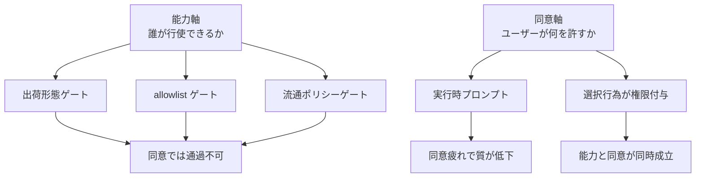

AI エージェントに権限を渡す設計は、いま「API 単位の permission」や「OAuth の scope」で行われています。この単位は、エージェントを相手にすると壊れます。

理由はシンプルです。エージェントは、動き出す前に自分が何をするかを知りません。事前に必要な権限を宣言できない主体に対して、事前宣言型の権限モデルを当てはめているためです。

本記事では、この問題を「OS 能力」と「ユーザー同意」という 2 軸に分解します。そして、この 2 軸が机上の整理ではなく、Android のソースコードと OS 設計史から導ける構造であることを示します。

題材には、欧州委員会が 2026 年 7 月 16 日に採択した DMA 決定を使います。この決定は、Android の 11 機能を第三者の AI アシスタントに開放させるものです。規制文書でありながら、「OS 能力とは具体的に何を指すのか」を列挙した稀な資料になっています。

## 結論を先に示します

本記事の主張は 4 点です。

| 主張 | 内容 |
|---|---|
| 直交性 | 能力と同意は、同じ軸の強弱ではなく独立した 2 軸 |
| 列挙の限界 1 | 能力の列挙は、権限の最小化とは別物 |
| 列挙の限界 2 | 同意の列挙は、同意の有効性とは別物 |
| 適用範囲 | 2 軸は問題を分解する語彙であり、攻撃を防ぐ機構とは別物 |

最後の 1 点は特に重要です。この 2 軸フレームは、プロンプトインジェクション対策にはなりません。その理由は後半で説明します。

2 軸の関係を図に示します。

図の要素は次のとおりです。

| 要素名 | 説明 |
|---|---|
| 能力軸 | システムが主体に行使を許す範囲 |
| 同意軸 | ユーザーが許諾する対象と粒度 |
| 出荷形態ゲート | アプリの出荷方法による判定 |
| allowlist ゲート | 事前登録による判定 |
| 流通ポリシーゲート | ストア規約による判定 |
| 実行時プロンプト | 行動ごとの確認ダイアログ |
| 選択行為が権限付与 | ユーザーの指定が権限範囲になる方式 |

## 能力軸には、同意で越えられない壁があります

まず、能力と同意が独立していることを示す具体例から入ります。

Android には、ユーザーがどれだけ同意しても開かない能力が存在します。`internal|preinstalled` のような protection level は、アプリの品質でもユーザーの意思でもなく、そのアプリがどのように出荷されたかを見て判定するためです。

ここが出発点になります。同意では越えられない壁が実在するということは、能力と同意が別々の軸であることを意味します。

### ゲートは 4 種類あります

Android のソースを確認すると、能力を閉じる仕組みは 1 種類ではありません。設計の議論では、この 4 つを区別すると噛み合いやすくなります。

| ゲート種別 | 具体例 | ユーザー同意での通過 |
|---|---|---|
| 技術的制約 | ハードウェア上の実制約 | 不可 (本質的) |
| 出荷形態ゲート | `internal\|preinstalled`、`knownSigner` | 不可 (方針による) |
| allowlist ゲート | AppFunctions の呼び出し側 | 不可 (方針による) |
| 流通ポリシーゲート | Play ポリシーによる制限 | 不可 (契約による) |

重要なのは、2 番目から 4 番目が技術的必然ではない点です。方針や契約で閉じているだけなので、方針が変われば開きます。DMA 決定が動かしたのは、まさにこの部分です。

### 同時ホットワードは技術的制約ではありません

具体例として、複数の AI アシスタントが同時にホットワードを待ち受ける機能を見ます。

AOSP の `ISoundTriggerHw.aidl` には、フレームワークが「will no longer enforce constraints on concurrent loading of models」と記載されています。`maxSoundModels` についても「merely a hint at this point」と書かれています。つまり、同時待ち受けはフレームワーク側で許容されています。

実際に閉じているのは次の 2 つです。

| 要素 | 内容 |
|---|---|
| `MANAGE_HOTWORD_DETECTION` | protection level が `internal\|preinstalled` |
| Android 16 CDD 9.8 | ユーザーがインストールしたアプリによる hotword detection service の提供を禁止 |

技術的に不可能なのではなく、方針で閉じている状態です。この区別は、設計判断でも有用です。「できない」と言われたとき、それが物理的な制約なのか、方針上の制約なのかで、打てる手が変わります。

### 第三者が排除されているわけではありません

ここで、よくある誤解を 2 つ訂正します。

1 つ目は「第三者はシステムのオンデバイスモデルを使えない」という理解です。これは事実と異なります。ML Kit GenAI の Prompt API は公開 Maven artifact として提供されており、allowlist の記載がありません。AICore への直接 bind は閉じていますが、非対称なのは条件 (beta 段階、SLA なし、トークン上限) であって、排除ではありません。

2 つ目は「第三者はアシスタントになれない」という理解です。これも事実と異なります。`AssistantRoleBehavior` のパッケージ列挙処理には、システムアプリだけに絞る条件がありません。

能力は層構造になっており、第三者は途中の層まで到達します。壁があるのはその先です。「排除」ではなく「層」として捉えるほうが、実態に合います。

## 同意軸では、確認を増やすと質が下がります

次に同意軸を見ます。ここでよくある発想が「行動ごとにユーザーへ確認すればよい」というものです。この発想は行き止まりです。

W3C TAG の設計原則は、パーミッションプロンプトを失敗モードとして扱っています。

> each permission prompt... increases the risk that users will ignore the contents of all permission prompts

確認を 1 つ増やすたびに、すべての確認が読まれなくなるリスクが上がる、という指摘です。TAG は「例外的な場合にのみ確認せよ」と述べています。

エージェントは行動回数が多いため、この問題が線形に悪化します。したがって、同意の設計で狙うべきは、確認の回数を増やすことではなく、同意の形を変えることです。

### 同意の形を変えた実装例

すでに動いている実装が 2 つあります。

| 実装 | 仕組み |
|---|---|
| transient activation | ジェスチャ由来、時間制限つき、使用により消費 |
| iOS document picker | security-scoped URL を参照カウント管理、usage description 不要 |

特に後者が示唆的です。iOS のファイル選択では、ユーザーは「写真へのアクセス権」という抽象的な権限に同意しているのではありません。「この 3 枚」という具体的な指定を行っており、その指定がそのまま権限の範囲になります。

つまり、ユーザーが選ぶ行為そのものが権限付与になっています。ここでは能力と同意が同時に成立しています。これが 2 軸を両立させる最良の形です。

## 同意は、能力レイヤに後付けできません

ここからが本記事の中心です。なぜ 2 軸を分けて設計する必要があるのかを、OS 設計史から説明します。

実際に出荷されている capability ベースの OS を横断すると、明確なパターンが現れます。

| システム | capability の強さ | ユーザー同意の概念 |
|---|---|---|
| seL4 | 強 | なし |
| Capsicum | 強 | なし |
| Fuchsia | 強 | なし |
| WASI | 中 | なし |
| Deno | 弱 | あり |

capability が強いシステムほど、ユーザー同意の概念を持ちません。そして、capability システムとして最も弱い Deno だけが、まともな同意機構を持っています。

これは偶然ではありません。seL4 の設計思想では、capability は「without referring back to Alice」に行使できることが要点です。つまり、非対話性こそが capability の目的です。そこにユーザーへの問い合わせを差し込む行為は、設計目標そのものに反します。

したがって、同意は capability レイヤの中に後付けできません。別の軸として、意図的に設計する必要があります。この結論の根拠は、seL4 自身のドキュメントにあります。

### confused deputy と TCB の問題

seL4 の白書には「Ambient authority and the confused deputy」という節があります。処方は「no designation without authority」と定式化されています。権限は、対象の指定と切り離して持たせてはならない、という意味です。

同じ節には、もう 1 つ重要な指摘があります。判断を deputy に委ねることは、その deputy をシステムの TCB (Trusted Computing Base) に含めることだ、という指摘です。

これは AI エージェントに対する鋭い問いになります。

> ツールを呼ぶかどうかの判断を LLM に委ねるとき、その LLM を信頼計算基盤に入れることに同意していますか

この問いは、暗黙のうちに答えを出してしまいがちです。明示的に決めるべき論点です。

なお、Capsicum の 2010 年の論文には、ブラウザについて次の記述があります。

> because it acts with the full power of the user, has access to all his or her resources

この記述は、2026 年の AI エージェントの説明としてそのまま通用します。問題そのものは新しくありません。

## 事例として DMA 決定を読みます

ここまでの 2 軸フレームを使って、実際の規制介入を読みます。

### 2 つの決定は別物です

2026 年 7 月 16 日に採択された決定は 2 件あり、別の事件、別の条文です。混同しやすいため区別します。

| 決定 | 事件番号 | 条文 |
|---|---|---|
| AI アシスタント相互運用 | DMA.100220 | Article 6(7) |
| 検索データ共有 | DMA.100209 | Article 6(11) |

### 開放される 11 機能

Article 6(7) の決定は、Android の 11 機能を 4 カテゴリで開放させます。

| カテゴリ | 機能 |
|---|---|
| Invocation | ホームボタン長押し、常時ホットワード検知 |
| Context | 端末内アプリデータへの集中アクセス、context-aware intelligence、ambient data |
| Actions on Apps and OS | structured on-device integration、screen automation、system integration |
| Access to Resources | システムレベルのオンデバイスモデル、オンデバイスモデル実装、バックグラウンド実行 |

期限は全 11 機能が Android 18、2027 年 8 月 1 日までです。2028 年になるのは、常時ホットワード検知のうちマルチサービス同時利用のサブ measure のみです。「ホットワードが 2028 年」という要約は不正確なので注意します。

### ゲーティングは 3 層構造です

決定を読むと、制約が単一の仕組みではないことがわかります。

| 層 | 対象 | 内容 |
|---|---|---|
| A | 5 機能 | Restricted features の認証 |
| B | 全 11 機能 | integrity 措置とユーザー同意 |
| C | 機能ごと | プロセス分離、暗号化条件 |

注意点があります。ambient data は A の Restricted features ではありませんが、C の条件を負います。単純な二分法ではありません。

認証制度も 2 本立てです。

| 制度 | 申請開始 |
|---|---|
| Trusted Certification Authorities | 2027 年 2 月 1 日 |
| Qualified AI Assistant | 2027 年 5 月 1 日 |

判定は 4 週間、申請が集中した場合は 8 週間の猶予があります。

ここで興味深いのは、規制側が門番の裁量を 3 方向から削っている点です。

| 制約 | 内容 |
|---|---|
| 取消不可 | 認証機関が発行した認証を Alphabet は取り消せない |
| 追加不可 | 条件リストは closed で、欧州委員会に諮らずに追加できない |
| 上書き可 | エンドユーザーはサービス単位で認証要件をオプトアウト可能 |

3 番目は、開発者モードを必要としません。ユーザーが門番の判断を個別に上書きできる構造です。

### 同じ日の 2 決定で、同意の扱いが逆になっています

検索データ共有の決定には、同意もオプトアウトも存在しません。モデルは完全に匿名化ベースです。

技術的には 6 段階のパイプライン (属性抑制、13 か月の allowlist、言語別クエリ長しきい値、クエリ抑制、メタデータの地域一般化、最大 3 クエリのミニセッション化) と、契約上の制約 (分離環境、再識別禁止、保持 13 か月上限、外部保証報告) で構成されます。

ただし被検索者の残存個人データは残るため、受益者は独立した GDPR 管理者になります。

同じ日に採択された 2 つの決定のうち、一方は全機能に同意を要求し、他方は同意概念を持ちません。能力軸と同意軸が独立に設計されうることの、制度側からの実例です。

### エージェント的な文脈は渡りません

決定には、最初の 1 件より後の AI Mode クエリをすべて抑制する条項があります。

つまり、マルチターンの検索文脈という、エージェント的な利用の中核部分は、競合に渡るデータから構造的に除外されています。相互運用を義務づけながら、エージェントが最も必要とする文脈は渡らない構造です。

### 法的ステータスに注意します

この決定を前提に設計判断を行う場合、法的な安定性を確認しておく必要があります。

決定は拘束力を持ち、発効しています。不服申立ては執行を停止しません。ただし、本案で争う余地は残っています。2026 年 7 月時点の関連判決は、指定の段階における相互運用性の争いを対象としたものであり、この決定を本案で争えないことまでは意味しません。

したがって、現時点の理解は「争える余地はあるが、執行は止まらない」となります。期限が前倒しで確定した前提で設計を進めつつ、条件の細部は変わりうるものとして扱うのが妥当です。

## 落とし穴を 2 つ共有します

本記事の調査では、反証を目的とした検証を行い、当初の主張を複数取り下げました。取り下げた内容は、結論と同じくらい実務的な価値があるため共有します。

### 落とし穴 1: 列挙と最小化は別物です

DMA が 11 機能を列挙したことをもって「良い権限分類ができた」と読むのは早計です。

意見書によれば、この 4 カテゴリはセキュリティ原則ではなく、Alphabet 自社サービスとの競争上の同等性で定義されています。ambient data については、既存の簡略化された同意プロセスを第三者にも拡張する構造であり、監視的なアクセスモデルを常態化させるという批判があります。

別の分析は、Article 6(7) を「the exact opposite of the principle of least privilege」と評しています。実際、機能数は予備段階の 13 から最終決定の 11 へ、3 か月で変動しました。

この分類は、あるベンダーの 2026 年時点の内部権限境界のスナップショットです。普遍的な設計原理として扱うと誤ります。

> 列挙は語彙を与えます。ただし、権限が最小である保証は与えません。

### 落とし穴 2: 列挙と有効性も別物です

同意についても同じ構造の誤りが起こります。

「同意は列挙できない」という主張は、事実として成立しません。IAB TCF は同意を 11 の purposes、標準データ分類、約 5000 ベンダーの機械可読リストとして列挙しています。

ところが、ブリュッセル市場裁判所は 2025 年 5 月 14 日に、この枠組みが GDPR の有効な法的根拠を確立できていないと判示しました。

> 列挙は同意に表現形式を与えます。ただし、有効性は与えません。

同意は「形式が整っているか」ではなく「法的に有効か」で評価されます。この 2 つは独立しています。

## 適用範囲を限定します

最後に、この 2 軸フレームで解けない問題を明示します。

capability を正しく配っても、プロンプトインジェクション由来の confused deputy は止まりません。攻撃者が LLM の判断を操作した場合、権限は正規、同意も正規のまま、指定だけが攻撃者の制御下に入るためです。

研究の方向としては、強制点を OS の権限付与ではなくデータフロー追跡に置く設計が提案されています。また、純粋な capability システムにおける権限伝播の問題は、1984 年に指摘されて以来、未解決のまま残っています。エージェントの委譲チェーンでは、この問題がより深刻になります。

したがって、本記事の主張は次の範囲に限定されます。

> capability と consent の 2 軸は、問題を分解する語彙です。攻撃を防ぐ機構は、別のレイヤに必要です。

## 設計への持ち帰り

エージェントに権限を渡す設計を行うとき、次の順で考えます。

| 順序 | 判断 |
|---|---|
| 1 | 能力の問題か、同意の問題かを最初に切り分け |
| 2 | 能力側は列挙、ただし最小化との混同を回避 |
| 3 | 同意側は選択行為そのものを権限付与にする形を志向 |
| 4 | 機微な同意はエージェントの文脈の外へ分離 |
| 5 | LLM を TCB に含めるかを明示的に決定 |

4 番目について補足します。MCP の URL mode elicitation はこの形を採用しています。クライアントは URL を自動取得してはならず、明示同意なしに開いてはならず、完全な URL をユーザーに提示する必要があります。

考え方としては、エージェントに権限を渡すのではなく、同意の瞬間だけエージェントを迂回させる設計です。

なお、エージェントの委譲権限については、批准済みの標準がまだ存在しません。OAuth の作業部会には該当する採択文書がなく、個人提案は玉石混交の状態です。実質的に動いているのは業界団体の仕様であり、署名済みクレデンシャルとして権限を表現する方向が見え始めた段階です。

## まとめ

エージェントの権限設計は、「OS 能力」と「ユーザー同意」という独立した 2 軸に分解すると整理できます。この直交性は、Android の protection level が出荷形態でゲートしている事実と、capability ベース OS がユーザー同意の概念を持たない事実から確認できます。

ただし、能力の列挙は権限の最小化を意味せず、同意の列挙は同意の有効性を意味しません。2 軸はあくまで問題を分解する語彙であり、プロンプトインジェクション対策は別のレイヤで設計する必要があります。

この記事が少しでも参考になった、あるいは改善点などがあれば、ぜひリアクションやコメント、SNSでのシェアをいただけると励みになります！

## 参考リンク

- 公式ドキュメント
  - [Digital Markets Act](https://digital-markets-act.ec.europa.eu/)
  - [Alphabet specification proceedings - Interoperability for AI services](https://digital-markets-act.ec.europa.eu/developer-portal/interoperability/alphabet-specification-proceedings-interoperability-ai-services_en)
  - [Commission provides guidance to Google for AI interoperability on Android](https://digital-markets-act.ec.europa.eu/commission-provides-guidance-google-ai-interoperability-android-and-sharing-google-search-data-under-2026-07-16_en)
  - [Android Compatibility Definition Document](https://source.android.com/docs/compatibility/cdd)
  - [ML Kit GenAI APIs](https://developers.google.com/ml-kit/genai)
  - [seL4 Whitepaper](https://sel4.systems/About/seL4-whitepaper.pdf)
  - [Fuchsia Documentation](https://fuchsia.dev/fuchsia-src/concepts)
  - [WASI](https://wasi.dev/)
  - [W3C TAG Design Principles](https://www.w3.org/TR/design-principles/)
  - [W3C Permissions API](https://www.w3.org/TR/permissions/)
  - [Model Context Protocol Specification](https://modelcontextprotocol.io/specification/2025-11-25)
  - [RFC 9396 OAuth 2.0 Rich Authorization Requests](https://www.rfc-editor.org/rfc/rfc9396.html)
  - [RFC 9700 Best Current Practice for OAuth 2.0 Security](https://www.rfc-editor.org/rfc/rfc9700.html)
  - [OpenID Connect Core](https://openid.net/specs/openid-connect-core-1_0.html)
  - [OWASP LLM06 Excessive Agency](https://genai.owasp.org/llmrisk/llm062025-excessive-agency/)
- GitHub
  - [Android platform frameworks base](https://cs.android.com/android/platform/superproject/main)
  - [Model Context Protocol schema](https://github.com/modelcontextprotocol/modelcontextprotocol)
- 記事
  - [The Confused Deputy](https://cap-lore.com/CapTheory/ConfusedDeputy.html)
  - [Capability Myths Demolished](https://srl.cs.jhu.edu/pubs/SRL2003-02.pdf)
  - [Capsicum practical capabilities for UNIX](https://www.cl.cam.ac.uk/research/security/capsicum/papers/2010usenix-security-capsicum-website.pdf)
  - [Defeating Prompt Injections by Design](https://arxiv.org/abs/2503.18813)
