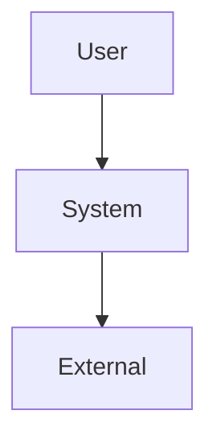
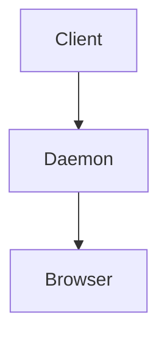
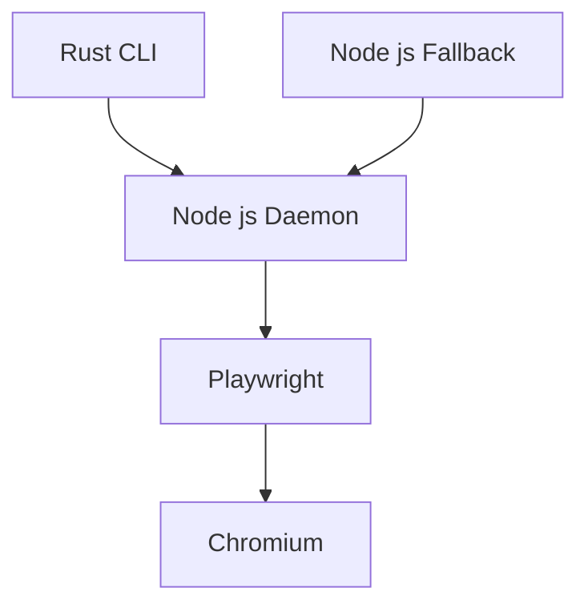
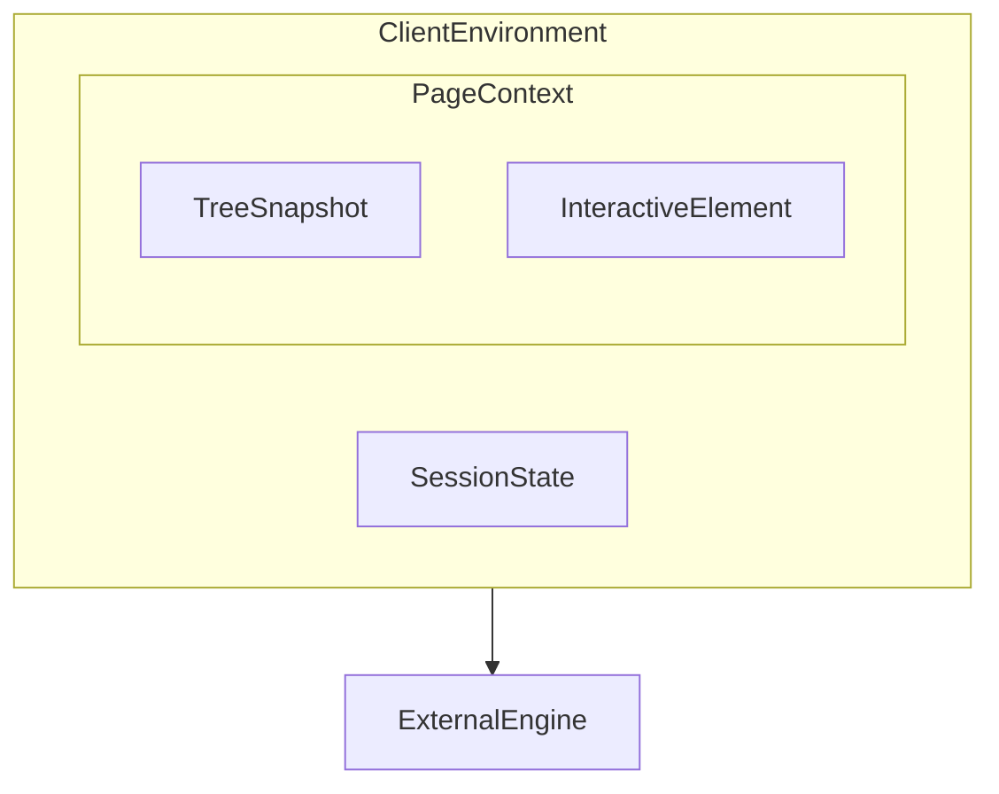
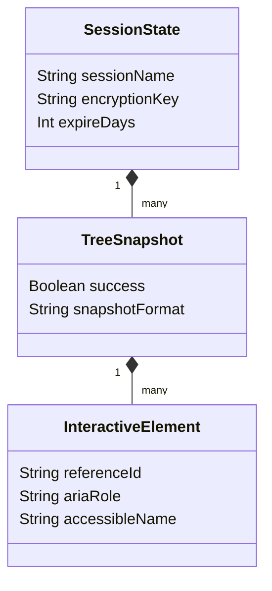

## 概要

Vercel Labsが開発を主導するagent-browserは、AIエージェントのブラウザ操作自動化を目的とした専用CLIツールです。
対象のWebページを解析し、インタラクティブな要素に一意の参照ID（例：@e1）を付与したアクセシビリティツリーを生成します。
AIエージェントはこの参照IDを利用して、クリック、テキスト入力、情報取得などのアクションを直感的に実行します。

## 特徴

Playwright MCPを利用する従来の手法と比較して、LLMのコンテキストウィンドウの消費量を最大93%削減します。
CSSセレクタやXPathを排除し、参照IDによる確定的かつ安定した要素操作を実現します。
Rustによるネイティブコンパイルを採用し、コマンド解析とバックグラウンドプロセスとの通信を50ミリ秒未満の速度で完了します。
ネイティブバイナリの実行が困難な環境向けに、Node.js実装への自動フォールバック機能を備えます。

## 構造

### システムコンテキスト図



| 要素名 | 説明 |
| :---- | :---- |
| User | ブラウザ操作の命令を発行するAIエージェントまたは開発者 |
| System | コマンドを受け取りブラウザの自動化を実行する対象ソフトウェア群 |
| External | 構築やテストの対象となる外部のWebアプリケーション |

### コンテナ図



| 要素名 | 説明 |
| :---- | :---- |
| Client | ユーザーからの入力を受け付け、プロセス間通信を用いて命令を転送するフロントエンド層 |
| Daemon | バックグラウンドで常駐し、各種セッション状態とブラウザのライフサイクルを維持するプロセス |
| Browser | WebページのレンダリングとDOMへの実際の操作を担当するエンジン部分 |

### コンポーネント図



| 要素名 | 説明 |
| :---- | :---- |
| Rust CLI | コマンドライン引数をパースし、高速なIPC通信を実現するネイティブ実行ファイル |
| Node js Fallback | ネイティブバイナリ非互換環境で動作を担保する代替実行モジュール |
| Node js Daemon | バックグラウンドで持続的に動作し、Playwrightインスタンスの管理を担当する常駐プログラム |
| Playwright | デーモンからの命令をブラウザエンジンに対する操作プロトコルへ変換するライブラリ |
| Chromium | 実際の描画処理およびアクセシビリティツリーの構築を行うデフォルトのブラウザコア |

## 情報

### 概念モデル



| 要素名 | 説明 |
| :---- | :---- |
| ClientEnvironment | ツール内部で管理する状態データ全体を包含する領域 |
| SessionState | 認証情報やCookieなどの接続コンテキストを保持する論理的なセッション情報 |
| PageContext | 特定時点での画面構造やDOMツリーに関する情報を集約する領域 |
| TreeSnapshot | 取得したアクセシビリティツリーの全体構造を表すデータ |
| InteractiveElement | スナップショット内に含まれる、操作可能な個々のUI部品を表すデータ |
| ExternalEngine | ツールの外部に存在する、実際の描画やプロトコル通信を担うシステム |

### 情報モデル



| 要素名 | 説明 |
| :---- | :---- |
| SessionState | 並行実行を分離するためのセッション名、保存状態の暗号化キー、有効期限日数を保持するクラス |
| TreeSnapshot | 実行結果の成否ステータスと、抽出されたツリーデータを文字列またはJSON形式で保持するクラス |
| InteractiveElement | AIが要素を指定するための参照ID、役割、およびアクセシブルネームを保持するクラス |

## 構築方法

agent-browserの導入には、パッケージマネージャーを利用したインストールと、ソースコードからのビルドの2つの方法があります。

### 前提環境の構築

いずれの導入方法でも、以下の環境が必要です。

- Node.jsバージョン22以降の準備
- npmまたはpnpmの利用設定
- Chromiumなどのブラウザエンジンが正常に起動するOS環境の構築

### 導入方法1: パッケージのインストール

npmを利用してグローバルにインストールします。依存するブラウザバイナリを同時に導入する場合は`--with-deps`オプションを付与します。

```bash
npm install -g @vercel/agent-browser
# またはブラウザバイナリも同時にインストールする場合
npm install -g @vercel/agent-browser --with-deps
```

インストール完了後、ヘルプコマンドを実行してパスの疎通とバージョン情報を確認します。

```bash
agent-browser --help
```

### 導入方法2: ソースコードからのビルド

GitHubリポジトリからソースコードをクローンし、ビルドスクリプトを実行してRust CLI層およびNode.jsフォールバック層の実行可能ファイルを生成します。

```bash
git clone https://github.com/vercel-labs/agent-browser.git
cd agent-browser
pnpm install
pnpm build
```

### AIアシスタント環境への統合

- Claude CodeやOpenCodeなどのAIエージェントのスキルディレクトリへのツール登録
- スキル定義ファイル（SKILL.md）の配置
- カスタムMCPサーバーを利用する構成でのJSON設定ファイルへの呼び出し経路追記

## 利用方法

### ウェブページのナビゲーション

- 対象URLを指定した`open`コマンド実行によるページ読み込み
- 別ドメインでの検証を並行して進める場合の`tab new`コマンドによる新規タブ遷移
- 認証トークンを利用したバックドアアクセスを行う場合の`--headers`オプション指定

### アクセシビリティツリーの取得

- 画面状態を把握するための`snapshot -i`コマンドによるインタラクティブ要素抽出
- 構造解析のみを目的とする場合の`-c`オプション追加による空要素除外
- マウスホバーなどに反応する要素を含める場合の`-C`オプション付与による探索範囲拡張

### 要素に対する操作

- ツリーデータ内の参照IDを用いた`click @e1`コマンドによるクリックアクション実行
- フォーム入力を行う場合の`fill @e2 "入力値"`コマンドによるテキストボックス値設定
- 画面上のテキストデータを抽出する場合の`get text @e1`コマンドによる文字列取得

### JavaScriptの評価と実行

- `eval`コマンドへのJavaScriptコード文字列渡しによるブラウザコンテキスト内直接実行
- 複雑なスクリプトを安全に渡すためのヒアドキュメント形式と`--stdin`オプションの組み合わせ
- シェルのエスケープ問題を回避する目的でのBase64エンコードスクリプトと`-b`オプション指定

### スクリーンショットの撮影と視覚的検証

- `screenshot`コマンド実行による現在の画面表示の画像ファイル出力
- 画像を解析に用いるAIエージェント向けの`--annotate`オプションによる参照IDオーバーレイ表示
- 記録を目的として動画を残す場合の`record start`コマンドによるWebM形式キャプチャ開始

## 運用

### セッションの永続化と分離

- 複数タスク並列処理時の競合を避けるための`--session <名前>`オプションによる独立ブラウザインスタンス起動
- 認証完了後のログイン状態を維持するための`state save <パス>`コマンドによるCookieやローカルストレージ内容の暗号化保存
- 後続の自動化フローを開始する前の`state load <パス>`コマンドによる保存済み状態復元

### 環境変数を利用した機密情報管理

- `AGENT_BROWSER_SESSION_NAME`環境変数設定によるセッション保存時のデフォルト識別名定義
- `AGENT_BROWSER_ENCRYPTION_KEY`への64文字16進数文字列登録によるAES-256-GCM暗号化適用
- `AGENT_BROWSER_STATE_EXPIRE_DAYS`への数値指定による古いセッション状態ファイルの自動破棄日数管理

### トラブルシューティングと解析機能

- エラー原因調査を行う目的での`console`コマンド実行によるブラウザ内記録ログ出力
- キャッチされなかったJavaScript例外を確認するための`errors`コマンドによる詳細スタックトレース取得
- DOM構造と実際の表示位置を比較するための`highlight @e1`コマンドによる指定要素強調表示

### 外部ブラウザとの連携接続

既存のユーザープロファイル情報を利用する場合、Chromeブラウザをリモートデバッグモードで手動起動し、agent-browserからアタッチします。

1. Chromeをリモートデバッグモードで起動します（ポート9222の例）。

```bash
# macOSの例
/Applications/Google\ Chrome.app/Contents/MacOS/Google\ Chrome --remote-debugging-port=9222
```

2. `--cdp`オプションで対象ポート番号を指定し、起動済みブラウザにアタッチして操作を続行します。Windows環境におけるIPv6とIPv4のバインディング問題を回避するため、接続先ホスト指定には明示的に`127.0.0.1`を利用します。

```bash
agent-browser open https://example.com --cdp http://127.0.0.1:9222
```

## 参考リンク

- 公式ドキュメント
  - [OpenClaw (Clawdbot) - Vercel](https://vercel.com/docs/ai-gateway/chat-platforms/openclaw)
  - [How I use OpenCode with Vercel AI Gateway to build features fast](https://vercel.com/kb/guide/how-i-use-opencode-with-vercel-ai-gateway-to-build-features-fast)
- GitHub
  - [vercel-labs/agent-browser: Browser automation CLI for AI agents](https://github.com/vercel-labs/agent-browser)
  - [agent-browser/README.md at main](https://github.com/vercel-labs/agent-browser/blob/main/README.md)
  - [agent-browser/skills/agent-browser/SKILL.md at main](https://github.com/vercel-labs/agent-browser/blob/main/skills/agent-browser/SKILL.md)
  - [fix: resolve 33+ open issues — refs, CDP, lifecycle, CLI, deps, exports, platform compat #426](https://github.com/vercel-labs/agent-browser/pull/426)
  - [Firecrawl MCP Server](https://github.com/mcp/firecrawl/firecrawl-mcp-server)
  - [cablate/Agentic-MCP-Skill](https://github.com/cablate/mcp-progressive-agentskill)
- 記事
  - [Vercel製 agent-browserの使い方 #AI - Qiita](https://qiita.com/tarou-imokenpi/items/c2948d1d6b8e96364a91#:~:text=agent%2Dbrowser%E3%81%AF%E3%80%81AI%E3%82%A8%E3%83%BC%E3%82%B8%E3%82%A7%E3%83%B3%E3%83%88,%E7%9A%84%E3%81%AB%E8%A1%8C%E3%81%88%E3%82%8B%E3%81%93%E3%81%A8%E3%81%A7%E3%81%99%E3%80%82)
  - [Complete Guide to agent-browser: Command-line Browser Automation Tool Exclusively for AI Agents - Apiyi.com Blog](https://help.apiyi.com/en/agent-browser-ai-browser-automation-cli-guide-en.html)
  - [Self-Verifying AI Agents: Vercel's Agent-Browser in the Ralph Wiggum Loop | Pulumi Blog](https://www.pulumi.com/blog/self-verifying-ai-agents-vercels-agent-browser-in-the-ralph-wiggum-loop/)
  - [Agent-Browser: AI-First Browser Automation That Saves 93% of Your Context Window | by Rick Hightower - Medium](https://medium.com/@richardhightower/agent-browser-ai-first-browser-automation-that-saves-93-of-your-context-window-7a2c52562f8c)
  - [Show HN: Webctl – Browser automation for agents based on CLI instead of MCP](https://news.ycombinator.com/item?id=46616481)
  - [deepwiki vercel-labs/agent-browser](https://deepwiki.com/vercel-labs/agent-browser)
  - [LobeHub am-will-codex-skills-agent-browser](https://lobehub.com/it/skills/am-will-codex-skills-agent-browser)
  - [agent-browser | Skills Marketplace - LobeHub](https://lobehub.com/it/skills/fradser-dotclaude-agent-browser)
