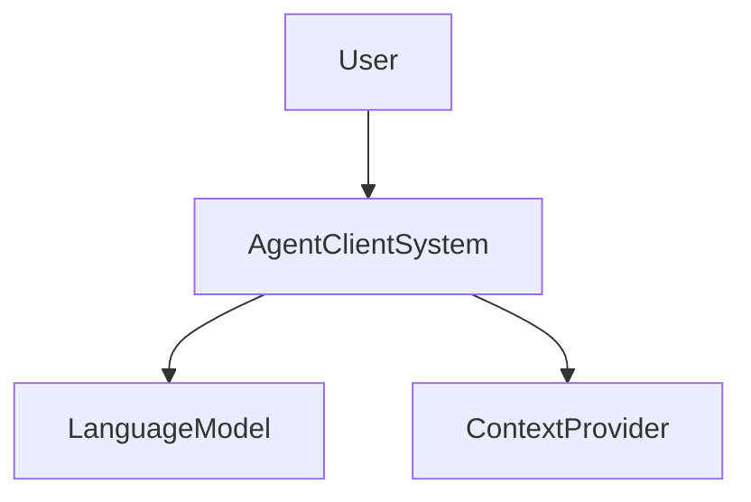
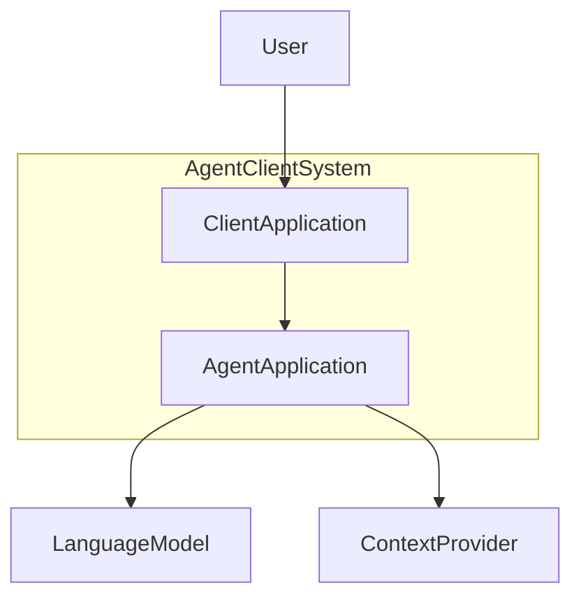
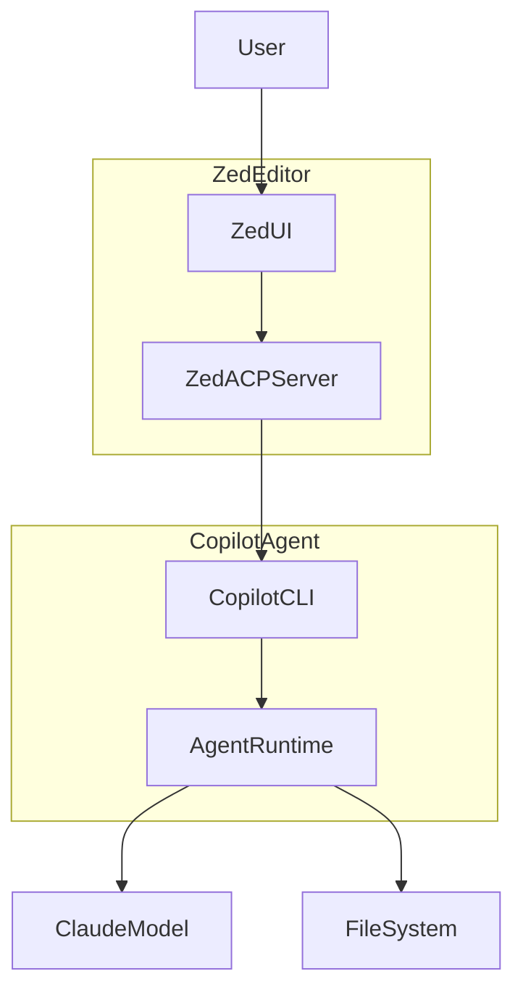
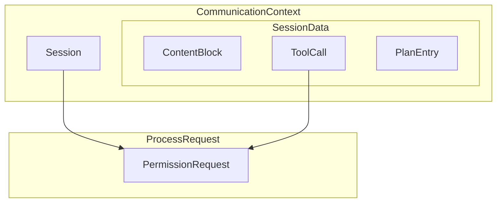
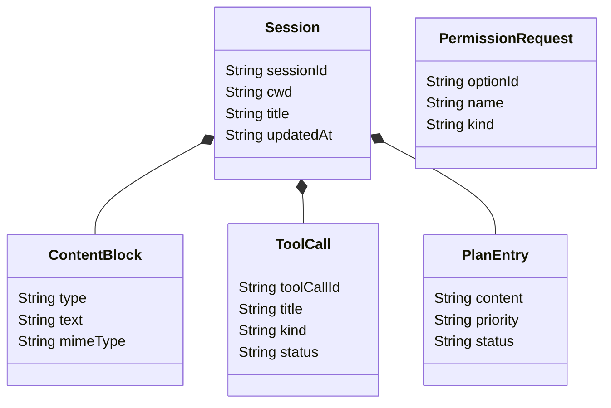

## 概要
Agent Client Protocol (以下、ACP) は、統合開発環境と自律型AIコーディングエージェント間の通信規格を統一するオープンなプロトコルです。

従来のエコシステムでは、エディタとエージェントの組み合わせごとに専用のプラグインを開発する個別統合の手法が主流でした。しかし、この密結合な構造は開発者に多大な統合コストを強いるだけでなく、エージェントの互換性を特定の環境に制限してしまいます。そこでACPは、Language Server Protocol (LSP) がプログラミング言語ごとの機能提供を抽象化した歴史的アプローチに倣い、エージェントワークフローのための共通の相互運用レイヤーを提供します。

このプロトコルの導入により、エコシステム全体でツール間のシームレスな接続が実現します。
ACPを実装したエージェントは、プロトコルに準拠するすべてのエディタ上で即座に動作可能です。
同時に、プロトコルをサポートするエディタ側も、利用可能なすべてのエージェントに対するアクセス権を獲得します。
結果として、ツール開発者はそれぞれのコア機能の高度化にリソースを集中でき、エンドユーザーは自身の要件に最適なエディタとAIの組み合わせを自由に選択できるようになります。
通信の基盤にはJSON-RPC 2.0を採用しており、標準入出力を用いたローカル実行からHTTPを介したリモート通信まで、多様なアーキテクチャに柔軟に対応します。

## 特徴
ACPは、自律型AIと人間の協調作業を最適化するために、多数の先進的な特徴を備えています。

1. **高度な双方向ストリーミング通信**
  AIエージェントによる推論やツール実行は長時間を要する傾向があるため、リアルタイムなフィードバックが不可欠です。プロトコルは状態更新のストリーミング機能を中核に据え、テキストの段階的な生成やプロセスの進行状況を逐次的にクライアントへ送信するメカニズムを提供します。
1. **堅牢なステートフルセッション管理の採用**
  単一の接続内で独立した複数の対話セッションを同時に進行させます。
  各セッションは固有の作業ディレクトリやコンテキストを保持し、過去のセッションIDを利用して以前の対話状態を完全に復元する機能をサポートします。
1. **厳密な権限制御とセキュリティモデルの統合**
  エージェントがファイルシステムへの書き込みやターミナルコマンドの実行といったシステムへの影響を伴う操作を試みる際、事前にクライアントへ許可を求めます。クライアントはこの要求をユーザーに提示し、明示的な承認を得た後にのみ操作の実行を許可します。
1. **高い拡張性と互換性の維持**
  プロトコル仕様は基本的なメソッドを定義しつつ、アンダースコアを付与したカスタムメソッドやメタデータフィールドを利用した独自機能の追加を容認します。また、Model Context Protocol (MCP) との統合も想定されており、MCPが外部データソースやツールへのアクセスを標準化するのに対し、ACPはエディタとエージェント間の対話・制御レイヤーを標準化するという形で、両者は相互補完的に機能します。

## 構造

### システムコンテキスト図
ACPを取り巻く全体的なシステム環境を図解します。



| 要素名 | 説明 |
| :---- | :---- |
| User | コーディング作業を主導する開発者やシステムオペレーター |
| AgentClientSystem | エディタとAIが統合されたプロトコル準拠の対話システム |
| LanguageModel | 高度な自然言語処理と推論能力を提供する外部の生成AI基盤 |
| ContextProvider | データベースやリポジトリ情報の追加文脈を提供する外部システム |

### コンテナ図
システムコンテキスト内部の構成を図解します。



| 要素名 | 説明 |
| :---- | :---- |
| ClientApplication | ユーザーインターフェースを提供し環境全体を管理するフロントエンド環境 |
| AgentApplication | クライアントからの要求を解釈しタスクを自律的に遂行するバックエンド環境 |

### コンポーネント図
コンテナ内部の要素を具体的な技術要素を用いて図解します。



| 要素名 | 説明 |
| :---- | :---- |
| ZedUI | コード編集やターミナル操作を受け付けるエディタの画面コンポーネント |
| ZedACPServer | エディタ内部でプロトコルの解釈とプロセス起動を担う通信コンポーネント |
| CopilotCLI | 標準入出力を介してメッセージを受信するコマンドラインインターフェース |
| AgentRuntime | 推論結果を基にツール実行や進捗管理を行うエージェントの中核コンポーネント |
| ClaudeModel | エージェントの推論エンジンとして機能する大規模言語モデル |
| FileSystem | ソースコードの読み書き対象となるローカルストレージ環境 |

## 情報

### 概念モデル
プロトコル内部で扱われるデータ群の概念構造を図解します。



| 要素名 | 説明 |
| :---- | :---- |
| Session | クライアントとエージェント間で確立された一連の対話コンテキスト |
| ContentBlock | メッセージ内に含まれるテキストや画像などの個別のデータ単位 |
| ToolCall | エージェントが外部機能の利用を要求する具体的な手続き |
| PlanEntry | 複雑なタスクを解決するために策定された段階的な実行計画の要素 |
| PermissionRequest | 破壊的な操作の実行前にユーザーの承認を求める要求手続き |

### 情報モデル
主要なデータエンティティとその属性を図解します。



| 要素名 | 説明 |
| :---- | :---- |
| Session | 対話履歴の包括的管理。セッション識別子、作業ディレクトリ、表示用タイトル、最終更新日時の保持 |
| ContentBlock | データの種類の定義。種別判定用のタイプ、テキスト実体、MIMEタイプの保持 |
| ToolCall | ツールの実行状態の追跡。ツール識別子、機能タイトル、操作の種類、現在のステータスの管理 |
| PlanEntry | 計画の進捗の定義。タスクの具体的内容、処理の優先度、実行ステータスの記録 |
| PermissionRequest | 権限要求の選択肢の提示。オプション識別子、表示名、承認の種類の定義 |

## 構築方法

### 開発環境とSDKの準備
- **公式ソフトウェア開発キットの導入**
  TypeScript、Rust、Kotlin、Pythonなど、主要なプログラミング言語向けに提供される公式ソフトウェア開発キットをプロジェクトの依存関係に組み込みます。
  これらのライブラリはプロトコルの複雑なパース処理を隠蔽し、型安全なインターフェースを提供します。
- **通信トランスポート層の確立**
  プロトコルはトランスポート非依存の設計を採用しています。
  ローカルでの密接な統合を目指す場合は標準入出力ストリームを割り当て、分散システムを構築する場合はHTTPやWebSocketなどのネットワークプロトコルを選択して接続オブジェクトをインスタンス化します。
- **スキーマ駆動によるメッセージ検証**
  通信に乗るJSONデータは厳密なスキーマに基づきます。
  SDK内蔵のバリデーション機能を活用し、キャメルケースとスネークケースの相互変換や、未定義フィールドの適切な処理を自動化するパイプラインを構築します。

### エージェントプロセスの実装手順
- **初期化フェーズと能力の提示**
  接続確立直後にクライアントから送信される初期化要求を受信し、エージェント側がサポートするプロトコルバージョンと機能の一覧を返却します。
  テキスト生成、画像解析、オーディオ処理などの対応コンテンツタイプを明示的に宣言します。
- **セッションの生成と状態管理**
  作業ディレクトリのパスを含むセッション作成要求を受け取り、一意のセッション識別子を生成してクライアントに応答します。
  この識別子をキーとして、対話履歴や利用可能なModel Context Protocolサーバーの接続情報をメモリ上に永続化します。
- **プロンプトの受信とストリーミング応答**
  ユーザーの指示を含むコンテンツブロック配列を受信した際、バックグラウンドの推論プロセスを直ちに起動します。
  言語モデルから得られる断片的なテキストデータを逐次的にクライアントへ送信し、リアルタイムなユーザー体験を創出します。
- **ツール実行と進捗の可視化**
  ファイル操作や外部リソースの検索が必要な場合、ツール呼び出し要求の通知を送信してステータスを進行中に変更します。
  操作が完了した時点で結果データを格納し、完了ステータスとともに最新の状態を再度通知します。
- **ユーザーへの権限要求プロセス**
  ファイルの削除やシステム設定の変更など、重大な影響を及ぼすツールを実行する直前に権限要求メソッドを発行します。
  承認済みの応答を受信した後にのみ実際の処理を進行し、キャンセルされた場合は安全に処理を中断します。

以下は、TypeScript SDKを用いて、初期化からプロンプトの受信、ストリーミング応答までを行うエージェントプロセスの基本的な実装例です。

```typescript
import { AgentServer } from "@agentclientprotocol/sdk";

// エージェントの初期化と能力の提示
const server = new AgentServer({
  name: "my-custom-agent",
  version: "1.0.0",
  capabilities: {
    prompts: true,
    tools: true
  }
});

// プロンプトの受信とストリーミング応答
server.onPrompt(async (request, response) => {
  try {
    const userMessage = request.messages[0].content;
    
    // ストリーミング応答の開始
    response.stream({
      type: "text",
      text: `Received: ${userMessage}. Processing...`
    });
    
    // 処理完了
    response.finish();
  } catch (error) {
    // エラーハンドリング
    response.error({
      code: -32603,
      message: "Internal error during prompt processing",
      data: error.message
    });
  }
});

// stdioモードで起動
server.startStdio();
```

### クライアントインターフェースの構築手順
- **エージェントのプロセス管理**
  エディタのバックグラウンドタスクとしてエージェントの実行ファイルをサブプロセスとして起動します。
  標準入力と標準出力をパイプで接続し、プロセスが終了するまで継続的にストリームを監視するイベントループを構成します。
- **リソースアクセスのサンドボックス化**
  エージェントからのファイル読み書き要求を受信した際、指定されたパスが現在の作業ディレクトリの範囲内に収まっているかを厳密に検証します。
  範囲外へのアクセス要求は即座に拒否し、システムの安全性を担保します。
- **リアルタイム更新のUIバインディング**
  高頻度で到達するストリーミング更新イベントを効率的に処理するため、一定のバッファリング期間を設けて画面の再描画を最適化します。
  タスクの実行計画やツールの進捗状況を専用のパネルに視覚的にバインドします。

## 利用方法

### 環境設定とエージェントの登録
- **エージェントのインストール**
  対応する統合開発環境の拡張機能メニューや設定画面を開き、ACPレジストリから目的に合致するエージェントを検索してインストールを実行します。
- **設定ファイルの作成と編集**
  カスタムエージェントを手動で組み込む場合、ユーザーのホームディレクトリ配下に専用のJSON形式設定ファイルを作成します。
  このファイル内に、エージェントの表示名、実行ファイルの絶対パス、起動時の引数配列を正確に記述します。
- **認証情報と環境変数の注入**
  大規模言語モデルへのアクセスに必要なAPIキーや、組織固有のプロキシ設定などを設定ファイルの環境変数ブロックに登録します。
  設定された値はエージェントプロセスの起動時に安全に引き継がれます。

以下は、エディタ（例：ZedやJetBrains IDE）にカスタムエージェントを登録するための設定ファイル（`agents.json`）の例です。
この設定により、エディタは指定されたコマンドでエージェントプロセスを起動し、環境変数を渡すことができます。

```json
{
  "agents": [
    {
      "name": "My Custom Agent",
      "command": "node",
      "args": ["/path/to/agent/dist/index.js"],
      "env": {
        "OPENAI_API_KEY": "sk-..."
      }
    }
  ]
}
```

### 統合環境でのワークフロー実行
- **対話セッションの開始**
  エディタ内のチャットツールウィンドウを展開し、登録済みのエージェントリストから利用するモデルを選択します。
  プロジェクトのルートディレクトリが自動的に作業コンテキストとして設定され、即座に対話を開始可能な状態に移行します。
- **コンテキストを含めたプロンプトの送信**
  エディタ上で特定のコードブロックや関数をハイライトした状態でプロンプトを入力します。
  選択されたテキストやファイルパスはプロトコルのコンテンツブロックとしてシリアライズされ、エージェントの推論リソースとして活用されます。
- **実行計画の確認と承認**
  複雑なリファクタリングを指示した際、エージェントが提示するタスクの実行計画がUI上に展開されます。
  提案された変更内容の差分プレビューを確認し、安全性が担保された段階で一括適用の承認ボタンを押下します。

### コマンドラインツールによる利用
- **stdioモードでの直接起動**
  ターミナル環境からCLIベースのエージェントを直接起動し、標準入出力を経由して対話的なコーディング支援を受け取ります。
  このモードはCI/CDパイプラインでの自動化スクリプトへの組み込みに極めて有効に機能します。
- **TCPモードでのサービスホスティング**
  ポート番号を指定したTCPモードでエージェントプロセスを常駐させ、同一ネットワーク内の複数のクライアントからリモート接続を受け付けるサーバー環境を構築します。

以下は、主要なCLIエージェントを呼び出すコマンドの例です。
それぞれのエージェントは、標準入出力（stdio）を利用したローカルプロセスとして起動して通信しますが、起動時のコマンドやフラグが異なります。

* **GitHub Copilot CLI**: ネイティブでACPをサポートしており、`copilot --acp --stdio` コマンドで起動します。
* **Gemini CLI**: 同様にネイティブでサポートしており、`gemini --experimental-acp` コマンドで起動します。
* **Claude Code**: Zed提供のアダプターを使用し、`npx @zed-industries/claude-code-acp` で起動します。
* **Codex CLI**: こちらもZed提供のアダプターを使用し、`npx @zed-industries/codex-acp` で起動します。

公式の `@agentclientprotocol/sdk` を使用して、これら4つのCLIをTypeScriptからサブプロセスとして呼び出し、ACP通信を確立するためのサンプルコードは以下のようになります。

```typescript
import * as acp from "@agentclientprotocol/sdk";
import { spawn } from "node:child_process";

// 4つのエージェントの起動コマンドと引数の定義
const agentConfigs = {
  copilot: { command: "copilot", args: ["--acp", "--stdio"] },
  gemini: { command: "gemini", args: ["--experimental-acp"] },
  claude: { command: "npx", args: ["@zed-industries/claude-code-acp"] },
  codex: { command: "npx", args: ["@zed-industries/codex-acp"] },
};

async function runAgent(agentName: keyof typeof agentConfigs) {
  const config = agentConfigs[agentName];
  console.log(`${agentName} を起動しています...`);

  // 1. エージェントをサブプロセスとして起動し、標準入出力をパイプで接続
  const agentProcess = spawn(config.command, config.args, {
    stdio: ["pipe", "pipe", "inherit"],
  });

  if (!agentProcess.stdin || !agentProcess.stdout) {
    throw new Error("プロセスの標準入出力の確保に失敗しました。");
  }

  // 2. この後、SDKの ClientSideConnection などを用いて
  // agentProcess.stdin / agentProcess.stdout にストリームを渡し、
  // initialize や session/new などのプロトコル通信を開始します。
  
  // 例: 通信が確立できたと仮定した処理
  console.log(`${agentName} とのACP接続準備が完了しました。`);
  
  // プロセス終了時のクリーンアップ
  agentProcess.on("close", (code) => {
    console.log(`${agentName} プロセスが終了しました (コード: ${code})`);
  });
}

// 実行例: 任意のエージェントを指定して呼び出し
runAgent("copilot").catch(console.error);
```

このように、コマンドと引数さえ適切に切り替えれば、プロトコル自体は共通であるため、同じコード基盤（TypeScript SDK）で複数の異なるコーディングエージェントをシームレスに操作することが可能です。

## 運用

### パフォーマンス監視とリソース管理
- **システムリソースの継続的モニタリング**
  長時間のセッション稼働に伴うメモリリークやCPUの異常消費を検知するため、プロセスのシステムメトリクスをリアルタイムに監視する仕組みを導入します。
  一定の閾値を超過した場合はアラートを発報し、必要に応じてプロセスを安全に再起動します。
- **通信トラフィックの最適化**
  ストリーミングデータの送受信頻度を調整し、ネットワーク帯域やエディタ側の描画負荷を低減します。
  特に画像データや大容量のファイルコンテンツを取り扱う際は、適切な圧縮やチャンク分割を適用します。

### トラブルシューティングの実施手順
- **デバッグログの収集と解析**
  予期せぬ動作が発生した場合は、エディタのヘルプメニューからログディレクトリにアクセスし、通信レイヤーの詳細な記録ファイルを抽出します。
  送信されたリクエストと応答のJSONデータを突き合わせ、プロトコル違反の有無を検証します。
- **起動失敗時の原因特定**
  エージェントがリストに表示されない、または起動直後に終了する事象に直面した際は、設定ファイルのJSON構文エラーや実行ファイルのアクセス権限不足を真っ先に疑います。
  ターミナル上で単独でのプロセス起動をテストし、出力されるエラーメッセージを確認します。

以下は、通信レイヤーで記録されるJSON-RPCログの例です。
クライアントからのリクエストとエージェントからのレスポンスの構造を突き合わせることで、プロトコル違反やパラメータの不整合を特定できます。

```json
// クライアントからのリクエスト例
{
  "jsonrpc": "2.0",
  "id": 1,
  "method": "prompt/create",
  "params": {
    "sessionId": "sess-123",
    "messages": [
      { "role": "user", "content": "Hello, Agent!" }
    ]
  }
}

// エージェントからの応答例 (成功時)
{
  "jsonrpc": "2.0",
  "id": 1,
  "result": {
    "status": "success"
  }
}

// エージェントからの応答例 (エラー時)
{
  "jsonrpc": "2.0",
  "id": 1,
  "error": {
    "code": -32602,
    "message": "Invalid params",
    "data": "sessionId is required"
  }
}
```

### セキュリティポリシーの維持と更新
- **アクセス制御の定期的な監査**
  エージェントに付与されたファイルシステムの読み書き権限や、ターミナルでのコマンド実行許可の範囲を定期的に見直します。
  最小権限の原則に則り、不要なディレクトリへのアクセス経路を遮断します。また、OAuthや一時的なアクセストークンを用いた認証・認可の仕組みを導入し、セッションごとの権限を厳密に管理します。
- **バージョン互換性の管理**
  プロトコル仕様は進化を続けているため、クライアントとエージェント間で利用可能なプロトコルのメジャーバージョンを常に適合させます。
  非推奨となったメソッドやデータ構造の利用を段階的に廃止し、最新の仕様に準拠したエコシステムを維持します。

## 参考リンク

- 公式ドキュメント
  - [Agent Client Protocol](https://agentclientprotocol.com/)
  - [Agent Client Protocol - Zed](https://zed.dev/acp)
  - [How the Agent Client Protocol works](https://agentclientprotocol.com/protocol/overview)
  - [Agent Client Protocol (ACP) schema documentation](https://docs.rs/agent-client-protocol-schema)
  - [How all Agent Client Protocol connections begin](https://agentclientprotocol.com/protocol/initialization)
  - [ACP support in GitHub Copilot CLI](https://docs.github.com/copilot/reference/acp-server)
  - [Agents implementing the Agent Client Protocol](https://agentclientprotocol.com/get-started/agents)
  - [Session Setup - Agent Client Protocol](https://agentclientprotocol.com/protocol/session-setup)
  - [Agent Client Protocol Auth Methods](https://agentclientprotocol.com/rfds/auth-methods)
  - [Prompt Turn - Agent Client Protocol](https://agentclientprotocol.com/protocol/prompt-turn)
  - [TypeScript - Agent Client Protocol](https://agentclientprotocol.com/libraries/typescript)
  - [Session List - Agent Client Protocol](https://agentclientprotocol.com/rfds/session-list)
  - [Agent Client Protocol (ACP) | AI Assistant Documentation - JetBrains](https://www.jetbrains.com/help/ai-assistant/acp.html)
  - [Model Context Protocol (MCP) | AI Assistant Documentation - JetBrains](https://www.jetbrains.com/help/ai-assistant/mcp.html)
  - [ACP | Docker Docs](https://docs.docker.com/ai/cagent/integrations/acp/)
  - [Agent Client Protocol (ACP) - CLI - Docs - Kiro](https://kiro.dev/docs/cli/acp/)
  - [Agent Client Protocol Overview — ACPex v0.1.0 - Hexdocs](https://hexdocs.pm/acpex/protocol_overview.html)
- GitHub
  - [agentclientprotocol/agent-client-protocol](https://github.com/agentclientprotocol/agent-client-protocol)
  - [agentclientprotocol/typescript-sdk](https://github.com/agentclientprotocol/typescript-sdk)
  - [rust-sdk/examples/agent.rs at main - GitHub](https://github.com/agentclientprotocol/rust-sdk/blob/main/examples/agent.rs)
- 記事
  - [Agent Client Protocol (ACP): Use Any Coding Agent in Any IDE - JetBrains](https://www.jetbrains.com/acp/)
  - [Intro to ACP](https://www.calummurray.ca/blog/intro-to-acp)
  - [Intro to Agent Client Protocol (ACP) - Goose](https://block.github.io/goose/blog/2025/10/24/intro-to-agent-client-protocol-acp/)
  - [sacp -- the Symposium Agent Client Protocol (ACP) SDK - Crates.io](https://crates.io/crates/sacp/1.0.0-alpha.6)
  - [ACP support in Copilot CLI is now in public preview](https://github.blog/changelog/2026-01-28-acp-support-in-copilot-cli-is-now-in-public-preview/)
  - [Koog x ACP: Connect an Agent to Your IDE and More | The JetBrains AI Blog](https://blog.jetbrains.com/ai/2026/02/koog-x-acp-connect-an-agent-to-your-ide-and-more/)
  - [MiniMax-M2 and Mini-Agent Review - Mike Slinn](https://www.mslinn.com/llm/7997-mini-agent.html)
  - [CodeBuddy Code 的 ACP 协议集成指南](https://www.codebuddy.ai/blog/CodeBuddy%20Code%20%E7%9A%84%20ACP%20%E5%8D%8F%E8%AE%AE%E9%9B%86%E6%88%90%E6%8C%87%E5%8D%97)
  - [Agent Client Protocol - DeepWiki](https://deepwiki.com/agentclientprotocol/agent-client-protocol)
  - [Agent Communication Protocol - IBM](https://www.ibm.com/think/topics/agent-communication-protocol)
