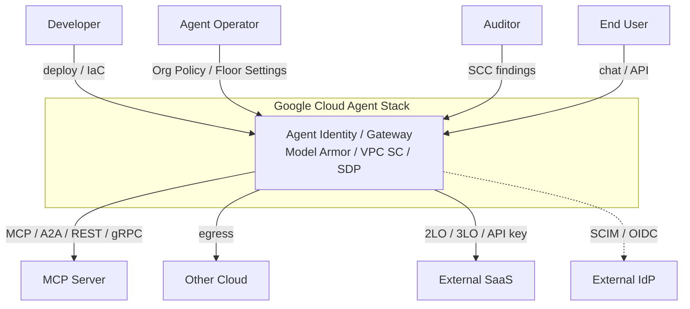
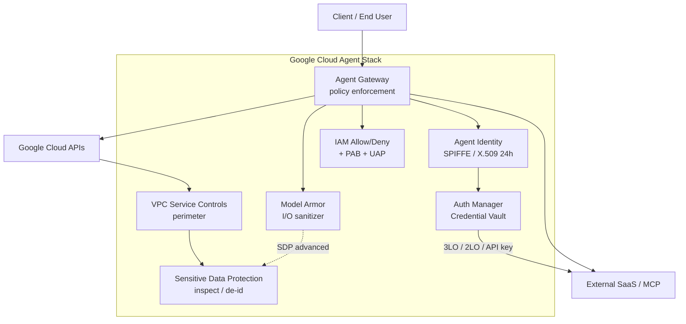
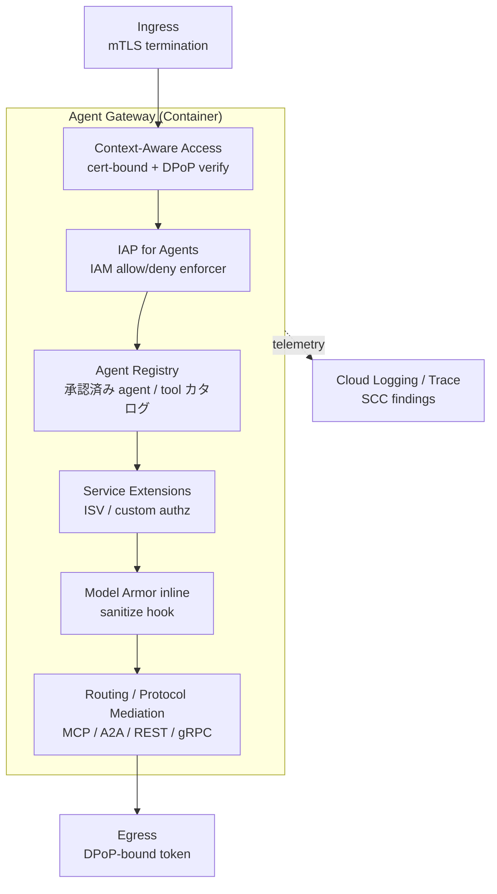
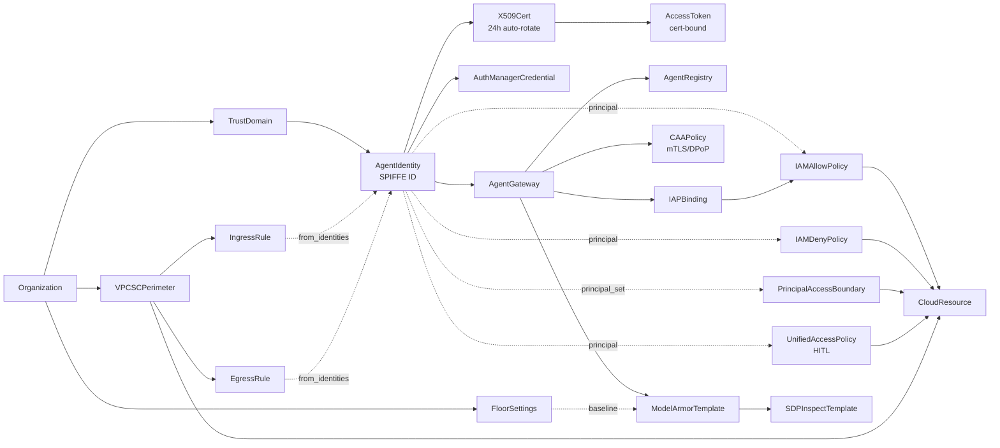
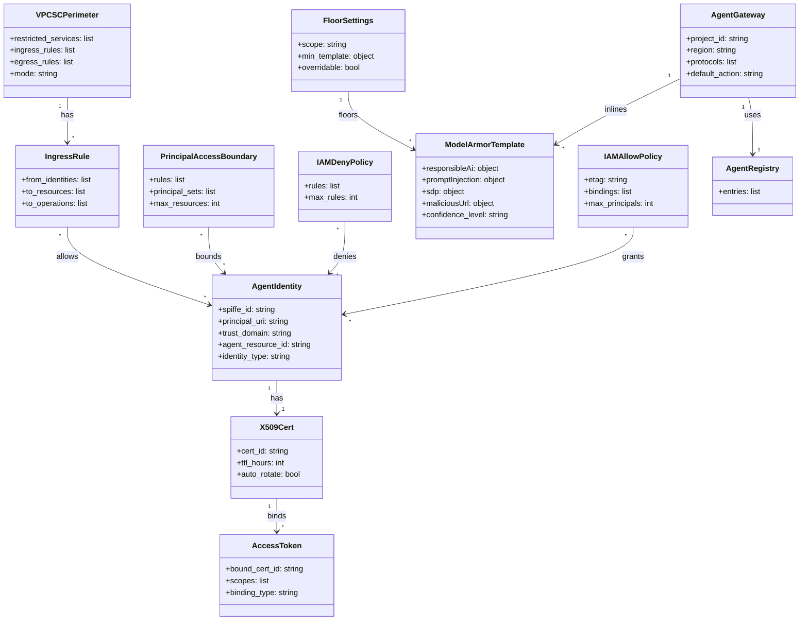

> 検証日: 2026-05-07 / 対象発表: Google Cloud Blog "What's new in IAM: Security, governance, and runtime defense" (2026-05-07)

## ■概要

Google Cloud は 2026-05-07 の Next '26 で、AI エージェントを **IAM の第一級主体（first-class principal）** として扱う一連の機能を発表しました。Agent Identity / Agent Gateway / Model Armor / VPC Service Controls / Sensitive Data Protection を組み合わせ、認証・認可・実行時防御を 1 スタックで提供する設計です。

従来エージェントは「サービスアカウント（SA）を使い回す」運用が一般的でしたが、なりすまし可能・長期キー発行可能・複数ワークロードでの共有という性質が、最小権限化と監査の障害になっていました。本スタックは SPIFFE 準拠の Agent Identity（1 エージェント = 1 ID + 24h 有効の X.509 証明書、長期キー発行不可、impersonation 不可）を発行し、これを Google IAM の Allow/Deny ポリシー、Principal Access Boundary（PAB）、VPC SC ingress/egress ルールの主体として直接記述できます。

構成は `Identity → Gateway → Content → Perimeter → Data` の 5 段重ねです。Agent Gateway は agent-to-agent / agent-to-tool トラフィックを集中させ、Agent Registry に未登録の宛先をデフォルト拒否します。Model Armor が prompt injection / tool poisoning / 機微データ漏洩 / 有害 URL を inline で検査し、VPC SC が境界跨ぎのデータ持ち出しを阻止します。

採用判断のキーポイントは 3 つあります。

| #   | 留意事項                                                                                                                                                                                                             |
| --- | -------------------------------------------------------------------------------------------------------------------------------------------------------------------------------------------------------------------- |
| 1   | Agent Identity for Agent Runtime と IAM Allow/Deny のみ GA。Agent Gateway は Private Preview、PAB / VPC SC × Agent Identity / Model Armor LangChain 連携は Preview、Unified Access Policy（HITL 承認）は Coming Soon |
| 2   | Agent Gateway は VPC Service Controls をサポートしないと公式に明記。Gateway 経由の通信に VPC SC perimeter は適用されないため、両者を同一経路で同時に効かせる構成は成立しません                                       |
| 3   | Model Armor は LLM Guardrail の原理的バイパス耐性（emoji smuggling / Unicode 操作など）を内包するため、prompt injection の決定打ではなく多層化前提で組む必要があります                                               |

## ■特徴

- **Agent Identity = SPIFFE 準拠の第三主体**: `principal://...system.id.goog/...` 形式。デフォルト非共有、impersonation 不可、長期 SA キー発行不可。X.509 は 24h 自動ローテートし、アクセストークンは証明書バインドで token theft を阻止します。Agent Runtime 向けは GA、Gemini Enterprise Agent Platform 向けは Preview です
- **Agent Gateway によるトラフィック集中**: agent-to-agent / agent-to-tool トラフィックを通し（client-to-agent モードは Agent Runtime のみで利用可、Gemini Enterprise 側では非対応）、Agent Registry に未登録の宛先はデフォルト拒否します。MCP / A2A / REST / gRPC をプロトコル中立で扱い、Regional スコープ（Agent Runtime と同 project / region に配置）。Private Preview / SLA なし
- **4 種のポリシーで Allow / Deny / 境界 / HITL を分離**: IAM Allow/Deny for Agent Identity（GA）、Principal Access Boundary（Preview）、Unified Access Policy（HITL 内蔵 / Coming Soon）、Custom Org Policies（130+ プロダクト / GA）。Allow ポリシーは 1 policy あたり最大 1,500 principals、Deny は 1 リソースあたりに付与可能な deny policy / rule 数の上限が 500 です（公式 IAM Quotas より）
- **Auth Manager がクレデンシャルボールト（Preview）**: 3-legged OAuth / 2-legged OAuth / API key / HTTP Basic を agent SPIFFE ID に紐づけ、外部ツール代理アクセスを可視化・取り消し可能にします
- **Model Armor は model-agnostic な LLM I/O 検査**: Vertex AI / Gemini に限らず、Anthropic / OpenAI モデル前段でも利用できます。RAI（CSAM 常時有効）/ prompt injection / jailbreak / SDP 連携 / 有害 URL（プロンプト・応答内の最初の 40 URL を検査）/ 文書スキャン（PDF・CSV・DOCX 等、4 MB/req）。Agent Gateway / Agent Runtime / MCP / Apigee / GKE / Firebase に inline、LangChain は Preview
- **Floor settings で組織横断ベースライン強制**: 組織/フォルダ/プロジェクト単位で「全テンプレートが少なくともこの閾値以上」を上書き不能で固定可能。プラットフォームチームと開発チームの責務分離を IAM 構造でサポートします
- **VPC Service Controls × Agent Identity（Preview）**: ingress/egress の `from.identities` に SPIFFE principal を直接書けます。これにより「特定エージェントだけ境界内 BigQuery への ingress を許可」のように、Google Cloud サービス境界の入出をエージェント単位で記述できます（VPC SC は Google Cloud サービス境界の制御であり、外部 SaaS への egress 許可は対象外）。VPC SC violation analyzer も同時に新規発表されました
- **Sensitive Data Protection（旧 Cloud DLP / GA）**: 150+ infoType + custom regex/dictionary。Model Armor の advanced mode から template 参照で再利用できます。content method は $3.00/GB と高単価のため、大量 I/O は Model Armor inline 経由のほうが経済的です
- **HITL をポリシーで強制可能（Coming Soon）**: Unified Access Policy が tool / API / resource を Agent Identity / 効果 / 操作 / 条件で粒度制御し、機微アクションに人間承認を必須化できます

## ■構造

### ●システムコンテキスト図

Google Cloud Agent Stack を中央に置き、運用に関わるアクターと外部システムを描きます。Stack は「誰が（Agent Identity）→ どこを通って（Agent Gateway）→ 何を渡したか（Model Armor）→ どこへ持ち出すか（VPC SC）」の 4 関心事を 1 つの境界として束ねます。



| 要素                     | 役割                                                                                                          |
| ------------------------ | ------------------------------------------------------------------------------------------------------------- |
| Developer                | エージェント開発者。`identity_type: AGENT_IDENTITY` でデプロイし、Model Armor template / Allow ポリシーを定義 |
| Agent Operator           | プラットフォーム運用。Org Policy、Floor Settings、Agent Registry、PAB を管理                                  |
| Auditor                  | セキュリティ／コンプライアンス。SCC findings、VPC SC violation analyzer、Agent Security Dashboard をレビュー  |
| End User                 | エージェント利用者。Agent Gateway 経由でエージェントを呼び、3LO で代理権限を委譲                              |
| Google Cloud Agent Stack | 本システム。エージェントの ID 発行 / 通信仲介 / I/O 検査 / 境界制御を一体提供                                 |
| MCP Server               | 外部ツール基盤。Agent Registry に登録されたものだけ通る                                                       |
| Other Cloud              | 外部実行環境。VPC SC egress / Agent Gateway で制御                                                            |
| External SaaS            | エージェントの作業対象。Auth Manager がクレデンシャルを保持                                                   |
| External IdP             | 人間 ID 連携。Workforce Identity Federation 経由                                                              |

### ●コンテナ図

Stack を 7 コンテナに分解します。



| コンテナ                      | GA / Preview                                      | 主機能                                                                                                    |
| ----------------------------- | ------------------------------------------------- | --------------------------------------------------------------------------------------------------------- |
| Agent Identity                | GA（Agent Runtime）/ Preview（Gemini Enterprise） | SPIFFE 準拠の暗号学的 ID、24h 自動更新の X.509、token を証明書にバインド                                  |
| Auth Manager                  | Preview                                           | API key / OAuth client / 3LO トークンを agent SPIFFE ID 名義で保管・委譲・取消                            |
| Agent Gateway                 | Private Preview                                   | agent-to-agent / agent-to-tool トラフィックを集中、未登録先デフォルト拒否、MCP / A2A / REST / gRPC を仲介 |
| IAM（Allow/Deny + PAB + UAP） | Allow/Deny GA、PAB Preview、UAP Coming Soon       | SPIFFE principal を IAM の評価対象に。3 段評価（PAB → Deny → Allow）、UAP は HITL も組込み可              |
| Model Armor                   | GA、LangChain Preview                             | プロンプトインジェクション、ジェイルブレイク、機微データ、有害 URL、RAI を sanitize API で検査            |
| VPC Service Controls          | GA、Agent Identity 連携 Preview                   | ingress/egress に Agent Identity を直接記述可（Preview）                                                  |
| Sensitive Data Protection     | GA                                                | 150+ infoType の検査・de-identification。Model Armor advanced から template を再利用可                    |

### ●コンポーネント図

Agent Gateway をドリルダウンします。Gateway 自身は IAM permission を露出せず、認可判定を IAP for Agents / CAA / Service Extensions に委譲する分離設計です。



| コンポーネント               | 役割                                                                                                           |
| ---------------------------- | -------------------------------------------------------------------------------------------------------------- |
| Ingress（mTLS termination）  | クライアント／上流 agent からの mTLS を終端し、検証済みプリンシパルを内部に渡す                                |
| IAP for Agents               | IAM allow/deny を Agent Registry インスタンスにバインドして強制（Preview）                                     |
| Context-Aware Access         | 証明書バインドトークン + DPoP proof を検証（Preview）                                                          |
| Service Extensions           | ISV 製品やカスタム認可ロジックの差し込み点。Cisco AI Defense、Palo Alto Prisma AIRS、Zscaler AI Guard 等と接続 |
| Agent Registry               | 承認済み agent / tool / MCP の中央カタログ。未登録宛先はデフォルト拒否                                         |
| Model Armor inline           | I/O 検査の透過挿入。コード変更なしで sanitize API を適用                                                       |
| Routing / Protocol Mediation | MCP / A2A / REST / gRPC の相互変換。Agent Runtime と同 project / region 必須                                   |
| Egress（DPoP-bound）         | mTLS は Gateway で終端済みのため、cert binding は DPoP で継承                                                  |
| Cloud Logging / Trace + SCC  | 観測 / 監査。violation analyzer の入力にもなる                                                                 |

## ■データ

### ●概念モデル



| 概念                    | 説明                                                                                                                                                     |
| ----------------------- | -------------------------------------------------------------------------------------------------------------------------------------------------------- |
| Organization            | GCP 組織。TrustDomain、FloorSettings、PAB、VPCSCPerimeter のスコープ起点                                                                                 |
| TrustDomain             | SPIFFE 信頼ドメイン。組織レベル `agents.global.org-{ORG_ID}.system.id.goog` / プロジェクトレベル `agents.global.project-{PROJECT_NUMBER}.system.id.goog` |
| AgentIdentity           | SPIFFE 準拠の first-class principal。`principal://...` で IAM 主体として参照                                                                             |
| X509Cert                | Agent に自動発行される 24h 有効の X.509。Google が継続更新                                                                                               |
| AccessToken             | X.509 証明書に暗号学的にバインドされたトークン。token theft を防止                                                                                       |
| AuthManagerCredential   | Auth Manager が保管する OAuth client / API key / 3-legged user token                                                                                     |
| IAMAllowPolicy          | role-based bindings。1 policy あたり最大 1,500 principals                                                                                                |
| IAMDenyPolicy           | deny rules。1 リソースあたり最大 500                                                                                                                     |
| PrincipalAccessBoundary | エージェントが「絶対にアクセスできない領域」を組織横断で固定（Preview）                                                                                  |
| UnifiedAccessPolicy     | tool / API / resource をまとめて条件付き制御。HITL 承認を組込み可（Coming Soon）                                                                         |
| AgentGateway            | エージェントトラフィックの集中ポイント。デフォルト deny                                                                                                  |
| AgentRegistry           | 承認済みエージェント / ツールの中央カタログ                                                                                                              |
| IAPBinding              | Identity-Aware Proxy for Agents。Agent Registry インスタンスに Allow/Deny を紐づける                                                                     |
| CAAPolicy               | Context-Aware Access for Agents。mTLS / DPoP で証明書バインドを検証                                                                                      |
| ModelArmorTemplate      | LLM I/O 検査テンプレート。RAI / PromptInjection / SDP / MaliciousURL の 4 大カテゴリ                                                                     |
| FloorSettings           | 組織/フォルダ/プロジェクト単位で「全テンプレートが少なくともこの閾値以上」を強制                                                                         |
| SDPInspectTemplate      | Sensitive Data Protection の検査テンプレート                                                                                                             |
| VPCSCPerimeter          | データ漏洩境界。restricted services / ingress / egress / access levels を保持                                                                            |
| IngressRule             | 境界外 principal が境界内リソースを呼ぶための許可ルール                                                                                                  |
| EgressRule              | 境界内 principal が境界外リソースを呼ぶための許可ルール                                                                                                  |

### ●情報モデル



設計上の重要な天井をまとめます。

| 制約                                      | 値                     | 影響                                               |
| ----------------------------------------- | ---------------------- | -------------------------------------------------- |
| IAMAllowPolicy.bindings[].members         | <= 1,500 / policy      | 大規模エージェント群では principal grouping が必須 |
| IAMDenyPolicy.rules                       | <= 500 / resource      | リソース粒度での deny 細分化に上限あり             |
| PrincipalAccessBoundary.rules[].resources | <= 500 / policy        | 組織横断「禁則」枠の天井                           |
| X509Cert.ttl_hours                        | 24（固定）             | 即時 revoke API は overview 未記載                 |
| ModelArmor document size                  | <= 4 MB / request      | RAG 大文書は分割が必要                             |
| ModelArmor URL scan                       | 先頭 40 URL のみ       | 応答内 URL の上限スキャン件数                      |
| AgentGateway instance                     | 1 / (project × region) | Gateway は regional scope                          |

## ■構築方法

### ●前提条件

- Organization ID / Project / Region（Agent Engine 対応リージョン）
- 必要な IAM ロール（プロジェクト編集権限、IAM admin、Org policy admin）
- Pre-GA Offerings Terms への同意（Preview 機能利用時）

### ●Step 1. Agent Identity を有効化してエージェントをデプロイ

Agents CLI の例（公式記載に整合）です。

```bash
gcloud agents engines deploy my-test-agent \
  --location=us-central1 \
  --identity-type=AGENT_IDENTITY \
  --source=./my_agent
```

Python SDK 例（公式 SDK ドキュメントには `identity_type` を直接指定するサンプルが現時点で見当たらないため概形。実装時は最新の Vertex AI / Agent Engine SDK ドキュメントを参照してください）。

```python
# 概形 — 公式 SDK のフィールド名・パスは要確認
from google.cloud import aiplatform_v1beta1 as aiplatform

client = aiplatform.ReasoningEngineServiceClient()
client.create_reasoning_engine(
    parent="projects/PROJECT_ID/locations/us-central1",
    reasoning_engine={
        "display_name": "my-test-agent",
        "spec": {"identity_type": "AGENT_IDENTITY"},
    },
)
```

デプロイ後、SPIFFE ID は次の形式で発行されます。

```
principal://agents.global.org-ORG_ID.system.id.goog/resources/aiplatform/projects/PROJECT_NUMBER/locations/us-central1/reasoningEngines/my-test-agent
```

### ●Step 2. IAM Allow / Deny ポリシーで SPIFFE principal を許可

Allow binding の例（BigQuery への読み取りを許可）です。

```bash
gcloud projects add-iam-policy-binding PROJECT_ID \
  --member="principal://agents.global.org-ORG_ID.system.id.goog/resources/aiplatform/projects/PROJECT_NUMBER/locations/us-central1/reasoningEngines/my-test-agent" \
  --role="roles/bigquery.dataViewer"
```

Deny ポリシー YAML の例です。

```yaml
displayName: deny-prod-secrets-for-test-agents
rules:
  - deniedPrincipals:
      - "principal://agents.global.org-ORG_ID.system.id.goog/..."
    deniedPermissions:
      - "secretmanager.versions.access"
    resources:
      - "//secretmanager.googleapis.com/projects/PROD_PROJECT/secrets/*"
```

### ●Step 3. Model Armor Template + Floor Settings

プロジェクトレベルのテンプレート YAML 例です。

```yaml
filterConfig:
  responsibleAiSettings:
    rai_settings:
      filters:
        - filter_type: HATE_SPEECH
          confidence_level: MEDIUM_AND_ABOVE
        - filter_type: SEXUALLY_EXPLICIT
          confidence_level: LOW_AND_ABOVE
  piAndJailbreakFilterSettings:
    filter_enforcement: ENABLED
    confidence_level: MEDIUM_AND_ABOVE
  sdpSettings:
    basicConfig:
      filter_enforcement: ENABLED
  maliciousUriFilterSettings:
    filter_enforcement: ENABLED
```

組織レベルの Floor Settings は次のように適用します（公式の `gcloud model-armor` サブコマンドの正確なフラグ体系は未確認のため、以下は概形です。実適用時は `gcloud model-armor --help` または公式ドキュメントで最新の構文を確認してください）。

```bash
# 概形 — フラグ名は要確認
gcloud model-armor floor-settings update \
  --organization=ORG_ID \
  --min-template=projects/SECURITY_PROJECT/locations/us/templates/baseline
```

### ●Step 4. （Preview）VPC Service Controls × Agent Identity

Agent Identity を ingress に直接書ける Preview 機能です。

```yaml
status:
  resources: ["projects/DATA_PROJECT"]
  restrictedServices: ["bigquery.googleapis.com"]
  ingressPolicies:
    - ingressFrom:
        identityType: ANY_IDENTITY
        identities:
          - "principal://agents.global.org-ORG_ID.system.id.goog/.../my-test-agent"
      ingressTo:
        operations:
          - serviceName: bigquery.googleapis.com
        resources: ["*"]
```

dry-run で適用してから enforced へ昇格します。

```bash
gcloud access-context-manager perimeters dry-run create-policy ...
gcloud access-context-manager perimeters dry-run enforce ...
```

### ●Step 5. （Private Preview）Agent Gateway 申請とセットアップ

公開申請後、Service Agent ロール（`roles/agentgateway.serviceAgent`）が自動付与され、Agent Registry に承認済みエージェント / ツールを登録すると、未登録の宛先は default deny されます。

## ■利用方法

### ●エージェント自身の身元で Cloud リソースを呼ぶ

ADC（Application Default Credentials）が SPIFFE 証明書を解決します。

```python
from google.cloud import bigquery

client = bigquery.Client()
for row in client.query("SELECT 1").result():
    print(row)
```

### ●3-legged OAuth でユーザー代理で外部 API を呼ぶ

Auth Manager 経由のフローです（公式記載不在のため概形）。

```python
auth_manager.start_consent(user_id="user@example.com", scopes=["calendar.readonly"])
# ユーザー consent 後
token = auth_manager.exchange_code(code)
auth_manager.call_on_behalf(token, endpoint="https://www.googleapis.com/calendar/v3/...")
```

### ●Model Armor の sanitize API を呼ぶ

```bash
curl -X POST \
  -H "Authorization: Bearer $(gcloud auth print-access-token)" \
  -H "Content-Type: application/json" \
  https://modelarmor.googleapis.com/v1/projects/PROJECT/locations/us/templates/TEMPLATE_ID:sanitizeUserPrompt \
  -d '{"userPromptData": {"text": "ユーザー入力"}}'
```

### ●LangChain integration で inline 検査（Preview）

```python
from langchain_google_modelarmor import ModelArmorGuardrail
guardrail = ModelArmorGuardrail(template="projects/PROJECT/locations/us/templates/T")
chain = prompt | guardrail | llm | guardrail | parser
```

## ■運用

### ●監査・可視化

| 監査ソース                          | 主な用途                                                        |
| ----------------------------------- | --------------------------------------------------------------- |
| Cloud Logging                       | エージェントの認可決定、Allow/Deny ヒット、Model Armor 検出ログ |
| Cloud Trace                         | エージェント呼び出しの分散トレース                              |
| VPC SC violation analyzer           | 境界違反のサンプリングと回帰検知                                |
| Agent Security Dashboard（Preview） | Gemini Enterprise Agent Platform 配下の集中可視化               |
| ISV 連携                            | CrowdStrike Falcon AIDR、Exabeam、Palo Alto による行動分析      |

Cloud Logging クエリ例です。

```sql
resource.type="aiplatform.googleapis.com/ReasoningEngine"
protoPayload.authenticationInfo.principalSubject=~"^principal://agents\.global\."
severity>=WARNING
```

### ●ローテーション・ライフサイクル

- X.509 証明書は 24h で自動ローテートされ、Google が継続更新します
- Agent Runtime インスタンスを削除すると identity も自動で削除されます
- Allow 1,500 / Deny 500 の上限到達前に principal grouping を導入してください

### ●コスト管理

- SDP の content method は $3.00/GB と高単価です。大量 I/O は Model Armor inline 経由で SDP テンプレートを参照する構成が経済的です
- Model Armor の公式 pricing ページは 2026-05-07 時点で取得できないため、見積もりは Sales 経由の確認が無難です

## ■ベストプラクティス

### ●Meta Agents Rule of Two を上位設計に置く

Private data / Untrusted content / External communication の 3 要素のうち、エージェントが同時に持てるのは最大 2 つに制限します。Filter ベースだけで止める設計は、emoji smuggling 等のバイパスで容易に破られるためです。

### ●PAB を「絶対の外殻」として先に設定する

Allow ポリシーが肥大しても、PAB が境界を保持します。組織レベルで「絶対に触れない資源」を先に固定してください。

### ●HITL を高リスク操作に組み込む（UAP 待ちの間）

UAP の GA を待たずに、Cloud Workflows / Approval-as-a-Service 等で機微操作の人間承認フローを先行実装します。

### ●Model Armor 単独に頼らない

確率的検知器の限界を前提に、tool 実行前後に独立した sanity check（LLM-as-a-judge など）を別レイヤで実装します。

### ●Floor Settings で組織最低ラインを強制する

開発チームに Template 編集を委譲しつつ、Floor Settings で「これ以下の設定は不可」を上書き不能で固定すると、ガバナンスとアジリティを両立できます。

### ●OpenFGA / Cedar との二重管理を避ける

クロスクラウド要件があるなら、認可決定の master を Google IAM か OpenFGA かを最初に固定します。両方で書くと整合性ずれが起きます。

### ●VPC SC は dry-run → enforced の段階展開

production の境界をいきなり enforced に切り替えると、エージェントの呼び出しが大規模に遮断されます。dry-run でログを蓄積し、violation analyzer で十分検証してから enforced に切り替えてください。

## ■トラブルシューティング

### ●Agent Gateway × VPC SC が両立しない

- 症状: Agent Gateway 経由のトラフィックに VPC SC perimeter のルールが適用されず、想定したデータ境界が効かない
- 原因: 公式仕様で「Agent Gateway は VPC Service Controls をサポートしない」と明記されており、Gateway 経由の経路は perimeter の制御対象外
- 回避策: Gateway を使う経路と VPC SC 境界が必要な経路をエージェント種別で分離。データ境界優先のワークロードは Gateway を介さず Allow ポリシー + Model Armor inline + VPC SC ingress/egress（Agent Identity 連携、Preview）で組む

### ●Allow / Deny ポリシーが 1,500 / 500 上限に到達

- 症状: principal の追加が拒否される
- 原因: IAM Allow は 1 policy あたり 1,500 principals、Deny は 1 リソースあたり 500 ルールが上限
- 回避策: principal を group で集約する、Deny は条件式で集約する、PAB で組織横断の禁則を分離する

### ●legacy bucket roles が付与できない

- 症状: `storage.legacyBucketReader/Writer/Owner` を Agent Identity に付与しようとして失敗
- 原因: 公式に「Agent Identity に付与不可」と記載
- 回避策: 細粒度の `storage.objectViewer` / `storage.objectAdmin` 系ロールに置き換える

### ●Model Armor が prompt injection を素通しする

- 症状: emoji smuggling / zero-width 文字 / 多段リダイレクトされた prompt がブロックされない
- 原因: 確率的検知器の構造的限界（arXiv:2504.11168 で複数 Guardrail に対し最大 100% bypass を報告）
- 回避策: Rule of Two で Scope を絞る、tool 実行前後の独立 sanity check、PAB で機密リソースを切り離す

### ●Cloud Run functions の build phase が VPC SC perimeter 外

- 症状: Cloud Run のビルド時に外部リポジトリへのアクセスがブロックできない
- 原因: Cloud Run functions の build phase は VPC SC 対象外
- 回避策: ビルド成果物のレジストリを perimeter 内 Artifact Registry に集約、ベースイメージを内部ミラーする

### ●Cloud Shell が perimeter 外で誤った許可

- 症状: Cloud Shell で人間ユーザーが境界内リソースに直接アクセスできてしまう
- 原因: Cloud Shell は VPC SC perimeter の外側にある
- 回避策: 管理者操作は IAP-secured workstation か bastion を使う、Cloud Shell の利用を Org Policy で制限する

## ■まとめ

Google Cloud の 2026-05-07 発表は、AI エージェントを SPIFFE 準拠の第一級主体として扱う「Identity → Gateway → Content → Perimeter → Data」の 5 段重ね多層防御を整えた点が中核です。GA は Agent Identity for Agent Runtime と IAM Allow/Deny に限られ、Agent Gateway / PAB / VPC SC × Agent Identity / UAP は Preview か Coming Soon、また Agent Gateway × VPC SC は両立しないなど構成的制約も明確なため、本番採用は層の優先度を方針化したうえで段階的に進めるのが安全です。

この記事が少しでも参考になった、あるいは改善点などがあれば、ぜひリアクションやコメント、SNSでのシェアをいただけると励みになります！

## ■参考リンク

### Google Cloud 公式
- [What's new in IAM: Security, governance, and runtime defense (Blog 2026-05-07)](https://cloud.google.com/blog/products/identity-security/whats-new-in-iam-security-governance-and-runtime-defense/)
- [Introducing Agent Gateway ISV ecosystem for security and governance (Blog 2026-05-06)](https://cloud.google.com/blog/products/identity-security/introducing-agent-gateway-isv-ecosystem-for-security-and-governance)
- [Agent Identity overview (IAM)](https://docs.cloud.google.com/iam/docs/agent-identity-overview)
- [Use Agent Identity with Agent Runtime](https://docs.cloud.google.com/gemini-enterprise-agent-platform/scale/runtime/agent-identity)
- [Agent Gateway overview](https://docs.cloud.google.com/gemini-enterprise-agent-platform/govern/gateways/agent-gateway-overview)
- [IAP for Agents](https://docs.cloud.google.com/iap/docs/agent-overview)
- [Context-Aware Access for Agents](https://docs.cloud.google.com/access-context-manager/docs/caa-agent-security)
- [IAM Policy types](https://docs.cloud.google.com/iam/docs/policy-types)
- [Principal Access Boundary policies](https://docs.cloud.google.com/iam/docs/principal-access-boundary-policies)
- [Model Armor overview](https://docs.cloud.google.com/model-armor/overview)
- [VPC Service Controls overview](https://docs.cloud.google.com/vpc-service-controls/docs/overview)
- [Sensitive Data Protection overview](https://docs.cloud.google.com/sensitive-data-protection/docs/sensitive-data-protection-overview)

### 標準・規格・ガイダンス
- [SPIFFE 公式](https://spiffe.io/)
- OWASP Top 10 for Agentic Applications 2026
- NIST AI Agent Standards Initiative (2026-02 開始)
- CSA Agent Access Management (2026-05-05)

### 反証・批判
- arXiv:2504.11168 — Guardrail bypass via emoji smuggling / zero-width chars (2025)。Azure Prompt Shield / Meta Prompt Guard / Protect AI 等を対象にした評価で、Model Armor 自体を直接評価した論文ではない点に注意
- Simon Willison — "Lethal Trifecta"
- Meta — "Agents Rule of Two"

### 競合ベンダー
- AWS Bedrock AgentCore Identity (2025-10 GA)
- Microsoft Entra Agent ID (2026-05-01 GA)
- AWS MCP Server GA (2026-05-06)
