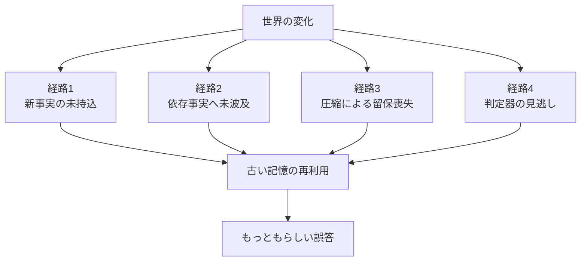
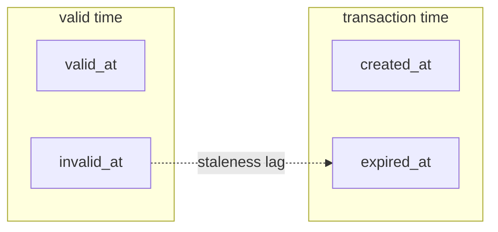
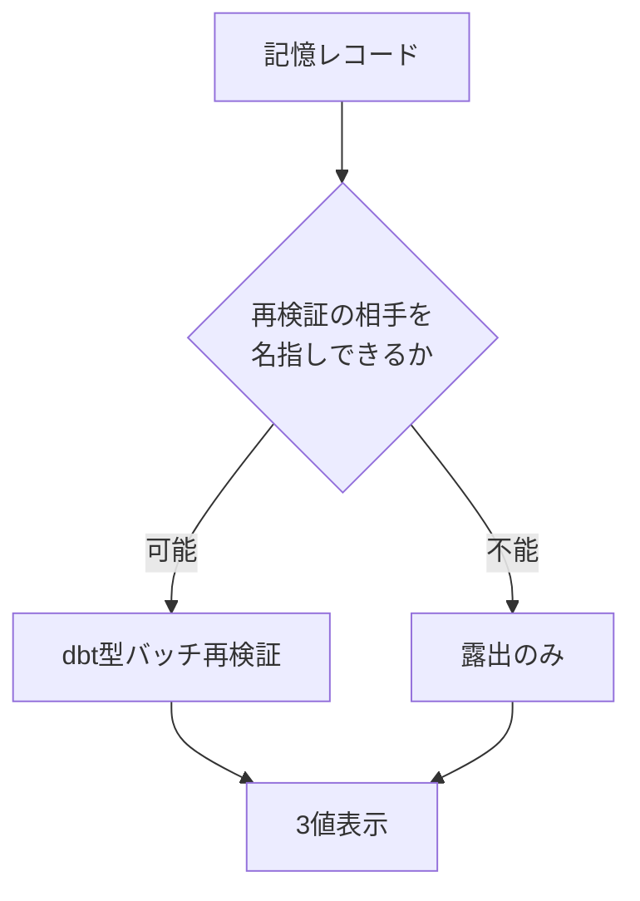

> 検証日: 2026-07-20 / 対象読者: 実装エンジニア・LLMOps・エージェント基盤設計者
> 起点: [AIエージェントを9ヶ月運用してわかった、記憶システムの敵は検索精度ではなく鮮度だった](https://zenn.dev/leoaido/articles/af148bac02e385) (Leo Huang, 2026-07-19)

## 概要

長期運用するエージェントの記憶は、想起できなくなるのではなく、**想起できるまま間違いになります**。書いた時点では正しかった事実が、環境の変化で静かに嘘へ変わります。起点記事はこれを 9 ヶ月の運用から「敵は検索精度ではなく鮮度」と表現しました。

本記事はこの問いを一般化し、既存の記憶プロダクト・学術研究・隣接分野の確立解を一次ソースで調べた結果をまとめます。出発点の仮説は「記憶レコードに鮮度メタデータを持たせ、能動的な再検証ループを設計すべき」でした。**この仮説は反証調査を通して変質しました。**

結論は 3 つです。

| 結論 | 内容 |
|---|---|
| 1. 失敗モードの実在 | 鮮度の劣化は実在。ただし「検索精度より重要」かは未確立 |
| 2. 既存実装の共通空白 | 矛盾解決はすべて受動的。正常動作していても鮮度事故が発生 |
| 3. 投資先の転換 | メタデータと能動的再検証は銀の弾丸ではない。投資先は検出ではなく露出 |

3 番目が本記事の主張であり、反直感的な含意を持ちます。**起点記事の素朴な Markdown 運用は、最先端の構造化解より壊れにくい部分を突いています。** ただし後述するとおり、これは規模に依存します。

## 特徴

鮮度の劣化という失敗モードは、次の 5 つの性質を持ちます。これが「静かに」進む理由でもあります。

### 1. 想起の失敗とは検出のされ方が正反対

| 観点 | 想起の失敗 | 鮮度の劣化 |
|---|---|---|
| 症状 | 思い出せない状態 | 自信を持って古い答えを返す状態 |
| 検出 | ユーザーが即座に気づく | **誰も気づかない** |
| 出力の見た目 | 明らかに不完全 | 流暢で、もっともらしい |
| 修復の起点 | 失敗の観測 | 観測されないため起点なし |

### 2. 追記型ストアでは検索が当たりすぎて古い方を掴む

起点記事の設計ルールのうち理論的な芯は「追記ではなく上書き」にあります。追記型では同一事実の v1 と v2 が両方インデックスに残り、検索が**両方をヒットさせます**。モデルはそこから古い方を選びます。

つまりこれは「検索が当たらない」問題ではなく「**当たりすぎる**」問題です。検索精度の改善では解けません。

### 3. 表面的な検証は通過する

知識編集の研究がこれを定量化しています。RippleEdits (TACL 2024, arXiv:2307.12976) では、編集した事実に対する検証タスクの成功率が大きく乖離します。

| 検証タスク | 成功率 | 意味 |
|---|---|---|
| Subject Aliasing | ≥86.8% | 更新が効いているように見える状態 |
| Preservation | 97.6–100% | 副作用が無いように見える状態 |
| **Logical Generalization** | **15.2–27.2%** | **依存事実が古いまま残る状態** |

数値は RippleEdits の Recent サブセット、ROME/MEMIT です。arXiv:2407.12828 は「直接編集は 90% 超成功するのに、波及成功率は最易タスクですら 50% 超えに苦戦」と整理しています。

**更新した記憶に直接問い合わせる検証では、必ず見逃します。** 依存グラフを辿る検証でなければ検出できません。

### 4. 圧縮が劣化の方向を持つ

長期運用では必ずコンテキスト圧縮を通ります。圧縮は情報を一様に減らすのではなく、**留保・出典・時点を選択的に落として、残った主張の確信度を上げます**。

| 圧縮で落ちやすいもの | 実測 | 強度 |
|---|---|---|
| ヘッジ (確信度の標識) | 確信度の歪みが最大 75% の出力に発生。確信度が上がる方向へ 1.5–2.0 倍の非対称 | プレプリント |
| standing rule / ポリシー | 違反率 0% → 30% (最大 59%)、反復 4 巡で 78% | プレプリント |
| 留保・条件・比較 | context 比率 25% → 9% | プレプリント |
| 時制 | past→present 変換 11.5–21.5%、逆方向は 4.0–8.5% | プレプリント |
| 一次証拠 (tool result) | Anthropic `clear_tool_uses` は既定で結果を消し呼び出しを残す仕様 | **公式仕様** |

最後の行が象徴的で、**証拠が先に落ちて結論が残る**構造になっています。

加えて Anthropic 既定の compaction 要約プロンプトが保持対象に挙げる 5 項目 (タスク・状態・発見・次手・選好) に、**時刻・出典・確信度は含まれません**。これは作業継続に必要な情報であり、検証可能性に必要な情報ではありません。さらに要約は "as if it were the original conversation history" として扱われます。つまり**要約由来であるというマークが付きません**。

査読済みの傍証もあります。LongMemEval (arXiv:2410.10813) の Appendix B は、ChatGPT が情報を記録した後、**履歴圧縮の過程で内容を改変する**と報告しています。

### 5. 既存の指標が捕捉しない

- 圧縮後の要約は流暢かつ事実らしいまま下流の判断を反転 (判断反転率 33.0%、再読ノイズの床は 11.0%。プレプリント)
- 引用の表層品質が腐敗を隠蔽 (リンク到達性 94%+ / 関連性 80%+ に対し、ファクトチェック通過は 39–77%)
- 何が落ちたかの事後帰属が不能 (Anthropic API が返すのは件数のみ)

## 概念構造

### 鮮度が壊れる 4 つの経路



| 要素名 | 説明 |
|---|---|
| 世界の変化 | 仕様廃止・方針転換など、記録後に前提が変わる事象 |
| 経路1 新事実の未持込 | 誰も新しい事実を持ち込まず、受動的機構が起動しない状態。既存プロダクト共通の空白 |
| 経路2 依存事実へ未波及 | 新事実は入ったが、依存する事実が古いまま残る状態。知識編集研究の指摘 |
| 経路3 圧縮による留保喪失 | 圧縮で留保・出典・時点が落ち、確信度だけ上がる状態 |
| 経路4 判定器の見逃し | 判定器が矛盾を見逃し、検証済みの体裁が付く状態。能動的再検証の導入で新たに生まれる経路 |
| 古い記憶の再利用 | 古い事実が現行の前提として使われる状態 |
| もっともらしい誤答 | 流暢で、誰も気づかない誤答 |

### バイテンポラルモデル

鮮度を扱う最も構造化された既存解は、バイテンポラルなナレッジグラフです。Graphiti (getzep/graphiti) が 4 つのタイムスタンプを持ちます。



| 要素名 | 説明 |
|---|---|
| valid time | 世界の時間。事実そのものが真である期間 |
| valid_at | 事実が真になった時刻 |
| invalid_at | 事実が真でなくなった時刻 |
| transaction time | システムの時間。システムが認識していた期間 |
| created_at | システムが記録した時刻 |
| expired_at | システムが失効させた時刻 |
| staleness lag | 世界の変化からシステムの認識までの遅れ |

この 2 軸の分離から、**測れる指標**が 1 つ落ちてきます。

> **staleness lag = `expired_at` − `invalid_at`**
> = 世界が変わってから、システムが気づくまでの遅れ

鮮度を KPI 化する足がかりとして、バイテンポラル構造はこれを構造的に提供します。ただし Graphiti の実装自体には無視できない穴があります (後述)。

### キャッシュ無効化の 3 方式で空白を位置づける

エージェント記憶の空白は、キャッシュ理論の語彙で正確に名指しできます。

| 方式 | 上流の要否 | 既存記憶プロダクトの実装状況 |
|---|---|---|
| ① TTL 期限切れ | **不要** | **未実装** ← 空白の正体 |
| ② 書き込み時無効化 | 不要 | 全製品がこれのみ (受動的) |
| ③ 変更通知 | 必要 | 上流が無く成立せず |

**①は上流問題を解かずに実装できるのに、誰も実装していません。** これが「空白は研究課題ではなく移植課題である」という見立ての根拠です。

## 既存プロダクトはどこまで鮮度を扱うか

公式ドキュメントとソースコードで一次確認した結果です (2026-07-20 時点)。

| 製品 | 観測時刻 | 出典 | TTL / 失効 | 矛盾検出 | 再利用前の照合 |
|---|---|---|---|---|---|
| **Mem0** | ○ `timestamp` | △ `attributed_to` | ○ `expiration_date` | LLM | ✗ |
| **Letta** | ✗ | △ `Passage.file_id` | ✗ | LLM (プロンプトのみ) | ✗ |
| **Graphiti / Zep** | ◎ バイテンポラル 4 軸 | ◎ `episodes` | ✗ | LLM + Python 裁定 | ✗ |
| **Anthropic memory tool** | ✗ | ✗ | ✗ (推奨のみ) | ✗ | ✗ |
| **LangGraph / LangMem** | ○ `created_at` | ✗ | △ `TTLConfig` | ✗ | ✗ |
| **Cognee** | ○ | ◎ typed lineage 5 列 | ✗ | — | ✗ |

読み取れることは 3 つです。

### (1) 再利用前に現行状態と照合する機能が存在しない

これが本テーマの核心的空白です。

### (2) 確信度のフィールドが全製品で不在

各製品の数値スコアはすべて検索ランキング用です。Mem0 の `score` はベクトル類似度と BM25 とエンティティブースト、LangGraph の `score` はリランカ出力です。Mem0 のドキュメントは検索結果が "confidence scores" を含むと書いていますが、コードを読む限りこれは検索関連度であり、真偽の確信度ではありません。

象徴的なのは Zep の事例です。唯一 per-fact の数値評価を出荷していた **Fact Ratings は 2026 年 2 月に完全廃止**されました。しかもそれは真偽ではなくドメイン関連度の評価でした。一方 LangMem の内部プロンプトは、確信度を**自由文の中に書け**と指示しています。つまり業界の実践は「構造化しない」です。

### (3) 出典には 3 つの非等価な流儀が存在

| 流儀 | 例 | 検証可能性 |
|---|---|---|
| ソースエピソードへのポインタ | Graphiti `episodes` | **高** (元の発言に到達可能) |
| 取り込み元へのポインタ | Letta `Passage.file_id`, Cognee `source_pipeline` | 中 (由来ファイルのみ判明) |
| LLM が推定した発話者帰属 | Mem0 `attributed_to` | **低** (未検証の生成物) |

これらを混同すると設計を誤ります。

### LangGraph の TTL についての訂正

LangGraph の `TTLConfig` は既定で `refresh_on_read: true`、すなわち**読むたびに延命する LRU** として振る舞います。Anthropic の失効推奨も同じく最終アクセス基準です。

これは鮮度の尺度としては転倒しています。**よく参照される古い記憶ほど最も長生きする**からです。実際、RFC 9111 §4.2 は `age` を「オリジンサーバで生成された、または**検証に成功した**時点」からの経過と定義しており、最終アクセス基準はこの定義に該当しません。

ただし正確に言えば、**LangGraph に不足しているのはデフォルト値であって機能ではありません**。`refresh_on_read: false` を設定すれば書き込み基準の TTL になります。問題は「容量管理の TTL」と「鮮度の TTL」が同じ名前で提供され、既定が前者である点にあります。

### 構造があっても漏れる: Graphiti の実際

Graphiti はこの領域で最も構造化された実装ですが、無条件に推奨できる状態ではありません。

- **検索が失効エッジを既定で除外しない**。`search_results_to_context_string` は失効した事実も日付付きで LLM に渡し、自然文の指示で解釈を委任。`expired_at` / `created_at` は LLM に未到達
- **判定器が弱いと無言で劣化する**。Issue [#1666](https://github.com/getzep/graphiti/issues/1666) では、非 reasoning の小型モデルで矛盾検出が 15 件中 7 件まで崩壊 (reasoning フィールドの前置で 14/15 に回復)
- **時点クエリがコードに存在するがドキュメントに不在**。`SearchFilters` は 4 軸すべてに日付フィルタを持つが公式ページに言及なし。MCP 経由では as-of クエリが組めない
- **日付が取れない事実は矛盾しても永久に有効**のまま残存 (裁定ロジックが両側の `valid_at` を要求するため)
- 無効化パスのクラッシュ ([#920](https://github.com/getzep/graphiti/issues/920) / [#893](https://github.com/getzep/graphiti/issues/893))、`reference_time` の write-only 問題 ([#1661](https://github.com/getzep/graphiti/issues/1661)) が未解決

良い点として、矛盾検出が**ハイブリッド**である設計は評価できます。LLM が候補を返し、純 Python の `resolve_edge_contradictions` が時間区間で裁定します。LLM に無効化の可否まで決めさせていません。

### ベンチマーク数値の扱い

**この領域のベンチマーク主張は、確立した事実として引用できません。** 本記事が製品間の性能比較を提示しない理由でもあります。

- **Mem0 の LOCOMO 数値は 6 者以上が 14 ヶ月にわたり再現に失敗**しています ([#2800](https://github.com/mem0ai/mem0/issues/2800) / [#3667](https://github.com/mem0ai/mem0/issues/3667) / [#3789](https://github.com/mem0ai/mem0/issues/3789) / [#3943](https://github.com/mem0ai/mem0/issues/3943) / [#3944](https://github.com/mem0ai/mem0/issues/3944))。メンテナは論文の数値がクローズドなプラットフォーム機能に依存すると回答しており、論文記載のハイパーパラメータと評価スクリプトの実値の食い違いも指摘されています
- **Mem0 論文自身の Table 1 で、full-context ベースライン 72.90% が Mem0 の 66.88% を上回っています**
- Zep のベースライン評価が timestamp を落としていた疑いを**第三者が独立に確認**しています ([mem0#2967](https://github.com/mem0ai/mem0/issues/2967))。Zep 論文 (arXiv:2501.13956) はベンダー論文です

### 鮮度メタデータは取得自体が壊れうる

最も本テーマに刺さる実バグが [mem0#3944](https://github.com/mem0ai/mem0/issues/3944) にあります。2023 年のデータセット中のイベントに対し、Mem0 が「2026 年 1 月」を記録しました。**現在時刻を観測時刻として書き込む**症状です。

鮮度メタデータは「持たせれば安心」ではありません。

## 反証

反証専用の調査を通した結果、当初の推奨は**そのままでは支持できない**と分かりました。強い順に示します。

### 反証1: 起点記事自身が推奨設計を採用していない

起点記事の運用は、履歴を破棄する上書き方式です。修復の起点は「読んだときに食い違いに気づく」受動的トリガーです。定期的な能動再検証ループは**ありません**。それで 9 ヶ月・数百件が回っています。

つまり「能動的再検証を設計すべき」という結論は、起点記事の延長ではなく**その実践の否定**でした。この乖離を無視して結論を書くと、根拠にしている事例に結論が支持されていない状態になります。

### 反証2: 観測時刻は真である時刻を捕捉できない

ソフトウェア工学の実測が効きます。陳腐化した Stack Overflow 回答のうち、**58.4% は投稿された時点で既に陳腐でした** (arXiv:1903.12282, TSE 掲載)。

これが意味するのは、`observed_at` は「**捕捉した時刻**」であって「**真である時刻**」ではないということです。記録時に既に古い情報は、どれだけ正確なタイムスタンプを打っても新鮮に見えます。前述の mem0#3944 は、この問題が実装レベルでさらに悪化する例です。

同じ研究は、陳腐化が観測されても**更新されるのは 20.5% のみ**と示しています。メタデータ運用は続きません。

### 反証3: 再検証ループの心臓部が壊れている

これが最も重い反証です。LLM による矛盾検出の性能は、最良で 0.71、Llama-3.1-8B では **0.482** です (arXiv:2504.00180)。しかも失敗は **false negative 優位**、つまり矛盾を**見逃す**方向に偏ります。Graphiti の Issue #1666 は同じ現象の実地再現です。

含意は深刻です。能動的再検証を導入すると、古い記憶が「矛盾なし」と再確認され、**検証済みの体裁だけが付与されます**。前掲の概念図の経路 4 がこれにあたります。無検証よりも危険になりえます。

さらに圧縮の非対称性と組み合わせると、**圧縮も判定器も同じ方向、すなわち過剰な確信へ倒れます**。両者が false assurance を生みます。

### 反証4: TTL は原理的に決まらない

適切な TTL を事前に決められる事実は多くありません。DNS ですら「研究に裏付けられた設定指針は無い」とされ (IMC '19)、実測値は同一レコード種別で 1 分から 48 時間まで散らばります。エージェント記憶で扱う事実の寿命は、DNS レコードよりはるかに不均質です。

### 反証5: 鮮度が主要因という前提への反証

GroupMemBench (arXiv:2605.14498, プレプリント) の failure analysis では、**素の BM25 が 5 つの記憶システムのうち 4 つを上回り**、"memory systems tend to reduce rather than enhance" と明記されています。

ただし同論文の retrieval failure の定義は鮮度の失敗を内包しうるため、この反証は完全には直交しません。それでも、**「検索精度より鮮度」という起点記事の主張は、n = 数百件の単一実践者の観察に依拠している**点は意識すべきです。本記事は「長期記憶を保持するなら、鮮度は対処すべき失敗モードである」という条件付きの形でのみこれを採用します。

### 反証が見つからなかった論点

| 論点 | 調査結果 |
|---|---|
| ライセンスリスク | 不発。graphiti / mem0 / letta とも標準 Apache-2.0、再ライセンスの前例なし |
| バイテンポラルモデリングの実務負荷 | 不発。SCD Type 2 について Kimball はむしろ肯定的 |
| 過剰無効化のリスク | 不発。文献はむしろ逆方向を支持 |

## 隣接分野からの移植

空白を埋める設計は、エージェント記憶の外側に既にあります。**貫く軸は「再検証の相手を名指しできるか」** です。

| 分野 | 古さの定義 | 再検証の起動 | upstream |
|---|---|---|---|
| dbt source freshness | `loaded_at_field` からの経過 | バッチ (CI で失敗) | テーブルの実データ |
| HTTP キャッシュ | 生成または検証成功からの経過 | アクセス時 (条件付き) | オリジンサーバ |
| Renovate / Dependabot | 上流バージョンとの差分 | 変更通知 | パッケージレジストリ |
| **エージェント記憶** | **未定義** | **書き込み時のみ** | **なし** |

最下行が空白の正体です。転用可否は一貫して「その再検証が**何を呼ぶか名指しできるか**」で決まります。

### RFC 5861 から借りる 3 原則

HTTP の `stale-while-revalidate` は、レイテンシと鮮度のトレードオフを明示的に設計した数少ない例です。そのまま転用できる原則を 3 つ持ちます。

1. **鮮度は 2 値ではなく 3 値** (fresh / stale-servable / not-servable)
2. **stale を提供するときは明示する義務** (Age と warning の付与)
3. **stale の提供には上限**

注目すべき点として、2026 年 3 月以降に登場した小規模 OSS の 1 つ pi-mem は、`verified` / `stale` / `unverifiable` という 3 値に**独立に到達しています**。ただしこの領域の OSS はすべて 40★未満で、半数は作成日と最終 push が同じ放置状態にあり、デファクトは存在しません。

### dead man's switch

経路 1 に対する概念的な直接解は、監視分野の dead man's switch です。**イベントが来ないこと自体を検出する**ために設計された唯一の機構であり、記憶系とは独立した外部系に置く必要があります。自分の故障は自分で報告できないためです。

### 定量的な指針

- dbt: **チェック頻度 ≥ SLA の 2 倍**
- RFC 9111 §4.2.2: heuristic TTL として最終更新からの経過の約 10%

### 転用できない急所

HTTP の `304 Not Modified` に相当する**安価な再検証経路が記憶にはありません**。ゆえにアクセス毎の再検証は成立せず、dbt 型のバッチと Renovate 型の人手エスカレーションが現実解になります。

### 事実と推測の分離は既に成文化されている

「事実と推測を分ける」設計も、発明する必要はありません。

| 標準 | 内容 |
|---|---|
| **ICD 203** | 判断と根拠の分離、確信度の言語表現の標準化 |
| **Admiralty Code** | 情報源の信頼性と内容の信憑性を独立した 2 軸で評価 |
| **STIX 2.1** | 上記を機械可読なデータモデルへ翻訳。`confidence` を 0–100 で定義し、Admiralty Code / WEP / ICD 203 への規範的な対応表を保持。`observed-data` / `indicator` / `opinion` を型として分離 |
| **W3C PROV** | 出典を表現する語彙 |

一方で、200 本超を整理したサーベイは "misaligned temporal scopes, conflicting semantics, and missing attribution" を未解決課題として名指しし、provenance のサーベイは "memory as provenance-bearing evidence remains a distinct open problem" と明記しています。**エージェント記憶の研究は、既存語彙を共有せずに同型の概念を再発明しています。**

## 推奨: 検出ではなく露出に投資する

反証を通した後に残る設計方針は、当初案とは違う形になります。

### 原則: 自動判定を挟まない

反証 3 が示すとおり、LLM 判定器は見逃し優位であり、能動的再検証は「検証済みの体裁」を生みます。したがって**鮮度の判定を自動化してはいけません**。すべきなのは、古さを LLM と人間に**見える形で提示し、判断を委ねる**ことです。

この視点で見ると、起点記事の素朴な設計は最も壊れにくい部分を突いています。

| 起点記事のルール | 本記事の解釈 |
|---|---|
| すべての事実に絶対日付 | 判定せず露出する 3 値化の最小実装 |
| 実況と食い違ったら実況が正 | 判定器を信頼せず、現行状態を上位に置く方針 |
| 追記ではなく上書き | 追記型の当たりすぎ問題への直接対処 |

自動判定を挟まないので、false assurance が発生しません。

### ただし規模に依存する

この「素朴な方が強い」という含意は無条件ではありません。起点記事は数百件・単一ホストの規模です。一方 LayerX の公開実験 (2026-06-03、二次情報) では 4,552 件の memory ファイルに対し、**カタログだけで 200k コンテキストの 228%** に達しました。起点記事のルール「起動時に読むのは索引だけ」は、数千件で破綻します。

したがって正確な主張はこうなります。

> **小規模では、日付付きの素朴な運用が、自動判定器の false assurance を回避することで最も壊れにくい。規模が上がると構造化が不可避になり、そのとき false assurance のリスクを引き受ける。**

### 層別戦略

現実解は、記憶を upstream の有無で層別する点にあります。



| 要素名 | 説明 |
|---|---|
| 記憶レコード | 鮮度判定の対象となる 1 件の事実 |
| 再検証の相手を名指しできるか | upstream の有無による分岐条件 |
| dbt型バッチ再検証 | API 仕様・料金・設定値など、上流を叩いて突合できる層 |
| 露出のみ | 嗜好・過去の判断・主観など、上流が存在しない層。人間へエスカレーション |
| 3値表示 | fresh / stale / unverifiable の提示 |

記憶レコードに追加すべきフィールドは 2 つに絞れます。

| フィールド | 役割 |
|---|---|
| `upstream_kind` | 適用可能な再検証層の決定。これが無いと層別が不能 |
| `stale_tolerance` | `must-revalidate` 相当。古さの許容可否を事実ごとに宣言 |

### 圧縮に対する具体的な対策

一次証拠のあるものだけを挙げます。

| 対策 | 効果 |
|---|---|
| **圧縮するのは索引にとどめ、原本は残す** | 事実 recall 0.95 (不可逆は 0.33–0.56) |
| **制約・ポリシーを隔離領域に pin する** | 約 47 トークンで違反率が 0% に復帰 |
| **確信度を保てと明示指示する** | 非対称性をほぼ中和する唯一の介入。「幻覚するな」では無効 |
| **出典は生成時に保持する** | 事後の引用付与は citation recall −47% |

3 行目が示唆的です。**圧縮プロンプトに確信度保持の指示が無いこと自体が原因**であり、既定プロンプトの変更だけで効く余地があります。

### 測るべき指標

バイテンポラル構造を採るなら、**staleness lag** をそのまま SLI にできます。採らない場合でも「最後に検証した時刻」からの経過を露出させることが最小実装になります。

### 最小実装

既存の記憶ストアを置き換えずに始められます。レコードに 4 つのフィールドを足す実装が出発点です。

```yaml
fact: "決済 API のレート制限は 100 req/s"
observed_at: "2026-03-14"        # 捕捉した時刻 (真である時刻ではない)
source: "https://example.com/docs/rate-limits"  # 生成時に保持する
upstream_kind: "api_doc"         # api_doc | pricing | config | preference | judgement
stale_tolerance: "must-revalidate"  # must-revalidate | tolerant
```

`upstream_kind` が層別を決めます。`api_doc` や `pricing` は上流を叩けるのでバッチ再検証へ、`preference` や `judgement` は上流が無いので露出のみへ回します。

着手の順序は次のとおりです。

| 順 | 手順 | 狙い |
|---|---|---|
| 1 | 全レコードに `observed_at` と `source` を付与 | 3 値化の前提。判定せず露出するだけ |
| 2 | プロンプトへ経過日数を併記して注入 | LLM に古さを見せる。判定は委ねない |
| 3 | `upstream_kind` で層別 | バッチ再検証の対象を切り出す |
| 4 | 上流ありの層だけ CI でバッチ突合 | dbt source freshness と同型。失敗は人へ通知 |
| 5 | staleness lag を計測 | 改善の可否を数字で追う |

**手順 2 を飛ばして手順 4 から始めない**でください。自動判定を先に入れると、反証 3 の false assurance を最初から抱え込みます。露出だけの状態は、判定器が無いぶん安全です。

## 未解決の問い

1. **鮮度は本当に主要な失敗モードか。** 起点記事の主張は n = 数百件の単一実践者の観察に依拠し、GroupMemBench は逆方向を示唆します。長期運用エージェントの failure analysis を、鮮度と想起で分離して測った独立研究は見つかりませんでした
2. **`observed_at` が真である時刻を捕捉できない問題に構造的な解はあるか。** Stack Overflow の 58.4% が示すのは、これがメタデータ設計の外側の問題である可能性です
3. **見逃し優位の判定器を、判定に使わずに活用できるか。** 「矛盾あり」だけを信頼し「矛盾なし」を信頼しない非対称な使い方が成立するかは未検証です
4. **上流を名指しできない記憶の鮮度をどう扱うか。** 露出以外の手段があるかは未解決です
5. **LOCOMO / LongMemEval への独立した第三者批判の掃引は未完了です。** 「存在しない」ではなく未確立として記録します

## エビデンス強度の凡例

本文中の数値は次の 3 段階で扱っています。

| 強度 | 該当 |
|---|---|
| **査読済み** | RippleEdits (TACL 2024)、Knowledge Conflicts サーベイ (EMNLP 2024)、Stack Overflow 陳腐化 (TSE)、LongMemEval、DNS TTL (IMC '19) |
| **公式仕様** | Anthropic context editing / compaction、RFC 9111 / RFC 5861、dbt source freshness、各製品のソースコードとドキュメント |
| **プレプリント** | 260x 台の論文群 (STALE、Context Rot、GroupMemBench、圧縮関連の各実測)。単著・少人数著者で主張が強いものを含むため、数値は著者主張として扱う |
| **二次情報** | Zep / Mem0 のベンチマーク数値。再現性に争いがあり、本記事は性能比較に不使用 |

## まとめ

エージェント記憶の鮮度は、想起の失敗と違って誰にも気づかれないまま古い事実を現行の前提に変えてしまう失敗モードです。既存プロダクトの矛盾解決はすべて受動的で、LLM 判定器は見逃し優位のため、能動的な自動再検証はかえって「検証済みの体裁」を生みます。

したがって投資先は検出の自動化ではなく古さの露出です。上流を名指しできる記憶はバッチ再検証へ、名指しできない記憶は 3 値表示と人間へのエスカレーションへ層別してください。

この記事が少しでも参考になった、あるいは改善点などがあれば、ぜひリアクションやコメント、SNSでのシェアをいただけると励みになります！

## 参考リンク

- 起点
  - [AIエージェントを9ヶ月運用してわかった、記憶システムの敵は検索精度ではなく鮮度だった](https://zenn.dev/leoaido/articles/af148bac02e385)
- 査読済み論文
  - [Evaluating the Ripple Effects of Knowledge Editing in Language Models](https://arxiv.org/abs/2307.12976)
  - [Knowledge Conflicts for LLMs: A Survey](https://arxiv.org/abs/2403.08319)
  - [LongMemEval: Benchmarking Chat Assistants on Long-Term Interactive Memory](https://arxiv.org/abs/2410.10813)
  - [An Empirical Study of Obsolete Answers on Stack Overflow](https://arxiv.org/abs/1903.12282)
  - [Why Does New Knowledge Create Messy Ripple Effects in LLMs?](https://arxiv.org/abs/2407.12828)
  - [Time-Aware Language Models as Temporal Knowledge Bases](https://arxiv.org/abs/2106.15110)
- その他の論文
  - [Contradiction Detection in RAG Systems](https://arxiv.org/abs/2504.00180)
  - [Zep: A Temporal Knowledge Graph Architecture for Agent Memory](https://arxiv.org/abs/2501.13956)
  - [Mem0: Building Production-Ready AI Agents with Scalable Long-Term Memory](https://arxiv.org/abs/2504.19413)
- プレプリント
  - [From 'May' to 'Is': Certainty Distortion in Language Model Rewriting](https://arxiv.org/abs/2606.07951)
  - [STALE: Can LLM Agents Know When Their Memories Are No Longer Valid?](https://arxiv.org/abs/2605.06527)
  - [Context Rot in AI-Assisted Software Development](https://arxiv.org/abs/2606.09090)
  - [GroupMemBench: Benchmarking LLM Agent Memory in Multi-Party Conversations](https://arxiv.org/abs/2605.14498)
- 公式ドキュメント
  - [RFC 9111 — HTTP Caching](https://www.rfc-editor.org/rfc/rfc9111.html)
  - [RFC 5861 — stale-while-revalidate](https://www.rfc-editor.org/rfc/rfc5861.html)
  - [Anthropic — Memory tool](https://platform.claude.com/docs/en/agents-and-tools/tool-use/memory-tool)
  - [dbt — source freshness](https://docs.getdbt.com/docs/build/sources)
  - [W3C PROV](https://www.w3.org/TR/prov-overview/)
  - [STIX 2.1](https://docs.oasis-open.org/cti/stix/v2.1/stix-v2.1.html)
- GitHub
  - [getzep/graphiti](https://github.com/getzep/graphiti)
  - [mem0ai/mem0](https://github.com/mem0ai/mem0)
  - [letta-ai/letta](https://github.com/letta-ai/letta)
  - [langchain-ai/langmem](https://github.com/langchain-ai/langmem)
- 記事
  - [Zep 2026年2月 廃止一覧](https://help.getzep.com/february-2026-deprecation-wave)
