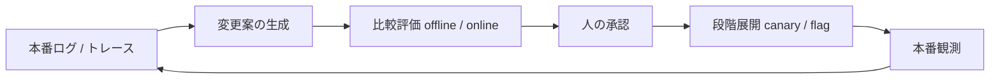
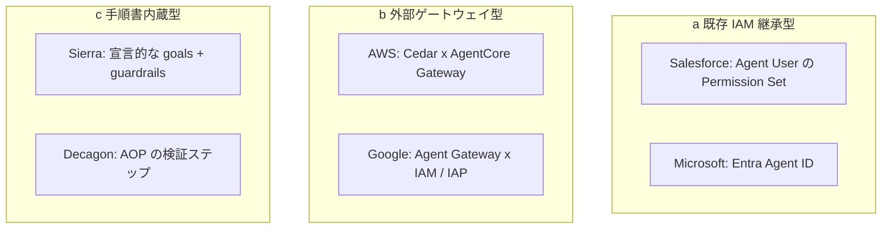
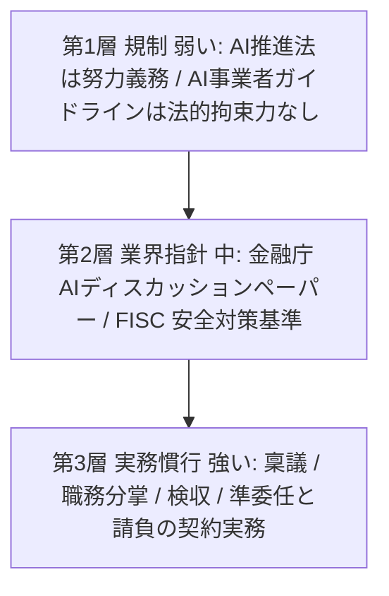
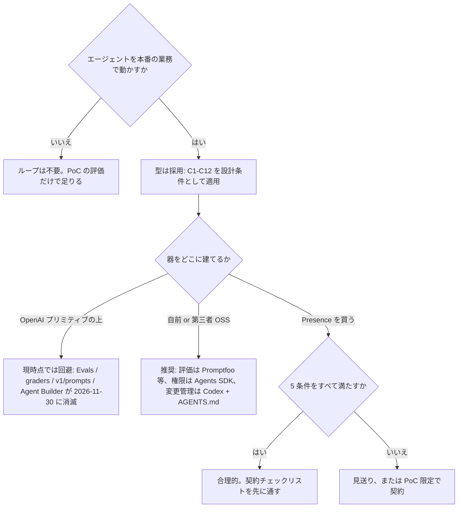

2026 年 7 月 22 日、OpenAI が **Presence** を発表しました。業務エージェントの権限・承認・エスカレーション・シミュレーション・本番後の改善を、部品の寄せ集めではなく **ひとつの運用モデル** として提示した製品です。

この記事は製品レビューではありません。**エージェントを本番業務で動かす立場の人**、つまり運用基盤を設計するエンジニアと、導入可否を決める発注側が「この型を採るべきか」「器をどこに建てるか」を判断するための材料を、一次情報と反証の両面から整理します。

## 3 つの判断と結論

| 問い | 結論 | 決め手 |
|---|---|---|
| ① 変更管理ループという型を採るべきか | 採用。ただし実証済みという理由ではない | 5 ステップのうち 4 つは canary / feature flag / 職務分離 / NIST CM-3 / champion-challenger の焼き直し。既存の統制実務を AI 用に翻訳した型 |
| ② OpenAI の公開プリミティブの上に器を建てるべきか | 現時点では見送り | Evals プラットフォーム、Agent Builder、`v1/prompts` が 2026-11-30 に一斉シャットダウン |
| ③ Presence を今買うべきか | 証拠不足。限定条件下でのみ合理的 | 公表された本番事例は OpenAI 自社 1 件のみ。公開仕様・価格・SDK が非公開 |

最も意思決定を変えるのは **②** です。Presence を買わない組織にも直撃するからです。統合されたループを掲げる製品の構成部品のうち、外販されていた部分は Presence 発表の 1 か月半前に廃止告知され、4 か月後に消えます。

### 最も重要な単一の事実

> このループを構成する 5 ステップのうち、本当に新しいのは「評価の入れ子」1 点だけです。

従来の canary は、エラー率やレイテンシという客観指標で合否を出せました。エージェントの挙動変更では、**canary の合否判定そのものが主観的な品質評価** になり、その評価者が LLM になります。judge が劣化すれば、段階展開のガードそのものが無効化されます。ここだけは既存実務に前例がありません。

## Presence が公式に述べたこと

発表記事が挙げる構成要素は、正確に 6 つです。

> "Presence brings together the components teams need to run agents in production: policies and standard operating procedures, guardrails, approved actions, simulations, evaluation tools, and a Codex-powered improvement process."

要旨は「手順書、ガードレール、承認済みアクション、シミュレーション、評価ツール、Codex による改善プロセスを 1 つにまとめた」です。

主要な定義を公式文言のまま押さえます。解釈の余地を残さないため、訳さずに引用します。

| 論点 | 公式キーフレーズ |
|---|---|
| 権限定義の 3 点セット | "Guardrails, permissions, and approval steps that define what the agent can do." |
| ポリシー決定の 3 軸 | "what the agent can do, when it needs approval, and when a person should take over" |
| 最小権限 | "The agent receives only the knowledge and system access required for that job." |
| 評価の 4 軸 | "reached the right outcome, followed policy, used tools correctly, and escalated when appropriate" |
| テストシナリオ 3 分類 | "common requests, edge cases, and higher-risk scenarios" |
| 改善ループの入力 3 種 | "Production sessions, escalations, and quality signals" |
| 差分検証 | "test each proposed change against the version in production" |
| 人の承認 | "human approval governing every change" |
| リリース管理 | "Controlled rollout, monitoring, and rollback processes for new versions." |
| エスカレーション条件 | "when a policy, risk, or workflow requires human judgment" |
| アンチパターン宣言 | "A Presence agent does not become production-ready simply by ingesting documents." |

### 設計上いちばん効く発見: 一貫させるものと変えるものの二層構造

> "Companies decide what remains consistent across deployments—such as policies, evaluations, and escalation rules—and what should change for each workflow or channel."

ポリシー・評価・エスカレーションルールをデプロイ横断の共有資産に置き、それ以外をワークフローやチャネル単位で差分化します。この構造判断は、Presence を買わずに自前で器を組む場合もそのまま使えます。

### 製品仕様が公開文書で固定されていない

ヘルプセンターが自ら断っています。

> "Exact features, models, channels, capacity, data handling, pricing, and service commitments are defined for each deployment."

つまり Presence には公開された製品仕様が存在しません。買い手はベンダー個別契約でしか条件を知れず、相見積もりも TCO モデリングも困難です。

### 実績数値は測定条件とセットで読む

> "...now resolves 75% of inbound issues without human assistance. Working with our launch team, its Codex-powered improvement loop reduced human handoffs by 15 percentage points in just 10 days."

この数値は **OpenAI 自社の英語電話サポート** の値であり、次の条件下で測られています。

| 条件 | 内容 |
|---|---|
| 測定主体 | 測定・被測定・販売のすべてが OpenAI。第三者検証なし |
| ベースライン | 非公開。15%pt の削減は削減前の水準で意味が変わる |
| resolved の定義 | 非公開。CSAT・再問い合わせ率・誤案内率の併記なし |
| 対象キュー | ポリシー違反、アカウント侵害、詐欺、プライバシー、著作権、商標などを除外表で事前除外 |
| 範囲 | 単一製品・英語のみ |

Presence が売られる先は claims (保険金請求)、銀行の日常業務、IT helpdesk、HR です。いずれも上の除外リストに近い性質、つまり本人確認・金銭・法的責任・個人情報を核に持ちます。同じ 75% が転移すると期待する根拠は、公式ドキュメント上にありません。

### 公表事例の段階

| 顧客 | 公式の表現 | 段階 |
|---|---|---|
| OpenAI 自社 (英語電話サポート) | "Presence powers..." | 本番 |
| BBVA | "is exploring" / "As a design partner" | 探索 |
| SoftBank | "is testing" | 検証 |
| IAG | "We see an opportunity" | 検討 |

"battle-tested" という自称に対し、公表された本番事例は自社 1 件です。

## 変更管理ループの構造

### ループの一般形

| 要素名 | 説明 |
|---|---|
| 本番ログ / トレース | 実運用のセッション、エスカレーション、品質シグナルの蓄積 |
| 変更案の生成 | プロンプト・手順書・tool 定義の改訂案の作成 |
| 比較評価 | 本番稼働中の版と改訂案の offline / online 比較 |
| 人の承認 | 変更の適用可否の決裁 |
| 段階展開 | canary や feature flag による限定公開 |
| 本番観測 | 展開後の品質・成功率・エスカレーション率の監視 |

### 各ステップの焼き直しと新しさ

この対応関係がこの記事の中核です。

| ステップ | 焼き直しの部分 | 新しい部分 |
|---|---|---|
| 本番ログから提案 | MLOps の continuous training トリガー、SRE のポストモーテム、トレース駆動最適化 | 変更対象が自然言語のプロンプトや手順書。差分レビューの単位が非形式言語で、影響範囲の静的解析が困難 |
| 比較評価 | champion/challenger、offline eval、holdout、A/B | 評価器が LLM 自身でバイアスを持つ。正解ラベルの不在。対象が非決定的 |
| 人の承認 | 職務分離、NIST SP 800-53 CM-3、ITIL normal change、CAB | 承認者による差分の効果予測が困難。従来の変更承認はコードを読めば変化が分かる前提 |
| 段階展開 | canary、feature flag、shadow、blue-green | canary の合否判定自体が LLM judge に依存しうる、いわゆる評価の入れ子 |
| 権限統制 | least privilege、complete mediation | 承認済みの提案でも実行時のプロンプトインジェクションで別行動を取りうる。承認は権限境界の代替にならない |

### 権限をどこで強制するか: 業界の 3 流派

| 要素名 | 説明 |
|---|---|
| a 既存 IAM 継承型 | 人間の権限体系にエージェントを乗せる方式。組織の既存統制がそのまま有効 |
| b 外部ゲートウェイ型 | ポリシー言語とゲートウェイで中央強制する方式。形式的に最も強い |
| c 手順書内蔵型 | 手順書に goals と guardrails を宣言する方式。CX 担当者が書ける反面、形式的検証は弱い |

AWS は自然言語をポリシーに変換し、自動推論で「過剰に許可的」「過剰に制限的」「決して満たされない条件」を強制前に検出するところまで実装しています。

ここで構造的な発見があります。**(b) を採る 2 社は事前評価が最も薄く、権限の厳密さと評価の厚さがトレードオフになっています。**

Presence の権限表現は "APIs and tools with scoped permissions" 止まりで、記法や粒度 (宣言的ポリシー言語か、RBAC か、UI 設定か) の公式記載はありません。

### 業界横断比較

| | 権限モデル | 事前評価 | 人の承認 | 段階展開 | 改善ループ | エスカレーション |
|---|---|---|---|---|---|---|
| Salesforce Agentforce | Topic から Action の階層 allowlist + 専用 Agent User | ◎ Testing Center による合成テスト生成と CI 組込 | draft から commit で不変化、activate で反映 | △ ゼロダウンタイム置換のみ | △ 自動改善提案は未確認 | Service Cloud へルーティング |
| Sierra | 宣言的 goals + guardrails | ◎ 実会話スナップショットをモック API でシミュレート | イミュータブルなリリーススナップショット | ◎ 即時ロールバック + 複数リリース A/B | ◎ 人手アノテーションのテスト資産化 | ◎ サマリ自動生成付き |
| Decagon | AOP + 機微操作のコード検証強制 | ○ 4 層 (プレビュー / ユニット / 統合 / 大規模シミュレーション) | Git ベース版管理 + 即時ロールバック | ✕ 未確認 | ○ 改善案の自動提示は将来計画 | ◎ AOP に必須記述 |
| Google ADK / Gemini Enterprise | ◎ Agent-Auth と User-Auth の明示的二択 + Gateway 中央強制 | ◎ evalset + シナリオ自動生成 + 障害注入 | ○ 管理者レビュー・承認 | △ 汎用トラフィック分割に委譲 | ◎ 失敗点から instruction 改訂案を自動生成・検証 | ✕ 汎用 handoff は未確認 |
| Microsoft Copilot Studio | ◎ テナント DLP によるメーカー制約。違反時は Publish 無効化 | ○ テストセット + 7 メソッド | ◎ ALM + 実行時 multistage approvals | △ 環境分離が代替 | ○ 改善案の自動提示は未確認 | ○ Omnichannel + 承認フロー |
| AWS Bedrock AgentCore | ◎◎ Cedar を Gateway で強制。自動推論でポリシー矛盾を事前検出 | ✕ マネージドな会話シミュレーションなし | ✕ 未確認 | ✕ 未確認 | △ Observability は厚く観測どまり | ✕ 未確認 |
| OpenAI Presence | ○ guardrails + permissions + approval steps (粒度非公開) | ○ simulations + graders 4 軸 (実装方式非公開) | ◎ "human approval governing every change" | ○ controlled rollout + rollback (粒度非公開) | ◎ Codex が提案 (外部検証手段なし) | ○ structured context 付き (中身非公開) |

凡例: ◎ 明確な製品機能 / ○ あり / △ 部分的 / ✕ 一次情報で確認できず

Sierra は Presence 発表の 25 か月前 (2024-06-03) に、イミュータブルリリース、即時ロールバック、複数リリース A/B を公開ブログで説明済みです。同型の器は既に複数社が商品化しており、公開情報からは Presence を待つ必然性を示せません。

### OpenAI の公開プリミティブでループのどこまで組めるか

| ループのステップ | 使える公開プリミティブ | 2026-11-30 以降 |
|---|---|---|
| 権限・承認 | Agents SDK の `needs_approval` / `require_approval` / `allowed_tools` / `is_enabled`、tool guardrail、`RunState` の永続化 | 残存 |
| 実行時ガード | Guardrails OSS の 3 ステージ + 評価ハーネス同梱 | 残存 |
| 事前評価 | Evals API (grader 6 種) | 消滅 |
| プロンプト資産の版管理 | `v1/prompts` | 消滅 |
| GUI オーケストレーション | Agent Builder | 消滅 |
| 変更管理 | Codex の `AGENTS.md` によるレビュールールと PR diff レビュー | 残存。対象はコード |
| トレース評価 | 公開 API は確認できず | 未確認 |

注目すべきは非対称性です。**権限まわりは厚く残り、評価だけが公開プラットフォームから撤退します。** 公式も "Graders documented for eval workflows are part of this transition." と明記しています。移行先として案内されるのは、第三者 OSS の Promptfoo です。

Agents SDK の公式ドキュメントは、承認待ち中にプロンプト・tool 定義・モデルが変わる問題を自ら認めています。

> "If approvals may sit for a while, store a version marker for your agent definitions or SDK alongside the serialized state."

もうひとつの構造的制約は、**監査 (tracing) と ZDR の排他** です。

> "For organizations operating under a Zero Data Retention (ZDR) policy using OpenAI's APIs, tracing is unavailable."

規制の厳しい組織ほど、エージェントの挙動を観測する公式手段を失います。

## 反証: この結論を弱めるもの

支持証拠だけを集めると判断を誤ります。反証を 2 つの独立したレンズで整理します。

### レンズ 1: プロダクトと商流

| # | 反証 | 射程 |
|---|---|---|
| 1 | Evals platform (graders 含む)、Agent Builder、`v1/prompts` が 2026-11-30 に一斉シャットダウン。Agent Builder は発表から 14 か月 | Presence を買う判断 + 自前で組む判断 |
| 2 | 実績が自社 1 件で、その 75% は高リスク案件を除外した単一製品・英語限定のキューでの測定 | Presence を買う判断 |
| 3 | アクセス条件に "available delivery capacity" が明記され、人員律速。FDE 母体は約 150 名で、スケール手段として企業買収を公式に明記 | Presence を買う判断 |

**#1 だけが自前で組む判断も撃つ唯一の反証** であり、最も意思決定を変えます。

**#3 の含意は構造的です。** 変更管理ループの価値は変更を速く安全に回せる点にあります。変更の実行主体がベンダーの有償人員であれば、ループの回転数はベンダーの請求書と人員の空きに律速されます。ループを買う目的と構造的に矛盾します。

リファレンス顧客の独立性にも構造的な欠落があります。

| 観測 | 内容 |
|---|---|
| リファレンス 3 社 | BBVA / SoftBank / IAG |
| 出資者リストとの重複 | BBVA と SoftBank Corp. が OpenAI Deployment Company の出資者に明記 |
| GSI 候補 | Bain / Capgemini / McKinsey も同社の出資者 |
| 帰結 | 独立性が担保されたリファレンスは IAG 1 社のみ。それも検討段階 |

導入を助言する主体、導入で稼ぐ主体、製品の株主が重なります。

Klarna の前例も参考になります (この事例は各社報道を経由した二次情報であり、一次発言との照合は未了です)。OpenAI のフラッグシップ事例が顧客側で walk back され、CEO はコスト偏重が品質低下を招いたと述べて人間の採用を再開しました。ただし AI の撤去ではなくリバランスです。注目すべきは、**walk back 後も同じ Klarna が成功例として再引用された点** であり、ベンダーのケーススタディは顧客側の評価が反転しても更新されません。

責任の所在も動きません。Moffatt v. Air Canada (2024 BCCRT 149、賠償額 CAD 650.88) は、AI の誤案内の責任が事業者に帰属することを示しました (判決原文は取得できず、複数の法律事務所の解説で事件番号・日付・金額の整合を確認しています)。**ガードレールの有無にかかわらず、責任は移転しません。**

公平のために付記します。**Presence が実際に失敗したという直接証拠は 1 件も存在しません** (発表 2 日後なので当然です)。上記の反証はすべて構造的リスク・過去のパターン・実績の不在に基づく間接的なものです。「買うべきでない」の根拠ではなく、**買う判断の前に何を確認すべきかの条件リスト** として扱うのが妥当です。

### レンズ 2: ループという機構そのもの

最大の発見は、証拠の不在です。

> このループ全体をエンドツーエンドで検証し「効かない」と結論づけた研究も、「効く」と結論づけた研究も見つかりませんでした。

暫定結論は、反証も検証もされていない状態にあります。したがって以下はすべて構成要素への攻撃です。

#### 前提「人は改善したかを判断できる」への反証

METR のランダム化比較試験 (arXiv:2507.09089) は、経験豊富な OSS 開発者 16 名・246 タスクを対象にしました。

| 観測 | 数値 |
|---|---|
| AI ツール利用時の実際の完了時間 | 19% 増加 |
| 開発者の事前予測 | 24% 短縮 |
| 開発者の事後推定 | 20% 短縮 |

当該領域の専門家が、実測 19% の悪化を体験した直後でさえ 20% の改善だったと信じました。**「人が見て良さそうなら承認する」というゲートは、符号すら誤ります。**

これは既知の rubber-stamping や automation bias より一段強い結果です。ただし n=16 の単一ドメインであり、コーディング支援から LLM 提案の承認への適用は類推を 1 段挟みます。

#### 前提「プロセス改善は成果改善につながる」への反証

DORA 2024 が、因果主張そのものを切ります。

> "Considered together, our data suggest that improving the development process does not automatically improve software delivery—at least not without proper adherence to the basics of successful software delivery, like small batch sizes and robust testing mechanisms."

要旨は「開発プロセスの改善は、小さなバッチサイズと堅牢なテストという基本の遵守を伴わない限り、デリバリを自動的には改善しない」です。

同調査は AI 導入が 25% 増えたとき、デリバリスループット -1.5%、デリバリ安定性 -7.2% と推定しました。挙げられた機序は batch size の肥大です。LLM が変更提案を大量生産するループには、この機序がそのまま当てはまります。

公平を期すと、DORA 2025 で throughput は正に転じました。ただし instability は 2 年連続で悪化側のままです。ループの主眼が品質の継続的改善である以上、残った方が本丸です。

変更提案のベースレートも設計要件を変えます。Kohavi らの KDD 2013 論文は次のように述べます。

> "Only one third of the ideas tested at Microsoft improved the metric(s) they were designed to improve"

ループの価値は「良い変更を入れること」ではなく「**悪い変更を弾くこと**」に置かれるべきです。既定は「変更しない」になります。

#### 前提「比較評価は信頼できる信号である」への反証

| # | 脆弱性 | 根拠 |
|---|---|---|
| 1 | 順序で騙される (position bias) | Claude-v1 の一貫性 23.8%、GPT-4 でも 65.0% (arXiv:2306.05685) |
| 2 | 長さで騙される (verbosity bias) | 冗長化しただけの改悪版を良いと誤判定する率 91.3% |
| 3 | 自分の出力を贔屓する (self-preference) | self-recognition の強さと self-preference の強さが線形相関 (arXiv:2404.13076) |
| 4 | 空応答を成功と数える | τ-bench で意図的に不可能なタスクへ空応答を返すエージェントが成功と判定。相対 100% までの過大評価 (arXiv:2507.02825) |
| 5 | 最適化圧で崖から落ちる | 能力が上がるほど proxy reward は上昇し true reward は低下。相転移が存在 (arXiv:2201.03544) |

**ループの中で唯一の客観的信号とされる部分が、最も脆いという構造です。** しかも #4 は業界最良のエージェントベンチマークで起きています。社内で急造した比較評価がそれより厳密である保証はありません。

#### 前提「運用としてループが回り続ける」への反証

DORA 2025 は制御理論の Nyquist 制約を持ち出します。

> "The Nyquist stability criterion from control theory tells us that any control system must operate at least twice as fast as the system it controls."

要旨は「制御系は、制御対象より最低 2 倍速く動く必要がある」です。

現実の周期は次のように分かれます。

| 工程 | 時間オーダー |
|---|---|
| 提案生成 | 分 |
| 統計的に有意な評価 | 日から週 (サンプル蓄積待ち) |
| 人の承認 | 人間のスケジュール依存 |

制御周期の不等式が構造的に破れています。運用上の不満ではなく、制御理論上の必要条件の不成立として記述できます。

さらに摩擦は消えずに移動します。

> "friction doesn't vanish so much as move: It shifts from manual grind to deciding and verifying, possibly in the form of prompt iteration, result vetting, and assessing code that looks remarkably similar to correct code."

METR の結果と組み合わせると、**移動先の作業は人間が最も苦手な種類の作業** です。

#### 反証が見つからなかった論点

| 探した論点 | 結果 |
|---|---|
| ループ全体を否定した研究 | 該当なし (支持する研究も同様) |
| LLM エージェントで段階展開の統計的検出力が不足するという一次研究 | 該当なし。Netflix の逐次検定 (arXiv:2205.14762) はむしろ検出可能側の証拠 |
| プロンプト変更が状態を持つためロールバックできないという一次証拠 | 該当なし。prompt registry と version pin で技術的に解決可能 |
| LLM 提案の過剰生産でレビューが飽和したことを定量した研究 | 該当なし |

#### 適用範囲に注意すべき反証

| 反証 | 正しい読み方 |
|---|---|
| LLM は自己修正できない (arXiv:2310.01798) | 否定対象は外部フィードバックなしの intrinsic self-correction。本ループは外部信号を持つため直接は当たらない。ただし前提 1 と前提 4 がその外部信号の汚染を示す |
| model collapse (Nature 631:755-759) | 重みの再学習の話であり、本ループは重みを再学習しない。しかも置換ではなく蓄積なら崩壊を回避できると条件が特定済み (arXiv:2404.01413) |

## 契約とデータガバナンスの空白

エージェント運用を外部プラットフォームに預けるとき、実務で効くのは機能比較よりも契約定義です。

### 核心: 評価データはどこに属するか

OpenAI Services Agreement §17 の定義は次のとおりです。

> "Customer Content" means the Input and the Output.

所有権 (§4.1)、OpenAI 側の利用制限 (§4.2)、契約終了時の 30 日削除義務、データレジデンシーは、すべて Customer Content に紐づきます。ではエージェント運用で生まれるデータはどうなるでしょうか。

| データ種別 | 定義上の帰属 |
|---|---|
| エンドユーザーの発話 | Customer Content (Input) |
| エージェントの応答 | Customer Content (Output) |
| 顧客がアップロードした eval データセット | Customer Content と読むのが自然 |
| grader の判定結果 (pass/fail、スコア) | 不明確。Input に基づく出力だが、対象は Output |
| simulation 実行ログ (合成会話) | 不明確 |
| 運用テレメトリ (レイテンシ / 成功率 / エスカレーション率) | Customer Content 以外 |
| classifier / 安全性分類の出力 | Customer Content 以外 (OpenAI が明示) |

OpenAI 自身が Customer Content 以外を 2 箇所で定義しています。

> "The classifications created are metadata about the business data but do not contain any of the business data itself."

> "System data means account data, metadata, and usage data that do not contain Customer Content ... such as ... analytics, usage statistics, billing information, support requests, and structured output schema."

観測ダッシュボード・成功率メトリクス・エスカレーション統計が system data に分類されると、次の帰結が生じます。

| 条項 | 帰結 |
|---|---|
| 所有権条項 | 対象外。顧客の所有と言えない |
| 利用目的制限 | 対象外。Services 改善への利用が可能 |
| 30 日削除義務 | 対象外。契約終了後も残存しうる |
| データレジデンシー | 対象外。日本リージョン指定でも US に出る |

**マネージド運用プラットフォームで最も価値のあるデータ、つまり運用の質に関する時系列指標が、契約上最も保護の薄いカテゴリに落ちる可能性があります。**

なお「Presence の運用テレメトリが system data に分類される」と OpenAI が明言した資料は確認できませんでした。上記は定義文言から導いた推論であり、Order Form で明示させるほかありません。

### 見落とされやすい Feedback 条項

> 9.3. Feedback. If Customer provides Feedback, Customer grants OpenAI the right to use and exploit Feedback without restriction or compensation.

Presence の運用ループは、構造上「顧客が OpenAI に対して継続的に Services へのフィードバックを行う」形になります。デプロイレビュー会での誤り報告、grader の失敗ケースへの顧客側アノテーション、FDE との改善サイクルでの議論が該当しうる範囲です。

これらが Feedback に該当すると解釈されると、利用制限を経由せずに OpenAI が無制限に利用できます。しかも opt-out の仕組みがなく、契約終了後も存続します。

### 条文の消失

旧 DPA (Feb 2024 版) には明確な積極的許諾がありました。

> "For clarity, OpenAI may continue to process information derived from Customer Data that has been deidentified, anonymized, and/or aggregated ... to improve OpenAI's systems and services."

現行 DPA (Effective 2026-01-01) には、この一文が存在しません。では発表記事の "generalized insights from every deployment informing ongoing research and product development" は何を根拠にするのでしょうか。接地経路は論理的に 3 つです。

| 経路 | 顧客側のコントロール | 評価 |
|---|---|---|
| A. Customer Content の明示的 opt-in (既定無効) | opt-out 可能 | 最も明確 |
| B. Feedback ライセンス | opt-out の仕組みなし | 最も危険 |
| C. Customer Content 以外の system data / classifier メタデータ | 公開条項にコントロール手段なし | 最も広い。条項改訂なしで運用可能 |

### その他の確認すべき事実

| 事実 | 内容 |
|---|---|
| 公開契約スタック上の不在 | Services Agreement / Service terms / DPA / Sub-Processor List / ISO 27001 認証範囲 / Enterprise privacy に Presence の記載なし |
| 条項凍結の非適用 | §16.13(b)(ii) 但書により、Order Form 署名後にローンチされた Service は初回利用時に最新条文が適用 |
| Beta Services 該当性 | 該当すれば SOC 2 / ISO 27001 の監査範囲外、Documentation 適合保証なし、IP 補償なし、警告なしの変更可 |
| `/v1/evals` の保持 | "Until deleted" の無期限保持かつ ZDR 非対応 |

## 日本の実務で効く制約

規制は障害になりません。硬いのは実務慣行です。

| 要素名 | 説明 |
|---|---|
| 第1層 規制 | 努力義務中心で罰則なし。導入判断の障害になりにくい |
| 第2層 業界指針 | 金融庁や FISC の指針。実質的な設計要件として機能 |
| 第3層 実務慣行 | 稟議・職務分掌・検収・契約類型。最も硬い制約 |

金融庁は Presence とほぼ同型の管理モデルを既に記述しています。

> 「AI エージェントの広がりを見越して、現段階から AI エージェントのパフォーマンスの監視、ライフサイクルとコスト管理、インベントリー管理、権限管理の４つを統合的に管理するプラットフォームの構築を進めているとの事例紹介があった。」

**規制当局側が先に、あるべき器の形を言語化しています。** Presence 型の運用モデルは日本の金融機関にとって新しい何かではなく、自前で作ろうとしていたものの既製品です。

「日本は人手確認が必須だから Presence 型は無理」という見立ても誤りです。監督官庁自身が緩める側に回っています。

> 「人間が誤った判断を行うこともあり、…『AI は絶対に誤ってはならない』といった極めて高精度の要求水準を AI に課すことは適切ではないとも考えられるため、…過度に委縮することなく生成 AI の活用を模索していくことが期待される。」

AI 事業者ガイドライン (第1.2版) も自動化バイアスを明示的にリスク認定し、人を挟むこと自体を無条件の善としていません。前掲の METR や DORA の知見と方向が一致します。

では日本で本当に硬いのは何でしょうか。

| 優先度 | 制約 | 内容 |
|---|---|---|
| ★★★ | 独立した検証者の要求 | 金融庁 DP がモデル開発者と独立した検証者による本番適用前検証を先進事例として提示。Presence では grader も simulation も OpenAI が提供するため、開発者と検証者が同一に見える |
| ★★★ | 職務権限規程との対応づけ | 稟議・職務分掌規程・決裁権限表が明文で存在。エージェントの approved actions をどの職位相当と見なすかの前例がない |
| ★★ | ログ保存期間 | AI 事業者ガイドラインは保存目的に損害賠償責任要件の立証を明記しつつ、年数の基準は未提示。SaaS 側の保持期間と社内の証跡規程が衝突しうる |
| ★★ | 契約類型の宙ぶらりん | SaaS でありながら FDE が SOP や policy を作り込む開発型の性質を併せ持つ |
| ★ | データ主権 / オンプレ要求 | オンプレミス志向の金融・製造・公共が一定量存在 |

日本企業は既に独立に同型の結論へ到達しています。メルカリ (メルペイ) の決済プラットフォーム自律エージェントは 5 層防御を敷き、最重要層を PreToolUse hook による決定的な強制層 (fail-closed) に置きました。同社が挙げた課題の 4 番目はフリート全体の統治と観測であり、Presence が解こうとしている問題そのものです。DeNA も社内申請の差し戻しコメントと会話ログから改善指示を収集し、プロンプトを継続的に育てる同型のループを独立に実装しています。

## 判断フローと設計条件

### 判断フロー

Presence を買うのが合理的な 5 条件は、すべて満たす場合に限ります。

1. voice / chat の高volume・反復的なワークフローの実在
2. 社内にエージェント運用の器を作るエンジニアリング体制の不在、かつ構築予定もなし
3. FDE への継続的な支払いを前提にした TCO の受容
4. 評価データ・運用テレメトリの所有権と持ち出し経路を Order Form で握れる交渉力
5. 独立した検証者の要求 (金融など) に対する説明の用意

### ループを回すなら守るべき設計条件 C1〜C12

各条件は反証と 1 対 1 で対応します。**Presence を買う場合も、自前で組む場合も同じく効きます。**

| # | 設計条件 | 対応する反証 |
|---|---|---|
| C1 | 承認者の主観を信号にしない。承認は事前登録された定量基準の充足確認に限定する | METR RCT / rubber-stamping |
| C2 | LLM judge を単独ゲートにしない。人手ラベル付き holdout を併用し、位置バイアスと冗長性バイアスを毎回検定する | position / verbosity / self-preference bias |
| C3 | 評価セットを秘匿しローテーションする。ゲート用 holdout は提案 LLM に見せず、使用回数の上限で差し替える | eval のオーバーフィット |
| C4 | 人手由来のデータを LLM 生成物で置換せず、必ず累積させる | model collapse は置換で起き、蓄積で回避 |
| C5 | 既定は変更しない。有意な改善を示せない提案は棄却し、KPI を棄却率で見る | Kohavi の 1/3 |
| C6 | 提案レートを評価スループットに合わせて絞る | Nyquist 制約 / batch size 肥大 |
| C7 | 評価スコアを最適化目標にしない。最適化用の指標とゲート用の指標を分離する | reward hacking の相転移 |
| C8 | 汎用的に良さそうな追加を無条件に受理しない。編集の種類とタスク種のマトリクスで効果を確認する | プロンプト改善の非単調性 |
| C9 | 非決定性を前提に多サンプル評価する。逐次検定で偽検出率を制御する | 出力の分散 / Netflix の逐次検定 |
| C10 | 提案を小さく分割する。1 提案 = 1 仮説に制約する | DORA の batch size 知見 |
| C11 | 副作用のロールバック計画を、プロンプトのロールバックとは別に用意する | エージェントは外部副作用を持つ |
| C12 | ループ自体の有効性を、内部指標ではなく独立した業務成果で測る | ループの有効性は未検証 |

**C1 と C12 が最重要です。** 前者は最も強い反証への直接の対策であり、後者は未検証の仕組みを導入しているという事実への誠実な備えです。

### Presence 契約前に握るべきこと

| 優先 | 確認事項 | 理由 |
|---|---|---|
| 1 | `generalized insights` の入力に自社 deployment の何が含まれるかを、Customer Content / Feedback / system data の 3 分類で明示させる | 経路 C は条項改訂なしで運用可能 |
| 2 | Feedback の範囲を限定し、grader 定義や失敗事例のアノテーションを除外する文言を Order Form に入れる | §9.3 は無制限・無償・契約終了後も存続 |
| 3 | 評価データ・運用テレメトリの所有権と持ち出し経路を明記させる | 定義ギャップに落ちる |
| 4 | Beta Services 該当性を確認する | 該当時は監査範囲外・IP 補償なし |
| 5 | どの契約傘に入るかを確定させる | Presence は公開契約スタックに不在 |
| 6 | データ保持期間・保存場所・アクセス権を契約で固定する | すべて deployment ごとで下限保証なし |
| 7 | grader / simulation の定義を顧客側が握れるか、第三者 eval を並走できるかを確認する | 独立した検証者の要求への回答になる |

## 未解決の問い

| # | 問い | なぜ残ったか |
|---|---|---|
| U1 | このループは本当に品質を継続的に改善するのか | 肯定・否定とも検証した研究が存在しない。最大の不確実性 |
| U2 | grader / simulation の実装方式と合否閾値 | 公式に記載なし。C2 を Presence 上で実現できるか判断できない |
| U3 | Codex が提案する update の対象物 | 公式に記載なし。変更管理の粒度と承認単位が決まらない |
| U4 | 運用テレメトリが system data に分類されるか | 定義文言からの推論にとどまる |
| U5 | Presence が Beta Services 扱いか | 監査範囲・IP 補償・解約権が変わる |
| U6 | 日本での提供形態 | Presence への公式言及が 0 件 |
| U7 | 価格・課金モデル | 一切非公開。TCO 比較が困難 |

### 誤って広まりやすい点

| 主張 | 実際 |
|---|---|
| Frontier と Presence は前身と後継 | 両製品ページが稼働中で相互言及は 0 件。並存 |
| Presence は Frontier 上に構築されている | 公式ソース 0 件の推論 |
| Presence plugin の仕様が公開されている | 公式 plugin ドキュメントに記載 0 件。Codex の改善提案には外部検証手段がない |
| 独立検証済みの実績がある | 発表 2 日後時点で批判的独立記事は 1 本のみ。一次データの独立検証はゼロ |

## まとめ

エージェント運用の変更管理ループは、canary や職務分離といった既存の統制実務を AI 用に翻訳した型であり、採用する価値があります。ただし「評価の入れ子」だけは前例がなく、ループ全体の有効性を検証した研究も存在しないため、C1 から C12 の設計条件を先に固定し、器は 2026-11-30 に消える OpenAI プリミティブの外側に建てるのが安全です。

この記事が少しでも参考になった、あるいは改善点などがあれば、ぜひリアクションやコメント、SNSでのシェアをいただけると励みになります！

## 参考リンク

- OpenAI 一次
  - [Introducing OpenAI Presence](https://openai.com/index/introducing-openai-presence/)
  - [OpenAI Presence 製品ページ](https://openai.com/business/openai-presence/)
  - [OpenAI Presence overview (help)](https://help.openai.com/en/articles/20001405)
  - [AI phone support (help)](https://help.openai.com/en/articles/11391933-ai-phone-support-experimental)
  - [Deprecations](https://developers.openai.com/api/docs/deprecations)
  - [Introducing AgentKit](https://openai.com/index/introducing-agentkit/)
  - [OpenAI launches the Deployment Company](https://openai.com/index/openai-launches-the-deployment-company/)
  - [OpenAI Frontier](https://openai.com/business/frontier/)
  - [Codex plugins](https://learn.chatgpt.com/docs/plugins)
- OpenAI 契約・データガバナンス
  - [Services Agreement](https://openai.com/policies/services-agreement/)
  - [Data Processing Addendum (現行)](https://openai.com/policies/data-processing-addendum/)
  - [Data Processing Addendum (Feb 2024 版)](https://openai.com/policies/feb-2024-data-processing-addendum/)
  - [Enterprise privacy at OpenAI](https://openai.com/enterprise-privacy/)
  - [Data controls in the OpenAI platform](https://developers.openai.com/api/docs/guides/your-data)
- GitHub
  - [Agents SDK: Human-in-the-loop](https://github.com/openai/openai-agents-python/blob/main/docs/human_in_the_loop.md)
  - [Agents SDK: Guardrails](https://github.com/openai/openai-agents-python/blob/main/docs/guardrails.md)
  - [Agents SDK: Tracing](https://github.com/openai/openai-agents-python/blob/main/docs/tracing.md)
  - [openai/openai-guardrails-python](https://github.com/openai/openai-guardrails-python)
  - [Graders](https://developers.openai.com/api/docs/guides/graders)
- 競合プラットフォーム
  - [Sierra: The agent development life cycle](https://sierra.ai/blog/agent-development-life-cycle)
  - [AWS Bedrock AgentCore: Policy](https://docs.aws.amazon.com/bedrock-agentcore/latest/devguide/policy.html)
  - [Google: Agent Gateway overview](https://docs.cloud.google.com/gemini-enterprise-agent-platform/govern/gateways/agent-gateway-overview)
  - [Microsoft: Copilot Studio DLP](https://learn.microsoft.com/en-us/microsoft-copilot-studio/admin-data-loss-prevention)
  - [Salesforce: Agentforce Testing Center](https://help.salesforce.com/s/articleView?id=ai.agent_testing_center.htm&language=en_US&type=5)
- 変更管理・評価の理論
  - [Google SRE Workbook Ch.16 Canarying Releases](https://sre.google/workbook/canarying-releases/)
  - [Martin Fowler: CanaryRelease](https://martinfowler.com/bliki/CanaryRelease.html)
  - [Pete Hodgson: Feature Toggles](https://martinfowler.com/articles/feature-toggles.html)
  - [OWASP LLM06:2025 Excessive Agency](https://genai.owasp.org/llmrisk/llm062025-excessive-agency/)
  - [NIST SP 800-53 Rev.5 CM-3](https://csf.tools/reference/nist-sp-800-53/r5/cm/cm-3/)
  - [DORA Accelerate State of DevOps 2019](https://dora.dev/research/2019/dora-report/2019-dora-accelerate-state-of-devops-report.pdf)
- 反証の一次ソース
  - [arXiv:2507.09089 METR RCT](https://arxiv.org/abs/2507.09089)
  - [arXiv:2306.05685 LLM-as-a-judge](https://arxiv.org/abs/2306.05685)
  - [arXiv:2404.13076 self-preference](https://arxiv.org/abs/2404.13076)
  - [arXiv:2507.02825 エージェントベンチマークの構成的欠陥](https://arxiv.org/abs/2507.02825)
  - [arXiv:2407.01502 AI Agents That Matter](https://arxiv.org/abs/2407.01502)
  - [arXiv:2201.03544 reward misspecification の相転移](https://arxiv.org/abs/2201.03544)
  - [arXiv:2310.01798 intrinsic self-correction の限界](https://arxiv.org/abs/2310.01798)
  - [arXiv:2404.01413 蓄積による model collapse 回避](https://arxiv.org/abs/2404.01413)
  - [arXiv:2205.14762 カナリアの逐次検定](https://arxiv.org/abs/2205.14762)
  - [Nature: AI models collapse when trained on recursively generated data](https://www.nature.com/articles/s41586-024-07566-y)
- 日本の公的文書・実務
  - [AI 事業者ガイドライン 第1.2版](https://www.meti.go.jp/shingikai/mono_info_service/ai_shakai_jisso/pdf/20260331_1.pdf)
  - [金融庁 AI ディスカッションペーパー 第1.1版](https://www.fsa.go.jp/news/r7/sonota/20260303/aidp_version1.1.pdf)
  - [経産省 AI の利用・開発に関する契約チェックリスト](https://www.meti.go.jp/policy/mono_info_service/connected_industries/sharing_and_utilization/20250218003-ar.pdf)
  - [メルカリ: 決済プラットフォームの自律エージェント](https://engineering.mercari.com/blog/entry/20260630-28a5eee688/)
  - [LayerX: AI エージェント時代の権限管理](https://tech.layerx.co.jp/entry/ai-agent-authorization)
  - [DeNA: 社内申請でプロンプトが育つ AI エージェント](https://engineering.dena.com/blog/2026/06/devin-prompt-improvement-cycle/)
- 報道
  - [The Register: OpenAI tries the consulting path with 'Presence'](https://www.theregister.com/ai-and-ml/2026/07/22/openai-tries-the-consulting-path-with-presence-charging-enterprises-boots-on-the-ground-prices-to-deploy-agents/5275867)
  - [Hacker News: Presence 発表スレッド](https://news.ycombinator.com/item?id=49008089)
