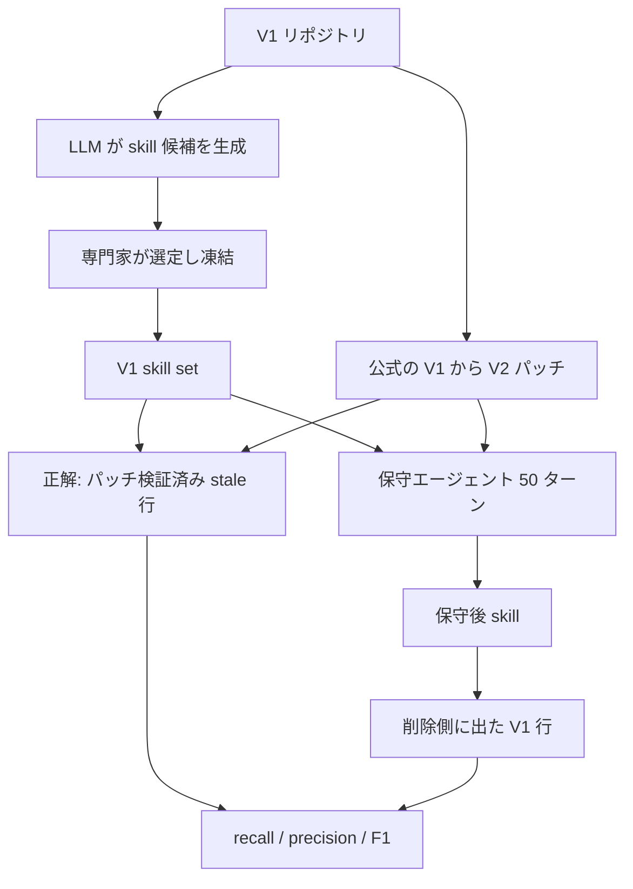

リポジトリに `SKILL.md` を置いて、エージェントに「このプロジェクトでのやり方」を教える運用が広がっています。呼ぶべきAPI、回すスクリプト、そのリリースが期待する作法。手続き知識を外出しできるのは便利ですが、その便利さは**特定のバージョンに紐づいている**ことから来ています。

問題は、バージョンが上がっても `SKILL.md` は壊れないことです。ファイルは読み込めるし、検索にも引っかかる。それでいて、中身は誤った手順を出し続けます。実行時エラーが出ないので、誰も気づきません。

この現象を **silent staleness (沈黙する陳腐化)** と名付けて定量化したのが、ByteDance・北京大学・北京交通大学による [Repo2Skill-Evo (arXiv:2608.21964)](https://arxiv.org/abs/2608.21964) です (v1、2026-08-22、preprint)。

この記事では、その測定結果と、そこから実務に持ち帰れるもの・持ち帰れないものを整理します。対象読者は、リポジトリ固有のskillを配布し、実行証跡で検証したい運用者です。

*この記事の全体像。以下、順に解説します。*

## 何が測られたのか

Repo2Skill-Evoは、57の公開リポジトリから **105件の公式リリース遷移** を集め、保守タスクのベンチマークにしています。

手順はこうです。

1. V1時点のリポジトリから、Claude-opus-4.6とGPT-5.4がskill候補を生成する
2. 人間の専門家が選定・改訂し、**V1 skill setとして凍結** する
3. 公式のV1→V2パッチと、凍結したV1 skillだけをエージェントに渡す
4. エージェントが50ターン以内でskillをV2向けに保守する
5. 保守後のskillを、パッチ由来の正解と行単位で照合する

規模は1,158 skill、パッチで検証されたstale行が12,217行 (1遷移あたり5〜375行、中央値92)。6モデル × 105遷移 × 3回で計1,890 runです。

評価指標は、削除すべき行をどれだけ正確に削れたかの **F1** です。正規化や行の結合はせず、物理行で照合します。追加されたV2向けの記述はF1に含めず、別途LLMによる0〜10点の質的評価が担当します。

## 沈黙が起きる構造

なぜ気づけないのか。仕様を見ると理由がはっきりします。

オープンな [Agent Skills仕様](https://agentskills.io/specification) で必須のfrontmatterは `name` と `description` の2つだけです。`compatibility` は任意項目であり、**対象リポジトリのバージョンや依存のlockを書く義務がありません**。

つまり沈黙は物理法則ではなく、**検査可能な契約が形式に存在しないことの帰結** です。書けないのではなく、書かなくても通ってしまう。

保守を成立させるには、3つの能力が同時に要ります。

| 能力 | 失敗すると起きること |
|---|---|
| パッチからskillへの影響箇所特定 | stale行が残る (recallが落ちる) |
| 陳腐化した知識の除去 | 旧API・旧既定値・旧パスが残る |
| 有効な情報の保持 | まだ正しい手順まで消す (precisionが落ちる) |

3つ目が効いてくるのが、この問題の厄介なところです。「怪しいところを全部消す」で解決しません。

## 結果: パッチを渡しても閉じない

6モデルのavg@3 (3回平均) の遷移マクロ平均です。

| モデル | recall | precision | F1 | 傾向 |
|---|---|---|---|---|
| Claude-opus-4.6 | 70.4 | 75.7 | **69.7** | 影響ファイル特定率0.95、編集量ほぼ適正 |
| GLM-5.1 | 64.1 | 72.4 | 64.3 | 特定率は同等だが41.3%がターン切れ |
| GPT-5.4 | **74.6** | 55.7 | 58.8 | 編集量2.84倍。対象外編集44.3%で消し過ぎ |
| Kimi-K2.5 | 40.4 | 71.6 | 47.0 | ファイル全体の被覆25.7%、ターン切れ47.3% |
| Doubao-Seed2-pro | 31.9 | 73.3 | 39.8 | 特定率0.53 |
| MiniMax-M2.5 | 22.6 | 74.9 | 29.9 | 20%が何も削除せず、ターン切れ68.6% |

読み取れるのは3点です。

**公式パッチを渡しても、最強で69.7%** 。差分という最も強いヒントを与えた上での数字です。

**失敗が二極化している。** 影響ファイルを拾いきれない側 (Doubao、MiniMax) と、拾ったうえで消し過ぎる側 (GPT-5.4) に分かれます。F1と影響ファイル被覆の相関はr=0.650で、特定できるかが支配的な要因です。

**3回の最良を取っても信頼できるほどではない。** best@3ではClaudeがF1 76.1、GLM 73.9、GPT 70.4。ClaudeのリポジトリクラスタbootstrapによるF1の95%信頼区間は[65.7, 73.8]です。

さらに、hardest-20の遷移に対して**正解ファイルのパスを教える**oracle条件を与えても、6モデル平均のF1は32.8%→45.0%、最強でも53.6%→62.3%にとどまります。ファイルを特定できても、その中のどの行が根拠に紐づくかを追う作業が残ります。

一方、LLMによる質的評価 (0〜10) では、F1が29.9%のMiniMaxでも6.01点、最強のClaudeで7.54点と、差が圧縮されます。**行単位の一致と、最終文書の見た目の妥当性はズレます。** 「読んで違和感がないか」でレビューすると、陳腐化を見逃します。

## この結果を、どこまで一般化してよいか

ここが実務判断で一番重要な部分です。この論文は「現場のあらゆるリリースでskillが毎回劣化する」ことを証明していません。著者自身がLimitationsで限界を明示しています。

| 論点 | 実際に示されたこと | 一般化の可否 |
|---|---|---|
| 105遷移すべてでV1の一部が無効化 | stale行が1行以上ある遷移だけを残した結果 | **選択によるトートロジー**。無効化ゼロの遷移は除外済み。有病率は未測定 |
| 遷移の選び方 | インターフェース・既定値・レイアウト・コマンドに触れる差分を優先 | 無効化しにくいリリースは過小サンプリング |
| F1 29.9〜69.7% | 行単位の最小編集スコア | 下流タスクの成功率ではない。保守後skillの再実行は未実施 |
| 対象ドメイン | 主にAI/ML・エージェント生態系。汎用ライブラリは105件中7件 | 他ドメインへの外挿は保留 |
| 難易度分布 | Hard 25 / Medium 60 / Easy 20。平均F1は29.9 / 53.0 / 74.5% | Easy帯は74.5%。全体を「解けない」に潰さない |

加えて、無視できない反証が複数あります。

**skillはソースコードでかなり代替できる。** 同論文の付随実験 (10リポジトリ、GPT-5.4) では、skillのみを与えた条件が8.68点、ソースのみが8.64点でほぼ同等でした (ベースライン5.88)。両方与えても+0.37です。つまりskillの主な効能は正答率よりも**コスト圧縮** で、消費トークンは51,821対272,620と5分の1以下でした。現ツリーを読めるコーディングエージェントにとって、stale skillは「唯一の情報源」ではありません。

**stale の実害が測れている範囲は狭い。** [SWE-Skills-Bench (arXiv:2603.15401)](https://arxiv.org/abs/2603.15401) では、49 skillのうちバージョン不整合で性能を落としたのは3件 (最大-10%)。一方39件は性能差ゼロで、うち24件はskill無しでも100%通ります。**害が実証されているのは一部** です。

**別のループは閉じている例がある。** 契約違反としてdriftを検出する [SkillGuard (arXiv:2605.10990)](https://arxiv.org/abs/2605.10990) は、599件のno-drift/hard-negativeで誤検知0 (Wilson 95%信頼区間 [0, 0.6]%)、既知driftでprecision 100% / recall 76%、局所化を伴う1ラウンド修理で成功率10%→78%を報告しています。契約を敷けばシグナルは設計できます。

**過剰な保守は逆効果になりうる。** [Library Drift (arXiv:2605.19576)](https://arxiv.org/abs/2605.19576) では、厳しすぎるskill退役設定でrolling gainが−0.019±0.010となり、skill無しの水準を下回ったと報告されています。Repo2Skill-EvoでGPT-5.4が対象外編集44.3%を出したことと合わせると、「リリースのたびに全文を書き換える」方針は危険側です。

まとめると、**「パッチ接地の最小編集は未解決」という狭い主張は堅い**。**「自動更新は無意味で、全skillに重装備が必須」という広い主張は支持されない**。この線引きが、次の実務設計を決めます。

## 実務にどう落とすか

現場に持ち帰れるのは、次の4つです。いずれも仕様の必須項目ではないので、自分で足すことになります。

### 1. 対象バージョンを宣言する

skillのfrontmatterか本文冒頭に、**対象プロダクトと「この手順が正しい」リリース/commit** を書きます。仕様が要求しないため書かれず、結果として沈黙がデフォルトになっています。書くだけで、読んだ人間もエージェントも「いつ時点の話か」を判断できます。

実際、[From Registry to Repository (arXiv:2607.00911)](https://arxiv.org/abs/2607.00911) が3,709件の再利用リンクを調べたところ、採用後に一度も改修されていないskillが53%、任意仕様フィールド (compatibility〜license) の出現率は3〜16%でした。ほぼ誰も書いていません。

### 2. 変わりやすい情報を凍らせない

skillに書いてよいのは、**破ってはいけない制約と、公式情報への到達手順** です。変わりやすいAPI表や引数一覧を丸ごとコピーすると、そこがそのまま陳腐化の温床になります。

日本語圏の実務知見でも、「最新ドキュメントの探し方を固定し、根幹ルールだけ凍らせる」という整理が共有されています ([ほくと「skills.shのおすすめスキルまとめ」Qiita](https://qiita.com/hokutoh/items/575cc42b5dafe8697447)、二次情報)。

### 3. 適合テストで失効を判定する

行単位の一致の代わりに使えるのが、**skillが指示するコマンド・パス・フラグが現ツリーで生きているか** の確認です。実行証跡で検証します。

そして失効条件を書きます。「対象パス・シンボル・スキーマがリリース差分に出たら、このskillを未検証状態に落とす」。論文の保守タスクを、そのままCIのトリガに読み替えたものです。

| 記載項目 | 中身 |
|---|---|
| 対象バージョン | 対象プロダクトと正しさが保証されるリリース/commit |
| 依存 | 参照する公式docs URL、スクリプト、設定キー |
| 適合テスト | 指示するコマンド/パス/フラグの現ツリーでの生存確認 |
| 失効条件 | リリース差分に出たら未検証へ落とす対象パス・シンボル |

依存の書き分けでは、ピン留めした依存は「義務」、コメント中のバージョン表記は「ノイズ」として扱うと、SkillGuardの契約検出と方向が揃います。

### 4. 再検証は局所に限る

リリース差分がskillの参照シンボル・パス・フラグに触れたときだけ、**影響ファイルの局所差分＋適合テスト** を走らせます。全文再生成はしません。自動書き換えを採用するかどうかは、テストが決めます。

逆に、やらないと決めておくべきことも明確です。

- リリースのたびに、エージェントにskill全文を再生成させる
- 「エラーが出ない = 正しい」と扱う (silent stalenessの定義そのもの)
- すべてのskillに同じ強度の再検証をかける (害が出るskillは一部で、コストが見合わない)
- 人間がキュレーションしたskillを、検証なしのLLM自己生成で置き換える

最後の点については、[SkillsBench (arXiv:2602.12670)](https://arxiv.org/abs/2602.12670) が、キュレーション済みskillで+16.2ポイント (v1要旨) / 33.9%→50.5%の+16.6ポイント (v4要旨) の改善を報告する一方、v1要旨では自己生成skillは平均して無益としています。

## まとめ

- リポジトリ固有のAgent Skillは**バージョン付きの知識資産** であり、リリース後もファイルとしては生き続けるため、実行失敗を待って直す運用は遅い
- Repo2Skill-Evoは105件の公式リリース遷移で保守性能を測り、**公式パッチを渡しても最強モデルでF1 69.7%**、正解ファイルを教えても難問では62.3%が天井と報告している
- 失敗は「影響箇所を拾えない」と「拾ったうえで消し過ぎる」の二極で、質的評価では差が圧縮されるため**目視レビューでは見逃す**
- ただし有病率も下流タスクへの影響も未測定で、ソースのみでもskillのみとほぼ同等の精度が出る。広い一般化はできない
- 実務の解は全文自動更新ではなく、**対象バージョンの宣言 / 凍らせる知識を減らす / 適合テストと失効条件 / 局所的な差分再検証** の4点

この記事が少しでも参考になった、あるいは改善点などがあれば、ぜひリアクションやコメント、SNSでのシェアをいただけると励みになります！

## 参考リンク

- [Repo2Skill-Evo: Repository Skills Go Stale in Silence (arXiv:2608.21964)](https://arxiv.org/abs/2608.21964)
- [Agent Skills specification](https://agentskills.io/specification)
- [PyTorch repository skills (`.claude/skills/`)](https://github.com/pytorch/pytorch/tree/main/.claude/skills)
- [Skill Drift Is Contract Violation / SkillGuard (arXiv:2605.10990)](https://arxiv.org/abs/2605.10990)
- [SkillOps (arXiv:2605.13716)](https://arxiv.org/abs/2605.13716)
- [Library Drift (arXiv:2605.19576)](https://arxiv.org/abs/2605.19576)
- [SWE-Skills-Bench (arXiv:2603.15401)](https://arxiv.org/abs/2603.15401)
- [From Registry to Repository (arXiv:2607.00911)](https://arxiv.org/abs/2607.00911)
- [SkillsBench (arXiv:2602.12670)](https://arxiv.org/abs/2602.12670)
- [SkillHone (arXiv:2606.08671)](https://arxiv.org/abs/2606.08671)
- [ほくと「skills.shのおすすめスキルまとめ」Qiita, 2026-08-14](https://qiita.com/hokutoh/items/575cc42b5dafe8697447) (二次情報)
