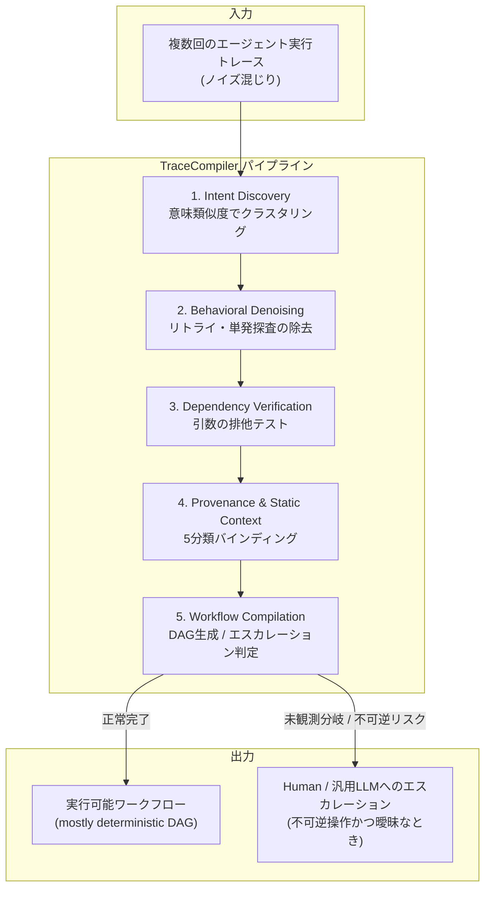

LLMエージェントに同じ仕事を何度もやらせていると、ある違和感に気づきます。10回目の実行でも、エージェントは1回目とほぼ同じ量だけ考え、同じようにAPIスキーマを確認し、同じように試行錯誤するのです。

この「再導出の浪費」を、過去の実行履歴そのものを材料にして解消しようとするのが **TraceCompiler** です。2026年8月にarXivで公開された論文([arXiv:2608.02680](https://arxiv.org/abs/2608.02680))で提案されました。

この記事では次の3点を扱います。

- TraceCompilerが実行履歴から何を取り出し、何を捨てるのか
- 「隣り合って呼ばれた」を依存関係とみなさない、引数レベルの検証という中核アイデア
- 自分たちのエージェント自動化に、どの部分をどの順で持ち込めるか

論文の全手法を網羅するのではなく、設計判断として再利用できる考え方に絞って整理します。

*この記事の全体像。以下、順に解説します。*

## 何を解いている論文か

エージェントの実行トレース(ツール呼び出しの履歴)には、性質の異なる2種類の情報が混ざっています。

| 種類 | 中身 | 再利用価値 |
|---|---|---|
| 再利用可能な構造 | 必須ツール、データ依存、分岐条件 | 高い |
| 偶発的な履歴 | リトライ、中断された探索、たまたまの実行順序、スキーマ確認の単発呼び出し | ない |

人間がSKILL.mdのような手順書を書くとき、暗黙にやっているのは前者だけを抜き出す作業です。TraceCompilerはこれを自動化し、同じインテント(目的)を持つノイズ混じりのトレース群から、**ほぼ決定的なワークフロー(mostly deterministic workflows)をDAGとしてコンパイル**します。

「ほぼ」が付くのは、すべてを決定的にはしないためです。意味的な判断が本当に必要なノードだけをLLM実行として残し、それ以外は静的に解決します。そして後述するとおり、危険かつ曖昧なケースでは**コンパイル自体を拒否**します。

処理は5フェーズです。

各フェーズの役割は次のとおりです。

1. **Intent Discovery**: 多様な対話ログから、同じ目的(例: 「Venmoで請求を送る」)のトレースをコサイン類似度でまとめる。
2. **Behavioral Denoising**: APIドキュメント閲覧のような出力が使われない呼び出し(`dead_output`)や、引数を変えて再試行した失敗呼び出し(`retry`)を落とす。
3. **Dependency Verification**: 後続ツールの引数に入った値の出処を、前段の全ツールとユーザー入力に対して検証する。
4. **Provenance & Static Context**: 各引数を5種類に分類し、不変なものはビルド時に固定する。
5. **Workflow Compilation**: 静的に解けるツール呼び出しを消し、決定的ノードと最小限のLLMノードで実行可能な形にする。

## 中核: 「隣接」ではなく「引数の出処」で依存を決める

ここが論文のいちばん重要な主張です。

従来のプロセスマイニングや順序ベースの自動化は、ツールAの直後にツールBが呼ばれたという事実(Adjacency)や、その並びの出現頻度(Directly-follows)から依存関係を推定します。しかしエージェントのログでは、この推定はよく外れます。単に文脈上たまたまその順で呼ばれただけ、というケースが多いためです。

TraceCompilerが見るのは順序ではなく引数です。後続ツール `B` の引数に含まれる値 `v` について、次を確認します。

- `v` は前段ツール `A` の出力に現れるか
- `v` はユーザーの依頼文に現れないか
- `v` は埋め込まれた文脈やデフォルト値に由来しないか
- `v` は `A` 以外のどのツール出力からも生成され得ないか

これらの**排他(Exclusion)がすべて成立したときだけ**、`A → B` を確定依存(Hard Edge)とします。証拠が足りない関係は `suspected` としてマークし、DAGの順序制約からは外します。

さらに、判定は証拠タプル `⟨consumer, arg_path, value, presumed producer, exclusions⟩` として残されます。「なぜこのエッジを引いたか」が後から検証できる形になっている点は、自動抽出をプロダクションで信じるうえで実務的に重要です。

判定の対比を整理します。

| 観点 | Adjacency / Directly-follows | TraceCompiler |
|---|---|---|
| 判定材料 | 呼び出し順序・頻度 | 引数値の出処 |
| 誤検出の主因 | 文脈上の偶然の並び | 排他しきれない同値 |
| 確証がないとき | エッジを引いてしまう | `suspected` に落として制約から除外 |
| 根拠の追跡 | 困難 | 証拠タプルとして保持 |

## 引数を5つに分類して、実行時の仕事を減らす

依存が確定したあと、各引数は次の5分類のいずれかにバインドされます。この分類が、実行時にどれだけLLMを呼ぶかを直接決めます。

| 分類 | 意味 | 実行時のコスト |
|---|---|---|
| `constant` | 過去の全トレースで不変。ビルド時に静的解決 | ゼロ(呼び出しごと消える) |
| `user_input` | 依頼プロンプトから動的に抽出 | 抽出のみ |
| `copy_edge` | 前段ツールの出力をそのまま引き継ぐ | ゼロ |
| `transform_edge` | 決定的な変換(文字列整形、配列抽出など) | ゼロ |
| `llm_or_dynamic` | 実行時に意味判断や動的選択が必要 | LLM呼び出しが残る |

効いているのは `constant` の扱いです。エージェントが毎回確認していた固定値(エンドポイント、設定値、自分のアカウントIDなど)をビルド時に埋め込むと、その確認のためのツール呼び出しとプロンプトが丸ごと消えます。論文がAPI呼び出し数を大きく削減できているのは、賢い推論の結果ではなく、**確認作業を先に済ませて焼き込んだ**結果です。

逆に言えば、`llm_or_dynamic` として残るノードこそが、そのタスクで本当にLLMが必要な部分です。この分類は「どこを自動化すべきか」の可視化としても読めます。

## 危険かつ曖昧なら、コンパイルしない

TraceCompilerは、送金や削除のような不可逆な副作用を持つ操作について、過去トレースから分岐条件や引数が一意に決まらない場合、**ワークフローの生成を拒否します**(Refuse to compile)。そのうえで `HUMAN` ノードの出力、あるいは汎用LLMエージェントへエスカレーションします。

論文の実例が分かりやすいところです。

- **Spotify / Todoist**: Todoistのタスクから曲を取得してSpotifyのプレイリストへ反映するインテント。ログ上の操作が「追加」なのか「削除」なのか引数から決定できず、コンパイルを拒否。
- **Venmo(送金要求)**: Leave-one-outテストで21件中15件成功。失敗した6件は、過去トレースになかった連絡先検索の分岐に到達し、推測で実行せず中断・エスカレーションした結果。

この6件は「精度が足りなかった失敗」とは意味が違います。未知の状況で止まったのですから、Fail-Closedとしては設計どおりの動作です。自動化の評価指標を成功率だけで置くと、この差が見えなくなります。「止まるべきときに止まったか」を別軸で持つべき、という示唆として読めます。

## 数字で見る効果

依存関係の復元精度は、T1データセット(旅行予約・検索を中心とする3,375ダイアログ、15,775個のdef-use依存エッジ)で評価されています。

| 手法 | Precision | Recall | F1 | 備考 |
|---|---|---|---|---|
| Adjacency(隣接関係) | - | - | 0.711 | 直前のツールを依存とみなす |
| Directly-follows(頻度閾値付き) | - | - | 0.712 | 出現順序の頻度による推定 |
| Mechanized Rule(提案手法・機械化版) | 0.928 | 0.943 | 0.935 | 排他テストと引数検証を実施 |
| Skill Blind Run(提案手法・LLM版) | 0.992 | - | - | 250エッジのブラインド検証 |

95%信頼区間はWilson法で算出されています。順序ベースの推定がF1で0.71前後にとどまるのに対し、引数レベルの検証は0.93台に届いており、差は誤差の範囲ではありません。

実行コスト側の代表例がVenmoインテントです。元のトレースでは34回のAPI呼び出しがあり、うち約半数はスキーマ確認の探査でした。コンパイル後の実行時呼び出しは11回(約67.6%削減)、セッションキャッシュが効く場合は3〜5回まで下がっています。

## 限界とトレードオフ

そのまま適用する前に、論文が明記している限界を押さえておく必要があります。

1. **オフラインのコンパイルコストが未計測**。実行時のAPIコスト削減は示されていますが、クラスタリングや依存抽出に要するLLMトークンコストは測られていません。総合的なROIは保証されていない、と読むべきです。
2. **Skill Engine自体が非決定的**。バージョン固定されていない商用LLMで動くため、モデル更新で抽出結果が変わるリスクがあります。出力ワークフローは決定的でも、それを作る工程は決定的ではありません。
3. **決定性と柔軟性は同時には取れない**。未観測の分岐に当たると即停止するので、汎用エージェントへのフォールバックが前提の構成になります。
4. **評価データに偏りがある**。T1はテンプレート生成データ、AppWorldも単一のReActエージェントのログです。人間ユーザーの雑多なログでどう振る舞うかは今後の課題とされています。
5. **正規化のしすぎが情報を壊す**。ツール名を `app.action` のような共通語彙へ抽象化する際、抽象化が進みすぎると依存を証明していた固有の引数が消え、確定していたエッジが `suspected` に落ちます。

特に1と2は、導入判断に直結します。頻度の低いタスクをコンパイルしても、事前コストを回収できない可能性があるためです。

## 自分の自動化にどう持ち込むか

この論文を、いきなり「実行ログからFlow YAMLを自動生成する」という到達点として読むと、コストの読めない大工事になります。得られる価値の順に分解すると、段階を踏めます。

**第1段階: `constant` の焼き込み**

いちばん安く効きます。エージェントが毎回確認している不変値 - リポジトリのパス、設定ファイルの位置、APIのバージョン、自分のアカウントID - を洗い出し、手順書やスクリプトに定数として書き込みます。実行ログを機械的にコンパイルしなくても、頻出する確認系ツール呼び出しを数えるだけで候補は見つかります。

**第2段階: Fail-Closedの境界を先に引く**

不可逆な操作(公開、push、送信、決済、削除)を列挙し、「過去に例のない分岐に来たらLLMに推測させず人へ渡す」という制御を先に入れます。これはコンパイルの有無に関係なく単体で価値があり、後で自動化を進めるときの安全網にもなります。論文の貢献は、この設計に「自動抽出の側から見ても正しい」という裏付けを与えた点です。

**第3段階: 依存関係の抽出**

ここで初めて、実行履歴から依存DAGを起こす話になります。持ち込むべきは手法そのものより判定基準です。すなわち、**呼び出し順序を依存の根拠にしない**、**確証のない依存は制約に使わず`suspected`として保留する**、**根拠を証拠タプルとして残す**の3点です。この基準は、自動抽出ではなく人がワークフローを設計するときにも、そのまま品質基準として使えます。

**第4段階: 決定的コードへの変換**

高頻度かつ分岐の安定した処理だけを対象に、ワークフロー定義やスクリプトへ落とします。対象を絞るのは、限界1(コンパイルコスト未計測)への現実的な対処です。

## まとめ

TraceCompilerの要点を5つに絞ります。

- エージェントの実行履歴には再利用可能な構造と偶発的なノイズが混在し、前者だけを取り出せば実行時の仕事は大きく減る。
- 依存関係の判定は呼び出し順序ではなく**引数値の出処の排他検証**で行う。T1データセットでF1 0.935に対し、順序ベースは0.71前後にとどまる。
- 引数を5分類してビルド時に静的解決することで、Venmoインテントでは34回のAPI呼び出しが11回まで減った。
- 不可逆な操作で曖昧さが残るときは、コンパイルを拒否して人へエスカレーションする。止まったこと自体が正しい動作である。
- ただしオフラインのコンパイルコストは未計測で、抽出エンジン自体も非決定的。適用は高頻度・安定分岐のタスクから絞るのが現実的。

自分の自動化に取り入れるなら、`constant` の焼き込みとFail-Closedの境界設定という安い2つから始めるのが妥当です。依存抽出の自動化はその先で、判定基準だけなら今日から人手の設計にも流用できます。

この記事が少しでも参考になった、あるいは改善点などがあれば、ぜひリアクションやコメント、SNSでのシェアをいただけると励みになります！

## 参考リンク

- [TraceCompiler: Skill-Guided Mining and Compilation of LLM Agent Traces into Mostly Deterministic Workflows (arXiv:2608.02680)](https://arxiv.org/abs/2608.02680) - 本記事の元論文
- T1 Dataset: Chakraborty et al., "T1: A tool-oriented conversational dataset for multi-turn agentic planning", NeurIPS 2025 Datasets and Benchmarks
- AppWorld Benchmark: Stony Brook NLP, "AppWorld: Environment and Evaluation for Benchmarking LLM Agents", 2024
