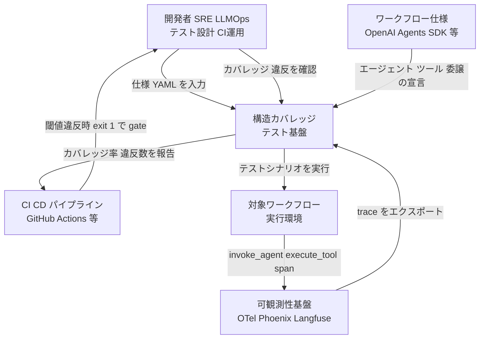
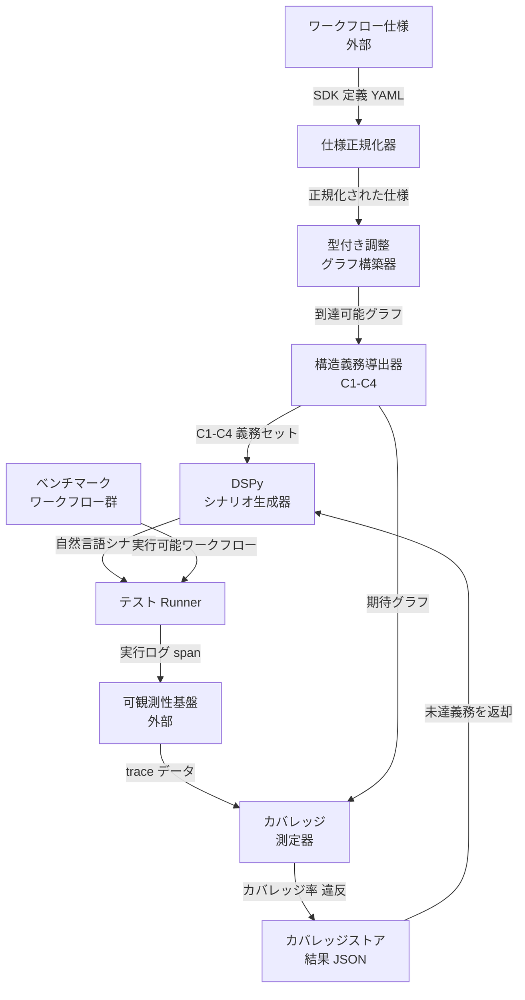
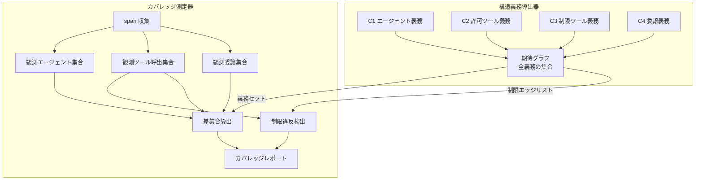
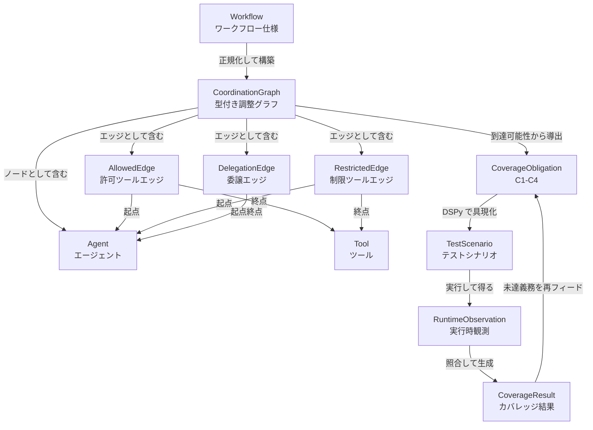
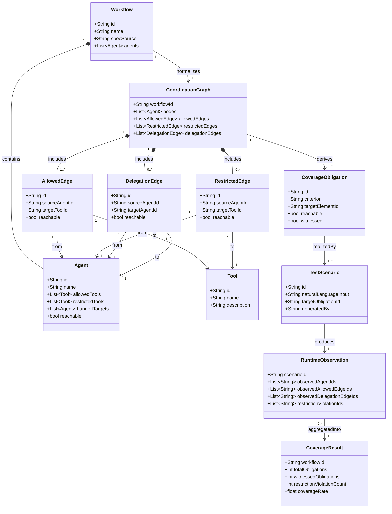

> 対象論文: Nafiseh Kahani (Carleton University) / Mojtaba Bagherzadeh (Cisco Systems), arXiv:2605.26521 (2026-05-26 提出)
> 調査日: 2026-05-28 / 想定読者: 実装エンジニア・SRE・LLMOps

## 概要

マルチエージェントシステムの品質評価は、長らく「最終タスクの成功率 (final success rate / pass@k)」が主流でした。しかしこの指標には構造的な死角があります。「正しい答えは出たが、本来通すべき委譲エッジを実際には踏んでいない」「通してはいけないツール経路を誤って通っていた」という**構造的退行 (structural regression)** を、最終成功率は検出できません。

本論文はこの死角を埋めるため、ソフトウェアテストの古典である**構造カバレッジ (structural coverage)**、つまり文網羅・分岐網羅・MC/DC の系譜を、マルチエージェントワークフローに移植します。ワークフローを**型付き調整グラフ (typed coordination graph)** として表現し、到達可能なノードとエッジから4種のカバレッジ義務を導きます。そして DSPy でカバレッジ目標を満たす自然言語テストシナリオを生成し、実行時の観測からカバレッジ率を測ります。

注目すべきは、著者自身が本手法を**「semantic / end-to-end 評価を置き換えるものではなく、それを補完する中間的な adequacy layer」**と明言している点です。最終成功率の廃止を主張するのではなく、静的に構造が宣言されたワークフローに限り、成功率評価を補う中間指標として機能します。本記事もこの射程を尊重し、「成功率評価を補完する経路テストの軸」として扱います。

## 特徴

- **型付き調整グラフ表現**: ワークフローを「エージェント (ノード)」「許可された agent-tool エッジ」「制限された agent-tool エッジ」「agent-agent 委譲エッジ」からなる型付きグラフに正規化します。到達可能性から構造義務を機械的に導きます。OpenAI Agents SDK の宣言的仕様がそのまま入力になります。

- **C1-C4 の4カバレッジ基準**: ソフトウェアテストの Node Coverage / Edge Coverage に対応する4基準を定義します。
  - **C1 エージェントカバレッジ**: 到達可能な各エージェントを少なくとも1テストで観測 (Node Coverage)
  - **C2 許可ツールカバレッジ**: 到達可能な各「許可 agent-tool エッジ」を実行 (Edge Coverage)
  - **C3 制限ツールカバレッジ**: 到達可能な各「制限 agent-tool エッジ」を explicit restricted-access 観測として検査 (ネガティブテスト)
  - **C4 委譲カバレッジ**: 到達可能な各「委譲エッジ」を観測 (Edge Coverage / handoff)

- **DSPy カバレッジ駆動シナリオ生成**: 構造義務を DSPy の Signature / Module として定義し、義務ごとにカバレッジを満たす自然言語テストシナリオを生成します。パイプラインは5段階です。仕様正規化、グラフ構築、義務導出、DSPy シナリオ生成、実行時カバレッジ測定。

- **実行時観測カバレッジ測定**: テスト実行時にどのエージェント・ツール・委譲が動いたかを観測します。「期待グラフの義務集合」と「実際に観測されたエッジ集合」の差分で、カバレッジ率と未到達構造を定量化します。

- **制限ツールエッジ検査 (C3) が新規軸**: 最終成功率も trajectory 評価も「通ってはいけない経路を通っていないか」を構造的に検査しません。C3 は**踏んではいけないツールエッジを意図的に誘発する入力を生成し、それが踏まれてしまわないかを検査**します。航空ソフト (DO-178C) の異常系テストや FSM テストの「不正遷移検査」に相当し、従来のエージェント評価で抜けていた軸です。

- **trajectory 評価との関係**: LangSmith agentevals などの trajectory 評価は、LLM-as-judge やシーケンス照合で「観測した1経路が妥当か (何をしたか)」を測ります。本手法はこれと競合せず相補的で、「宣言した全構造要素をテスト集合が網羅したか (何を踏んだか)」を確定的に測ります。前者は到達した経路の品質、後者は未到達構造の可視化を担います。

### 評価結果サマリ

OpenAI Agents SDK 由来の10ベンチマークワークフロー (oai_customer_service 等) で評価しました。

| 項目 | 値 |
|---|---|
| ベンチマーク数 | 10 |
| 到達可能エージェント / ツール | 49 / 47 |
| 構造義務 総数 | 403 (C1=49, C2=65, C3=248, C4=41) |
| C2 許可ツール達成 | 45/65 (69.2%) |
| C4 委譲達成 | 31/41 (75.6%) |
| C3 制限違反 検出 | 23/248 |
| 総実行時間 / LM 呼び出し | 39,216 秒 / 3,637 回 |

研究質問への回答は次のとおりです。

- RQ1: 全10ワークフローで有効な協調グラフと義務セットを抽出可能
- RQ2: 許可45/65・委譲31/41を達成
- RQ3: 制限違反23/248を検出し構造的弱点を露呈
- RQ4: 障害注入下でも堅牢性検証可能 (2/2)

> 数値注記: 論文 abstract では許可 54/75・委譲 36/48 と記載され、本文 Table II の 45/65・31/41 と差異があります。本記事は Table I/II の内訳合計が総義務 403 と整合する (49+65+248+41=403) 本文 Table II の値を採用しました。abstract の数値は特定サブセットを指す可能性があり、論文側で両者の差は明示説明されていません。

## 構造

提案フレームワークの論理構造を C4 として描きます。具体システムではなく方法論の構造である点に留意してください。

### システムコンテキスト図

フレームワーク全体を外から見た関係者と外部システムの接点です。



| 要素名 | 説明 |
|---|---|
| 開発者 SRE LLMOps | ワークフロー仕様の記述・テスト結果のレビュー・CI ゲート閾値の管理 |
| 構造カバレッジテスト基盤 | 仕様正規化からカバレッジ測定までの5段階を担う本体 |
| ワークフロー仕様 | OpenAI Agents SDK 等で宣言されたエージェント・ツール・委譲の静的定義 |
| CI CD パイプライン | カバレッジ閾値・制限違反数に基づく品質ゲート |
| 可観測性基盤 | OTel GenAI semantic conventions 準拠の trace 収集 |
| 対象ワークフロー | テスト対象の実行環境。invoke_agent / execute_tool span を発行 |

### コンテナ図

テスト基盤内部の主要コンポーネントとデータフローです。



| 要素名 | 説明 |
|---|---|
| 仕様正規化器 | SDK 等の宣言を均一な内部表現に変換。4種エッジを分類 (論文 Step 1) |
| 型付き調整グラフ構築器 | 到達可能性解析で dead node / dead edge を除外 (論文 Step 2) |
| 構造義務導出器 | グラフから C1-C4 義務セットを列挙 (論文 Step 3) |
| DSPy シナリオ生成器 | 未達義務から自然言語シナリオを具現化。refinement ループで再生成 (論文 Step 4) |
| カバレッジ測定器 | trace span と期待グラフを比較し差集合を算出 (論文 Step 5) |
| ベンチマークワークフロー群 | OpenAI Agents SDK 由来 10 ワークフロー (49 エージェント / 47 ツール / 403 義務) |
| テスト Runner | シナリオを受け取り対象を実行。OTel span を送出 |
| カバレッジストア | カバレッジ率・制限違反数を JSON で蓄積。CI ゲートの入力 |

### コンポーネント図

「構造義務導出器」から「カバレッジ測定器」へのドリルダウンです。



| 要素名 | 説明 |
|---|---|
| C1 エージェント義務 | 到達可能な各エージェントが1テストで invoke_agent span として観測されるべき義務 |
| C2 許可ツール義務 | 到達可能な各許可 agent-tool エッジが execute_tool span として出現すべき義務 |
| C3 制限ツール義務 | 到達可能な各制限 agent-tool エッジが出現しないことを確認する義務 (出現したら違反) |
| C4 委譲義務 | 到達可能な各 handoff エッジが invoke_agent 親子 span として観測されるべき義務 |
| 期待グラフ | C1-C4 全義務の合成。評価合計 403 義務 |
| span 収集 | OTel GenAI conventions の invoke_agent / execute_tool span を取得 |
| 観測エージェント集合 | trace に出現した gen_ai.agent.name の集合 |
| 観測ツール呼出集合 | trace に出現した agent tool ペアの集合 |
| 観測委譲集合 | invoke_agent 親子 span から抽出した handoff ペアの集合 |
| 制限違反検出 | 制限エッジリストと観測ツール集合の積を検査。評価では 248 中 23 件を検出 |
| 差集合算出 | 期待グラフのエッジ集合から観測集合を引いた未達義務 |
| カバレッジレポート | C1-C4 達成率・違反数・未到達一覧を JSON 出力。CI ゲートの入力 |

## データ

### 概念モデル

提案手法が扱う主要概念とその関係です。



| 要素名 | 説明 |
|---|---|
| Workflow | OpenAI Agents SDK 等で静的に宣言されたマルチエージェントワークフロー仕様 |
| Agent | ワークフロー内の実行単位。LLM とツール集合と委譲先リストを持つノード |
| Tool | エージェントが呼び出せる関数 API。許可 制限の2種エッジで Agent と結ぶ |
| AllowedEdge | エージェントが使用を許可されたツールへの有向エッジ。C2 の対象 |
| RestrictedEdge | エージェントが使用を禁じられたツールへの有向エッジ。C3 の対象 |
| DelegationEdge | エージェント間の委譲 handoff を表す有向エッジ。C4 の対象 |
| CoordinationGraph | Agent をノード、3種エッジを辺とする型付き有向グラフ |
| CoverageObligation | C1-C4 各基準に対応する「到達可能な構造要素を1回観測する」義務の単位 |
| TestScenario | DSPy が生成するカバレッジ義務充足を目的とした自然言語テスト入力 |
| RuntimeObservation | テスト実行後にトレースから収集した実測記録 |
| CoverageResult | 各義務が witnessed か否か、制限違反の有無をまとめた計測結果 |

### 情報モデル

各エンティティの属性です。論文に明示されない属性は備考で「推測」と注記します。



| 要素名 | 説明 |
|---|---|
| Workflow | id name specSource agents。name agents は論文記述、id specSource は推測 |
| Agent | allowedTools=C2、restrictedTools=C3、handoffTargets=C4、reachable=C1 の基。id 以外は論文記述 |
| Tool | name は論文記述、id description は推測 |
| AllowedEdge | sourceAgentId targetToolId reachable。C2 義務の前提。id 以外は論文記述 |
| RestrictedEdge | sourceAgentId targetToolId reachable。C3 義務の前提。id 以外は論文記述 |
| DelegationEdge | sourceAgentId targetAgentId reachable。C4 義務の前提。id 以外は論文記述 |
| CoordinationGraph | 到達可能性解析後のグラフ。論文記述 |
| CoverageObligation | criterion ∈ C1-C4、reachable witnessed は論文記述、id targetElementId は推測 |
| TestScenario | naturalLanguageInput generatedBy は論文記述、id targetObligationId は推測 |
| RuntimeObservation | 観測集合は論文記述、scenarioId は推測 |
| CoverageResult | 件数は論文記述、coverageRate は推測。義務総数 403、制限違反 23 等 |

CoverageObligation の criterion 値とソフトウェアテスト対応は次のとおりです。

| 要素名 | 説明 |
|---|---|
| C1 | Agent (reachable) を対象。Node Coverage に対応 |
| C2 | AllowedEdge (reachable) を対象。Edge Coverage 正常系 |
| C3 | RestrictedEdge (reachable) を対象。ネガティブテスト 不正遷移検査 |
| C4 | DelegationEdge (reachable) を対象。Edge Coverage 委譲 |

## 構築方法

> 以下の「実装案 / 例」と表記したコードは論文の主張ではなく、論文の概念を既存ツールで実現するための実装例です。補完元 URL を各ブロックに明記します。

構造カバレッジ計測を自前で組む手順は3ステップです。

1. ワークフローを期待グラフ (YAML) として宣言する
2. C1-C4 義務を列挙する
3. OTel GenAI instrumentation で span を出す

### 期待グラフを YAML で宣言する (実装案/例)

> 補完元: 論文 arXiv:2605.26521 のグラフ定義概念を YAML として具体化

```yaml
# expected_graph.yaml — 型付き調整グラフ宣言 (実装案/例)
agents:
  - id: triage_agent
    description: "ユーザー入力を分類し適切なエージェントに委譲"
  - id: sales_agent
    description: "製品・購入に関する問い合わせを処理"
  - id: refund_agent
    description: "返金・クレームを処理"

# C2: 許可ツールエッジ
allowed_tool_edges:
  - { agent: triage_agent, tool: get_user_info }
  - { agent: sales_agent,  tool: get_product_catalog }
  - { agent: sales_agent,  tool: create_order }
  - { agent: refund_agent, tool: issue_refund }
  - { agent: refund_agent, tool: get_order_history }

# C3: 制限ツールエッジ (通ってはいけない組み合わせ)
restricted_tool_edges:
  - { agent: triage_agent, tool: issue_refund, reason: "triage は返金処理権限なし" }
  - { agent: sales_agent,  tool: issue_refund, reason: "sales は返金権限なし" }

# C4: 委譲エッジ (handoff)
handoff_edges:
  - { from: triage_agent, to: sales_agent }
  - { from: triage_agent, to: refund_agent }
```

### C1-C4 義務を列挙する (実装案/例)

> 補完元: 論文 arXiv:2605.26521 の義務導出ロジック概念を Python 実装例として具体化

```python
# obligations.py — YAML から C1-C4 義務を生成 (実装案/例)
from dataclasses import dataclass
from typing import Literal
import yaml

ObligationType = Literal["C1_agent", "C2_allowed_tool", "C3_restricted_tool", "C4_handoff"]

@dataclass
class Obligation:
    type: ObligationType
    agent: str
    target: str  # tool 名 or 委譲先 agent 名
    reason: str = ""

def load_obligations(graph_yaml_path: str) -> list[Obligation]:
    with open(graph_yaml_path) as f:
        g = yaml.safe_load(f)
    obligations: list[Obligation] = []
    for a in g.get("agents", []):                      # C1
        obligations.append(Obligation("C1_agent", a["id"], a["id"]))
    for e in g.get("allowed_tool_edges", []):          # C2
        obligations.append(Obligation("C2_allowed_tool", e["agent"], e["tool"]))
    for e in g.get("restricted_tool_edges", []):       # C3
        obligations.append(Obligation("C3_restricted_tool", e["agent"], e["tool"], e.get("reason", "")))
    for e in g.get("handoff_edges", []):               # C4
        obligations.append(Obligation("C4_handoff", e["from"], e["to"]))
    return obligations
```

### OTel GenAI instrumentation で span を出す (実装案/例)

> 補完元: OTel GenAI agent spans spec (Development) https://opentelemetry.io/docs/specs/semconv/gen-ai/gen-ai-agent-spans/

```python
# instrumentation.py — OTel GenAI span を emit する薄いラッパー (実装案/例)
from opentelemetry import trace
from opentelemetry.sdk.trace import TracerProvider
from opentelemetry.sdk.trace.export import SimpleSpanProcessor
from opentelemetry.sdk.trace.export.in_memory_span_exporter import InMemorySpanExporter
from opentelemetry.trace import SpanKind

exporter = InMemorySpanExporter()  # 本番では OTLPSpanExporter に差し替え
provider = TracerProvider()
provider.add_span_processor(SimpleSpanProcessor(exporter))
trace.set_tracer_provider(provider)
tracer = trace.get_tracer("agent-coverage")

def invoke_agent_span(agent_name: str, conversation_id: str):
    """invoke_agent span。remote=CLIENT / local framework 実行=INTERNAL"""
    return tracer.start_as_current_span(
        f"invoke_agent {agent_name}", kind=SpanKind.CLIENT,
        attributes={
            "gen_ai.operation.name": "invoke_agent",
            "gen_ai.agent.name": agent_name,
            "gen_ai.conversation.id": conversation_id,
        },
    )

def execute_tool_span(agent_name: str, tool_name: str, call_args: str = ""):
    """execute_tool span の SpanKind は仕様上 INTERNAL"""
    return tracer.start_as_current_span(
        f"execute_tool {tool_name}", kind=SpanKind.INTERNAL,
        attributes={
            "gen_ai.operation.name": "execute_tool",
            "gen_ai.agent.name": agent_name,
            "gen_ai.tool.name": tool_name,
            "gen_ai.tool.call.arguments": call_args,
        },
    )
```

## 利用方法

テスト実行とカバレッジ算出の流れは次のとおりです。

```
[期待グラフ YAML] + [テストシナリオ] -> [エージェント実行] -> [OTel span 収集]
                                                          -> [カバレッジ集計]
                                                          -> [カバレッジ率 / 制限違反 / 未到達一覧]
```

### カバレッジ集計スクリプト (実装案/例)

OTel span から agent tool ペアと handoff を集め、期待グラフのエッジ集合との差集合でカバレッジ率と制限違反を算出します。

> 補完元: 論文 arXiv:2605.26521 のカバレッジ算出概念 + opentelemetry-python https://opentelemetry-python.readthedocs.io/

```python
# coverage_report.py — span 集合 × 期待グラフ → カバレッジ算出 (実装案/例)
from dataclasses import dataclass
from obligations import load_obligations, Obligation

@dataclass
class CoverageResult:
    c1_covered: list; c1_missing: list
    c2_covered: list; c2_missing: list
    c3_violations: list   # 出てはいけないのに出た
    c3_confirmed: list    # 出てはいけなくて出なかった (正常)
    c4_covered: list; c4_missing: list

def compute_coverage(obligations, observed_agents, observed_tool_edges, observed_handoffs):
    r = CoverageResult([], [], [], [], [], [], [], [])
    for ob in obligations:
        if ob.type == "C1_agent":
            (r.c1_covered if ob.agent in observed_agents else r.c1_missing).append(ob.agent)
        elif ob.type == "C2_allowed_tool":
            pair = (ob.agent, ob.target)
            (r.c2_covered if pair in observed_tool_edges else r.c2_missing).append(pair)
        elif ob.type == "C3_restricted_tool":
            pair = (ob.agent, ob.target)
            (r.c3_violations if pair in observed_tool_edges else r.c3_confirmed).append(pair)
        elif ob.type == "C4_handoff":
            pair = (ob.agent, ob.target)
            (r.c4_covered if pair in observed_handoffs else r.c4_missing).append(pair)
    return r

def extract_observations_from_spans(spans):
    """FinishedSpan リストから観測セットを返す。親子スパン関係から handoff を近似検出"""
    observed_agents, observed_tool_edges, observed_handoffs = set(), set(), set()
    span_agent: dict = {}
    for span in spans:
        attrs = dict(span.attributes or {})
        op, agent = attrs.get("gen_ai.operation.name", ""), attrs.get("gen_ai.agent.name", "")
        if op == "invoke_agent" and agent:
            observed_agents.add(agent)
            span_agent[span.context.span_id] = agent
            parent_id = span.parent.span_id if span.parent else None
            if parent_id and parent_id in span_agent:
                observed_handoffs.add((span_agent[parent_id], agent))
        elif op == "execute_tool":
            tool = attrs.get("gen_ai.tool.name", "")
            if agent and tool:
                observed_tool_edges.add((agent, tool))
    return observed_agents, observed_tool_edges, observed_handoffs
```

実運用では生 span ではなく Arize Phoenix や Langfuse のエクスポートを入力にする方が確実です。

### DSPy でカバレッジ駆動シナリオを生成する (実装案/例)

> 補完元: DSPy 公式 https://dspy.ai/ の Signature / ChainOfThought パターン。論文の主張ではなく概念の再現実装例

```python
# scenario_generator.py — DSPy でカバレッジ駆動シナリオ生成 (実装案/例)
import dspy
from obligations import Obligation

class ScenarioFromObligation(dspy.Signature):
    """未カバー構造義務を満たすテストシナリオ (ユーザー入力) を生成する。"""
    obligation_type: str = dspy.InputField(desc="C1/C2/C3/C4 のいずれか")
    agent_name: str = dspy.InputField(desc="対象エージェント名")
    target: str = dspy.InputField(desc="ツール名 or 委譲先エージェント名")
    workflow_description: str = dspy.InputField(desc="ワークフロー全体の説明")
    scenario: str = dspy.OutputField(desc="対象エージェント起動 ツール実行を誘発する入力テキスト")

class CoverageDrivenScenarioGenerator(dspy.Module):
    def __init__(self):
        self.generate = dspy.ChainOfThought(ScenarioFromObligation)
    def forward(self, obligation: Obligation, workflow_desc: str) -> str:
        pred = self.generate(
            obligation_type=obligation.type, agent_name=obligation.agent,
            target=obligation.target, workflow_description=workflow_desc)
        return pred.scenario

# temperature=0 推奨だが完全な決定性は保証されない (後述のベストプラクティス参照)
dspy.configure(lm=dspy.LM("openai/gpt-4o-mini", temperature=0))
```

### pytest と promptfoo で CI に組み込む (実装案/例)

> 補完元: pytest https://docs.pytest.org/ / promptfoo CI/CD https://www.promptfoo.dev/docs/integrations/ci-cd/

```python
# test_workflow_coverage.py — pytest + OTel カバレッジ検証 (実装案/例)
import pytest
from instrumentation import exporter
from obligations import load_obligations
from coverage_report import compute_coverage, extract_observations_from_spans

GRAPH_YAML = "expected_graph.yaml"

@pytest.fixture(autouse=True)
def clear_spans():
    exporter.clear(); yield; exporter.clear()

@pytest.mark.parametrize("scenario", [
    "商品Aの在庫状況を教えてください",
    "先週の注文を返金してください",
    "プランのアップグレードを検討しています",
])
def test_no_c3_violation(scenario):
    run_workflow(scenario)  # OpenAI Agents SDK の runner.run() 等を呼ぶ
    obligations = load_obligations(GRAPH_YAML)
    obs = extract_observations_from_spans(exporter.get_finished_spans())
    result = compute_coverage(obligations, *obs)
    assert result.c3_violations == [], f"C3 制限違反: {result.c3_violations}"
```

```yaml
# promptfooconfig.yaml — 構造カバレッジ検査の assert 例 (実装案/例)
description: "エージェントワークフロー 構造カバレッジテスト"
providers:
  - id: openai:gpt-4o-mini
    config: { temperature: 0 }
prompts: ["{{scenario}}"]
tests:
  - description: "triage_agent が issue_refund を呼ばない C3 制限"
    vars: { scenario: "すぐに返金してください triage に直接送る" }
    assert:
      - type: not-contains
        value: "execute_tool:triage_agent:issue_refund"
```

## 運用

### prevent と detect の二層分離

制限エッジに対しては、止める (prevent) 層と検査する (detect) 層を分けて設計します。どちらか一方では穴が生まれます。

prevent 層は副作用の前に実行をブロックします。

```jsonc
// Claude .claude/settings.json — deny ルール (settings.json は JSON 形式)
{
  "permissions": {
    "deny": [
      "Bash(rm -rf *)",
      "mcp__payment__charge"
    ]
  }
}
```

- `deny` ルールは allow ルールより前に評価され、どのスコープの deny も優先されます。ただし `bypassPermissions` モードとの厳密な関係は公式に明示されていないため、security-critical な制限は deny ルールと sandbox の両方で担保します。
- OpenAI Agents SDK では blocking モードの guardrail が副作用実行前に tripwire を raise して停止します。

detect 層は guardrail の対象外になる handoff をカバレッジ検査で後追いします。OpenAI Agents SDK の tool guardrail は `function_tool` 製ツールに適用される一方、handoff (委譲) は guardrail パイプラインの対象外になりえます。per-tool の認可制御はまだ SDK の一級機能として確立しておらず、追加提案として議論されている段階です。禁止委譲経路は guardrail だけでは止めきれないため、trace の事後検査 (C4 委譲カバレッジと C3 制限検査) が必要になります。

| 要素名 | 説明 |
|---|---|
| 制限ツールエッジ function_tool | prevent は SDK tool guardrail blocking / deny ルール、detect は C3 カバレッジ検査 |
| 禁止 handoff 委譲エッジ | prevent は guardrail 非対応 (仕様上の穴)、detect は C4 委譲カバレッジ検査で後追い |
| MCP ツール | prevent は deny ルール、detect は mcp.method.name tools/call span の監査 |

### OTel GenAI による計測配管

論文の4エッジは OpenTelemetry GenAI semantic conventions に直接対応します。新規インフラは不要です。なおマルチエージェントの最上位実行は `gen_ai.operation.name=invoke_workflow` span になることがあり (`create_agent` / `invoke_agent` / `invoke_workflow` の3値が定義される)、観測時は invoke_workflow 配下の invoke_agent を辿る点に注意します。

| 要素名 | 説明 |
|---|---|
| 到達可能エージェント C1 | gen_ai.operation.name invoke_agent の gen_ai.agent.name |
| 許可ツールエッジ C2 | gen_ai.operation.name execute_tool の agent tool ペア |
| 制限ツールエッジ C3 | 同ペアが restricted_tool_edges に一致したら即アラート |
| 委譲エッジ C4 | invoke_agent の親子 span 関係 |

収集先は Arize Phoenix (OTel ネイティブ OSS)、Langfuse (OTel 互換)、LangSmith の trace export がそのまま入力になります。なお OTel GenAI semantic conventions は 2026-05 時点で Development (experimental) ステータスであり、属性名は今後変わりえます。

### CI gate はまず観測指標、ハード gate 化は後

構造カバレッジを即座に CI のハード gate にするのは避けます。論文自身が C2 45/65 (69%)、C4 31/41 (76%) しか達成できておらず、100% 閾値は恒常的に赤になります。次の段階を踏みます。

```
Phase 1 観測: trace を Phoenix/Langfuse に流して coverage/violation をダッシュボード表示。閾値なし
Phase 2 ソフト: CI で coverage < 60% / 制限違反 > 0 を warning 表示。fail はしない
Phase 3 ハード: ゲーミングが発生しないことを確認してから exit 1 を有効化
```

## ベストプラクティス

構造カバレッジ運用の落とし穴を「誤解、反証、推奨」の構造で整理します。

### カバレッジ 100% を品質保証と捉える誤信

- **誤解**: 構造カバレッジ率を上げれば品質が保証される。
- **反証**: ソフトウェアテストでは「100% カバレッジでもバグは残る」「coverage を target 化するとゲーミングされる」が確立した知見です。「経路を実行した」は「正しく振る舞った」を意味しません (オラクル問題)。
- **推奨**: カバレッジ率は最終成功率や end-to-end 評価と並走させる補完指標として位置づけます。制限違反の有無 (C3) は明確な判定で信頼性が高い一方、C2/C4 の達成率は「未到達エッジの存在を知らせるシグナル」として使います。

### 構造カバレッジで成功率評価を置き換えられるという誤信

- **誤解**: 構造カバレッジが通れば最終出力の評価は不要になる。
- **反証**: 論文著者自身が「semantic / end-to-end 評価を置き換えない中間 adequacy layer」と明記しています。process reward と final outcome の改善が必ずしも整合しないことも報告されています。
- **推奨**: 「最終成功率 gate (機能テスト) と構造カバレッジ gate (経路テスト)」の二軸を AND 条件で並走させます。

### 動的トポロジにも適用できるという誤信

- **誤解**: 実行時に構成が変わるエージェント群にも適用できる。
- **反証**: 本手法はワークフロー構造が静的に宣言される前提に依存します。AgentConductor・DyLAN・DIG・WARPP など実行時にトポロジを生成・編集・剪定する動的型では静的グラフが抽出できず、義務を事前定義できません。
- **推奨**: 静的宣言型ワークフロー (OpenAI Agents SDK の handoffs 定義、LangGraph の graph compile 等) に限定して適用します。動的型には実行後グラフからの retrospective なカバレッジ算出を検討しますが、現時点では研究上の課題です。

### DSPy 生成テストで CI 判定できるという誤信

- **誤解**: LLM / DSPy でカバレッジ目標テストを自動生成し、CI の決定論的判定に使える。
- **反証**: LLM 生成テストは flaky 比率が高く、temperature=0 でも非決定的でカバレッジ判定が再現しません。LLM テストオラクルは actual behavior (バグも含む) を固定化しがちで、正答率が 50% 未満との報告もあります。
- **推奨**: 生成テストはシナリオ候補の Draft として扱い、人手レビューを経て `tests/scenarios/` に固定します。CI の決定論的 gate には「agent tool ペアの出現有無」「制限違反の有無」といった trace の構造的事実を使います。

## トラブルシューティング

### 制限義務の大半 (248 中 23、約 9%) しか違反検出されない

- **現象**: C3 制限ツールカバレッジを実行しても、制限違反が期待より検出されません。論文でも 248 義務中 23 件しか確認できていません。
- **原因**: 制限エッジの大半が到達不能 (dead edge) か、テストシナリオが誘発に失敗しています。
- **対処**:
  1. 未検出エッジを列挙し到達可能かを仕様レビューで確認。到達不能なら仕様の過剰定義として制限定義を削除するか、到達するシナリオを追加します。
  2. テストシナリオの誘発力を強化。制限ツール名を直接言及する、権限昇格を試みる入力を red-team ケースとして明示します。
  3. 週次で到達不能エッジ一覧をレビューする運用を設けます。

### 生成テストが flaky でカバレッジ判定が安定しない

- **現象**: 同じワークフローでも実行ごとにカバレッジ率が変動し、CI の緑赤が安定しません。
- **原因**: LLM (DSPy) によるシナリオ生成の非決定性です。
- **対処**:
  1. テストシナリオをコード管理に固定 (`tests/scenarios/` に YAML/JSON でコミット)。CI は固定シナリオのみ使用します。
  2. カバレッジ判定を LLM に依存させず、trace の agent tool ペアの出現有無など構造的事実のみで行います。
  3. やむなく LLM 判定を使う場合は同一シナリオを複数回実行して多数決を取ります。

### C2/C4 カバレッジが閾値に届かない (45/65、31/41)

- **原因**: 特定経路を実行させるシナリオが存在しない、または DSPy の bounded refinement budget 内で生成が間に合わないためです。
- **対処と閾値設定**:

| 要素名 | 説明 |
|---|---|
| 導入期 | C2≥50% C4≥60%。論文実績を下回らない最低ライン |
| 安定期 | C2≥70% C4≥75%。論文実績 (45/65≈69%、31/41≈76%) 相当 |
| 厳格化 | C2≥85% C4≥90%。dead edge 一掃後に段階引き上げ |

1. まず到達不能エッジを仕様から除去して分母を減らし、達成率を上げます。
2. 未達エッジごとに誘発できるシナリオを人手で書き `tests/scenarios/` に追加します。
3. bounded refinement budget を超えた義務は翌スプリントの技術負債として Backlog に積みます。制限違反 (C3) を優先し、C2/C4 の閾値超過は Warning 扱いに留める選択肢もあります。

## まとめ

本記事では、最終成功率では見えない「通るべき経路を通ったか / 通ってはいけない経路を通っていないか」を測る構造カバレッジを、型付き調整グラフと C1-C4 基準、OTel GenAI span を使った計測配管として整理しました。静的に宣言されたワークフローに限り成功率評価を補完する中間指標として有用ですが、Goodhart 的ゲーミング・生成テストの非決定性・動的トポロジ非対応という留保があるため、まず観測指標として導入し、ハード gate 化は段階的に進めるのが現実的です。

この記事が少しでも参考になった、あるいは改善点などがあれば、ぜひリアクションやコメント、SNSでのシェアをいただけると励みになります！

## 参考リンク

- 一次論文
  - [Testing Agentic Workflows with Structural Coverage Criteria (arXiv:2605.26521)](https://arxiv.org/abs/2605.26521)
- 学術系譜・関連研究
  - [Modified condition/decision coverage (DO-178C 構造カバレッジ)](https://en.wikipedia.org/wiki/Modified_condition/decision_coverage)
  - [τ-bench (最終成功率評価の代表例)](https://arxiv.org/pdf/2406.12045)
  - [LangSmith trajectory evals](https://docs.langchain.com/langsmith/trajectory-evals)
- 反証・限界
  - [The Fallacy of 100% Code Coverage](https://thinkinglabs.io/articles/2022/03/19/the-fallacy-of-the-100-code-coverage.html)
  - [LLM 生成テストの flakiness](https://arxiv.org/abs/2601.08998)
  - [LLM テストオラクルの正答率](https://arxiv.org/abs/2410.21136)
  - [process reward と final outcome の乖離](https://arxiv.org/pdf/2509.25598)
  - [動的エージェントグラフ survey](https://arxiv.org/html/2603.22386v1)
- 関連ツール公式
  - [DSPy](https://dspy.ai/)
  - [OpenAI Agents SDK Handoffs](https://openai.github.io/openai-agents-python/handoffs/)
  - [OpenAI Agents SDK Guardrails](https://openai.github.io/openai-agents-python/guardrails/)
  - [openai/openai-agents-python #2868 (per-tool 認可ミドルウェア提案)](https://github.com/openai/openai-agents-python/issues/2868)
  - [Claude tool permissions](https://code.claude.com/docs/en/permissions)
  - [OpenTelemetry GenAI Agent spans (Development)](https://opentelemetry.io/docs/specs/semconv/gen-ai/gen-ai-agent-spans/)
  - [OpenTelemetry GenAI Observability Blog (2026)](https://opentelemetry.io/blog/2026/genai-observability/)
  - [Arize Phoenix](https://phoenix.arize.com/)
  - [Langfuse Agent Observability](https://langfuse.com/blog/2024-07-ai-agent-observability-with-langfuse)
  - [promptfoo CI/CD 統合](https://www.promptfoo.dev/docs/integrations/ci-cd/)
  - [opentelemetry-python SDK](https://github.com/open-telemetry/opentelemetry-python)
