起点: CNCF Blog「Why sandboxing your agent is not enough」(2026-07-07)。
Kubernetes 上で AI エージェントを動かす基盤を、隔離層 (Agent Sandbox) と実行基盤層 (Agent Substrate) の 2 層で捉え、「安全に動かす」だけでなく「大量のエージェントを高密度・低遅延・低コストで休眠/再開させる」実行効率まで含めて構造化します。

## 概要

### agent-substrate-runtime とは

agent-substrate-runtime は「AI エージェント実行基盤」を指します。CNCF Blog は Kubernetes 上でエージェントを動かす基盤を 2 層で捉えます。

- **Agent Sandbox** (kubernetes-sigs) — 隔離層
- **Agent Substrate** — 実行基盤層

2 層は補完関係です。Agent Sandbox は「信頼できないコードを安全に動かす隔離」を担当します。Agent Substrate は「大量のエージェントを高密度・低遅延・低コストで動かす実行効率」を担当します。

### なぜ sandbox 単体では足りないか

エージェントは多くの時間アイドル状態です。CNCF Blog は次の二律背反を指摘します。

- エージェントをアイドル状態でも稼働させ続けると、リソースを浪費します。
- 呼び出しのたびにスピンアップ/スピンダウンすると、起動のたびに遅延が発生します。

> "多くのエージェントは時々しか役に立たず、常に稼働させることは非効率である" (CNCF Blog)

Kubernetes Blog (Agent Sandbox) も同じ課題を別の角度で述べます。

> "Starting a new pod adds about a second of overhead. ... when an agent is invoked after being idle, a one-second cold start breaks the continuity of the interaction."

つまり、隔離だけを提供する sandbox は「安全に動かす」問題を解けます。一方で「アイドル時コスト」と「再開レイテンシ」の両立という効率の問題は解けません。この効率の問題を解くレイヤーが Agent Substrate です。

### Agent Sandbox と Agent Substrate の位置づけの違い

| 観点 | Agent Sandbox | Agent Substrate |
|---|---|---|
| 主眼 | セキュリティ (隔離) | セキュリティを維持したうえでの効率 |
| 提供するもの | エージェント向け ID・永続ストレージ・サンドボックス化された Pod のライフサイクル管理 | 高スケール・高いリソース効率・低レイテンシ実行・動的なライフサイクル管理 |
| 単位 | Sandbox = 1 エージェントにつき 1 隔離 Pod | Actor (エージェント) を少数の Worker Pod に多重化 |
| 成熟度 | GKE 上で提供 (2026 年時点) | 新規 OSS プロジェクト (開発初期) |
| 開発元 | kubernetes-sigs (SIG Apps) | Agent Substrate プロジェクト (Google 主導、gVisor を内部利用) |

Google Cloud Blog は Agent Substrate を次のように位置づけます。

> "Agent Substrate introduces a new level of abstraction that moves agents onto and off of ready compute capacity ... in real-time ... pairs them with a minimal control plane designed to bypass some of the limitations of Kubernetes, without reinventing the rest of it."

Agent Substrate は Agent Sandbox の隔離技術 (gVisor) を内部で使います。両者は「同じ隔離基盤の上で、Sandbox が安全性を、Substrate が実行効率を担う」関係です。

### 2 層アーキテクチャ

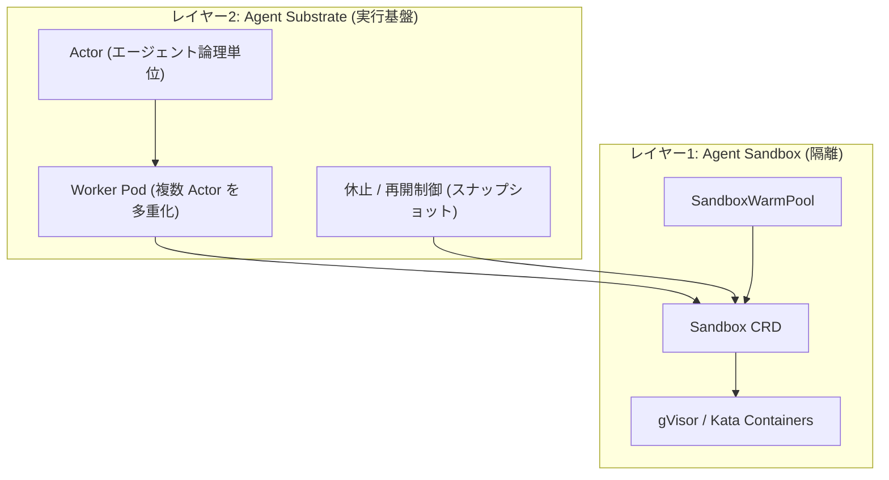

| 要素名 | 説明 |
|---|---|
| Actor | エージェントの論理的な実行単位。Worker Pod に多重化されて配置される |
| Worker Pod | 複数 Actor を同居させる物理 Pod。密度を上げてコストを抑える |
| 休止 / 再開制御 | Actor をアイドル時にスナップショットし、必要時に別の Worker で再開する仕組み |
| Sandbox CRD | 1 隔離環境を表す Kubernetes カスタムリソース。安定した ID・永続ストレージを持つ |
| gVisor / Kata Containers | Sandbox のカーネル/ネットワーク隔離を担うサンドボックスランタイム |
| SandboxWarmPool | 事前起動済み Sandbox のプールで、Sandbox 起動のコールドスタートを排除する |

### 関連技術比較

| 項目 | 通常の k8s Pod | Agent Sandbox | Agent Substrate | サーバーレス FaaS |
|---|---|---|---|---|
| 実行方式 | 1 Pod が 1 ワークロードとして常駐 | 1 Sandbox が 1 エージェント用の隔離 Pod として存在 | 複数 Actor を少数の Worker Pod に多重化 | リクエストごとに関数インスタンスを起動 |
| 隔離 | namespace/cgroup による標準的なコンテナ分離 | gVisor / Kata Containers によるカーネルレベル隔離 | gVisor ベースの隔離 + mTLS (Pod Certificates) による Actor 間分離 | プロバイダ依存 (例: Firecracker microVM) |
| アイドル時コスト | 常駐分をフル課金 | Pod Snapshot でゼロスケール可能 | Actor を休止し Worker を共有するため最小化 | 実行時のみ課金、アイドルはゼロ |
| 起動速度 | 通常スケジューリングで数秒〜 | Warm Pool 利用でサブ秒 (90% が 200ms 未満) | サブ秒アクティベーション (状態スナップショットから復元) | 数百 ms 〜数秒 (コールドスタート発生) |
| スケール密度 | Pod 単位で低密度 | Sandbox 単位。GKE で高速に割当 | 高密度多重化 (例: 250 Actor を 8 Worker Pod で実行) | 高い水平スケールだがステートレス前提 |

隔離ランタイム自体の特性差 (第三者ベンチマーク由来の目安、環境依存)。

| ランタイム | 起動レイテンシ目安 | 定常時オーバーヘッド | 特徴 |
|---|---|---|---|
| gVisor | 50〜100ms | 18〜35% (syscall 密度に依存) | ユーザー空間カーネルで syscall を仲介、コンテナ互換性が高い |
| Kata Containers | 150〜300ms (構成により 600ms 前後の報告もあり) | 8〜12% | 軽量 VM による強い隔離、ネットワークスループット低下が小さい |

## 特徴

- **二律背反の解消**: idle 常駐によるコスト浪費と、都度起動による遅延という 2 つの課題を同時に解きます。
- **2 層責務分離**: Agent Sandbox が隔離を、Agent Substrate が実行効率を、それぞれ独立して担当します。
- **多重化 (multiplexing)**: 多数の Actor を少数の Worker Pod にまとめて配置し、Pod 数を抑えます。
- **休止/再開 (pause/resume)**: アイドル中の Actor はメモリ・ファイルシステム状態ごとスナップショットされ、任意の Worker で再開できます。
- **ウォームプール**: Agent Sandbox の SandboxWarmPool と、GKE の standby capacity buffers (休止 VM) の組み合わせで、コールドスタートと維持コストを両立して抑えます。
- **サブ秒スケジューリング**: GKE Agent Sandbox は割当遅延が短く、割当の 90% が 200ms 未満で完了します。
- **フレームワーク非依存**: Agent Substrate は LangChain・Claude Code・MCP など、特定のエージェント実装に縛られません。
- **標準 Kubernetes 資産の活用**: 両プロジェクトとも標準 OCI コンテナと Kubernetes プリミティブの上に構築され、独自ランタイムを再発明しません。
- **超大規模を見据えた設計**: Agent Substrate は数百万オーダーのインスタンス規模、かつサブ秒単位のツール呼び出し頻度を前提に設計されています。
- **セキュリティの両立**: 多重化・高密度化と同時に、mTLS (Pod Certificates) などでコンポーネント間通信を保護します。

## 構造

AI エージェント実行基盤の構造を、C4 model の 3 段階で示します。システムコンテキスト図でアクターと外部システムを、コンテナ図で 2 層の主要コンテナを、コンポーネント図で各コンテナ内部を整理し、最後にライフサイクルのフローを図解します。

### システムコンテキスト図

AI エージェント実行基盤は、3 種類のアクターと 4 種類の外部システムに接続します。

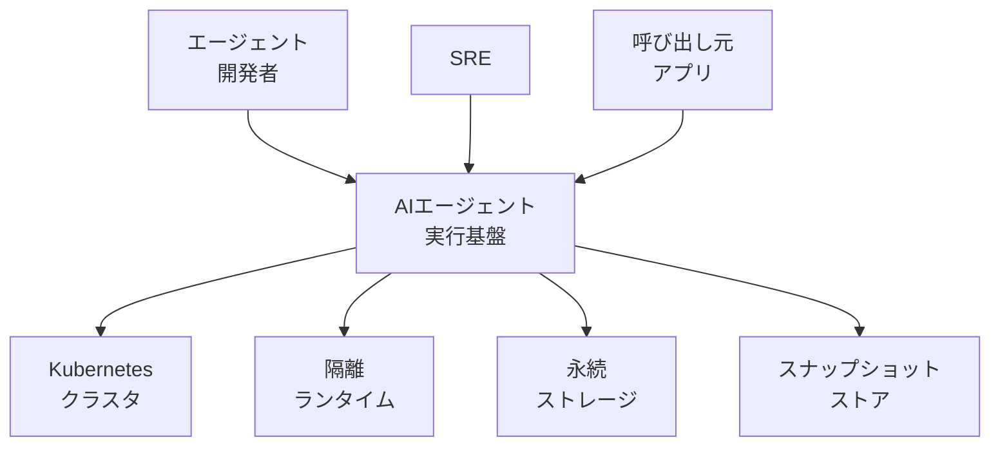

| 要素名 | 説明 |
|---|---|
| エージェント開発者 | エージェントの定義や振る舞いを実装するアクターです |
| SRE | 実行基盤の稼働と信頼性を運用するアクターです |
| 呼び出し元アプリ | エージェントを呼び出す上位アプリケーションです |
| AIエージェント実行基盤 | エージェントを安全かつ高密度に実行する本システムです |
| Kubernetesクラスタ | 実行基盤が Pod をスケジュールする基盤です |
| 隔離ランタイム | 信頼できないコードをカーネルレベルで分離する外部システムです |
| 永続ストレージ | エージェントの状態を保持する外部システムです |
| スナップショットストア | 一時停止したエージェントの完全な状態を保存する外部システムです |

### コンテナ図

実行基盤内部は、Agent Sandbox 層 4 コンテナと Agent Substrate 層 4 コンテナで構成されます。

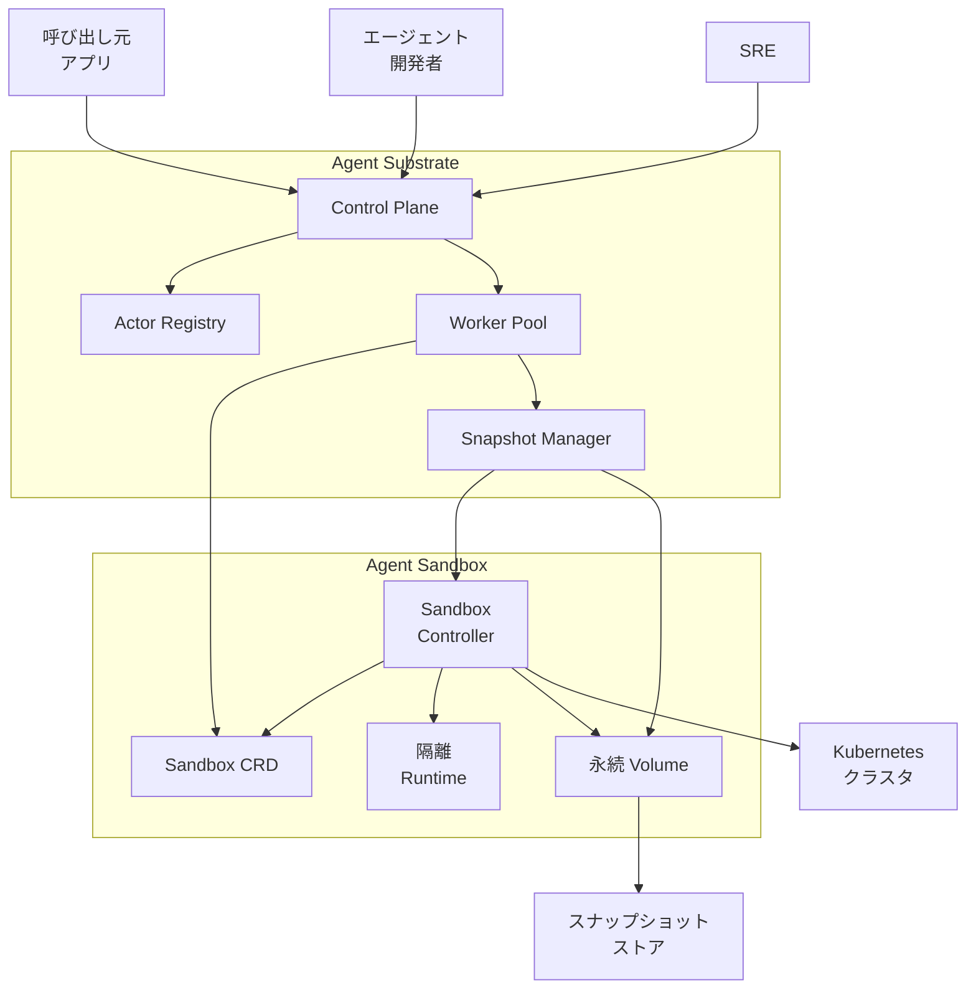

| 要素名 | 説明 |
|---|---|
| Control Plane | invoke 要求を受け付け actor を worker に割り当てる Agent Substrate のコンテナです |
| Actor Registry | actor の識別情報と割当先 worker の対応を保持するコンテナです |
| Worker Pool | actor を短いバーストで実行する共有 worker pod 群のコンテナです |
| Snapshot Manager | worker の一時停止と復元のために状態の保存 取得を仲介するコンテナです |
| Sandbox CRD | 単一の stateful Pod を宣言的に表現するリソース定義のコンテナです |
| Sandbox Controller | Sandbox CRD を解釈し Pod のライフサイクルを実制御するコンテナです |
| 隔離Runtime | worker pod 内で信頼できないコードを分離実行するコンテナです |
| 永続Volume | worker の状態をローカルに永続化するコンテナです |
| 呼び出し元アプリ | エージェントを呼び出す上位アプリケーションです |
| エージェント開発者 | actor の定義を登録するアクターです |
| SRE | Control Plane を通じて運用状態を監視するアクターです |
| Kubernetesクラスタ | Sandbox Controller が Pod をスケジュールする基盤です |
| スナップショットストア | Snapshot Manager が長期保存先として使う外部システムです |

### コンポーネント図

各コンテナの内部を、具体的な実装コンポーネントでドリルダウンします。

#### Sandbox CRD

Sandbox の基本スキーマを、3 種類の拡張 CRD が参照し、すべて etcd に保持されます。

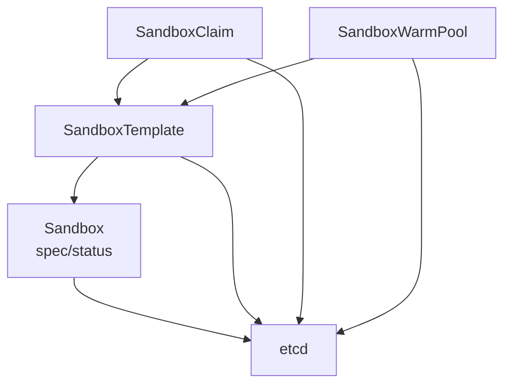

| 要素名 | 説明 |
|---|---|
| Sandbox spec/status | 安定したホスト名 ネットワークID 永続ストレージ設定を持つ基本スキーマです |
| SandboxTemplate | 再利用可能な Sandbox 定義のテンプレートです |
| SandboxClaim | テンプレートまたは WarmPool から Sandbox の割当を要求する CRD です |
| SandboxWarmPool | 事前に準備した Sandbox のプールを管理する CRD です |
| etcd | すべての CRD インスタンスを永続化する Kubernetes API のストレージです |

#### Sandbox Controller

標準の reconcile ループが、拡張 CRD ごとのサブコントローラと Router を束ねます。

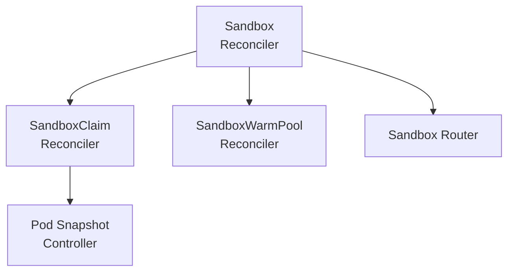

| 要素名 | 説明 |
|---|---|
| Sandbox Reconciler | Sandbox CRD の desired state に沿って Pod を作成 更新するメインループです |
| SandboxClaim Reconciler | Claim を既存 Sandbox の再利用またはプール割当に解決します |
| SandboxWarmPool Reconciler | 事前起動 Pod 数を目標値に維持します |
| Sandbox Router | 安定したエンドポイントから対象 Sandbox Pod へトラフィックを転送します |
| Pod Snapshot Controller | GKE の Pod Snapshot 機能を扱い最新の一致 snapshot を自動認識し復元します |

#### 隔離Runtime

RuntimeClass の選択に応じて gVisor または Kata Containers が起動し、ネットワークは default-deny で保護されます。

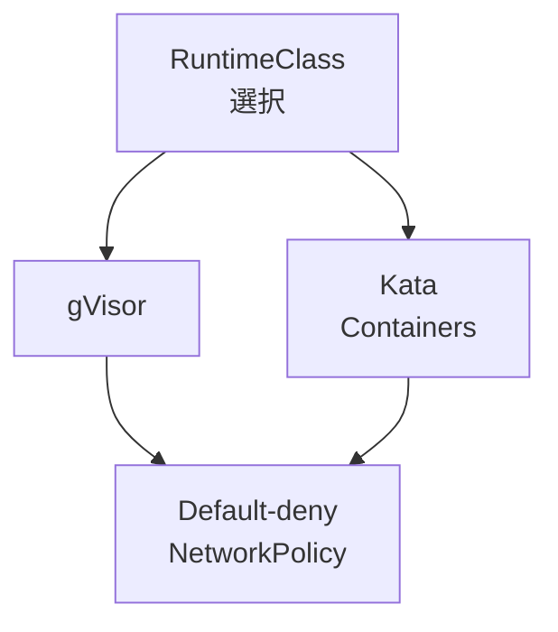

| 要素名 | 説明 |
|---|---|
| RuntimeClass選択 | Pod ごとに使用する隔離ランタイムを指定する仕組みです |
| gVisor | ユーザー空間カーネルでシステムコールを制限する推奨ランタイムです |
| Kata Containers | 軽量 VM でカーネルごと分離するコミュニティ対応ランタイムです |
| Default-denyNetworkPolicy | 未許可の通信と GKE control plane への到達を遮断します |

#### 永続Volume

PersistentVolumeClaim に加え、GKE Pod Snapshots の保存設定が Cloud Storage を宛先とします。

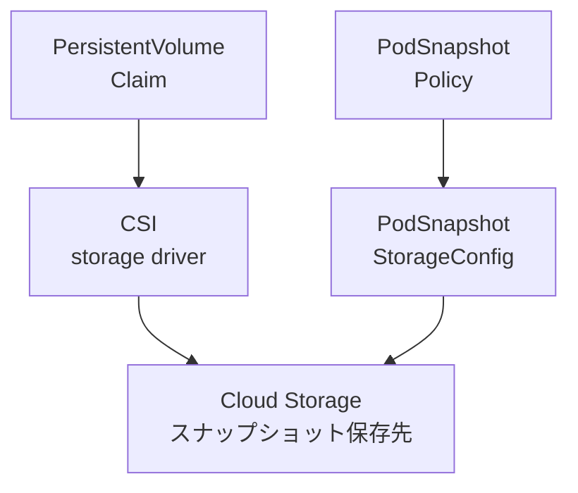

| 要素名 | 説明 |
|---|---|
| PersistentVolumeClaim | worker のローカル状態を要求する標準 Kubernetes リソースです |
| CSIstorage driver | PVC を実ストレージにバインドするドライバです |
| PodSnapshotStorageConfig | snapshot の保存先バケットと階層型名前空間を指定します |
| PodSnapshotPolicy | snapshot 取得のトリガー条件を定義します |
| Cloud Storageスナップショット保存先 | Pod の完全な状態を長期保存する GKE の宛先です |

#### Control Plane

ateapi が gRPC で actor と worker のライフサイクルを受け付け、atecontroller と atenet に橋渡しします。

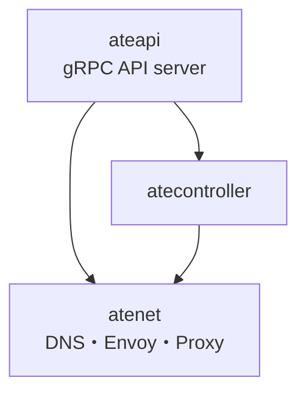

| 要素名 | 説明 |
|---|---|
| ateapi | actor と worker のライフサイクルを管理する gRPC API server です |
| atecontroller | WorkerPool と ActorTemplate の CRD を reconcile します |
| atenet | DNS 解決 Envoy ルーティング proxy sidecar 注入を担当します |

Agent Substrate は Agent Sandbox の Sandbox CRD を直接操作するのではなく、`SandboxConfig` (cluster-scoped CRD) で隔離ランタイム (gVisor / Kata) のバイナリ配布のみを流用し、Pod のライフサイクルは独自の control plane (ateapi / atecontroller / atelet) で制御します。つまり両者は「隔離技術の共有」で結合し、「Pod のライフサイクル管理」では独立します。

#### Actor Registry

ActorTemplate から生成された actor が、worker への割当索引とセッション状態台帳に登録されます。

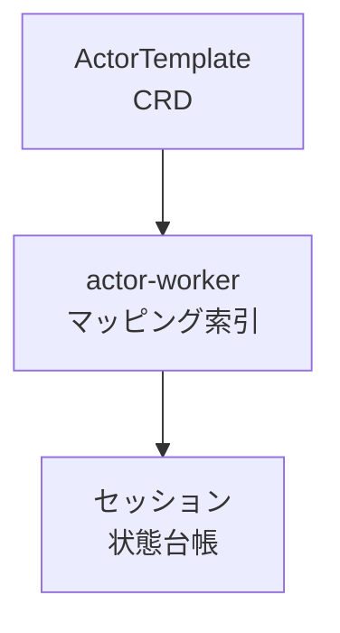

| 要素名 | 説明 |
|---|---|
| ActorTemplate CRD | actor の実行イメージと設定を定義する CRD です |
| actor-workerマッピング索引 | どの actor がどの worker に存在するかを保持します |
| セッション状態台帳 | actor ごとの実行セッション状態を記録します |

#### Worker Pool

容量スケジューラが atelet を介して worker pod を配置し、gVisor で隔離された pod が proxy sidecar 経由で応答します。

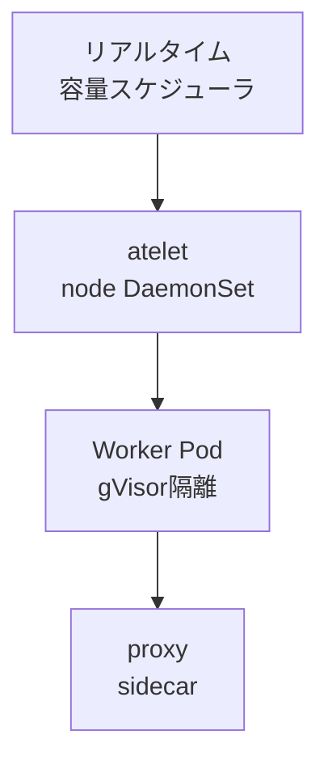

| 要素名 | 説明 |
|---|---|
| リアルタイム容量スケジューラ | worker pod の空き容量を見て actor を即時割り当てます |
| atelet | ノード常駐で物理 worker pod を監督する DaemonSet です |
| Worker Podgvisor隔離 | 複数 actor を多重化して実行する共有 pod です |
| proxysidecar | tool call のルーティングを仲介します |

#### Snapshot Manager

atelet が checkpoint/restore を ateom-gvisor に指示し、CRIU 的な機構で状態を取り出して Session Teleport に渡します。

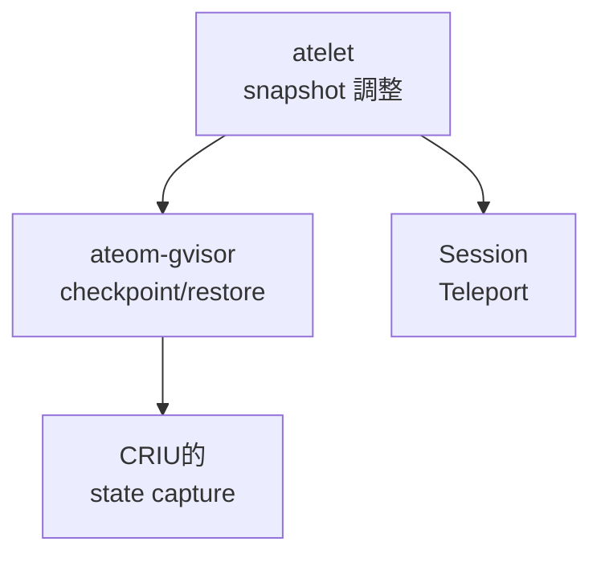

| 要素名 | 説明 |
|---|---|
| atelet snapshot調整 | worker のアイドル検知と状態転送のタイミングを調整します |
| ateom-gvisor checkpoint/restore | サンドボックス化された pod 内で checkpoint と restore を実行します |
| CRIU的 state capture | RAM とファイルシステムの状態を丸ごと取り出します |
| Session Teleport | 保存済み状態を任意の空き worker 上でサブ秒起動します |

#### ライフサイクルフロー図

invoke から suspend/snapshot までの一連の流れを、コンテナをまたいで示します。

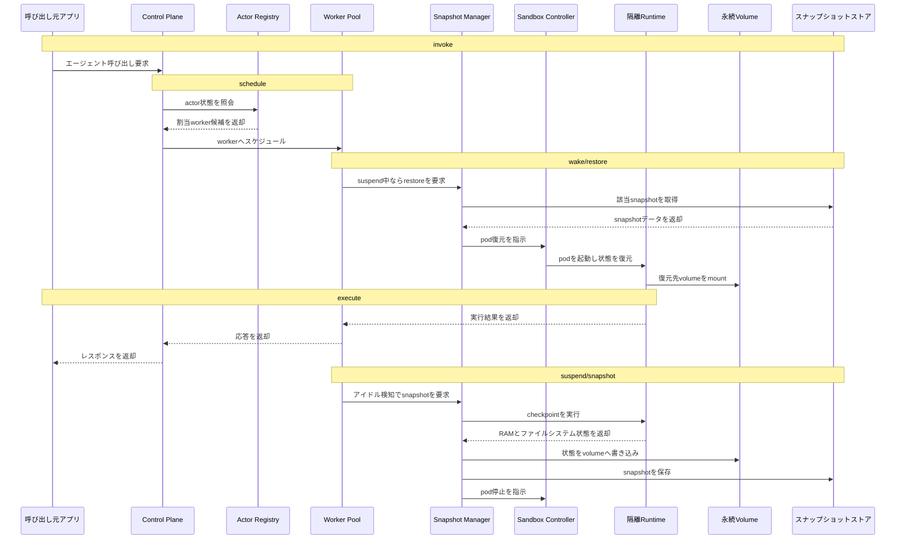

| 要素名 | 説明 |
|---|---|
| invoke | 呼び出し元アプリが Control Plane にエージェント実行を要求する段階です |
| schedule | Control Plane が Actor Registry を照会し Worker Pool へ割り当てる段階です |
| wake/restore | Snapshot Manager が保存済み状態を取得し Sandbox Controller 経由で pod を復元する段階です |
| execute | 隔離Runtime 上でエージェントが実行され結果が呼び出し元へ返る段階です |
| suspend/snapshot | アイドル検知後に状態を checkpoint し永続化して pod を停止する段階です |

## データ

agent-substrate-runtime は、実装が異なる 2 つのプロジェクトから成ります。

- **Agent Sandbox** (`kubernetes-sigs/agent-sandbox`): Kubernetes CRD として実装されます。
- **Agent Substrate** (`agent-substrate/substrate`): Kubernetes の上にさらに独自の制御面を重ねます。

2 つは別リポジトリ・別データストアです。概念モデルと情報モデルを、それぞれ 2 つに分けて示します。

### 概念モデル

#### Agent Sandbox

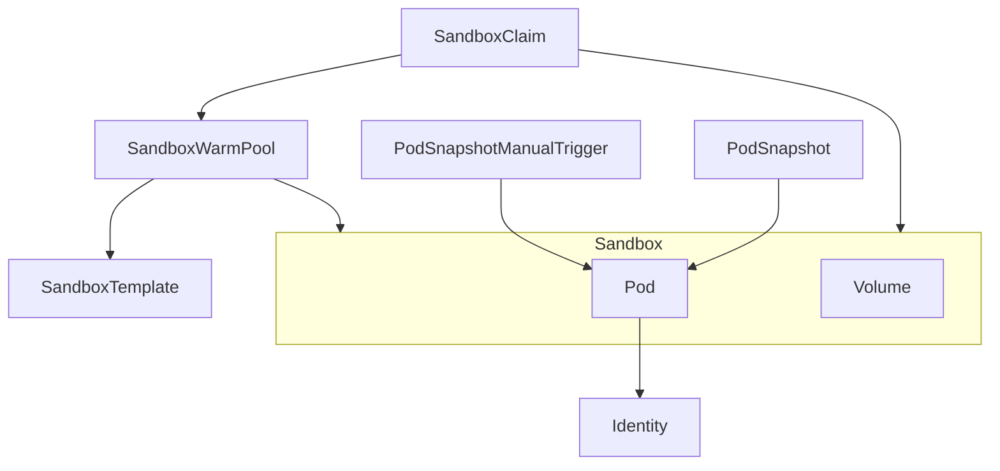

| エンティティ | 分類 | 出典 |
|---|---|---|
| Sandbox | CRD (`agents.x-k8s.io/v1beta1`) | `api/v1beta1/sandbox_types.go` |
| Pod | Sandbox が作成・所有する標準 Kubernetes Pod | `SandboxBlueprint.PodTemplate` |
| Volume | Sandbox が作成・所有する PVC (`volumeClaimTemplates` 由来) | `SandboxBlueprint.VolumeClaimTemplates` |
| Identity | Pod が参照する ServiceAccount | `sandbox_types.go` コメント |
| SandboxTemplate | CRD (`extensions.agents.x-k8s.io/v1beta1`)。Sandbox 設定を再利用可能にする雛形 | `extensions/api/v1beta1/sandboxtemplate_types.go` |
| SandboxWarmPool | CRD。事前起動した Sandbox のプールを管理 | `extensions/api/v1beta1/sandboxwarmpool_types.go` |
| SandboxClaim | CRD。WarmPool から Sandbox を払い出す | `extensions/api/v1beta1/sandboxclaim_types.go` |
| PodSnapshot | CRD (`podsnapshot.gke.io/v1`, GKE 提供)。Pod の凍結状態を保持 | `k8s_agent_sandbox/constants.py` + GKE Pod Snapshots 概念ドキュメント |
| PodSnapshotManualTrigger | CRD (`podsnapshot.gke.io/v1`, GKE 提供)。手動スナップショット起動 | `gke_extensions/snapshots/snapshot_engine.py` |

補足: SandboxTemplate は `SandboxBlueprint` (`podTemplate` / `volumeClaimTemplates`) を Sandbox と共有する構造体です。ただし実際に Pod/Volume を作成するのは Sandbox のみのため、SandboxTemplate から Pod/Volume への直接矢印は引いていません。

#### Agent Substrate

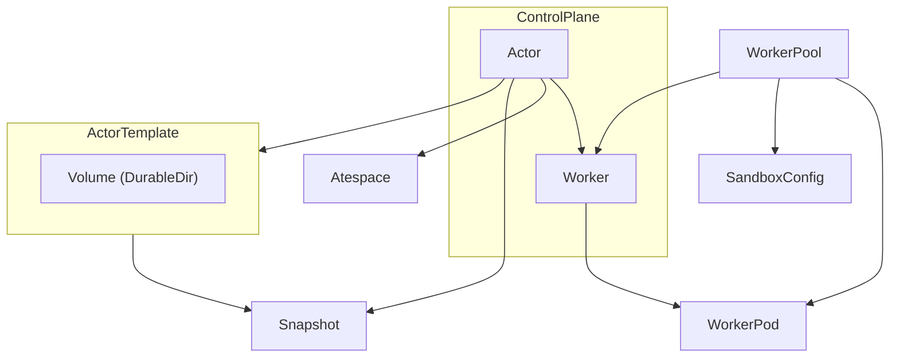

| エンティティ | 分類 | 出典 |
|---|---|---|
| ActorTemplate | CRD。actor の container イメージと snapshot 設定の不変な雛形 | `pkg/api/v1alpha1/actortemplate_types.go` |
| Volume (DurableDir) | ActorTemplate に埋め込まれた durable directory 定義 | `pkg/api/v1alpha1/sandboxconfig_types.go` (`VolumeSource.DurableDir`) |
| WorkerPool | CRD。ウォームな worker pod の集合を宣言 | `pkg/api/v1alpha1/workerpool_types.go` |
| SandboxConfig | CRD (cluster-scoped)。sandbox ランタイムのバイナリ配布設定 | `pkg/api/v1alpha1/sandboxconfig_types.go` |
| WorkerPod | WorkerPool が管理する物理 Pod (`ateom` + `runsc`/Kata が動作) | `docs/architecture.md` Resource Model 図 |
| ControlPlane | `ate-api-server` (バイナリ名 `ateapi`)。Actor/Worker のレコードを保持する制御面 | `docs/glossary.md` Components |
| Actor | レコード。ActorTemplate から派生する実行中インスタンス | `pkg/proto/ateapipb/ateapi.proto` message Actor |
| Worker | レコード。WorkerPool 内の 1 worker pod を表す | 同上 message Worker |
| Atespace | レコード。Actor が属する隔離境界 | 同上 message Atespace |
| Snapshot | Actor の状態スナップショット参照 (`SnapshotInfo`) | 同上 message SnapshotInfo |

補足: `docs/architecture.md` (agent-substrate) は冒頭で "Much of this architecture is aspirational, and is not yet implemented!" と明記しています。WorkerPool → WorkerPod (Deployment 経由の reconcile) の関連はこの記述に基づくため、現時点の実装を保証するものではありません。

### 情報モデル

#### Agent Sandbox のクラス図

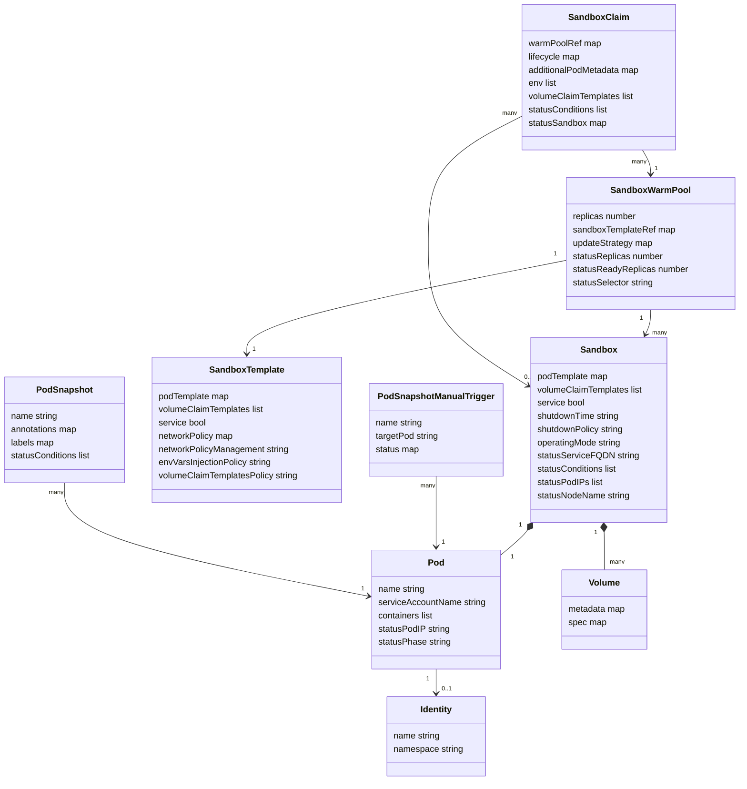

注記: PodSnapshot / PodSnapshotManualTrigger の `status` の正確なフィールド名 (作成された PodSnapshot 名の格納先など) は GKE 公式ドキュメントの要約からは一次情報として確定できませんでした。存在は確認できますが、フィールド名は未確認として扱います。

#### Agent Substrate のクラス図

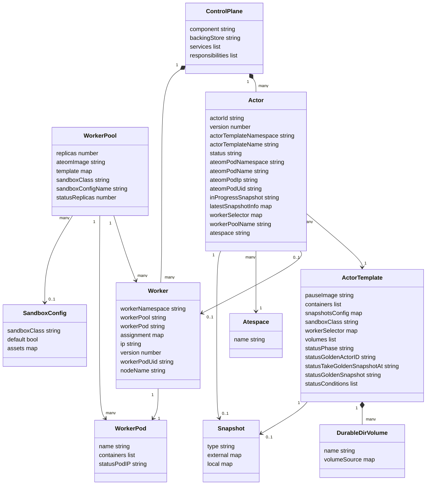

注記:

- Actor / Worker のフィールド名は Protocol Buffers の `snake_case` 表記が実体です (クラス図では camelCase 表記に変換しています。例: `actor_id` → `actorId`)。
- **Skill** は想定エンティティに含めていましたが、両リポジトリとも一次情報で CRD・型定義・ドキュメント記述を確認できず除外しました。
- Agent Substrate 側の Identity 相当機能は `SessionIdentity` gRPC サービス (`MintJWT` / `MintCert`) です。永続化されたレコードではなく、Pod の ServiceAccount トークンをセッション JWT/証明書に交換するその場限りのサービスのため、情報モデルには含めていません。
- Agent Sandbox と Agent Substrate は別リポジトリ・別データストアであり、両者の Pod/Volume/Snapshot は同一の実体ではありません。

## 構築方法

対象は Agent Sandbox (kubernetes-sigs、OSS 版 v0.5.0 時点) と GKE Agent Sandbox、Agent Substrate (agent-substrate/substrate) です。初回構築と基本操作に絞ります。

### Agent Sandbox (kubernetes-sigs) のインストール

- Agent Sandbox は SIG Apps 傘下のプロジェクトです。
- `Sandbox` CRD (コア) と `extensions` (SandboxTemplate / SandboxClaim / SandboxWarmPool) の 2 系統を提供します。
- Kubernetes のコントローラーパターンに従い、ユーザーが CRD を作成しコントローラーが Pod を管理します。

前提条件 (quickstart 記載分)。

| 項目 | バージョン |
|---|---|
| Docker | 20.10 以上 |
| kubectl | 1.28 以上 |
| KIND (ローカル検証用、既定) | 0.20 以上 |
| minikube (Kata Containers / gVisor を minikube で試す場合) | 任意 |
| Python (Python SDK を使う場合) | 3.9 以上 |

強い分離が必要な場合は `RuntimeClass` として gVisor か Kata Containers を選択します。RuntimeClass 名はコントローラーが強制せず、SandboxTemplate / Sandbox の `spec.podTemplate.spec.runtimeClassName` に指定する運用です。

インストールコマンド (バージョンタグは GitHub Releases から選択、例 `v0.5.0`)。

```sh
export VERSION="v0.5.0"

# コアのみ
kubectl apply -f https://github.com/kubernetes-sigs/agent-sandbox/releases/download/${VERSION}/manifest.yaml

# extensions (SandboxTemplate / SandboxClaim / SandboxWarmPool) を含める場合
kubectl apply -f https://github.com/kubernetes-sigs/agent-sandbox/releases/download/${VERSION}/extensions.yaml
```

コントローラーの起動確認。

```sh
kubectl wait --for=condition=Ready pod -l app=agent-sandbox-controller -n agent-sandbox-system --timeout=120s
```

Go SDK / Python SDK も別途提供されています。

```sh
# Go SDK
go get sigs.k8s.io/agent-sandbox/clients/go/sandbox@latest

# Python SDK (ソースからの editable install)
python3 -m venv .venv
source .venv/bin/activate
pip install -e clients/python/agentic-sandbox-client
```

### GKE Agent Sandbox の有効化手順

前提条件。

| 項目 | 値 |
|---|---|
| GKE バージョン | 1.35.2-gke.1269000 以上 |
| IAM ロール | プロジェクト作成に `roles/resourcemanager.projectCreator`、API 有効化に `roles/serviceusage.serviceUsageAdmin` (公式の Before you begin 記載)。クラスタ操作には別途 `roles/container.admin` 相当が必要 |
| 有効化が必要な API | Artifact Registry API、Kubernetes Engine API |
| 課金 | プロジェクトで billing 有効 |

環境変数。

```bash
export PROJECT_ID=$(gcloud config get project)
export CLUSTER_NAME="agent-sandbox-cluster"
export LOCATION="us-central1"
export CLUSTER_VERSION="1.35.2-gke.1269000"
export NODE_POOL_NAME="agent-sandbox-pool"
export MACHINE_TYPE="e2-standard-2"
```

Autopilot クラスタ (推奨、gVisor サンドボックス化が全ノードで既定有効)。

```bash
gcloud beta container clusters create-auto ${CLUSTER_NAME} \
        --location=${LOCATION} \
        --cluster-version=${CLUSTER_VERSION} \
        --enable-agent-sandbox
```

Standard クラスタは、クラスタ作成後に gVisor 対応ノードプールを追加してから Agent Sandbox を有効化します。

```bash
# 1. クラスタ作成
gcloud beta container clusters create ${CLUSTER_NAME} \
        --location=${LOCATION} \
        --num-nodes=1 \
        --cluster-version=${CLUSTER_VERSION}

# 2. gVisor 対応ノードプール作成
gcloud container node-pools create ${NODE_POOL_NAME} \
        --cluster=${CLUSTER_NAME} \
        --machine-type=${MACHINE_TYPE} \
        --location=${LOCATION} \
        --num-nodes=1 \
        --image-type=cos_containerd \
        --sandbox=type=gvisor

# 3. Agent Sandbox 有効化
gcloud beta container clusters update ${CLUSTER_NAME} \
        --location=${LOCATION} \
        --enable-agent-sandbox
```

有効化の確認。

```bash
gcloud beta container clusters describe ${CLUSTER_NAME} \
        --location=${LOCATION} \
        --format="value(addonsConfig.agentSandboxConfig.enabled)"
```

Pod Snapshots を使う場合は、クラスタ作成時に `--enable-pod-snapshots` を追加します。GKE バージョンは 1.35.3-gke.1234000 以上が必要です。E2 マシンタイプは Pod Snapshots に非対応です。

```bash
# Autopilot
gcloud container clusters create-auto ${CLUSTER_NAME} \
       --cluster-version=${CLUSTER_VERSION} \
       --enable-pod-snapshots \
       --location=${LOCATION}

# Standard
gcloud container clusters create ${CLUSTER_NAME} \
       --cluster-version=${CLUSTER_VERSION} \
       --enable-pod-snapshots \
       --machine-type=${MACHINE_TYPE} \
       --workload-pool=${PROJECT_ID}.svc.id.goog \
       --workload-metadata=GKE_METADATA \
       --num-nodes=1 \
       --location=${LOCATION}
```

備考: GKE の公式ドキュメント掲載例は `extensions.agents.x-k8s.io/v1alpha1` の SandboxTemplate / SandboxWarmPool / SandboxClaim を使っています。一方 OSS リポジトリの CRD 定義 (v0.5.0) では `v1alpha1` は非推奨化され `v1beta1` が正としてマークされています。新規構築では `v1beta1` を優先し、GKE ドキュメントのサンプルを流用する際は apiVersion を読み替えてください。

### Agent Substrate の導入

Agent Substrate (`agent-substrate/substrate`) は Agent Sandbox のコアランタイム/スナップショット機構を、Kubernetes 制御プレーンを経由しない最小制御プレーンと組み合わせ、超大規模の agent-like ワークロードを少数の Pod に多重化するシステムです。2026-07 時点で「非常に初期の開発段階」であり、本番利用や後方互換性は保証されていません。

ローカル (kind) での構築手順。

```shell
# Go / kubectl / docker が前提。kind は Go 経由で自動管理される
hack/create-kind-cluster.sh
hack/install-ate-kind.sh --deploy-ate-system
hack/install-ate-kind.sh --deploy-demo-counter
go install ./cmd/kubectl-ate
```

GKE での構築手順。

```bash
cp hack/ate-dev-env.sh.example .ate-dev-env.sh
source .ate-dev-env.sh
gcloud auth application-default login --project=${PROJECT_ID}
go run ./tools/setup-gcp bootstrap
./hack/install-ate.sh --deploy-ate-system
./hack/install-ate.sh --deploy-demo-counter
```

### バージョン確認コマンド

GKE のバージョン文字列 (`1.35.2-gke.1269000` 等) は時間とともに無効化されるため、固定値を使う前に現在有効なバージョンを確認します。

```bash
# 指定リージョンで有効な GKE バージョン一覧を確認 (固定バージョン実行前に必須)
gcloud container get-server-config --location=${LOCATION} \
        --format="yaml(validMasterVersions)"
```

```bash
# Agent Sandbox: インストール済み CRD の API バージョン一覧
kubectl get crd sandboxes.agents.x-k8s.io -o jsonpath='{.spec.versions[*].name}'
kubectl get crd sandboxtemplates.extensions.agents.x-k8s.io -o jsonpath='{.spec.versions[*].name}'

# GKE: Agent Sandbox アドオンの有効化状態
gcloud beta container clusters describe ${CLUSTER_NAME} \
        --location=${LOCATION} \
        --format="value(addonsConfig.agentSandboxConfig.enabled)"

# Agent Substrate: CRD (ActorTemplate / WorkerPool) の存在確認
kubectl get crd | grep ate.dev
```

## 利用方法

### 必須パラメータ

| 対象 | パラメータ | 値 / 説明 |
|---|---|---|
| Sandbox / SandboxTemplate | `spec.podTemplate.spec.containers[].image` | 必須。実行するコンテナイメージ |
| Sandbox (分離を有効化する場合) | `spec.podTemplate.spec.runtimeClassName` | `gvisor` または `kata-qemu` |
| GKE SandboxTemplate | `spec.podTemplate.spec.automountServiceAccountToken` | `false` (必須、GKE ドキュメント指定) |
| GKE SandboxTemplate | `spec.podTemplate.spec.securityContext.runAsNonRoot` | `true` (必須) |
| GKE SandboxTemplate | `spec.podTemplate.spec.nodeSelector` | `sandbox.gke.io/runtime: gvisor` |
| GKE SandboxTemplate | `spec.podTemplate.spec.containers[].securityContext.capabilities.drop` | `["ALL"]` |
| SandboxWarmPool | `spec.replicas` / `spec.sandboxTemplateRef.name` | 必須。プレウォームする Pod 数と参照テンプレート |
| SandboxClaim | `spec.warmPoolRef.name` | 必須 (v1beta1)。v1alpha1 では `spec.sandboxTemplateRef.name` が必須だったが、v1beta1 で `warmPoolRef` に置き換わった |
| PodSnapshotStorageConfig | `spec.snapshotStorageConfig.gcs.bucket` / `.path` | 必須。スナップショット保存先 GCS バケット |
| PodSnapshotPolicy | `spec.storageConfigName` / `spec.selector` | 必須。対象 Pod をラベルで選択 |
| Agent Substrate WorkerPool | `spec.replicas` / `spec.ateomImage` | 必須。維持する物理待機 Pod 数と herder イメージ |
| Agent Substrate ActorTemplate | `spec.containers` / `spec.snapshotsConfig` / `spec.pauseImage` | 必須。ワークロード定義・スナップショット保存先・pause イメージ |

### Sandbox CRD のマニフェスト例

最小構成 (`agents.x-k8s.io/v1beta1`)。

```yaml
apiVersion: agents.x-k8s.io/v1beta1
kind: Sandbox
metadata:
  name: hello-world
spec:
  podTemplate:
    spec:
      containers:
      - name: my-container
        image: ${IMAGE}
      restartPolicy: Never
```

gVisor / Kata の RuntimeClass を有効にする場合は `runtimeClassName` を追加します (`examples/quickstart` 準拠)。

```yaml
apiVersion: extensions.agents.x-k8s.io/v1beta1
kind: SandboxTemplate
metadata:
  name: python-runtime-template
  namespace: agent-sandbox-demo
spec:
  podTemplate:
    spec:
      # gVisor の場合は runtimeClassName: gvisor
      # Kata Containers の場合は runtimeClassName: kata-qemu
      containers:
      - name: python-runtime
        image: us-central1-docker.pkg.dev/k8s-staging-images/agent-sandbox/python-runtime-sandbox:latest-main
        ports:
        - containerPort: 8888
        readinessProbe:
          httpGet:
            path: "/"
            port: 8888
          initialDelaySeconds: 0
          periodSeconds: 1
        resources:
          requests:
            cpu: "250m"
            memory: "512Mi"
            ephemeral-storage: "512Mi"
      restartPolicy: "OnFailure"
  volumeClaimTemplatesPolicy: Overrides
  volumeClaimTemplates:
    - metadata:
        name: workspace
      spec:
        accessModes:
        - ReadWriteOnce
        resources:
          requests:
            storage: "1Gi"
```

GKE で gVisor 分離を強制する場合の SandboxTemplate 例 (GKE ドキュメント記載、apiVersion は `v1alpha1` のまま公開されている点に注意)。

```yaml
apiVersion: extensions.agents.x-k8s.io/v1alpha1
kind: SandboxTemplate
metadata:
  name: python-runtime-template
  namespace: default
spec:
  podTemplate:
    metadata:
      labels:
        sandbox: python-sandbox-example
    spec:
      runtimeClassName: gvisor
      automountServiceAccountToken: false
      securityContext:
        runAsNonRoot: true
      nodeSelector:
        sandbox.gke.io/runtime: gvisor
      tolerations:
      - key: "sandbox.gke.io/runtime"
        value: "gvisor"
        effect: "NoSchedule"
      containers:
      - name: python-runtime
        image: registry.k8s.io/agent-sandbox/python-runtime-sandbox:v0.1.0
        ports:
        - containerPort: 8888
        resources:
          requests:
            cpu: "250m"
            memory: "512Mi"
          limits:
            cpu: "500m"
            memory: "1Gi"
        securityContext:
          capabilities:
            drop: ["ALL"]
      restartPolicy: "OnFailure"
```

### Sandbox の作成・確認・削除 (kubectl)

```bash
# 作成
kubectl apply -f sandbox.yaml

# 一覧・詳細確認
kubectl get sandbox
kubectl get sandbox my-sandbox -o yaml
kubectl describe sandbox my-sandbox

# Ready 状態を待つ
kubectl wait --for=condition=Ready sandbox/my-sandbox --timeout=60s

# 削除
kubectl delete sandbox my-sandbox
```

SandboxWarmPool と SandboxClaim を組み合わせると、プレウォーム済み Pod から即時割り当てできます。WarmPool はプレウォームした「Pod」を直接作成します (Sandbox リソースではありません)。ラベルは `agents.x-k8s.io/pool=<hash>`、割り当て後は `sandbox-name-hash=<hash>` に変わります。

```bash
# WarmPool 状態確認
kubectl get sandboxwarmpool python-warmpool

# プレウォーム済み Pod の確認
kubectl get pods -l agents.x-k8s.io/pool
```

### Pod Snapshots の取得・復元操作 (GKE)

前提条件。

| 項目 | 値 |
|---|---|
| GKE バージョン | 1.35.3-gke.1234000 以上 |
| 非対応マシンタイプ | E2 系 |
| モード | Autopilot / Standard どちらも対応 |
| 認証 | Workload Identity Federation for GKE |
| ストレージ | 階層名前空間を有効化した Cloud Storage バケット |

保存先・対象・トリガーを定義するリソース。

```yaml
apiVersion: podsnapshot.gke.io/v1
kind: PodSnapshotStorageConfig
metadata:
  name: cpu-pssc-gcs
spec:
  snapshotStorageConfig:
    gcs:
      bucket: "${SNAPSHOTS_BUCKET_NAME}"
      path: "${SNAPSHOT_FOLDER}"
---
apiVersion: podsnapshot.gke.io/v1
kind: PodSnapshotPolicy
metadata:
  name: cpu-psp
  namespace: ${SNAPSHOT_NAMESPACE}
spec:
  storageConfigName: cpu-pssc-gcs
  selector:
    matchLabels:
      app: agent-sandbox-workload
  triggerConfig:
    type: manual
    postCheckpoint: resume
```

手動トリガーでスナップショットを取得します。

```yaml
apiVersion: podsnapshot.gke.io/v1
kind: PodSnapshotManualTrigger
metadata:
  name: cpu-snapshot-trigger
  namespace: ${SNAPSHOT_NAMESPACE}
spec:
  targetPod: python-sandbox-example
```

```bash
kubectl apply -f pod-snapshot-manual-trigger.yaml
kubectl get podsnapshotmanualtriggers --namespace ${SNAPSHOT_NAMESPACE}
```

同じ `sandboxTemplateRef` を参照する新しい SandboxClaim を作成すると、コントローラーが該当ラベルの最新スナップショットから自動復元します (この復元例は GKE ドキュメントの `v1alpha1` 文脈です。OSS の `v1beta1` では SandboxClaim は `warmPoolRef` 必須で、テンプレート選択は WarmPool 経由になります)。

### Agent Substrate で actor template を定義し worker pool で実行する

物理的な待機容量を宣言する WorkerPool (`ate.dev/v1alpha1`)。

```yaml
apiVersion: ate.dev/v1alpha1
kind: WorkerPool
metadata:
  name: agent-pool
  namespace: ate-demo
  labels:
    workload: secret-agent
spec:
  replicas: 10
  ateomImage: ko://github.com/agent-substrate/substrate/cmd/ateom-gvisor
  # sandboxClass は既定で gvisor。microvm (Kata Containers + Cloud Hypervisor) も選択可
```

ワークロードの雛形を定義する ActorTemplate。作成すると一度だけ「Golden Pod」を起動し、`sandboxClass` (既定 `gvisor`、`microvm` も選択可) のランタイムで Golden Snapshot を採取します。

```yaml
apiVersion: ate.dev/v1alpha1
kind: ActorTemplate
metadata:
  name: secret-agent
  namespace: ate-demo
spec:
  pauseImage: "gcr.io/gke-release/pause@sha256:bcbd57ba5653580ec647b16d8163cdd1112df3609129b01f912a8032e48265da"
  containers:
  - name: agent
    image: gcr.io/my-project/my-agent:latest
    command: ["/app/server"]
    ports:
    - containerPort: 80
    readyz:
      httpGet:
        path: /readyz
        port: 80
  sandboxClass: gvisor
  workerSelector:
    matchLabels:
      workload: secret-agent
  snapshotsConfig:
    location: gs://my-bucket/snapshots/secret-agent/
```

`kubectl-ate` (`kubectl ate`) で atespace 作成 → actor 作成 → ライフサイクル操作を行います。actor / worker は CRD ではなく制御プレーンの状態ストア (valkey) 管理のため、通常の `kubectl get` では見えません。

```bash
# atespace (分離境界) は actor 作成前に必須
kubectl ate create atespace demo

# ActorTemplate から actor を作成 (-a は --atespace の短縮)
kubectl ate create actor my-counter-1 -a demo --template ate-demo-counter/counter

# 明示的な resume / suspend / delete
kubectl ate resume actor my-counter-1 -a demo
kubectl ate suspend actor my-counter-1 -a demo
kubectl ate delete actor my-counter-1 -a demo

# 状態確認
kubectl ate get actors -a demo
kubectl ate get workers

# ネットワークルーター経由でのアクセス
kubectl port-forward -n ate-system svc/atenet-router 8000:80
curl -X POST -H "Host: my-counter-1.demo.actors.resources.substrate.ate.dev" -i http://localhost:8000/
```

`kubectl ate get actor` の STATUS 列は `STATUS_RESUMING` / `STATUS_RUNNING` / `STATUS_SUSPENDING` / `STATUS_SUSPENDED` の 4 値を取ります (proto 定義には `STATUS_PAUSING` / `STATUS_PAUSED` も存在しますが、CLI 表示は 4 値です)。actor は resume のたびに空いている worker に再配置され、suspend 時に RAM とディスク差分がスナップショットとして外部ストレージへアップロードされます。

## 運用

### suspend/resume (snapshot による休眠・再開)

Agent Substrate では actor はデフォルトで `STATUS_SUSPENDED` です。

- 常駐前提を捨てる設計です。actor はトラフィックが来るまで物理 Pod を占有しません。
- resume 時は control plane が空き worker を claim し、snapshot から actor 状態を復元してリクエストを処理します。
- 処理が終わると再び suspend され、worker は他の actor に明け渡されます。

GKE Agent Sandbox 側 (Pod Snapshots) の復元には次の特性があります。

- Pod Snapshot コントローラが最新の一致する snapshot を自動識別して復元します。
- gVisor は kernel を先に復元してアプリケーションを即座に再開し、メモリはバックグラウンドでストリーミング読み込みします。ページフォルトでオンデマンド取得する仕組みのため、Pod が Running かつヘルスチェック応答済みでも GPU メモリ充填が未完了の場合があります。
- snapshot 時点のアクティブなネットワーク接続は復元時にクローズされます。listening socket / Unix domain socket は継続します。
- 環境変数は snapshot 時点で凍結されます。復元後に新しい環境変数を使う場合は `/proc/gvisor/spec_environ` からアプリケーション側で明示的に再取得します。

### worker pool の共有とスケジューリング

Agent Substrate の 2 リソースが役割分担します。

| リソース | 役割 |
|---|---|
| `WorkerPool` | 物理的な「ウォーム」計算容量のプール。standby pod (herder) を管理。`replicas` / `sandboxClass` (`gvisor` または `microvm`) / `template` を指定 |
| `ActorTemplate` | actor のコード・環境・状態管理ポリシー。`sandboxClass`・`workerSelector`・`snapshotsConfig` を指定 |

スケジューリング制約は 3 層です。

1. `sandboxClass` によるハード制約。gvisor actor は gvisor worker にのみ配置します。
2. `ActorTemplate` の `workerSelector` によるラベルマッチング制御。
3. actor 個別の worker 選好設定。

GKE Agent Sandbox 側では `SandboxWarmPool` が同様の役割を果たします。`SandboxClaim` 作成時、コントローラはプールから即座に Pod を割り当てます (1 秒未満のプロビジョニング)。Pod の利用状況は `ownerReferences` の `kind` で判別できます (`Sandbox` なら利用中、`SandboxWarmPool` なら待機中)。

### 密度管理 (多数 actor を少数 worker pod にマップ)

- Agent Substrate は多数の stateful actor を少数の worker Pod に多重化し、高いオーバーサブスクリプション率を sub-second のアクティベーション遅延を保ったまま達成すると報告されています。
- 試算例: 50 actor を常時起動する Kubernetes モデルでは 50 Pod 分のリソースが必要です。Agent Substrate モデルでは 5〜7 Pod で同じ 50 actor をまかない、アイドルコストを最大 90% 削減すると報告されています (二次情報: Cloud Native Deep Dive「Cutting Idle Agent Costs by 90%」の試算)。
- 250 stateful actor を 8 Pod で運用した事例も報告されています (二次情報: Cloud Native Deep Dive)。CNCF Blog / Google Cloud Blog 本文にはこの具体数値は見当たらないため、一次確認済みの値ではありません。
- CNCF Blog の事例では、6 つの AIRE agent を 1 つの worker Pod で共有ワーカープールにより実行し、セキュリティを保ちながら密度を高めています (一次確認済み)。

oversubscription の設計指針です。

- worker:actor 比は「同時に RUNNING になる actor 数」に合わせます。上記試算は 50 actor に対し worker 5〜7 台 (約 7〜10 倍のオーバーサブスクリプション) が目安です。
- 並行実行のピークを実測し、`WorkerPool.replicas` を「ピーク同時 RUNNING 数 + バッファ」に設定します。過小だと resume 待ち、過大だと idle コスト増になります。
- `atelet.snapshot.size` メトリクスで snapshot サイズを継続監視し、サイズ増大に応じて復元遅延とストレージコストの設計を見直します (実測値の目安は公式に明示がないため、自環境で計測します)。

密度管理のメカニズムは「Golden Snapshot」方式です。

1. `ActorTemplate` 作成時に Golden Pod を起動し、初期化完了後に snapshot を取得します。
2. 新規 actor は既存 snapshot から任意の空き worker へ即座に復元します。

### 起動遅延の削減 (分→秒)

| 仕組み | 効果 |
|---|---|
| SandboxWarmPool / pre-warmed Pod | 初期化済み Pod を待機させ、1 秒未満で新規サンドボックスを提供 |
| Pod Snapshots (checkpoint/restore) | 大規模モデルロード等の初期化コストを「ワンタイムコスト」化。2 回目以降の起動は snapshot 復元のみ |
| GKE Agent Sandbox 全体指標 | 高速な割当と sub-second 遅延。割当の 90% が 200ms 以内 |

適用対象の見極めが重要です。

- 効果が大きい: 大規模モデルチェックポイントのロード、大規模ライブラリ依存の初期化など、通常起動が数分かかるワークロード。
- 効果が薄い: もともと高速起動なアプリケーション。

導入は段階的です。初回レプリカは通常起動して snapshot を取得し、以降のレプリカは snapshot から復元します。デプロイ更新時は新しい snapshot の再取得が必要です (古い snapshot はコード変更を反映しません)。

### 状態確認・ログ確認

`kubectl ate` (Agent Substrate CLI) の主なコマンドです。

```bash
# actor 一覧 (atespace 指定 / 全 atespace)
kubectl ate get actors -a <atespace>
kubectl ate get actors -A

# 物理 worker と割り当て actor の一覧 (FREE / ASSIGNED)
kubectl ate get workers

# ログ (worker 間の移動を跨いだ履歴も追跡、--follow でストリーミング)
kubectl ate logs actors <actor-id> --follow
```

主要メトリクス。

| メトリクス | 意味 |
|---|---|
| `rpc.server.call.duration` | gRPC レイテンシ |
| `atenet.router.route.duration` | E2E ルーティング遅延 |
| `atelet.snapshot.size` | snapshot サイズ |

### GPU/CPU ワークロードの snapshot 運用

- 単一 GPU Pod は単一 GPU / 複数 GPU ノードいずれでも動作します。
- 複数 GPU Pod は L4 GPU (`g2-standard-*`) のみ対応です。GPU 共有 (MIG) は非対応です。
- GPU 状態はプロセスメモリに書き込まれるため、snapshot/restore 中は Pod のメモリ使用量が増加します。
- snapshot 作成時、gVisor は NVIDIA `cuda-checkpoint` ツールを介して GPU 状態を含む Pod 全体をキャプチャします。
- TPU マシンタイプ・E2 マシンタイプは非対応です。
- マシンシリーズ・CPU プラットフォームは snapshot 作成時と復元時で一致させる必要があります (例: N2 で作成した snapshot を N4 で復元することは不可)。複数ゾーンで運用する場合は worker pool をゾーン単位に固定する対策が有効です。

## ベストプラクティス

### 隔離レベルの選択 (gVisor vs Kata vs microVM)

| ランタイム | 隔離方式 | 特徴 |
|---|---|---|
| gVisor | ユーザー空間カーネルによるシステムコールインターセプト | コンテナ並みの起動速度とリソース伸縮性を維持しつつ VM 相当の隔離を狙う。Google Cloud のデフォルト推奨。GKE Agent Sandbox / Pod Snapshots の checkpoint/restore の主軸 |
| Kata Containers | ハードウェア仮想化 (VT 拡張) | コンテナごとに専用カーネルを持ち、ネットワーク・I/O・メモリを隔離。Google Cloud 非公式サポート (OSS 統合のみ) |
| microVM | Agent Substrate の `sandboxClass: microvm` として選択可能。Kata / Cloud Hypervisor 経由で復元 | gVisor よりさらに強い分離が必要な untrusted ワークロード向け |

性能差の背景となる内部機構です。

- **gVisor**: ユーザー空間カーネル Sentry が syscall を横取りして処理し、ファイルシステムアクセスは Gofer プロセスが仲介します。syscall 横取りの方式 (platform) は ptrace / KVM / systrap から選べ、ホストカーネルへの攻撃面を狭めます。この仲介が定常時オーバーヘッドの主因です。
- **Kata Containers**: Pod ごとに軽量 VM を起動し、ゲスト内の kata-agent と vsock 経由で通信します。専用カーネルを持つぶん隔離は強い一方、VM 起動が初回レイテンシの主因になります。

`microVM` は独立した別ランタイムではなく、Agent Substrate が Kata Containers + Cloud Hypervisor を組み合わせて提供する `sandboxClass` の選択肢です。つまり表の 3 行目は「Kata (2 行目) を Substrate から microVM クラスとして選ぶ構成」を指し、実装としては Kata と重なります。gVisor と microVM(Kata) の二択が実運用の基本で、AI エージェント特有の負荷 (ファイル I/O が多い / GPU を使う / ネットワーク I/O が頻繁) では、互換性と起動速度を優先するなら gVisor、カーネル分離の強度を優先するなら microVM(Kata) を選びます。

選択指針です。

- untrusted code を実行するなら gVisor をデフォルトに検討します。GKE Agent Sandbox / Pod Snapshots の checkpoint/restore が前提とするランタイムです。
- より強い VM 級分離が必要、または OSS の Kata エコシステムを既に運用しているなら Kata Containers / microVM を検討します。ただし Google Cloud の公式サポート外である点に注意します。
- ランタイムは `runtimeClassName` と `nodeSelector` で明示します。

### untrusted code 実行時の権限最小化

- `automountServiceAccountToken: false` で ServiceAccount トークンの自動マウントを無効化します。
- IAM ロールは最小権限のカスタムロールを作成します。Pod Snapshots の GCS アクセスは書き込みに必要な権限に絞ります。
- CNCF Blog の指摘: サンドボックス化は必要条件であって十分条件ではありません。強い ID・永続ストレージの制御・Kubernetes ネイティブなライフサイクル管理を組み合わせて初めて実運用に耐えます。

### 強い ID とネットワークポリシー

- GKE Agent Sandbox は全サンドボックス環境に対して Default Deny のネットワークセキュリティ姿勢を実装します。サンドボックス内の untrusted code はデフォルトで内部ネットワークや GKE control plane にアクセスできません。
- 明示的な許可が必要な通信は `SandboxTemplate` 内で個別に定義します (ホワイトリスト型)。
- 各 agent に一意な ID を付与し、ライフサイクル (suspend/resume) を通じてアクセス制御と監査証跡を紐付けます。

### コスト最適化 (idle 常駐を避ける設計)

- ワークロードは「バースト性の短サイクル + 長いアイドル期間」を前提に設計します。
- アイドル時は snapshot 化して worker から退避させ、RAM とファイルシステム状態を保持したまま即座に再開できる状態にします。
- スタンバイ容量バッファ (一時停止 VM) と warm pool を組み合わせ、コールドスタート遅延と warm pool 維持コストの両方を抑えます。
- 適用判断は「初期化コストが高いワークロードか」で線引きします。

### マルチテナント分離

- WorkerPool を `sandboxClass` で分離し、gvisor テナントと microvm テナントを物理的に別プールへスケジュールします。
- Default Deny ネットワークポリシーをテナント間分離の土台にし、必要な通信のみ `SandboxTemplate` で明示的に許可します。
- 共有 worker pool を使う場合でも、並行実行が発生しない設計 (suspend/resume による時分割) であれば、単一 Pod 上での複数テナント混在も許容範囲になります (CNCF 事例の 6 agent / 1 Pod)。

## トラブルシューティング

| 症状 | 原因 | 対処 |
|---|---|---|
| snapshot からの復元が失敗する | snapshot 作成時と復元時でノードの CPU プラットフォーム/マシンシリーズが異なる | worker pool をマシンシリーズ・ゾーン単位で固定する。複数ゾーン運用時は zone-affinity でプールを分離する |
| E2 ノードで Pod Snapshots / Agent Sandbox が動作しない | E2 マシンタイプは Pod Snapshots 非対応 | N2 系などサポート対象マシンタイプを使う。Autopilot はデフォルトで E2 を選ぶため `ComputeClass` をカスタマイズする |
| 復元直後にアプリが古い環境変数を参照する | 環境変数は snapshot 時点で凍結される | アプリ側で `/proc/gvisor/spec_environ` から明示的に再取得するロジックを実装する |
| 復元直後に GPU 処理がエラーになる/遅い | GPU 状態はページフォルトでオンデマンド読み込みされるため Pod が Running/Healthy でも充填未完了 | ヘルスチェックだけでなく GPU ウォームアップ確認を待つ。最初のリクエストにタイムアウト余裕を持たせる |
| 複数 GPU Pod の snapshot/restore が失敗する | 複数 GPU は L4 (`g2-standard-*`) のみサポート。MIG 共有は非対応 | GPU 構成を L4 系に限定するか、GPU 1 枚構成に変更する |
| TPU / Cloud Storage FUSE CSI サイドカー構成で Pod Snapshots が使えない | 非対応機能 | 対象ワークロードを Pod Snapshots 適用範囲から除外し、通常のコールドスタートで運用する |
| worker pool が枯渇し actor が resume できない | `WorkerPool.replicas` が実トラフィックの oversubscription 率に対して不足 | `replicas` を密度実測に基づき引き上げる。Autoscaling は Agent Substrate 側で未実装領域のため、監視して手動/外部スケーラーで調整する |
| 起動遅延が想定通り秒単位に縮まらない | warm pool の pre-warmed Pod 数不足、または snapshot 未取得のまま新規 Pod が都度フル起動 | `SandboxWarmPool.replicas` を増やす。デプロイ更新後は速やかに新しい Golden Snapshot を取得する |
| 復元後に接続していたクライアントが切断される | snapshot 時点のアクティブなネットワーク接続は復元時にクローズされる仕様 | クライアント側に再接続ロジックを実装する。listening socket は継続するため新規接続の受け口は維持される |
| Pod Snapshot のストレージコストが想定より高い | GCS のソフト削除機能が有効なままで不要な一時ファイルにも料金が発生 | 対象バケットでソフト削除を無効化する |
| `kubectl ate` で actor の状態が `ASSIGNED` のまま変化しない | worker が `FREE` に戻っていない、または suspend 処理が未完了 | `kubectl ate get workers` で worker 状態を確認し、`kubectl ate suspend actor <id>` を明示実行する |
| 隔離ランタイムが期待通り適用されない | `runtimeClassName` / `nodeSelector` の指定漏れ、対応ノードプールへのスケジューリング未設定 | manifest に `runtimeClassName: gvisor` と `nodeSelector: sandbox.gke.io/runtime: gvisor` を明示し、対応ノードプールが存在するか確認する |

## まとめ

AI エージェント実行基盤は、Agent Sandbox が「安全な隔離」を、Agent Substrate が「大量のエージェントを高密度・低遅延・低コストで休眠/再開させる実行効率」を担う 2 層で捉えると整理しやすくなります。サンドボックスは必要条件であって十分条件ではなく、Pod Snapshots による checkpoint/restore と shared worker pool の多重化まで含めて初めて、常駐前提の破綻を避けられます。

この記事が少しでも参考になった、あるいは改善点などがあれば、ぜひリアクションやコメント、SNSでのシェアをいただけると励みになります！

## 参考リンク

### 一次情報 (Agent Sandbox)

- [kubernetes-sigs/agent-sandbox | GitHub](https://github.com/kubernetes-sigs/agent-sandbox)
- [Running Agents on Kubernetes with Agent Sandbox | Kubernetes Blog](https://kubernetes.io/blog/2026/03/20/running-agents-on-kubernetes-with-agent-sandbox/)
- [Sandbox CRD 定義 (api/v1beta1/sandbox_types.go)](https://github.com/kubernetes-sigs/agent-sandbox/blob/main/api/v1beta1/sandbox_types.go)
- [SandboxTemplate 型定義](https://github.com/kubernetes-sigs/agent-sandbox/blob/main/extensions/api/v1beta1/sandboxtemplate_types.go)
- [SandboxWarmPool 型定義](https://github.com/kubernetes-sigs/agent-sandbox/blob/main/extensions/api/v1beta1/sandboxwarmpool_types.go)
- [SandboxClaim 型定義](https://github.com/kubernetes-sigs/agent-sandbox/blob/main/extensions/api/v1beta1/sandboxclaim_types.go)
- [agent-sandbox docs サイト](https://agent-sandbox.sigs.k8s.io/docs/)

### 一次情報 (Agent Substrate)

- [agent-substrate/substrate | GitHub](https://github.com/agent-substrate/substrate)
- [substrate architecture.md](https://github.com/agent-substrate/substrate/blob/main/docs/architecture.md)
- [substrate glossary.md](https://github.com/agent-substrate/substrate/blob/main/docs/glossary.md)
- [substrate api-guide.md](https://github.com/agent-substrate/substrate/blob/main/docs/api-guide.md)
- [ateapi proto (pkg/proto/ateapipb/ateapi.proto)](https://github.com/agent-substrate/substrate/blob/main/pkg/proto/ateapipb/ateapi.proto)
- [kubectl-ate CLI README](https://github.com/agent-substrate/substrate/blob/main/cmd/kubectl-ate/README.md)

### プロバイダ / プラットフォーム公式 (GKE)

- [About GKE Agent Sandbox](https://docs.cloud.google.com/kubernetes-engine/docs/concepts/machine-learning/agent-sandbox)
- [Isolate AI code execution with Agent Sandbox (how-to)](https://docs.cloud.google.com/kubernetes-engine/docs/how-to/agent-sandbox)
- [Install Agent Sandbox](https://docs.cloud.google.com/kubernetes-engine/docs/how-to/how-install-agent-sandbox)
- [Save and restore Agent Sandbox environments with Pod snapshots](https://docs.cloud.google.com/kubernetes-engine/docs/how-to/agent-sandbox-pod-snapshots)
- [Bringing you Agent Sandbox on GKE and Agent Substrate | Google Cloud Blog](https://cloud.google.com/blog/products/containers-kubernetes/bringing-you-agent-sandbox-on-gke-and-agent-substrate)

### 起点・解説記事

- [Why sandboxing your agent is not enough | CNCF Blog](https://www.cncf.io/blog/2026/07/07/why-sandboxing-your-agent-is-not-enough/)
- [Why Sandboxing Your Agent Is Not Enough | Solo.io](https://www.solo.io/blog/why-sandboxing-your-agent-is-not-enough)
- [Agent Substrate: The Agentic AI Isolation Layer On K8s | Cloud Native Deep Dive](https://www.cloudnativedeepdive.com/agent-substrate-the-agentic-ai-isolation-layer-on-k8s/)
- [Cutting Idle Agent Costs by 90% with Agent Substrate | Cloud Native Deep Dive](https://www.cloudnativedeepdive.com/cutting-idle-agent-costs-by-90-with-agent-substrate/)
- [Cold Starts Are Costing You: Fix Them with GKE Pod Snapshots | Medium](https://medium.com/google-cloud/cold-starts-are-costing-you-fix-them-with-gke-pod-snapshots-733d4c1808c9)

### 関連ランタイム

- [gVisor](https://gvisor.dev/)
- [Kata Containers](https://katacontainers.io/)
