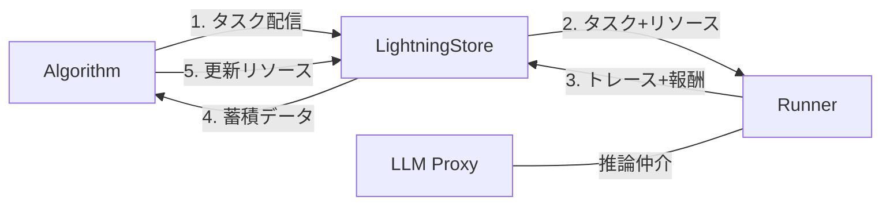
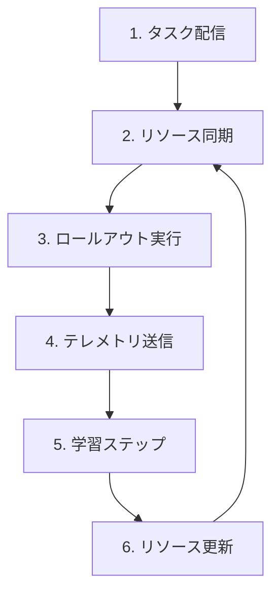
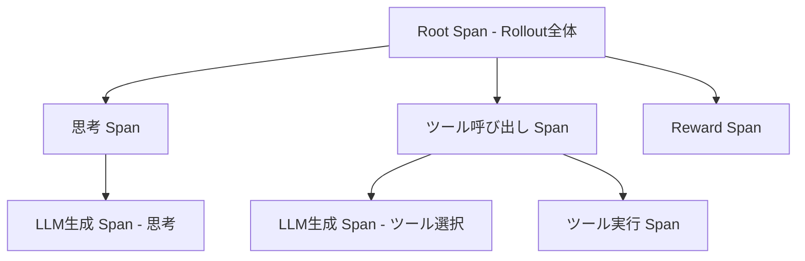
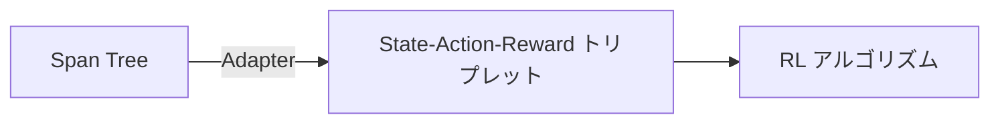

## はじめに

LangChain、AutoGen、OpenAI Assistants API などのフレームワークにより、自律型 AI エージェントの構築は容易になりました。一方で、構築したエージェントの性能を体系的に向上させる「最適化」は、手動のプロンプトエンジニアリングに依存しているのが現状です。

Microsoft Research が開発した **Agent Lightning** は、この課題を解決するオープンソースフレームワークです。エージェントの「実行」と「学習」を構造的に分離し、コード変更をほぼゼロに抑えながら、強化学習（RL）や自動プロンプト最適化（APO）を適用できます。

本記事では、Agent Lightning のアーキテクチャ、データモデル、環境構築、実装、運用までを体系的に解説します。

**対象読者**: AI エージェント開発の経験があり、エージェントの性能最適化に関心のあるエンジニア
**前提知識**: Python、LLM の基本概念、強化学習の基礎（報酬・エピソード等）

## エージェント最適化の課題

従来の機械学習パイプラインは、モデルと学習ループが密結合した「モノリシック」な構造を前提としています。エージェントシステムでは、この前提が成り立ちません。

| 課題 | 詳細 |
| :--- | :--- |
| 実行のブラックボックス化 | 外部 API 呼び出しが微分不可能なため、従来のバックプロパゲーション不可 |
| 実行時間の長さ | 1回のタスク完了に数秒〜数分を要し、同期的な学習ループでは GPU を浪費 |
| フレームワークの異質性 | LangChain、CrewAI など多様なフレームワークと学習ライブラリ間に統一インターフェースが不在 |
| 計算資源の要求差 | エージェント実行は CPU/IO 集約的、学習は GPU 集約的 |

既存のエージェントフレームワークとの違いを整理します。

| 観点 | 既存フレームワーク | Agent Lightning |
| :--- | :--- | :--- |
| 主な目的 | エージェントの構築 | エージェントの最適化 |
| 性能改善 | 手動プロンプト調整 | 自動（RL / APO） |
| 学習ループ | サポートなし | ネイティブサポート |
| フレームワーク依存 | 各フレームワーク固有 | フレームワーク非依存（ミドルウェア） |

## Training-Agent Disaggregation アーキテクチャ

Agent Lightning は **Training-Agent Disaggregation** というアーキテクチャを採用しています。エージェントの「実行」と「学習」を明確に分離し、非同期に連携させる設計です。



| 要素 | 説明 |
| :--- | :--- |
| Algorithm | 学習ロジックを司るサーバーサイドコンポーネント |
| LightningStore | Runner と Algorithm 間のデータ交換を仲介する中央データストア |
| Runner | エージェントを実行するクライアントサイドのワーカープロセス |
| LLM Proxy | エージェントと LLM 間に介在し、学習用メタデータを付与 |

### Runner: 実行者

Runner はエージェントを実行するワーカープロセスです。学習アルゴリズムの詳細を知る必要はなく、タスクをエージェントに処理させ、結果（軌跡と報酬）を記録します。エージェントのネイティブ環境（Docker コンテナやローカルマシン）で動作できるため、複雑な環境設定を学習サーバーから切り離せます。

### Algorithm: 学習者

Algorithm はシステムの「頭脳」です。Runner から収集されたトレースを分析し、エージェントのリソース（プロンプトテンプレートやモデルの重み）を更新します。エージェントの実装詳細から完全に独立しており、RL、APO、SFT など多様なアルゴリズムを同一エージェントに適用できます。

主なアルゴリズムは以下のとおりです。

| アルゴリズム | 最適化対象 | 手法 |
| :--- | :--- | :--- |
| APO | プロンプトテンプレート | 成功・失敗の軌跡を LLM に分析させ、プロンプトのバリエーションを生成・評価して最適解を探索 |
| RL（GRPO 等） | LLM の重み | グループ内の相対的な報酬を比較し、期待報酬を最大化するようにモデルパラメータを微調整 |

### LightningStore: 仲介者

Runner と Algorithm の間に直接の通信経路は存在しません。すべてのデータ交換は LightningStore を介して行われます。タスクキュー、結果ストレージ、リソースのバージョン管理を兼ね備えた中央データストアです。

| 機能 | 詳細 |
| :--- | :--- |
| タスクキュー管理 | Algorithm から投入されたタスクを保持し、空いている Runner にディスパッチ |
| リソースバージョニング | プロンプトやモデルの重みをイミュータブルなバージョンとして管理 |
| スパン・トレースの永続化 | エージェントの挙動データを受け取り保存 |
| 分散調整 | ワーカーの死活監視やステータス管理でシステム整合性を維持 |

主な REST API エンドポイントは以下のとおりです。

| エンドポイント | 役割 |
| :--- | :--- |
| `POST /tasks` | タスクの一括登録 |
| `POST /rollouts` | 完了したロールアウト（トレースデータ含む）の送信 |
| `GET /resources` | 指定 ID または最新バージョンのリソース取得 |
| `GET /spans` | 条件に基づくスパン検索 |

この設計により、Runner がクラッシュしても Algorithm は影響を受けず、Algorithm が停止しても Runner はタスクを処理し続けられます。

### LLM Proxy: 推論の仲介

RL トレーニングでは、生成トークンの対数確率（logprobs）や温度パラメータの制御が必要です。Agent Lightning は LLM Proxy を提供し、エージェントと LLM の間に介在します。

| 機能 | 詳細 |
| :--- | :--- |
| メタデータ付与 | リクエストを傍受し、logprobs 等の学習用メタデータをレスポンスに付与 |
| モデルルーティング | バックエンドモデルを学習中のチェックポイントに透過的に差し替え |
| 互換性確保 | 既存の OpenAI 互換 API インターフェースを維持 |

## 最適化ループのデータフロー

Agent Lightning の最適化プロセスは、以下の循環的なデータフローで進行します。



| ステップ | コンポーネント | 処理内容 |
| :--- | :--- | :--- |
| 1. タスク配信 | Algorithm → Store | 解決すべきタスクのセットを Store のキューに登録 |
| 2. リソース同期 | Store → Runner | Runner が Store をポーリングし、タスクと最新リソースを取得 |
| 3. ロールアウト | Runner | エージェントを実行し、計装により全挙動をスパンとして記録 |
| 4. テレメトリ送信 | Runner → Store | 軌跡データと報酬を Store にアップロード |
| 5. 学習 | Algorithm | Store から蓄積データを取得し、学習ステップを実行 |
| 6. リソース更新 | Algorithm → Store | 更新されたリソースを Store にプッシュし、次サイクルで利用可能に |

このアーキテクチャの最大の利点は、エージェントを「入力を受け取り、トレースと報酬を出力するブラックボックス」として抽象化できる点です。インターフェースさえ適合させれば、あらゆるエージェントを最適化対象にできます。

## データモデル: 統一データインターフェース

Agent Lightning は、エージェントの挙動を最適化アルゴリズムが扱える形式に変換するため、厳密なデータモデル（Unified Data Interface）を定義しています。

### コアデータプリミティブ

| クラス | 役割 | 主要属性 |
| :--- | :--- | :--- |
| Task | エージェントへの入力定義 | input, ground_truth |
| Rollout | 1エピソードの実行管理 | rollout_id, status, resources, metrics |
| Attempt | 再試行の管理単位 | attempt_id, error_type, 開始/終了時刻 |
| Span | 操作の記録単位（OpenTelemetry 準拠） | name, inputs, outputs, logprobs, parent_id |
| Resource | 最適化される資産 | PromptTemplate, ModelCheckpoint |

#### Task

エージェントに与える入力と正解データを含む最小単位です。従来の RL における「環境のリセット」と「初期状態の提供」に相当します。

```python
class RoomSelectionTask(TypedDict):
    input: str          # "4人用の会議室を10時に予約して"
    expected_choice: str # "会議室B"
    constraints: list    # ["プロジェクターあり", "窓側"]
```

#### Rollout

1つの Task に対するエージェントの完全な実行履歴を管理するオブジェクトです。タスク受領から報酬受領までの一連の流れ（エピソード）全体を表します。ステータスは `QUEUING` → `RUNNING` → `SUCCEEDED` / `FAILED` と遷移します。

#### Attempt

エージェントは確率的に動作し、外部要因で失敗する可能性があります。1つの Rollout 内に複数の Attempt が含まれる構造により、再試行ロジックをデータ構造レベルでサポートしています。API エラーで1回目が失敗した場合、システムは自動的に2回目の Attempt を作成します。

#### Span

OpenTelemetry 仕様に準拠した実行トレースの最小単位です。親子関係を持つツリー構造（Trace Tree）を形成し、因果関係を復元できます。



| Span 種別 | 記録内容 |
| :--- | :--- |
| LLM Span | LLM への入力プロンプト、出力テキスト、トークンごとの logprobs |
| Tool Span | ツール名、引数、実行結果、エラー情報 |
| Chain Span | エージェントの思考ステップ、内部関数の実行区間 |
| Reward Span | 実行の任意時点での報酬シグナル（密な報酬の実現） |

Reward Span により、長い推論プロセスの途中経過に報酬を与える「密な報酬」設計が可能です。従来の「疎な報酬」（エピソード終了時のみ）に比べ、学習効率が向上します。例えば、「正しいツールを選択できたか」という中間ステップに報酬を付与できます。

#### Resource

アルゴリズムによって更新・最適化される資産です。すべてイミュータブルなバージョンとして保存され、Rollout ごとに使用バージョンが紐付けられます。これにより実験の再現性が担保されます。

| リソース種別 | 説明 |
| :--- | :--- |
| PromptTemplate | 文字列テンプレート。APO によって書き換え・バージョン管理 |
| ModelCheckpoint | LoRA アダプタやフルパラメータの重みファイルへの参照。RL で更新 |

### Trace から Trajectory への変換

階層的な Span Tree を、RL アルゴリズムが理解できる線形な学習データに変換するのが **Adapter** 層です。



| 変換ステップ | 説明 |
| :--- | :--- |
| State の構築 | Span ツリーをトラバースし、時系列順に情報を結合して LLM 入力トークン列を再構成 |
| Action の抽出 | LLM が生成したテキストをアクションとして抽出し、logprobs も結合 |
| Reward の割り当て | Rollout 終了時の報酬を各アクションに配分（Credit Assignment） |

この変換により、LangChain や AutoGen など異種混合のエージェントを統一的な MDP（マルコフ決定過程）として抽象化し、あらゆるエージェントに RL アルゴリズムを適用できます。

## 環境構築

### 前提条件

- Python 3.10 以上
- GPU（RL トレーニング時）: NVIDIA GPU + CUDA 対応環境
- Docker（LightningStore の本番運用時）

### インストール

Agent Lightning は PyPI から配布されています。

```bash
# 基本パッケージ
pip install agent-lightning

# vLLM サポートを含むインストール
pip install agent-lightning[vllm]

# 開発用ツールを含むインストール
pip install agent-lightning[dev]
```

### LightningStore の立ち上げ

#### Docker による実運用環境

最も推奨される方法は、提供されている Docker Compose ファイルの使用です。

```bash
cd /path/to/agent-lightning
docker compose -f docker/compose.store.yml up -d
```

このコマンドにより、`http://localhost:4747` で Store API が利用可能になり、データは MongoDB に永続化されます。

#### CLI による簡易起動

一時的なテストやデバッグには、CLI コマンドでローカル起動できます。

```bash
# メモリ内バックエンド（プロセス終了でデータ消失）
agl store --port 4747 --backend memory

# MongoDB バックエンド
agl store --port 4747 --backend mongo --mongo-uri mongodb://localhost:27017
```

### vLLM 推論サーバーの準備

RL では数千〜数万回のロールアウトが必要です。コストと速度の観点から、ローカル LLM の使用が一般的です。Agent Lightning は高速推論エンジン **vLLM** と統合されています。

```bash
agl vllm serve meta-llama/Meta-Llama-3-8B-Instruct \
    --port 8000 \
    --host 0.0.0.0 \
    --tensor-parallel-size 1
```

Agent Lightning 経由で vLLM を起動すると、推論リクエストへの自動計装や学習に必要なメタデータの注入が可能になります。

## エージェントの実装

エージェントを Agent Lightning で最適化するには、既存のコードを Agent Lightning のインターフェースでラップします。主に2つの方法があります。

| 方法 | 適用場面 | 特徴 |
| :--- | :--- | :--- |
| `@rollout` デコレータ | シンプルなエージェント | 手軽、関数を FunctionalLitAgent に自動変換 |
| `LitAgent` クラス継承 | LangChain / AutoGen 等の複雑なエージェント | ライフサイクル全体を制御可能 |

### 方法 A: @rollout デコレータ

シンプルなエージェントには `@rollout` デコレータが最も手軽です。関数を自動的に `FunctionalLitAgent` に変換します。

```python
import agentlightning as agl
from openai import OpenAI

# 最適化対象のプロンプトリソース
math_instruction = agl.PromptTemplate(
    template="あなたは数学の専門家です。次の問題を解いてください: {input}",
    name="math_instruction"
)

@agl.rollout
def math_solver_agent(task: agl.Task, resources: agl.NamedResources) -> float:
    prompt_template = resources.get("instruction", math_instruction)
    formatted_prompt = prompt_template.format(input=task.input)

    client = OpenAI(base_url="http://localhost:8000/v1", api_key="EMPTY")
    response = client.chat.completions.create(
        model="meta-llama/Meta-Llama-3-8B-Instruct",
        messages=[{"role": "user", "content": formatted_prompt}]
    )
    answer = response.choices[0].message.content

    reward = 1.0 if "42" in answer else 0.0
    return reward
```

### 方法 B: LitAgent クラス

LangChain や AutoGen など複雑なフレームワークを使用する場合、`LitAgent` クラスの継承が推奨されます。PyTorch Lightning の `LightningModule` に相当し、エージェントのライフサイクル全体を制御できます。

```python
import agentlightning as agl
from langchain_openai import ChatOpenAI
from langchain_core.prompts import ChatPromptTemplate

class SQLLitAgent(agl.LitAgent):
    def __init__(self, db_schema: str):
        super().__init__()
        self.db_schema = db_schema

    def rollout(self, task: agl.Task, resources: agl.NamedResources,
                rollout_meta: agl.Rollout) -> float:
        llm_config: agl.LLM = resources["main_llm"]
        llm = ChatOpenAI(
            base_url=llm_config.endpoint,
            api_key=llm_config.api_key,
            model=llm_config.model,
            temperature=llm_config.sampling_params.get("temperature", 0.0)
        )

        prompt = ChatPromptTemplate.from_template(
            "Schema: {schema}\nQuestion: {question}\nSQL Query:"
        )
        chain = prompt | llm

        inputs = {"schema": self.db_schema, "question": task.input}
        try:
            result = chain.invoke(
                inputs,
                config={"callbacks": [self.tracer.get_langchain_handler()]}
            )
            generated_sql = result.content
        except Exception as e:
            agl.emit_exception(e)
            return 0.0

        reward = self.evaluate_sql(generated_sql, task.ground_truth)
        agl.emit_reward(reward)
        return reward
```

### 計装（Instrumentation）

Agent Lightning の学習は、エージェントの実行ログ（トレース）の分析に基づいています。正確な記録が極めて重要です。

| 計装方法 | 対象 | 仕組み |
| :--- | :--- | :--- |
| `agl.patch_openai()` | OpenAI SDK | API 呼び出しを自動的にスパンとして記録 |
| `self.tracer.get_langchain_handler()` | LangChain | Chain 開始、Tool 使用などのイベントをキャプチャ |
| `@agl.rollout` デコレータ | 任意の関数 | 関数シグネチャを解析し、OpenTelemetry スパンを自動開始 |

これらの自動計装は Python のメタプログラミング機能を活用しています。ライブラリのメソッドを動的にパッチ（Monkey Patching）することで、開発者が意識せずに内部通信を傍受します。これが「コード変更ほぼゼロ」の技術的根拠です。

## トレーニングループの実行

エージェントの実装が完了したら、`Trainer` で最適化プロセスを実行します。

```python
import agentlightning as agl
from agentlightning.algorithms import APO
from my_agent import SQLLitAgent

def main():
    # 1. Store への接続
    store = agl.LightningStoreClient("http://localhost:4747")

    # 2. LLM リソースの定義
    llm_resource = agl.LLM(
        model="meta-llama/Meta-Llama-3-8B-Instruct",
        endpoint="http://localhost:8000/v1",
        api_key="EMPTY"
    )

    # 3. アルゴリズムの設定
    algorithm = APO(
        llm=llm_resource,
        num_proposals=4,   # 1ラウンドあたりのプロンプト案の数
        generations=5       # 最適化ラウンド数
    )

    # 4. エージェントの初期化
    agent = SQLLitAgent(db_schema="...")

    # 5. Trainer の構築
    trainer = agl.Trainer(
        agent=agent,
        algorithm=algorithm,
        store=store,
        execution_strategy="client_server",
        default_resources={"main_llm": llm_resource}
    )

    # 6. トレーニング開始
    train_dataset = agl.Dataset.from_json("train_data.json")
    trainer.fit(train_dataset=train_dataset)

if __name__ == "__main__":
    main()
```

スクリプトを実行すると、以下のループが自動進行します。

1. Trainer がタスクを Store に登録
2. APO が初期プロンプトを生成
3. Runner がタスクを処理し、トレースと報酬を返却
4. Algorithm がフィードバックを基に次世代プロンプトを生成
5. 2〜4 を指定ラウンド数だけ繰り返し

## 実行戦略

Agent Lightning は開発フェーズに応じて2つの実行トポロジーを提供しています。

| 戦略 | 構成 | 通信オーバーヘッド | ユースケース |
| :--- | :--- | :--- | :--- |
| Shared-Memory | 単一プロセス・マルチスレッド | なし（参照渡し） | 開発、デバッグ、小規模実験 |
| Client-Server | 分散プロセス・HTTP/gRPC | あり（シリアライズ必要） | 大規模 RL 学習、Kubernetes 展開 |

### Shared-Memory 戦略

単一 Python プロセス内で Algorithm と Runner をスレッドとして実行します。データのシリアライズが不要でデバッグが容易です。プロトタイピングに最適ですが、Python の GIL 制約により大規模並列処理には向きません。

### Client-Server 戦略

HTTP/gRPC 通信を介して物理的に異なるマシン間で連携します。Runner を Kubernetes クラスタや複数の GPU ノードに分散配置でき、環境依存の問題を回避できます。128 GPU 規模での RL トレーニング実績があります。

### Ray による分散学習

大規模モデル（70B+ パラメータ）の RL では単一 GPU ではメモリ不足になります。Agent Lightning は分散処理フレームワーク **Ray** と統合されており、Algorithm 側の学習ステップを複数 GPU ノードに分散できます。

## 高度な最適化

### カスタムアルゴリズム

`Algorithm` 基底クラスを継承し、2つのメソッドをオーバーライドすることで独自ロジックを実装できます。

| メソッド | 役割 |
| :--- | :--- |
| `tell(rollouts)` | 新しいロールアウトデータを受け取り、報酬集計や勾配計算を実行 |
| `ask(batch_size)` | 次に実行すべきタスクや更新リソースを生成して返却 |

```python
class MyCustomAlgorithm(agl.Algorithm):
    def tell(self, rollouts: list[agl.Rollout]):
        # 報酬の集計、勾配計算、リプレイバッファへの追加など
        for rollout in rollouts:
            self.buffer.append(rollout)

    def ask(self, batch_size: int) -> list[agl.Task]:
        # 蓄積データを分析し、次のタスクと更新リソースを返却
        new_prompt = self.optimize_prompt(self.buffer)
        return self.generate_tasks(new_prompt, batch_size)
```

### VERL との統合

Agent Lightning は、エージェント学習に特化した RL ライブラリ **VERL**（Volatile Experience Replay Learning）と連携します。Adapter が Store の OTel トレースデータを、RL アルゴリズムが理解できる形式（Prompt, Response, Reward のトリプレット）に変換します。変換されたデータが VERL の Trainer に渡され、PPO や GRPO でモデルの重みが更新されます。

### エラー情報のデータ化

Agent Lightning ではエラーも重要な学習データとして扱います。Tracer が例外の種類（ToolTimeoutError、ContextLengthExceeded など）を Span の属性として記録し、報酬関数で特定エラーにペナルティを設定できます。エージェントは「ツール引数を正しく生成する」「コンテキスト長を超えない応答をする」といった行動を自律的に学習します。

## 運用とモニタリング

### ダッシュボード

Agent Lightning には学習状況を可視化する Web ダッシュボードが付属しています。

| 機能 | 説明 |
| :--- | :--- |
| Reward Curve | 学習の収束状況を確認 |
| Trace Viewer | ガントチャート形式でエージェントの思考プロセスを表示 |

Trace Viewer は、どのステップで時間がかかっているか、どこでエラーが発生したかを視覚的に特定でき、ハルシネーションやループのデバッグに有用です。

```bash
cd dashboard
npm ci
npm run build
```

### デバッグ

学習が停滞した場合、Store のクエリ機能で失敗したロールアウトのみを抽出・分析できます。

```python
failed_rollouts = store.query_rollouts(
    filter={"status": "FAILED"},
    limit=10
)

for rollout in failed_rollouts:
    print(f"Rollout ID: {rollout.rollout_id}")
```

### トラブルシューティング

| 失敗モード | 原因 | 対策 |
| :--- | :--- | :--- |
| 報酬が向上しない | タスクが難しすぎる、プロンプト探索空間が狭い | タスク細分化（カリキュラム学習）、APO の temperature を上げて探索拡大 |
| Runner がタイムアウト | エージェントの無限ループ、LLM の応答遅延 | timeout_seconds の増加、ループ脱出ロジック追加 |
| Store のメモリ枯渇 | トレースデータの肥大化 | 不要スパンの削減、MongoDB による永続化とアーカイブ |

## まとめ

Agent Lightning は、AI エージェント開発を手動のプロンプト調整から、データ駆動型の自動改善サイクルへ移行させるフレームワークです。

| 特徴 | 効果 |
| :--- | :--- |
| Training-Agent Disaggregation | エージェントの論理的複雑さと学習インフラの物理的制約を分離 |
| 統一データインターフェース | 異種混合のエージェントの挙動を標準化された MDP 形式に統一 |
| 計装の自動化 | 既存コードへの変更をほぼゼロに抑えて最適化を適用 |
| フレームワーク非依存 | LangChain、AutoGen 等あらゆるエージェントに適用可能 |

従来の「プロンプトを書いて試す」というサイクルに限界を感じている方にとって、Agent Lightning はエージェント最適化の自動化という新たな選択肢を提供します。特に APO によるプロンプト最適化は、GPU を必要とせず手軽に始められるため、最初の一歩として適しています。

### 次のステップ

1. [公式チュートリアル](https://microsoft.github.io/agent-lightning/latest/how-to/train-first-agent/)で最初のエージェントをトレーニング
2. `@rollout` デコレータで既存エージェントをラップし、APO による自動プロンプト最適化を試行
3. 効果が確認できたら、Client-Server 戦略に移行して本格的な RL トレーニングを実施

## 引用文献

- 公式ドキュメント
  - [Agent-lightning](https://microsoft.github.io/agent-lightning/latest/)
  - [Bird's Eye View - Agent-lightning](https://microsoft.github.io/agent-lightning/latest/deep-dive/birds-eye-view/)
  - [Understanding Store - Agent-lightning](https://microsoft.github.io/agent-lightning/stable/deep-dive/store/)
  - [Train the First Agent - Agent-lightning](https://microsoft.github.io/agent-lightning/latest/how-to/train-first-agent/)
  - [Write the First Algorithm - Agent-lightning](https://microsoft.github.io/agent-lightning/latest/how-to/write-first-algorithm/)
  - [Examples Catalog - Agent-lightning](https://microsoft.github.io/agent-lightning/latest/how-to/examples-catalog/)
  - [Work with Traces - Agent-lightning](https://microsoft.github.io/agent-lightning/latest/tutorials/traces/)
  - [Write Agents - Agent-lightning](https://microsoft.github.io/agent-lightning/latest/tutorials/write-agents/)
  - [Installation - Agent-lightning](https://microsoft.github.io/agent-lightning/latest/tutorials/installation/)
  - [Debugging - Agent-lightning](https://microsoft.github.io/agent-lightning/stable/tutorials/debug/)
  - [Command Line - Agent-lightning](https://microsoft.github.io/agent-lightning/stable/reference/cli/)
  - [Types - Agent-lightning](https://microsoft.github.io/agent-lightning/stable/reference/types/)
  - [Agent - Agent-lightning](https://microsoft.github.io/agent-lightning/latest/reference/agent/)
  - [Store - Agent-lightning](https://microsoft.github.io/agent-lightning/stable/reference/store/)
  - [Algorithm - Agent-lightning](https://microsoft.github.io/agent-lightning/stable/reference/algorithm/)
  - [Agent Lightning Trainer](https://microsoft.github.io/agent-lightning/stable/reference/trainer/)
- GitHub
  - [microsoft/agent-lightning](https://github.com/microsoft/agent-lightning)
- 論文・研究
  - [Agent Lightning - Microsoft Research](https://www.microsoft.com/en-us/research/project/agent-lightning/)
  - [Agent Lightning: Train ANY AI Agents with Reinforcement Learning - arXiv](https://arxiv.org/html/2508.03680v1)
  - [Agent Lightning: Train ANY AI Agents with Reinforcement Learning - Hugging Face](https://huggingface.co/papers/2508.03680)
- 記事
  - [Deep dive into the Training-Agent Disaggregation architecture of Agent Lightning - Medium](https://medium.com/data-science-at-microsoft/deep-dive-into-the-training-agent-disaggregation-architecture-of-agent-lightning-106be8ea0210)
  - [Tracing + Prompt Optimization for a Tool-Using SQL Agent - Medium](https://medium.com/@dharamendra1314.kumar/tracing-prompt-optimization-for-a-tool-using-sql-agent-vllm-agent-lightning-apo-4cd08738f81c)
  - [Train Your AI Agents with Microsoft Agent Lightning - Analytics Vidhya](https://www.analyticsvidhya.com/blog/2025/10/microsoft-agent-lightning/)
  - [Microsoft Agent Lightning - Overview and Design Principles - Stackademic](https://blog.stackademic.com/microsoft-agent-lightning-overview-and-design-principles-843b74176e15)
  - [Get Started with Distributed Training using PyTorch Lightning - Ray Docs](https://docs.ray.io/en/latest/train/getting-started-pytorch-lightning.html)
  - [Monitor agents with the Agent Monitoring Dashboard - Microsoft Foundry](https://learn.microsoft.com/en-us/azure/ai-foundry/observability/how-to/how-to-monitor-agents-dashboard?view=foundry)
