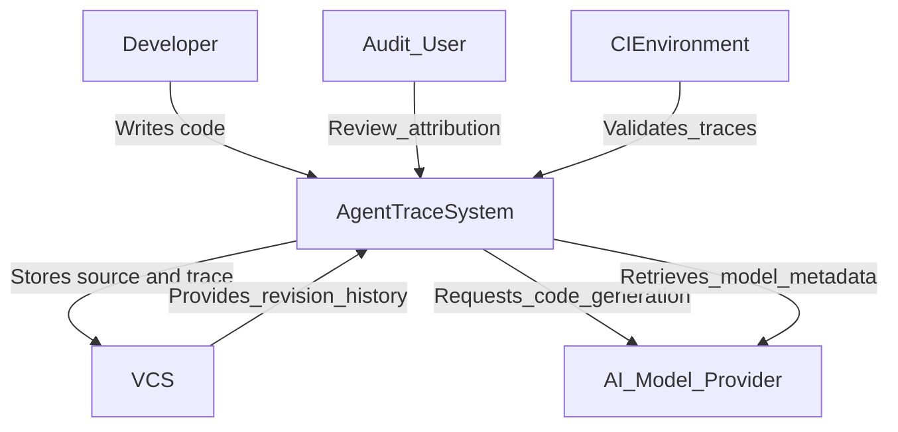
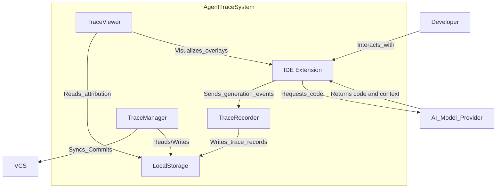
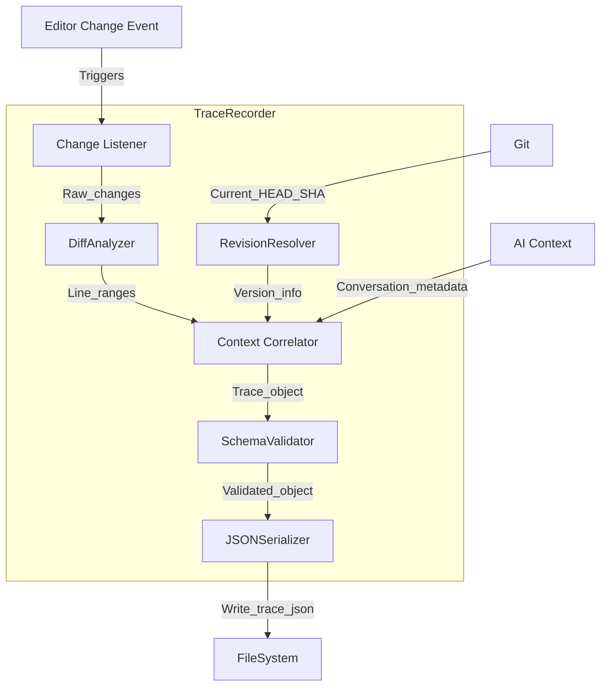
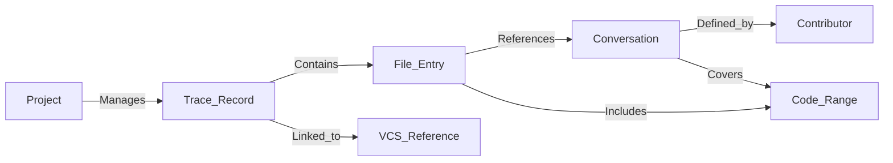
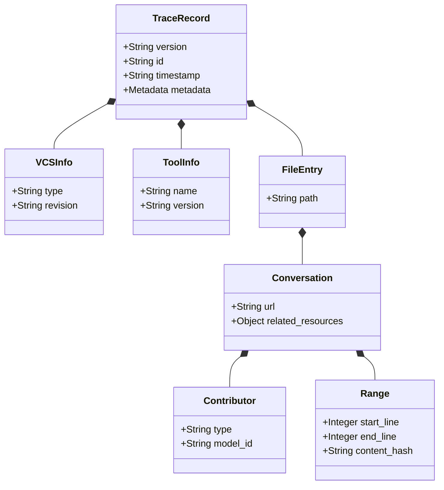

## ■ 概要

Agent Traceは、AIエージェント生成コードの出自とコンテキストを記録・管理する技術仕様です。この記事では、技術の全容、構造、データモデル、構築・運用手法を解説します。

現代の開発現場では、AIコーディング支援ツールや自律型AIエンジニアの導入が急増しています。これに伴い、コードベースへのAI貢献比率が増大し、開発フローが変化しています。しかし、既存のバージョン管理システム（VCS）は、コードのコミット作成者を記録できますが、AIモデルの種類や生成指示の内容は記録できません。

情報の欠落は、以下の課題を引き起こします。

*   **説明責任の所在不明確化**
    *   バグや脆弱性混入時のAI幻覚と人間ミスの切り分け困難
*   **コンテキストの喪失**
    *   思考プロセスや試行錯誤履歴の消失
    *   修正者による意図把握の困難化
*   **法的・コンプライアンスリスク**
    *   権利関係やポリシー適合性の監査手段欠如

Agent Traceは、これらの課題に対する効果的な解決策です。主要ベンダーが支持しており、変更履歴にAI対話履歴やモデル情報を紐付ける標準規格です。現在のバージョン（v0.1.0）では、特に相互運用性が重視されています。

Agent Traceは、コード行管理からコンテキスト管理への転換を象徴します。AIと人間の協働作業を透明化し、保守可能なコンテキストグラフを構築します。

## ■ 特徴

Agent Traceの主な特徴と利点は以下の通りです。

*   **詳細な帰属追跡（Granular Attribution）**
    *   ファイル単位ではなく行範囲レベルでの追跡
    *   行ごとの著者の明確化（Human、AI、Mixed、Unknown）
    *   AI生成ロジックの重点的チェック
*   **コンテキストの永続化とリンク（Context Persistence）**
    *   変更箇所とAI対話セッションの永続的なリンク
    *   対話ログURLによるプロンプトや思考プロセスの確認
    *   コードベースを汚さない背景情報の保持
*   **ベンダー中立性と相互運用性（Vendor Neutrality）**
    *   特定ツールに依存しないオープンなJSONスキーマ
    *   クロスツールな運用の詳細
    *   metadataフィールドによるベンダー独自の拡張
*   **既存VCSとのシームレスな統合**
    *   主要VCS（Git、Mercurial、Jujutsu）との共存
    *   リビジョンとトレースデータの紐付け
    *   リポジトリ内保存による手軽な共有・同期
*   **位置独立性の確保（Position Independence）**
    *   コンテンツハッシュによるロバストな追跡
    *   リファクタリングや行移動への追従
    *   行ズレによる情報ロストの防止

## ■ 構造

C4モデル（Context, Containers, Components）を用いて、本システムのアーキテクチャを可視化・解説します。

### ● システムコンテキスト図



| 要素名                     | 説明                                                                       |
| :------------------------- | :------------------------------------------------------------------------- |
| **Developer**              | ソースコードの作成、修正、デバッグを行う開発者                             |
| **Audit User**             | コードの品質管理、法的コンプライアンス確認、プロジェクト管理を行うユーザー |
| **Agent Trace System**     | コード生成の帰属情報を記録、管理、表示する機能群の総称                     |
| **Version Control System** | ソースコードおよび生成されたトレースデータの保存・版管理を行う外部システム |
| **AI Model Provider**      | コード生成機能とメタデータを提供する外部AIサービス                         |
| **CI/CD Environment**      | ビルドやテストのプロセスでトレース情報の整合性チェックを行う環境           |

### ● コンテナ図



| 要素名                     | 説明                                           |
| :------------------------- | :--------------------------------------------- |
| **IDE Extension / Client** | 開発者が操作するインターフェース               |
| **Trace Recorder**         | バックグラウンドでのトレースデータ作成         |
| **Trace Viewer**           | トレースデータの読み取りと視覚的表示           |
| **Trace Manager**          | トレースデータのライフサイクル管理             |
| **Local Trace Storage**    | トレースファイルの一時的または永続的な保存領域 |

### ● コンポーネント図



| 要素名                 | 説明                                                 |
| :--------------------- | :--------------------------------------------------- |
| **Change Listener**    | エディタ上のファイル変更イベントやバッファ更新の監視 |
| **Diff Analyzer**      | 変更前後比較による行範囲の特定                       |
| **Context Correlator** | 変更範囲と直前のAI対話の関連付け                     |
| **RevisionResolver**   | トレースデータへのバージョン情報付与                 |
| **SchemaValidator**    | データオブジェクトの完全性検証                       |
| **JSON Serializer**    | オブジェクトのJSONシリアライズと保存                 |

## ■ 情報

### ● 概念モデル



| 要素名            | 説明                                         |
| :---------------- | :------------------------------------------- |
| **Project**       | 管理対象のソフトウェアプロジェクト全体       |
| **Trace Record**  | 一回のAI生成操作やコミット単位の記録         |
| **VCS Reference** | バージョン管理システム上の特定時点への参照   |
| **File Entry**    | トレースに含まれる個別のファイル情報         |
| **Conversation**  | コード変更の根拠となったAIとの対話セッション |
| **Contributor**   | コード生成を行った主体（AIまたは人間）       |
| **Code Range**    | ファイル内の具体的な行範囲                   |

### ● 情報モデル



| クラス名         | 属性・説明                                             |
| :--------------- | :----------------------------------------------------- |
| **TraceRecord**  | ルートオブジェクト（version, id, timestamp, metadata） |
| **VCSInfo**      | バージョン管理情報（type, revision）                   |
| **ToolInfo**     | トレース生成ツール情報（name, version）                |
| **FileEntry**    | ファイル単位のエントリ（path）                         |
| **Conversation** | 対話情報（url, related_resources）                     |
| **Contributor**  | 貢献者情報（type, model_id）                           |
| **Range**        | 行範囲情報（start_line, end_line, content_hash）       |

## ■ 構築方法

### ● 1. 前提条件の確認

*   **バージョン管理システム**
    *   Gitリポジトリ（またはサポートされるVCS）での管理
*   **ランタイム環境**
    *   Node.js環境（npm/npx）の用意
*   **エディタ/IDE**
    *   Agent Traceサポート環境（Cursor、VS Codeなど）

### ● 2. クライアントサイドツールの導入

Agent Traceは仕様（Specification）であり、その実装は複数のベンダーやコミュニティから提供されています。利用するツールに合わせて導入手順を選択してください。

#### A. Claude Code / agent-trace-ops の場合

*   **プラグインのインストール**
    *   Claude Codeへのプラグイン追加とコマンド実行
    ```bash
    /plugin marketplace add peerbot-ai/claude-code-optimizer
    /plugin install agent-trace-ops
    ```
*   **CLIツールのインストール（オプション）**
    *   手動分析用CLIツールのグローバルインストール
    ```bash
    npm install -g agent-trace-ops
    ```
*   **動作確認**
    *   エージェント対話によるトレース生成や分析の確認

#### B. Trajectories CLI の場合

*   **インストールの実行**
    *   CLIツールのシステムパスへの配置
*   **リポジトリの初期化**
    *   `.trace/` または `.trajectories/` ディレクトリの作成
    ```bash
    trail init
    ```

### ● 3. リポジトリ設定とCI/CD統合

*   **gitignoreの設定**
    *   トレースデータの管理ポリシー決定
        *   **永続化する場合**: トレースファイルをコミット対象に設定
        *   **一時利用のみの場合**: 除外設定
*   **検証スクリプトの配置**
    *   CIパイプラインによる整合性チェックの追加
    ```yaml
    # .github/workflows/trace-check.yml
    steps:
      - uses: actions/checkout@v3
      - name: Validate Traces
        run: npx agent-trace-validator ./src
    ```

## ■ 利用方法

### ● 1. 開発時の自動記録

*   **AIによるコード生成**
    *   エディタ上のAIチャットでの指示
    *   AIによるコード生成とファイル適用
    *   Trace RecorderによるTrace Record自動生成と保存
*   **コミット操作**
    *   git commitの実行
    *   コミットフックによるトレースデータとリビジョンの紐付け

### ● 2. トレース情報の閲覧とレビュー

*   **インライン情報の確認**
    *   エディタ上でのポップアップ表示（モデル名、信頼度など）
    *   リンクによるチャットログの参照
*   **Blameビューの活用**
    *   行単位でのAI生成元の表示によるパターン発見

### ● 3. 軌跡の管理

*   **タスクの開始**
    *   作業開始コマンドの実行
    ```bash
    trail start "Implement User Authentication"
    ```
*   **タスクの完了と記録**
    *   一連の変更とAI貢献度の記録
    ```bash
    trail complete --summary "Added JWT auth via Auth0" --confidence 0.85
    ```
*   **過去の軌跡の参照**
    *   特定タスクの作業内容とコード帰属の表示
    ```bash
    trail show traj_abc123 --trace
    ```

### ● 4. 最適化の分析

*   **プランニングの実行**
    *   AIエージェント対話履歴の分析
    ```bash
    /agent-trace-ops:plan
    ```
*   **リファクタリングの提案**
    *   ツール提示の改善案による効率化

## ■ 運用

### ● 1. ストレージ戦略とデータ管理

*   **データ保存場所の選定**
    *   *小規模〜中規模*: リポジトリ内 `.trace` フォルダでのGit管理
    *   *大規模*: 外部ストレージと参照ポインタの活用
*   **アーカイブポリシー**
    *   不要トレースデータの定期的クリーンアップ

### ● 2. セキュリティとプライバシー保護

*   **PII/機密情報のサニタイズ**
    *   プロンプト内の機密情報（APIキー等）のマスキング
*   **アクセス制御**
    *   対話ログサーバーへのアクセス権限管理

### ● 3. バージョン管理との整合性維持

*   **マージコンフリクトの解消**
    *   行番号オフセットの自動修正監視
    *   content_hash利用による行範囲の再特定
*   **手動編集の追跡**
    *   Agent Trace対応エディタ経由での変更統一

### ● 4. コンテキストグラフとしての活用

*   **意思決定のデータベース化**
    *   高品質コード生成プロンプトやモデル適性の分析
*   **オンボーディングへの利用**
    *   過去の対話ログ教材利用によるコード意図の理解

## ■ まとめ

Agent Traceは、AI時代の新たなコンテキスト管理標準です。

コードの「出自」と「生成コンテキスト」を透明化することで、説明責任と将来的な保守性を担保します。導入には環境構築が必要ですが、既存の開発フローと共存できます。

本技術は、AIと人間が協働する開発現場において、信頼と効率を支える重要なインフラとなります。

この記事が少しでも参考になった、あるいは改善点などがあれば、ぜひリアクションやコメント、SNSでのシェアをいただけると励みになります！

## ■ 参考リンク

- **公式ドキュメント**
    - [Agent Trace](https://agent-trace.dev/)
    - [GitHub: cursor/agent-trace](https://github.com/cursor/agent-trace)
    - [GitHub: AgentWorkforce/trajectories](https://github.com/AgentWorkforce/trajectories)
    - [GitHub: peerbot-ai/agent-trace-ops](https://github.com/peerbot-ai/agent-trace-ops)
- **記事**
    - [Agent Trace: Capturing the Context Graph of Code](https://cognition.ai/blog/agent-trace)
    - [【決定版】Agent Traceが変えるAIエージェント開発](https://note.com/masa_wunder/n/na015a44808f7)
