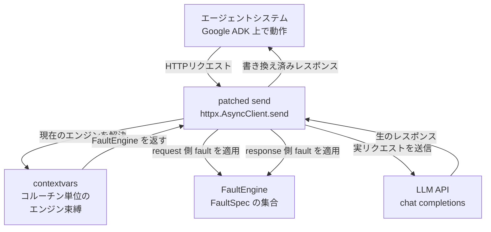
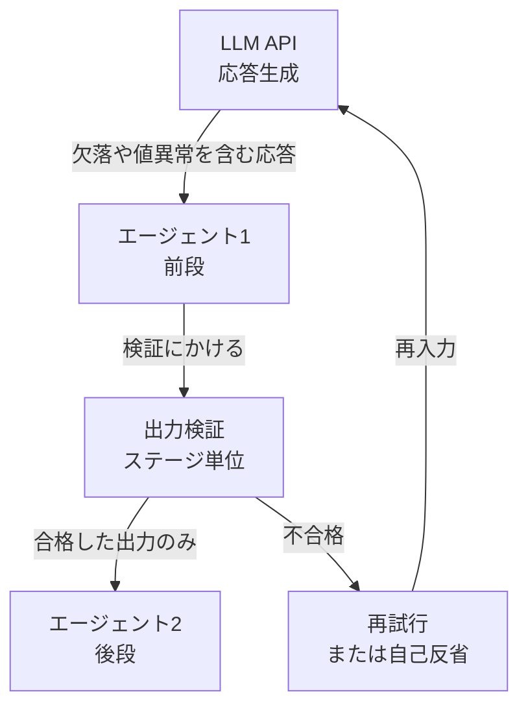

エージェントが失敗したとき、原因がモデルの能力なのか、LLM APIが返した壊れたレスポンスなのかは切り分けにくいものです。

AgentChaosは、この切り分けを実験として成立させるフレームワークです。ASE 2026に採択された論文（arXiv:2608.06790）と、実装が公開されています。

この記事で扱う範囲は次の3つです。

- AgentChaosが「HTTP層への非侵入な障害注入」をどう実現しているか（実装コードベース）
- 65個の障害構成が何をどう組み合わせた数なのか
- 自分のエージェントに持ち帰れる設計指針と、フレームワーク側の割り切り

論文の主張だけでなく、公開実装 `scripts/fault_injection.py` を読んで確認した挙動まで踏み込みます。読者として想定するのは、LLMエージェントを本番運用していて障害時の振る舞いをテストしたい方です。

障害注入という切り口では、MCPツールの応答を record/replay して緩和策の効果を検証するAgentCheckのようなアプローチもあります。AgentChaosの固有性は、介入点が**LLM自身の応答**（contentとtool_callsの引数）であり、ライブ通信をその場で書き換え、pass@1の低下幅を主指標に置く点です。ツール実行結果ではなく、モデルの出力そのものが壊れたときの伝播を見ます。


*この記事の全体像。以下、順に解説します。*

## AgentChaosの概要

AgentChaosは、LLM APIに依存するエージェントシステムの堅牢性を評価するカオスエンジニアリングフレームワークです。

出発点は「すべてのエージェントシステムは、同じHTTPのrequest-response層を経由してLLMにアクセスする」という観察です。フレームワークが AutoGen であれ独自実装であれ、上位の抽象化を剥がせば残るのはHTTPのやり取りです。AgentChaosはこの共通層にラッパーを差し込み、実行中のレスポンスを書き換えます。

ただし具体的なペイロード形式はプロバイダごとに異なります。論文はOpenAIの `/v1/chat/completions` とAnthropicの `/v1/messages` を挙げたうえで、多くのフレームワークがOpenAI互換APIを使う実態を理由に、Chat Completions形式を採用したと述べています。公開実装が傍受するのも、URLに `/chat/completions` を含むリクエストだけです。

この設計により、次の3点が同時に成立します。

| 性質 | 内容 |
|---|---|
| 非侵入 | 評価対象のソースコードを一切変更しない |
| ランタイム | 実行中のシステムに注入するため、リトライ・早期終了・エラー伝播といった動的な振る舞いを観測できる |
| 再現可能 | 変更関数は決定論的で、乱数も固定シード。同じ入力レスポンスと同じ呼び出し順なら同じ書き換えが再現する |

再現するのは書き換えの部分だけである点には注意が要ります。論文の評価はtemperature 0.7で実施されており、LLMの出力そのものは実行ごとにばらつきます。固定できるのは「同じレスポンスが来たら同じように壊す」ところまでです。

既存の障害注入手法は、オフラインで静的に評価する、ソース改変を要求する、特定のレスポンスフィールドだけを狙えない、のいずれかの制約を持ちます。AgentChaosはその隙間を埋めます。

論文の評価結果は次の通りです。

- 65個の障害構成のもとで、評価した5システムはいずれも**大半のデータセットで性能低下**を示した
- pass@1 の低下幅は最大で**49.66ポイント**（GPT-5.2上のMapCoder、HumanEval+）
- 一部のセルでは障害注入後に数値が上昇した。著者は1構成あたり約4.6件という小標本と、temperature 0.7による生成のばらつきを理由に挙げている
- 堅牢性の**順位はバックボーンLLMを変えても一貫**した。この一貫性は、堅牢性がモデル性能よりシステム実装に依存することを**示唆**する
- 既存の障害診断手法の精度は、障害タイプの特定で**53%未満**、障害ステップの特定で**56%未満**にとどまった

最後の数字には測定範囲の注記が要ります。診断評価の対象は Mini-SE × SWE-bench Pro に絞られており、全バックボーン・全障害構成から集めた失敗654件が母数です。Mini-SEは1タスクあたり平均21.73回のLLM呼び出しと最も長いトレースを持ち、診断が最も難しいケースとして選ばれています。内訳はルールベースがタイプ52.45% / ステップ55.50%、LLMベースがタイプ47.25% / ステップ53.52%です。

範囲は限定的ですが、示唆は重いままです。長いトレースを持つエージェントで障害が起きたとき、それがどの種類の障害でどのステップで起きたかを、既存手法は半分程度しか当てられません。

## 障害タクソノミ: 6タイプ × 2フィールド

AgentChaosは、分散システムの古典的な障害分類（Crash / Omission / Value）を、LLM APIレスポンスの2つの対象フィールドに適用して、その範囲内の6タイプを体系化します。レスポンス全体やHTTP層の障害を網羅するものではありません。

| カテゴリ | 障害タイプ | 現実のシナリオ |
|---|---|---|
| Crash | Error | サーバー過負荷、HTTP 5xx、レートリミット |
| Crash | Timeout | ネットワーク輻輳、バックエンド遅延、APIレイテンシ |
| Omission | Empty | セーフティフィルタ、コンテンツポリシー拒否 |
| Omission | Truncate | トークン上限、TCP切断、不完全な補完 |
| Value | Corrupt | エンコーディングエラー、文字化け |
| Value | Schema | パースエラー、スキーマ不一致 |

マトリクスが対象とするフィールドは2つです。

- `$.choices[0].message.content`（自然言語の応答本文）
- `$.choices[0].message.tool_calls[0].function.arguments`（ツール呼び出しの引数）

同じ「Truncate」でも、対象がcontentなら「途中で切れた文章」、tool_callsのargumentsなら「引数の値が欠けたツール呼び出し」になり、下流での壊れ方がまったく違います。フィールドを分けて列挙する意味はここにあります。

### 実装が実際に何をしているか

ここは論文の抽象度では見えない部分です。実装 `LLM_FAULT_BASES` / `TOOL_FAULT_BASES` を読むと、各障害タイプは `FaultSpec` として次のように定義されています。

| 実験名 | action | target_path | 具体的な書き換え |
|---|---|---|---|
| `llm_error` | set | `message.content` | content を `[API ERROR] HTTP 500: ...` という文字列に置換 |
| `llm_timeout` | set | `message.content` | content を `[TIMEOUT] ...` という文字列に置換 |
| `llm_empty` | set | `message.content` | content を空文字に置換 |
| `llm_truncate` | truncate | `message.content` | 先頭30%だけ残し、`finish_reason` を `length` に設定 |
| `llm_corrupt` | corrupt | `message.content` | UTF-8でencodeしてLatin-1でdecodeし、文字化けを再現 |
| `llm_schema` | set | `message.content` | 自然言語の代わりにJSON風文字列を返す |
| `tool_error` | set | `function.arguments` | `{}` に置換（必須引数の欠落） |
| `tool_timeout` | drop | `tool_calls` | contentをタイムアウト文言に、`tool_calls` を空配列に |
| `tool_empty` | set | `tool_calls` | 空配列に置換（ツールが呼ばれない） |
| `tool_truncate` | truncate | `function.arguments` | JSONをパースして各文字列値を30%に切り詰め、有効なJSONとして再シリアライズ |
| `tool_corrupt` | corrupt | `function.arguments` | JSON値の約20%の文字をUnicode記号（U+2600台）に置換 |
| `tool_schema` | set | `function.arguments` | `{"wrong_param": "unexpected_value"}` に置換 |

1点、リポジトリのコメントと実挙動がずれている箇所があります。`tool_truncate` のコメントは「broken JSON → parse error」と書かれていますが、実装の `_truncate_json_values()` は `json.loads()` で読んでから値を短縮し、`json.dumps()` で書き戻します。生成されるのは構文的に有効なJSONです。つまりこの障害が突くのは、パーサーではなく**引数の値が静かに欠けたままツールが実行される**経路です。

もう1つ、注目すべき割り切りがあります。**CrashカテゴリのErrorとTimeoutは、HTTPステータスコードを変えていません。** 実装は元のレスポンスのステータスをそのまま返し、`content` に `[API ERROR] HTTP 500: ...` という文字列を入れます。

```python
# fault_injection.py の応答再構築部分（抜粋）
new_bytes = json.dumps(resp_body).encode("utf-8")
status = response.status_code  # 元のステータスを維持
return httpx.Response(status, content=new_bytes,
                      headers={"content-type": "application/json"},
                      request=request)
```

つまり、AgentChaosが測っているのは「200 OKで返ってきた壊れた中身をエージェントが検知できるか」です。SDKレベルの例外ハンドリング（`APIStatusError` の捕捉など）は、この経路では発火しません。

同じコードから読み取れる副作用がもう1つあります。再構築したレスポンスのヘッダーは `content-type` だけで、**元のヘッダーは引き継がれません**。リクエストID、レートリミット系のヘッダー、`Retry-After`、ベンダー固有のメタデータは、書き換えが発生した応答では消えます。これらのヘッダーに依存したリトライ制御や観測性の仕組みは、この経路では検証できません。

これは弱点ではなく、狙いとして読むのが妥当です。ステータスコードで弾ける障害はSDKが既に対処しています。危険なのは「HTTP 200を返しながら中身が壊れている」障害であり、そこを狙い撃ちしています。ただし自分のシステムで「5xxのリトライが効くか」を検証したい場合、AgentChaosはそのままでは使えません。

## 注入戦略と複合シナリオ

同じ障害タイプでも、1回だけ起きるのか、ずっと続くのかで影響はまったく違います。AgentChaosは注入の時間パターンを4つの戦略として持ちます。

| 戦略 | 実装パラメータ | 想定する現実 |
|---|---|---|
| Single | `max_count=1, probability=1.0` | 一過性のネットワーク瞬断 |
| Persistent | `max_count=∞, probability=1.0` | APIキー失効など継続的な障害 |
| Intermittent | `max_count=∞, probability=0.3` | 約30%のパケットロス相当のフレーク |
| Burst | `max_count=3, probability=1.0` | レートリミットによる連続失敗からの回復 |

さらに、現実のインシデントを模した複合シナリオが8つ定義されています。

| シナリオ | 内容 |
|---|---|
| API degradation | 3秒の遅延を入れた後にHTTP 503相当の応答を返す |
| Content filter | tool_callsを除去し、contentをフィルタ文言に置換 |
| Max tokens | contentを切り詰め、`finish_reason` を `length` に設定 |
| Proxy HTML | contentをHTMLエラーページに置換 |
| Stale cache | 次の呼び出しで直前のレスポンスをそのまま再生 |
| Stale data | tool_callsの引数を誤った値に置換 |
| Wrong entity | tool_callsの引数を曖昧な値に置換 |
| Slow response | 内容は変えず遅延だけを加える |

Stale cache（直前のレスポンスの再生）は、リバースプロキシのキャッシュ設定ミスで実際に起きる事故です。エージェントから見ると「同じことを2回言われる」状態になり、ループ検知を持たないシステムは無限に同じステップを繰り返します。

### 65という数の内訳

論文の「65 fault configurations」は、実装の `_build_experiments()` を読むと正確に再現できます。

| 区分 | 計算 | 件数 |
|---|---|---|
| マトリクス実験 | 6タイプ × 2対象フィールド × 4戦略 | 48 |
| 複合シナリオ | 上表の8種 | 8 |
| 位置感度実験 | 3タイプ（error / timeout / schema）× 3位置（early / mid / late） | 9 |
| 合計 | | **65** |

位置感度実験は、`min_count` で最初のN回の発火をスキップすることで実現しています。earlyは1回目、midは2回目、lateは3回目のインターセプトで注入します。パイプライン型のエージェントでは、2回目がツール委譲、3回目がツール結果の要約にあたることが多く、障害がどの段階で入るかで回復可能性が変わります。

なお位置感度実験だけは `skip_guard=True` が設定され、後述するフィールド有無のガードを迂回します。

## 構造: httpxのモンキーパッチとcontextvars

非侵入性の実体は、`httpx.AsyncClient.send` のグローバルなモンキーパッチです。



処理の流れは次の通りです。

1. URLに `/chat/completions` を含まないリクエストは素通しする
2. `contextvars` から現在のコルーチンに束縛された `FaultEngine` を取得する。未束縛か、発火可能な障害が残っていなければ素通しする
3. インターセプト回数を数え、上限（既定100回）を超えたら `httpx.ReadTimeout` を投げて中断する
4. リクエストボディに対して request側の障害を適用する
5. 実リクエストを送信し、レスポンスボディをJSONとして読む
6. response側の障害を適用し、書き換えがあれば新しい `httpx.Response` を組み立てて返す

`contextvars` を使う理由は並列実行です。パッチ自体はプロセス全体に1回だけ当たりますが、どの障害構成を適用するかはコルーチンごとに切り替わります。多数のタスクを同時に走らせても、タスクAの障害設定がタスクBに漏れません。

```python
_current_engine: contextvars.ContextVar[FaultEngine | None] = \
    contextvars.ContextVar("_current_engine", default=None)

def install_httpx_patch(engine: FaultEngine):
    """グローバルパッチを保証しつつ、現在のコルーチンにエンジンを束縛する"""
    _install_global_patch()
    _current_engine.set(engine)

def uninstall_httpx_patch():
    _current_engine.set(None)
```

### 見落としやすい2つの副作用

実装を読むと、テスト設計に影響する挙動が2つあります。

**ストリーミングが強制的に無効化されます。** パッチは `req_body["stream"] = False` を設定し、非ストリーミングとして送信します。レスポンス全体をJSONとして読まないとフィールドを書き換えられないためです。ストリーミング固有の障害（SSEの途中切断そのもの）は、この経路では再現できません。Truncate障害は「切り詰められた完全なレスポンス」として近似されます。

**フィールドの有無によるガードが入ります。** contentを対象とする障害は `tool_calls` が存在する応答ではスキップされ、`tool_calls` を対象とする障害は `tool_calls` が空の応答ではスキップされます。狙ったフィールドが存在しないレスポンスに無意味な注入をしないための配慮です。

```python
if not spec.skip_guard and spec.target_path.startswith("$.choices[0].message.content"):
    tc = jp_get(result_data, "$.choices[0].message.tool_calls")
    if isinstance(tc, list) and len(tc) > 0:
        continue  # tool_calls があるので content 障害は打たない
```

このガードがあるため、「障害を設定したのに一度も発火しなかったタスク」が普通に発生します。次のトリガー検証が必要になる理由です。

## トリガー検証: 発火しなかったタスクを除外する

障害を設定しても、実際に発火するとは限りません。前述のガードに加えて、Intermittent戦略は確率0.3ですし、そもそもタスクが早く終わればLLM呼び出し回数が足りません。

発火しなかったタスクを含めたまま集計すると、障害の影響は必ず過小評価されます。AgentChaosは `FaultEngine` がポリシー発火のたびにログを積み、タスク完了後にトレースを検査して、一度も発火していないタスクを評価から除外します。

```python
def _try_fire(self, spec: FaultSpec, intercept: str) -> bool:
    """ゲート判定と発火をロック下で原子的に行う"""
    with self._lock:
        if spec.max_count > 0 and spec._count >= spec.max_count:
            return False
        if spec.probability < 1.0 and self._rng.random() > spec.probability:
            return False
        spec._count += 1
        if spec.min_count > 0 and spec._count <= spec.min_count:
            return False  # 位置制御: 最初のN回は見送る
        self.log.append({"t": time.time(), "action": spec.action,
                         "desc": spec.description, "count": spec._count})
    return True
```

ここで記録されるのは**ポリシーが発火した事実**であって、レスポンスが実際に変化した事実ではない点には注意が要ります。ログは変更処理の前に積まれるため、たとえば `truncate` の対象が空文字や想定外の型でスキップされても、ログだけは残ります。現行実装は変更前後の差分までは検証しません。

それでも、地味なこの仕組みがカオスエンジニアリングを「実験」として成立させています。少なくとも「一度も発火しなかったタスク」は結果から機械的に除外でき、影響の過小評価という最大のバイアスを潰せます。

## 手元で動かす

Python 3.12 と `uv` が前提です。

```bash
git clone https://github.com/IntelligentDDS/AgentChaos.git
cd AgentChaos
uv sync   # または pip install -e .
```

認証情報は `scripts/.env` に置きます。

```bash
MODEL_PROVIDER="openai"
OPENAI_MODEL="gpt-4o"
OPENAI_BASE_URL="https://api.openai.com/v1"
OPENAI_API_KEY="sk-..."
```

データセットを準備し、ベースラインと障害注入を順に走らせます。

```bash
cd scripts

python prepare_dataset.py --dataset_name HumanEval

# ベースライン（障害なし）
python run_all_method_dataset.py \
    --methods autogen mad mapcoder evomac \
    --datasets HumanEval MBPP MATH MMLU-Pro

# 障害注入あり
python run_all_method_dataset.py \
    --methods autogen mad mapcoder evomac \
    --datasets HumanEval MBPP MATH MMLU-Pro \
    --fault_inject
```

評価と集計、図表生成は分かれています。

```bash
python run_all_eval.py --workers 50   # 評価
python all_extract.py --force         # 生結果をCSVへ抽出
python all_RQ1.py                     # RQ1: 全体の堅牢性
python all_RQ2.py                     # RQ2: 障害構成ごとの影響
python all_RQ3.py                     # RQ3: 障害診断
```

評価対象として同梱されているのは、Google ADK上に再実装された5つのエージェントシステムです。元の相互作用ロジックを保ちつつ、ツールインターフェースだけを統一しています。

| システム | パターン | エージェント数 | ツール数 |
|---|---|---|---|
| AutoGen | 会話型 | 2 | 2 |
| MAD | マルチエージェント討論 | 4 | 2 |
| MapCoder | 多段パイプライン | 5 | 1 |
| EvoMAC | 進化的分解 | 4 | 1 |
| Mini-SE | 単一エージェント + ツール | 1 | 4 |

タスクへの障害構成の割り当ては `assign_faults()` が担当します。`task_id` が数値なら実験プール数での剰余、それ以外ならMD5ハッシュの剰余で決めるため、乱数を使わず決定論的です。同じデータセットなら同じ割り当てが再現します。なお `assign_faults(..., seed=42)` の `seed` 引数は現行実装では参照されていません。42というシードが実際に効くのは、`FaultEngine` 側のIntermittent戦略の確率判定と文字置換の乱数です。

## 自分のエージェントに持ち帰る

AgentChaosをそのまま使わなくても、実装から読み取れる設計指針は流用できます。

### 1. 注入点はHTTPクライアント層に置く

エージェントフレームワークの内部にフックを差すと、フレームワークを乗り換えるたびに書き直しになります。`httpx.AsyncClient.send` のような共通の下層に1箇所だけ差せば、上位のフレームワークに依存しません。

並列実行するなら、グローバルなパッチと、コルーチン単位の設定束縛を分けるのが要点です。パッチは1回だけ、設定は `contextvars` で切り替えます。

### 2. HTTPステータスに依存しない検証を入れる

AgentChaosが示す最も実務的な知見は、**見た目の深刻度と実害が一致しない**ことです。ErrorやTimeoutのように目立つ障害が常に最も有害とは限らず、HTTP 200を保ったまま中身が欠けるEmptyやTruncateが同程度以上の低下を起こす場合があります。論文のMADの例では、Emptyが38.46ポイント、Errorが37.5ポイント、Timeoutが22.33ポイントの低下でした。どちらが大きいかはシステムによって入れ替わります。

最低限、次の3つは検証対象にする価値があります。

```python
def validate_llm_response(response) -> str | None:
    """ステータスコードに依存しない応答検証の骨格。
    tool_calls のみの応答では content が None のため戻り値も None を許容する。"""
    choice = response.choices[0]
    message = choice.message

    # 1. 打ち切り検知: finish_reason は content の長さより信頼できる
    if choice.finish_reason == "length":
        raise TruncationError("応答がトークン上限で打ち切られました")

    # 2. 欠落検知: content と tool_calls がどちらも無い応答は使えない
    if not message.content and not message.tool_calls:
        raise EmptyResponseError("content と tool_calls がどちらも空です")

    for tc in message.tool_calls or []:
        # 3. JSON構文の検証: 不正なJSON形式ならここで落ちる
        try:
            arguments = json.loads(tc.function.arguments)
        except json.JSONDecodeError as e:
            raise SchemaError(f"tool_call 引数が不正なJSONです: {e}") from e

        # 4. スキーマの検証: 構文が有効でも中身が正しいとは限らない
        #    必須キーや型を、呼び出し先のシグネチャに対して照合する
        validate_tool_arguments(tc.function.name, arguments)

    return message.content
```

ここで3と4を分けているのが要点です。AgentChaosの `tool_schema` 障害は引数を `{"wrong_param": "unexpected_value"}` に置換しますが、これは構文的に有効なJSONです。`tool_truncate` と `tool_corrupt` も、前述のとおり有効なJSONとして再シリアライズされます。`json.loads()` が通ることを確認するだけでは、いずれも素通りします。呼び出し先関数のJSON Schema、Pydanticモデル、あるいは必須キーと型の定義に対して照合して、初めて検知できます。

`finish_reason` の確認は特に費用対効果が高い項目です。AgentChaosのTruncate障害が `finish_reason` を `length` に設定しているのは、現実のトークン上限到達と同じシグナルを再現するためです。

### 3. メタデータを構造化ログに残す

呼び出しごとにトークン使用量、`finish_reason`、応答長を記録しておくと、事後の切り分けが「モデルが賢くなかった」から「3ステップ目の応答が30%で切れていた」へ変わります。

論文の診断実験では、ルールベース手法に実行トレースを、LLMベース手法には実行トレースとタスクとシステム構成をすべて与えたうえで、精度が約半分にとどまりました。完全なトレースがあっても難しい問題です。トレースすら無い状態で切り分けようとするのが、いかに分の悪い賭けかがわかります。

### 4. ステージ単位で検証してから次へ渡す

パイプライン型では、後段エージェントは前段の出力を疑いません。前段の出力を次に渡す前に構文とスキーマを検証すれば、**構文違反とスキーマ違反の伝播**は止められます。

止まらないのは意味的な誤りです。複合シナリオの Stale data や Wrong entity は、ツール引数を構文的にもスキーマ的にも妥当な別の値に置き換えます。`{"city": "..."}` の中身が誤った都市名に差し替わっても、`city: string` という型定義は満たしたままです。ここまで捕まえるには、許容値の範囲、業務ルール、元のリクエストとの整合性、ツール実行結果の妥当性といった意味レベルの検証が要ります。



## 注意点と限界

導入前に把握しておくべき制約を整理します。

| 項目 | 内容 |
|---|---|
| ステータスコード | Crash障害でもHTTPステータスは書き換わらない。SDKの例外ハンドリング経路は検証できない |
| レスポンスヘッダー | 書き換えが発生した応答では元ヘッダーが保持されず、`content-type` だけになる。`Retry-After` やレートリミット系ヘッダーに依存した制御は検証できない |
| ストリーミング | パッチが `stream=False` を強制する。SSE途中切断そのものは再現できない |
| 対象URL | `/chat/completions` を含むURLのみ傍受する。Anthropic Messages APIなど別形式のエンドポイントは対象外 |
| 対象クライアント | パッチ先は `httpx.AsyncClient.send`。同期クライアントや `aiohttp` 経由の呼び出しは素通りする |
| 安全上限 | 1タスクあたりのインターセプトは既定100回。超えると `httpx.ReadTimeout` で強制中断される |
| トリガー検証 | 記録するのはポリシー発火であり、レスポンスの変更前後の差分は検証しない |
| アーキテクチャ | 評価はパイプライン型・反復型など標準的な構成が中心。RAGベースのエージェントは異なる伝播パターンを示す可能性がある |
| 診断精度 | 53%/56%未満は既存診断手法の精度であり、AgentChaos自体の性能ではない。測定範囲も Mini-SE × SWE-bench Pro の失敗654件に限られる |
| ライセンス | 執筆時点で公開リポジトリに `LICENSE` ファイルが無い。再利用条件は著者への確認が要る |

対象URLとクライアントの制約は、自分の環境に持ち込むときに真っ先に確認する箇所です。OpenAI互換エンドポイントを `httpx` の非同期クライアントで叩いている構成なら、ほぼそのまま動きます。そうでなければ、傍受点を自分のスタックに合わせて書き換える必要があります。

## まとめ

- AgentChaosは、LLM APIのHTTP層にラッパーを差し込み、ソース無改変・実行時にレスポンスを書き換えるカオスエンジニアリングフレームワーク
- 障害タクソノミは6タイプ（Error / Timeout / Empty / Truncate / Corrupt / Schema）× 2対象フィールド（content / tool_calls引数）
- 65構成の内訳は、マトリクス48 + 複合シナリオ8 + 位置感度9
- 実装の核は `httpx.AsyncClient.send` のグローバルパッチと、`contextvars` によるコルーチン単位の設定束縛
- 発火しなかったタスクを除外するトリガー検証が、影響の過小評価を防ぐ。ただし記録するのは発火であって変更の差分ではない
- 評価では5システムが大半の設定で劣化し、pass@1の低下幅は最大49.66ポイント。順位はモデルを変えても一貫し、堅牢性が実装依存であることを示唆する
- 実務的な要点は、HTTPステータスに依存せず `finish_reason`・空応答・tool_calls引数を検証すること。引数はJSON構文の検証だけでは足りず、キーと型のスキーマ照合まで要る
- ただしスキーマ検証で止まるのは構文・スキーマ違反まで。値だけが誤る Stale data / Wrong entity には意味レベルの検証が要る
- Crash障害でもHTTPステータスは変わらず、逆に元のレスポンスヘッダーは失われる。ストリーミングも強制的に無効化される。この3点はテスト設計時に把握しておく

この記事が少しでも参考になった、あるいは改善点などがあれば、ぜひリアクションやコメント、SNSでのシェアをいただけると励みになります！

## 参考リンク

- [AgentChaos: Chaos Engineering for Agent Systems via Programmatic Fault Injection (arXiv:2608.06790)](https://arxiv.org/abs/2608.06790)
- [AgentChaos GitHub Repository](https://github.com/IntelligentDDS/AgentChaos)
- [Google ADK (agent-development-kit for Python)](https://github.com/google/adk-python)
- [HTTPX 公式ドキュメント](https://www.python-httpx.org/)
- [contextvars — Python 公式ドキュメント](https://docs.python.org/ja/3/library/contextvars.html)
- [Chaos Engineering - Wikipedia](https://en.wikipedia.org/wiki/Chaos_engineering)
