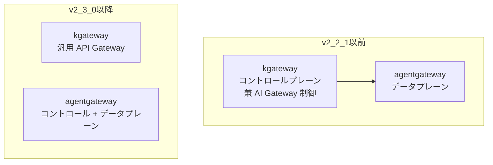
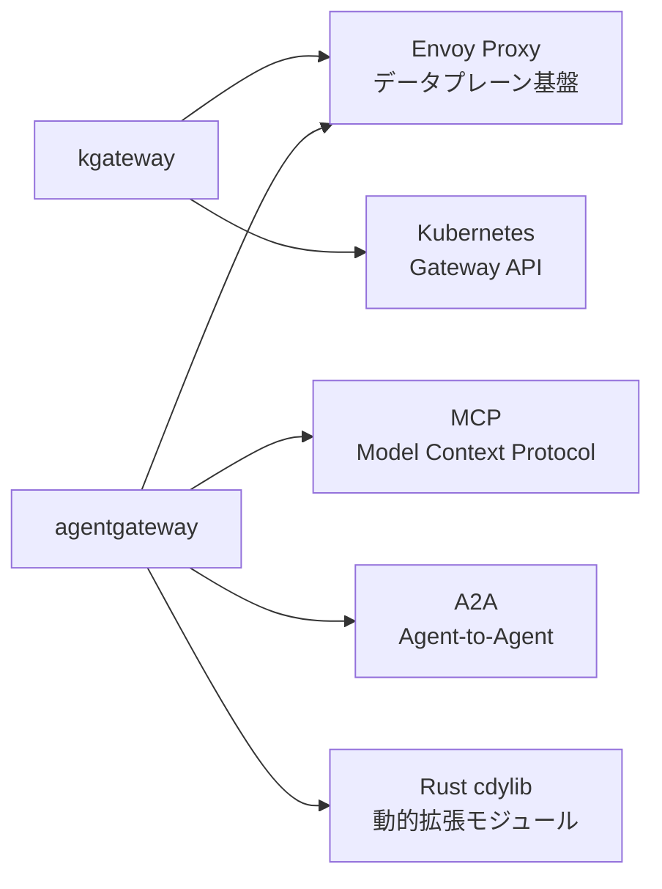
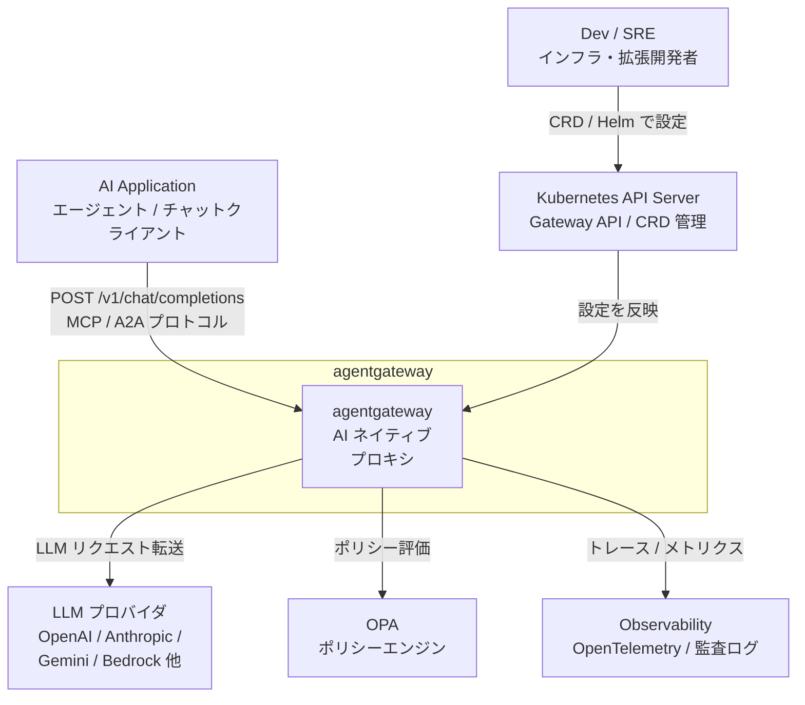
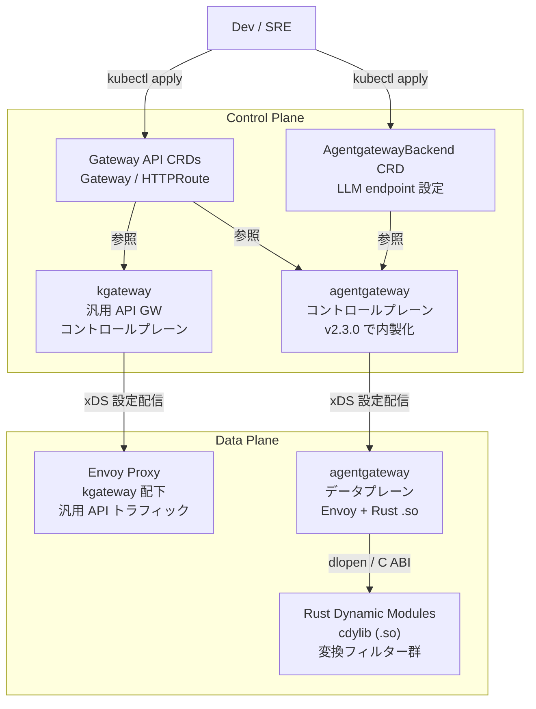
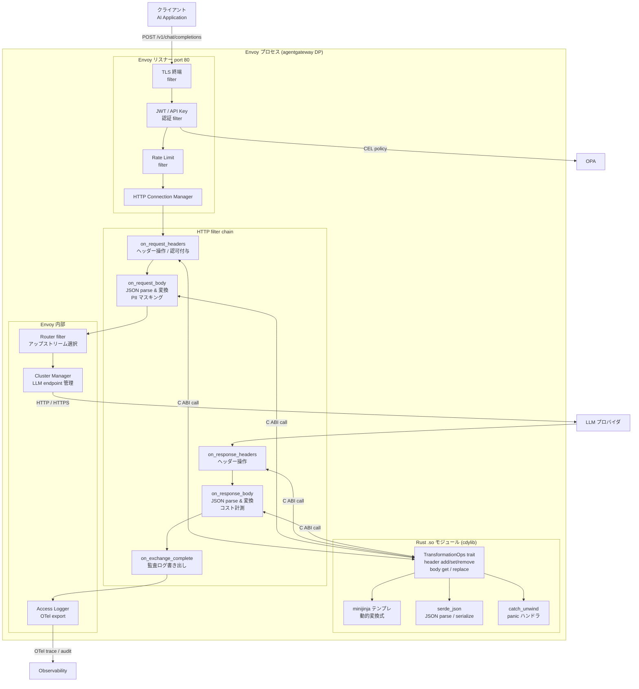
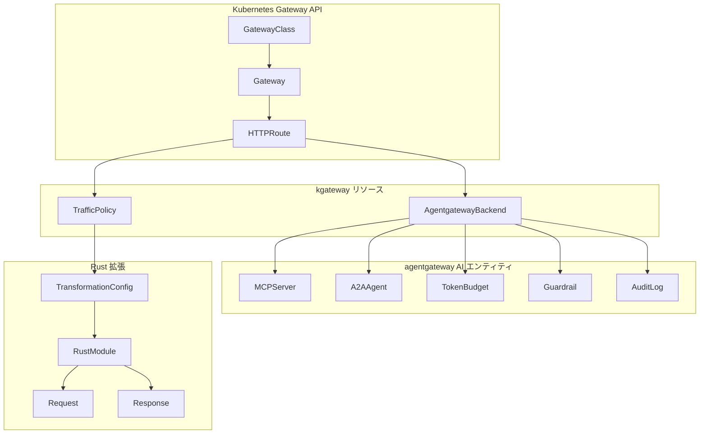
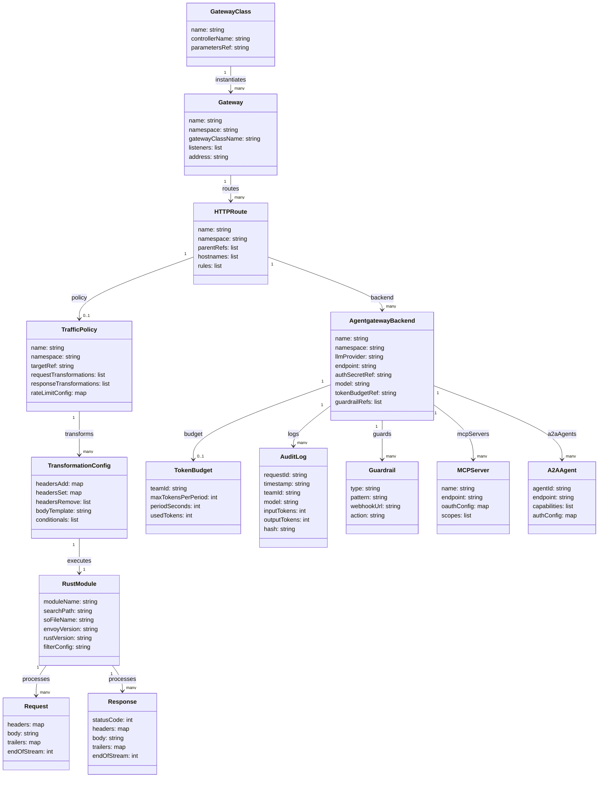

> 調査日: 2026-05-17 / 起点記事: [CNCF Blog 2026-05-15: Extending AI Gateways with Rust Custom Transformations](https://www.cncf.io/blog/2026/05/15/extending-ai-gateways-with-rust-custom-transformations-in-agentgateway-and-kgateway/)

## 概要

### プロジェクトの位置づけ

agentgateway は Solo.io が主導する「AI エージェント向け次世代プロキシ」です。単なる LLM プロキシではなく、LLM Gateway・MCP Gateway・Agent-to-Agent Gateway の 3 役を一体で担います。2025-03-18 に設立され、Apache 2.0 ライセンスで公開されています。

kgateway は 2018 年に Gloo として登場した Kubernetes Gateway API + Envoy ベースの汎用 API Gateway です。2026-03-04 に CNCF Sandbox プロジェクトとして受理されており、成熟したエコシステムを持ちます。v2.3.0 以降は AI Gateway のコントロールプレーン機能を agentgateway 本体に移管し、汎用 API Gateway の役割に戻っています。

### 役割分担の変遷



v2.3.0 を境に agentgateway は自律的なコントロールプレーンを内製化しました。kgateway は汎用 API Gateway としての独立性を回復しています。

### 関連技術との関係



agentgateway のデータプレーンは Envoy をベースに Rust 製動的ライブラリ (cdylib) で拡張します。kgateway は Kubernetes Gateway API に準拠し、Envoy を標準データプレーンとして利用します。MCP と A2A は agentgateway の一級市民プロトコルとして組み込まれています。

---

## 特徴

### 特徴 1: AI / MCP / A2A ネイティブプロトコル対応

| 機能カテゴリ | 内容 |
|---|---|
| LLM Gateway | OpenAI 互換 API で 14+ プロバイダを統一管理。per-team token budget / semantic cache / failover 内蔵 |
| MCP Gateway | Model Context Protocol 経由の外部ツール接続。OAuth / tool discovery / scope 管理に対応 |
| A2A Gateway | Agent-to-Agent プロトコルで capability discovery とタスク連携を実現 |
| Inference Routing | GPU 利用率ベースの自ホストモデル振り分け |

対応 LLM プロバイダは OpenAI / Anthropic / Gemini / Bedrock / Azure OpenAI / Mistral / DeepSeek / Ollama / Vertex AI / Llama / xAI / Perplexity / Replicate / Snowflake の 14 種以上です。

### 特徴 2: Rust cdylib による高性能な動的拡張

CNCF Blog (2026-05-15) で公開されたアーキテクチャの核心は、Rust で書いた `.so` ファイルを Envoy が起動時に動的ロードする仕組みです。WASM のような VM コストがなく、オーバーヘッドは 0.1ms 未満を実現します。

| 処理フェーズ | 操作 |
|---|---|
| リクエスト | header add / set / remove、JSON body parse & modify、raw bytes アクセス |
| レスポンス | header add / set / remove、JSON body parse & modify |

### 特徴 3: Kubernetes Gateway API との標準準拠

kgateway は Kubernetes Gateway API に完全準拠しており、Ingress Controller の後継として機能します。CNCF Sandbox 受理 (2026-03-04) により、中立的なガバナンス体制が整備されています。基本的な K8s リソースセットは Gateway / HTTPRoute / `AgentgatewayBackend` の 3 種類です。

### 特徴 4: セキュリティと観測可能性の内蔵

| カテゴリ | 内容 |
|---|---|
| 認証・認可 | JWT + API key + RBAC + CEL policy + OPA |
| Guardrails | Regex / OpenAI Moderation / AWS Guardrails / custom webhook |
| 観測可能性 | OpenTelemetry デフォルト有効、改ざん検証可能 (tamper-evident) 監査ログ |

### 特徴 5: プロジェクトの成熟度と注意点

| 項目 | agentgateway | kgateway |
|---|---|---|
| 設立 | 2025-03-18 | 2018 年 (Gloo として) |
| GitHub Stars | 2,714 | 5,516 |
| 主言語 | Rust 59% / Go 28% / TS 10% | Go 93% |
| CNCF ステータス | Linux Foundation プロジェクト (CNCF 個別記載未確認) | CNCF Sandbox (2026-03-04) |
| 成熟度 | 若い (大規模本番事例少) | 成熟 (8 年の実績) |

agentgateway は API Key Auth / TrafficPolicy ratelimit / Policy merge が未実装の段階です。v2.3.0 でのコントロールプレーン移管という architectural change が進行中であり、本番採用には慎重な評価が必要です。

### 他の AI Gateway OSS との比較

| 製品 | 拡張機構 | 拡張言語 | オーバーヘッド | MCP 対応 | A2A 対応 | 立ち位置 | GitHub Stars |
|---|---|---|---|---|---|---|---|
| agentgateway | Rust cdylib (Envoy 動的モジュール) | Rust | <0.1ms | ✅ 一級市民 | ✅ 一級市民 | AI/MCP/A2A ネイティブ、若い | 2,714 |
| kgateway | Envoy Filter (+ agentgateway 連携) | Go / Rust | <0.1ms | ✅ agentgateway 経由 | ✅ agentgateway 経由 | Kubernetes 汎用 API GW、CNCF Sandbox | 5,516 |
| Envoy AI Gateway | WASM filter (proxy-wasm) | C++ / Go / WASM | 1–3ms | ✅ | - | K8s 向け Envoy 由来、Apache 2.0 | 1,618 |
| LiteLLM | Python callback | Python | プロセス内 Python オーバーヘッド | ✅ (MCP tool listing) | - | 100+ provider、企業利用最多 | 47,235 |
| Kong AI Gateway | Lua / Go / JS plugin | Lua / Go / JS | 数百μs–数ms | ✅ | - | Plugin Hub 60+、汎用 GW 機能 | 43,398 |
| Portkey | TypeScript hooks | TypeScript / JS | JS hook レベル | ✅ | - | 50+ guardrails、SaaS+OSS | 11,749 |
| Cloudflare AI Gateway | Workers JS | JavaScript / TS | edge compute | - | - | SaaS 専用、グローバル分散 | 非 OSS |

### ユースケース別の推奨

| ユースケース | 推奨製品 | 理由 |
|---|---|---|
| AI エージェント間通信 (A2A) の統制 | agentgateway | A2A を一級市民で扱う唯一の OSS |
| MCP サーバーの集中管理・認可 | agentgateway | MCP Gateway が OAuth / scope 管理まで内蔵 |
| Kubernetes 汎用 API GW + AI 拡張 | kgateway | CNCF Sandbox、Kubernetes Gateway API 準拠 |
| 性能クリティカルな body 変換 | agentgateway (Rust cdylib) | <0.1ms オーバーヘッド、WASM の 10–30 倍速 |
| 100+ LLM プロバイダへの統一アクセス | LiteLLM | 対応プロバイダ数が最多 |
| LLM コスト管理・spend tracking | LiteLLM | spend tracking / virtual keys が充実 |
| 豊富な既製プラグインが必要 | Kong AI Gateway | Plugin Hub 60+ |
| LLM 信頼性 (retry / fallback) 優先 | Portkey | 自動 retry / fallback が標準 |
| グローバルエッジでの低レイテンシ | Cloudflare AI Gateway | SaaS だが世界規模のエッジ分散 |
| サンドボックス分離が必要な変換 | Envoy AI Gateway | WASM フィルターで OS 級分離 |

---

## 構造

### システムコンテキスト図



| 要素 | 説明 |
|---|---|
| Dev / SRE | Kubernetes CRD・Helm で Gateway 設定・Rust モジュールをデプロイする開発者・運用者 |
| AI Application | LLM を呼び出すエージェント・チャットクライアント。agentgateway に対して OpenAI 互換 API / MCP / A2A で通信 |
| agentgateway | AI ネイティブプロキシ本体。LLM Gateway / MCP Gateway / A2A Gateway の 3 役を担う |
| LLM プロバイダ | OpenAI / Anthropic / Gemini / Bedrock / Azure OpenAI / Mistral など 14+ プロバイダ |
| Kubernetes API Server | Gateway API CRD と AgentgatewayBackend CRD の管理。Dev が設定を投入する窓口 |
| OPA | CEL policy / RBAC のポリシー評価エンジン |
| Observability | OpenTelemetry レシーバー・監査ログストア。改ざん検証可能ログをエクスポート |

### コンテナ図



#### Control Plane

| 要素 | 説明 |
|---|---|
| kgateway コントロールプレーン | Go 製。Kubernetes Gateway API を解釈し、Envoy に xDS で設定配信。CNCF Sandbox (2026-03-04 受理) |
| agentgateway コントロールプレーン | v2.3.0 で kgateway から分離・内製化。AI 専用ポリシー (token budget / guardrails / RBAC) を管理 |
| Gateway API CRDs | Gateway・HTTPRoute など Kubernetes Gateway API 標準リソース |
| AgentgatewayBackend CRD | LLM プロバイダの endpoint・認証情報・ルーティング設定を保持する独自 CRD |

#### Data Plane

| 要素 | 説明 |
|---|---|
| Envoy Proxy (kgateway 配下) | kgateway が管理する Envoy インスタンス。汎用 API / HTTP トラフィックを処理 |
| agentgateway データプレーン | Envoy をベースに AI プロトコル (MCP / A2A) 対応を追加したプロキシ |
| Rust Dynamic Modules (.so) | cdylib 形式の共有ライブラリ。Envoy プロセス内に直接ロードされ、HTTP filter chain を拡張 |

### コンポーネント図



#### Envoy リスナー

| 要素 | 説明 |
|---|---|
| TLS 終端 filter | クライアントとの TLS を終端。証明書は K8s Secret から取得 |
| JWT / API Key 認証 filter | Bearer トークン・API Key を検証。CEL policy を OPA に委譲 |
| Rate Limit filter | per-team / per-model のトークン予算・レート制限を適用 |
| HTTP Connection Manager (HCM) | HTTP/1.1 と HTTP/2 を処理し、filter chain を起動するコアコンポーネント |

#### HTTP filter chain (Rust モジュール呼び出しポイント)

| 要素 | 説明 |
|---|---|
| on_request_headers | リクエストヘッダーを受信した時点で呼ばれる。カスタムヘッダー付与・認可情報注入を行う |
| on_request_body | リクエストボディ全体受信後に呼ばれる。JSON パース・PII マスキング・プロンプト編集を実行 |
| on_response_headers | LLM レスポンスのヘッダーを受信した時点で呼ばれる。ヘッダー追加・削除を行う |
| on_response_body | LLM レスポンスボディ全体受信後に呼ばれる。JSON 変換・トークン計測・コスト記録を実行 |
| on_exchange_complete | リクエスト/レスポンスのやり取り完了後に呼ばれる。改ざん検証可能な監査ログを書き出す |

#### Rust .so モジュール内部

| 要素 | 説明 |
|---|---|
| TransformationOps trait | HttpFilter trait を実装したコア変換インタフェース。header add/set/remove・body get/replace を提供 |
| minijinja テンプレ | 動的テンプレートエンジン。per-route config でテンプレート AST をキャッシュして再利用 |
| serde_json | JSON シリアライズ・デシリアライズライブラリ。end_of_stream=true のタイミングで遅延パース |
| catch_unwind パニックハンドラ | Rust のパニックを捕捉し、Envoy プロセスのクラッシュを防ぐ安全境界。fail-closed でレスポンスを停止 |

#### Envoy 内部コンポーネント

| 要素 | 説明 |
|---|---|
| Router filter | HTTPRoute の一致条件に基づいてアップストリーム Cluster を選択 |
| Cluster Manager | AgentgatewayBackend CRD で定義された LLM エンドポイントを管理。load balancing / failover を担当 |
| Access Logger | on_exchange_complete 後に OTel トレース・改ざん検証可能監査ログを Observability へエクスポート |

---

## データ

### 概念モデル



| 要素名 | 説明 |
|---|---|
| GatewayClass | ゲートウェイの実装クラスを定義する Kubernetes Gateway API リソース。kgateway または agentgateway を指定する |
| Gateway | リスナー (ポート/TLS) を保持する Kubernetes Gateway API リソース。GatewayClass に紐づく |
| HTTPRoute | URL パスとバックエンドのマッピングを定義する Gateway API リソース。Gateway に属する |
| TrafficPolicy | HTTPRoute に適用するトラフィック制御ポリシー (変換・レート制限等) を定義する kgateway CRD |
| AgentgatewayBackend | LLM / MCP / A2A のエンドポイント設定を保持する kgateway CRD |
| TransformationConfig | request/response のヘッダー・ボディ変換ルールを記述する設定オブジェクト |
| RustModule | Envoy に動的ロードされる cdylib 形式の Rust 変換モジュール |
| Request | ゲートウェイが受け取る HTTP リクエスト。headers・body・trailers を持つ |
| Response | アップストリームから返る HTTP レスポンス。headers・body・trailers を持つ |
| MCPServer | agentgateway が管理する Model Context Protocol サーバーのエンドポイント |
| A2AAgent | agentgateway が管理する Agent-to-Agent 通信の対向エージェント |
| TokenBudget | チームまたはルートごとのトークン消費上限を管理するエンティティ |
| Guardrail | プロンプトや応答に対するガードレール設定 (Regex / Moderation / Webhook 等) |
| AuditLog | 改ざん検証可能な監査ログのエントリ |

### 情報モデル



| 要素名 | 説明 |
|---|---|
| GatewayClass | ゲートウェイ実装クラス。`controllerName` でコントローラー (kgateway / agentgateway) を特定する |
| Gateway | エントリポイント。`listeners` でポート・プロトコル・TLS 設定を持つ |
| HTTPRoute | ルーティングルール。`rules` に path マッチと backendRefs を記述する |
| TrafficPolicy | kgateway CRD。`requestTransformations` / `responseTransformations` で変換パイプラインを定義する |
| AgentgatewayBackend | LLM プロバイダ情報を集約。`llmProvider` に OpenAI / Anthropic 等を指定し `model` でモデル名を保持する |
| TransformationConfig | ヘッダー追加・設定・削除と body テンプレート (Jinja / CEL) を保持する変換定義 |
| RustModule | cdylib の所在 (`searchPath`/`soFileName`) と Envoy ABI バージョン (`envoyVersion`) を保持する |
| Request | Rust フィルターが受け取る入力。`endOfStream` フラグでストリーミング終端を判定する |
| Response | Rust フィルターが書き換える出力。`statusCode` と `body` が主要変換対象となる |
| TokenBudget | チーム単位のトークン上限管理。`usedTokens` を累積して予算超過を検知する |
| AuditLog | 1リクエスト1エントリ。`hash` フィールドが改ざん検証 (tamper-evident) を担う |
| Guardrail | `type` で Regex / OpenAI Moderation / AWS Guardrails / Webhook を区別し、`action` でブロック or マスクを指定する |
| MCPServer | Model Context Protocol サーバー。`scopes` でツールアクセス範囲を制限する |
| A2AAgent | Agent-to-Agent 対向エージェント。`capabilities` でタスク種別を宣言する |

---

## 構築方法

### 必要バージョン一覧

| コンポーネント | バージョン | 注意事項 |
|---|---|---|
| Rust | 1.85+ | 1.75 以下では SDK がコンパイルエラー |
| Envoy | v1.36.4 | SDK ABI が Envoy バージョンに密結合 |
| kgateway | v2.2.1 | コントロールプレーン |
| agentgateway | v1.1.0 | データプレーン |
| kind / k3d | v0.20+ | ローカル K8s クラスタ |

> ABI 互換は `X.Y → X.(Y+1)` のみ保証。Envoy メジャー更新時は SDK と `.so` 両方の再ビルドが必須です。

### K8s クラスタセットアップ (kind)

```bash
kind create cluster --name ai-gateway-lab
kubectl cluster-info --context kind-ai-gateway-lab
```

### Gateway API CRDs インストール

```bash
kubectl apply -f https://github.com/kubernetes-sigs/gateway-api/releases/download/v1.2.0/standard-install.yaml
kubectl wait --for=condition=Established crd/gateways.gateway.networking.k8s.io --timeout=60s
```

### kgateway デプロイ (v2.2.1)

```bash
helm upgrade -i kgateway-crds oci://cr.kgateway.dev/kgateway-dev/charts/kgateway-crds \
  --namespace kgateway-system --create-namespace --version v2.2.1
helm upgrade -i kgateway oci://cr.kgateway.dev/kgateway-dev/charts/kgateway \
  --namespace kgateway-system --version v2.2.1 \
  --set agentgateway.enabled=true
kubectl -n kgateway-system wait --for=condition=Ready pod -l app=kgateway --timeout=120s
```

### agentgateway デプロイ (v1.1.0)

```bash
helm upgrade -i agentgateway-crds oci://cr.agentgateway.dev/charts/agentgateway-crds \
  --namespace agentgateway-system --create-namespace --version v1.1.0
helm upgrade -i agentgateway oci://cr.agentgateway.dev/charts/agentgateway \
  --namespace agentgateway-system --version v1.1.0
kubectl -n agentgateway-system wait --for=condition=Ready pod -l app=agentgateway --timeout=120s
```

### Rust モジュールのビルド (cdylib)

#### Cargo.toml

```toml
[package]
name = "my-rustformation"
version = "0.1.0"
edition = "2021"

[lib]
name = "my_rustformation"
crate-type = ["cdylib"]

[dependencies]
envoy-proxy-dynamic-modules-rust-sdk = "0.1"
serde = { version = "1.0", features = ["derive"] }
serde_json = "1.0"
minijinja = { version = "2.12.0", features = ["loader"] }
anyhow = "1.0"
```

#### lib.rs (TransformationOps 実装サンプル)

```rust
use envoy_proxy_dynamic_modules_rust_sdk::*;

pub struct MyTransformationFilter {
    request_id: Option<String>,
}

impl HttpFilter for MyTransformationFilter {
    fn on_request_headers(
        &mut self,
        _num_headers: usize,
        _end_of_stream: bool,
        ops: &dyn RequestHeadersOps,
    ) -> Result<FilterHeadersStatus> {
        ops.set_header("x-custom-team-id", "team-alpha")?;
        if let Ok(Some(id)) = ops.get_header("x-request-id") {
            self.request_id = Some(String::from_utf8_lossy(id).to_string());
        }
        Ok(FilterHeadersStatus::Continue)
    }

    fn on_request_body(
        &mut self,
        _data_size: usize,
        end_of_stream: bool,
        ops: &dyn RequestBodyOps,
    ) -> Result<FilterDataStatus> {
        if !end_of_stream {
            return Ok(FilterDataStatus::StopIterationAndBuffer);
        }
        let body = ops.get_body()?;
        let mut json: serde_json::Value = serde_json::from_slice(body)?;
        if let Some(messages) = json.get_mut("messages") {
            // PII マスキング
        }
        let transformed = serde_json::to_vec(&json)?;
        ops.replace_body(&transformed)?;
        Ok(FilterDataStatus::Continue)
    }

    fn on_response_headers(
        &mut self,
        _num_headers: usize,
        _end_of_stream: bool,
        ops: &dyn ResponseHeadersOps,
    ) -> Result<FilterHeadersStatus> {
        ops.add_header("x-gateway-version", "agentgateway-1.1.0")?;
        Ok(FilterHeadersStatus::Continue)
    }

    fn on_response_body(
        &mut self,
        _data_size: usize,
        end_of_stream: bool,
        ops: &dyn ResponseBodyOps,
    ) -> Result<FilterDataStatus> {
        if !end_of_stream {
            return Ok(FilterDataStatus::StopIterationAndBuffer);
        }
        let body = ops.get_body()?;
        if let Ok(json) = serde_json::from_slice::<serde_json::Value>(body) {
            if let Some(tokens) = json.pointer("/usage/total_tokens") {
                eprintln!("[rustformation] total_tokens={}", tokens);
            }
        }
        Ok(FilterDataStatus::Continue)
    }

    fn on_exchange_complete(&mut self, _ops: &dyn ExchangeCompleteOps) -> Result<()> {
        Ok(())
    }
}

#[no_mangle]
pub extern "C" fn envoy_dynamic_module_on_program_init() -> *const std::os::raw::c_char {
    std::ptr::null()
}
```

### マルチステージ Docker ビルド

```dockerfile
FROM rust:1.85 AS builder
RUN apt-get update && apt-get install -y clang lld && rm -rf /var/lib/apt/lists/*
WORKDIR /build
COPY Cargo.toml Cargo.lock ./
COPY src ./src
RUN cargo build --release --target x86_64-unknown-linux-gnu

FROM envoyproxy/envoy:v1.36.4
COPY --from=builder \
  /build/target/x86_64-unknown-linux-gnu/release/libmy_rustformation.so \
  /usr/local/lib/
ENV ENVOY_DYNAMIC_MODULES_SEARCH_PATH=/usr/local/lib
```

最終イメージ目安: 319MB

---

## 利用方法

### 必須パラメータ一覧

| リソース | フィールド | 説明 |
|---|---|---|
| `AgentgatewayBackend` | `.spec.host` | LLM プロバイダのホスト名 (例: `api.openai.com`) |
| `AgentgatewayBackend` | `.spec.port` | ポート番号 (例: `443`) |
| `AgentgatewayBackend` | `.spec.tls.enabled` | TLS 有効/無効 |
| `AgentgatewayBackend` | `.spec.provider` | プロバイダ種別 (例: `openai`, `anthropic`, `bedrock`) |
| `Gateway` | `.spec.gatewayClassName` | `kgateway` を指定 |
| `Gateway` | `.spec.listeners[].port` | リスナーポート (例: `80`) |
| `HTTPRoute` | `.spec.parentRefs[].name` | 対象 Gateway 名 |
| `HTTPRoute` | `.spec.rules[].matches[].path.value` | マッチパス (例: `/v1/chat/completions`) |
| `HTTPRoute` | `.spec.rules[].backendRefs[].name` | バックエンドサービス名 |

### Gateway YAML

```yaml
apiVersion: gateway.networking.k8s.io/v1
kind: Gateway
metadata:
  name: ai-gateway
  namespace: default
spec:
  gatewayClassName: kgateway
  listeners:
    - name: http
      protocol: HTTP
      port: 80
```

### AgentgatewayBackend YAML

実際の CRD 構造は `spec.ai.provider.<provider名>` 配下にプロバイダ固有設定をネストします。CNCF Blog の例:

```yaml
apiVersion: agentgateway.dev/v1alpha1
kind: AgentgatewayBackend
metadata:
  name: openai-backend
  namespace: agentgateway-system
spec:
  ai:
    provider:
      openai:
        model: gpt-4
      host: api.openai.com
      port: 443
      path: "/v1/chat/completions"
```

API キーは Secret に保持し、TrafficPolicy など別リソースで参照させる構造を採用します (Blog 例は httpbun モック呼び出しのため認証部分は省略)。

### HTTPRoute YAML

```yaml
apiVersion: gateway.networking.k8s.io/v1
kind: HTTPRoute
metadata:
  name: llm-route
  namespace: default
spec:
  parentRefs:
    - name: ai-gateway
      namespace: default
  rules:
    - matches:
        - path:
            type: PathPrefix
            value: /v1/chat/completions
      backendRefs:
        - group: agentgateway.dev
          kind: AgentgatewayBackend
          name: openai-backend
```

### Rust 動的モジュールの紐付け (TrafficPolicy)

kgateway の `TrafficPolicy` (apiVersion: `gateway.kgateway.dev/v1alpha1`) で Rust モジュールを HTTPRoute に紐付けます。フィルター設定は protobuf Any 型 (`type.googleapis.com/google.protobuf.StringValue` 等) でラップして渡します。具体的なフィールド名は kgateway バージョンで変動するため、最新の TrafficPolicy CRD リファレンスを確認してください。

```yaml
apiVersion: gateway.kgateway.dev/v1alpha1
kind: TrafficPolicy
metadata:
  name: rust-transformation-policy
  namespace: default
spec:
  targetRefs:
    - group: gateway.networking.k8s.io
      kind: HTTPRoute
      name: llm-route
  # dynamicModules フィールドの正確な構文は kgateway リリースノートを参照
```

### curl 呼び出し

```bash
GATEWAY_URL=$(kubectl get gateway ai-gateway -o jsonpath='{.status.addresses[0].value}')

curl -X POST "http://${GATEWAY_URL}/v1/chat/completions" \
  -H "Content-Type: application/json" \
  -H "x-request-id: test-001" \
  -d '{
    "model": "gpt-4o",
    "messages": [{"role": "user", "content": "Hello, world!"}],
    "stream": false
  }'
```

ストリーミングの場合:

```bash
curl -X POST "http://${GATEWAY_URL}/v1/chat/completions" \
  -H "Content-Type: application/json" \
  -H "Accept: text/event-stream" \
  -d '{
    "model": "gpt-4o",
    "messages": [{"role": "user", "content": "Explain Rust in one sentence."}],
    "stream": true
  }'
```

> SSE ストリーミング時は、中継レイヤで **バッファリングを必ず無効化**してください。

---

## 運用

### 起動・停止・状態確認

```bash
kubectl get pods -n agentgateway -l app=agentgateway
kubectl rollout restart deployment/agentgateway -n agentgateway
kubectl rollout status deployment/agentgateway -n agentgateway
kubectl scale deployment/agentgateway --replicas=0 -n agentgateway
```

Admin API (`localhost:9095`):

```bash
kubectl port-forward pod/<pod-name> 9095:9095 -n agentgateway
curl http://localhost:9095/config_dump | jq .
curl http://localhost:9095/stats | grep dynamic_module
curl http://localhost:9095/ready
```

ヘルスチェック設定例:

```yaml
livenessProbe:
  httpGet:
    path: /ready
    port: 9095
  initialDelaySeconds: 10
  periodSeconds: 10
readinessProbe:
  httpGet:
    path: /ready
    port: 9095
  initialDelaySeconds: 5
  periodSeconds: 5
```

### ログ — Envoy アクセスログ / OpenTelemetry

JSON アクセスログ設定:

```yaml
access_log:
  - name: envoy.access_loggers.file
    typed_config:
      "@type": type.googleapis.com/envoy.extensions.access_loggers.file.v3.FileAccessLog
      path: /dev/stdout
      log_format:
        json_format:
          timestamp: "%START_TIME%"
          method: "%REQ(:METHOD)%"
          response_code: "%RESPONSE_CODE%"
          duration_ms: "%DURATION%"
          x_request_id: "%REQ(X-REQUEST-ID)%"
```

Rust モジュール内からは `eprintln!` で stderr へ出力します。OpenTelemetry はデフォルト有効で、OTLP エンドポイントを設定するだけで分散トレースが得られます。

```yaml
telemetry:
  tracing:
    enabled: true
    exporter:
      otlp:
        endpoint: "http://otel-collector:4317"
  metrics:
    enabled: true
    exporter:
      prometheus:
        port: 9090
```

### Rust モジュールの更新 (ホットリロード不可)

Envoy 動的モジュールは設計上ホットリロード不可です。Kubernetes のローリングリスタートで入れ替えます。

```yaml
spec:
  strategy:
    type: RollingUpdate
    rollingUpdate:
      maxSurge: 1
      maxUnavailable: 0
  template:
    spec:
      terminationGracePeriodSeconds: 60
```

### スケール

```bash
kubectl scale deployment/agentgateway --replicas=5 -n agentgateway
kubectl autoscale deployment/agentgateway \
  --cpu-percent=70 --min=2 --max=10 -n agentgateway
```

> kgateway Issue #908 で HPA 作成が ServiceAccount の権限不足で失敗する事象が報告されています。RBAC を事前確認してください。

### メトリクス

| メトリクス名 | 説明 |
|---|---|
| `agentgateway_requests_total` | リクエスト総数 |
| `agentgateway_request_duration_seconds` | リクエストレイテンシ分布 |
| `agentgateway_token_usage_total` | LLM トークン使用量 (per-team budget 監視) |
| `envoy_http_downstream_rq_total` | Envoy downstream リクエスト数 |
| `envoy_dynamic_module_*` | 動的モジュール固有統計 |

### 監査ログ (tamper-evident)

```yaml
security:
  auditLog:
    enabled: true
    format: json
    tamperEvident: true
    destination: stdout
    fields:
      - request_id
      - user_id
      - model
      - token_usage
      - prompt_hash
      - response_latency_ms
```

---

## ベストプラクティス

### ストリーミング時の buffering 無効化 (TTFT 悪化対策)

**誤解**: 「ゲートウェイを経由してもストリーミングは透過的に動作する」

**反証エビデンス**:
- LiteLLM 経由でトークンストリーミングを有効にした実測で p95 レイテンシが **4 秒 → 22 秒** に悪化
- NGINX の `proxy_buffering` はデフォルト ON (32 KB 単位でバッファ)
- Traefik も Buffering middleware で同様の問題が生じる (Issues #10337, #23007)
- LiteLLM では BaseHTTPMiddleware を軽量実装に置換して約 30% のオーバーヘッド削減実績あり

**推奨 (NGINX)**:

```nginx
location /v1/chat/completions {
    proxy_pass http://agentgateway;
    proxy_buffering off;
    proxy_cache off;
    proxy_read_timeout 300s;
    tcp_nodelay on;
}
```

Rust モジュール側でも、変換不要なチャンクは即時 `FilterDataStatus::Continue` を返します。

### ESB 再発防止 — ゲートウェイに業務ロジックを入れない境界設計

**誤解**: 「ゲートウェイ層の Rust モジュールにプロンプト生成・モデル選択を実装すれば、アプリを変更せず横断的に制御できる」

**反証エビデンス**:
- Thoughtworks Technology Radar の "ESBs in API Gateway's clothing" 警告が LLM 文脈で再来
- Kong の経験則: 「新しいプラグインは必要時のみ追加し、複雑ロジックは専用サービスに offload すべし」
- LLM Mesh の Routing Agent をアプリ層に置くことで最大 **75% のコスト削減**事例 (RouteLLM 等)

**推奨 — ゲートウェイ vs アプリ層の境界**:

| 種別 | ゲートウェイ層 (Rust モジュール) | アプリ層 |
|---|---|---|
| header 操作・認可付与 | ✅ | |
| PII マスキング・プロンプト編集 | ✅ | |
| トークン計測・コスト記録 | ✅ | |
| 改ざん検証可能監査ログ | ✅ | |
| モデル別フォーマット差吸収 | ✅ (低レベル変換のみ) | |
| プロンプト生成・プロンプト構成 | ❌ | ✅ |
| モデル選択ロジック | ❌ | ✅ |
| ドメインロジック・RAG | ❌ | ✅ |
| ストリーミングチャンクの業務加工 | △ (TTFT 注意) | ✅ |

**実践ルール**: ゲートウェイへの業務ロジック追加は **ADR (Architecture Decision Record) を必須**にします。

### Rust モジュールのパニックハンドリング (`catch_unwind`)

cdylib はサンドボックスなしで Envoy プロセス内に直接ロードされます。panic が伝播すると Envoy プロセス全体がクラッシュします。

```rust
use std::panic::{catch_unwind, AssertUnwindSafe};

fn on_request_headers(...) -> Result<FilterHeadersStatus> {
    let result = catch_unwind(AssertUnwindSafe(|| {
        self.do_request_headers(num_headers, end_of_stream, ops)
    }));
    match result {
        Ok(Ok(status)) => Ok(status),
        Ok(Err(e)) => {
            eprintln!("[rustformation] ERROR err={}", e);
            Ok(FilterHeadersStatus::Continue)
        }
        Err(_) => {
            eprintln!("[rustformation] PANIC — fail-closed");
            Ok(FilterHeadersStatus::StopIteration)
        }
    }
}
```

**fail-closed を原則**とし、panic 時はリクエストを停止します。

### バージョン整合性の CI 化

ABI 互換は X.Y → X.(Y+1) のみ保証。CI で Envoy バージョンを固定し、変更時の再ビルドを必須ゲートにします。

```yaml
jobs:
  version-matrix:
    strategy:
      matrix:
        envoy_version: ["v1.36.4"]
        rust_version: ["1.85"]
    steps:
      - name: Build .so
        run: |
          docker build \
            --build-arg ENVOY_VERSION=${{ matrix.envoy_version }} \
            --build-arg RUST_VERSION=${{ matrix.rust_version }} \
            -t agentgateway-ext:ci .
```

### cdylib のサンドボックスなしを前提とした権限分離

```yaml
securityContext:
  runAsNonRoot: true
  runAsUser: 1000
  readOnlyRootFilesystem: true
  capabilities:
    drop:
      - ALL
    add:
      - NET_BIND_SERVICE
volumeMounts:
  - name: rust-module
    mountPath: /usr/local/lib
    readOnly: true
```

- Rust モジュールのソースレビューは**内部開発チームに限定**
- `cargo-audit` を CI に組み込み、既知 CVE 含む依存をブロック

---

## トラブルシューティング

| 症状 | 原因 | 対処 |
|---|---|---|
| 起動時に `symbol not found` / `undefined symbol` | Envoy バージョンと `.so` の ABI が不一致 | 対象 Envoy バージョンで `.so` を再ビルド。CI で Envoy バージョン固定 |
| Rust SDK コンパイルエラー | Rust 1.85 未満 | `rustup update stable` 後に `rust-toolchain.toml` でバージョン固定 |
| protobuf Any 型のデシリアライズエラー | `google.protobuf.Any` をラップせず生の型を渡している | `@type: type.googleapis.com/google.protobuf.StringValue` でラップ |
| SSE ストリーミングで TTFT が悪化 (p95 4s → 22s) | NGINX/Traefik のデフォルト buffering | `proxy_buffering off; tcp_nodelay on;`。Rust モジュールは即時 Continue |
| LocalReply との組合せで response body 変換が動作しない | Envoy `LocalReply` がバッファをバイパス (kgateway Issue #13434) | LocalReply を使わず別フィルタに分離、または `bypass_buffering: true` |
| ConfigMap 1MB 制限で `.so` を格納できない | バイナリサイズ超過 | `lto = true` / `codegen-units = 1` / `strip = true` で縮小。超える場合は `initContainer` でレジストリ pull |
| 認証エラー (401/403) | API Key Auth 未実装 (Issue #12378) | JWT 認証ベースに移行。Issues 追跡 |
| HPA が作成できない (`forbidden`) | ServiceAccount に `autoscaling` 権限なし (Issue #908) | `apiGroups: [autoscaling]` の verbs を ServiceAccount に付与 |
| TrafficPolicy ratelimit が効かない | v2.2.x で未実装 (Issue #11844) | Envoy RLS で代替、実装版を待つ |
| Rust モジュール panic で Envoy がクラッシュ | `catch_unwind` 未実装 | 全フックを `catch_unwind(AssertUnwindSafe(...))` でラップ、fail-closed |
| AgentgatewayPolicy が複数バックエンドに適用されない | ポリシーマージ不完全 (Issue #13049) | 各バックエンドに個別ポリシー定義 |
| MCP tool listing 失敗 | 実装不完全 (LiteLLM Issue #14069) | agentgateway 独自実装に切り替え検討 |

---

## まとめ

agentgateway / kgateway は、Envoy の動的モジュール機構と Rust の cdylib を組み合わせることで、AI Gateway の拡張を <0.1ms のオーバーヘッドで実現する新しいパターンを提示しました。ただしホットリロード不可・サンドボックスなし・SSE バッファリングなど運用上の落とし穴があり、業務ロジックはアプリ層に残す境界設計が成功の鍵になります。

この記事が少しでも参考になった、あるいは改善点などがあれば、ぜひリアクションやコメント、SNS でのシェアをいただけると励みになります!

## 参考リンク

### 公式ドキュメント・リポジトリ
- [CNCF Blog: Extending AI Gateways with Rust Custom Transformations](https://www.cncf.io/blog/2026/05/15/extending-ai-gateways-with-rust-custom-transformations-in-agentgateway-and-kgateway/) (2026-05-15)
- [agentgateway 公式](https://agentgateway.dev) / [GitHub](https://github.com/agentgateway/agentgateway)
- [kgateway 公式](https://kgateway.dev) / [GitHub](https://github.com/kgateway-dev/kgateway)
- [agentgateway Transformations Docs](https://agentgateway.dev/docs/standalone/main/configuration/traffic-management/transformations/)
- [kgateway Transformations Blog](https://kgateway.dev/blog/transformation-in-kgateway/)
- [Envoy Dynamic Modules](https://www.envoyproxy.io/docs/envoy/latest/intro/arch_overview/advanced/dynamic_modules)
- [envoy-proxy-dynamic-modules-rust-sdk (crates.io)](https://crates.io/crates/envoy-dynamic-modules-rust-sdk/0.1.1)
- [Kubernetes Gateway API](https://gateway-api.sigs.k8s.io/)
- [CNCF Sandbox Projects](https://www.cncf.io/sandbox-projects/)

### 参考実装
- [Mike-4-prog/ai-gateway-lab](https://github.com/Mike-4-prog/ai-gateway-lab)
- [Envoy Dynamic Modules Examples](https://github.com/envoyproxy/dynamic-modules-examples)
- [Jimmy Song: Envoy Dynamic Module Tutorial](https://jimmysong.io/blog/envoy-dynamic-module-tutorial/)
- [Tetrate: Envoy Extension vs Integration](https://www.tetrate.io/blog/envoy-extension-vs-integration)

### ストリーミング・パフォーマンス
- [Why LLM Streaming Slows Down Your AI Platform](https://medium.com/open-ai/why-llm-streaming-slows-down-your-ai-platform-token-streaming-latency-fix-2026-9de8de89fe8f)
- [LiteLLM: Your Middleware Could Be a Bottleneck](https://docs.litellm.ai/blog/fastapi-middleware-performance)
- [Traefik Issue #10337: Buffering middleware high latency](https://github.com/traefik/traefik/issues/10337)

### ESB・設計境界
- [Thoughtworks Radar: ESBs in API Gateway's clothing](https://www.thoughtworks.com/radar/techniques/esbs-in-api-gateway-s-clothing)
- [Model Routing Agents: The Emerging Pattern of LLM Mesh](https://ai-academy.training/2025/11/14/model-routing-agents-the-emerging-pattern-of-llm-mesh-architectures/)
- [AWS: Multi-LLM routing strategies for generative AI](https://aws.amazon.com/blogs/machine-learning/multi-llm-routing-strategies-for-generative-ai-applications-on-aws/)

### 競合 AI Gateway OSS
- [Envoy AI Gateway](https://github.com/envoyproxy/ai-gateway)
- [LiteLLM](https://github.com/BerriAI/litellm)
- [Kong](https://github.com/Kong/kong)
- [Portkey AI Gateway](https://github.com/Portkey-AI/gateway)
- [Cloudflare AI Gateway 公式ドキュメント](https://developers.cloudflare.com/ai-gateway/)

### 既知 Issues
- [kgateway #13434: LocalReply + rustformation](https://github.com/kgateway-dev/kgateway/issues/13434)
- [kgateway #12378: API Key Auth 未実装](https://github.com/kgateway-dev/kgateway/issues/12378)
- [kgateway #11844: TrafficPolicy ratelimit 未実装](https://github.com/kgateway-dev/kgateway/issues/11844)
- [kgateway #908: HPA 作成権限不足](https://github.com/kgateway-dev/kgateway/issues/908)
- [kgateway #13049: AgentgatewayPolicy マージ不完全](https://github.com/kgateway-dev/kgateway/issues/13049)
- [LiteLLM #14069: MCP tool listing 失敗](https://github.com/BerriAI/litellm/issues/14069)
