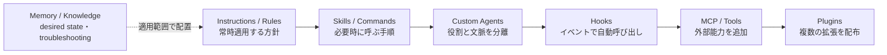
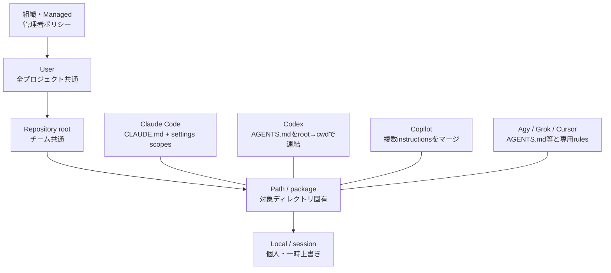
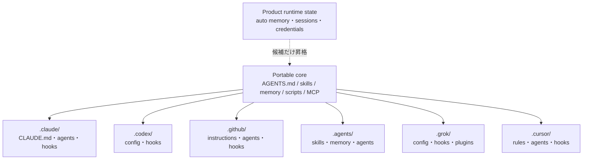

AIコーディングCLIを乗り換えるとき、モデル性能より先に困るのが設定資産の移植です。Claude Codeで育てた`CLAUDE.md`、`.claude/skills/`、hooks、subagentsは、別のCLIではどこに置き、何に読み替えればよいのでしょうか。

この調査の目的は「最強のCLI」を決めることではありません。**コーディングエージェントを切り替えても、リポジトリに対して近い振る舞いをさせること**です。そのため、Claude Code、OpenAI Codex CLI、GitHub Copilot CLI、Google Antigravity CLI（コマンド名`agy`）、xAI Grok Build、Cursor Agent CLIの6製品を、単なる機能の有無ではなく次の観点で比較しました。

- 指示はどの階層から、どの優先順位で読み込まれるか
- skill、custom agent、hook、MCP、pluginは、それぞれ何を拡張するものか
- desired stateとtroubleshootingを、skill内と複数skill共通のどこへ記録するか
- 複数CLIで共有できる資産と、製品別に変換すべき資産は何か

:::message
この記事は2026年8月7日時点の公式ドキュメントとローカルCLIで確認しています。ローカルで確認したバージョンはClaude Code 2.1.223、Codex CLI 0.145.0、GitHub Copilot CLI 1.0.75、Antigravity CLI 1.1.10です。更新の速い領域なので、パスやイベント名は導入時に各製品の最新ドキュメントも確認してください。
:::


*共有するPortable Coreと、6製品ごとに変換する設定の全体像*

## 目標はファイル互換ではなく振る舞いの同等性

製品ごとに設定ファイル名とschemaが違う以上、完全なファイル互換を目指すと、いずれかの製品の最小公倍数に機能を落とすことになります。ここで維持したいのはファイルではなく、次の「振る舞い契約」です。

| 維持したい振る舞い | 代表的な実装 |
|---|---|
| どのagentでも同じ規約を守る | Instructions / Rules |
| 同じ作業を同じ手順で進める | Skills / Commands |
| 調査・レビューなどを別の役割へ委譲する | Custom Agents |
| 特定イベントで検査や通知を呼び出す | Hooks |
| 同じ外部システムへ同じ権限で接続する | MCP / Tools |
| 拡張一式をチームへ配布する | Plugins |
| Desired stateとtroubleshootingを適切な範囲で再利用する | Memory / Knowledgeの段階的開示 |

以降は、各製品の機能名をこの契約へ対応づけます。移植の成否は「同じファイルを読めたか」ではなく、最後に示す受け入れテストで、同じ入力に対して許容範囲内の行動になるかで判定します。

## 先に結論：ディレクトリ名ではなく責務で分ける

6製品の設定ディレクトリは似ています。しかし、同じMarkdownファイルでも責務が違います。移植では、まず資産を次の6層に分けると混乱しません。



役割は次のように考えるのが実用的です。

| 拡張点 | 主な用途 | 実行の決まり方 | Git管理との相性 |
|---|---|---|---|
| Instructions / Rules | コーディング規約、禁止事項、リポジトリ知識 | セッションや対象ファイルに応じて自動読込 | 高い |
| Skills / Commands | デプロイ、レビュー、障害対応などの再利用手順 | モデル判断または明示呼び出し | 高い |
| Custom Agents | レビュアー、調査役など役割ごとの文脈・ツール分離 | 親エージェントまたはユーザーが委譲 | 高い |
| Hooks | lint、監査、危険操作の拒否、通知 | ライフサイクルイベントで呼び出し。障害時の扱いは製品依存 | 高い。ただし形式・fail-open/closedは製品依存 |
| MCP | GitHub、DB、ブラウザなど外部システムへの接続 | モデルがツールとして選択 | 設定は管理しやすいが、認証情報は分離が必要 |
| Plugins | skills、agents、hooks、MCPなどの一括配布 | インストール・有効化で解決 | 配布に向くが、manifestは製品依存 |
| Memory / Knowledge | desired state、troubleshooting、会話から得た補助知識 | 人が明示管理するものと製品が自動生成するものがある | 明示ファイルは高い。auto memoryは正本にしない |

重要なのは、**skillはモデルが選択する手順、hookはライフサイクルイベントから自動的に呼ばれる処理**だという違いです。たとえば「コミット前にテストする」はskillにも書けますが、モデル判断に依存させたくないならhookへ置きます。ただし、hookの拒否能力やタイムアウト・異常終了時のfail-open/closedは、製品・イベント・handlerごとに異なります。実行を保証するセキュリティ境界はCIやサーバー側ポリシーに置くべきです。同様に、MCPは能力を増やしますが、利用条件を強制するポリシーそのものではありません。

## `CLAUDE.md`相当はどこにあるか

最初に見るべき差は、ファイル名よりスコープ解決です。多くの製品は、組織・ユーザー・プロジェクト・現在位置・セッションという階層を持ちますが、結合方法が異なります。



### 対応表

| 製品 | リポジトリの基本指示 | ユーザー共通 | パス固有・補助設定 |
|---|---|---|---|
| Claude Code | `CLAUDE.md`、`.claude/CLAUDE.md` | `~/.claude/CLAUDE.md` | 子ディレクトリの`CLAUDE.md`、`.claude/rules/`、`.claude/settings*.json` |
| Codex CLI | `AGENTS.md`または`AGENTS.override.md` | `~/.codex/AGENTS.md` | repo rootからcwdまでの各`AGENTS.md`、`.codex/config.toml` |
| GitHub Copilot CLI | `.github/copilot-instructions.md`に加え、`AGENTS.md`、`CLAUDE.md`、`GEMINI.md` | `~/.copilot/copilot-instructions.md` | `.github/instructions/**/*.instructions.md`、repo/local settings |
| Antigravity CLI | `AGENTS.md`または`GEMINI.md` | `~/.gemini/GEMINI.md` | `.agents/rules/`、`.agents/`以下の各種設定 |
| Grok Build | `AGENTS.md`系と`CLAUDE.md`系の双方 | `~/.grok/config.toml`ほか | `.grok/`、`.claude/`互換資産、追加パス |
| Cursor Agent CLI | rootの`AGENTS.md`、`CLAUDE.md` | CursorのUser Rules、`~/.cursor/` | `.cursor/rules/*.mdc`、`.cursor/cli.json` |

Claude Codeは、起動時に親階層の`CLAUDE.md`を読み、子階層のファイルは対象ファイルへアクセスしたときに読み込みます。Codexは、リポジトリrootから現在ディレクトリまでの`AGENTS.md`を連結し、近い階層の指示を後勝ちにします。Copilot CLIは複数形式を同時にマージするため、既存のClaude/Gemini資産を受け入れやすい一方、同じ規約を複数ファイルへ重複させると衝突源になります。

この違いから、複数CLI対応では`AGENTS.md`を共有方針の正本にし、Claude Code用の`CLAUDE.md`から`@AGENTS.md`をimportする構成が扱いやすくなります。製品固有の権限やイベント設定は、それぞれの専用ディレクトリへ残します。

## 6製品の拡張ポイントを比較する

### Claude Code：一つのエコシステムとして最も整理されている

Claude Codeは、`CLAUDE.md`を入口に、`.claude/skills/<name>/SKILL.md`、`.claude/agents/`、settings内のhooks、`.mcp.json`、pluginsが連携します。pluginは`skills/`、`commands/`、`agents/`、`hooks/hooks.json`、`.mcp.json`、LSP、monitorなどをまとめ、marketplaceから配布できます。

hookはcommandだけでなく、prompt、agent、HTTP、MCP toolといったhandler種別を持ちます。単なるシェル実行を超え、判断を伴う検査をライフサイクルへ組み込める点が特徴です。custom agentにはmodel、tools、permission mode、preloadするskillsを指定でき、親とは別のコンテキストで動かせます。

memoryは二種類を分けて考える必要があります。`CLAUDE.md`は人が管理する指示です。一方、auto memoryはプロジェクトごとの`~/.claude/projects/<project>/memory/`へ保存される、マシンローカルな学習状態です。チーム規約をauto memoryだけに置くと、再現できません。

**向いている構成**：Claude Codeを主軸に、skillsやagentsをpluginとして組織配布したい場合。

### Codex CLI：`AGENTS.md`の階層とTOML設定を分離する

Codexは、行動指示を`AGENTS.md`、実行設定を`~/.codex/config.toml`とリポジトリの`.codex/config.toml`へ分けます。skillsはリポジトリ内の`.agents/skills/`を現在位置からrootへ探索し、ユーザー、管理者、systemの各スコープも解決します。

custom agentは`[agents.<name>]`でdescriptionと個別のconfig fileを結び、モデル、sandbox、toolsなどを役割ごとに設定できます。現在のCodexはsubagentsを標準で利用でき、CLIでは`/agent`から切り替えられます。

hooksは`hooks.json`またはconfig内の`[hooks]`に置けます。イベントは`PreToolUse`、`PermissionRequest`、`PostToolUse`、`SessionStart`、`SubagentStart`、`Stop`など細かく、現時点で実行されるhandlerはcommand型です。リポジトリのhookは、trusted projectの`.codex/`設定として扱われます。

Codexのmemoryは、過去のchatから生成した記憶を`~/.codex/memories/`以下のローカル生成ファイルとして管理する仕組みです。既定では無効で、`/memories`や設定から生成と利用を別々に制御できます。ここでも、Git管理する規約と自動生成される記憶は分けるべきです。

**向いている構成**：`AGENTS.md`を中心にモノレポの階層指示を作り、TOMLで役割・sandbox・承認を厳密に管理したい場合。

### GitHub Copilot CLI：互換入力とGitHub上の配布範囲が広い

Copilot CLIは`.github/copilot-instructions.md`だけでなく、`AGENTS.md`、`CLAUDE.md`、`GEMINI.md`を読み、`@path`によるimportにも対応します。skillsは`.github/skills/`、`.agents/skills/`、`.claude/skills/`と、それぞれのユーザースコープを探索します。既存資産をコピーせず試しやすい設計です。

custom agentのnative配置は`.github/agents/<name>.md`です。加えてClaude Code互換の`.claude/agents/`もcwdからGit rootまで探索するため、既存agentをすぐ複製せず併用できます。同一階層で同名なら`.github/agents/`が優先されます。hooksは`.github/hooks/*.json`と`~/.copilot/hooks/`を使い、Claude Codeの`.claude/settings*.json`にあるhooksも読み込めます。pluginはagents、skills、hooks、MCP、LSPを束ね、CLIからmarketplaceやGitリポジトリを指定して導入できます。

一方、GitHub上のcloud agentやcode reviewとCLIでは、対応するcustom instructionsやhooksの面が完全には同じではありません。「Copilot対応」という一語でまとめず、CLI、IDE、cloud agentのどこで動かすかを決めてから配置する必要があります。

Copilot Memoryはrepository-level factsとuser-level preferencesを保存し、CLIでも利用されます。CLIのprompt modeでは`--enable-memory`で有効化し、既定では無効です。これはinstructionsの代替ではなく、ユーザー操作から得た補助知識です。

**向いている構成**：GitHubを配布・統制面に使い、Claude系や`.agents/skills`の既存資産も段階的に取り込みたい場合。

### Antigravity CLI（`agy`）：`.agents/`を中心に構成する

Antigravity CLIでは、workspaceの拡張を`.agents/`へ集約します。

```text
.agents/
├── rules/
├── skills/<name>/SKILL.md
├── agents/<name>/agent.md
├── plugins/<name>/plugin.json
├── hooks.json
└── mcp_config.json
```

ユーザースコープは主に`~/.gemini/config/`以下の`skills/`、`agents/`、`plugins/`、`hooks.json`、`mcp_config.json`を使います。一方、CLI本体のplugin実体やセッションなどのランタイムデータは`~/.gemini/antigravity-cli/`側にも置かれます。**カスタマイズの正本とランタイム保存先を同一視しない**ことがポイントです。

custom agentは単なるプロンプトテンプレートではありません。`/agents`から切り替えると、そのagent用に会話がforkされ、独立した文脈で作業します。pluginは`plugin.json`を入口に、skills、rules、hooks、MCP、agentsを配布できます。hookは`PreToolUse`、`PostToolUse`、`PreInvocation`、`PostInvocation`、`Stop`などで、commandを実行します。

なお、元調査で想定していた`agy run-agent`という起動形式は、手元の1.1.10では確認できませんでした。agentは`--agent`または対話内の`/agents`を使うのが現行の導線です。

**向いている構成**：`.agents/`をプロジェクトの中心に置き、GoogleのCLI/IDE環境でrulesからpluginsまで一体運用したい場合。

### Grok Build：Claude Code資産からの移行アダプターが強い

Grok Buildの基本設定は`~/.grok/config.toml`、プロジェクト設定は`.grok/config.toml`です。skills、plugins、hooksはそれぞれ`.grok/skills/`、`.grok/plugins/`、`.grok/hooks/`とユーザースコープの`~/.grok/`以下に置けます。

特徴は互換入力の広さです。`AGENTS.md`系に加え、`CLAUDE.md`、`CLAUDE.local.md`、`.claude/rules/`、Claude Codeのskills、agents、hooks、MCP、plugins/marketplacesを読み込めます。MCPについても`.cursor/mcp.json`や`.mcp.json`などを低い優先順位で取り込みます。既存のClaude Code環境を一気に書き換えず、Grok固有設定を上に重ねられます。

ただし「読める」ことと「同じ意味で動く」ことは別です。hookのイベント、権限判定、plugin manifestは、ネイティブ形式と互換形式で解決順が変わります。`grok inspect`で実際に有効な設定を確認する工程を移行手順に入れるべきです。

Grok Buildには実験的なcross-session memoryがあり、`--experimental-memory`で有効化し、`/remember`、`/memory`、`/dream`や`grok memory clear`で管理できます。これはセッションを`~/.grok/sessions`へ保存して再開する仕組みとは別です。実験的機能で保存・統合の挙動が変わり得るため、共有規約の正本にはせず、明示的な`AGENTS.md`や`CLAUDE.md`を優先します。

**向いている構成**：Claude Code資産を維持したままGrokを併用し、段階的に`.grok/`へ寄せたい場合。

### Cursor Agent CLI：IDEとCLIで同じカスタマイズ面を使う

現在のCursorは、CLIの主要コマンドを`agent`とし、`cursor-agent`を互換aliasとして残しています。初期のCLIと異なり、現在はskills、subagents、hooks、pluginsをIDEとCLIの双方で扱えます。「Cursor CLIにはhooksやskillsがない」という比較は、2026年時点では古くなっています。

プロジェクトルールは`.cursor/rules/*.mdc`で、globや適用方式を指定できます。CLIはrootの`AGENTS.md`と`CLAUDE.md`も読みます。skillsは`SKILL.md`形式で、`.cursor/skills/`と移植性の高い`.agents/skills/`を利用できます。subagents、hooks、MCP、pluginsもCursor SettingsのCustomizations画面から、user・team・workspaceのスコープで管理できます。

Cursorのpluginはskills、subagents、MCP、hooks、rulesなどをまとめ、marketplaceで配布します。これはCLI専用パッケージではなく、IDEを含むチームのカスタマイズ面です。端末だけで完結する他製品と比べ、GUIで発見・有効化・組織配布しやすい点が差になります。

旧Cursor Memoriesは、会話からproject-scopedのrulesを生成する機能でしたが、Cursor公式フォーラムのスタッフ回答によれば2.1系で削除されています。2026年時点の共有知識は`.cursor/rules`や`AGENTS.md`へ明示的に置き、旧Memoriesを現行の移植先として設計しない方が安全です。

**向いている構成**：IDEとCLIを横断し、rules、agents、pluginsをチームのUIから管理したい場合。

## 比較すると見える4つの設計差

### 1. 読み込み規則：連結、マージ、上書きは同じではない

Codexの`AGENTS.md`はrootからcwdへの連結が中心です。Claude Codeは親指示と対象ディレクトリの遅延読込を組み合わせます。Copilotは複数のinstruction形式をマージします。Grokは互換形式を低い優先順位で取り込み、ネイティブ設定を重ねます。

したがって、ファイルをコピーしただけでは再現性を保証できません。移行時は次をテストします。

- 同名または矛盾する指示があるとき、どちらが勝つか
- cwdをサブディレクトリへ移したとき、何が追加で読まれるか
- repo設定が未trustedのとき、hookやMCPが無効になるか
- CLIのheadless/prompt modeで、対話モードと同じ拡張が有効か

### 2. Skill標準化は進んだが、完全共通ではない

`<name>/SKILL.md`は6製品で広く使われる形式になりました。特に`.agents/skills/`はCodex、Copilot、Antigravity、Cursorで共有しやすい配置です。

それでも、frontmatter、modelによる自動呼び出しの可否、context fork、利用可能tools、追加ファイルの読み込み方法は異なります。本文のMarkdownと補助スクリプトは共有し、製品固有のmetadataは薄いadapterとして生成する方が安全です。

### 3. Hookは最も移植しにくい

hookはイベント名、JSON入出力、終了コード、非同期実行、trust判定が製品ごとに違います。Claude Codeは複数handler型を持つ一方、CodexやAntigravityの現行hookはcommand型が中心です。CopilotはCLIとcloud agentで対応イベントが異なります。またCopilotやGrokには、タイムアウトや不正出力時に処理を継続するfail-openの経路があります。hookが呼ばれることと、拒否が必ず成立することは別です。

hookはユーザー単位だけの機能ではありません。2026年8月時点では、比較した6製品すべてにrepositoryまたはworkspace単位の定義方法があります。

| 製品 | Repository / Workspace scope | User / Machine scope | 注意点 |
|---|---|---|---|
| Claude Code | `.claude/settings.json`、個人用は`.claude/settings.local.json` | `~/.claude/settings.json` | project hookはcommit可能。managed policyで制限できる |
| Codex CLI | `.codex/hooks.json`または`.codex/config.toml` | `~/.codex/hooks.json`または`~/.codex/config.toml` | projectの`.codex/` layerがtrustedのときだけ読む |
| GitHub Copilot CLI | `.github/hooks/*.json`、repo settings内の`hooks` | `~/.copilot/hooks/*.json`、user settings | CLIとcloud agentでは発火イベントと実行環境が異なる |
| Antigravity CLI | `.agents/hooks.json` | `~/.gemini/config/hooks.json` | workspaceとglobalの双方をサポート |
| Grok Build | `.grok/hooks/` | `~/.grok/hooks/` | project hookには`/hooks-trust`が必要 |
| Cursor Agent CLI | `.cursor/hooks.json` | `~/.cursor/hooks.json` | IDE/CLIのlocal hookとcloud/team hookを区別する |

つまり、チームで再現したいlint、監査、通知の入口はrepositoryへ置けます。ただし、repositoryをcloneしただけで無条件に任意コードが動くわけではありません。CodexやGrokのようにtrustを要求する製品があり、Copilotのprompt modeにもrepository hookを読み込む条件があります。この差も受け入れテストへ含めます。

そのため、hook設定ファイルを共有するより、次の二層に分けます。

1. `scripts/agent-hooks/`に製品非依存の検査ロジックを置く
2. 各製品のhook設定は、そのスクリプトを呼ぶだけの薄いadapterにする

セキュリティ上重要な検査は、hookだけで終わらせずCIやサーバー側ポリシーでも再検証します。明示的にfail-closedが保証される場合だけ、hookを強制境界として扱います。repository hookはコード実行面になるため、初回trustの意味も確認が必要です。

### 4. Memoryは内容と適用範囲の4象限で置き分ける

運用上memoryへ残したいものは、大きく**desired state**と**troubleshooting（ハマりどころ）**です。さらに、その知識が一つのskillだけに必要か、複数skillから参照されるかで配置を分けます。

| 内容 | Skill内だけで使う | 複数Skillで使う |
|---|---|---|
| Desired state | `.agents/skills/<name>/references/desired-state.md` | `.agents/memory/desired-state/*.md` |
| Troubleshooting（ハマりどころ） | `.agents/skills/<name>/references/troubleshooting.md` | `.agents/memory/troubleshooting/*.md` |

desired stateには「最終的にどうなっていれば正しいか」「どう検証するか」を書きます。troubleshootingには、単なる作業日記ではなく「症状・原因・検出方法・復旧・再発防止・最終確認日」を書きます。これにより、別のコーディングエージェントでも同じ失敗を避け、同じ完了条件を目指せます。

一方、各製品のauto memoryは、会話から候補知識を拾うための**inbox**として扱います。そこから有効な知識をレビューし、上記の明示ファイルへ昇格させます。auto memoryだけを正本にすると、誰の環境で、いつ生成され、いつ忘れられたかを追跡できません。

| 製品 | memoryの性格 | 共有規約の正本にできるか |
|---|---|---|
| Claude Code | マシンローカル、プロジェクト単位のauto memory | できない |
| Codex | 過去chatから生成し`~/.codex/memories/`へローカル保存。生成と利用を別々に制御 | できない |
| GitHub Copilot | repository factsとuser preferences。複数Copilot面で利用 | できない。管理・削除対象として扱う |
| Antigravity | rules、履歴、agent contextを分けて運用 | rulesを正本にし、会話状態とは分離 |
| Grok Build | 実験的cross-session memoryを提供。session resumeとは別機能 | できない。実験機能を規約の代替にしない |
| Cursor | 旧Memoriesは2.1系で削除。現行の独立した長期memory拡張点として扱わない | 明示rulesを正本にする |

Git管理する`.agents/memory/`は、チームで合意した運用知識の正本です。製品が自動生成するmemoryはderived stateとして分離します。同じ「memory」という語でも、前者はportable knowledge、後者は製品固有のruntime stateです。

## 複数CLIに対応するリポジトリ構成

完全な共通化より、portable coreと薄いadapterへ分ける方が保守しやすくなります。ここでは`.agents/memory/`を製品機能ではなく、リポジトリ内の共通規約として導入します。そのファイル形式には、過去に調査した[OKFの基本構造](https://zenn.dev/suwash/articles/okf-open-knowledge-format_20260613)と[OKF v0.2の信頼信号](https://zenn.dev/suwash/articles/okf-v02-trust-signals_20260726)を適用します。



### 推奨ディレクトリ構成

一例として、次のように責務を置きます。

```text
repository/
├── AGENTS.md
├── CLAUDE.md
├── .agents/
│   ├── memory/
│   │   ├── index.md
│   │   ├── log.md
│   │   ├── desired-state/
│   │   │   ├── repository.md
│   │   │   ├── quality-gates.md
│   │   │   └── environments.md
│   │   └── troubleshooting/
│   │       ├── toolchain.md
│   │       ├── permissions.md
│   │       └── worktrees.md
│   ├── skills/
│   │   └── release/
│   │       ├── SKILL.md
│   │       ├── references/
│   │       │   ├── desired-state.md
│   │       │   └── troubleshooting.md
│   │       └── scripts/
│   │           └── verify.sh
│   ├── agents/
│   └── hooks.json
├── scripts/
│   └── agent-hooks/
│       ├── pre-tool-policy.sh
│       └── post-edit-check.sh
├── tools/
│   └── mcp-server/
├── .claude/
│   ├── settings.json
│   ├── agents/
│   └── skills/              # .agents/skillsから生成するClaude用adapter
├── .codex/
│   ├── config.toml
│   └── hooks.json
├── .github/
│   ├── copilot-instructions.md
│   ├── agents/
│   └── hooks/
├── .grok/
│   ├── config.toml
│   └── hooks/
└── .cursor/
    ├── rules/
    └── hooks.json
```

`.agents/memory/`は、6製品が自動検出する標準ディレクトリではありません。この構成ではOKF v0.2のknowledge bundleとして定義し、`AGENTS.md`、`CLAUDE.md`、各skillから`index.md`を明示的に参照させます。Antigravity、Codex、Copilot、Cursorが`.agents/skills/`を読めても、`.agents/`以下の任意ディレクトリまで自動読込するわけではない点に注意が必要です。

特定のruntimeや既存運用が`MEMORY.md`を要求する場合だけ、`index.md`へ誘導する薄いadapterとして追加します。OKFでは`MEMORY.md`は予約ファイルではなくconcept documentになるため、その場合は`type: Memory Adapter`などのfront matterが必要です。標準で二つの入口を置くより、通常は`index.md`へ統一します。

### 各ファイルに何を書くか

| ファイル / ディレクトリ | 書く内容 | 書かない内容 |
|---|---|---|
| `AGENTS.md` | 常時守るbehavior contract、標準コマンド、knowledge/skillの読込ルーティング | 長いトラブル履歴、製品固有schema |
| `CLAUDE.md` | `@AGENTS.md`とClaude Codeだけに必要な補足 | `AGENTS.md`と同じ規約の複製 |
| `.agents/memory/index.md` | OKF bundleの短い索引、いつ何を読むか、昇格ルール | 詳細な手順や全troubleshootingの本文 |
| `.agents/memory/log.md` | knowledgeの追加・更新・廃止履歴 | セッションごとの詳細ログ |
| `.agents/memory/desired-state/*.md` | 複数skillが共有する目標状態、検証方法、例外、正本 | 一回限りの作業ログ |
| `.agents/memory/troubleshooting/*.md` | 複数skillにまたがる症状、原因、検出、復旧、予防 | 根拠未確認の推測 |
| `.agents/skills/<name>/SKILL.md` | trigger、入力、前提、手順、分岐、完了条件、参照先 | 他skillにも共通する長い一般知識 |
| `references/desired-state.md` | そのskillだけの成果物・完了条件・検証コマンド | repository全体の規約 |
| `references/troubleshooting.md` | そのskill固有の失敗パターンと復旧方法 | 複数skillで繰り返す問題 |
| `scripts/agent-hooks/` | 複数製品から呼ぶ決定的な検査・整形・監査処理 | 製品ごとのevent schema |
| `.claude/`、`.codex/`、`.github/`、`.grok/`、`.cursor/` | 読み込み設定、hook eventの対応、権限、plugin manifestなど薄いadapter | portable core本文のコピー |

### OKFの`index.md`を段階的開示の入口にする

OKF v0.2は`index.md`を段階的開示のための予約ファイルと定義しています。`.agents/memory/index.md`を巨大なナレッジ集にせず、最初に読む短いrouting tableにします。bundle rootの`index.md`は、通常のconcept front matterではなく`okf_version`だけを宣言できます。

```md
---
okf_version: "0.2"
---

# Repository Memory

## Core desired state
- Repository-wide change: [Repository desired state](desired-state/repository.md)
- Before completion: [Quality gates](desired-state/quality-gates.md)

## Read when relevant
- Environment setup: [Environments](desired-state/environments.md)
- CLI or runtime failure: [Toolchain troubleshooting](troubleshooting/toolchain.md)
- Permission or hook failure: [Permissions](troubleshooting/permissions.md)
- Worktree or branch mismatch: [Worktrees](troubleshooting/worktrees.md)

## Promotion rule
- 一つのskillだけで使う知識は、そのskillのreferencesに置く
- 二つ以上のskillで再発したら、このmemoryへ昇格する
- auto memoryの内容は、再現確認してから明示ファイルへ移す
```

`AGENTS.md`には、すべての詳細を転記せず、次のような入口だけを書きます。

```md
## Knowledge routing
- 作業開始時に `.agents/memory/index.md` を読み、対象タスクに必要なリンクだけを追加で読む。
- skill実行時は、そのskillの `SKILL.md` と参照されたreferencesを優先する。
- 新しいtroubleshootingは、まず該当skillのreferencesへ記録する。
- 複数skillに影響する場合は `.agents/memory/troubleshooting/` へ昇格する。
```

これなら常時ロードするのは短い索引だけです。詳細はタスクに応じて開くため、memoryが増えてもコンテキストを圧迫しにくくなります。

### Desired stateとTroubleshootingの書式を揃える

`.agents/memory/`以下のconcept documentには、OKF v0.2のfront matterを持たせます。常に必須なのは`type`だけです。`Desired State`と`Troubleshooting`は中央レジストリの型ではなく、このbundleで定める説明的なtypeです。OKF consumerは未知のtypeも拒否せず読めます。

`generated`、`verified`、`status`、`stale_after`、`sources`は任意ですが、複数skillの判断に影響するknowledgeほど付ける価値があります。すべてを一律必須にせず、重要度に応じて信頼信号を厚くします。なお、`SKILL.md`は各コーディングエージェントのfront matter schemaを優先し、OKF fieldsを混在させません。OKFを適用する中心は、skillから分離されたknowledge documentです。

desired stateは、抽象的な理想ではなく検証可能な状態として書きます。

```md
---
type: Desired State
title: Generated files are reproducible
description: 生成物を再生成してもGit差分が残らない状態
tags: [release, ci, reproducibility]
generated:
  by: human:platform-team
  at: 2026-08-07T10:00:00Z
verified:
  - by: process:ci-generate-check
    at: 2026-08-07T10:15:00Z
status: stable
stale_after: 2026-11-07
sources:
  - id: generation-contract
    resource: https://github.com/example/repo/blob/main/Makefile
---

## Generated files are reproducible
- Scope: release, CI, documentation
- Desired state: 生成物を再生成してもGit差分が出ない
- Verify: `make generate && git diff --exit-code`
- Source of truth: `schemas/` と生成スクリプト
- Exceptions: 緊急hotfix時はissue URLを記録する
- Last verified: 2026-08-07
```

troubleshootingも、原因だけでなく次のagentが回復できる情報まで残します。

```md
---
type: Troubleshooting
title: Hookがheadless実行で発火しない
description: 対話実行とheadless実行でhook discoveryが異なる場合の復旧手順
tags: [hooks, headless, trust]
generated:
  by: codex/0.145.0
  at: 2026-08-07T11:00:00Z
verified:
  - by: human:repository-maintainer
    at: 2026-08-07T11:30:00Z
status: stable
stale_after: 2026-09-07
sources:
  - id: agent-hook-docs
    resource: https://example.com/official-hook-docs
---

## Hookがheadless実行で発火しない
- Applies to: release, CI concierge
- Symptom: 対話実行では動くがprompt modeではログがない
- Cause: repository hookが未trusted、またはprompt modeで無効
- Detect: 有効な設定sourceと起動flagを表示する
- Recovery: trustを確認し、必要な明示flagまたは環境設定を使う
- Prevention: headless受け入れテストをCIに追加する
- Last verified: 2026-08-07
```

同じ項目を使うと、別のコーディングエージェントでも「何が起きたか」だけでなく「どう正常性を判断するか」まで再利用できます。

### Skill内の知識を共通知識へ昇格する

知識は最初から共通memoryへ集めません。発見された場所に近いほど、適用条件を正確に書けるためです。

1. skill実行中に得たdesired stateやtroubleshootingを、そのskillの`references/`へ記録する
2. 別のskillでも同じ知識が必要になったら、`.agents/memory/`へ昇格する
3. `index.md`へ「いつ読むか」を一行追加する
4. 元のskillから共通ファイルを参照し、重複本文を削除する
5. 最終確認日や対象バージョンが古くなった項目を定期的に再検証する

この昇格ルールにより、skillは自己完結性を保ちつつ、複数skillにまたがる学習だけをrepository memoryとして共有できます。

### 製品別adapterは薄く保つ

たとえばhookの実装本体は`scripts/agent-hooks/pre-tool-policy.sh`に置き、`.claude/settings.json`、`.codex/hooks.json`、`.github/hooks/*.json`、`.agents/hooks.json`、`.grok/hooks/`、`.cursor/hooks.json`にはevent名と呼び出し方法だけを書きます。製品を替えても検査ロジックは同じで、adapterのschemaだけが変わる状態を目指します。

重複が必要な場合、シンボリックリンクだけに頼ると、scanner、sandbox、Windows環境で差が出ます。小さな生成スクリプトでadapterを同期し、CIで差分がないことを検査する方法が堅実です。

## 選定は「機能数」より運用境界で決める

| 重視すること | 第一候補 | 理由 |
|---|---|---|
| Claude中心に拡張を成熟させ、marketplace配布したい | Claude Code | nativeのskills、agents、hooks、pluginsが一体化 |
| モノレポの階層指示とsandboxを明示したい | Codex CLI | `AGENTS.md`連結とTOML設定の分離 |
| GitHubのrepo・org境界で配布し、互換資産も読む | GitHub Copilot CLI | instructions/skillsの互換入力とGitHub統制 |
| `.agents/`中心でGoogle環境に寄せる | Antigravity CLI | workspaceカスタマイズが`.agents/`に集約 |
| Claude資産を残したまま別モデルを試す | Grok Build | Claude/Cursor/MCP設定の互換読み込み |
| IDEとCLIのカスタマイズを一つのUIで運用する | Cursor Agent CLI | workspace/team単位のrules・plugins管理 |

どれか一つを永久に選ぶ必要はありません。共有層を小さく保てば、メインCLIとレビュー用CLIを分けたり、同じMCP serverを複数製品から使ったりできます。

導入前には、代表的な1リポジトリで次の受け入れテストを行うと安全です。

- 指示の衝突テスト：rootとsubdirectoryに逆の指示を置き、解決順を確認する
- skill発見テスト：自動選択と明示呼び出しの双方を確認する
- hook拒否テスト：危険コマンドが期待どおり止まり、ログが残るか確認する
- custom agentテスト：利用tools、model、context分離が設定どおりか確認する
- MCP境界テスト：認証情報をrepoへ置かず、許可したtoolだけ使えるか確認する
- headlessテスト：CIや`-p`実行時に、対話モードとの差を確認する
- memory汚染テスト：誤った記憶を発見・削除・無効化できるか確認する

## まとめ

AIコーディングCLIの拡張機構は、名前だけを見ると似ています。しかし、実際の差は「どこから読み、いつ発火し、何を共有し、誰が上書きできるか」にあります。

- `AGENTS.md`と`SKILL.md`はportable coreにしやすい
- `.agents/memory/index.md`を短い索引にし、desired stateとtroubleshootingを段階的に開示する
- path-scoped rules、custom agent metadata、hooks、plugin manifestは製品別adapterにする
- MCPは能力の共有点にし、権限・認証・trustは各CLIで設定する
- Git管理するportable memoryと、製品が自動生成するauto memoryを分離する
- 互換読込は移行の助けになるが、同一セマンティクスを保証するものではない

最初に作るべきものは巨大な「全CLI共通設定」ではありません。共有方針、再利用手順、段階的に読むmemory、検査スクリプト、MCP実装をportable coreにし、変化の速い設定面を薄いadapterに閉じ込める構成です。これなら製品の機能追加やパス変更が起きても、運用の中心を作り直さずに済みます。

この記事が少しでも参考になった、あるいは改善点などがあれば、ぜひリアクションやコメント、SNSでのシェアをいただけると励みになります！

## 参考リンク

### Memory format / OKF

- [Open Knowledge Format v0.2 specification](https://github.com/GoogleCloudPlatform/knowledge-catalog/blob/main/okf/SPEC.md)
- [OKF v0.2 adds trust signals](https://cloud.google.com/blog/products/data-analytics/okf-v0-2-adds-trust-signals/)
- [技術調査 - OKF (Open Knowledge Format)](https://zenn.dev/suwash/articles/okf-open-knowledge-format_20260613)
- [エージェント知識の信頼信号を記述する形式 - OKF v0.2](https://zenn.dev/suwash/articles/okf-v02-trust-signals_20260726)

### Claude Code

- [How Claude remembers your project](https://code.claude.com/docs/en/memory)
- [Claude Code settings](https://code.claude.com/docs/en/settings)
- [Extend Claude with skills](https://code.claude.com/docs/en/skills)
- [Create custom subagents](https://code.claude.com/docs/en/sub-agents)
- [Automate workflows with hooks](https://code.claude.com/docs/en/hooks)
- [Create plugins](https://code.claude.com/docs/en/plugins)
- [Connect Claude Code to tools via MCP](https://code.claude.com/docs/en/mcp)

### OpenAI Codex CLI

- [Custom instructions with AGENTS.md](https://developers.openai.com/codex/guides/agents-md)
- [Agent Skills](https://developers.openai.com/codex/skills)
- [Advanced Configuration](https://developers.openai.com/codex/config-advanced)
- [Configuration Reference](https://developers.openai.com/codex/config-reference)
- [Memories](https://developers.openai.com/codex/memories)
- [Subagents](https://developers.openai.com/codex/subagents)
- [Hooks](https://developers.openai.com/codex/hooks)
- [Build plugins](https://developers.openai.com/codex/build-plugins)

### GitHub Copilot CLI

- [GitHub Copilot CLI command reference](https://docs.github.com/en/copilot/reference/copilot-cli-reference/cli-command-reference)
- [Adding agent skills for GitHub Copilot CLI](https://docs.github.com/en/copilot/how-tos/copilot-cli/customize-copilot/add-skills)
- [About custom agents in GitHub Copilot CLI](https://docs.github.com/en/copilot/concepts/agents/copilot-cli/about-custom-agents)
- [About GitHub Copilot plugins](https://docs.github.com/en/copilot/concepts/agents/about-plugins)
- [GitHub Copilot hooks reference](https://docs.github.com/en/copilot/reference/hooks-reference)
- [About GitHub Copilot Memory](https://docs.github.com/en/copilot/concepts/agents/copilot-memory)

### Google Antigravity CLI

- [Agent Skills](https://antigravity.google/docs/skills)
- [Custom Agents](https://antigravity.google/docs/cli/commands/agents)
- [Subagents](https://antigravity.google/docs/subagents)
- [Hooks](https://antigravity.google/docs/hooks)
- [Plugins](https://antigravity.google/docs/plugins)
- [MCP](https://antigravity.google/docs/mcp)
- [Rules and Workflows](https://antigravity.google/docs/rules-workflows)

### xAI Grok Build

- [Grok Build overview](https://docs.x.ai/build/overview)
- [Settings](https://docs.x.ai/build/settings)
- [Skills, plugins, and marketplaces](https://docs.x.ai/build/features/skills-plugins-marketplaces)
- [Hooks](https://docs.x.ai/build/features/hooks)
- [MCP servers](https://docs.x.ai/build/features/mcp-servers)
- [Permissions](https://docs.x.ai/build/features/permissions)
- [CLI reference](https://docs.x.ai/build/cli/reference)
- [Modes and commands](https://docs.x.ai/build/modes-and-commands)
- [Headless and scripting](https://docs.x.ai/build/cli/headless-scripting)

### Cursor Agent CLI

- [Using Cursor Agent CLI](https://docs.cursor.com/en/cli/using)
- [Cursor Agent CLI parameters](https://docs.cursor.com/en/cli/reference/parameters)
- [Rules](https://docs.cursor.com/context/rules-for-ai)
- [Hooks](https://cursor.com/docs/hooks)
- [Are my Memories gone?（Cursorスタッフ回答）](https://forum.cursor.com/t/are-my-memories-gone/144057/3)
- [Cursor 2.4: Subagents, Skills, and Hooks](https://cursor.com/changelog/2-4)
- [Cursor 2.5: Plugins](https://cursor.com/changelog/2-5)
- [Cursor CLI update: `agent` command](https://cursor.com/changelog/cli-jan-08-2026)
- [Cursor Marketplace](https://cursor.com/blog/marketplace)
