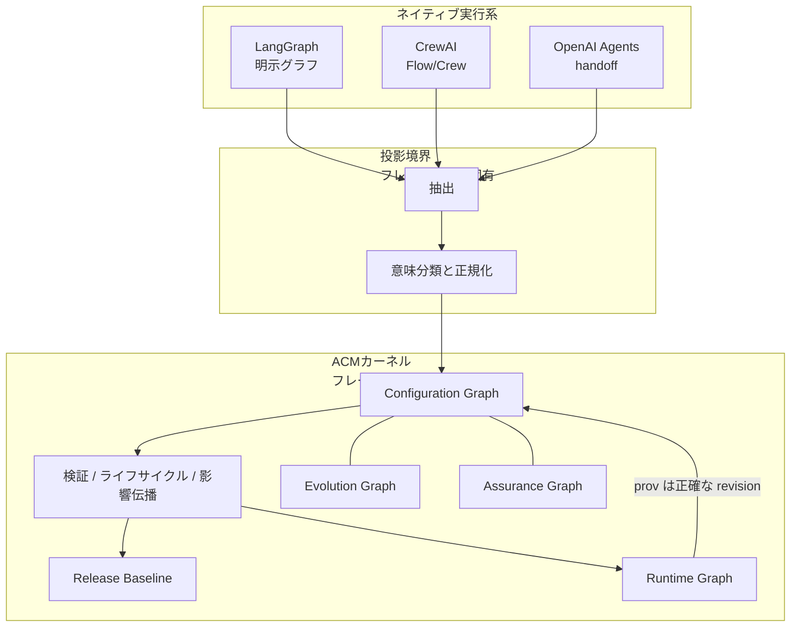

> 想定読者は、LangGraph、CrewAI、OpenAI Agents SDK のように実行抽象が違うエージェント系を、同じ変更集合として承認したい発注側と基盤設計者です。
> この記事は、Agentic Configuration Management（ACM）をオーケストレーション代替ではなく、構成ガバナンスの参照モデルとして読みます。
> いま導入する根拠ではなく、何を一つの承認単位にするかを考える語彙として使います。

:::message alert
本記事は 2026-08-11 提出、2026-09-02 更新の arXiv preprint（[arXiv:2608.11166v2](https://arxiv.org/abs/2608.11166v2)、Audrey Quessada-Vial、PwC、77 pages）を解説したものです。査読済み会議採録ではありません。参照実装の確認対象は GitHub `audreyqvial/ACM` の commit `36d3d5ba`（committer date 2026-08-11T17:45:01Z、2026-09-04 確認）です。
:::

*この記事の全体像。以下、順に解説します。*

## この記事で分かること

ACM が解くのは「どのフレームワークで走るか」ではありません。
エージェント、プロンプト、モデル、ツール、ポリシー、ワークフローといった構成物を、型付きの **Agentic Configuration Item（ACI）** として独立に改訂し、承認済み **Release Baseline** と実行時来歴へ結ぶことです。

著者の位置づけは、オーケストレーションや LLMOps 観測の代替ではありません。
その上に載る構成層です。

この記事で得られる判断材料は次の3点です。

- 構成と実行を分けたときに、何が revision になり、何が観測になるか
- 論文の 27 シナリオと 9 件の影響伝播が、どこまでを示し、どこを示さないか
- 参照実装を本番ライブラリにしない前提で、自前の構成台帳へ写せる3点

結論を先に置きます。
ACM は異種実行系の上に構成ガバナンスの共通語彙を置く提案として一貫しています。
現場の製品として今すぐ載せる根拠にはなりません。

## 実行基盤を置き換えない構成層

エージェント実行系は、すでに実行抽象を持っています。
LangGraph は明示グラフです。
CrewAI は Flow と Crew です。
OpenAI Agents SDK は handoff です。

同じ「プロンプトを変えた」「モデルを差し替えた」「ツールを足した」でも、変更の境界はフレームワークごとに違います。
Git 上では `AGENTS.md`、skill 定義、Prompt Hub、実行 IR、GitOps のカスタムリソースが別パスに散らばります。
承認したいのは実行ログではなく、同時に動いた構成の集合です。

ACM は、この集合をフレームワーク非依存の言葉で扱います。
論文 §8.1 は、実行フレームワークを置き換えないと書きます。
対象は実行そのものではありません。

古典的なソフトウェア構成管理（論文が引用する IEEE Std 828-2012）は、従来成果物の識別と baseline を扱います。
LLMOps 製品は観測とプロンプト CMS を扱います。
実行フレームワークはランタイム抽象を扱います。
論文 §2.5 Table 2 の切り方は、この4者が同じ構成対象を持たない、というギャップです。

構成と実行を分けないと、確率的なモデル出力が revision を汚染します。
論文 §8.2.5 の議論は、再現性の話として筋が通ります。
トレースは「どの revision が走ったか」の来歴であり、スキル本文を上書きする入力ではありません。

## 版管理の単位としてのACI

ACI は、エージェント系の構成物を独立に改訂できる単位です。
論文 Table 4 では、identity、governance state、content（digest 付き）、governance metadata の4塊です。
改訂は immutable です。
変更は既存オブジェクトを上書きせず、新しい revision を生みます（§4.2）。

実装 `acm/models/enums.py` の型は次のとおりです。

| 区分 | 値 |
|---|---|
| ACIType | prompt, tool, model, agent, workflow, template, factory, policy, other |
| RelationType | contains, uses_prompt, uses_tool, uses_model, governed_by, evaluated_under, can_instantiate, templates |
| Lifecycle（実装） | draft, candidate, validated, deprecated, archived |
| Baseline | candidate, released, superseded, withdrawn |
| Quality | ok, to_improve, nok, unknown |
| Assurance | unassessed, partially_assessed, assessed |
| Impact（実装） | current, impacted, stale |
| Eligibility | eligible, warning, blocked |
| PropagationPolicy | blocking, warning, informational, none |

論文 abstract は skills を構成対象の列挙に含めます。
現行実装の `ACIType` に `skill` はありません。
既存型への写像規則も、enum 拡張も、公開ソースでは確認できません。
skills を一体の変更対象にしたい現場は、この欠落を先に印します。

論文 §5.1 のライフサイクル順序は Draft < Validated < Approved < Released < Deprecated < Archived です。
実装は Approved と Released を revision ライフサイクルから外し、Released を baseline 状態に置いています。
論文 Appendix C の Impact は None < Local < Propagated です。
実装 enum は current < impacted < stale であり、写像規則は一次未確認です。
論文 v2（2026-09-02）時点で、確認した `main` の最新 commit は 2026-08-11T17:45:01Z です。
v2 後のコード更新は確認できません。

判断基準は単純です。
論文の語彙で設計メモを書くことと、実装 enum をそのままスキーマにすることとは別です。
後者を採るなら、Approved / Released と skill の扱いを先に決める必要があります。

## 4つのグラフとRelease Baseline

ACM の中核は、4つのグラフです（§4.1 式 (1)）。

- **Configuration Graph**：いま有効な ACI と依存
- **Evolution Graph**：改訂の歴史
- **Assurance Graph**：評価と保証の結びつき
- **Runtime Graph**：実行時来歴。観測は revision を書き換えない（設計原則 P4）

承認の単位は個々のファイルではなく **Release Baseline** です。
baseline の状態は candidate、released、superseded、withdrawn です。
「このプロンプトは新しい」だけでは足りません。
同時に動いてよい revision の集合が、released かどうかが問われます。

影響伝播は Configuration Graph 上の impact 次元だけを動かします。
lifecycle、quality、assurance は伝播で書き換えません（§8.2.2）。
固定点は単調有限格子上の least fixed point として形式化されています（abstract、Appendix G）。
機械検証は未実施です（§9.2）。

適用例は、プロンプト1本の修正です。
local なら検査対象は狭いです。
モデル差し替えやポリシー変更のように依存が広がるなら、baseline を組み直す対象になります。
検査範囲の数値は後述します。
人間工数の削減率としては使いません。

## ネイティブ構成から共通カーネルへの投影

フレームワーク差は、カーネルの中ではなく投影境界に残します。
ネイティブ構成を抽出し、意味分類して正規化したあと、同じ検証、ライフサイクル、影響伝播が動きます。
論文はこれを意味投影（semantic projection）と呼びます（§6.2）。

評価対象の実行系は LangGraph、CrewAI、OpenAI Agents SDK です（§6.3、§7.4）。
CrewAI は静的イントロスペクション不足を adapter metadata で補います。
README は `._meth` と `.unwrap()` を remaining CrewAI black boxes と呼びます。

投影の損失は、preserved、declared_by_adapter、approximated、unsupported で記録する契約です（§7.4 Table 11）。
黙って依存を補完する抽出より、監査向きです。
実行時にしか閉じない動的トポロジは、静的 baseline だけでは足りません。
その経路には、先に印を付けます。

参照実装は Python パッケージ `acm` 0.1.0 です。
著者は、本番向けオーケストレーション基盤ではないと書きます（§6.1 / §6.5）。
LICENSE ファイルはありません。
2026-09-04 時点で PyPI の `acm` 配布は確認できず、`pypi.org/pypi/acm/json` は 404 です。
案内はリポジトリからの editable install です。
star は約 0 です（2026-09-04）。

OpenAI Agents 側は `openai_agents_extractor.py` のみです。
`RuntimeAdapter` 実装は LangGraph と CrewAI に限られます。
MCP と A2A は意図的に範囲外です（Table 13）。

## 評価が示す範囲

評価は2本立てです（§7.2）。

- Campaign A：著者定義の 27 規範シナリオ
- Campaign B：9 件の影響伝播（3 フレームワーク × local / intermediate / global）

GitHub 上の一次確認では、シナリオ YAML は 11 本です。
S04、S12、S14 から S27 は pytest モジュール側です。
README の「S01..S27 が fixtures/*.yaml」は、ファイル集合と一致しません（commit `36d3d5ba`）。

Campaign B の定量グラフは 11 ACI、13 関係です。
論文 Table 12 の数値は次のとおりです。

| 変更クラス | Impact size | Impact ratio | Depth | 固定点反復 | 検査範囲削減 |
|---|---|---|---|---|---|
| Local | 2 | 0.182 | 2 | 3 | 0.846 |
| Intermediate | 2 | 0.182 | 2 | 3 | 0.692 |
| Global | 5 | 0.455 | 2 | 3 | 0.615 |

3 フレームワークの数値は完全一致です。
著者は「投影後のガバナンス等価な依存構造」と説明します（§7.5）。
自然発生的に異なる実システム間で一致した、という意味ではありません。
検査範囲削減 0.615 から 0.846 は人間工数ではありません。
論文は生産性への読み替えを明示的に否定します。

同一コミットの `docs/impact_experiment_20260810-232407.json` は、9 ケースすべて `"repetitions": 5` です。
論文の 5 回連続実行と対応します。
定量レポートの「K itérations」は固定点反復 3 であり、再現回数ではありません。

別グラフ（13 ACI / 18 関係）では、1 ホップ検査が影響 9 件中 6 件、固定点伝播が 9 件を回収しました（§7.5）。

Table 11 はノードと関係の coverage 100% を出します。
CrewAI は unsupported 0 から 1、declared_by_adapter は Flow 2、Crew 3、Flow+Crew 5 です。
100% は規範 perimeter 内の話です。
意味変換精度の一般主張としては弱いです。

27 シナリオは common authorship の規範適合です。
著者自身が、独立経験的妥当性ではないと書きます（§7.7 RQ2、§9.4）。
独立評価者は abstract にありません。
独立の批判記事、採用失敗事例、GitHub Issue、CVE は、確認した検索範囲では見つかりませんでした。
不在は品質の証拠ではありません。

数千 ACI の産業運用、MCP、A2A は未評価です。
Kestra Flow 化や本番ライブラリ採用は、ライセンス、独立追試、MCP カバーが揃うまで根拠不足です。

## 既存製品との役割の違い

ACM を「プロンプト版管理がある製品」と重ねると、過大になります。
役割が違います。

| 基準 | ACM | Oracle Agent Spec | Madatha Rel(AI)Build | Langfuse / LangSmith |
|---|---|---|---|---|
| 主問題 | 構成の識別、改訂、baseline、影響 | 定義の移植と実行 IR | IDE ハーネスの供給鎖と実行前ゲート | プロンプト CMS と実行観測 |
| 版管理対象 | typed ACI と resolved baseline | spec コンポーネントと language version | SHA-256 の canonical md/yaml | プロンプト version、Assistants config |
| フレームワーク独立 | 投影後のガバナンス意味論 | spec から LangGraph / CrewAI / AutoGen / WayFlow | 7 IDE へ compile。LangGraph 等は対象外 | 観測連携は広い。構成 IR は製品内 |
| MCP | 非カバー（Table 13） | 位置づけ文書は MCP/A2A と相補 | ハーネス設定が対象。MCP サーバ構成グラフではない | ツール呼び出しはトレースされる |
| 公開実装の観測 | star 約0、LICENSE ファイルなし（2026-09-04） | `oracle/agent-spec` 約410（2026-09-04） | 公開 GitHub を特定できず（2026-09-04） | Langfuse 約3.4万（2026-09-04） |

Oracle Agent Spec は実行の移植と IR です。
[位置づけ文書](https://oracle.github.io/agent-spec/development/agentspec/positioning.html) は MCP/A2A と相補と書きます。
[Issue #105](https://github.com/oracle/agent-spec/issues/105) は governance 節を提案し、2026-09-04 確認時点で closed です。
ACM のガバナンス格子（lifecycle / quality / assurance / impact / eligibility）とは層が違います。
混同しない判断基準は、「走らせる形を揃える」か「承認する構成集合を揃える」かです。

Langfuse には [プロンプトの immutable version](https://langfuse.com/docs/prompt-management/features/prompt-version-control) があります。
LangSmith には [Assistants の versioned config](https://docs.langchain.com/langsmith/assistants) があります。
ACM Table 1 が「構成グラフ / immutable baseline が無い」と付けた印は、システム全体の typed CI グラフという意味では公式 docs と矛盾しません。
プロンプト単位の版がある、を否定する印としては過大です。

Madatha の Rel(AI)Build（[arXiv:2606.26924](https://arxiv.org/abs/2606.26924)）は、IDE ハーネスの供給鎖と実行前ゲートです。
権限 tier、blocklist、phase machine を持ちます。
公開 GitHub は、`gh search repos RelAIBuild` 等では 2026-09-04 時点で特定できませんでした。

Alsegier の Agency Configuration Schema（ACM 文献 [49]、Preprints.org、査読なし、[DOI 10.20944/preprints202605.0741.v1](https://doi.org/10.20944/preprints202605.0741.v1)）は、権限、HITL、観測、進化といったエージェンシー可変性を製品ラインとして制約検証します。
改訂グラフと異種フレームワーク投影は主目的ではありません。
本文 PDF は 403 のため、詳細は二次情報です。

現場の版管理は、すでに Git 上の定義ファイル、Prompt Hub、Agent Spec、GitOps が担っています。
限定した公開検索では、ACM 語彙の第三者採用は確認できませんでした。
これは不在や低読者数の証明ではありません。

## 現場へ写すなら3点

参照実装を本番ライブラリとして導入しません。
理由は LICENSE 不在、MCP 非カバー、評価が著者規範シナリオと小規模グラフに限ることです。

写すなら次の3点です。

1. **変更集合の境界**
   エージェント、プロンプト、モデル、ツール、skill、ポリシー、MCP サーバ定義を、別 Git パスのまま「1 つの承認単位（baseline）」で結びます。
2. **構成と実行の分離**
   トレースや LLM 出力でスキル本文を上書きしません。
   実行は revision への provenance にします。
3. **投影損失の明示**
   フレームワークや MCP から取れない依存は、黙って補完しません。
   `declared_by_adapter` 相当で記録します。

逆転条件は、独立実装が LICENSE 付きで追試され、MCP を含む産業規模の構成で影響伝播が再現されたときです。
そのときは Agent Spec（実行 IR）と役割分担して再評価します。

直近で決めることは3つです。

- skill 定義、MCP 設定、モデル名を「同時に動いた revision 集合」として run メタに残すか
- Agent Spec を実行移植の候補、ACM をガバナンス語彙の候補として混同しないこと
- 実行時にしか閉じないグラフを持つ経路に、静的 baseline だけでは足りない印を付けること

論文ライフサイクル（Approved / Released）と実装 enum のどちらを正本にするかは、未解決です。
skill を ACIType へどう写すかも未解決です。
この2点を決めずにスキーマへ落とすと、語彙だけが先に増えます。

## まとめ

ACM は、異種エージェント実行系の上に構成ガバナンスの共通語彙を置く参照モデルです。
ACI の独立改訂、4グラフ、Release Baseline、意味投影が中核です。
評価は著者規範の 27 シナリオと、ガバナンス等価な小規模グラフ上の 9 ケースです。
参照実装は LICENSE がなく、MCP をカバーせず、本番オーケストレーション基盤として提示されていません。

使うなら、ライブラリ導入ではなく、承認単位、構成と実行の分離、投影損失の明示です。
実行 IR が欲しいなら Agent Spec 側を見ます。
観測が欲しいなら Langfuse や LangSmith 側を見ます。
層を混ぜないことが、この提案の読み方です。

この記事が少しでも参考になった、あるいは改善点などがあれば、ぜひリアクションやコメント、SNSでのシェアをいただけると励みになります！

## 参考リンク

- Quessada-Vial, A. (2026). *Agentic Configuration Management (ACM): A Reference Configuration Model for Governed Agentic Systems*. [arXiv:2608.11166v2](https://arxiv.org/abs/2608.11166v2)
- 参照実装（commit `36d3d5ba`）: [github.com/audreyqvial/ACM](https://github.com/audreyqvial/ACM/tree/36d3d5ba20c2f4b652a4060a49874520653f746f)
- Madatha, P. (2026). *A Deterministic Control Plane for LLM Coding Agents*. [arXiv:2606.26924](https://arxiv.org/abs/2606.26924)
- Alsegier, R. (2026). *From feature variability to agency variability*. [DOI 10.20944/preprints202605.0741.v1](https://doi.org/10.20944/preprints202605.0741.v1)
- Oracle Agent Spec: [github.com/oracle/agent-spec](https://github.com/oracle/agent-spec)、論文 [arXiv:2510.04173](https://arxiv.org/abs/2510.04173)、[positioning](https://oracle.github.io/agent-spec/development/agentspec/positioning.html)、[Issue #105](https://github.com/oracle/agent-spec/issues/105)
- Langfuse prompt versioning: [Prompt version control](https://langfuse.com/docs/prompt-management/features/prompt-version-control)
- LangSmith Assistants: [Assistants](https://docs.langchain.com/langsmith/assistants)
