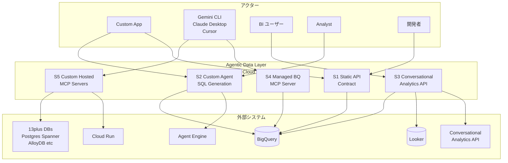
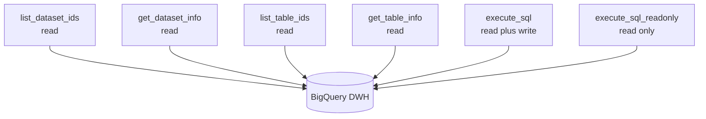
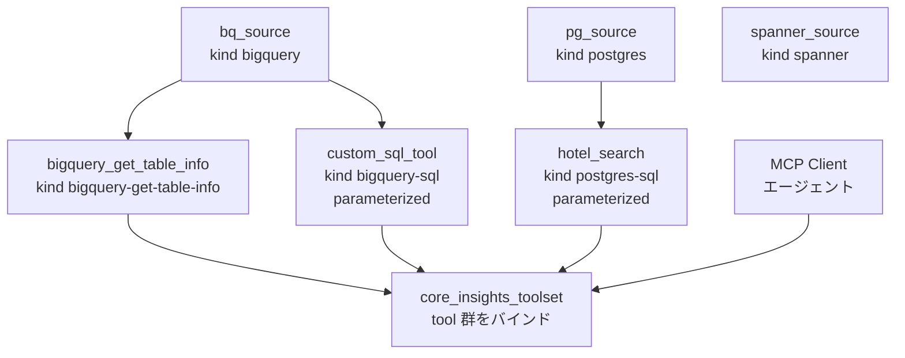
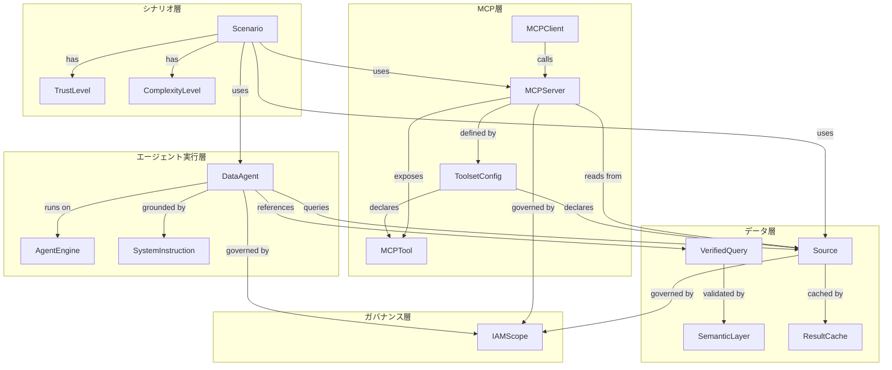
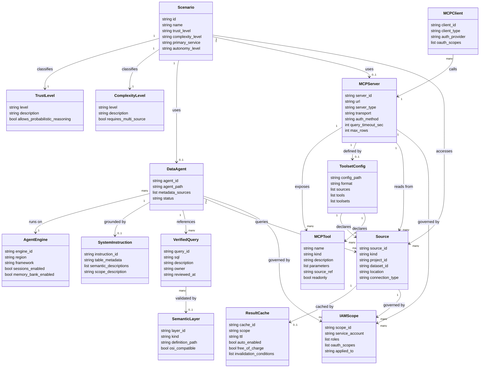

> 出典: Google Cloud Blog (2026-05-19) [Beyond the Query: 5 Scenarios Laying the Foundation for the Agentic Era](https://cloud.google.com/blog/products/data-analytics/building-an-agentic-data-layer-on-google-cloud-5-key-scenarios/)
> 著者: Marco Liotta (Technical Account Manager), Lorenzo Caggioni (Data & AI Architect)
> 調査日: 2026-05-19

## 概要

Google Cloud が 2026-05-19 に公開した本記事は、企業データをエージェントに公開する際のアーキテクチャを **Trust × Complexity** の 2 軸で 5 段階に体系化したリファレンスです。静的レポートから自律システムへのデータアクセスの変化に対応するため、「LLM にデータベースを直接接続する」のではなく、**段階的なアーキテクチャ選択の枠組み**を提示することが本記事の中心的な狙いです。

### Trust × Complexity の 2 軸

- **Trust 軸 (信頼度)**: 環境の信頼水準によって自律度が変わります。信頼度が低い外部公開アプリは決定論的なハードコードロジックを必要とし、信頼度が高い内部ツールは LLM の確率的推論を許容します。
- **Complexity 軸 (複雑度)**: クエリの複雑さによって求める能力が変わります。単純な照会はキャッシュによる即応を求め、複雑な横断分析はマルチツール・マルチソースのオーケストレーションを必要とします。

実運用においてこの 2 軸は「連続体」ではなく**離散選択の組合せ**として機能します。組織が S1 (KPI ダッシュボード)・S3 (内部分析)・S4 (開発者向け探索) を同時並走させるケースが実態に即しています。

### 関連技術と本記事の位置づけ

| 技術 | 役割 |
|---|---|
| **MCP (Model Context Protocol)** | データロジックとモデル推論を脱結合する標準プロトコル。Anthropic が 2024-11-25 に発表・オープンソース化。JSON-RPC 2.0 ベースの client/server モデル |
| **BigQuery** | 全 5 シナリオのデータ実体・IAM 権限境界として機能。Result Cache (S1) / Managed MCP Server (S4) を含む |
| **Cloud Run** | S5 でカスタム MCP Server をホスティングする実行基盤。streamable HTTP のみサポート (stdio 不可) |
| **Vertex AI ADK / Agent Engine** | S2 で使用するエージェント開発・実行基盤。記事中の "Agent Platform SDK" は正式には ADK (SDK) と Agent Engine (Runtime) の別物 2 つ |
| **Conversational Analytics API** | S3 で使用するマネージド Data Agents の実行 API。現時点で **Pre-GA** |

### 元記事との重要な差分

1. **BigQuery MCP の実体は 6 ツール**: 記事は `list_dataset_ids` / `get_dataset_info` / `execute_sql` の 3 ツールのみ言及。実際には `list_table_ids` / `get_table_info` / `execute_sql_readonly` (DML/DDL/Python UDF を除外する安全実行) が追加で存在します。
2. **ADK と Agent Engine は別物**: 記事の "Agent Platform SDK" 表記は正確ではありません。正式には Gemini Enterprise Agent Platform 配下に **ADK** (開発 SDK) と **Agent Engine** (Runtime) が並列で存在します。
3. **Conversational Analytics API は Pre-GA で本番禁止**: Pre-GA Offerings Terms の適用により **本番禁止 / PII 禁止 / SLA 対象外**。5,000 行 / 500GB / 8,192 token の制約が存在します。
4. **Google は Open Semantic Interchange (OSI) に不参加**: OSI v1.0 (2026-01-27 finalize) は Snowflake / dbt Labs / Salesforce など多数が参加しますが、**Google / BigQuery / Looker は不参加**です。

## 特徴

### 5 シナリオの実装スタックと自律度

| # | シナリオ名 | 主担当サービス | エージェント自律度 | 適合する業務 |
|---|---|---|---|---|
| S1 | Static API Contract | BigQuery + 手書きパラメータ化 SQL + BQ Result Cache | 最低 (SQL 固定・決定論的) | 外部公開 API / 高頻度本番ダッシュボード / マルチテナント分離が必要な定型クエリ |
| S2 | Custom Agent w/ SQL Generation | BigQuery + ADK (Python/TS/Go/Java) + Agent Engine | 低〜中 (LLM が SQL を動的生成・実行) | 社内データディスカバリ / アナリスト主導の探索的分析 |
| S3 | Conversational Analytics | Conversational Analytics API (Pre-GA) + Data Agents + Verified Queries (BigQuery / Looker / Data Studio) | 中 (Verified Queries と LookML で意味束縛) | 正確性が非妥協の社内 BI / 自然言語での予測・異常検知 |
| S4 | Managed BigQuery MCP Server | `https://bigquery.googleapis.com/mcp` (6 ツール) + Gemini CLI / Claude Desktop / Cursor | 中〜高 (Managed、IAM service account で制御) | 開発者の IDE / CLI からの探索的分析 / 複数 LLM クライアント共用 |
| S5 | Custom Hosted MCP Servers | Cloud Run + MCP Toolbox (OSS, googleapis/mcp-toolbox v1.2.0) + `tools.yaml` | 最高 (Tool 定義・PII マスキング・カスタム認証の完全自由) | 高規制環境 / ハイブリッドインフラ / 複数 DB 横断 |

### 各シナリオの Trade-off 比較

| # | Flexibility | Cost Control | Latency | Maintenance |
|---|---|---|---|---|
| S1 | Low — SQL 固定のため query logic の変更は開発・デプロイが必要 | High — クエリプランが静的でコスト予測が容易 | Low — Result Cache で低レイテンシ | High — 新しいビジネス要求ごとに開発者対応が必要 |
| S2 | High — 自然言語で任意の質問が可能 | Low — LLM がパーティション未使用の非効率クエリを生成するリスク | Medium — LLM の推論時間を含む | Medium — SQL コードではなく "プロンプトスキーマ" を管理 |
| S3 | Medium — 対応データソース内では高いが、Verified 集合外は Text-to-SQL にフォールバック | Medium — Verified Queries により生 LLM 生成より効率的 | Medium — 多段推論・要約処理でレイテンシ増 | Low — Google が管理 |
| S4 | High — MCP Server が公開するテーブルを自律的に探索可能 | Medium — 標準化されているが、エージェントが大規模スキャンを起動するリスク | Medium — プロトコルハンドシェイクと tool-calling のオーバーヘッドあり | Low — Managed MCP Server のため保守不要 |
| S5 | High — 異ドメイン横断 / 無制限のカスタム Tool 定義 | High — プログラマブルなクエリコスト推定とバジェット閾値を実行前に注入可能 | High — マルチホップ・ネットワーク・コンテナコールドスタートのレイテンシ | High — CI/CD・依存関係パッチ・コンテナスケーリングを含むアプリライフサイクル全体のオーナーシップ |

### 主要な技術的特徴

- **MCP による Data ⇄ Model の脱結合**: S4/S5 は MCP 標準により LLM プロバイダを切り替えてもデータアクセスロジックを変更せずに済みます。クライアント (推論エンジン) とサーバ (ドメイン固有サービス) の分離が設計上の核心です。
- **セマンティック束縛による hallucination 防止**: S3 の Verified Queries と LookML、S5 の高レベル Tool 定義は、LLM が存在しないテーブルや不正な JOIN を生成する Spider 2.0 で実証されたリスク (GPT-4o: 86% → 6%) を緩和します。
- **決定論的実行との組合せ**: S1 と S5 はともに「決定論的実行」を特徴とします。S1 は SQL を事前定義することで、S5 は Tool 定義に複雑なビジネスロジックをサーバサイドに封じ込めることで、確率的 LLM 生成の代わりに決定論的実行を実現します。
- **BigQuery MCP 6 ツール構成の安全設計**: `execute_sql_readonly` ツールは DML / DDL / Python UDF を排除した読み取り専用実行を提供します。
- **Governance は autonomy の前提**: 記事の結論部は "Garbage In, Garbage Out" を明示します。セキュリティ・クレデンシャル・データ品質・標準化されたガバナンスは、どのシナリオを選択しても必須の前提条件です。

## 構造

### システムコンテキスト図



| 要素 | 種別 | 説明 |
|---|---|---|
| Custom App | アクター | 外部公開 API / 顧客ポータル / ダッシュボード等を構築するアプリケーション |
| Gemini CLI / Claude Desktop / Cursor | アクター | MCP クライアントとして動作する IDE / CLI ツール群 |
| BI ユーザー | アクター | 自然言語でデータ分析を行う非エンジニア系エンドユーザー |
| Analyst | アクター | SQL 生成エージェントを通じた探索的分析を行うデータアナリスト |
| 開発者 | アクター | SQL を手書きし Static API を構築・保守するエンジニア |
| BigQuery | 外部システム | 全シナリオを貫くデータウェアハウス本体。IAM で権限境界を定義 |
| Looker | 外部システム | LookML による semantic 層を提供。S3 の Verified Queries の信頼源 |
| Cloud Run | 外部システム | S5 でカスタム MCP Server をホスティングするサーバーレス実行基盤 |
| Agent Engine | 外部システム | ADK エージェントを実行するマネージドランタイム (Gemini Enterprise Agent Platform 配下) |
| Conversational Analytics API | 外部システム | S3 の Data Agents 実行基盤。Pre-GA、本番禁止 |
| 13+ DBs | 外部システム | MCP Toolbox が対応する多様な DB 群 (Postgres / Spanner / AlloyDB / MySQL 等) |

### コンテナ図

```mermaid
flowchart TB
  subgraph S1["S1 Static API Contract"]
    S1P["Parameterized SQL<br/>開発者手書き"]
    S1C["BQ Result Cache<br/>24h TTL 無料"]
    S1B[(BigQuery DWH)]
    S1P --> S1C --> S1B
  end

  subgraph S2["S2 Custom Agent SQL Gen"]
    S2A["ADK Agent<br/>Python TS Go Java"]
    S2E["Agent Engine<br/>Managed Runtime"]
    S2B[(BigQuery DWH)]
    S2A --> S2E --> S2B
  end

  subgraph S3["S3 Conversational Analytics"]
    S3C["Conversational<br/>Analytics API<br/>Pre-GA"]
    S3V["Verified Queries<br/>Data Agents"]
    S3L[(Looker LookML)]
    S3B[(BigQuery DWH)]
    S3C --> S3V --> S3L
    S3V --> S3B
  end

  subgraph S4["S4 Managed BQ MCP"]
    S4M["BigQuery MCP<br/>Managed Server<br/>6 tools"]
    S4B[(BigQuery DWH)]
    S4M --> S4B
  end

  subgraph S5["S5 Custom Hosted MCP"]
    S5R["Cloud Run<br/>streamable HTTP only"]
    S5T["MCP Toolbox OSS<br/>v1.2.0 tools yaml"]
    S5D["13plus DBs<br/>Postgres Spanner<br/>AlloyDB etc"]
    S5R --> S5T --> S5D
  end
```



#### S1: Static API Contract

| コンテナ | 主担当サービス | 説明 |
|---|---|---|
| Parameterized SQL | BigQuery + 手書き SQL | 開発者がビジネス要件をパラメータ化クエリに変換。SQL injection 防止 |
| BQ Result Cache | BigQuery Result Cache | クエリテキスト完全一致でヒット。約24h TTL・無料・自動有効 |
| BigQuery DWH | BigQuery | データ実体と IAM 権限境界 |

#### S2: Custom Agent + SQL Gen

| コンテナ | 主担当サービス | 説明 |
|---|---|---|
| ADK Agent | ADK (Python / TS / Go / Java) | 自然言語を受け取り schema metadata をもとに BQ SQL を動的生成 |
| Agent Engine | Vertex AI Agent Engine | ADK エージェントのマネージドランタイム。Sessions / Memory Bank 提供 |
| BigQuery DWH | BigQuery | 生成 SQL の実行先。アクセス制御は RLS / IAM に委譲 |

#### S3: Conversational Analytics

| コンテナ | 主担当サービス | 説明 |
|---|---|---|
| Conversational Analytics API | Conversational Analytics API (Pre-GA) | NL → DB クエリへの変換を担う Platform-native エンジン |
| Verified Queries + Data Agents | Data Agents | 事前審査済み SQL を参照源として LLM の挙動を束縛する governance 層 |
| Looker LookML | Looker | semantic 層。measure / dimension 定義が Verified Queries の信頼源 |
| BigQuery DWH | BigQuery | クエリ実行先。IAM は Conversational Analytics API が継承 |

#### S4: Managed BQ MCP

| コンテナ | 主担当サービス | 説明 |
|---|---|---|
| BigQuery MCP Managed Server | Managed BigQuery MCP Server | Google が運用・保守するリモート MCP サーバ。6 tools を公開 |
| BigQuery DWH | BigQuery | MCP ツール経由でアクセスされるデータ本体 |

#### S5: Custom Hosted MCP

| コンテナ | 主担当サービス | 説明 |
|---|---|---|
| Cloud Run | Cloud Run | カスタム MCP Server のホスティング基盤。streamable HTTP のみ対応 |
| MCP Toolbox OSS | googleapis/mcp-toolbox v1.2.0 | tools.yaml で source / tool / toolset を宣言する OSS MCP 実装 |
| 13+ DBs | Postgres / Spanner / AlloyDB 等 | Toolbox が対応する 18 種以上の DB。BigQuery も含む |

### コンポーネント図

#### S4: Managed BigQuery MCP — 6 ツール構成



| ツール名 | 種別 | 説明 |
|---|---|---|
| `list_dataset_ids` | read | プロジェクト内データセット ID の一覧を取得。エージェントのデータ環境探索の起点 |
| `get_dataset_info` | read | 指定データセットのメタデータを取得。semantic grounding に使用 |
| `list_table_ids` | read | 指定データセット内のテーブル ID 一覧を取得 |
| `get_table_info` | read | テーブルスキーマ・統計情報を取得。SQL 生成前の文脈把握 |
| `execute_sql` | read/write | 任意 SQL を実行。DML / DDL も含む。クォータ: 3 分 / 3,000 行 |
| `execute_sql_readonly` | read | SELECT のみ許可。DML / DDL / Python UDF を弾く安全実行モード |

#### S5: MCP Toolbox — sources / tools / toolsets 構造



| 構成要素 | 説明 |
|---|---|
| sources | DB 接続定義。kind (bigquery / postgres / spanner 等) と接続情報を宣言 |
| tools | 個別ツール定義。source を参照し、SQL 文とパラメータ、description を記述 |
| toolsets | 複数 tool をバインドしてエージェントに公開するグループ単位 |
| kind: bigquery-get-table-info | テーブルスキーマを返す組み込みツール種別 |
| kind: bigquery-sql | パラメータ化 SQL を実行する組み込みツール種別 |
| kind: postgres-sql | PostgreSQL 向けパラメータ化 SQL を実行する組み込みツール種別 |

## データ

### 概念モデル



| 要素名 | 説明 |
|---|---|
| Scenario | 5シナリオ(S1〜S5)の各アーキテクチャパターン。Trust × Complexity 軸で選択する |
| TrustLevel | エージェントへの信頼度区分(low / medium / high)。autonomy の許容範囲を規定する |
| ComplexityLevel | クエリ複雑度区分(low / medium / high)。固定SQL〜マルチソースオーケストレーションの階段 |
| DataAgent | Conversational Analytics API (S3) が提供する管理型エージェント |
| AgentEngine | Gemini Enterprise Agent Platform のマネージドランタイム |
| SystemInstruction | S2 で LLM に渡すスキーマメタデータ・意味記述の集合 |
| MCPServer | MCP プロトコルでツールを公開するサーバ。Managed と Custom の2種 |
| MCPClient | MCPServer を呼び出す推論エンジン側。Gemini CLI / Claude Desktop / Cursor など |
| MCPTool | MCPServer が公開する個別機能。BigQuery MCP では6ツール |
| ToolsetConfig | S5 の tools.yaml で宣言する Source / Tool / Toolset の設定定義 |
| Source | データの実体。BigQuery Dataset/Table・Postgres・Spanner・AlloyDB など |
| VerifiedQuery | S3 で Data Agent が参照する検証済み SQL テンプレート集 |
| SemanticLayer | Looker LookML など意味定義層 |
| ResultCache | BigQuery の自動クエリキャッシュ(S1)。TTL 約24h、完全無料 |
| IAMScope | IAM ロール・サービスアカウント・スコープの組み合わせ |

### 情報モデル



| 要素名 | 主要属性 | 説明 |
|---|---|---|
| Scenario | id, name, trust_level, complexity_level, primary_service, autonomy_level | 5シナリオの構造定義 |
| TrustLevel | level(low/medium/high), allows_probabilistic_reasoning | 確率的推論を許容するかの離散カテゴリ |
| ComplexityLevel | level, requires_multi_source | クエリ複雑度の離散カテゴリ |
| Source | source_id, kind, project_id, dataset_id, location, connection_type | データの実体定義 |
| MCPServer | url, server_type, transport, auth_method, query_timeout_sec, max_rows | Managed: timeout 3分, max 3000行 / Custom: streamable HTTP のみ |
| MCPTool | name, kind, description, parameters, source_ref, readonly | readonly フラグで execute_sql_readonly を区別 |
| MCPClient | client_id, client_type, auth_provider, oauth_scopes | Gemini CLI / Claude Desktop / Cursor 等 |
| ToolsetConfig | config_path, format, sources, tools, toolsets | S5 tools.yaml の 3 セクション構造 |
| DataAgent | agent_id, agent_path, metadata_sources, status | agent_path は `projects/{p}/locations/{l}/dataAgents/{id}` 形式 |
| AgentEngine | engine_id, region, framework, sessions_enabled, memory_bank_enabled | ADK / LangChain / LangGraph 等を実行 |
| SystemInstruction | instruction_id, table_metadata, semantic_descriptions, scope_description | SQL 生成の境界を定義する文脈 |
| VerifiedQuery | query_id, sql, description, owner, reviewed_at | ビジネスロジックの正規表現として機能 |
| SemanticLayer | layer_id, kind, definition_path, osi_compatible | LookML は osi_compatible=false (Google エコシステム閉域) |
| ResultCache | scope, ttl, auto_enabled, free_of_charge, invalidation_conditions | クエリテキスト完全一致が必要 |
| IAMScope | service_account, roles, oauth_scopes, applied_to | BigQuery IAM が S2〜S4 で継承される |

## 構築方法

### 前提条件

| シナリオ | 有効化が必要な API | 主要 IAM ロール |
|---|---|---|
| S1 | `bigquery.googleapis.com` | `roles/bigquery.dataViewer`, `roles/bigquery.jobUser` |
| S2 | + `aiplatform.googleapis.com` | + `roles/aiplatform.user` |
| S3 | + `geminidataanalytics.googleapis.com` | `roles/geminidataanalytics.dataAgentOwner` |
| S4 | (BigQuery のみ) | `roles/bigquery.user` 以上 |
| S5 | + `run.googleapis.com`, `iam.googleapis.com` | `roles/run.invoker`, `roles/bigquery.dataViewer` |

### バージョン確認

| コンポーネント | バージョン | 備考 |
|---|---|---|
| MCP Toolbox | v1.2.0 (2026-05-07) | `googleapis/mcp-toolbox` |
| MCP 仕様 | 2025-11-25 | modelcontextprotocol.io |
| OSI | v1.0 (2026-01-27) | **Google 不参加** |

### S1: Static API — BigQuery Python Client + Parameterized SQL + Result Cache

```bash
pip install google-cloud-bigquery pandas

SA_NAME="bq-static-api-sa"
gcloud iam service-accounts create ${SA_NAME} --display-name="BigQuery Static API SA"
gcloud projects add-iam-policy-binding YOUR_PROJECT_ID \
  --member="serviceAccount:${SA_NAME}@YOUR_PROJECT_ID.iam.gserviceaccount.com" \
  --role="roles/bigquery.dataViewer"
gcloud projects add-iam-policy-binding YOUR_PROJECT_ID \
  --member="serviceAccount:${SA_NAME}@YOUR_PROJECT_ID.iam.gserviceaccount.com" \
  --role="roles/bigquery.jobUser"
```

Result Cache はデフォルト有効。クエリテキストが完全一致するとキャッシュが返るため、SQL 正規化処理が効きます。

### S2: Custom Agent + SQL Gen — Vertex AI ADK + Agent Engine

ADK (OSS フレームワーク) と Agent Engine (マネージド実行基盤) は別物です。System instruction でテーブル名・カラム型・意味的説明 (semantic description) を明示します。

```bash
pip install google-cloud-bigquery vertexai google-adk
adk init my_data_agent
adk deploy --project YOUR_PROJECT_ID --location us-central1
```

### S3: Conversational Analytics — API (Pre-GA) + Data Agent + Verified Queries

> **重要**: Pre-GA Offerings Terms 適用。**本番禁止 / PII 禁止 / SLA 対象外**。制約値: 5,000 行 / 500GB / 8,192 token。社内 PoC・dogfooding のみに限定します。

```bash
gcloud services enable geminidataanalytics.googleapis.com
gcloud beta gemini data-agents create YOUR_AGENT_ID \
  --project=YOUR_PROJECT_ID --location=us --display-name="My Data Agent"
```

Verified Queries の登録は Console / REST API (POST `https://geminidataanalytics.googleapis.com/v1beta/projects/{p}/locations/{l}/dataAgents/{a}/verifiedQueries`)。

### S4: Managed BigQuery MCP — クライアント設定

実体は **6 本** (元記事は 3 本記述)。エージェント安全設計には `execute_sql_readonly` を優先使用します。

```json
{
  "mcpServers": {
    "bigquery": {
      "httpUrl": "https://bigquery.googleapis.com/mcp",
      "authProviderType": "google_credentials",
      "oauth": {
        "scopes": ["https://www.googleapis.com/auth/bigquery"]
      }
    }
  }
}
```

| クライアント | 設定ファイルパス |
|---|---|
| Gemini CLI | `~/.gemini/settings.json` |
| Claude Desktop | `~/Library/Application Support/Claude/claude_desktop_config.json` (macOS) |
| Cursor | `.cursor/mcp.json` (プロジェクトルート) |

制約: クエリタイムアウト **3 分** / 結果行数上限 **3,000 行 / クエリ** / Google Drive 外部テーブル非対応。

### S5: Custom Hosted MCP — Cloud Run + MCP Toolbox v1.2.0

Cloud Run は **streamable HTTP のみ**サポート (stdio 不可)。認証は Invoker IAM パターンまたは OIDC ID Token パターンの 2 種類。

> **注意**: `googleapis/mcp-toolbox#2212` (open) — DB scope 指定が無視され instance 全体が可視化されるバグ。本番投入前に再現テスト必須。

```bash
docker pull gcr.io/cloud-toolbox-images/mcp-toolbox:v1.2.0

gcloud run deploy mcp-toolbox \
  --image gcr.io/cloud-toolbox-images/mcp-toolbox:v1.2.0 \
  --service-account mcp-toolbox-sa@YOUR_PROJECT_ID.iam.gserviceaccount.com \
  --set-env-vars PROJECT_ID=YOUR_PROJECT_ID,BQ_LOCATION=us \
  --port 5000 --region us-central1 --no-allow-unauthenticated
```

## 利用方法

### API 必須パラメータ一覧

| シナリオ | パラメータ | 説明 |
|---|---|---|
| S1 | `project_id`, `query_parameters` | `bigquery.ScalarQueryParameter` のリスト |
| S2 | `model`, `system_instruction` | Vertex AI モデル ID + スキーマ・semantic 説明文字列 |
| S3 | `name` (agent_path), `query` | `projects/{p}/locations/{l}/dataAgents/{a}` + 自然言語 |
| S4 | `httpUrl`, `authProviderType`, `scopes` | `https://bigquery.googleapis.com/mcp` + `google_credentials` |
| S5 | `tools.yaml`, `PROJECT_ID`, `BQ_LOCATION` | sources / tools / toolsets の 3 セクション |

### S1: BigQuery Python Client — parameterized クエリ

```python
from google.cloud import bigquery

def fetch_products(limit=10):
    client = bigquery.Client()
    sql = """
    SELECT id, name FROM `bigquery-public-data.thelook_ecommerce.products`
    LIMIT @limit
    """
    job_config = bigquery.QueryJobConfig(
        query_parameters=[
            bigquery.ScalarQueryParameter("limit", "INT64", limit)
        ]
    )
    return client.query(sql, job_config=job_config).to_dataframe()
```

`query_parameters` の値が変化しても、SQL テキスト自体が一致すればキャッシュが効きます。

### S2: Vertex AI ADK + BigQuery — 自然言語→SQL

```python
from google.cloud import bigquery
from vertexai.generative_models import GenerativeModel

def ai_query(user_prompt):
    model = GenerativeModel("YOUR_LLM_MODEL")
    system_instruction = (
        "You are a BigQuery SQL expert. Output ONLY raw SQL code without markdown backticks. "
        "Context: The 'products' table in 'bigquery-public-data.thelook_ecommerce' "
        "contains: id (INT), name (STRING), and category (STRING)."
    )
    full_prompt = f"{system_instruction}\n\nUser request: {user_prompt}"
    response = model.generate_content(full_prompt)
    sql_code = response.text.strip().replace("```sql", "").replace("```", "")
    client = bigquery.Client()
    return client.query(sql_code).to_dataframe()
```

**注意**: Spider 2.0 ベンチマークで GPT-4o は 86% → 6% に精度が落ちます。生成 SQL をそのまま本番実行する設計は避け、Verified Queries / semantic 束縛 / 人手レビューによる検証層を必ず設けます。

### S3: Conversational Analytics API — Data Agent

```python
from google.cloud import geminidataanalytics_v1beta as gda

def chat_data(user_query):
    client = gda.DataAgentServiceClient()
    agent_path = "projects/YOUR_PROJECT_ID/locations/us/dataAgents/YOUR_AGENT_ID"
    request = gda.ExecuteDataAgentRequest(name=agent_path, query=user_query)
    response = client.execute_data_agent(request=request)
    return response.answer
```

### S4: Managed BigQuery MCP — Gemini CLI からの実行

```bash
gemini --mcp-config ~/.gemini/mcp_bigquery.json
> list the datasets in project my-project
> show me the schema of dataset analytics table sessions
> run a readonly query: SELECT COUNT(*) FROM `my-project.analytics.sessions` WHERE DATE(created_at) = CURRENT_DATE()
```

エージェント安全設計: 探索フェーズは `execute_sql_readonly` を使用。書き込みが必要な場合のみ `execute_sql` を許可します。

### S5: Custom Hosted MCP — tools.yaml + Cloud Run + クライアント接続

```yaml
sources:
  bq-thelook-ecommerce:
    kind: "bigquery"
    project: "${PROJECT_ID}"
    location: "${BQ_LOCATION}"

tools:
  bigquery_get_table_info:
    kind: bigquery-get-table-info
    source: bq-thelook-ecommerce
    description: Retrieves table metadata and schema details.

  thelook_get_user_orders_summary:
    kind: bigquery-sql
    source: bq-thelook-ecommerce
    statement: |
      SELECT
        orders.user_id,
        COUNT(DISTINCT orders.order_id) AS count_of_orders,
        COUNT(order_items.id) AS count_of_items,
        SAFE_DIVIDE(COUNT(order_items.id), COUNT(DISTINCT orders.order_id)) AS avg_items_per_order
      FROM `bigquery-public-data.thelook_ecommerce.orders` AS orders
      INNER JOIN `bigquery-public-data.thelook_ecommerce.order_items` AS order_items
        ON orders.order_id = order_items.order_id
        AND orders.user_id = order_items.user_id
      WHERE orders.status = "Complete"
        AND orders.user_id = @user_id
      GROUP BY orders.user_id;
    parameters:
      - name: user_id
        type: integer
        description: The unique identifier of the user.

toolsets:
  thelook_core_insights_toolset:
    - bigquery_get_table_info
    - thelook_get_user_orders_summary
```

OIDC ID Token パターンでの接続:

```python
import google.auth
import google.auth.transport.requests
import google.oauth2.id_token
import requests

def get_id_token(audience: str) -> str:
    credentials, _ = google.auth.default()
    auth_req = google.auth.transport.requests.Request()
    id_token_credentials = google.oauth2.id_token.fetch_id_token_credentials(
        audience=audience
    )
    id_token_credentials.refresh(auth_req)
    return id_token_credentials.token

service_url = "https://mcp-toolbox-xxxx-uc.a.run.app"
token = get_id_token(audience=service_url)
headers = {"Authorization": f"Bearer {token}", "Content-Type": "application/json"}
response = requests.post(
    f"{service_url}/mcp",
    headers=headers,
    json={
        "jsonrpc": "2.0",
        "id": 1,
        "method": "initialize",
        "params": {
            "protocolVersion": "2025-11-25",
            "clientInfo": {"name": "my-client", "version": "1.0"},
            "capabilities": {}
        }
    }
)
print(response.json())
```

## 運用

### BigQuery クエリログ・コスト監視

- **INFORMATION_SCHEMA.JOBS** を Data Studio / Looker で日次可視化し、ジョブ別・ユーザー別のスキャン量を追います。
- プロジェクト単位の月次予算アラート (Billing > Budgets & alerts) を設定します。
- Cloud Audit Log を Cloud Logging → BigQuery にエクスポートし、30日以上保存します。
- BQ Result Cache はクエリテキスト完全一致が必要。動的に WHERE 句の値を埋める設計だとキャッシュが効きません。

### MCP Server (S4 Managed) の稼働監視

- OAuth 2.0 トークン有効期限 3,600 秒。長時間セッションではリフレッシュが入る設計を確認します。
- 1 セッションの上限: **3 分 / 3,000 行**。超えそうな場合は BQ Jobs API 直接呼び出しに切り替えます。
- 疎通確認は `execute_sql_readonly` に `SELECT 1` を投げます。

### Cloud Run + MCP Toolbox (S5) の稼働監視

- ヘルスチェックエンドポイント `/healthz` を Cloud Run のスタートアップ/ライブネスプローブに設定します。
- Cloud Monitoring で Request latency p99 と 5xx Error rate にアラートポリシーを作成します。
- `tools.yaml` 更新時は Traffic split (旧リビジョン 10% 残留) で動作確認します。

### Vertex AI Agent Engine のセッション管理

- バッチ分析ワークフローは都度セッションをクローズしてコストを抑えます。
- 利用可能リージョン・SLA は [Agent Engine deploy](https://cloud.google.com/vertex-ai/generative-ai/docs/agent-engine/deploy) で確認します。

### Verified Queries / Data Agent の更新運用 (S3)

- 更新オーナーをデータエンジニアリング or データガバナンスチームに集約し、Pull Request ベースでレビューします。
- KPI 定義の変更チケットに「Verified Queries 更新」を必須タスクとして紐付けます。
- Verified 集合外への fallback 発生率を定期計測し、高頻度カテゴリを優先的に Verified 化します。

### BigQuery Result Cache の無効化条件

- 参照テーブルに DML (INSERT/UPDATE/DELETE/MERGE) が実行された場合即時無効化
- テーブルのパーティション・クラスタリング変更時
- クエリテキストが 1 文字でも異なる場合

## ベストプラクティス

### IAM 設計と最小権限

- エージェントへの IAM ロールは `roles/bigquery.dataViewer` (dataset 単位) + `roles/bigquery.jobUser` を基本とします。`admin` / `dataEditor` は付与しません。
- S4 では `execute_sql_readonly` を優先使用し、プロンプトインジェクション経由のデータ破壊リスクを構造的に下げます。
- S5 では `tools.yaml` の `source` で接続先 DB・スキーマを限定しますが、**P0 Issue #2212 (DB scope 無視) が open のため scope 制限の実効性を検証してから本番投入**します。
- Cloud Run では Workload Identity、ローカル開発では Application Default Credentials (ADC) を使い、サービスアカウントキーをイメージに含めません。

### Verified Queries の Git 管理

- Verified Queries 定義を Git で管理し、Pull Request + コードレビューで承認します。
- レビュアーにビジネスアナリスト (意味の正しさ) と技術者 (SQL 安全性・パフォーマンス) の両方を含めます。
- CI で BigQuery `--dry_run` を実行し、構文と推定スキャン量を自動チェックします。

### MCP tool description のセキュリティレビュー

- **Tool poisoning (Invariant Labs)**: tool description に隠し命令を埋め込む攻撃。GitHub MCP 経由のプライベートデータ漏洩 PoC が公開済み。
- **Sampling 攻撃 (Unit 42)**: MCP sampling 機能を悪用してプロンプトを exfiltrate。
- **Rug-pull (Cisco arXiv 2506.01333)**: 承認済み tool 定義を後から差し替える攻撃。
- 対策: tool description を Git 管理・ハッシュ検証 / MCP server イメージを固定 / ETDI (OAuth-Enhanced Tool Definitions) 動向を追跡。

### Cloud Run + MCP Toolbox の OIDC ID Token 検証 (S5)

- 外部直接アクセスを防ぐため Invoker (`roles/run.invoker`) を内部 SA のみに限定します。
- クライアントは OIDC ID Token を取得し `Authorization: Bearer` で呼び出します。Cloud Run が自動検証します。
- streamable HTTP のみ。クライアント側 MCP ライブラリの対応状況を事前確認します。

### Semantic Layer の選定

- Looker LookML は Google エコシステムに閉じます (OSI v1.0 に Google 不参加)。
- 将来的なマルチクラウド共有が視野にあれば、dbt Semantic Layer (MetricFlow ベース、OSI 標準) を経由する選択肢を検討します。BigQuery は dbt adapter で接続可能。

### Text-to-SQL の限界認識

- Spider 2.0 (arXiv 2411.07763): GPT-4o は Spider 1.0 で 86% → Spider 2.0 で 6%。o1-preview ベース code agent でも 21.3%。
- 実運用スキーマは学術ベンチを上回ります。S2 で自由生成 SQL を検証なしに本番実行する設計は採用しません。

### 複数シナリオ並走パターン

| ユースケース | 推奨シナリオ |
|---|---|
| 高頻度 KPI ダッシュボード | S1 (Static API + Result Cache) |
| 社内 BI ユーザーの自然言語分析 (PoC) | S3 (Pre-GA 制約遵守) |
| 内部開発者・SRE の CLI/IDE 探索 | S4 (Managed BigQuery MCP) |
| ドメイン固有エージェント (検証層あり) | S2 (ADK + Verified 束縛) |
| 複数 DB 横断 | S5 (P0 Issue 解消後) |

各シナリオで IAM・モニタリング・コスト上限を独立設計し、サービスアカウントを共有しません。

## トラブルシューティング

| # | 症状 | 原因 | 対処 |
|---|---|---|---|
| T1 | BigQuery MCP のツール一覧が記事説明 (3 ツール) と実装で食い違う | 元記事は 3 ツールしか記載していないが実体は 6 ツール | `docs.cloud.google.com/bigquery/docs/reference/mcp` を一次ソースとする。`execute_sql_readonly` を積極利用 |
| T2 | Conversational Analytics API を本番環境で使いたい | Pre-GA Offerings Terms 適用 | **本番禁止 / PII 禁止 / SLA 対象外**。社内 dogfooding・PoC のみ |
| T3 | Conversational Analytics API が 200 OK だが応答が空・壊れている | Streaming endpoint が 200 後にエラーを trailer で送出 | `troubleshoot-ca-errors` 公式ガイドに従い streaming trailer を処理するクライアントを使用 |
| T4 | MCP Toolbox (S5) で DB scope を限定したのに他テーブルまで見える | P0 Issue #2212 (open): DB scope 無視 | Fix 含むリリースへ更新。Fix 前は本番投入保留 + VPC Service Controls 等で補完 |
| T5 | MCP Toolbox (S5) Cloud SQL MySQL + IAM 認証で `-32000` エラー | P0 Issue #1826 (open): IAM 認証パスの JSON-RPC エラー | Issue ワークアラウンド確認。暫定 username/password + Secret Manager 経由 |
| T6 | MCP Toolbox (S5) クエリパラメータに配列を渡すと `unsupported type []interface{}` | P0 Issue #553 (open): array 型未サポート | Fix 待ち。暫定: スカラー複数展開 or 文字列 split |
| T7 | MCP クライアントが OAuth 認証を通らない (CLI/headless) | MCP 仕様の OAuth client credentials flow 未確定 (Issue #1046/#952/#1963) | Google Cloud との通信は OIDC ID Token を使用 |
| T8 | Cloud Run の MCP Toolbox に stdio 接続が失敗 | Cloud Run + MCP は streamable HTTP のみ | クライアントを streamable HTTP に変更 |
| T9 | 記事の「Agent Platform SDK」が ADK と Agent Engine のどちらか混同 | 元記事表現が曖昧 | **ADK** = SDK (定義・ツール登録), **Agent Engine** = Runtime (セッション管理・スケール) |
| T10 | BQ Result Cache が効かない | クエリテキストが毎回微妙に異なる or テーブル更新で TTL 内即時無効化 | `INFORMATION_SCHEMA.JOBS.cache_hit` でヒット率計測。S1 パターンに移行 |

## まとめ

Google Cloud の Agentic Data Layer 記事は、エージェントへのデータ公開を Trust × Complexity の 2 軸で 5 段階に整理し、決定論的な Static API から MCP 標準による脱結合まで段階的な選択を提示します。本稿では一次ソース確認で記事の差分 (BigQuery MCP 6 ツール / ADK と Agent Engine の分離 / Conversational Analytics API Pre-GA 制約 / OSI 不参加) を補正し、Spider 2.0 ギャップや MCP Toolbox の P0 Issue など現場制約まで踏み込みました。

この記事が少しでも参考になった、あるいは改善点などがあれば、ぜひリアクションやコメント、SNSでのシェアをいただけると励みになります！

## 参考リンク

### Google Cloud 公式

- [Beyond the Query: 5 Scenarios Laying the Foundation for the Agentic Era](https://cloud.google.com/blog/products/data-analytics/building-an-agentic-data-layer-on-google-cloud-5-key-scenarios/) (Google Cloud Blog, 2026-05-19)
- [BigQuery MCP Server リファレンス](https://docs.cloud.google.com/bigquery/docs/reference/mcp)
- [Use the BigQuery MCP server](https://docs.cloud.google.com/bigquery/docs/use-bigquery-mcp)
- [Host MCP servers on Cloud Run](https://cloud.google.com/run/docs/host-mcp-servers)
- [Conversational Analytics API Overview](https://docs.cloud.google.com/gemini/docs/conversational-analytics-api/overview)
- [Conversational Analytics API known-limitations](https://docs.cloud.google.com/gemini/data-agents/conversational-analytics-api/known-limitations)
- [Conversational Analytics API troubleshooting](https://docs.cloud.google.com/gemini/data-agents/conversational-analytics-api/troubleshoot-ca-errors)
- [Gemini Enterprise Agent Platform](https://docs.cloud.google.com/gemini-enterprise-agent-platform/scale)
- [BigQuery Cached Results](https://docs.cloud.google.com/bigquery/docs/cached-results)
- [Agent Engine deploy](https://cloud.google.com/vertex-ai/generative-ai/docs/agent-engine/deploy)
- [ADK 公式](https://adk.dev/)

### MCP / 標準

- [MCP Specification 2025-11-25](https://modelcontextprotocol.io/specification/2025-11-25)
- [GitHub: googleapis/mcp-toolbox](https://github.com/googleapis/mcp-toolbox) (v1.2.0, 2026-05-07, Apache-2.0)
- [Open Semantic Interchange v1.0](https://opensemanticinterchange.org) (Google 不参加)
- [open-semantic-interchange/OSI](https://github.com/open-semantic-interchange/OSI)

### セキュリティ・反証エビデンス

- [Invariant Labs: MCP tool poisoning PoC (Simon Willison 解説)](https://simonwillison.net/2025/Apr/9/mcp-prompt-injection/)
- [Unit 42 (Palo Alto Networks): MCP sampling 攻撃](https://unit42.paloaltonetworks.com/model-context-protocol-attack-vectors/)
- [arXiv 2411.07763: Spider 2.0 benchmark](https://arxiv.org/abs/2411.07763)
- [arXiv 2506.01333: MCP rug-pull / ETDI (Cisco)](https://arxiv.org/html/2506.01333v1)

### MCP Toolbox P0 Issues

- [#2212 DB scope 無視](https://github.com/googleapis/genai-toolbox/issues/2212)
- [#1826 IAM error -32000](https://github.com/googleapis/genai-toolbox/issues/1826)
- [#553 array parameter 未サポート](https://github.com/googleapis/genai-toolbox/issues/553)

### MCP 仕様未確定

- [#1046 OAuth client credentials 未確定](https://github.com/modelcontextprotocol/modelcontextprotocol/issues/1046)
- [#952 OAuth browser redirect 前提問題](https://github.com/modelcontextprotocol/modelcontextprotocol/issues/952)
- [#1963 MCP Registry 認証仕様外](https://github.com/modelcontextprotocol/modelcontextprotocol/issues/1963)

### 国内事例

- [Zenn (Google Cloud Japan): メダリオン 2.0 / プラチナレイヤー提案](https://zenn.dev/google_cloud_jp/articles/ff74bf18e44f97)
- [Sansan Tech Blog: AI エージェントのための段階的セマンティックレイヤの育て方](https://buildersbox.corp-sansan.com/entry/2026/01/29/110000)
- [Findy Tools: LayerX BigQuery → Snowflake 移行事例](https://findy-tools.io/articles/layerx-migration-bigquery-snowflake/35)

