> 対象: Google Cloud が 2026-07-08 に公開したブログ「20 questions for the agentic enterprise」。
> エージェント導入プロジェクトを「作る前」に問うべき 20 の設計判断を、Build / Scale / Optimize / Govern の 4 フェーズに整理した設計フレームワークです。
> 本記事は方法論（フレームワーク）を対象とするため、C4 図は「枠組みが前提とするエージェント基盤の論理構造」に読み替えています。原典本文には逐語の設定断片が少なく、各問い末尾の Example リンク先で実装例が補われます。本記事のコードブロックはすべて補助的な「実装案 / 例」です。
> なお原典タイトルは "20 questions" ですが、本文の問いは `#0`（Who is building the application?）から始まり `#20` まで 21 ラベルで構成されます。本記事では原典の番号付けに従い `Q0-Q20` と表記します。

AI エージェントの導入は、この 1-2 年で「どのモデルが強いか」から「認可境界・監査・ガバナンスをどう設計するか」へ論点が移りました。Google Cloud の「20 questions for the agentic enterprise」は、その主戦場を 20 の問いに分解した設計レビュー枠組みです。本記事では、この枠組みを構造・データ・実装・運用の観点で解剖します。

## 概要

「20 questions for the agentic enterprise」は、Google Cloud が 2026-07-08 に公開した設計フレームワークです。

- エージェント導入プロジェクトを「作る前」に問うべき 20 の設計判断を提示します。
- 20 問は Build / Scale / Optimize / Govern の 4 フェーズに整理されています。
- 執筆者は Gemini Enterprise Agent Platform の Product Manager（Kanchana Patlolla 氏 / Greg Brosman 氏）です。

このフレームワークの性格は、特定製品の実装手順書ではありません。プロジェクト開始前に組織が自問すべき論点集です。各問いに Google 製品の対応例が添えられているため、チェックリストと製品カタログを兼ねた構成になっています。

### なぜ 2026 年に重要か

エージェント導入の論点は、この 1-2 年で移動しました。

| 時期 | 主要論点 |
|---|---|
| PoC 期 | どのモデルを選ぶか、どのプロンプトが効くか |
| 現在（2026年） | 認可境界・監査証跡・ガバナンス設計をどう組み込むか |

Google Cloud 自身も記事冒頭で、速く動く圧力とエンジニアリング上の複雑さの落差を課題として述べています。具体的には、次の 3 点が量産フェーズで顕在化します。

- 断片化したツール群の統合（disconnected tools）
- 機密データ漏洩とトークン予算超過というコスト・セキュリティ懸念
- 組織全体でスケールする際の基盤の複雑さ

2026 年時点のエージェント導入は、PoC の延長線上ではなく、本番運用を前提にした認可・監査・統制の設計が主戦場になっています。この枠組みは、その主戦場を 20 問という扱いやすい単位に分解した点に価値があります。

### 誰向けか

原典が名宛人として明記するのは "IT leaders" です。本記事では、Q0 のペルソナ記述も踏まえ、実際の想定読者をエンタープライズのアーキテクト・IT 意思決定者・実装エンジニアの三者として整理します。経営層向けの啓蒙資料ではなく、実装に踏み込む前の設計レビュー資料として使う想定です。Q0 は開発に関わる 3 層のペルソナを想定しています。

| ペルソナ層 | 想定する役割 |
|---|---|
| no-code | ビジネス専門家が画面操作でロジックを定義 |
| low-code | 部品を組み合わせるアプリケーション開発者 |
| high-code | カスタムの推論ループを書くエンジニア |

### 4 フェーズと 20 問の全体像

20 問は、開発の進行順に沿った 4 フェーズに配置されています。

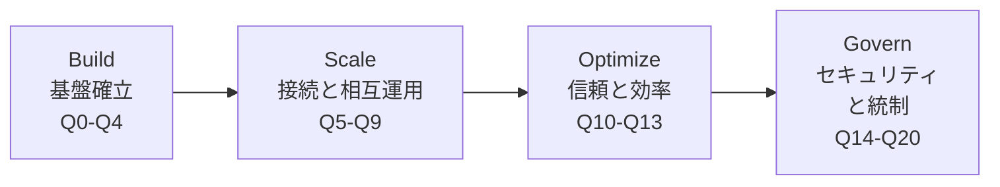

| 要素名 | 説明 |
|---|---|
| Build | Q0-Q4。開発ペルソナ・開発ツール・単一/マルチエージェント構成など、着手前の基盤判断 |
| Scale | Q5-Q9。企業データ接続・フレームワーク間連携・ツール検索・デプロイ・長期メモリなど、システム間接続の設計 |
| Optimize | Q10-Q13。実行隔離・ブランド遵守・評価・コスト制御など、信頼性と効率の作り込み |
| Govern | Q14-Q20。権限整合・シャドー AI 対策・ポリシー・ゲートウェイ・プロンプト保護・脅威検知・ライフサイクル管理などの統制 |

20 問の一覧は次のとおりです。

| # | フェーズ | 問い（要約） | 主要トピック |
|---|---|---|---|
| Q0 | Build | 誰がアプリを作るか | no/low/high-code ペルソナ |
| Q1 | Build | 開発者はどこから始めるか | coding agent、Antigravity、ADK、Agents CLI |
| Q2 | Build | 誰のために作るか（人間か、他エージェントか） | マルチエージェント、A2A、A2UI |
| Q3 | Build | どの開発ツールを使うか | 4段ラダー（Agent Studio / Managed Agents API / Antigravity / ADK） |
| Q4 | Build | 単一エージェントか複数か、どう専門化するか | single vs multi-agent、coordinator + sub-agents |
| Q5 | Scale | 企業データをどう接続し業務文脈を保つか | MCP、metadata、構造化データ |
| Q6 | Scale | 異なるフレームワークのエージェントをどう繋ぐか | A2A protocol、クロスフレームワーク |
| Q7 | Scale | 必要なツールをどう見つけさせるか | 動的ツール取得、Skills、RAG |
| Q8 | Scale | スケールしやすくどうデプロイするか | Agent Runtime、サーバーレス、オートスケール |
| Q9 | Scale | 長時間タスクで文脈を失ったら | 短期/長期メモリ、Agent Memory Bank |
| Q10 | Optimize | スクリプト/ブラウザ実行の blast radius をどう抑えるか | Agent Sandbox、隔離実行 |
| Q11 | Optimize | エージェントをどうオンブランドに保つか | system prompt、Guardrails、決定論的制約 |
| Q12 | Optimize | 結果をどう信頼するか | Evaluation、human-in-the-loop、LLM-as-a-Judge |
| Q13 | Optimize | コスト暴走をどう制御するか | 階層モデル、PT、context caching |
| Q14 | Govern | データアクセスをユーザーと揃えるか | Agent Identity、委譲権限、IAM |
| Q15 | Govern | shadow AI と agent sprawl をどう管理するか | agent registry、中央インベントリ |
| Q16 | Govern | 相互作用の許可条件をどう定義するか | 二層 Policy（IAM + semantic） |
| Q17 | Govern | ポリシーをどう実施し可視化するか | Agent Gateway、telemetry |
| Q18 | Govern | プロンプト/応答をどう保護するか | Model Armor、prompt injection 検知 |
| Q19 | Govern | エージェントの異常にどう気づくか | Threat Detection、Anomaly Detection |
| Q20 | Govern | ライフサイクルを一元管理できるか | Agents CLI、CI/CD |

## 特徴

- **問いから始める設計**: 実装手順ではなく、意思決定すべき論点を疑問文で提示します。答えは組織ごとに異なる前提です。
- **フェーズ順の成熟度モデル**: 4 フェーズは開発の進行順とも対応し、成熟度モデルとして読めます。前段の判断を飛ばすと後段でつまずく設計です。
- **Google 製品エコシステム前提**: 各問いの解決策として Agent Studio・ADK・Antigravity・Agent Gateway・Model Armor など Gemini Enterprise Agent Platform 系の製品が対応づけられています。
- **ガバナンスを設計段階に組み込む思想**: Govern フェーズは Q14-Q20 の 7 問と最大で、権限・監査・脅威検知を後付けでなく初期設計の一部として扱います。
- **開発〜統制の一気通貫**: 開発ツール選定から脅威検知・ライフサイクル管理まで、単一のフレームワークでカバーします。
- **相互運用プロトコルへの言及**: A2A protocol・MCP という業界標準プロトコルを Google 製品と併記し、自社エコシステム内で閉じない設計を志向します。

### 類似の設計枠組みとの比較

| 項目 | Google「20 questions」 | OWASP Top 10 for LLM Applications（2025） | NIST AI RMF 1.0 |
|---|---|---|---|
| 焦点 | エージェント導入前の設計判断 20 項目 | LLM アプリのセキュリティ脅威 10 項目 | AI システム全般のリスク管理 |
| 成果物 | フェーズ別の設問集+製品対応例 | 脅威ランキング（LLM01-LLM10）+緩和策 | GOVERN / MAP / MEASURE / MANAGE の実践ガイド |
| ベンダー中立性 | 低い（Google 製品が前提） | 高い | 高い |
| カバー範囲 | 開発〜スケール〜最適化〜統制の全域 | 主に開発〜運用のセキュリティ脅威 | 組織統制・リスク管理を軸にライフサイクル全体 |

3 者は補完関係にあります。

- Google「20 questions」は、エージェント導入の**設計論点を網羅**する縦串の枠組みです。
- OWASP Top 10 for LLM Applications は、Prompt Injection や Excessive Agency など**脅威そのもの**を列挙するリストです。
- NIST AI RMF 1.0 は、**組織のリスク管理プロセス**を規定する枠組みです。

たとえば Govern フェーズの Q18（プロンプト保護）は OWASP の LLM01（Prompt Injection）と対応し、Q14-Q17（権限・ポリシー）は NIST AI RMF の GOVERN 機能と重なります。Google の枠組みは、これら業界標準の論点を Google 製品で実装する際の対応表としても機能します。なお A2A protocol と MCP は governance framework ではなく相互運用プロトコルのため、比較表には含めていません。

## 構造

「20 questions」はフレームワークであり、特定製品の設計図ではありません。ただし各問いの背後には、一貫したエンタープライズ・エージェント基盤の論理構造が透けて見えます。この節では、その論理構造を C4 model の 3 階層で図解します。具体企業名は使わず、役割・カテゴリ名で表現します。

### システムコンテキスト図

最上位の視点です。「エージェント基盤」を単一のシステムとして捉え、周囲のアクターと外部システムとの関係を示します。

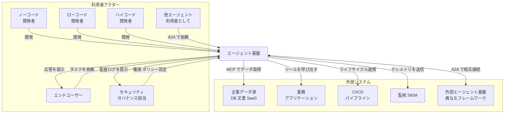

#### 利用者アクター

| 要素名 | 説明 |
|---|---|
| ノーコード開発者 | GUI 中心でエージェントを組み立てる担当者（Q0） |
| ローコード開発者 | テンプレート+部分コードでエージェントを組み立てる担当者（Q0） |
| ハイコード開発者 | コードファーストでエージェントを実装する担当者（Q0/Q1） |
| エンドユーザー | 業務でエージェントを利用する人間 |
| 他エージェント | 人間でなくエージェントが呼び出し元になるケース（Q2） |
| セキュリティ ガバナンス担当 | 権限設計・ポリシー設定・監査を担う役割（Q14-Q20） |

#### エージェント基盤 / 外部システム

| 要素名 | 説明 |
|---|---|
| エージェント基盤 | 20 の問いが前提とする、開発から統制までを内包するプラットフォーム本体 |
| 企業データ源 | エージェントが参照する構造化/非構造化データの源（Q5） |
| 業務アプリケーション | エージェントがツール呼び出しで操作する既存システム |
| CI/CD パイプライン | エージェントのバージョン管理・デプロイと連携（Q20） |
| 監視 SIEM | テレメトリ・監査ログの集約先（Q19） |
| 外部エージェント基盤 | 自社基盤の外にある別フレームワーク製のエージェント群（Q6） |

### コンテナ図

エージェント基盤の内部を、4 フェーズに対応する 4 つの層としてドリルダウンします。開発層で作られたエージェントが接続層を介してデータ/他エージェントと繋がり、実行層で稼働し、統制層をすべての通信の関所として通過する構造です。

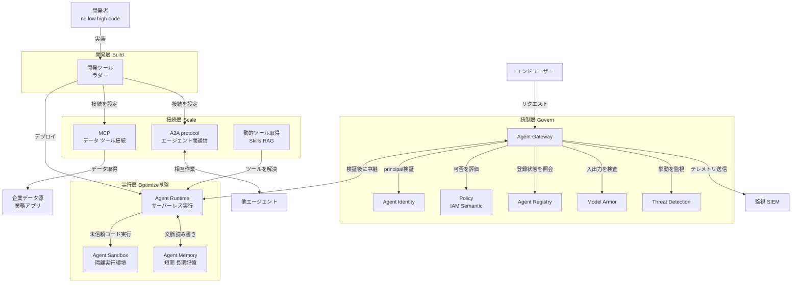

#### 開発層 / 接続層

| 要素名 | 説明 |
|---|---|
| 開発ツールラダー | Agent Studio → Managed Agents API → Antigravity → ADK の 4 段選択肢（Q3）。single/multi-agent の specialize 判断も含む（Q4） |
| MCP | エージェントを企業データ・業務アプリに接続する標準プロトコル（Q5） |
| A2A protocol | フレームワークを跨いだエージェント間通信の標準（Q2/Q6） |
| 動的ツール取得 | 実行時に必要なツールだけを取得し context window を最適化する仕組み（Q7） |

#### 実行層 / 統制層

| 要素名 | 説明 |
|---|---|
| Agent Runtime | オートスケール・双方向ストリーミングでエージェントを実行する基盤（Q8） |
| Agent Sandbox | スクリプト/ブラウザ操作など未信頼コード実行を隔離する環境（Q10） |
| Agent Memory | 長時間タスクでの文脈維持を担う記憶ストア（Q9） |
| Agent Gateway | 全エージェント通信の network 入口/出口（Q17） |
| Agent Identity | ユーザー権限の委譲を含む身元管理（Q14） |
| Policy | 技術的アクセス制御と意図検証の二層ポリシー（Q16） |
| Agent Registry | 稼働エージェントの中央インベントリ（Q15） |
| Model Armor | prompt/response の事前・事後検査（Q18） |
| Threat Detection | 継続的な挙動監査による異常検知（Q19） |

### コンポーネント図

統制層（Govern）をさらに分解します。Agent Gateway を中心に、Identity・二層 Policy・Registry・Model Armor・Anomaly Detection・監査証跡がどう連携するかを示します。

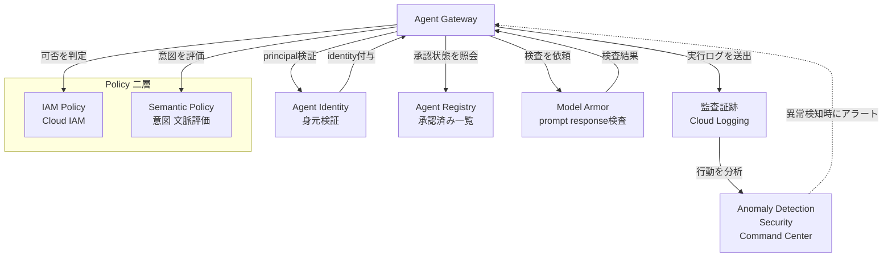

#### Policy 二層

| 要素名 | 説明 |
|---|---|
| IAM Policy | 「誰がどのリソースにアクセスできるか」を判定する技術的な層（Q16） |
| Semantic Policy | 「エージェントが何をしようとしているか」を実行時に評価する意図の層（Q16） |

#### 統制層コンポーネント

| 要素名 | 説明 |
|---|---|
| Agent Gateway | policy 評価・Model Armor 検査・監査ログ生成を仲介する統制の中心（Q17） |
| Agent Identity | エージェントごとの一意で追跡可能な識別子。ユーザー権限の委譲もここで解決（Q14） |
| Agent Registry | ビジネスオーナー・対象データセット・許可ツールを自動インベントリ化（Q15） |
| Model Armor | prompt injection・jailbreak・機微データ・不適切コンテンツを検知（Q18） |
| Anomaly Detection | 監査証跡を継続的に分析し、不正コマンドや未検証接続を検知（Q19） |
| 監査証跡 | Gateway が生成する network-layer telemetry の集約先。Anomaly Detection の入力にもなる |

### エージェント通信境界のネットワーク構成図

Agent Gateway による統制は、ポリシーへの準拠を期待する運用ルールではありません。すべての入口/出口を物理的な proxy に集約し、それ以外の経路を遮断する設計です。CNCF の記事が示す「境界をアプリの遵守に期待するポリシーではなく、アーキテクチャの性質にする」という考え方（原文の paraphrase）と一致します。

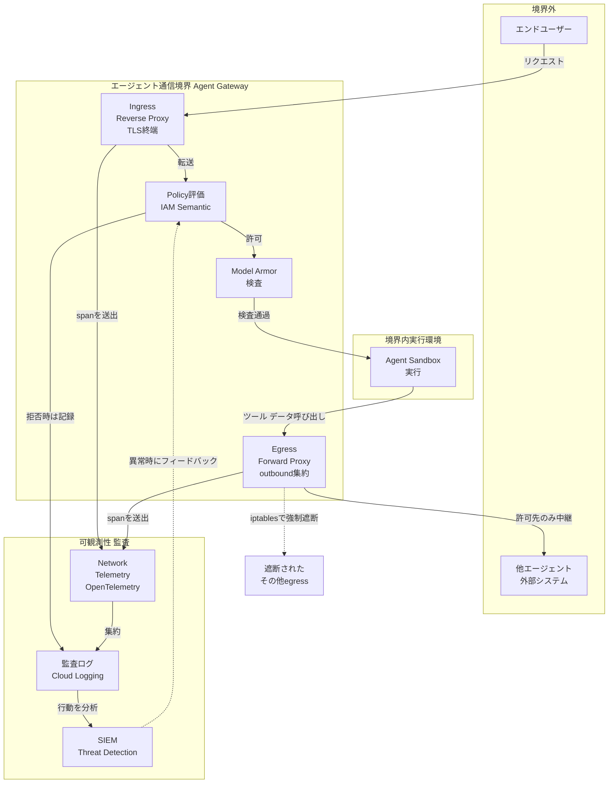

#### 通信境界の構成要素

| 要素名 | 説明 |
|---|---|
| Ingress Reverse Proxy | 受信トラフィックを終端し境界の唯一の入口として機能 |
| Policy評価 | アクセス可否と意図の両面をリクエスト単位で評価 |
| Model Armor検査 | policy 通過後の内容を prompt/response 単位で検査 |
| Egress Forward Proxy | Sandbox からのすべての outbound 通信を集約する唯一の出口 |
| Agent Sandbox実行 | 検査を通過したリクエストのみが到達する隔離実行環境 |
| Network Telemetry | Ingress/Egress 双方の proxy が発行する span の集約点 |
| SIEM Threat Detection | 監査ログを分析し、異常時に Policy評価へフィードバックする監視系 |

egress_proxy を経由しない通信は iptables ルールで強制的に遮断する構成です。境界の遵守はアプリケーションの実装判断に依存せず、ネットワーク構成自体の性質になります。

## データ

「20 questions」が扱う主要エンティティを、概念モデルと情報モデルにモデル化します。配置・通信などの構造や設定ファイルの書き方は対象外です。「20 問の設計レビュー票」自体も `DesignReviewQuestion` としてエンティティ化し、稟議・ADR に埋め込んで他エンティティをレビュー対象として参照する構造にしています。

### 概念モデル

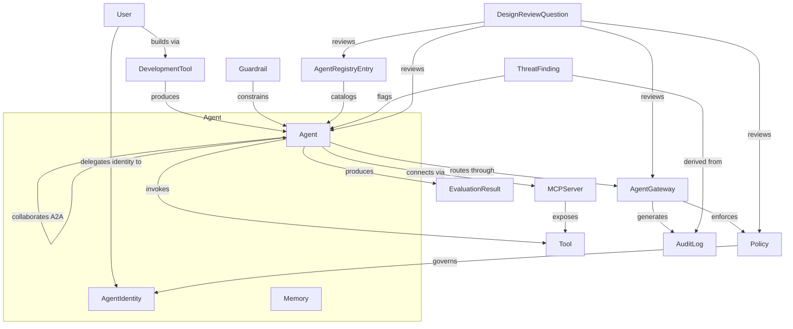

| 要素名 | 説明 |
|---|---|
| Agent（所有: AgentIdentity, Memory） | 実行される単一/複数のエージェント。identity とメモリを内部状態として持つ |
| User | 人間の利用者・開発者（Q0, Q14） |
| DevelopmentTool | Agent Studio / Antigravity / ADK などの開発ツール（Q1, Q3） |
| Tool / MCPServer | エージェントが呼び出す機能と、その接続点（Q5, Q7） |
| Guardrail | エージェントをオンブランド・決定論的制約に留める枠（Q11） |
| EvaluationResult | 自動テスト / human-in-the-loop / LLM-as-a-Judge の評価結果（Q12） |
| Policy / AgentGateway | 二層ポリシーと、それを強制する enforcement point（Q16, Q17） |
| AgentRegistryEntry | shadow AI 対策の中央インベントリ登録（Q15） |
| AuditLog / ThreatFinding | 監査証跡と、そこから導かれる脅威検知結果（Q17, Q19） |
| DesignReviewQuestion | 20 問の設計レビュー票そのもの。全エンティティを横断的に参照 |

`DesignReviewQuestion` は他の主要エンティティを横断的に参照します。20 問がフェーズを横断して全エンティティに触れる、という枠組みの構造を表しています。

### 情報モデル

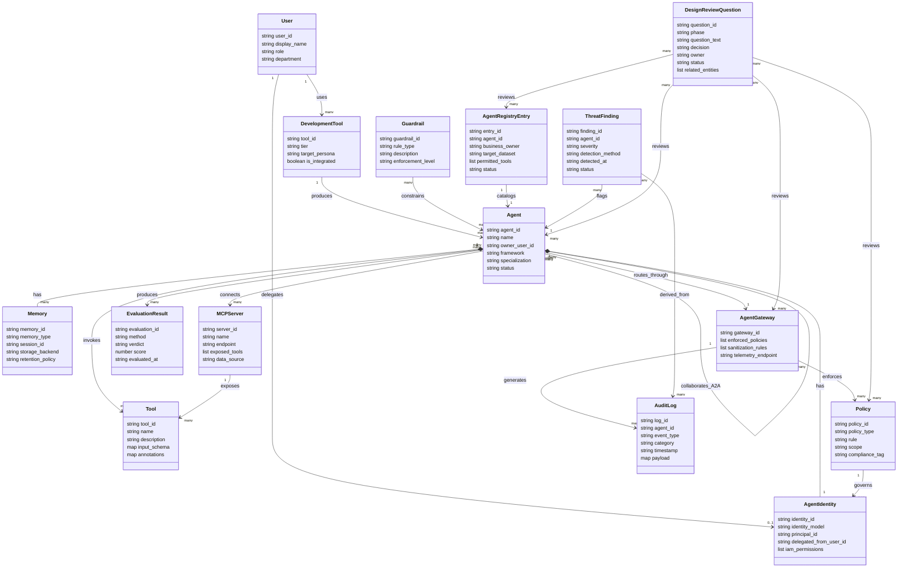

属性の出典は 3 区分です。枠組みが明記するもの（`AgentIdentity.identity_model` の direct/independent/delegated、`Memory.memory_type` の short/long、`Policy.policy_type` の iam/semantic、`AgentRegistryEntry` の business_owner/target_dataset/permitted_tools、`EvaluationResult.method` 等）、公式ドキュメントで補完したもの、一般的な IAM / 監査ログ設計から推測補完したものに分かれます。推測補完した属性（`storage_backend`、`retention_policy`、`compliance_tag`、`DesignReviewQuestion.decision`/`owner`/`status` 等）は枠組みに明示の記載がありません。

## 構築方法

この枠組みを組織に導入する初期セットアップです。原典本文には逐語の設定断片が少ないため、以下はすべて補助的な「実装案 / 例」です。

### 20問を「設計レビュー票」として稟議/ADR に埋め込む

20問はそのままでは読み物です。意思決定プロセスに強制力を持たせるには、稟議/ADR のテンプレートに**必須記入欄**として埋め込みます。

1. 新規エージェント案件の ADR テンプレートに「20問チェック表」セクションを追加する。
2. 案件のフェーズ（Build/Scale/Optimize/Govern）に該当する問いだけを必須項目にする。全20問を初回から強制すると形骸化しやすいためです。
3. 各問いに「未着手 / 検討中 / 対応済 / 対象外（理由記載）」の4値ステータスを持たせる。
4. 承認者は「対応済」の根拠（リンク・設定値）を確認してから承認する。「対象外」は理由なしで通さない。
5. 本番リリース前ゲートとして、Govern フェーズ（Q14-Q20）の必須項目を「未着手」のまま通さない。

レビュー票は人間が読む版（Markdown）と、CI/棚卸しで機械集計する版（YAML）の2種類を用意すると運用しやすいです。

```markdown
## 20-Questions 設計レビュー (ADR-XXXX 添付)

対象システム: <エージェント名>
レビュー日: <YYYY-MM-DD>
レビュアー: <氏名>

| # | フェーズ | 問い (要約) | ステータス | 採用パターン / 根拠 | 残課題 |
|---|---|---|---|---|---|
| Q0 | Build | 誰が作るか (no/low/high-code) | 対応済 | high-code, ADK 採用 | - |
| Q4 | Build | 単一 vs マルチエージェント | 検討中 | coordinator + 2 sub-agents (仮) | 責務分割レビュー待ち |
| Q10 | Optimize | blast radius 制限 | 未着手 | - | Sandbox 未選定 |
| Q14 | Govern | データアクセスをユーザーと揃えるか | 未着手 | - | Agent Identity 未設計 |
| Q17 | Govern | policy 実施と可視化 | 未着手 | - | Gateway 未配置 |

判定: [ ] 本番リリース可 (Govern 必須項目がすべて 対応済/対象外)
```

```yaml
# agent-design-review.yaml — 実装案。20問チェックの機械可読版
adr_id: ADR-0123
agent_name: support-triage-agent
review_date: "2026-07-09"
questions:
  - id: Q0
    phase: build
    summary: "誰が作るか (no/low/high-code)"
    status: done          # not_started | in_review | done | not_applicable
    decision: "high-code, ADK 採用"
    evidence: "docs/adr/0123-agent-dev-tool.md"
  - id: Q14
    phase: govern
    summary: "データアクセスをユーザーと揃えるか"
    status: not_started
    decision: null
    evidence: null
required_before_prod: [Q14, Q15, Q16, Q17, Q18, Q19, Q20]
```

20問自体は一次情報（Google Cloud Blog）に基づきます。YAML/Markdown の構造は本記事の実装案であり、Google の公式テンプレートではありません。

### 4フェーズを成熟度ステップとして整備する導入順序

4フェーズは「1つのプロジェクトの時系列」であると同時に、「組織としてのエージェント基盤の成熟度ステップ」として読み替えられます。1個目のエージェントで Build だけ整えて終わりにせず、2個目・3個目が出てくる前に Scale/Optimize/Govern の土台を組織として先回りで整備するのが狙いです。

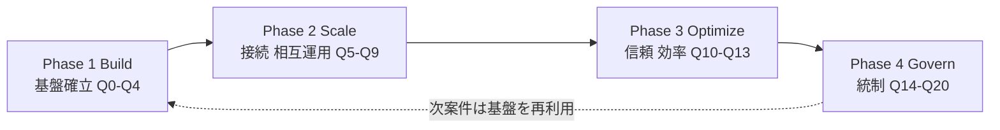

成熟度ゲート（次フェーズに進む前に満たしたい状態、実装案）は次のとおりです。

| フェーズ移行 | ゲート基準（例） | 満たさないまま進むリスク |
|---|---|---|
| Build → Scale | エージェント種別（single/multi）と開発ツールが決定済み（Q3/Q4） | ツール混在で Scale 時の接続方式がバラバラになる |
| Scale → Optimize | MCP/A2A 経由の外部接続が棚卸しされている（Q5/Q6/Q7） | 未管理の接続先がサンドボックス/コスト設計から漏れる |
| Optimize → Govern | eval set とコスト KPI が運用に乗っている（Q12/Q13） | ガードレール導入時に「壊れたら気づけない」状態になる |
| Govern → 次案件 | Agent Identity / Gateway / Registry が組織で共通化されている（Q14/Q15/Q17） | 案件ごとに個別 IAM 設計が乱立し監査できない |

### 前提条件

Govern フェーズの各問い（Q14-Q19）は、事前に以下が無いと個別対応の寄せ集めになりがちです。

| 前提 | 何を先に決めるか | 対応する問い |
|---|---|---|
| IAM 設計 | 共有サービスアカウントで動かすか、エージェント単位の一意な ID を使うかの方針。人間向け IAM ロールの中で「エージェントに渡してよいロール」を先に絞り込む | Q14, Q15 |
| 監査基盤 | Cloud Audit Logs の集約シンク先、Security Command Center の有効化。Gateway/Model Armor が出すテレメトリの受け皿を先に用意する | Q17, Q18, Q19 |
| gateway/proxy の入口一本化 | すべてのエージェント通信を単一の Gateway 経由に強制するネットワーク設計。後から一本化しようとすると全エージェントの再配線が必要になる | Q16, Q17, Q18 |

実務上は「IAM 設計 → 監査基盤 → Gateway 一本化」の順に着手すると、Gateway が最後に既存の IAM/監査と統合される形になり手戻りが少ないです。順序づけ自体は本記事の実装案です。

## 利用方法

各問いへの実装/構成の具体例です。以下はすべて「実装案 / 例」です。コマンド・フラグ・フィールド名は公式ドキュメントに沿わせていますが、この製品群は 2026-07 に公開されたばかりで仕様が流動的です。実施時は必ず最新の公式ドキュメントでコマンド名・フラグ・リソース名を確認してください。プロジェクト ID・エージェント名などは架空の値です。

### Q10: Agent Sandbox — 隔離実行

「スクリプト実行やブラウザ操作をするエージェントの blast radius をどう制限するか」への実装案です。原典 Q10 の Example は Agent Platform 側の Code Execution / Sandbox ですが、ここでは自己管理 Kubernetes での概念例として GKE Agent Sandbox を示します。`runtimeClassName: gvisor` によるユーザー空間カーネル分離で、LLM が生成した未信頼コードを隔離実行する考え方です。

```yaml
# 概念例: GKE Agent Sandbox で未信頼コード実行を隔離する SandboxTemplate
# 実際の apiVersion/CRD 名は GKE Agent Sandbox の最新ドキュメントで確認すること
kind: SandboxTemplate
metadata:
  name: python-runtime-template
spec:
  podTemplate:
    spec:
      runtimeClassName: gvisor            # gVisor によるカーネルレベル分離
      automountServiceAccountToken: false # 未信頼コードに SA トークンを渡さない
      securityContext:
        runAsNonRoot: true
      containers:
        - name: python-runtime
          securityContext:
            capabilities:
              drop: ["ALL"]               # 権限昇格の防止
```

- Kubernetes を持たない構成であれば、Vertex AI Agent Engine の Code Execution（API 呼び出しで Python/JavaScript を隔離実行）も選択肢です。
- ポイントは「未信頼コードにサービスアカウントトークンや権限を持たせない」「カーネル分離で blast radius を閉じる」の 2 点で、これは特定製品に依存しない設計原則です。

### Q12: Evaluation — LLM-as-a-Judge

「結果をどう信頼するか」への実装案です。評価フレームワークは、決定論的なメトリクス（ツール軌跡の一致など）と、LLM を判定者に使うメトリクス（最終応答の意味的一致・ルーブリック評価など）を組み合わせる考え方です。

```json
// 概念例: 評価設定 — 決定論的判定 + LLM-as-a-Judge + ルーブリック
{
  "criteria": {
    "tool_trajectory_avg_score": { "threshold": 1.0 },
    "final_response_match": {
      "threshold": 0.8,
      "judge_model": "gemini-flash-latest",
      "num_samples": 5
    },
    "rubric_based_quality": {
      "threshold": 0.8,
      "rubrics": [
        { "id": "on_brand_tone", "text": "回答がブランドのトーンを守っている" },
        { "id": "no_fabrication", "text": "一次情報で確認できない事実を含まない" }
      ]
    }
  }
}
```

CI に組み込む場合の流れです。

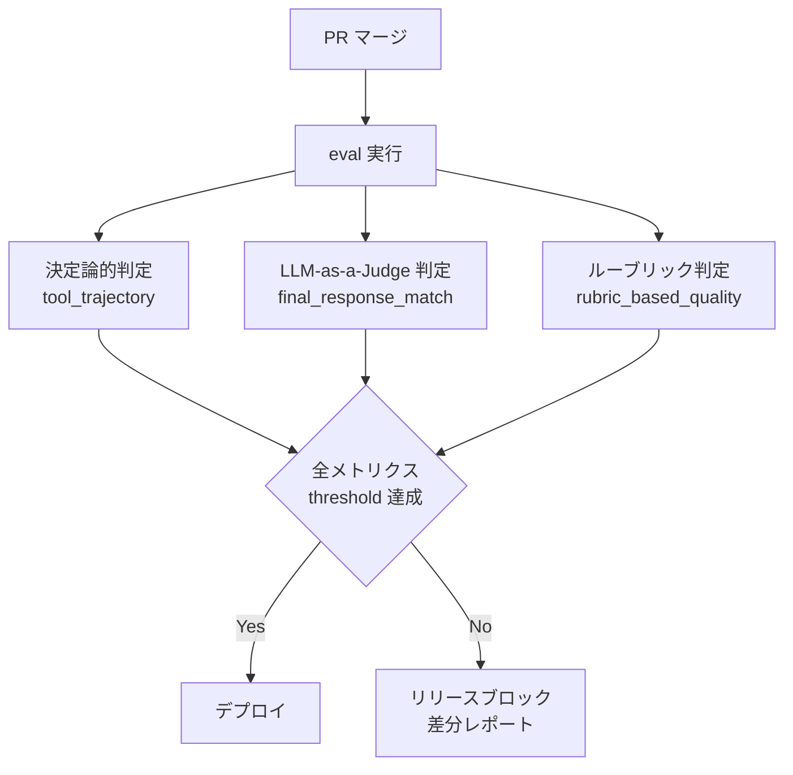

「自己評価エージェントが end-user 到達前に output を audit する」という原典の記述は、この judge モデルによるオフライン評価と、本番トラフィックへの human-in-the-loop 併用の両方に対応します。

### Q14: Agent Identity — 委譲権限/IAM

「エージェントのデータアクセスを人間ユーザーに揃えるか」への実装案です。Agent Identity は共有サービスアカウントの代替として、エージェントごとに一意な ID を発行し、IAM に直接バインドする考え方です。

- 共有サービスアカウントを避け、エージェント単位の一意な principal を IAM member として扱います。
- 人間ユーザーと同じ権限を丸ごと渡すのではなく、エージェントが実際に使うツール分だけ個別付与するのが Q14 の趣旨です（最小権限）。
- 「ユーザーの代わりに操作する」委譲権限パターンは、エンドユーザー同意を伴う OAuth（3-legged）で実現し、エージェントに生の認証情報を持たせず Gateway 側で扱う設計が推奨されます（Q17 と接続）。

```bash
# 概念例: エージェントの principal に最小権限ロールを付与する IAM バインド
# principal 表記・付与するロール名は最新の公式ドキュメントで確認すること
gcloud <resource-type> add-iam-policy-binding <resource-id> \
  --member="<agent-principal>" \
  --role="<least-privilege-role>"
```

### Q16: Policy — 二層（IAM + semantic）

「ユーザー・エージェント・データ・ツールの相互作用をどう定義するか」への実装案です。二層構造で捉えます。

| 層 | 何を制御するか |
|---|---|
| IAM policy | 「誰が/どのエージェントが」「どのリソース/ツールに」到達できるか（静的な allow/deny） |
| Semantic policy | 到達できるエージェントが「実際にどう振る舞ってよいか」（動的・文脈依存の業務ルールを自然言語で表現） |

IAM は「到達可否」、semantic policy は「到達できた上での振る舞い」を制御するため、片方だけでは Q16 の要求を満たしません。IAM で許可されたツールでも、semantic policy が個別のツール呼び出しをブロックできます。自然言語制約の例は「米国内の発送には常に UPS を使う」「一定額を超える返金は必ず human-in-the-loop の承認を経由する」といった、業務ルールをそのまま宣言する形です。

### Q17: Agent Gateway — 入口一本化と egress 遮断

「policy をどう実施し、エージェント活動をどう可視化するか」への実装案です。Agent Gateway はエージェントに関わる全通信の入口（ingress: クライアント→エージェント）と出口（egress: エージェント→外部リソース）を一本化するネットワーク層です。

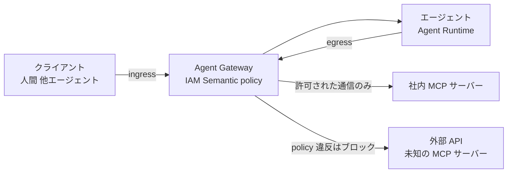

構成の考え方（概念例。実施時は公式ドキュメントで最新の設定 UI/リソース名を確認）は次のとおりです。

1. エージェントと MCP サーバーを Agent Registry に登録する（Q15 の棚卸しと接続）。
2. Ingress 側で「どのクライアントがどのエージェントに到達できるか」を IAM policy で強制する。
3. Egress 側で、エージェントの identity ごとに「到達してよい外部リソース/ツール」を定義し、未登録の外部エンドポイントへの到達はデフォルトでブロックする。
4. Semantic Policy（Q16）と Model Armor（Q18）をこの一本化された入口にアタッチし、「到達可否」だけでなく「内容の安全性」もここでチェックする。個別エージェントごとに実装すると抜け漏れが出ます。
5. Gateway が生成する network-layer telemetry を Agent Observability 基盤（Cloud Logging / Cloud Trace 等）に送る。脅威検知の findings は Security Command Center 側で扱う。

これにより Q14（委譲権限）と Q17（入口一本化）が同じ機構でつながり、prompt injection / 機微データ検知（Q18）が初めて全トラフィックに一様適用されます。

## 運用

Govern フェーズ（Q14-Q20）を中心に、稼働後の統制運用を扱います。この 7 問が扱う領域は次のとおりです。

| 領域 | 対応する問い | 主要コンポーネント |
|---|---|---|
| 権限整合 | Q14 | Agent Identity（直接 / 独立 / 委譲の 3 モデル） |
| 棚卸・可視化 | Q15 | Agent Registry |
| ポリシー定義 | Q16 | IAM policy + semantic policy の二層 |
| ポリシー実行・監査 | Q17-Q19 | Agent Gateway、Model Armor、Security Command Center |
| ライフサイクル管理 | Q20 | Agents CLI |

### Shadow AI / agent sprawl の継続監視（Q15）

Agent Registry は、ビジネスオーナー・対象データセット・許可ツールを自動でインベントリ化します。稼働後は次を定期実施します。

| 運用タスク | 頻度の目安 | 目的 |
|---|---|---|
| Registry と実インフラの突き合わせ | 週次〜月次 | 未登録エージェント（shadow）の検出 |
| owner 不在エージェントの棚卸 | 月次 | 責任の空白を解消 |
| 冗長エージェントの統合判断 | 四半期 | sprawl（乱立）の抑制 |
| 孤立エンドポイントの廃止 | 都度 | 攻撃対象領域の縮小 |

### policy enforcement の可視化（Q17）

Agent Gateway が生成する network-layer telemetry は、行動メトリクスと実行トレースをダッシュボードへ供給します。稼働後の運用ポイントは、この telemetry を「誰が」「いつ」見るかを決めることです。telemetry を出すだけでは監視になりません。二層ポリシーとの関係は次のとおりです。

| 層 | 検証内容 | タイミング |
|---|---|---|
| IAM policy | 許可されたツール・データバケットへのアクセスか | 実行前（静的） |
| semantic policy | 自然言語インテントがビジネスルール・コンプライアンスに適合するか | 実行前（動的・都度） |

### Threat Detection / Anomaly Detection による behavioral audit（Q19）

Security Command Center の Agent Platform Threat Detection は、稼働後の挙動を監視する組み込みサービスです。検知は 2 系統に分かれます。

| 検知系統 | 監視対象 | 検知例 |
|---|---|---|
| Runtime detectors | Agent Runtime 上のプロセス・スクリプト・ライブラリ | 悪意あるスクリプト実行、コンテナエスケープ、リバースシェル |
| Control-plane detectors | IAM / データベース監査ログ、Agent Runtime の stdout/stderr | データ流出の試み、過度な権限拒否、不審なトークン生成、権限昇格 |

これに加えて Anomaly Detection が、サービスアカウントの外部由来 behavior signal（認証情報漏洩の兆候など）を検知します。findings を単一ビューで定期確認し、重大度に応じて隔離・失効・エスカレーションを判断する運用ループを組むことが要点です。

### コスト監視（Q13）

コスト暴走対策は、モデル選定とインフラ契約の 2 軸で構成されます。

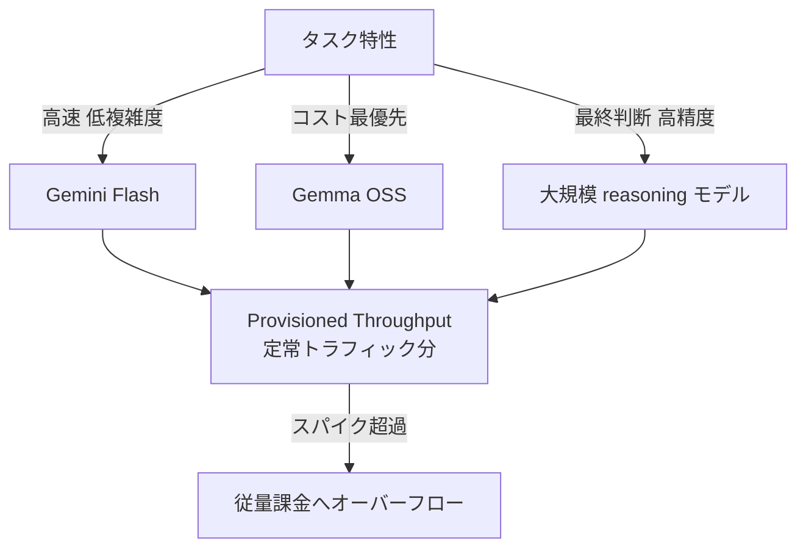

- Provisioned Throughput（PT）は予約枠で固定コスト・固定期間を確保する契約です。定常的に高スループットを要する本番ワークロードに向きます。
- context caching、precision RAG、agent iteration の hard stop、決定論的コードへの置き換えは、いずれも「同じ結果をより少ないトークン・呼び出し回数で得る」ための施策です。

稼働後に監視すべき KPI の設計例です。Google 記事は KPI の具体値までは明示していないため、実務での監視観点として整理します。

| KPI | 監視目的 |
|---|---|
| PT 利用率（稼働率） | 予約枠の過不足判断 |
| 従量課金へのオーバーフロー比率 | スパイク検知、PT 枠再設計の契機 |
| context cache ヒット率 | context caching の効果測定 |
| iteration 回数の分布 | hard stop 閾値の妥当性検証、暴走の早期検知 |
| タスク成功あたりコスト | モデル階層化の効果測定（単純な総額 SUM だけでは判断できない） |

### 起動・停止・状態確認・監査ログ確認

一次情報は個別 CLI コマンドの逐語仕様までは踏み込んでいません。フレームワークが示す構成要素から、次の対応関係で運用手順を設計します。

| 運用操作 | 対応するコンポーネント | 考え方 |
|---|---|---|
| 起動・デプロイ | Agent Runtime、Agents CLI | サーバーレス実行基盤へのデプロイ。CI/CD に組み込み手動オペレーションを減らす |
| 停止・切り離し | Agent Registry、Agent Gateway | Registry から除外し、Gateway 側でルートを止める。プロセス kill だけでなく棚卸台帳の更新までが「停止」 |
| 状態確認 | Agent Gateway の telemetry、Security Command Center findings | アプリ内ログでなく、通信境界のテレメトリと脅威検知の findings を一次情報源にする |
| 監査ログ確認 | Agent Gateway、Model Armor、Agent Identity | 「誰が」「どの権限で」「何にアクセスしたか」を Identity 側、「何が起きたか」を Gateway/Model Armor 側で突き合わせる |

## ベストプラクティス

誤解しやすい点を先に反証してから、推奨を示します。

### 誤解 1: ガバナンスは後付けでよい

- **誤解**: セキュリティ・監査の仕組みは、エージェントが動いてから足せばよい。
- **反証**: この枠組みは Govern を Q14-Q20 として最終フェーズに置いていますが、これは「後回しにしてよい」という意味ではありません。Agent Identity（Q14）や Agent Registry（Q15）は、エージェントを 1 つでも本番投入した瞬間から必要になります。後付けで導入すると、既存エージェントの棚卸し・権限再設計という追加コストが発生します。
- **推奨**: Build 段階（Q0-Q4）で、最初の 1 エージェントから Identity・Registry 登録を必須プロセスに組み込みます。フェーズは実装の進行順であり、着手順ではありません。

### 誤解 2: 監査証跡はアプリケーションログで十分

- **誤解**: エージェントのログ出力（アプリ内ログ）を集めれば、監査証跡として十分である。
- **反証**: アプリ内ログは、エージェント自身の実装が正しくログを出す前提に依存します。CNCF の記事は、この前提が崩れた場合の対策として「通信境界（network boundary）から監査情報を取る」設計を提示しています。iptables で全 egress を forward proxy 経由に強制することで、アプリケーションの遵守に依存しない構造的な境界（boundary-as-architecture）を作ります。ただし network boundary は intent（意図）までは見えず、アプリ層の監査を代替するのではなく、アプリ層が信頼できない場合の下限を保証する層です。
- **推奨**: 監査証跡は「アプリ内ログ」と「通信境界の telemetry」を両方取り、後者を一次情報源・前者を意図理解の補助情報として位置づけます。Google の Agent Gateway（Q17）が生成する telemetry も、同じ boundary-as-architecture の思想です。

### 誤解 3: 評価器（LLM-as-a-Judge）の判定はそのまま信頼してよい

- **誤解**: 自動評価で pass すれば、品質は保証されている。
- **反証**: LLM-as-a-Judge には自己評価バイアス（self-preference bias）、冗長性バイアス（verbosity bias）、位置バイアス（position bias）が知られています。ベンチマーク横断で一様に信頼できる judge は存在せず、評価器そのものの信頼性を検証する必要があります。
- **推奨**: 評価器自体を監査対象に含めます。生成モデルと評価モデルを分離する、人間レビューを一定割合でサンプリングする、複数 judge の合議にする、といった対策を評価パイプラインの設計に組み込みます。

### 誤解 4: ベンチマークのスコアが高ければ導入して問題ない

- **誤解**: 公開ベンチマークで高スコアなら、そのまま自社データに適用してよい。
- **反証**: ベンチマークのスコアは、評価データセットの品質に依存します。汚染（contamination）、自社ユースケースとの乖離、評価対象タスクの偏りがあれば、スコアは実運用の信頼性を保証しません。
- **推奨**: ベンチマークだけでなく、評価に使うデータセット自体の出所・カバレッジ・偏りを監査します。Q12 の評価設計と合わせて、自動テスト・human-in-the-loop・自己評価エージェントの 3 層を組み合わせます。

### この枠組みの適用限界

| 限界 | 内容 |
|---|---|
| Google Cloud 前提のロックイン | 20 問の解決策はほぼ全て Agent Studio / ADK / Antigravity / Agent Gateway / Model Armor など Gemini Enterprise Agent Platform 系製品に対応づけられています。他クラウド・OSS スタックへの適用には読み替えが必要です |
| プロトコルの中立性は一様ではない | A2A は Linux Foundation 管轄、MCP は Anthropic 発の open standard で、いずれも Google 固有ではありません。一方 Model Armor・Security Command Center は Google Cloud 固有のセキュリティ製品であり、中立標準ではありません。同じ記事内でも部品ごとに中立性の度合いが異なります |
| 20 問は優先順位を示さない | 網羅的なチェックリストであり、どの問いから着手すべきかの優先順位付けはありません。着手順は WSJF 等の別手法で決める必要があります |
| 組織規模による過剰設計のリスク | 数エージェント規模の組織が Q14-Q20 の全統制機構をフル導入すると、統制コストが本体の開発コストを上回る over-engineering になり得ます。エージェント数・データ機密度に応じて適用範囲を絞る判断が要ります |
| semantic policy の誤検知 | 自然言語のインテント解析である以上、誤検知（false positive）による正当な処理のブロック、巧妙な言い回しによるすり抜け（false negative）の両方が起こり得ます |

## トラブルシューティング

| 症状 | 原因 | 対処 |
|---|---|---|
| agent sprawl で棚卸ができない | 部門ごとに個別構築され、中央 Registry に未登録のエージェントが存在する | Agent Registry へ全エージェントを登録必須化し、インフラの実態と定期突き合わせを行う（Q15） |
| prompt injection がすり抜ける | Model Armor が検知のみ（ブロックしない）設定のまま、または検査上限を超える長大な入力が使われている | enforcement をブロック有効に変更する、confidence threshold を引き上げる、入力長を制限する（Q18） |
| コストが暴走する | Provisioned Throughput 未設定で全量が従量課金、agent iteration に上限がない、context caching 未使用 | PT で定常分を確保しスパイクのみ従量課金にオーバーフローさせる、iteration hard stop を設定する、context caching と precision RAG を導入する（Q13） |
| 評価器が誤って pass 判定を出す | LLM-as-a-Judge の自己評価バイアス・冗長性バイアス・位置バイアス | 生成モデルと評価モデルを分離する、human-in-the-loop のサンプリングレビューを追加する、複数 judge の合議制にする（Q12） |
| Gateway を迂回した外部送信（egress）が発生する | policy enforcement がアプリケーション層のみで、network 層に egress 制御がない | iptables 等で全 egress をドロップし、forward proxy（Agent Gateway 相当）だけを唯一の出口にする構造的境界を敷く（Q17） |
| エージェントの identity が過剰権限を持つ | 直接ユーザー identity 委譲時にエージェント固有の IAM 設定がなく、ユーザーの全権限を継承している | Agent Identity の 3 モデルから用途に応じた最小権限モデルを選び直し、監査証跡でアクセスレビューを行う（Q14） |

## まとめ

Google Cloud の「20 questions for the agentic enterprise」は、エージェント導入を「作る前」に問うべき論点を Build / Scale / Optimize / Govern の 4 フェーズ 20 問へ分解した設計レビュー枠組みです。製品カタログの側面はあるものの、20 問を稟議・ADR の必須記入欄に落とし込めば、権限・境界・停止条件・評価を「仕様書より先に埋める問いのカタログ」として使えます。

この記事が少しでも参考になった、あるいは改善点などがあれば、ぜひリアクションやコメント、SNSでのシェアをいただけると励みになります！

## 参考リンク

- 一次情報（本フレームワーク）
  - [20 questions for the agentic enterprise | Google Cloud Blog](https://cloud.google.com/blog/products/ai-machine-learning/20-questions-for-the-agentic-enterprise/)
- 標準・関連枠組み
  - [OWASP Top 10 for LLM Applications 2025 | OWASP Gen AI Security Project](https://genai.owasp.org/resource/owasp-top-10-for-llm-applications-2025/)
  - [NIST AI 100-1: Artificial Intelligence Risk Management Framework (AI RMF 1.0)](https://nvlpubs.nist.gov/nistpubs/ai/nist.ai.100-1.pdf)
  - [Linux Foundation Launches the Agent2Agent Protocol Project](https://www.linuxfoundation.org/press/linux-foundation-launches-the-agent2agent-protocol-project-to-enable-secure-intelligent-communication-between-ai-agents)
  - [Introducing the Model Context Protocol | Anthropic](https://www.anthropic.com/news/model-context-protocol)
- 関連プロダクト / 実装（Google Cloud）
  - [Model Armor overview | Google Cloud](https://docs.cloud.google.com/security-command-center/docs/model-armor-overview)
  - [Security Command Center | Google Cloud](https://cloud.google.com/security-command-center)
  - [Agent Development Kit (ADK)](https://adk.dev/)
  - [Provisioned Throughput | Vertex AI](https://docs.cloud.google.com/vertex-ai/generative-ai/docs/provisioned-throughput/overview)
- 実務記事 / 反証
  - [Network boundary for AI agents using NGINX and OpenTelemetry | CNCF](https://www.cncf.io/blog/2026/07/08/network-boundary-for-ai-agents-using-nginx-and-opentelemetry/)
  - [Google Vertex AI Pricing: Complete Enterprise Guide (2026) | CloudZero](https://www.cloudzero.com/blog/google-vertex-ai-pricing/)
  - [Judging LLM-as-a-Judge with MT-Bench and Chatbot Arena (Zheng et al., arXiv:2306.05685)](https://arxiv.org/abs/2306.05685)
