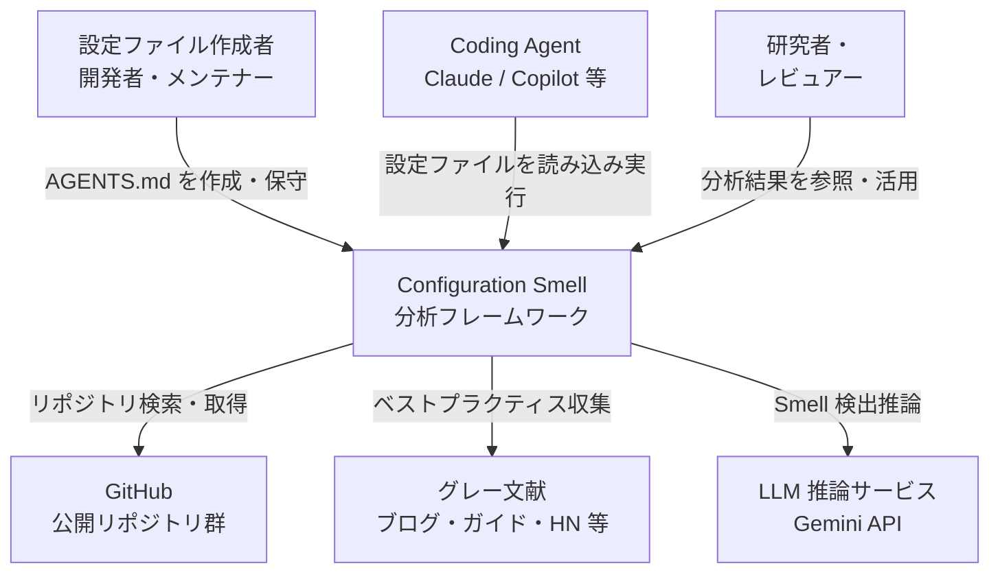
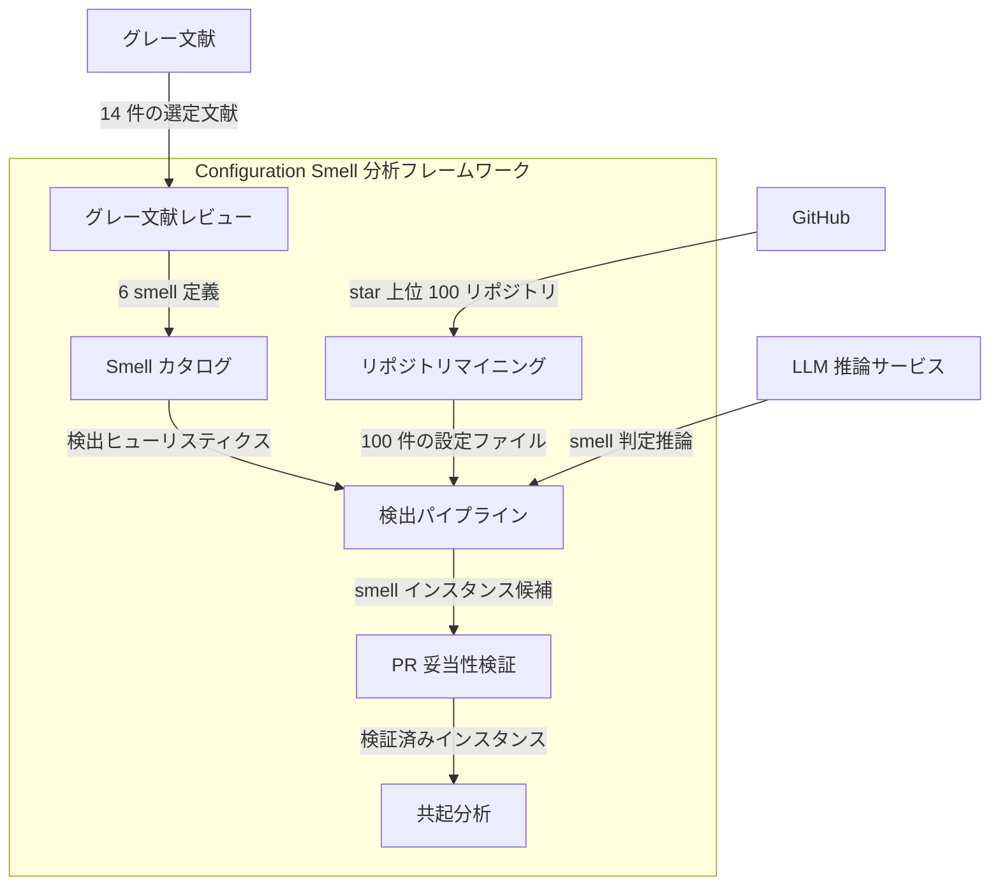
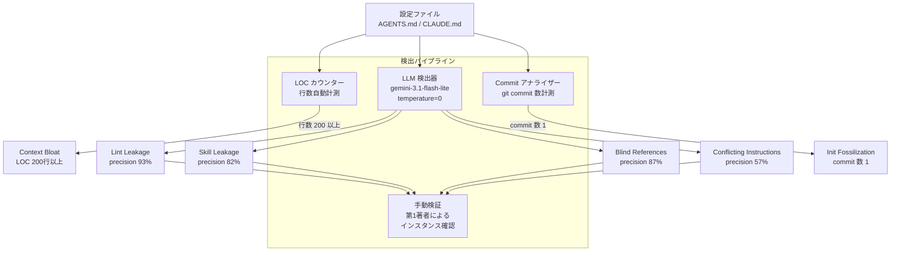
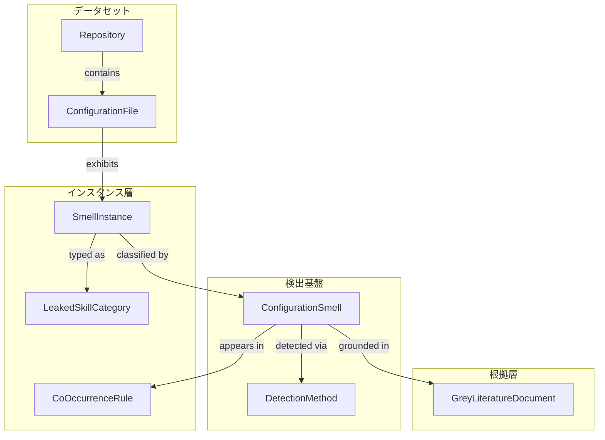
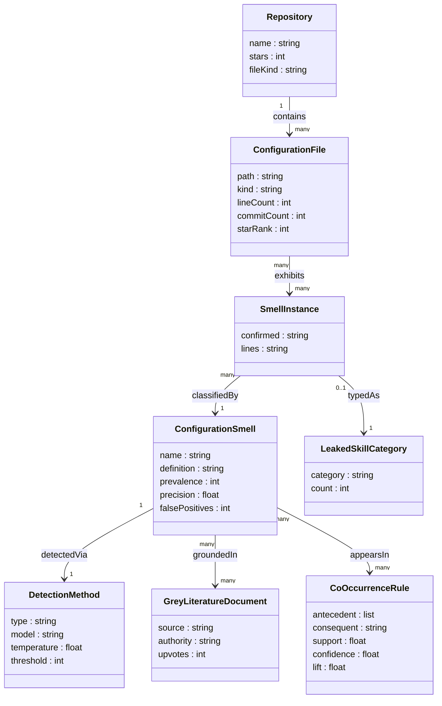

> 調査対象: 論文 **Configuration Smells in AGENTS.md Files: Common Mistakes in Configuring Coding Agents** (arXiv 2606.15828v1, 2026-06-14)
> 著者: Helio Victor F. dos Santos, Vitor Costa, João Eduardo Montandon, Luciana Lourdes Silva, Marco Túlio Valente
> レプリケーションパッケージ: https://doi.org/10.5281/zenodo.20600327

この論文は、コーディングエージェント向け設定ファイル (AGENTS.md / CLAUDE.md) の品質問題を 6 種類の **configuration smell (設定の設計臭)** として体系化した研究です。本記事は提案された方法論の論理構造・概念モデル・実務への適用案をまとめます。コード例・プロンプト・CI ワークフローは「実装案/例」であり、論文が提示したコードそのものではありません。

## 概要

本論文は、AGENTS.md / CLAUDE.md の不適切な記述パターンを **configuration smell** と命名し、6 種類のカタログを定義した研究です。

研究は二段構成です。まず、グレー文献レビュー (ブログ・Hacker News 記事等 532,000 件から 14 件を精選) によって smell の種類を確定しました。次に、GitHub の star 上位 100 リポジトリに対するマイニングで prevalence (出現率) を測定しました。

結果として、調査対象 100 ファイルのうち **91 ファイル (91%) が 1 つ以上の smell を含む**ことが明らかになりました。これは設定ファイルの品質管理が現場でほぼ手つかずであることを示します。

本論文の位置づけは、Dockerfile・GitLab CI/CD などの構成ファイルへのコードスメル研究の系譜を、コーディングエージェントの設定ファイルへ初めて適用した点にあります。単なる記述的分析にとどまらず、規範的な品質基準 (何が悪いか・どう直すか) を提示しています。

### 関連研究との比較

| 論文 | 対象 | 手法 | 主な貢献 | smell カタログ |
|---|---|---|---|---|
| Agent READMEs (2511.12884) | 大規模リポジトリ群のコンテキストファイル | マイニング + 内容分類 | コンテキストファイルに何が書かれているかを記述・類型化 | なし |
| On the Impact of AGENTS.md (2601.20404) | 複数リポジトリの PR をエージェント実行 | Codex / Claude を実行し時間・トークン比較 | AGENTS.md 存在で実行時間・出力トークンが削減されることを実証 | なし |
| Decoding Configuration of Claude Code (2511.09268) | Claude Code プロジェクト群 | 設定ファイルの構造・項目の実証分析 | アーキテクチャ定義・ツール使用方針など設定項目の類型を特定 | なし |
| Configuring Agentic AI Coding Tools (2602.14690) | エージェント設定リポジトリ群 | 設定メカニズムの分類 | AGENTS.md が相互運用可能な標準として機能すること、高度メカニズムの採用が限定的なことを提示 | なし |
| **本論文 (2606.15828)** | **100 リポジトリ (star 上位)** | **グレー文献レビュー + マイニング + LLM 検出** | **6 smell を定義し prevalence を測定、自動検出ヒューリスティックと remediation を提供** | **あり (6 種類)** |

先行研究は「何が書かれているか」または「効果があるか」を問いました。本論文は「何が問題か・どう直すか」という規範的問いを初めて提起し、smell カタログと自動検出手法を提供します。

## 特徴

- **6 種類の configuration smell カタログ**: Lint Leakage / Context Bloat / Skill Leakage / Conflicting Instructions / Init Fossilization / Blind References の 6 分類を定義します。出現率は最頻の Lint Leakage (62%) から Blind References (16%) まで分布します。
- **LLM ベース検出**: 4 種類の smell を gemini-3.1-flash-lite (temperature=0) で自動検出し、第一著者が手動検証します。Lint Leakage は precision 93%、Blind References は 87% を達成しました。
- **ルールベース検出**: Context Bloat は LOC 200 行以上、Init Fossilization は作成後の commit 数 1 という閾値で機械的に判定します。
- **91% 有病率**: 100 ファイル中 91 ファイルが少なくとも 1 つの smell を保有します。smell-free は 9 ファイルのみです。
- **共起分析**: Conflicting Instructions が存在するファイルは Context Bloat も伴う確率が 81% (lift 1.76) です。設定問題は単独でなく複合的に発生する傾向があります。
- **実例つき remediation**: 各 smell に悪例・良例のコード断片と修正ガイダンスを付与し、即実践可能な改善手順を提示します。
- **PR 分析による具体例補強**: 100 ファイルの commit (760 件) から PR (383 件) を辿り、関連 PR (17 件) のうち設定問題を議論する 2 件を具体例として利用します。検出結果全体の妥当性検証ではありません。

## 構造

本セクションでは、論文が提案する研究方法論を C4 モデルの 3 段階に読み替えて記述します。「システム」は smell 検出研究フレームワーク全体、「コンテナ」は方法論の主要コンポーネント、「コンポーネント」は検出パイプラインの内部構造を指します。

### システムコンテキスト図

Configuration Smell 分析フレームワークを中心に、関与するアクターと外部システムを示します。



#### 要素一覧

| 要素名 | 説明 |
|---|---|
| 設定ファイル作成者 | AGENTS.md / CLAUDE.md を作成・保守する開発者・メンテナー |
| Coding Agent | 設定ファイルを読み込んでタスクを実行する自律型 AI エージェント |
| 研究者・レビュアー | 分析結果を研究・実務に活用する利用者 |
| Configuration Smell 分析フレームワーク | smell の定義・検出・検証・分析を一貫して行う研究方法論全体 |
| GitHub 公開リポジトリ群 | star 上位 100 リポジトリを提供する外部コードホスティング基盤 |
| グレー文献 | ブログ記事・公式ガイド・HN スレッド等の非査読実践知識源 |
| LLM 推論サービス | Lint / Skill / Blind / Conflicting の各 smell を検出する外部推論基盤 |

### コンテナ図

フレームワークを構成する主要コンポーネントとデータの流れを示します。



#### グレー文献レビュー・カタログ

| 要素名 | 説明 |
|---|---|
| グレー文献レビュー | Google 検索で 532,000 件から 14 件を選定し smell を帰納する |
| Smell カタログ | 6 種の smell 定義とガイダンスをまとめた中核成果物 |

#### リポジトリマイニング

| 要素名 | 説明 |
|---|---|
| リポジトリマイニング | GitHub Search API で star 上位 100 件の設定ファイルを収集する |

#### 検出・検証・分析

| 要素名 | 説明 |
|---|---|
| 検出パイプライン | LOC 閾値・LLM プロンプト・commit 数の 3 手法で smell を自動検出する |
| PR 分析 | commit (760) から PR (383) を辿り、関連 PR (17) のうち設定問題を議論する 2 件を具体例として用いる |
| 共起分析 | アソシエーションルール分析で smell 間の共起パターンと lift 値を算出する |

### コンポーネント図

検出パイプライン内部の 3 サブシステムと、各 smell との対応を示します。



#### LOC カウンター

| 要素名 | 説明 |
|---|---|
| LOC カウンター | 設定ファイルの行数を自動計測し、200 行以上を Context Bloat として検出する |
| Context Bloat | トークン消費増と重要指示の埋没を招く過大な設定ファイルを指す |

#### LLM 検出器

| 要素名 | 説明 |
|---|---|
| LLM 検出器 | gemini-3.1-flash-lite (temperature=0) に smell 定義・ガイダンス・真陽性/偽陽性例を含むプロンプトを送り判定する |
| Lint Leakage | linter が既にカバーするルールの重複記載 (検出精度 93%) |
| Skill Leakage | 専用 skill ファイルへ切り出すべき専門的指示の混入 (検出精度 82%) |
| Blind References | 外部ドキュメント参照に目的・スコープの説明が欠落している状態 (検出精度 87%) |
| Conflicting Instructions | 同一成果物に関する矛盾した指示の共存 (検出精度 57%、偽陽性多数) |
| 手動検証 | 第1著者が LLM 検出候補を 1 件ずつ確認し真陽性のみを確定する |

#### Commit アナライザー

| 要素名 | 説明 |
|---|---|
| Commit アナライザー | git commit 数を計測し、作成後 1 件のみのファイルを Init Fossilization として検出する |
| Init Fossilization | 自動生成後に更新されず陳腐化した設定ファイルを指す |

## データ

論文が扱う概念をエンティティとしてモデル化します。

### 概念モデル

論文が操作する主要エンティティと所有・参照関係を示します。



#### 概念モデル 説明

| 要素名 | 説明 |
|---|---|
| Repository | GitHub 上の実プロジェクト。star 数上位 100 件から収集 |
| ConfigurationFile | Repository が持つ AGENTS.md または CLAUDE.md の実体 |
| ConfigurationSmell | 論文が定義した 6 種類の設定アンチパターン |
| DetectionMethod | 各 Smell を発見するための検出手法 (LOC 閾値 / LLM プロンプト / commit 解析) |
| SmellInstance | ConfigurationFile 内で実際に観察された Smell の個別事例 |
| LeakedSkillCategory | Skill Leakage インスタンスを分類するスキル種別 |
| CoOccurrenceRule | Smell 間の共起を表すアソシエーションルール |
| GreyLiteratureDocument | Smell 定義の根拠となったグレー文献 (ブログ・HN 記事等) |

### 情報モデル

各エンティティの主要属性と多重度を示します。



#### ConfigurationFile

| 属性 | 説明 | 値の例 |
|---|---|---|
| path | リポジトリルート相対パス | AGENTS.md / CLAUDE.md |
| kind | ファイル種別 | AGENTS.md (39 件) / CLAUDE.md (61 件) |
| lineCount | 行数 (Context Bloat 検出の基礎値) | 最大例: 1,477 行 |
| commitCount | git commit 総数 (Init Fossilization 検出の基礎値) | Init Fossilization 対象: 1 commit |
| starRank | star 上位 100 内の順位 | 1〜100 |

#### ConfigurationSmell

| 属性 | 説明 | 値の例 |
|---|---|---|
| name | Smell 名称 | Lint Leakage / Context Bloat 等 |
| definition | グレー文献から導いた操作的定義 | 文字列 |
| prevalence | 100 ファイル中の検出件数 | 62 (Lint Leakage) 〜 16 (Blind References) |
| precision | 手動検証後の適合率 | 0.57〜0.93 (LOC/commit 閾値は計測なし) |
| falsePositives | 誤検知件数 (LLM 検出のみ) | 2〜12 |

#### DetectionMethod

| 属性 | 説明 | 値の例 |
|---|---|---|
| type | 検出手法種別 | LOC閾値 / LLMプロンプト / commit解析 |
| model | 使用 LLM モデル名 | gemini-3.1-flash-lite |
| temperature | LLM 生成温度 | 0 (決定的出力) |
| threshold | 閾値 (LOC: 行数 / commit: 件数) | LOC=200 / commit=1 |

#### LeakedSkillCategory

| 属性 | 説明 | 値の例 |
|---|---|---|
| category | スキル種別名 | Testing / Workflow / Scaffolding / Infrastructure / Architecture |
| count | 該当 Skill Leakage インスタンス件数 | Testing=10, Workflow=8, Scaffolding=4, Infrastructure=4, Architecture=3 |

#### CoOccurrenceRule

| 属性 | 説明 | 値の例 |
|---|---|---|
| antecedent | 前件 (Smell 名のリスト) | Conflicting Instructions, Skill Leakage |
| consequent | 後件 (Smell 名) | Context Bloat |
| support | 全ファイル中で前件と後件が共起する割合 | 0.06 |
| confidence | 前件があるとき後件が現れる条件付き確率 | 0.83 |
| lift | ランダム共起との比 (1 超で正の相関) | 1.81 |

#### 6 smell の一覧 (prevalence 降順)

| Smell | 件数/100 | 偽陽性 | precision | 検出方法 |
|---|---|---|---|---|
| Lint Leakage | 62 | 4 | 93% | LLM + 手動 |
| Context Bloat | 42 | — | — | LOC 閾値 (200 行以上) |
| Skill Leakage | 35 | 6 | 82% | LLM + 手動 |
| Conflicting Instructions | 28 | 12 | 57% | LLM + 手動 |
| Init Fossilization | 24 | — | — | git commit 数 (1) |
| Blind References | 16 | 2 | 87% | LLM + 手動 |

#### 共起ルール (論文 Table IV 全 6 件)

| 前件 | 後件 | support | confidence | lift |
|---|---|---|---|---|
| Conflicting Instructions + Skill Leakage | Context Bloat | 0.06 | 0.83 | 1.81 |
| Init Fossilization + Skill Leakage | Lint Leakage | 0.06 | 0.83 | 1.31 |
| Conflicting Instructions | Context Bloat | 0.14 | 0.81 | 1.76 |
| Skill Leakage | Lint Leakage | 0.24 | 0.76 | 1.19 |
| Context Bloat + Skill Leakage | Lint Leakage | 0.10 | 0.75 | 1.18 |
| Conflicting Instructions + Lint Leakage | Context Bloat | 0.07 | 0.67 | 1.44 |

> 計 14 件のグレー文献を採用 (初期 532,000 件 → 上位 30 件 (最初の 3 ページ) を手動精査 → 16 件除外)。品質統制として 6 件は著名企業 (Anthropic, GitHub) 由来、8 件は経験豊富な著者、3 件は Hacker News 140+ upvote の文書が含まれます。

## 6 つの設定の設計臭

ここからは 6 分類を、定義・実例・改善 (Before/After) でまとめます。

### 構築方法: 検出環境の用意

> 本セクションのコード・プロンプト・スクリプトはすべて「実装案/例」です。論文 (arXiv 2606.15828) の方法論を実務に適用するための具体化であり、論文が提示したコードそのものではありません。論文由来の値 (200 行, temperature=0, gemini-3.1-flash-lite, commit=1) は出典を明示して使用します。

#### 検出パラメータ一覧

| パラメータ | 値 | 出典 |
|---|---|---|
| LLM モデル | gemini-3.1-flash-lite | 論文の検出手法節 |
| Temperature | 0 (決定的出力のため) | 論文の検出手法節 |
| Context Bloat 閾値 | 200 行以上 | 論文の Context Bloat 節 (Anthropic 推奨に基づく) |
| Init Fossilization 閾値 | 作成後の commit 数 = 1 | 論文の Init Fossilization 節 |
| 手動検証 | 各 LLM 出力を第一著者が手動確認 | 論文の検出手法節 |

#### Context Bloat 検出: 行数チェック

最も手軽なルールベース検出です。200 行以上であれば Context Bloat の疑いありと判定します。

```bash
#!/usr/bin/env bash
# context_bloat_check.sh - Context Bloat smell を行数で検出する実装案

THRESHOLD=200  # 論文の Context Bloat 節の閾値

for f in AGENTS.md CLAUDE.md .claude/agents/*.md; do
  [ -f "$f" ] || continue
  lines=$(wc -l < "$f")
  if [ "$lines" -ge "$THRESHOLD" ]; then
    echo "SMELL: Context Bloat  file=$f  lines=$lines  threshold=$THRESHOLD"
  else
    echo "OK: $f ($lines lines)"
  fi
done
```

> 論文の実例: javascript-obfuscator の CLAUDE.md は 1,477 行・27 セクションで、Key Features (難読化技法の解説) は README 向きの内容でした。

#### Init Fossilization 検出: commit 数チェック

設定ファイルの git commit 数が 1 のみである場合、`/init` 等で生成後に更新されていない疑いがあります。

```bash
#!/usr/bin/env bash
# init_fossilization_check.sh - Init Fossilization smell を commit 数で検出する実装案

for f in AGENTS.md CLAUDE.md; do
  [ -f "$f" ] || continue
  commit_count=$(git log --oneline --follow "$f" | wc -l)
  if [ "$commit_count" -eq 1 ]; then
    echo "SMELL: Init Fossilization  file=$f  commits=$commit_count"
    echo "  リポジトリ全体の commit 数: $(git rev-list --count HEAD)"
  else
    echo "OK: $f ($commit_count commits)"
  fi
done
```

> 論文の検証: Init Fossilization が検出されたリポジトリは活発に開発が続くプロジェクトであり、設定ファイルだけが放置されていることを確認しました。

#### LLM ベース検出: プロンプト実装案

論文は Lint Leakage / Skill Leakage / Blind References / Conflicting Instructions の 4 種類を gemini-3.1-flash-lite (temperature=0) で検出しました。論文が示すプロンプトテンプレートの構造は次のとおりです。

```text
[役割付与] You are a senior software engineer.

[タスク定義] 設定ファイル (AGENTS.md) を渡すので、次の configuration smell が含まれるか検出してください。

[Smell 定義] <smell_name>: <smell の説明>

[ガイドライン / True & False Positive 例]  ← Blind References, Conflicting Instructions のみ追加

[出力フォーマット]
検出された場合: 該当行 (または矛盾の文脈を含む JSON) を返す。
検出されない場合: NO SMELL とだけ返す。

# Agents.md file
<ファイル本文>
```

以下は Lint Leakage 検出プロンプトの実装案です。検出精度を再現するには論文と同じモデル・温度を使用してください。

```python
# lint_leakage_prompt.py - Lint Leakage 検出プロンプト実装案
LINT_LEAKAGE_PROMPT = """You are a senior software engineer.

I will provide an agent configuration file (AGENTS.md or CLAUDE.md).
Detect whether the file contains the following configuration smell.

Lint Leakage: The file contains rules already enforced by linters, formatters,
or static analysis tools (indentation, line length, import order, naming
conventions, docstring format). They are redundant because tools such as Ruff,
Black, Biome, or ESLint enforce them automatically.

If detected: return the exact lines that contain the redundant linting rules.
If not detected: return only: NO SMELL

# Agents.md file
{file_content}
"""
```

Blind References と Conflicting Instructions は、真陽性/偽陽性の例を付与した強化版プロンプトを使用します。

```python
# conflicting_instructions_prompt.py - 強化版プロンプト実装案 (抜粋)
CONFLICTING_INSTRUCTIONS_PROMPT = """You are a senior software engineer.

Conflicting Instructions: two or more instructions contradict each other,
leading to ambiguous agent behavior (contradictory directory paths for the same
artifact, conflicting naming conventions, mutually exclusive workflow steps).

True positive: "Place components in packages/ui/components" AND
  "Create a new folder in packages/components for new components"
False positive: "snake_case for Python files" AND "camelCase for JavaScript"
  (different languages, no contradiction)

If detected: return a JSON object {"conflict": ..., "line_a": ..., "line_b": ...}
If not detected: return only: NO SMELL

# Agents.md file
{file_content}
"""
```

検出スクリプトの呼び出し例です。モデル名は実行時に利用可能な ID を確認してください。なお SDK は `google-generativeai` (旧 SDK) と `google-genai` (新 SDK) で API が異なるため、使用するパッケージのバージョンに合わせて記法を確認してください。

```python
#!/usr/bin/env python3
# detect_smells.py - LLM ベース smell 検出を実行する実装案
# pip install google-generativeai
import google.generativeai as genai
import json, sys
from pathlib import Path

MODEL = "gemini-3.1-flash-lite"  # 論文の検出手法節で使用されたモデル
TEMPERATURE = 0  # 論文指定: 決定的出力

PROMPTS = {
    "lint_leakage": LINT_LEAKAGE_PROMPT,
    "conflicting_instructions": CONFLICTING_INSTRUCTIONS_PROMPT,
    # skill_leakage, blind_references も同様に定義する
}

def detect(file_path: str) -> dict:
    content = Path(file_path).read_text()
    model = genai.GenerativeModel(MODEL)
    results = {}
    for name, template in PROMPTS.items():
        prompt = template.format(file_content=content)
        resp = model.generate_content(
            prompt,
            generation_config=genai.GenerationConfig(temperature=TEMPERATURE),
        )
        results[name] = resp.text.strip()
    return results

if __name__ == "__main__":
    target = sys.argv[1] if len(sys.argv) > 1 else "CLAUDE.md"
    print(json.dumps(detect(target), ensure_ascii=False, indent=2))
```

### 利用方法: 検出結果を使った修正

#### 検出結果の読み方

| 出力 | 意味 | 対応 |
|---|---|---|
| `NO SMELL` | 対象 smell なし | 次の smell へ進む |
| 行テキスト (Lint/Skill/Blind) | 該当行 | 下記 Before/After を参考に修正 |
| JSON オブジェクト (Conflicting) | 矛盾のペア | 正規記述を 1 つに統合 |
| `SMELL: Context Bloat` (shell) | 200 行超過 | 専門セクションを skill ファイルへ分離 |
| `SMELL: Init Fossilization` (shell) | commit=1 | 現行プロジェクトの実態と照合し更新 |

#### Lint Leakage の修正 (Before / After)

**Before**: AGENTS.md にコードスタイルルールを直書きしている例 (google/adk-python の実例に基づく)。

```markdown
## Python Style Guide
- Use 2 spaces for indentation
- Maximum line length: 80 characters
- Use snake_case for functions and variables
- Use CamelCase for class names
- All public functions must have docstrings
```

**After**: フォーマット系は linter に委譲し、CLAUDE.md からは削除します。

```toml
# pyproject.toml (実装例)
[tool.ruff]
line-length = 80
indent-width = 2

[tool.ruff.lint]
select = ["E", "F", "I"]   # pycodestyle + pyflakes + isort
```

```yaml
# .pre-commit-config.yaml (実装例)
repos:
  - repo: https://github.com/astral-sh/ruff-pre-commit
    rev: v0.4.0   # 実装時は最新版を確認すること
    hooks:
      - id: ruff
      - id: ruff-format
```

CLAUDE.md には linter で表現できないアーキテクチャ制約・ドメインルール・安全ポリシーのみを残します。論文によれば、実例 google/adk-python の Python Style Guide は後にメンテナーが別 skill ファイルへリファクタしており、smell の妥当性が実証されたとされています。

#### Skill Leakage の修正 (Before / After)

**Before**: AGENTS.md にタスク固有の手順を直書きしている例 (quickemu-project/quickemu の実例に基づく)。

```markdown
## Adding a new OS to quickget
1. Add an entry to the os_info() case statement
2. Add a releases_<os>() function returning available versions
3. Add an editions_<os>() function if multiple editions exist
4. Add an arch_<os>() function if ARM64 is supported
5. Add the download URL construction logic
```

**After**: 専用の skill ファイルへ退避し、AGENTS.md にはファイルの存在と目的のみを記述します。

```markdown
<!-- AGENTS.md 修正後 -->
## Skill Files
When adding a new OS to quickget, follow the procedure in
`docs/skills/add-new-os.md`.
```

Claude Code であれば `.claude/skills/add-new-os/SKILL.md` 構造で退避します。Skill Leakage が多い場合は論文 Table III のカテゴリ (Testing / Workflow / Scaffolding / Infrastructure / Architecture) を参考に分類します。

#### Context Bloat の修正方針

**Before**: 1 ファイルに 200 行超の内容が混在している状態 (javascript-obfuscator の実例: 1,477 行)。

**After**: 150〜200 行以内に収め、専門知識は別ファイルへ退避する方針です。

```text
CLAUDE.md (目標: 150 行以内)
  - プロジェクト概要 (10 行)
  - ディレクトリ構成 (20 行)
  - 重要なアーキテクチャ制約 (30 行)
  - skill ファイルへの参照一覧 (10 行)

.claude/skills/obfuscation-options/SKILL.md
  - 難読化技法の詳細

docs/api-reference.md
  - API リファレンス全項目
```

分割の基準は、README 向けの機能説明・API 一覧・チュートリアルを CLAUDE.md に含めないことです。

#### Blind References の修正 (Before / After)

**Before**: パスや URL だけで目的を説明しない参照 (SuperClaude_Framework の実例に基づく)。

```markdown
See `docs/plugin-reorg.md` for details.
```

**After**: 目的・スコープ・使う場面を付与します (browser-use の良い例を参考にした実装案)。

```markdown
## 参照ドキュメント
`docs/plugin-reorg.md` — プラグインディレクトリの移行ガイド。
v5 以降の新規プラグインを追加する際、または既存プラグインのパスを変更する際に参照する。
移行前後のパス対応表と CI 設定の更新手順を含む。
```

論文が「良い例」として挙げる browser-use の参照スタイルは、URL に「何を提供し何を提供しないか・関連コードの場所」を併記する形式です。

#### Conflicting Instructions の修正 (Before / After)

**Before**: 同一成果物に対して 2 つの異なるパスを指定している状態 (inkline/inkline の実例に基づく)。

```markdown
## Component Guidelines
Components should be placed in the `packages/ui/components` directory.

## How to create a new component
Create a new folder in `packages/components` with the name of the component.
```

**After**: 正規のパスを 1 つに統合し、他の記述を削除します。

```markdown
## Component Structure
すべての新規コンポーネントは `packages/ui/components/<component-name>/` に配置する。
他のパス (`packages/components/` 等) は旧構造であり使用しない。
```

修正後は `grep` で旧パスの残存を確認します。

```bash
grep -rn "packages/components" CLAUDE.md AGENTS.md
```

## 運用

### 定期レビューのサイクル (Init Fossilization 対策)

論文は Init Fossilization を検出した 24 プロジェクトについて、活発に開発が続くプロジェクトでも設定ファイルの更新が放置されていることを確認しています。設定ファイルは作ったら終わりではなく、**生きたドキュメント**として維持する必要があります。

論文が示す更新トリガー (4 条件):

- エージェントが**同じミスを 2 回繰り返した**とき
- コードレビューで**設定のギャップが判明した**とき
- 開発者が**前セッションと同じ訂正を繰り返している**とき
- 新しいチームメンバーが**オンボーディングで同じ context を必要とする**とき

| タイミング | アクション |
|---|---|
| スプリント末 (2 週ごと) | エージェントの同じミス一覧をレビューし、再発ルールを追記 |
| 四半期ごと | ファイル全体を通読し、古くなったパス・ツール・アーキ前提を削除 |
| 大型リリース前後 | 新旧の差分を確認し、廃止セクションを退避または削除 |
| オンボーディング直後 | 新メンバーが「自分で調べた・修正した」内容を設定に反映 |

### CI への smell 検出組み込み (実装案)

論文は自動検出ヒューリスティクスを提案していますが、CI/CD パイプラインへの組み込みは論文の対象外です。以下は論文の検出手法を PR チェックとして展開する**実装案**です。

```yaml
# .github/workflows/agents-md-smell-check.yml (実装案)
name: AGENTS.md Smell Check

on:
  pull_request:
    paths:
      - 'AGENTS.md'
      - 'CLAUDE.md'
      - '.claude/**/*.md'

jobs:
  smell-check:
    runs-on: ubuntu-latest
    steps:
      - uses: actions/checkout@v4
        with:
          fetch-depth: 0  # git log に必要

      - name: Context Bloat check (deterministic)
        run: |
          for f in AGENTS.md CLAUDE.md; do
            [ -f "$f" ] || continue
            lines=$(wc -l < "$f")
            if [ "$lines" -ge 200 ]; then
              echo "::warning file=$f::Context Bloat の疑い ($lines 行 >= 200)"
            fi
          done

      - name: Init Fossilization check (deterministic)
        run: |
          for f in AGENTS.md CLAUDE.md; do
            [ -f "$f" ] || continue
            count=$(git log --oneline --follow "$f" | wc -l)
            if [ "$count" -le 1 ]; then
              echo "::warning file=$f::Init Fossilization の疑い (commit 数 = $count)"
            fi
          done
```

CI 組み込み時の注意点:

- LOC チェックと commit 数チェックは決定論的であり、自動 warn に使えます。
- LLM チェック (Lint Leakage・Skill Leakage・Blind References・Conflicting Instructions) は precision が 57〜93% であり、CI で自動 fail させると偽陽性が多発します。PR コメントへの情報出力にとどめ、マージ判断は人間が行う設計が現実的です。

### 共起の監視: 1 つ見つけたら他も疑う

論文のアソシエーションルール分析 (Table IV) と Upset 図 (Figure 13) は、smell が単独で発生するより**複合して発生する**ことを示しています。下表は両者を出所付きで併記します。

| 発見した smell | 疑うべき smell | 根拠 | 出所 |
|---|---|---|---|
| Conflicting Instructions + Skill Leakage | Context Bloat | confidence 83%, lift 1.81 (最強連関) | Table IV |
| Conflicting Instructions | Context Bloat | confidence 81%, lift 1.76 | Table IV |
| Lint Leakage + Context Bloat | 同時発生が最多 (12 件) | 頻出共起 | Figure 13 (Upset) |
| Skill Leakage + Lint Leakage | 同時発生 7 件 | 頻出共起 | Figure 13 (Upset) |
| Skill Leakage + Lint Leakage + Context Bloat | 同時発生 6 件 | 三重共起 | Figure 13 (Upset) |
| Lint Leakage + Init Fossilization | 同時発生 5 件 | 更新放置ファイルに lint ルールが蓄積 | Figure 13 (Upset) |

運用上の含意として、AGENTS.md で Lint Leakage を 1 件発見した場合、ファイル全体を Context Bloat・Skill Leakage の観点でも通読するとよいです。

## ベストプラクティス

### 「詳しく書くほど良い」の否定

論文の中心的メッセージは、設定ファイルは**小さく・的を絞って**保つことです。「詳しく書くほど良い」という直感は誤りであり、行数が増えるほどトークン消費が増えて重要な指示が埋没します (Context Bloat)。

| 分類 | AGENTS.md に書く | 書かない (退避・委譲) |
|---|---|---|
| アーキ制約 | ドメイン固有の構造ルール | フレームワークの標準パターン |
| コードスタイル | (書かない) | インデント・行長・命名規則 → linter |
| 禁止事項 | セキュリティ・安全ポリシー | 一般的なアンチパターン |
| 検証手順 | プロジェクト固有のコマンド | 標準的な `npm test` / `cargo test` |
| 専門手順 | (書かない) | OS 追加・複雑なワークフロー → skill ファイル |

Anthropic は CLAUDE.md を 200 行未満に保つことを推奨しており、論文はこの 200 行を Context Bloat 閾値として採用しています (論文中の PR 例では 150〜200 行程度が望ましいとされます)。

### skill ファイルへの分離 (Skill Leakage 対策)

論文が示す漏れた skill の種別 (Table III) と、分離先のファイル名の例です。

| 種別 | 件数 | 分離先ファイル名の例 |
|---|---|---|
| Testing | 10 | `testing-guidelines.md` |
| Workflow | 8 | `release-workflow.md` |
| Scaffolding | 4 | `component-scaffolding.md` |
| Infrastructure | 4 | `infra-setup.md` |
| Architecture | 3 | `architecture-decisions.md` |

分離の判断基準は「この指示は全タスクに関係するか」です。NO なら skill ファイルへ退避します。Claude Code の `.claude/skills/<name>/SKILL.md` 構造はこのベストプラクティスの実践例です。AGENTS.md / CLAUDE.md は横断的コンテキスト (ブランドルール・安全ポリシー・ディレクトリ構造) に絞り、手順的な指示は skill ファイルに切り出します。6 smell のカタログを人間が管理するレビューチェックリストとして保持するのも一案です。

### linter/formatter への委譲 (Lint Leakage 対策)

論文は「Biome・ESLint・Ruff などの linter/formatter はスタイルルールをより速く・安く・100% の一貫性で強制する」と指摘します。設定ファイルに linter が既にカバーするルールを書くことは、エージェントの注意資源を消費するだけです。

| ルール種別 | 委譲先ツール |
|---|---|
| Python: インデント・行長・命名規則・docstring | Ruff / Black / mypy |
| JavaScript/TypeScript: フォーマット・import 順 | Biome / ESLint / Prettier |
| Rust: 命名・フォーマット | rustfmt / clippy |
| 共通: 末尾空白・改行コード・BOM | EditorConfig + pre-commit |

残すものは、linter が強制できないアーキテクチャ上の意思決定 (「このレイヤーは DB に直接触れない」等) です。

### 参照に文脈を付ける (Blind References 対策)

論文は「パスだけ書いてもエージェントは無視することが多い。なぜ・いつ読むべきかを伝えなければならない」と指摘します。文脈付き参照のチェックリストは次のとおりです。

- 参照先が**何を提供するか** (目的)
- 参照先が**何を提供しないか** (スコープ外)
- **いつ・どのタスクで**読むべきか
- 関連するコードの場所 (ある場合)

## トラブルシューティング

| 症状 | 想定原因 smell | 対処 |
|---|---|---|
| エージェントが設定の指示を無視する | Context Bloat / Blind References | ファイルを 200 行未満に削減して重要指示を先頭に移動する。参照には目的・スコープ・タスク文脈を付与する |
| エージェントの挙動が実行ごとに不安定・矛盾する | Conflicting Instructions | ファイル全体を通読し、同じ成果物に関するパス・ルール・手順の矛盾を洗い出す。用語とパスをセクション横断で統一する |
| 設定を書いたのに効果がない・古い挙動のまま | Init Fossilization | git log でファイルの commit 数を確認する。commit が 1 件であれば init 生成のまま放置の疑い |
| 特定タスクの専門指示が毎セッションのノイズになる | Skill Leakage | 種別ごとに skill ファイルへ切り出す。AGENTS.md 本体には横断ルールのみ残す |
| linter が指摘することをエージェントも注意してくる | Lint Leakage | linter/formatter で強制可能なルールを AGENTS.md から削除する。pre-commit・CI への委譲に切り替える |
| 1 つ直したのに他にも問題が次々出てくる | 共起 (Lint Leakage と Context Bloat / Skill Leakage は同時発生が多い) | Lint Leakage 発見後はファイル全体を Context Bloat・Skill Leakage の観点でも通読する |

## 反証・限界

論文の知見を実務に適用するとき、以下の限界を念頭に置く必要があります。

### LLM 検出の precision ばらつき: 人手検証が前提

| Smell | Precision | 偽陽性数 | 実務上の扱い |
|---|---|---|---|
| Lint Leakage | 93% | 4 件 | 比較的信頼できるが完全ではない |
| Blind References | 87% | 2 件 | 実用的な精度 |
| Skill Leakage | 82% | 6 件 | 参考程度に扱う |
| Conflicting Instructions | 57% | 12 件 | 信頼性が低い。CI 自動判定に使うべきでない |

検出結果はすべて人手検証を前提として扱うべきです。特に Conflicting Instructions (precision 57%) は、自動検出の結果だけで「矛盾がある」と判断すると半数近くが偽陽性です。

なお論文は precision のみを報告し、**recall (実際に smell があるファイルのうち検出できた割合) は計測していません**。precision が高くても recall が低い場合は smell を見逃す可能性があり、スキャン結果が「クリーン」でも安全とは言い切れません。

### 閾値の恣意性

- **200 行閾値 (Context Bloat)**: Anthropic の推奨に基づく保守的な値です。プロジェクト規模・言語・チーム構成によっては適切な上限が異なる可能性があります。
- **commit 数 1 (Init Fossilization)**: 保守的な閾値であり、2 件以上でも実質的に陳腐化している可能性を排除しません。

### グレー文献レビューのバイアス

Google 検索の上位ページに依存しており、検索アルゴリズムや言語 (英語のみ) による選択バイアスがあります。非英語圏のベストプラクティスや、検索上位に出ない実務知見は捕捉されていません。

### LLM 非決定性による再現性の問題

論文は temperature=0 で再現性を高めていますが、モデル更新で同じプロンプトの結果が変わる可能性があります。検出ツールを自製する場合は、使用モデルのバージョンを固定し、定期的に再検証する運用が必要です。

### サンプルバイアス (star 上位 100 リポジトリ)

分析対象は GitHub star 上位の著名 OSS です。小規模・非公開・業務システムでの出現率や種別分布は異なる可能性があります。「91% が 1 つ以上の smell を持つ」という数値を自プロジェクトへ直接適用するのは慎重に行ってください。

## まとめ

本論文は AGENTS.md / CLAUDE.md を「設計資産」として捉え、6 種類の設定の設計臭 (Lint Leakage / Context Bloat / Skill Leakage / Conflicting Instructions / Init Fossilization / Blind References) を定義し、star 上位 100 リポジトリの 91% が 1 つ以上の smell を抱えることを示しました。実務では「詳しく書くほど良い」を捨て、フォーマット系は linter へ、専門手順は skill ファイルへ切り出し、参照には文脈を付け、設定を生きたドキュメントとして定期レビューすることが要点です。

この記事が少しでも参考になった、あるいは改善点などがあれば、ぜひリアクションやコメント、SNSでのシェアをいただけると励みになります！

## 参考リンク

- 一次論文 (本フレームワーク)
  - [Configuration Smells in AGENTS.md Files (HTML)](https://arxiv.org/html/2606.15828)
  - [Configuration Smells in AGENTS.md Files (abstract)](https://arxiv.org/abs/2606.15828)
  - [レプリケーションパッケージ (Zenodo)](https://doi.org/10.5281/zenodo.20600327)
- 関連学術論文 (系譜)
  - [Agent READMEs: An Empirical Study of Context Files for Agentic Coding (2511.12884)](https://arxiv.org/abs/2511.12884)
  - [On the Impact of AGENTS.md Files on the Efficiency of AI Coding Agents (2601.20404)](https://arxiv.org/abs/2601.20404)
  - [Decoding the Configuration of AI Coding Agents: Insights from Claude Code Projects (2511.09268)](https://arxiv.org/abs/2511.09268)
  - [Configuring Agentic AI Coding Tools: An Exploratory Study (2602.14690)](https://arxiv.org/abs/2602.14690)
- 関連ツール・プラットフォーム公式
  - [Ruff (Python linter/formatter)](https://github.com/astral-sh/ruff)
  - [Biome (JS/TS toolchain)](https://biomejs.dev/)
  - [pre-commit](https://pre-commit.com/)
  - [Claude Code documentation](https://docs.anthropic.com/en/docs/claude-code)
- 実例リポジトリ
  - [google/adk-python](https://github.com/google/adk-python) — Lint Leakage の実例
  - [browser-use/browser-use](https://github.com/browser-use/browser-use) — Blind References の良い例
  - [quickemu-project/quickemu](https://github.com/quickemu-project/quickemu) — Skill Leakage の実例
  - [inkline/inkline](https://github.com/inkline/inkline) — Conflicting Instructions の実例
  - [javascript-obfuscator/javascript-obfuscator](https://github.com/javascript-obfuscator/javascript-obfuscator) — Context Bloat の実例
  - [SuperClaude-Org/SuperClaude_Framework](https://github.com/SuperClaude-Org/SuperClaude_Framework) — Blind References の悪い例
