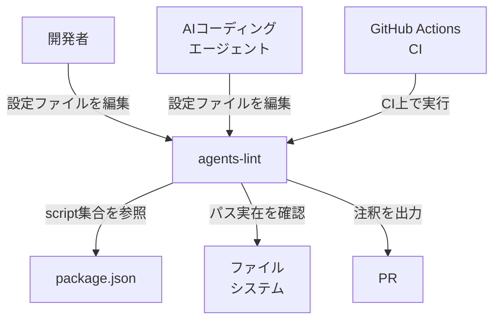
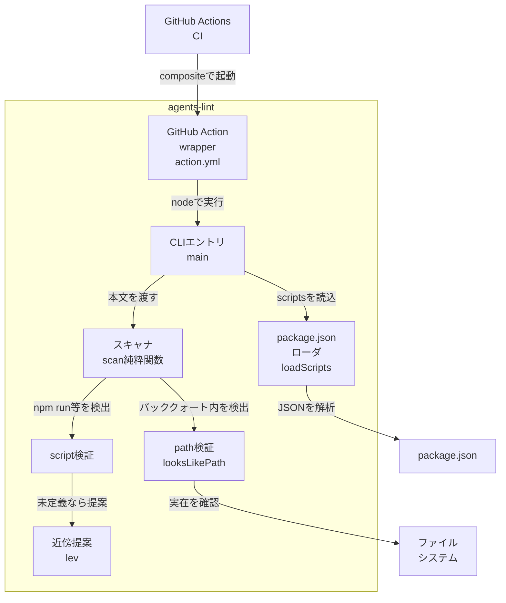
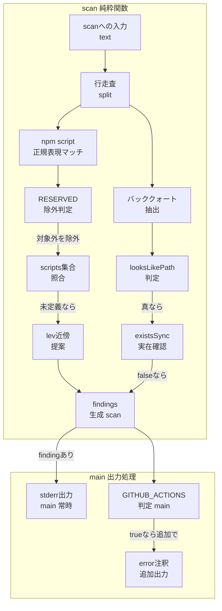
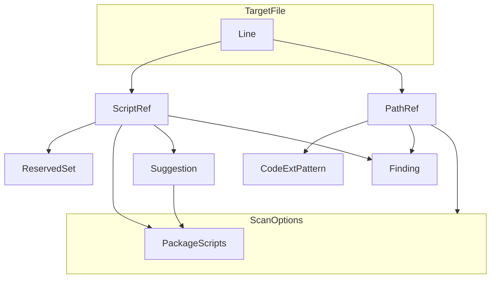
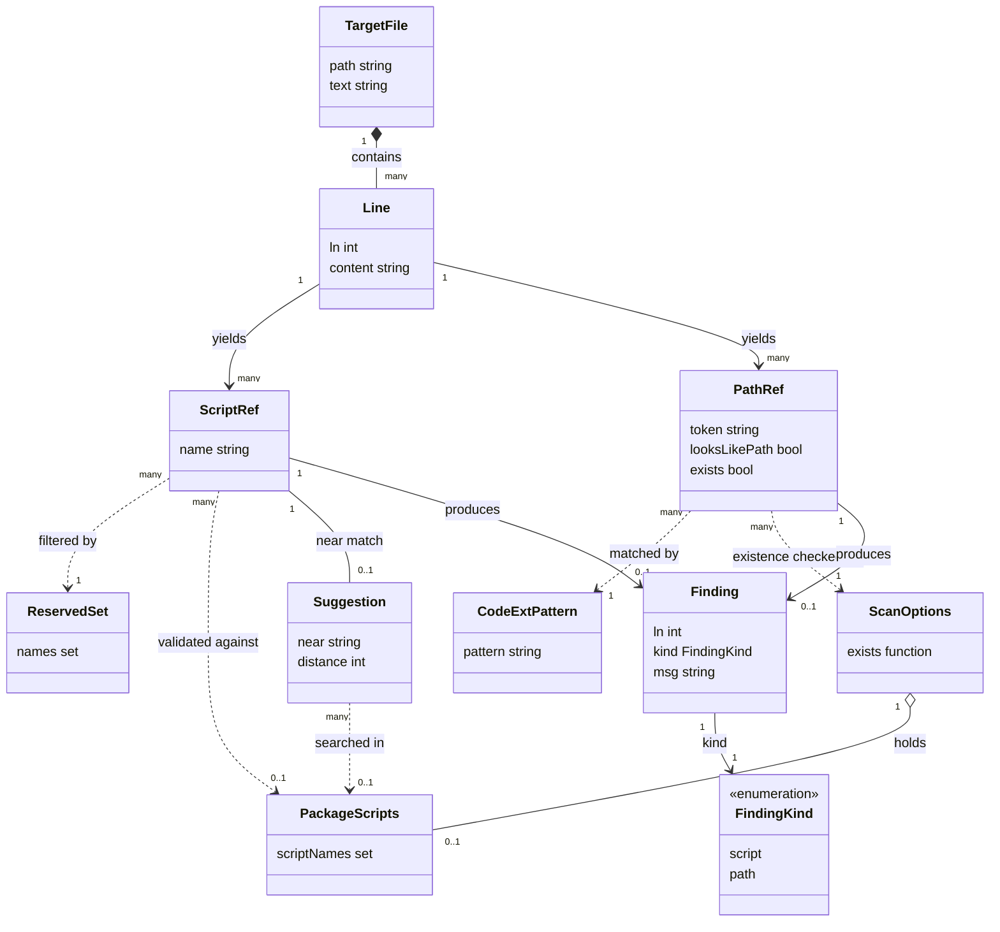

`hyuga611/agents-lint` は、`AGENTS.md` / `llms.txt` / `CLAUDE.md` などの AI エージェント向け設定ファイルの **参照整合性（reference integrity）** を CI で検証するリンタです。文体や表記ではなく、「もう存在しないコマンド・スクリプト・パスを指していないか」という **事実** だけを検査します。本記事は、起点記事（Zenn: [agents-lint-reference-integrity](https://zenn.dev/maronsan/articles/agents-lint-reference-integrity)）とリポジトリのソースコード（`src/check.mjs` ほか）を一次情報として構造・データ・構築・利用・運用を整理します。

> **同名の別ツールに注意**: npm レジストリで公開されている `agents-lint`（[giacomo/agents-lint](https://github.com/giacomo/agents-lint)、TypeScript 製）は本記事の対象とは **別物** です。本記事の対象は `hyuga611/agents-lint`（JavaScript, 依存ゼロ, 132 行）です。両者は名前が同じでも実装・配布経路が異なります（後述）。

> **調査時点**: 2026-07-19 / 対象 commit `0bf2938`（`main`）。本文の行数・出力例・ソース引用はこの時点のものです。`main` は更新されるため、厳密に再現するときは同 commit を参照してください。

この記事で独自に検証して分かった注意点が 2 つあります。本文の該当箇所で詳述します。

- **npm の `agents-lint` は別プロジェクト**（`giacomo/agents-lint`）。`npx agents-lint` と打つと調査対象ではない別ツールが動きます。
- **bin symlink 経由の起動では何も検査せず `exit 0`**（サイレント成功）。CI ゲートを謳うツールなのに沈黙して通るため、`git clone` 直実行か GitHub Action での運用が確実です。

## 概要

### agents-lint とは

`hyuga611/agents-lint` は、AI コーディングエージェント向け設定ファイルを検査するリンタです。

| 項目 | 内容 |
|---|---|
| 言語 | JavaScript（ESM, `.mjs`） |
| 依存 | ゼロ（Node.js `node:` 組み込みモジュールのみ） |
| 本体 | `src/check.mjs` 1 ファイル・132 行 |
| 配布形態 | composite 型 GitHub Action（`action.yml`）+ CLI（`src/check.mjs`） |
| ライセンス | MIT |

GitHub 上の説明文は次のとおりです。

> Reference-integrity linter for AGENTS.md and llms.txt. Catch commands, scripts, and paths that no longer exist. Runs in CI.

### 何を解決するツールか

AI コーディングエージェントは、`AGENTS.md` に書かれたコマンドやパスの記述を **そのまま信じて実行** します。しかし、リポジトリは変化し続けます。

- npm script をリネームする
- ファイルを移動・削除する
- ディレクトリ構成を変える

この結果、`AGENTS.md` の記述だけが古いまま取り残されます。この状態を「参照腐敗（stale reference）」と呼びます。参照腐敗が起きると、エージェントは古い指示を信じて **正しいコードに対して誤った操作を再現可能に実行** します。

agents-lint は、この参照腐敗を CI で機械的に検出します。

- `npm run build` のような記述 → `package.json` の `scripts` に実在するか検査
- `` `src/parser.ts` `` のようなパス記述 → ファイルシステム上に実在するか検査

存在しない参照が 1 件でもあれば、exit code 1 で CI を失敗させます。

### 設計思想: 「事実」を検査し、「文体」は見ない

agents-lint の設計思想は一貫しています。

- 検査対象は **事実**（参照先が実在するか）のみ
- 表記ゆれ・文法・語調・読みやすさは検査しない

この割り切りにより、実装は依存ゼロ・132 行という小さなコードで完結しています。言語非依存であり、英語で記述が密になりがちなリポジトリでもそのまま機能します。

裏を返すと、次のような「意味的腐敗」は検知できません。

- コマンドやパスは実在するが、**指す内容が変わってしまった** 場合
- 例: `npm run build` は今も存在するが、ビルド対象が変わり実際には lint しか走らない

agents-lint が検知できるのは、あくまで **構文的な存在確認（syntactic existence check）** に限られます（深掘り論点は「ベストプラクティス」参照）。

### AGENTS.md 標準と agents-lint の位置づけ

`AGENTS.md` は、AI コーディングエージェント向けの指示を書くための、Markdown ベースのオープンフォーマットです。特定の必須構造を持たず、実質的に「エージェント向けの README」として機能します。公式サイト（agents.md）によれば、現在は Linux Foundation 傘下の Agentic AI Foundation が stewarding し、6 万以上の OSS プロジェクトで使われています。読み込み対象とするエージェントには OpenAI Codex、Cursor、Gemini CLI、GitHub Copilot、Jules、Aider などがあります。

> **Claude Code は AGENTS.md を既定では読みません。** Claude Code が読むのは `CLAUDE.md` です（AGENTS.md を使う場合は `CLAUDE.md` からの `@AGENTS.md` import か symlink が必要）。agents-lint は `AGENTS.md` / `llms.txt` に加えて `CLAUDE.md` も検査対象に含むため、Claude Code 系の運用でも参照整合性チェックの恩恵を受けられます。

ファイル自体が持つ制約は緩いため、記述内容の正しさを保証する仕組みは別途必要になります。agents-lint は、この「記述内容の正しさ」のうち **参照の実在性** だけを担う専用ツールです。

既存の Markdown 系リンタは、いずれも「参照が実在するか」を主目的にしていません。

| ツール | 主目的 |
|---|---|
| textlint | 自然言語の校正（文法・表記ゆれ・読みやすさ） |
| markdownlint | Markdown 構文・記法の一貫性チェック |
| markdown-link-check | URL / リンクの到達可能性チェック（dead link 検出） |
| agents-lint | npm script・ファイルパス参照の実在性チェック |

markdown-link-check は「リンク切れ」を見る点で agents-lint に近い発想です。ただし対象が URL / Markdown リンクに限られ、`npm run <script>` のようなコマンド参照や、バッククォート中のファイルパス参照までは検査しません。agents-lint は、この隙間（コマンド参照・パス参照の実在性）を埋めるツールです。

### 他ツールとの比較表

| 項目 | agents-lint | textlint | markdownlint | markdown-link-check |
|---|---|---|---|---|
| 検査対象 | 参照整合性（コマンド・パス） | 文体・表記 | Markdown 構文 | リンクの到達可能性 |
| 依存 | ゼロ（Node 組み込みのみ） | プラグイン群に依存 | 単体ライブラリ | 単体ライブラリ + HTTP リクエスト |
| 言語非依存性 | 高い（`/` を含むパスは拡張子非依存で検査。裸のファイル名は既定の拡張子集合が対象） | 低い（自然言語ルール中心） | 中（Markdown 構文が対象） | 高い（リンク文字列のみ見る） |
| CI 組み込み | GitHub Action 同梱、PR インライン注釈対応 | 別途 CI 設定が必要 | 別途 CI 設定が必要 | 別途 CI 設定が必要 |
| 意味的腐敗の検知 | 不可（存在確認のみ） | 対象外 | 対象外 | 不可（URL の 200/404 のみ） |

#### ユースケース別の推奨

| やりたいこと | 推奨ツール |
|---|---|
| AGENTS.md / CLAUDE.md のコマンド・パスが最新か確認したい | agents-lint |
| 記事・ドキュメントの文章表現を整えたい | textlint |
| Markdown の見出し・リスト記法を統一したい | markdownlint |
| ドキュメント中の外部リンク切れを防ぎたい | markdown-link-check |
| AGENTS.md の品質を多面的に担保したい | 上記を併用（agents-lint は他ツールの代替ではなく補完） |

## 特徴

| 特徴 | 内容 |
|---|---|
| zero-dep | Node.js `node:` 組み込みモジュールのみで動作。外部パッケージ依存なし |
| 言語非依存 | 検査対象言語を問わない。`/` を含むパスは拡張子非依存で認識し、裸のファイル名は既定の拡張子集合に一致するものを検査する |
| GitHub Action + PR インライン注釈 | composite Action 同梱。`GITHUB_ACTIONS=true` 環境では `::error file=...,line=...::...` を出力し PR 行に注釈表示 |
| npm script 存在検査 | `npm run` / `pnpm run` / `yarn run` / `bun run` / `pnpm <script>` / `yarn <script>` の記述を `package.json` の `scripts` と突合 |
| パス実在検査 | バッククォートで囲まれたトークンのうち、パスらしき文字列をファイルシステムの実在確認にかける |
| Levenshtein 近傍提案 | script 名が見つからない場合、編集距離 2 以内の近い名前があれば「〜では？」と提案 |
| RESERVED サブコマンド除外 | package.json 定義なしで動く組み込みサブコマンドは誤検出しないよう除外。全 15 語: `install` / `i` / `ci` / `add` / `remove` / `rm` / `up` / `update` / `exec` / `dlx` / `create` / `init` / `link` / `publish` / `pack` |
| exit code CI gate | 参照エラー 1 件以上で exit 1。CI を確実に失敗させる |
| パス解決は cwd 基準 | 実在判定は `existsSync(resolve(process.cwd(), p))`。参照パスは検査対象ファイルの設置場所ではなく、コマンドの実行時カレントディレクトリ基準で解決される |

## 構造

hyuga611/agents-lint の構造を C4 model の 3 段階で整理します。

### システムコンテキスト図

agents-lint を中心に、利用者と外部システムとの関係を示します。



| 要素 | 説明 |
|---|---|
| 開発者 | AGENTS.md / llms.txt / CLAUDE.md を人手で編集する利用者 |
| AIコーディングエージェント | 同じ設定ファイルを編集・参照する自動化主体 |
| agents-lint | 参照整合性を検査する本体システム |
| GitHub Actions CI | PR ごとに agents-lint を起動する実行基盤 |
| package.json | npm script 定義の照合先 |
| ファイルシステム | 参照パスの実在確認先 |
| PR | 検査結果のインライン注釈が表示される場所 |

### コンテナ図

agents-lint 内部を構成要素単位に分解します。



| 要素 | 説明 |
|---|---|
| GitHub Action wrapper | action.yml。composite step として CLI を起動する薄いラッパー |
| CLIエントリ | main 関数。対象ファイルの決定と出力・exit code を担う |
| package.jsonローダ | loadScripts。package.json の scripts キー集合を読み込む |
| スキャナ | scan 純粋関数。本文を行単位で走査し検査を統括する |
| script検証 | npm run 等の記述を package.json の scripts と照合する処理 |
| path検証 | looksLikePath。バッククォート内トークンがパス表記かを判定する処理 |
| 近傍提案 | lev（Levenshtein 距離）で似た script 名を提案する処理 |

### コンポーネント図

`scan` 関数内部の検査フローと、呼び出し元 `main` の出力フローを詳細化します。`scan` は行走査で findings を生成し、`main` がその findings をファイル単位で出力します。



#### scan 純粋関数

| 要素 | 説明 |
|---|---|
| 行走査 | 本文を改行で分割し 1 行ずつ処理する起点 |
| npm script正規表現マッチ | npm run / pnpm run 等の呼び出し記述を検出する |
| RESERVED除外判定 | install や ci 等の組み込みサブコマンドを対象から外す |
| scripts集合照合 | 検出した script 名が package.json の scripts キーに存在するか照合する |
| lev近傍提案 | 未定義の script 名に対し Levenshtein 距離 2 以内の候補を提案する |
| バッククォート抽出 | 行内のバッククォート囲みトークンを取り出す |
| looksLikePath判定 | 取り出したトークンがパス表記らしいかを判定する |
| existsSync実在確認 | パスらしいトークンがファイルシステム上に実在するかを確認する |
| findings生成 | 検出した不整合を行番号とメッセージ付きで蓄積する |

#### main 出力処理

| 要素 | 説明 |
|---|---|
| stderr出力 | finding があれば通常の検査結果メッセージ（`✗ <file> — <n> 件` と行）を stderr に **常時** 出す |
| GITHUB_ACTIONS判定 | 実行環境が GitHub Actions かどうかを判定する |
| error注釈出力 | GitHub Actions のときだけ、stderr 出力に **加えて** ::error 形式の workflow command を stdout に出し PR にインライン注釈する |

## データ

agents-lint が `src/check.mjs` の `scan()` / `main()` 内で扱うエンティティを、コード（正規表現・データ構造・分岐条件）から抽出してモデル化します。

### 概念モデル

検査対象ドキュメント（`TargetFile`）が保持する行（`Line`）から、2 種類の参照（`ScriptRef` / `PathRef`）を抽出します。各参照は、実行時コンテキスト（`ScanOptions` が保持する `PackageScripts`）や定数（`ReservedSet` / `CodeExtPattern`）と照合され、不整合があれば `Finding` を生みます。`ScriptRef` の不整合には近傍名の `Suggestion` が付くことがあります。



| 要素 | 説明 |
|---|---|
| TargetFile | 検査対象ファイル。Line を所有する（1 ファイル = 複数行） |
| Line | 本文の 1 行。ScriptRef と PathRef を抽出する起点 |
| ScriptRef | npm script 参照トークン。ReservedSet で除外判定し PackageScripts に照合 |
| PathRef | バッククォートパス参照トークン。CodeExtPattern で判定し実在確認 |
| ScanOptions | scan の実行時オプション。PackageScripts と実在判定機能を保持 |
| PackageScripts | package.json の scripts キー集合（nullable な Set。コンテナは 0..1、要素数は 0..N） |
| ReservedSet | 組み込みサブコマンドの除外集合 |
| CodeExtPattern | パス判定に使うコード拡張子パターン |
| Suggestion | 近傍 script 名の提案（lev 距離 2 以内のときのみ） |
| Finding | 検出した不整合。整合していれば生成されない |

### 情報モデル



#### 属性の意味（NULL / 空許容の区別）

| エンティティ.属性 | NULL / 空の意味 |
|---|---|
| `PackageScripts`（ScanOptions 経由, 0..1） | インスタンスが存在しない（null）= package.json が無い / JSON parse 失敗 → `ScriptRef` の照合そのものを skip（finding を出さない、「存在しない script」として誤検出しない）。`scripts:{}`（空）のときは null ではなく空 Set になり、全 script 参照が「未定義」判定になる点に注意 |
| `Finding[]`（TargetFile あたり） | 空配列 = 参照整合 OK（エラーではなく正常系の終端状態） |
| `Finding.kind` | enum `['script', 'path']` の 2 値のみ、null 不可 |
| `PathRef.looksLikePath` | false のトークンは `PathRef` として以降のパス実在チェック対象にならない（単なる語・URL・glob・`#`/`@` 始まりを除外） |
| `Suggestion`（ScriptRef あたり, 0..1） | 該当なし = 最近傍語との lev 距離が 2 を超える、または `PackageScripts` が null / 空 → ヒント文字列なしの `Finding.msg` になる |

## 構築方法

### 前提条件

- Node.js（ESM `.mjs` 実行に対応するバージョン）
- 依存ライブラリはゼロです。`node:fs` / `node:path` / `node:url` の組み込みモジュールのみで動作します。`npm install` によるパッケージ導入は不要です。

### 導入手段

配布経路は 3 つの実行パターンに整理して理解すると混乱しません。

| 実行パターン | 何が動くか | 判定 |
|---|---|---|
| `npx agents-lint` | npm 公開済みの **別プロジェクト** `giacomo/agents-lint`（TypeScript 版） | 調査対象ではない別ツールが動く。`hyuga611` 版を使う意図なら誤り |
| `hyuga611` 版を npm bin 経由で起動（`npx github:hyuga611/agents-lint` 等） | `hyuga611` 版だが **何も検査せず `exit 0`**（後述のバグ） | サイレント成功。使わない |
| `git clone` → `node src/check.mjs` / GitHub Action | `hyuga611` 版が正しく動作 | 推奨 |

> **`hyuga611` 版を npm bin 経由で起動すると何も検査せず `exit 0` になります（サイレント成功）。** `src/check.mjs` 末尾の CLI 起動ガードは `import.meta.url === pathToFileURL(process.argv[1]).href` で「直接実行かどうか」を判定します。npm の `bin`（`agents-lint` → `src/check.mjs`）は symlink で作られるため、symlink 越しに起動すると `process.argv[1]`（symlink パス）と `import.meta.url`（実体パス）が一致せず、`main()` が呼ばれません。手元の検証（macOS / Node v22 / npm bin symlink）では、symlink 経由 = 出力なし・`exit 0`、`node <file>` 直接実行 = 検出あり・`exit 1` でした。参照整合性を保証するはずのツールが「沈黙して成功」する重大な運用リスクなので、`git clone` + `node src/check.mjs` か GitHub Action（`node "$GITHUB_ACTION_PATH/src/check.mjs"` の直接パス実行）を使ってください。
>
> なお同名で npm 公開されている `agents-lint`（`npx agents-lint` で解決される名前）は別プロジェクト `giacomo/agents-lint` です。両者を取り違えないよう注意してください。

| 手段 | コマンド / 設定 | 前提 |
|---|---|---|
| GitHub Action（推奨） | `uses: hyuga611/agents-lint@main` または fork した `<owner>/agents-lint@<ref>` | ワークフロー内で `actions/checkout` 済みであること。README のサンプルは汎用プレースホルダ `<you>/agents-lint@v1`。公開リポジトリ直下に `action.yml` があるため `hyuga611/agents-lint@main` を直接参照できます（バージョン固定したいなら fork か commit SHA 指定） |
| リポジトリ直参照（CLI, 推奨） | `git clone` → `node src/check.mjs` | リポジトリを clone 済みであること |

リポジトリを直接使う場合の手順です。

```bash
git clone https://github.com/hyuga611/agents-lint.git
cd agents-lint
node src/check.mjs
```

ビルドステップはありません。`src/check.mjs` 単体がソースの全体（132 行）であり、コンパイル・バンドルは行いません。

## 利用方法

### 入力・挙動

| 状況 | 挙動 |
|---|---|
| 引数省略 | cwd 直下で `AGENTS.md` / `llms.txt` / `CLAUDE.md` を `existsSync` で自動検出し、存在するものだけ検査 |
| ファイルをパスで指定 | 指定したファイルのみ検査（自動検出は行わない） |
| package.json が存在し `scripts` を持つ | `npm run <script>` 等の参照を検証（スクリプト検証 ON） |
| package.json が無い / 読めない | スクリプト参照の検証をスキップ（パス参照の検証は継続） |

**引数はファイルパスのみです。** フラグ（`--fix` 等のオプション）は存在しません。設定ファイルも持ちません。

### CLI

```bash
# 引数省略: AGENTS.md / llms.txt / CLAUDE.md を自動検出
node src/check.mjs

# ファイルを明示指定（複数可）
node src/check.mjs docs/AGENTS.md llms.txt
```

> `hyuga611` 版を npm bin 経由で起動すると前述の symlink 問題で何も検査せず exit 0 になります。ローカル実行は `node src/check.mjs` の直接パス実行を使ってください（`npx agents-lint` は別プロジェクト `giacomo/agents-lint` が動きます）。

### GitHub Action

`action.yml`（composite action）の全文です。

```yaml
name: 'agents-lint'
description: 'Fail CI when your AGENTS.md / llms.txt points at commands, scripts, or paths that no longer exist.'
author: 'agents-lint'
branding:
  icon: 'check-circle'
  color: 'green'
inputs:
  files:
    description: 'Space-separated files to check. Default: auto-detect AGENTS.md / llms.txt / CLAUDE.md at the repo root.'
    required: false
    default: ''
runs:
  using: 'composite'
  steps:
    - name: Run agents-lint
      shell: bash
      # Pass the caller input via env (NOT ${{ }} expanded into the script) to avoid
      # GitHub Actions template/shell injection. $FILES is intentionally unquoted so
      # multiple space-separated filenames split into separate argv.
      env:
        FILES: ${{ inputs.files }}
      run: node "$GITHUB_ACTION_PATH/src/check.mjs" $FILES
```

呼び出し側のワークフロー例です（README 一次）。

```yaml
name: agents-lint
on: [push, pull_request]
jobs:
  agents-lint:
    runs-on: ubuntu-latest
    steps:
      - uses: actions/checkout@v4
      - uses: <you>/agents-lint@v1
```

`inputs.files` の使い方です。

- 省略時（デフォルト `''`）: CLI 同様に `AGENTS.md` / `llms.txt` / `CLAUDE.md` を自動検出します。
- 指定時: スペース区切りで複数ファイルを渡せます。例: `files: 'docs/AGENTS.md llms.txt'`。

`$FILES` を `env` 経由で渡しテンプレート展開せず unquoted で使う設計は、GitHub Actions のテンプレート / シェルインジェクション対策です。

### exit code

| exit code | 意味 |
|---|---|
| `0` | 参照エラーなし（整合 OK）、または対象ファイルが 1 つもなく検査自体をスキップ |
| `1` | 参照エラーが 1 件以上あり |
| `2` | 指定 / 検出したファイルが読めない |

### 検出例

`examples/AGENTS.sample.md` は、意図的に不整合を含むデモ用サンプルです。要点は次の 3 箇所です。

```markdown
- ビルド: `npm run build`
- パーサ: `src/parser.ts`
- テスト: `test/run.mjs`
```

`npm run poc`（package.json の script、実体は `node src/check.mjs examples/AGENTS.sample.md`）を実行すると、次の結果になります。

```
✗ examples/AGENTS.sample.md — 3 件
  examples/AGENTS.sample.md:8	`npm run build` — package.json に script "build" がありません
  examples/AGENTS.sample.md:14	参照 `src/parser.ts` が存在しません
  examples/AGENTS.sample.md:15	参照 `test/run.mjs` が存在しません

agents-lint: 3 件の参照エラー
```

exit code は `1` です。`src/parser.ts` と `test/run.mjs` は、この検出デモのための架空のパスです。リポジトリの実ファイルではありません。

近傍提案（Levenshtein 距離 2 以内で似た script 名をヒント表示する機能）は、この `build` / `poc` の組では距離が 2 を超えるため表示されません。この機能自体は実在し、例えば package.json に `scripts.poc` があり本文に `npm run pcs` のような 1〜2 文字違いの参照があった場合、次のように近傍候補を提示します。

```
`npm run pcs` — package.json に script "pcs" がありません（"poc" では？）
```

`GITHUB_ACTIONS=true` 環境で実行すると、上記の stderr 出力に加えて、findings ごとに次の workflow command が stdout に追加されます。

```
::error file=examples/AGENTS.sample.md,line=8::`npm run build` — package.json に script "build" がありません
```

これが GitHub Actions の PR 上でのインライン注釈（該当行への赤い ✗ アノテーション）になります。

自リポジトリの `AGENTS.md` を検査すると、参照はすべて実在するため次のようになります。

```bash
node src/check.mjs
# => ✓ AGENTS.md — 参照整合OK
# => agents-lint: すべてOK
# exit code: 0
```

## 運用

### CI での継続運用

agents-lint は GitHub Action として組み込み、PR ごとに自動実行します。

```yaml
name: agents-lint
on: [push, pull_request]
jobs:
  agents-lint:
    runs-on: ubuntu-latest
    steps:
      - uses: actions/checkout@v4
      - uses: <you>/agents-lint@v1
```

- `on: [push, pull_request]` で全 push / PR に反応します。
- 検査対象は既定で `AGENTS.md` / `llms.txt` / `CLAUDE.md` を cwd から自動検出します。
- `inputs.files`（スペース区切り）を指定すると、検査対象ファイルを追加・変更できます。

```yaml
      - uses: <you>/agents-lint@v1
        with:
          files: 'AGENTS.md docs/AGENTS.md'
```

参照エラーがあると `exit 1` でジョブが失敗します。ブランチ保護でこの check を必須化しておけば、結果としてマージがブロックされます。PR 上ではインライン注釈で該当行が示されます。この注釈は `GITHUB_ACTIONS === 'true'` のときだけ出力されます。ローカル実行や他 CI では stderr のみです。

### self-CI パターン

agents-lint 自身のリポジトリは、自身の `AGENTS.md` を自身の Action で検査する self-CI 構成を採っています。

```yaml
jobs:
  agents-lint:
    runs-on: ubuntu-latest
    steps:
      - uses: actions/checkout@v4
      - uses: ./          # 自分自身を uses: に指定
  test:
    runs-on: ubuntu-latest
    steps:
      - uses: actions/checkout@v4
      - uses: actions/setup-node@v4
        with:
          node-version: 20
      - run: node --test
```

- `uses: ./` でリポジトリ直下の `action.yml` を参照します。ローカルの composite action をそのまま CI で使う最小の動作確認になります。
- `agents-lint` job（自己検査）と `test` job（`node --test` によるユニットテスト）は分離して実行されます。
- 導入先リポジトリでも、この self-CI パターン（自リポの `AGENTS.md` を自 Action で検査）をそのまま踏襲できます。

### 監視観点

| 観点 | 内容 |
|---|---|
| 誤検出（false positive） | `looksLikePath` の除外条件（URL・glob・`#`/`@` 始まり・空白含み）に該当しないパス風文字列が finding になっていないか、定期的に目視確認する |
| 検査対象ファイルの拡張 | `inputs.files` にプロジェクト固有の指示書（例: `docs/AGENTS.md`）を追加していく運用にする。指定時は既定検出（`AGENTS.md` / `llms.txt` / `CLAUDE.md`）を上書きする点に注意 |
| exit code の切り分け | `1`（参照エラーあり）と `2`（ファイル読めない）は原因が異なるため、CI ログで区別して扱う |

## ベストプラクティス

- **AGENTS.md の変更とコード変更は同じ PR でレビューする。** 指示（AGENTS.md）と実装（コード）が別 PR に分かれると、レビュー時点でのドリフト検知が遅れます。agents-lint は「存在するかどうか」しか見ないため、レビューでの整合性確認と併用が前提です。
- **パス参照はバッククォートで囲む。** `scan` はバッククォート ``` `...` ``` で囲まれたトークンのみを走査対象にします。囲まないプレーンテキストのパスは検査されません。

  ```md
  誤: 設定ファイルは src/config.yml を参照してください。
  正: 設定ファイルは `src/config.yml` を参照してください。
  ```

- **npm script 参照は `npm run <name>` 形式で書く。** `npm run` / `pnpm run` / `yarn run` / `bun run` / `pnpm <script>` / `yarn <script>` の各表記に対応しています。`install`・`ci`・`exec` などの組み込みサブコマンド（`RESERVED`）は package.json に定義がなくても finding になりません。
- **monorepo / workspace 構成には限界がある。** `loadScripts` は cwd 直下の `package.json` の `scripts` しか読みません。サブパッケージ（`packages/*/package.json`）の script 参照は検証対象外です。ルート以外のパッケージを扱う AGENTS.md では、この限界を運用上の前提として明記しておきます。
- **「意味的腐敗」は本ツールのスコープ外と理解して運用する。** agents-lint が検査するのは「参照先が存在するか」だけです。パスやコマンドが実在していても、実装変更で意味・挙動が変わった（例: `npm run build` の中身が別処理に差し替わった）ケースは検出できません。この種のドリフトは以下の補完策を併用で検討します。
  - テストによる挙動の担保
  - 人間レビューでの指示内容の再確認
  - リンク先ドキュメントの内容検証（remark AST によるコードブロック内 commands/paths 抽出、llms.txt のリンク 404 チェックは README Roadmap に記載があるが **未実装**）
- **他リンタと役割分担して併用する。** agents-lint は「参照整合性（事実）」のみを見ます。「文体・表記」は textlint や markdownlint、Markdown 内リンクの死活は markdown-link-check が担当領域です。これらは agents-lint と競合しないため、同じ CI ワークフロー内に別 step として並べる配置が自然です。

  ```yaml
  jobs:
    lint:
      runs-on: ubuntu-latest
      steps:
        - uses: actions/checkout@v4
        - uses: <you>/agents-lint@v1
        - run: npx markdownlint '**/*.md'
        - run: npx markdown-link-check AGENTS.md
  ```

### Roadmap（README 一次）

現時点で実装済みの機能と、未実装の計画を区別して把握しておきます。

| 項目 | 状態 |
|---|---|
| Reference-integrity core（npm scripts + file paths, zero-dep, `src/check.mjs`） | 実装済み |
| GitHub Action（`action.yml`）+ inline PR annotations + self-CI | 実装済み |
| fenced code block 内の commands / paths 抽出（remark AST） | 未実装 |
| `llms.txt` の link 404 check | 未実装 |
| textlint / markdown-link-check エコシステムへの相乗り | 未実装 |

## トラブルシューティング

| 症状 | 原因 | 対処 |
|---|---|---|
| バッククォート内の非パス文字列やスキームなし相対パスが finding になる（誤検出） | `looksLikePath` は `scheme://` 形式の URL・glob・`#`/`@` 始まり・空白含みを除外するが、`docs/foo` のようなスキームなしのパス風文字列はパスと判定され `existsSync` に渡り false になる | 該当箇所を URL として明示する（スキーム付与）か、パス以外の意図であればバッククォートを外す。`*` を含む glob 表記は自動的にスキップされる仕様を利用してもよい |
| script 参照（`npm run X` 等）が全部エラーになる | `package.json` は存在するが `scripts` が空（`{}`）。`loadScripts` は空でも `Set` を返す（`null` にはならない）ため、全参照が「未定義」判定になる | 対象パッケージに `scripts` を定義する。定義しない方針なら、その AGENTS.md では script 参照の記述自体を避ける |
| script 参照が一切検査されない（常に通る） | `package.json` が cwd に無い、または JSON として読めない（parse 失敗）。`loadScripts` が `catch` して `scripts=null` を返し、`scan` 側で script 検証全体が skip される | `package.json` を検査対象と同じ cwd に置く。JSON の構文エラーを修正する |
| パス参照が誤って finding / OK になる | 先頭 `./` は判定前に除去される。末尾が `/` のパスは `looksLikePath` の対象外（false）。拡張子が `CODE_EXT`（`.md` / `.yml` / `.sh` 等）に一致しない場合は `/` を含み末尾が `/` でないことが判定条件になる | 拡張子なしの実行ファイルやディレクトリを参照する場合は、末尾の `/` の有無や拡張子の扱いを意識して記述する |
| exit code が `2` で終わる | 明示的に指定したファイル（`node src/check.mjs <file>`）が読めない（存在しない / 権限なし）。自動検出モードは `existsSync` で事前フィルタされるため通常この経路には乗らない。読めない時点でループを抜けるため、以降のファイルは検査されない | 引数で渡すファイルパスが正しいか確認する。CI では `inputs.files` の綴りを見直す |
| monorepo でサブパッケージの script 参照が検出されない | `loadScripts` は cwd 直下の `package.json` のみ読む。`packages/*/package.json` の `scripts` は対象外 | ルート package.json に該当 script を集約する、またはサブパッケージ向けの記述は検証対象外と割り切る |
| サブディレクトリの AGENTS.md 内の相対パスが誤ってエラーになる | パス実在判定は `existsSync(resolve(process.cwd(), p))` で、常に **起動時 cwd 基準**。対象ファイル（例: `docs/AGENTS.md`）の設置ディレクトリ基準ではない。`docs/AGENTS.md` 内に `` `foo.ts` `` と書くと `docs/foo.ts` ではなく cwd 直下の `foo.ts` を探す | 参照パスはリポジトリルート基準の相対パスで記述する。または CI では常にリポジトリルートを cwd にして実行する |
| `hyuga611` 版を npm bin（symlink）経由で起動しても何も検査されず exit 0 | bin が symlink のため CLI 起動ガード（`import.meta.url === pathToFileURL(process.argv[1]).href`）が不一致になり `main()` が呼ばれない。※ `npx agents-lint` は別プロジェクト `giacomo/agents-lint` が動くので、こちらは別問題 | `git clone` + `node src/check.mjs` の直接パス実行、または GitHub Action を使う |
| CI 実行時にインライン注釈（`::error`）が出ない | `GITHUB_ACTIONS` 環境変数が `'true'` でない（ローカル実行や他 CI 基盤） | ローカルでは stderr 出力（`✗ <file> — <n> 件` と行番号付きメッセージ）を確認する。GitHub Actions 上で action.yml 経由で実行しているか確認する |

## まとめ

agents-lint は、`AGENTS.md` / `llms.txt` / `CLAUDE.md` が参照する npm script とファイルパスの実在性だけを CI で検査し、参照腐敗した「嘘の指示」をマージ前に落とす依存ゼロのリンタです。文体や意味的腐敗は対象外という割り切りで 132 行に収まる一方、npm 名前空間の別ツールとの混同や、bin symlink 経由起動で何も検査せず exit 0 になる挙動には注意が必要で、`git clone` 直実行か GitHub Action での運用が確実です。

この記事が少しでも参考になった、あるいは改善点などがあれば、ぜひリアクションやコメント、SNSでのシェアをいただけると励みになります！

## 参考リンク

- 概要 / 標準
  - [agents-lint（GitHub, hyuga611）](https://github.com/hyuga611/agents-lint)
  - [Zenn: あなたの AGENTS.md、もう存在しないコマンドやパスを指してませんか？（起点記事）](https://zenn.dev/maronsan/articles/agents-lint-reference-integrity)
  - [AGENTS.md（公式サイト）](https://agents.md/)
- 構造 / データ（ソース）
  - [src/check.mjs（本体）](https://github.com/hyuga611/agents-lint/blob/main/src/check.mjs)
  - [action.yml（GitHub Action 定義）](https://github.com/hyuga611/agents-lint/blob/main/action.yml)
  - [test/check.test.mjs（ユニットテスト）](https://github.com/hyuga611/agents-lint/blob/main/test/check.test.mjs)
  - [package.json](https://github.com/hyuga611/agents-lint/blob/main/package.json)
  - [examples/AGENTS.sample.md](https://github.com/hyuga611/agents-lint/blob/main/examples/AGENTS.sample.md)
- 併用ツール
  - [textlint](https://github.com/textlint/textlint)
  - [markdownlint](https://github.com/DavidAnson/markdownlint)
  - [markdown-link-check](https://github.com/tcort/markdown-link-check)
- 同名の別ツール（区別のため）
  - [giacomo/agents-lint（TypeScript, npm `agents-lint` の実体, 別プロジェクト）](https://github.com/giacomo/agents-lint)
