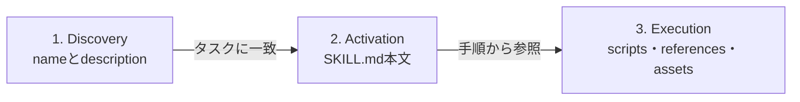

Agent Skillsは、AIエージェントへ専門知識や作業手順を追加するための、軽量なオープン形式です。中心にあるのはYAMLフロントマターとMarkdown本文を持つ`SKILL.md`で、必要に応じてスクリプトや参考資料も同梱できます。

この記事では、Agent Skillsの構造と段階的な読み込みの仕組みを整理し、最小構成のスキルを作って検証するところまで解説します。さらに、クライアントへ組み込む場合の探索順序やセキュリティ上の注意点も扱います。


*この記事の全体像。以下、順に解説します。*

## Agent Skillsとは

Agent Skillsは、特定業務の手順やドメイン知識を、バージョン管理できるフォルダとして配布するための形式です。たとえば、次のような作業をスキルにできます。

- コードレビューで確認する観点と手順
- 請求書から必要項目を抽出するワークフロー
- 社内テンプレートに沿った資料作成
- データ分析時に使うスクリプトと評価基準

仕様が定義するのは、主にスキルフォルダの中身です。どのディレクトリからスキルを探索するか、どのツールを実行できるか、いつユーザーへ許可を求めるかはクライアント実装が担います。

MCP（Model Context Protocol）とは役割が異なります。Agent Skillsは再利用可能な指示と同梱リソースをパッケージ化する形式です。一方、MCPは外部システムが提供するツールやデータへ接続するためのプロトコルです。実際のエージェントでは、MCPで利用可能になったツールをAgent Skillsの手順から呼び出す、といった併用ができます。

## スキルを構成するファイル

最小構成は、スキル名のディレクトリと`SKILL.md`だけです。`scripts/`、`references/`、`assets/`は必要な場合に追加します。

```text
my-skill/
├── SKILL.md          # 必須: メタデータと指示
├── scripts/          # 任意: 実行可能なコード
├── references/       # 任意: 詳細な参考資料
└── assets/           # 任意: テンプレートや画像、データ
```

それぞれの役割は次のとおりです。

| 要素 | 役割 | 読み込むタイミング |
|---|---|---|
| `SKILL.md` | 発動条件、作業手順、入出力、例外処理 | スキルの発動時 |
| `scripts/` | 決定的に実行したい処理 | 手順から必要になった時 |
| `references/` | 詳細仕様やドメイン知識 | 該当作業で必要になった時 |
| `assets/` | テンプレート、画像、スキーマ | 成果物の作成時 |

`SKILL.md`は、ファイル先頭のYAMLフロントマターと、その後に続くMarkdown本文で構成します。必須フィールドは`name`と`description`です。

```markdown
---
name: release-note
description: Gitの差分からリリースノートを作成する。リリース準備や変更履歴の要約を依頼された時に使う。
---

# Release note

1. 前回のタグから現在までのコミットを取得する。
2. 破壊的変更、機能追加、修正、内部変更に分類する。
3. 利用者への影響が分かる文章へ書き換える。
4. `assets/template.md`に沿って下書きを作成する。
```

主なフロントマターの制約は以下です。

| フィールド | 必須 | 主な制約 |
|---|---:|---|
| `name` | 必須 | 1〜64文字。小文字の英数字とハイフンのみ。先頭・末尾のハイフンと連続ハイフンは禁止。親ディレクトリ名と一致 |
| `description` | 必須 | 1〜1024文字。何を行い、いつ使うかを記述 |
| `license` | 任意 | ライセンス名、または同梱ライセンスファイルへの参照 |
| `compatibility` | 任意 | 1〜500文字。必要な製品、パッケージ、ネットワーク接続などの実行要件 |
| `metadata` | 任意 | 文字列キーと文字列値の追加メタデータ |
| `allowed-tools` | 任意 | 事前承認するツールを空白区切りで指定。実験的フィールドであり実装差あり |

## 段階的な読み込みでコンテキストを節約する

Agent Skillsの中心的な考え方は、必要な情報だけを段階的に読み込む「Progressive Disclosure」です。



最初に全スキルの完全な指示を入れるのではなく、セッション開始時には`name`と`description`だけをカタログとして提示します。モデルが依頼と説明の一致を判断した時に`SKILL.md`を読み、さらに必要なリソースだけを参照します。

公式仕様では、メタデータはスキルごとに約100トークン、`SKILL.md`の指示は5,000トークン未満が推奨されています。また、`SKILL.md`は500行未満に保ち、詳細資料は別ファイルへ分けることが推奨されています。これは厳密なファイルサイズ上限ではなく、コンテキストを効率よく使うための設計指針です。

参照ファイルはスキルルートからの相対パスで指定します。参照先からさらに別の参照先へ深くたどらせると、エージェントが必要な指示を見失いやすくなります。`SKILL.md`から1段で必要資料へ到達できる構成が適しています。

## 最小のスキルを作成する

ここでは、プロジェクト内に`release-note`スキルを作ります。`.agents/skills/`は複数クライアントで共有するために広く使われている配置規約ですが、Agent Skills仕様そのものはスキルの配置場所を固定していません。

```bash
mkdir -p .agents/skills/release-note/assets
```

`.agents/skills/release-note/SKILL.md`を作成します。

```markdown
---
name: release-note
description: Gitの差分からリリースノートを作成する。リリース準備や変更履歴の要約を依頼された時に使う。
compatibility: Requires git
metadata:
  version: "1.0"
---

# Release note

1. 前回のタグと対象リビジョンを確認する。
2. `git log`と`git diff --stat`で変更範囲を取得する。
3. 利用者への影響を、破壊的変更、機能追加、修正に分類する。
4. 不明な影響は推測せず、確認事項として残す。
5. `assets/template.md`の形式で下書きを出力する。
```

`.agents/skills/release-note/assets/template.md`には、成果物の型だけを置きます。

```markdown
# Version X.Y.Z

## Breaking changes

## Features

## Fixes
```

完成したら、公式リポジトリに含まれる参照実装`skills-ref`で検証できます。次の例ではリポジトリを取得し、参照実装のディレクトリへ移動して仮想環境へインストールします。

```bash
git clone https://github.com/agentskills/agentskills.git
cd agentskills/skills-ref
python -m venv .venv
source .venv/bin/activate
python -m pip install -e .

skills-ref validate /path/to/project/.agents/skills/release-note
```

このコマンドは、フロントマターの形式や`name`の命名規則などを確認します。ただし、公式リポジトリの`skills-ref`はデモ用の参照ライブラリであり、本番利用を意図したものではありません。CIへ組み込む場合はバージョンを固定し、期待する検証項目をテストしてください。

なお、PyPIで配布されている同名パッケージは`pip install skills-ref`で導入でき、CLI名は`agentskills`です。公式リポジトリ内の参照実装とはコマンド名が異なるため、利用する配布物のREADMEに合わせます。

```bash
agentskills validate .agents/skills/release-note
```

## クライアントへ組み込む時の流れ

Agent Skills対応クライアントを実装する場合は、次のライフサイクルを扱います。

1. プロジェクト、ユーザー、組織などのスコープから`SKILL.md`を探索する
2. YAMLフロントマターを解析し、`name`、`description`、ファイル位置を保持する
3. 利用可能なスキルのカタログをモデルへ提示する
4. モデルの判断またはユーザーの明示指定でスキルを発動する
5. `SKILL.md`と必要な同梱リソースをコンテキストへ追加する
6. 会話が長くなっても、発動済みの重要な指示を維持する

ローカルクライアントでは、次の4か所を候補にできます。

| スコープ | クライアント固有 | 共有規約 |
|---|---|---|
| プロジェクト | `<project>/.<client>/skills/` | `<project>/.agents/skills/` |
| ユーザー | `~/.<client>/skills/` | `~/.agents/skills/` |

同名のスキルが複数ある場合は、決定的な優先順位が必要です。公式の実装ガイドでは、プロジェクト単位のスキルをユーザー単位より優先する規約が示されています。同一スコープ内でも探索順を固定し、衝突をログへ残すと挙動を追跡しやすくなります。

また、厳密な仕様検証と実際の読み込み戦略は分けて考える必要があります。実装ガイドは、ディレクトリ名と`name`の不一致などでは警告しつつ読み込み、`description`欠落や解析不能なYAMLではスキップする寛容な戦略も示しています。相互運用性を優先する読み込みと、CIで行う厳密な検証を分ける設計です。

## 運用とセキュリティの注意点

スキルは単なるドキュメントではありません。エージェントへの指示を含み、同梱スクリプトを実行させる可能性があるため、コードと同様にレビュー対象にする必要があります。

### 信頼していないリポジトリからの指示注入

プロジェクト単位のスキルはリポジトリと一緒に取得されます。クローン直後のリポジトリを無条件で信頼すると、意図しない指示をエージェントへ読み込ませる恐れがあります。プロジェクトの信頼確認が済むまでスキルを無効にする、本文とスクリプトをレビューする、といった境界が必要です。

### ツール権限はクライアント側でも制御する

`allowed-tools`は実験的フィールドで、すべての実装が同じ意味で扱うとは限りません。スキル内の宣言だけを認可の根拠にせず、ファイル書き込み、ネットワーク接続、認証情報へのアクセスなどをクライアント側の権限モデルでも制御します。

### スクリプトの依存関係を明示する

`scripts/`内のコードは自己完結させるか、必要なランタイムとパッケージを明記します。失敗時に原因を追えるエラーメッセージを用意し、入力値と対象パスを検証します。スキルを別のクライアントや環境へ移した時に、暗黙のローカル設定へ依存しないことが重要です。

### 発動精度を評価する

`description`は説明文であると同時に、モデルが発動を判断する主要な手掛かりです。広すぎる説明は無関係なタスクでの誤発動を増やし、狭すぎる説明は必要な場面で発動しません。「何をするか」と「いつ使うか」を具体的に書き、代表的な依頼と紛らわしい依頼の両方で評価します。

## まとめ

Agent Skillsは、AIエージェントの専門知識と複数ステップの手順を、再利用可能なフォルダとして管理するオープン形式です。`SKILL.md`を中心に、必要なスクリプト、参考資料、テンプレートを同梱できます。

導入時は、まず小さな1スキルから始めるのが扱いやすいです。`name`と`description`で発動条件を明確にし、詳細資料を分離し、`skills-ref`で形式を検証します。運用では、プロジェクトの信頼境界、ツール権限、同名スキルの優先順位まで含めて設計すると、再利用性と安全性を両立できます。

この記事が少しでも参考になった、あるいは改善点などがあれば、ぜひリアクションやコメント、SNSでのシェアをいただけると励みになります！

## 参考リンク

- [Agent Skills公式サイト](https://agentskills.io/)
- [Agent Skills仕様](https://agentskills.io/specification)
- [Agent Skills対応クライアントの実装ガイド](https://agentskills.io/client-implementation/adding-skills-support)
- [agentskills/agentskills（GitHub）](https://github.com/agentskills/agentskills)
