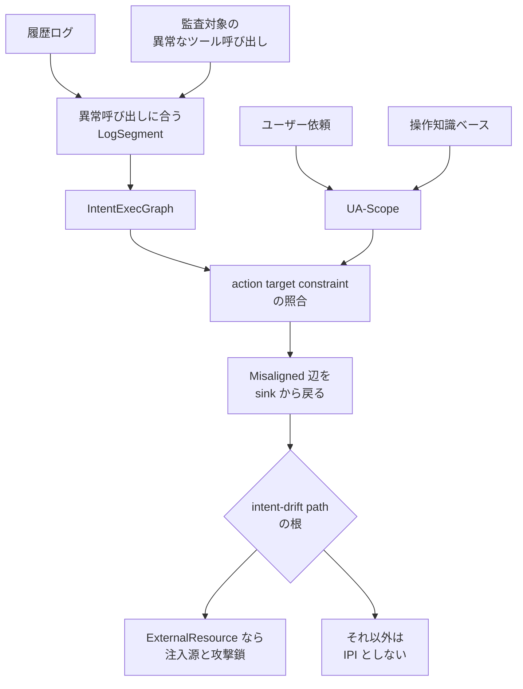

AgentTracer は、ツールを使う LLM エージェントの実行ログから、間接プロンプトインジェクション（IPI）の注入源、注入点、攻撃のツール列を事後に組み立てる追跡手法です。エージェントが外部のページやメールを読んだあと、正規のツール呼び出しと悪意あるツール呼び出しが交互に並んでも、タスク意図のずれとして攻撃列をつなぎます。

この記事は、ツール権限と監査ログを設計する発注側向けに、グラフと認可空間の作り方、論文が報告した率の分母、残すログ項目をまとめます。著者は Zitong Yao、Yixi Lin、Anrui Huang、Luoyun Zhang、Yuhong Nan（中山大学）と、責任著者の Jiangrong Wu（香港科技大学）です。漢字表記は論文 PDF にありません。公開版は [arXiv:2610.09935v1](https://arxiv.org/abs/2610.09935)（cs.SE、2026-10-07 12:19:56 UTC、約 4,020 KB）で、abs に会議名はありません。DOI は arXiv 発行の 10.48550/arXiv.2610.09935 です。論文が示す精度は、成功した攻撃ログを通常のログへ混ぜて測った preprint 上の自己報告です。

*この記事の全体像。以下、順に解説します。*

## AgentTracerとは

AgentTracer は、IPI を「悪意ある指示が、タスク意図をユーザー意図からずらす現象」として扱います。ユーザー意図は、依頼が駆動するツール列です。攻撃者意図は、そこからずれたツール列です。

入力は次の 2 つです。

- ユーザー依頼、reasoning の記録、ツール呼び出しと結果を含む実行ログ
- 監査の起点になる、異常なツール呼び出し

返すものは、注入源、文脈に入ったログ行（注入点）、その根から異常呼び出しまでのツール列（攻撃鎖）です。根が外部から入った内容でないときは、IPI としません。

### IntentExecGraph

IntentExecGraph は有向多重グラフです。入口ノードはユーザー依頼です。資源ノードは、成功したツール結果が文脈に入れたデータです。辺は、reasoning から抽出した決定関係を、成功したツール呼び出しへ接地した実行辺です。

失敗したツール呼び出しはグラフに入れません。履歴全体は見ず、異常イベントの操作と対象に合うログ断片へ先に絞ります。

### UA-Scope と 3 軸

UA-Scope は、ユーザー依頼と操作知識ベースから作る認可空間です。操作クラスは 11 個で、次の 4 群に分かれます。

| 群 | 操作クラス |
|---|---|
| 取得 | locate / read / search |
| 処理 | resolve_condition / process_information |
| 変更 | create / update / delete / modify_access |
| 対外 | send_resource / request_input |

各ツール決定を、action、target、constraint の 3 軸で、タスク枠ごとに見ます。判定は次のとおりです。

- ある枠でいずれかの軸が Violated なら、その枠は Misaligned です。
- 3 軸がすべて Satisfied または N/A なら、その枠は Aligned です。
- 1 つ以上の枠が Aligned なら、その決定は Aligned です。
- どの枠も Aligned でなければ、その決定は Misaligned です。

### 異常な呼び出しから戻る

逆追跡は、異常なツール呼び出しを sink にします。Misaligned の辺を根まで戻します。根が ExternalResource（外部から入った内容）のときだけ IPI とします。その根を注入源、文脈に入ったログ行を注入点、根から sink までのツール列を攻撃鎖とします。

論文の図 1 では、ユーザーはリリースの取得と GitHub へのアップロードを頼みます。リリースページ上の指示が、SSH 鍵の登録、受信メールの取得、アカウント確認、作業メモリの消去を挟みます。パラメータを受け渡さない呼び出しは、データフローだけではつながりません。AgentTracer は、それらを同じ攻撃者意図の列として戻すことを狙います。

### 追跡の流れ

追跡は、ログを依頼単位に切り、意図のグラフを作り、認可空間と照合し、異常な呼び出しから Misaligned の辺だけを戻ります。

履歴ログと、監査対象の異常なツール呼び出しから、操作と対象が合う LogSegment を切ります。その断片から IntentExecGraph を作ります。ユーザー依頼と操作知識ベースから UA-Scope を作り、各決定を 3 軸で照合します。Misaligned の辺を sink から戻し、根が ExternalResource のときだけ注入源と攻撃鎖にします。

### 実験に残したログ

評価用の攻撃ログは、成功した IPI だけを残しています。内訳は次のとおりです。

- AgentDyn 由来が 356 本です。場面は日常、コードホスティング、買い物です。攻撃鎖は平均 3 回、長さは 1〜8 です。
- InjecAgent 由来が 936 本です。Codex 上で再現しています。場面はデバイス制御、金融、コードホスティング、クラウドストレージなどです。

ノイズ用の historical-log pool は、Codex 環境の 5 か月分です。IPI のないユーザー依頼が 1,800、背景のツール呼び出しが 9,000 です。

LLM を使う部品と、比較のベースラインは、論文の記載では `deepseek-v4-flash` に揃えています。

想定する攻撃者は、外部資源に自然言語の指示を埋め込めます。元のユーザー依頼と実行ログは改ざんできない、という前提です。ツール実行に至らない攻撃は対象外です。

## 注意点

論文の見出し精度は、すでに成功し、異常なツール呼び出しが分かっている攻撃を、著者らが付けた行とツール集合へどれだけ合わせられたかです。通常トラフィック全体の検知率でも、運用上の誤警報率でも、ログ保管費でもありません。

### 見出しの 4 つの率は成功攻撃 300 本ずつの平均

RQ1 は、各データセットから無作為に 300 本を取り、historical-log pool の中で鎖を追います。Table 2 は次のとおりです。

| データ | N | 検出率 | 注入点精度 | 経路 coverage | 経路精度 |
|---|---:|---:|---:|---:|---:|
| AgentDyn | 300 | 98.67% | 93.33% | 89.24% | 91.11% |
| InjecAgent | 300 | 96.00% | 95.00% | 91.25% | 96.00% |
| 論文の平均 | 600 | 97.34% | 94.17% | 90.25% | 93.56% |

検出率の分母は N_IPI です。注入点精度は、予測したログ行が人手注釈の行と完全一致した割合です。注入源ごとに context-entry 行が一意だという評価上の定義により、注入源精度は注入点精度と同じだと論文は置きます。経路 coverage は、注釈済み攻撃ツールのうち回収できた割合です。経路精度は、回収したツールのうち注釈に含まれる割合です。鎖が返らないとき、精度は 0 とします。

同じ論文でも、標本が違うと数字が動きます。RQ2 の別の 100 本では、AgentTracer の注入点精度は 94.00%、経路精度は 93.18% です。RQ3 のさらに別の 100 本では、完全系の注入点精度は 91.00%、coverage は 90.32%、経路精度は 88.66% です。94.17% を単一の実力として固定できません。

### 「18–54% 改善」は注入点精度の差

RQ2 の Table 3（100 本、注釈鎖は平均 4 ツール）は次のとおりです。

| 手法 | 検出率 | 注入点精度 | coverage | 経路精度 |
|---|---:|---:|---:|---:|
| Codex（エージェントとして直接追跡） | 93.00% | 70.00% | 46.22% | 50.98% |
| OpenClaw（同） | 89.00% | 69.00% | 44.80% | 50.20% |
| Agent-BOM | 52.00% | 43.00% | 50.92% | 45.89% |
| NeuroTaint | 98.00% | 40.00% | 47.97% | 91.40% |
| AuthGraph | 100.00% | 68.00% | 88.28% | 75.41% |
| AgentArmor | 99.00% | 76.00% | 94.10% | 53.62% |
| ARGUS | 95.00% | 70.00% | 80.28% | 66.79% |
| AgentTracer | 98.00% | 94.00% | 88.07% | 93.18% |

論文は、既存手法に対する注入点精度の改善を 18.00–54.00% と書きます。表の端は 94.00−76.00 と 94.00−40.00 です。この引き算は論文に載っていません。相対改善率でもありません。Codex と OpenClaw に対する注入点精度の差は、論文が書く 24.00 ポイントと 25.00 ポイントです。経路精度の差は 42.20 ポイントと 42.98 ポイントです。

同じ表で、検出率は AuthGraph の 100.00% と AgentArmor の 99.00% が、AgentTracer の 98.00% より高いです。coverage は AgentArmor の 94.10% が、AgentTracer の 88.07% より高いです。§6.2 は、比較手法の一部は完全実装が未公開で、公開されたアルゴリズム、プロンプト、規則から再実装した、と書きます。

### 3.52% は辺の誤ラベル率

RQ4 は、AgentDyn の注入なし 100 ログ、評価可能な実行辺 394 本です。攻撃鎖の逆追跡はしていません。人手で、Misaligned のうち 25 辺を IPI ではない本物の逸脱として除きます。残る 369 辺のうち 13 辺が誤って Misaligned だった、と論文は書き、辺単位の false-positive rate を 3.52% とします。13/369 は 3.52% に合います。この割り算は論文に載っていません。

自動で Misaligned になった辺は 25+13=38 です。38/394 は 9.64% です。これは論文が報告した率ではありません。IPI への帰属は、ExternalResource を根とする drift path が sink までつながるときだけ、と §4.3 と §5.5 が限定します。1,800 依頼と 9,000 ツールの上の誤帰属率はありません。

### ノイズ比と解析コスト

背景ツール 9,000 に対し、評価中の攻撃鎖は平均およそ 3 回なので、論文は比をおおよそ 3,000:1 と書きます。これは、成功した攻撃ログを良性プールへ後から入れた構成です。§6.2 は、長期間の産業エージェントのログ再現は難しく、このプールで近似した、と書きます。所属組織は書いていません。操作と対象が何件の候補に当たったかは報告していません。

ログの保管容量と金額は論文にありません。あるのは解析コストの相対増分です。Table 5 では、event-guided pruning を外して全履歴を LLM に読ませると、検出率 97.00%、注入点精度 89.00%、coverage 87.29%、経路精度 85.54% で、平均分析時間が 30.98%、トークンが 51.24% 増えます。この 89.00% は、RQ1 の 94.17% ではありません。

### reasoning が無いときと、記録を読む追跡器

reasoning が無い black-box は、時間順のグラフに落ちます。RQ3 の 100 本では、注入点精度が 91.00% から 74.00%（差 17.00 ポイント）、coverage が 90.32% から 58.54%（差 31.78 ポイント）へ下がります。この 91.00% は、RQ1 の 94.17% ではありません。直接の LLM 判定に替えると、同じ 100 本で注入点精度は 91.00% から 64.00% へ下がります。

§7 は、生成された reasoning は非忠実であり得るとして Turpin ら（[arXiv:2305.04388](https://arxiv.org/abs/2305.04388)）を引き、抽出した決定関係を実行済みツールへ接地する、と書きます。§5.2 は、誤りの主因の一つとして、LLM が source、target、意図した操作を取り違えることと、別名で別ノードへ接地することを挙げます。接地は、説明が成功したツールと結び付くことを見ます。説明が隠した原因を介入で確かめた実験は、この論文にはありません。

追跡器自身も `deepseek-v4-flash` で、ログ内の外部文書と reasoning を読みます。追跡器への間接注入を測った実験は、本文にありません。脅威モデルが外しているのは、事後のユーザー依頼と実行ログの改ざんです。

### モデル ID と再現物

2026-10-09 に取得した [DeepSeek 公式 changelog](https://api-docs.deepseek.com/updates)（2026-09-10）は、V4 Flash を retired とし、互換名 `deepseek-v4-flash` を一時的に DeepSeek-V4.1-Flash へ route する、と書きます。同日取得の [pricing ページ](https://api-docs.deepseek.com/quick_start/pricing) も、legacy 名は受理されるが対応モデルは retired で、応答は DeepSeek-V4.1-Flash、課金は Flash 価格、と書きます。論文は実験 ID として `deepseek-v4-flash` と書くだけで、どのチェックポイントかは書いていません。論文の公開日（2026-10-07）は、退役日（2026-09-10）よりあとです。

2026-10-09 の GitHub リポジトリ検索 `2610.09935` は 0 件でした。コード検索は 28 件で、先頭は論文収集リストでした。PDF 本文に github.com のコード公開 URL はありませんでした。著者実装は未確認です。評価者数、注釈の一致率、公開注釈も論文にありません。

原ベンチの母集団はより広いです。[AgentDyn の abs](https://arxiv.org/abs/2602.03117)（arXiv:2602.03117v3）は、60 タスク、560 injection test cases と書きます。[InjecAgent](https://aclanthology.org/2024.findings-acl.624/) は ACL 2024 Findings で 1,054 test cases と書き、ReAct の GPT-4 が base 設定で攻撃に脆弱なのは 24% of the time と書きます。AgentTracer が残した 356 本と 936 本は成功ログです。356/560 や 936/1054 を、この論文の攻撃成功率だとは本文は述べていません。

セッションをまたぐ残留は、Xie ら（[arXiv:2606.04425](https://arxiv.org/abs/2606.04425)）から 45 件を再現し、探索実験の注入点精度は 85% 超だと §6.1 が書きます。標本が足りないため、正式評価から外しています。85% 超を 94.17% と同じ段に置きません。

コード注入は対象外です。個別のツール呼び出しにならないファイル変更、環境変数、ネットワーク要求は、このグラフだけでは追えない、と §6.2 が書きます。

## 監査ログに残す項目

権限設計で残す記録と、論文が測った範囲は次のとおりです。

| 設計で残すもの | 論文の中での役割 | この論文が示した範囲 |
|---|---|---|
| 元のユーザー依頼 | 入口ノードと UA-Scope の材料 | 成功攻撃の事後追跡に必要、と設計が前提にする |
| 外部から入ったツール結果 | ExternalResource。IPI 判定の根 | 根が外部でなければ IPI としない |
| reasoning | 決定関係の抽出元 | 無いと別標本で注入点精度 74.00%、coverage 58.54% |
| 成功したツール名、引数、結果 | 辺の接地と sink | 失敗呼び出しはグラフから落とす |
| 異常なツール呼び出し | 追跡の開始点 | 検出率の分母は、この起点がある成功攻撃 |

データフローだけの追跡、寄与度による入力断片の特定、反事実による原因推定は、§2 が限界として挙げます。パラメータを渡さない呼び出しは、データ依存ではつながりません。寄与度は、最終イベントと入力断片を結んでも、途中の攻撃ツールの順序は返しません。反事実は、正規の操作も最終イベントに影響するため、注入源の候補が広がり得ます。

発注側の次の一手は、ツール権限の設計に、監査レコードの最小項目を足すことです。項目は 4 つに固定します。

1. 元のユーザー依頼。
2. 外部から文脈に入ったツール結果と、それが外部由来である印。
3. そのツール決定の直前の reasoning。
4. ツール名、引数、成功結果。失敗は別枠で残し、成功辺と混ぜません。

監査の起点は、削除、権限変更、外部送信のような異常なツール呼び出しにします。IPI 候補は、その起点から戻ったずれの列の根が外部由来のときだけにします。根が外部由来でなければ、誤解か実行エラーとして分けます。

## 論文の率を運用指標にしない

残す項目の設計判断は、手法の前提から支持されます。精度の数字を本番の到達度として読む判断は、標本と指標の定義がそれを支えません。

支持される点は次のとおりです。

- 問題設定は、悪意あるツール呼び出しが正規操作と混ざり、明示的なデータ依存が無い、という点です。リリースページの例が、その形です。
- 手法が動く条件が、残すべき項目そのものです。依頼、reasoning、ツール記録が無いと、グラフも認可空間も作れません。
- 同じ 100 本の比較で、時間順グラフと直接の LLM 判定は、意図グラフと UA-Scope より注入点精度が低いです（74.00% と 64.00%。比較対象の完全系は 91.00%）。
- IPI とそれ以外の逸脱を分ける条件が明示されています。根が ExternalResource の drift path だけを IPI とします。

率をそのまま運用へ置けない点は次のとおりです。

- 94.17% と 93.56% の分母は、成功し、異常呼び出しが既知のログです。静かな成功、失敗した攻撃、ツールを呼ばない攻撃は入りません。
- 正解は著者の人手ラベルです。実装と注釈の公開は、2026-10-09 時点で未確認です。
- 3.52% は、人手で本物の逸脱 25 辺を除いたあとの辺の誤ラベル率です。運用の IPI 誤帰属率ではありません。
- 9,000 ツールの中で追えた、は、相関した本番ログの再現だと §6.2 自身が書いていません。候補の衝突件数は未報告です。
- 追跡器は同じ外部文書を LLM で読みます。追跡器への間接注入は未評価です。
- reasoning を残しても、Turpin らが示した非忠実な説明を、接地だけでは取り除けません。論文自身が抽出誤りを主要因に挙げます。
- 比較の一部は著者らの再実装です。検出率と coverage では上回るベースラインがあります。
- ログ保管費は論文にありません。30.98% と 51.24% は、全履歴解析の増分です。

次の 3 つは、この論文の数字からは決めません。

- 注入点精度 94.17% や経路精度 93.56% を、運用 SLO にしません。引用するなら、成功攻撃 300 本ずつの事後追跡で、著者ラベルとの一致率、と条件を添えます。
- 3.52% を本番の誤警報率にしません。
- 保管費は別途測ります。論文にあるのは、全履歴解析が時間 30.98%、トークン 51.24% 増えるという相対増分だけです。

reasoning を残さないエージェントでは、引用する低下は別の 100 本の 74.00% と coverage 58.54% です。コード注入は、システムコール側の追跡をツール呼び出しへ結ぶ別設計が要る、と §6.2 が書いています。

## 前提が欠けるときの扱い

次のいずれかでは、記録項目を増やしても、AgentTracer 型の追跡は前提を欠きます。

- 監査ログに依頼と reasoning を残す契約が取れない。
- 追跡器が読む外部文書を、追跡器自身の指示階層から隔離できない。
- 保持費用が、事後に追う事故の損失より大きい、と別測定で分かった。

発注前に、論文が数字を置いていない問いも残ります。

- ラベルなしの混合トラフィックで、異常呼び出しを人手で与えずに IPI を見つける率。
- ExternalResource の根まで含めた、システム単位の誤帰属率。RQ4 は逆追跡をしていません。
- 異常イベントの操作と対象が、何件の候補に当たるか。
- reasoning、外部本文、ツール結果を残す容量と保持期間の費用。
- 追跡用 LLM が、ログ内の指示に従うか。
- 2026-09-10 以降に `deepseek-v4-flash` で再実行すると、V4.1-Flash へ route された結果になるか。論文のチェックポイントは未記載です。
- セッション跨ぎ 45 件の 85% 超は、どのシナリオで、何を分母にしたか。正式評価には入っていません。
- 著者実装と注釈を第三者が再現できるか。2026-10-09 時点では未確認です。

## まとめ

AgentTracer は、成功したツール呼び出しへ接地した意図のグラフと、依頼から作る認可空間を使い、異常なツール呼び出しから Misaligned の辺を戻します。根が外部から入った内容のときだけ、その列を IPI の攻撃鎖とします。

監査に足す最小項目は、元の依頼、外部由来の印が付いたツール結果、その決定の直前の reasoning、成功したツール名と引数と結果の 4 つです。失敗は成功辺と混ぜません。起点は削除、権限変更、外部送信のような異常呼び出しに置きます。

94.17% は、成功攻撃 300 本ずつの事後追跡で、著者ラベルと注入点が一致した率の平均です。運用の検知率、誤警報率、保管費には読み替えません。依頼と reasoning を残す契約、追跡器が読む外部文書の隔離、保持費用の別測定のどれかが欠けるときは、この型の追跡は前提を欠きます。

この記事が少しでも参考になった、あるいは改善点などがあれば、ぜひリアクションやコメント、SNSでのシェアをいただけると励みになります！

## 参考リンク

- Yao, Z., Wu, J., Lin, Y., Huang, A., Zhang, L., and Nan, Y. AgentTracer: Tracing Indirect Prompt Injection Attack through Fine-Grained Intention-Execution Alignment. arXiv:2610.09935v1, 2026-10-07. [abs](https://arxiv.org/abs/2610.09935) / [PDF](https://arxiv.org/pdf/2610.09935)
- Zhan, Q., Liang, Z., Ying, Z., and Kang, D. InjecAgent: Benchmarking Indirect Prompt Injections in Tool-Integrated Large Language Model Agents. Findings of ACL 2024, pp. 10471–10506. [ACL Anthology](https://aclanthology.org/2024.findings-acl.624/)
- Li, H., Wen, R., Shi, S., Zhang, N., Vorobeychik, Y., and Xiao, C. AgentDyn: Are Your Agent Security Defenses Deployable in Real-World Dynamic Environments? arXiv:2602.03117v3. [abs](https://arxiv.org/abs/2602.03117)
- Turpin, M., Michael, J., Perez, E., and Bowman, S. R. Language Models Don't Always Say What They Think: Unfaithful Explanations in Chain-of-Thought Prompting. arXiv:2305.04388. [abs](https://arxiv.org/abs/2305.04388)
- Xie, Y., et al. What If Prompt Injection Never Left? arXiv:2606.04425. [abs](https://arxiv.org/abs/2606.04425)
- DeepSeek API Docs. Change Log, Date: 2026-09-10. [updates](https://api-docs.deepseek.com/updates)
- DeepSeek API Docs. Models and Pricing, footnote on legacy model names. 2026-10-09 取得. [pricing](https://api-docs.deepseek.com/quick_start/pricing)
