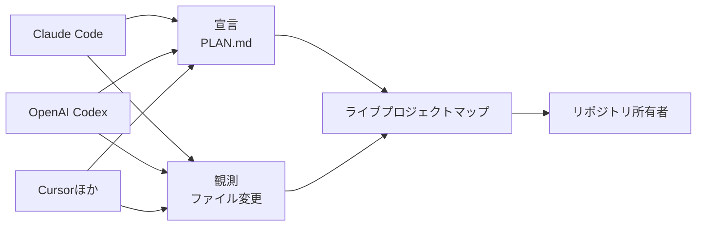
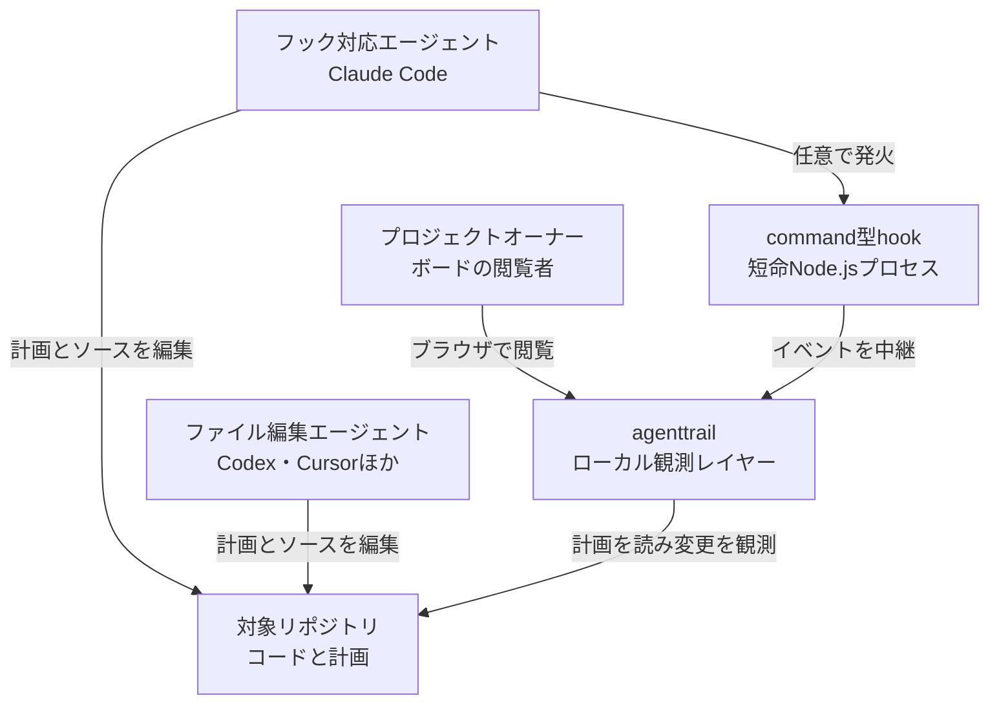
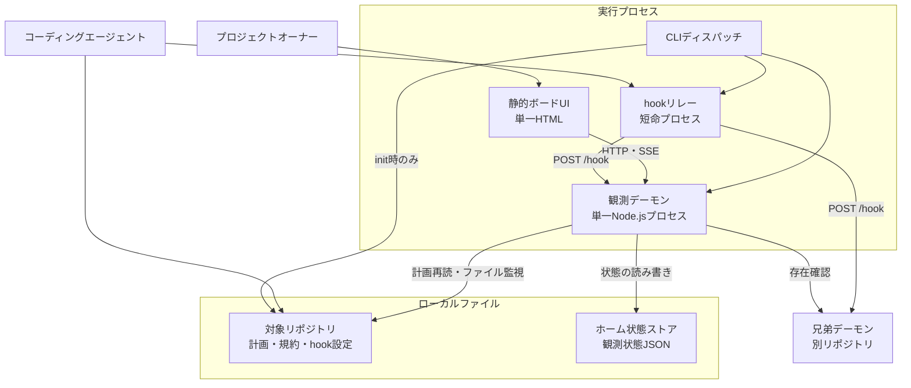
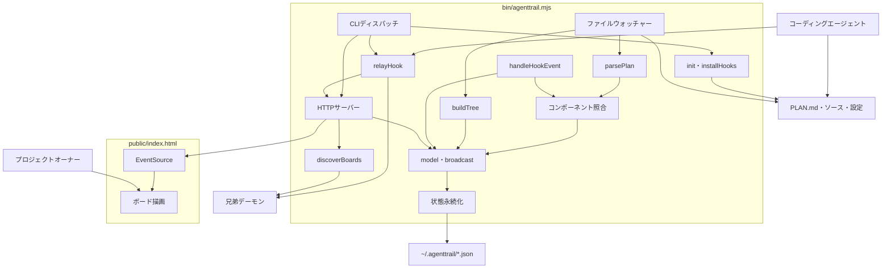
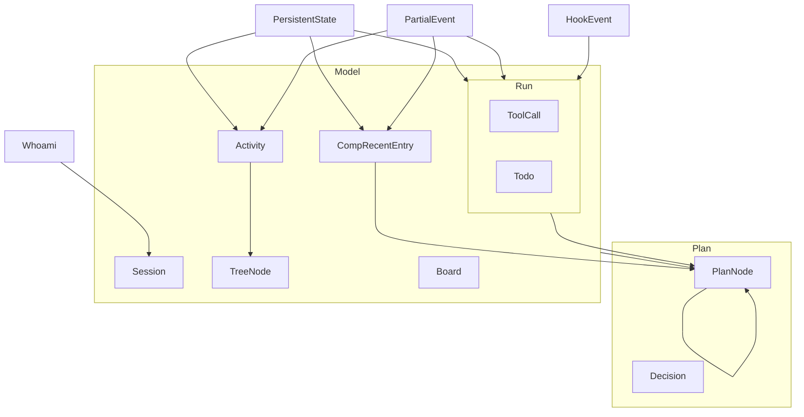
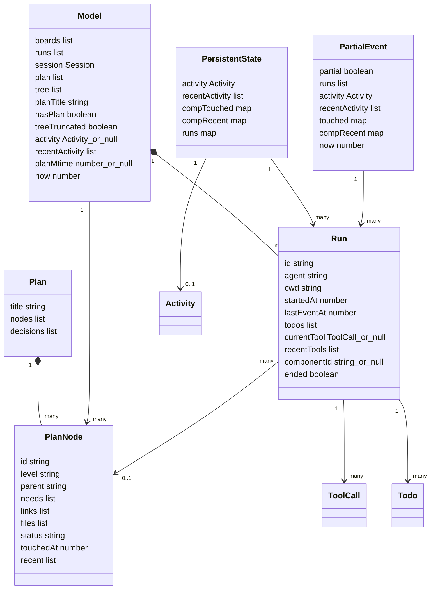

AIコーディングエージェントに長い作業を任せると、「いま何をしているのか」「計画どおり進んでいるのか」が見えにくくなります。`agenttrail` は、計画ファイルと実際のファイル変更を重ね、作業状況をローカルのライブマップとして表示するツールです。

この記事では、2026年8月26日時点の`sodiumsun/agenttrail`の`main`（commit `8eb58c9`）を実装仕様の基準とし、仕組み、データモデル、導入方法、運用上の制約まで解説します。公開済みのnpm版`0.1.0`は`gitHead`が`ed751a8`で、`main`とは同一内容ではありません。`npx agenttrail@0.1.0`の例は公開パッケージの起動方法であり、後発の`main`由来の挙動まで保証するものではありません。同名・類似名のセッション履歴ビューアや監査SDKではなく、npmパッケージ名が`agenttrail`のプロジェクトを扱います。


*この記事の全体像。以下、順に解説します。*

## 概要

agenttrailは、AIコーディングエージェント向けのローカル観測レイヤーです。Claude Code、OpenAI Codex、Cursorなどが編集するリポジトリを監視し、計画、ファイル変更、進捗をブラウザ上のプロジェクトマップへ変換します。

中心となる考え方は、次の2種類の信号を分けて扱うことです。

- 宣言された状態: エージェントが`PLAN.md`へ書いたコンポーネント、タスク、依存関係
- 観測された状態: ファイルウォッチャーが捉えた書き込みと、Claude Code hooksが捉えたファイルアクセスを含む推定活動



計画上で完了したコンポーネントに活動があると、ボードはその状態を`Revising`として示します。blockedな箇所なら`Retrying`です。ファイルウォッチャー由来の活動は書き込みですが、Claude Code hooksは`file_path`を伴う`Read`も活動として扱います。そのため、`Revising`は必ずしも書き換えを意味せず、「その箇所へアクセスした」という推定を含みます。

agenttrailが扱わないものも明確です。トランスクリプト再生、トークンやコストの集計、LLMトレース、エージェントへのプロンプト送信は対象外です。稼働中のデーモンは観察と描画に限定され、`init`コマンドだけが計画やhooksの配線をリポジトリへ追加します。

## 特徴

主な特徴は次のとおりです。

- ローカル完結: `127.0.0.1`だけで待ち受け、クラウドアカウントやDBを必要としない
- npm依存ゼロ: Node.js標準ライブラリだけで動く単一ESMデーモン
- 宣言と観測の分離: `PLAN.md`の状態とファイル変更を別々に保持して重ねる
- 読み取り専用のボード: 稼働中にプロンプト送信やコード編集を行わない
- 複数リポジトリ対応: リポジトリごとのデーモンを兄弟ボードとして発見する
- 大規模リポジトリ向け上限: ツリーを幅優先で走査し、件数・深さ・ディレクトリ単位で打ち切る
- Claude Code向けの高い忠実度: hooksからrun card、Todo、直近ツールを表示する
- CodexやCursorにも対応: hooksがなくてもファイル変更と`PLAN.md`で観測できる

2026年8月26日時点では、npm版は`0.1.0`、必要なNode.jsは`>=20`です。中核デーモンは`bin/agenttrail.mjs`の467行で、UIはビルド不要の`public/index.html` 1枚です。

似たツールとは観測対象が異なります。

| 目的 | 向いている選択肢 |
|---|---|
| エージェントが「いまどこを作業しているか」を見る | [sodiumsun/agenttrail](https://github.com/sodiumsun/agenttrail) |
| エージェントへコード構造を渡す | [remorses/agentmap](https://github.com/remorses/agentmap) |
| ツール呼び出しや親子エージェントを再生する | [simple10/agents-observe](https://github.com/simple10/agents-observe) |
| トークンや概算コストを集計する | [@camtrik/agent-trail](https://github.com/camtrik/agent-trail)や[Claude Code OpenTelemetry](https://code.claude.com/docs/en/monitoring-usage) |

## 構造

agenttrailは、対象リポジトリ1つにつきNode.jsデーモン1つと、そのデーモンが配信する静的HTML 1枚で構成されます。ファイル監視と計画ファイルが背骨で、Claude Code hooksは観測の忠実度を上げるアダプターです。

### システムコンテキスト図

利用者はブラウザでボードを閲覧します。コーディングエージェントは通常どおりリポジトリを編集し、agenttrailは変更を観察します。Claude Codeでは任意のcommand型hookを追加でき、run cardやTodoの状態も表示できます。



agenttrailからエージェントへの制御経路はありません。あくまで「人が作業状況を見る」ための片方向の観測です。

### コンテナ図

同じ`agenttrail`バイナリは、CLIディスパッチ、常駐デーモン、短命のhookリレーという3つの役割に分岐します。ブラウザ内の静的UIはHTTPとServer-Sent Events（SSE）でデーモンへ接続します。



観測状態はリポジトリ内の`.agenttrail/`ではなく、`~/.agenttrail/<リポジトリパスのSHA-1先頭12桁>.json`へ保存されます。リポジトリを移動または改名すると別の状態ファイルになる点に注意してください。

### コンポーネント図

デーモンは計画の解析、ファイル監視、リポジトリツリー構築、hook処理、状態永続化、HTTP/SSE配信、兄弟ボード探索を1プロセスで担います。



公開されるHTTP経路は`GET /`、`GET /whoami`、`GET /model`、`GET /events`、`POST /hook`の5つです。`public/index.html`はリクエストごとにディスクから読み込まれます。SSEは接続時にフルモデルを送り、通常の活動更新では差分tickを送ります。ただし、`PLAN.md`更新時とdirtyなツリーの再送時には、接続後もフルモデルを再送します。

recursive `fs.watch`を使えない環境では非再帰フォールバックへ移りますが、この経路で追跡されるのは`PLAN.md`更新だけです。トップレベルを含む通常ファイルのactivityは更新されません。

## データ

データは、`PLAN.md`を解析した宣言層と、ファイルウォッチャーやhooksから得る観測層に分かれます。`model()`が両者を統合してブラウザへ配信します。

### 概念モデル

`Plan`は宣言、`Model`はUIへ渡す派生スナップショット、`PersistentState`は再起動後も残す観測状態です。Claude Codeの`HookEvent`は`Run`、`ToolCall`、`Todo`へ投影されます。



宣言と観測は別々の寿命を持ちます。`PLAN.md`のタスクはファイルに残る限り維持されます。UIのlive ringは最終更新から60秒です。Claude Codeのrunは、最終hookから15分または2時間を超えた後、次にモデルかtickが生成された時点でended化または削除されます。

### 情報モデル

主要な型と関係は次のとおりです。この図は関係を理解するための抜粋であり、実際の`/model`レスポンスの完全なスキーマではありません。`PlanNode.touchedAt`と`recent`は`parsePlan()`の出力ではなく、`model()`がコンポーネントに後付けする観測値です。



実際の`GET /model`には、`boards`、`runs`、`session`、`plan`、`tree`、`planTitle`、`hasPlan`、`treeTruncated`、`activity`、`recentActivity`、`planMtime`、`now`が含まれます。SSEのpartialには、`partial: true`、`runs`、`activity`、`recentActivity`、`touched`、`compRecent`、`now`が含まれます。

実装上、時刻の型は統一されていません。`Session.startedAt`はISO 8601文字列ですが、`Run.startedAt`、`lastEventAt`、`Activity.at`はepoch millisecondsです。また、永続化時のキーは`compTouched`、SSE差分では`touched`です。`activity`、`currentTool`、`componentId`、`planMtime`などは状況により`null`になり得ます。taskには`files`、`touchedAt`、`recent`がなく、後ろ2つはcomponentだけに追加されます。外部連携を作る場合は、キーの欠落、型、nullable性を区別する必要があります。

代表的なデータの上限は次のとおりです。

| データ | 上限・寿命 |
|---|---|
| `recentActivity` | 最大12件 |
| コンポーネントごとの`compRecent` | 最大6件 |
| `recentTools` | 最大8件 |
| UI live ring | 最終更新から60秒 |
| runのended判定 | 最終hookから15分を超えた後、次のmodelまたはtick生成時 |
| runの削除 | 最終hookから2時間を超えた後、次のmodelまたはtick生成時 |
| リポジトリツリー | 全体4000件、1ディレクトリ250件。`depth > 8`のディレクトリ内容は未走査 |

## 構築方法

前提はNode.js 20以上です。CLIに`--version`はないため、Node.jsとnpm版は別々に確認します。

```bash
node -v
npm view agenttrail version
npm view agenttrail engines
```

まずボードだけを試すなら、対象リポジトリで次を実行します。

```bash
cd /path/to/your-repo
npx agenttrail@0.1.0 --open
```

コンポーネントマップとClaude Code hooksも使う場合は、別途`init`を実行します。

```bash
cd /path/to/your-repo
npx agenttrail@0.1.0 init
npx agenttrail@0.1.0 --open
```

`init`はデーモンを起動しません。未存在なら`PLAN.md`を作り、`CLAUDE.md`と`AGENTS.md`へ規約を追記し、`.gitignore`へ`.agenttrail/`を加えます。`.claude/settings.local.json`は、構文が有効で、ルートと`hooks`がオブジェクト、対象4イベントが配列または未定義の場合に、hookを加算的にマージします。不正なJSONは既存内容を読み捨ててagenttrail用設定で上書きされる可能性があります。構文が正しくてもスキーマが違えば`TypeError`で中断し、それ以前の変更だけが残る場合があります。実行前に構文とスキーマを確認し、バックアップしてください。

hooksだけを配線したい場合は、`init --hooks-only`を使います。

```bash
npx agenttrail@0.1.0 init --hooks-only
```

この場合、`PLAN.md`、規約ファイル、`.gitignore`、`.agenttrail/`は変更されません。`init`なしで`--hooks-only`だけを渡すと、hooks配線ではなく通常のデーモン起動になるため注意してください。

`PLAN.md`がない場合、`init`は次の最小スケルトンを作ります。`<name>`には対象ディレクトリのbasenameが入ります。

```markdown
# <name>

## Set up the project {#setup}
tech: scaffolding
- [ ] First task {#setup-first}

## decisions
```

この時点では決定事項は空です。エージェントが実装上の判断を行ったとき、日付と内容を箇条書きで追記します。

## 利用方法

デーモンには必須のCLI引数がありません。位置引数がなければ現在のディレクトリを監視し、既定ではポート5330からbindを試します。

```bash
npx agenttrail@0.1.0
npx agenttrail@0.1.0 --open
npx agenttrail@0.1.0 /path/to/your-repo --port 5331 --open
```

`PLAN.md`では、H2をコンポーネント、checkboxをタスクとして記述します。`{#id}`がない見出しやタスクはモデルへ入りません。

```markdown
# my project

## Capture the audio {#capture}
tech: coreaudio tap + ring buffer
files: [src/audio/**]
- [x] Grab the mic feed {#capture-mic}
  by: claude
- [~] Keep the last 30 seconds ready {#capture-ring}
  by: claude

## Decide what matters {#classify}
needs: [capture]
- [ ] Score events by urgency {#classify-score}
  from: roadmap

## decisions
- 2026-08-21: dropped redis; use an in-process queue
```

タスク状態は`[ ]`がpending、`[~]`がactive、`[x]`がdone、`[!]`がblockedです。`needs:`、`links:`、`files:`はインデントせず、コンポーネント直下へ置きます。`files:`のglobは、実際のファイル変更をどのコンポーネントへ結びつけるかに使われます。

状態はHTTPからも確認できます。

```bash
curl -sS http://127.0.0.1:5330/whoami
curl -sS http://127.0.0.1:5330/model
curl -sS -N http://127.0.0.1:5330/events
```

`/whoami`は次の形です。

```json
{"project":"your-repo","port":5330}
```

`POST /hook`はClaude Codeのhook payloadを受け取ります。同一マシン上の任意プロセスから到達できるため、外部入力を信頼するAPIとして公開しないでください。

## 運用

専用のstopコマンドはありません。フォアグラウンドで起動し、終了時は`SIGINT`または`SIGTERM`を送ります。これらのシグナルではdirtyな状態を保存してから終了します。

```bash
kill -TERM <pid>
```

正常起動時の標準出力は次の形です。

```text
agenttrail · <project> · http://localhost:<port>
```

`PLAN.md`がなくても、リポジトリツリー、ファイル活動、hooksが配線済みならrun cardは利用できます。コンポーネントマップだけが表示されません。

複数リポジトリで使う場合は、リポジトリごとに1デーモンを起動します。兄弟探索とhook fan-outの範囲は5330〜5344です。一方、bindは衝突時に5330から5350まで到達し得ます。5345以降へ割り当てられたデーモンは兄弟タブに現れず、既定のhook fan-outも届きません。確実に届けたい場合は、デーモンの`--port`とhookプロセス側の`AGENTTRAIL_PORT`を一致させます。

```bash
npx agenttrail@0.1.0 --port 5330
AGENTTRAIL_PORT=5330 npx agenttrail@0.1.0 hook < payload.json
```

専用ログファイルやログレベル設定はありません。標準出力と標準エラー、`/whoami`、`/model`が状態確認の入口です。

## ベストプラクティス

`PLAN.md`は実装のコピーではなく、人が状況を把握するための地図として保ちます。

- コンポーネント数はリポジトリ規模にかかわらず5〜9個に抑え、粒度はtaskで調整する
- 着手時に`[~]`、完了時に`[x]`、詰まったら`[!]`へすぐ更新する
- `by:`は着手時に付け、完了後も残す
- `files:`を現在の所有パスと一致させる
- `{#id}`は安易に改名せず、追加・削除を基本とする
- 計画へ影響する決定は実装前に`## decisions`へ残す
- 陳腐化したらエージェントへ`re-verify PLAN.md against the code.`と依頼する

セキュリティ境界はループバックbindだけです。HTTPに認証はなく、同一マシン上の別プロセスは`POST /hook`でrunを注入できます。機密性の高い共有マシンでは、この前提を理解して使う必要があります。

また、`.claude/settings.local.json`へ書かれるhook commandは`agenttrail.mjs`の絶対パスです。パッケージの配置を変えた場合は配線を確認してください。アンインストール用サブコマンドはないため、不要になったhooksは4イベントの配列から手動で削除します。

巨大リポジトリでは、ツリーが全件表示されないことを前提にします。幅優先走査が全体4000件または1ディレクトリ250件の上限に達すると、UIに`large repo — tree abridged`と表示されます。一方、`depth > 8`のディレクトリ内容は走査されることなく省略され、この深さ上限だけに達した場合は`treeTruncated`が立たないため警告も表示されません。

## トラブルシューティング

よく起きる症状と確認点をまとめます。

| 症状 | 原因 | 対処 |
|---|---|---|
| Linuxで`ENOSPC`とともにデーモンが落ちる | recursive `fs.watch`が登録時に`.git`や`node_modules`も監視し、inotifyを大量消費する | 現行`main`に公式修正はない。Issue #1を確認し、大規模Linuxリポでは導入前に再現性を評価する |
| `recursive file watching unavailable`と出る | recursive watchの同期セットアップ失敗でフォールバックした | `PLAN.md`更新だけが追跡され、通常ファイルのactivityはトップレベルを含め表示されない |
| 5330以外で起動する | ポート衝突時に自動で+1する | 標準出力の実URLを使い、必要なら`--port`を明示する |
| 兄弟ボードに出ない | 実ポートが探索範囲5330〜5344の外にある | 範囲内へ固定するか`AGENTTRAIL_PORT`を指定する |
| Claude Codeのrun cardがない | hooks未配線、cwd不一致、または400ms以内にrelayできていない | `settings.local.json`、監視リポのcwd、実ポートを確認する |
| マップが空だがtreeは見える | `PLAN.md`がない、またはスケルトンのまま | backfill promptで実装に沿った計画を作る |
| runがendedになった | 最終hookから15分を超えた後、次のmodelまたはtickが生成された | 仕様。2時間を超えたrunも次の評価時に削除される。完全なアイドル中は再接続や次イベントまで古い表示が残り得る |
| UIが`Not connected`になる | `EventSource('/events')`がデーモンへ届いていない | agenttrailが表示したlocalhost URLから開き直す |

特にLinuxのinotify枯渇は、イベントを無視する正規表現では解消しません。現行実装の`IGNORE`はイベントcallbackやツリー走査には効きますが、recursive watcherの登録時には効かないためです。Issue #1の提案修正は2026年8月26日時点で未マージです。

## まとめ

agenttrailは、`PLAN.md`の宣言とファイル変更の観測を重ね、AIコーディングエージェントの「いま」をローカルで把握するための小さな観測レイヤーです。依存ゼロのNode.jsデーモンと静的HTMLだけで始められ、Claude Codeではhooksによりrun cardやTodoも見られます。

一方で、トークン・コスト・トランスクリプトの分析は対象外です。Linuxのrecursive `fs.watch`、ポート探索範囲、認証のないローカルHTTP、絶対パスで配線されるhooksといった運用上の制約を理解して導入することが重要です。

この記事が少しでも参考になった、あるいは改善点などがあれば、ぜひリアクションやコメント、SNSでのシェアをいただけると励みになります！

## 参考リンク

- [sodiumsun/agenttrail](https://github.com/sodiumsun/agenttrail)
- [README.md at 8eb58c9](https://github.com/sodiumsun/agenttrail/blob/8eb58c9c8b58a16c4d385098bb0ca48cf678dab6/README.md)
- [bin/agenttrail.mjs at 8eb58c9](https://github.com/sodiumsun/agenttrail/blob/8eb58c9c8b58a16c4d385098bb0ca48cf678dab6/bin/agenttrail.mjs)
- [public/index.html at 8eb58c9](https://github.com/sodiumsun/agenttrail/blob/8eb58c9c8b58a16c4d385098bb0ca48cf678dab6/public/index.html)
- [package.json at 8eb58c9](https://github.com/sodiumsun/agenttrail/blob/8eb58c9c8b58a16c4d385098bb0ca48cf678dab6/package.json)
- [PLAN.md at 8eb58c9](https://github.com/sodiumsun/agenttrail/blob/8eb58c9c8b58a16c4d385098bb0ca48cf678dab6/PLAN.md)
- [npm agenttrail](https://www.npmjs.com/package/agenttrail)
- [Issue #1 Recursive fs.watch ENOSPC](https://github.com/sodiumsun/agenttrail/issues/1)
- [Claude Code monitoring usage](https://code.claude.com/docs/en/monitoring-usage)
