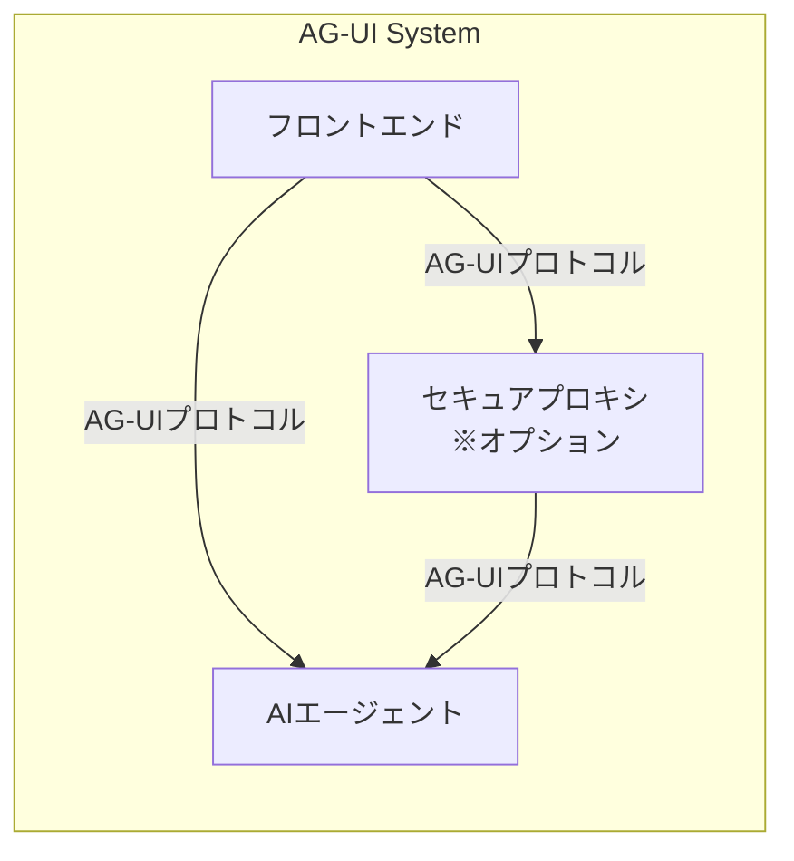
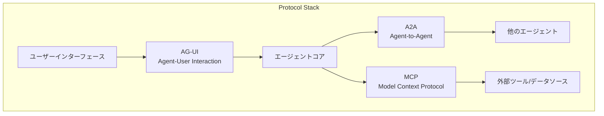

## ■概要

AG-UIプロトコルは、イベント駆動型のオープンソースプロトコルです。AIエージェントとフロントエンドアプリケーション間の接続を簡素化し、柔軟性を高めるために設計されました。このプロトコルの主な目的は、AIエージェントとユーザーがリアルタイムで協調作業をする新しい標準インターフェースを提供することです。「エージェントとユーザーを結ぶ共通言語」としての役割を目指します。

## ■背景・経緯

従来のAIエージェントエコシステムは、主にバックエンドの自動化に焦点を当てていました。そのため、ユーザーとの対話性は限定的でした。多くのAIエージェントは、独立したプロセスとして機能してきました。例えば、データ移行、調査と要約、フォーム入力などです。これらのプロセスでは、ユーザーの介入は少ないです。AI技術の進化に伴い、対話型アプリケーションへの需要が高まりました。対話型アプリケーションでは、エージェントがユーザーとより密接に連携します。また、Cursorなどのように共有ワークスペースで共同作業をします。

AG-UIは、次世代のAI強化アプリケーションの基盤となることを目指して設計されました。このようなアプリケーションでは、人間とエージェントがシームレスに協力します。このプロトコルは、AI駆動システムのための普遍的な翻訳機として機能します。これにより、基本的な断片化に対処します。エージェントの「言語」に関わらず、円滑なコミュニケーションを保証します。

## ■解決する課題

AG-UIがこれらの具体的な課題解決に注力している点は、このプロトコルが実際の開発現場での経験とニーズに基づいて形成されているからです。単なる理論的な提案ではなく、開発者が直面する現実的な問題点への対応を目指すというこの実用的なアプローチは、AG-UIが広く受け入れられるための重要な要素になりそうです。

1.  **リアルタイムストリーミング**
    * **課題:** 大規模言語モデル（LLM）はトークンを逐次的に生成します。そのため、ユーザーインターフェース（UI）は完全な応答を待つことなく、生成されたトークンを即座に表示し、ユーザーの待ち時間を削減する必要があります。
    * **AG-UIの対応:** このリアルタイム性を確保するための仕組みを提供します。
2.  **ツールオーケストレーション**
    * **課題:** 現代のAIエージェントは、関数呼び出し、コード実行、APIアクセスなど、様々なツールを利用します。UIはこれらのツールの進捗状況や結果を表示し、場合によってはユーザーの承認を求め、コンテキストを失うことなく実行を再開する必要があります。
    * **AG-UIの対応:** ツール呼び出しの開始・完了イベントを定義し、フロントエンドでの可視化を容易にします。
3.  **共有された可変状態の管理**
    * **課題:** エージェントは、計画、表、コードフォルダなど、段階的に変化するデータを生成することが多いです。毎回データ全体を送信するのは非効率的であり、差分のみを送信するには明確なスキーマが必要となります。
    * **AG-UIの対応:** 状態の差分更新をサポートし、効率的なデータ同期を目指します。
4.  **並行処理とキャンセル**
    * **課題:** ユーザーは複数のクエリを同時に発行したり、処理の途中でキャンセルしたり、スレッドを切り替えたりする可能性があります。バックエンドとフロントエンドは、スレッドID、実行ID、そして秩序だったシャットダウンパスを必要とします。
    * **AG-UIの対応:** 途中キャンセルなど、実運用で求められるイベントを網羅することを目指します。
5.  **セキュリティ境界**
    * **課題:** 任意のデータをストリーミングすることは、CORS（Cross-Origin Resource Sharing）ポリシー、認証トークン、企業が承認する監査ログなどの要件が絡むと複雑になります。
    * **AG-UIの対応:** これらのセキュリティ要件を満たすアーキテクチャ構築を支援します。
6.  **フレームワークの乱立**
    * **課題:** LangChain、CrewAI、Mastra、AG2など、様々なAIエージェントフレームワークが存在しますが、それぞれがわずかに異なる「方言」を話します。標準プロトコルがない場合、各UIはアダプターやエッジケース処理を個別に再実装する必要があり、開発効率を低下させます。
    * **AG-UIの対応:** 異なるフレームワーク間での相互運用性を高めることを目的としています。

## ■主要機能とアーキテクチャ

### ●コア機能

イベント駆動型アーキテクチャと柔軟なミドルウェア層の組み合わせは、AG-UIの適応性の基盤です。これにより、AG-UIは既存の多様なシステムに大規模な変更をかけずに統合できます。

1.  **イベント駆動型コミュニケーション**
    * クライアント（フロントエンド）はエージェントのエンドポイントに単一のPOSTリクエストを送信します。
    * その後、クライアントは統一されたイベントストリームをリッスンします。
    * エージェントは処理の進行に応じてイベントを発行し、UIはこれらのイベントを逐次受け取って表示や更新を行います。
2.  **標準化されたイベントタイプ**
    * AG-UIは、エージェントとユーザー間の主要なインタラクションシナリオをカバーするために、16種類の標準イベントタイプを定義しています。
    * 各イベントは、イベントタイプ（例：`TEXT_MESSAGE_CONTENT`、`TOOL_CALL_START`、`STATE_DELTA`）と最小限のペイロードを持ちます。
    * 主要なイベントタイプの例は以下の通りです。
        * `TEXT_MESSAGE_CONTENT`: エージェントからのテキスト出力をトークン単位でストリーミング
        * `TOOL_CALL_START` / `TOOL_CALL_END`: 外部ツール（API呼び出し、データベースクエリなど）の呼び出し開始と終了
        * `STATE_DELTA`: 共有UI状態の変更部分のみを送信
        * `USER_INPUT_REQUEST`: 実行の途中でユーザーに入力を促し、ヒューマンインザループワークフローをサポート
        * ライフサイクルシグナル（`RUN_STARTED`, `RUN_FINISHED`など）: セッション状態やシステムレベルのステータス更新を調整
        * `message.delta`: ストリーミングUIのためのトークン単位の出力
        * `tool_call` / `tool_result`: 関数実行のための構造化インターフェース
        * `state.patch`: ローカルUI状態への正確な更新
        * `typing.start` / `typing.stop`: リアルタイムのエージェント動作インジケータ
3.  **柔軟なミドルウェア層**
    * AG-UIは、多様な環境間での互換性を最大化するためのミドルウェア層を提供します。
    * このミドルウェア層は、特定のイベント転送メカニズム（例：Server-Sent Events (SSE)、WebSockets、Webhooks）に依存しません。
    * 緩やかなイベント形式のマッチングを許容します。
    * これにより、既存のフレームワークが持つ独自のメッセージ構造を大幅に改修することなく、AG-UIのイベント形式へ取り込むことが可能になります。
4.  **HTTPベースとオプションのバイナリシリアライザ**
    * プロトコルは標準的なHTTP上に構築されており、既存のインフラストラクチャとスムーズに統合できます。
    * リファレンス実装ではHTTP(S) + Server-Sent Events (SSE) が用いられます。
    * さらに、パフォーマンスが重要なアプリケーション向けに、オプションのバイナリシリアライザも提供されます。
5.  **双方向の状態同期とヒューマンインザループサポート**
    * AG-UIは、エージェントとUI間の双方向の状態同期をサポートします（チャット内外での状態同期を含む）。
    * 人間がループに参加する（Human-in-the-Loop: HITL）および人間がループを監視する（Human-on-the-Loop）コラボレーションを効率的に実現します。

### ●アーキテクチャコンポーネント



| 要素名                     | 説明                                                                                                |
| :------------------------- | :-------------------------------------------------------------------------------------------------- |
| フロントエンド (Frontend)      | ユーザーが直接操作するアプリケーション部分。AG-UIプロトコルを介してAIエージェントと通信します。                                   |
| AIエージェント (AI Agent)    | 実際にタスクを実行したり、ユーザーと対話したりするAIのバックエンドシステム。AG-UIプロトコルに準拠したイベントを発行し、フロントエンドからの入力を受け付けます。 |
| セキュアプロキシ (Secure Proxy) | (オプション) フロントエンドからのリクエストを複数のAIエージェントに安全にルーティングするための中間プロキシ。必須ではありません。                   |

これらのコンポーネント間のインタラクションフローは、通常、以下の手順で進行します。
1.  フロントエンドがユーザーの操作に基づいてAG-UI互換の入力イベントをAIエージェントに送信します。
2.  AIエージェントが処理結果をAG-UIの標準イベントとしてフロントエンドに送信します。
3.  フロントエンドは受信したイベントに基づいてUIをリアルタイムに更新します。

### ●プロトコル間の連携

AG-UIは、AIエージェントエコシステムにおける他のプロトコルと競合するものではなく、むしろ補完的な役割を果たすように設計されています。



| プロトコル名                         | 説明                                                                                 |
| :--------------------------------- | :----------------------------------------------------------------------------------- |
| AG-UI (Agent-User Interaction)   | 主にエージェントとユーザー間のインタラクション、ヒューマンインザループ、UIへのストリーミング更新を担当します。                 |
| A2A (Agent-to-Agent)             | 複数のエージェント間の通信や連携を目的とするプロトコルです。                                         |
| MCP (Model Context Protocol)     | モデル（エージェント）と外部ツール・データソース間の接続規約であり、特にツール呼び出しを安全かつ構造的に行うための仕組みを提供します。 |

エージェントは、これらのプロトコルを三層構造で組み合わせて使用できます。A2Aプロトコルを使用して他のエージェントと通信します。MCPプロトコルを使用して外部ツールを呼び出します。そしてAG-UIプロトコルを使用してユーザーと対話します。AIシステムの複雑性が増大する中で、管理を容易にするために、責任範囲を明確に分離することは不可欠です。

## ■構築と利用

AG-UIプロトコルを実際に活用するには、重要な点が2つあります。1つ目は、AG-UIに準拠したエージェントとフロントエンドを構築することです。2つ目は、既存のAIフレームワークと統合する方法を理解することです。

### ●AG-UI準拠エージェントとフロントエンドの実装

AG-UIプロトコル仕様に準拠したアプリケーションを開発するために、公式のSDK（Software Development Kit）が提供されています。

1.  **公式SDK**
    * AG-UIは、TypeScriptとPythonのSDKを提供しています。
    * 開発者はこれらを利用してエージェントバックエンドやフロントエンドインターフェースを容易に構築できます。
    * これらのSDKは、イベントのエンコード・デコード処理や、主要なイベントタイプの型定義などを含み、開発の複雑さを軽減します。
    * `docs.ag-ui.com`には、これらのSDKの具体的な使用方法やクイックスタートガイドが掲載されています。
2.  **バックエンド（エージェント側）の実装例 (Python/FastAPI)**
    以下のコードは、PythonとFastAPIを用いたAG-UIエンドポイントの基本的な実装の概念を示します。
    ```python
    from fastapi import FastAPI
    from fastapi.responses import StreamingResponse
    # from ag_ui.types import RunAgentInput, RunStartedEvent, TextMessageStartEvent, TextMessageContentEvent, TextMessageEndEvent, RunFinishedEvent # 実際にはSDKからimport
    # from ag_ui.encode import EventEncoder # 実際にはSDKからimport
    import uuid
    import json # SSE形式でのエンコードに利用

    # 仮の型定義とエンコーダークラス (実際にはSDK提供のものを利用します)
    class RunAgentInput:
        context: dict

    class AGUIEvent: # ベースイベントクラス
        def __init__(self, event_type: str, run_id: str, **kwargs):
            self.event = event_type
            self.run_id = run_id
            for key, value in kwargs.items():
                setattr(self, key, value)

    class RunStartedEvent(AGUIEvent):
        def __init__(self, run_id: str, context: dict):
            super().__init__("run_started", run_id, context=context)

    class TextMessageStartEvent(AGUIEvent):
        def __init__(self, run_id: str, message_id: str, role: str):
            super().__init__("text_message_start", run_id, message_id=message_id, role=role)

    class TextMessageContentEvent(AGUIEvent):
        def __init__(self, run_id: str, message_id: str, content_type: str, content: str):
            super().__init__("text_message_content", run_id, message_id=message_id, content_type=content_type, content=content)

    class TextMessageEndEvent(AGUIEvent):
        def __init__(self, run_id: str, message_id: str):
            super().__init__("text_message_end", run_id, message_id=message_id)

    class RunFinishedEvent(AGUIEvent):
        def __init__(self, run_id: str):
            super().__init__("run_finished", run_id)

    class EventEncoder:
        @staticmethod
        async def encode_generator(generator):
            async for event_obj in generator:
                yield f"data: {json.dumps(event_obj.__dict__)}\n\n"

    app = FastAPI()

    async def event_generator(input_data: RunAgentInput):
        run_id = str(uuid.uuid4())
        yield RunStartedEvent(run_id=run_id, context=getattr(input_data, 'context', {}))

        message_id = str(uuid.uuid4())
        yield TextMessageStartEvent(run_id=run_id, message_id=message_id, role="assistant")
        yield TextMessageContentEvent(run_id=run_id, message_id=message_id, content_type="text/plain", content="AG-UIエージェントからの応答です！")
        yield TextMessageEndEvent(run_id=run_id, message_id=message_id)

        yield RunFinishedEvent(run_id=run_id)

    @app.post("/awp") # AG-UIエンドポイント
    async def handle_agent_request(input_data: RunAgentInput):
        return StreamingResponse(EventEncoder.encode_generator(event_generator(input_data)), media_type="text/event-stream")
    ```
    この例では、AG-UIの入力を受け取り、実行IDを生成し、標準的なAG-UIイベント（実行開始、テキストメッセージ開始・内容・終了、実行終了）をストリーミングで返します。
3.  **クライアントサイド（フロントエンド側）のSDK利用 (React/CopilotKit)**
    * クライアントライブラリ、特にCopilotKitを介したReactクライアントが提供されています。
    * クライアントはPOSTリクエストを送信後、イベントストリームをリッスンし、受信したイベントに基づいてUIを更新します。
    * CopilotKitの`useCoAgent`や`useCoAgentStateRender`フックは、状態管理や生成的UIのレンダリングに使用できます。
    概念的なReactとCopilotKitのコード例は以下の通りです。
    ```javascript
    import { useCoAgent, CopilotKit } from "@copilotkit/react-core";
    import { CopilotChat } from "@copilotkit/react-ui";

    function App() {
      return (
        <CopilotKit runtimeUrl="/api/copilotkit" agentUrl="YOUR_AG_UI_AGENT_ENDPOINT">
          <YourMainContent />
          <CopilotChat />
        </CopilotKit>
        <div> {/* CopilotKitのセットアップ例 (コメントアウト解除して使用) */} </div>
      );
    }

    function YourMainContent() {
      const { state, isLoading } = useCoAgent({ name: "myAgUiAgent" });
      // stateはAG-UIのSTATE_DELTAイベントによって更新される
      // UIは 'state' と 'isLoading' に基づいて更新される
      return (<div> {/* AG-UIエージェントと連携するメインコンテンツ (コメントアウト解除して使用) */} </div>);
    }
    ```

### ●主要なAIエージェントフレームワークとの統合

AG-UIは、多くの一般的なAIエージェントフレームワークとの連携を念頭に設計されています。

* LangGraph, Mastra, CrewAI, AG2などのフレームワークは、サポート済みであるか、統合が進行中です。
* GitHubリポジトリや`docs.ag-ui.com`では、これらの統合に関するライブデモや入門ドキュメントへのリンクが提供されています。

| フレームワーク         | ステータス             | AG-UIリソース                                   |
| :--------------------- | :--------------------- | :---------------------------------------------- |
| LangGraph              | ✅ サポート済み          | ➡️ [ライブデモ / 入門ドキュメント](http://docs.google.com/url81) |
| Mastra                 | ✅ サポート済み          | ➡️ [ライブデモ / 入門ドキュメント](http://docs.google.com/url83) |
| CrewAI                 | ✅ サポート済み          | ➡️ [ライブデモ / 入門ドキュメント](http://docs.google.com/url85) |
| AG2                    | ✅ サポート済み          | ➡️ [ライブデモ / 入門ドキュメント](http://docs.google.com/url87) |
| Agno                   | 🛠️ 進行中              | –                                               |
| OpenAI Agent SDK       | 💡 コントリビューション歓迎 | –                                               |
| Google ADK             | 💡 コントリビューション歓迎 | –                                               |
| Vercel AI SDK          | 💡 コントリビューション歓迎 | –                                               |
| AWS Bedrock Agents     | 💡 コントリビューション歓迎 | –                                               |
| Cloudflare Agents      | 💡 コントリビューション歓迎 | –                                               |

* **CopilotKitの活用**:
    * CopilotKitは、AG-UIを活用し推進する主要なフレームワーク・ツールセットです。
    * CopilotKitは、AG-UI準拠エージェントに接続できるReactコンポーネントとランタイムを提供し、フロントエンド開発を簡素化します。
    * CopilotKitを使用したLangGraphエージェント用UIの構築チュートリアルは、暗黙的にAG-UIの原則を活用しています。
    * 例えば、CopilotKitの`CustomHttpAgent`はAG-UIエンドポイントに接続できます。

AG-UIにとって、SDKと既存の一般的なエージェントフレームワークとの統合は重要な採用戦略です。SDKにはTypeScript版とPython版があります。広範な利用には、プロトコル標準だけでは不十分で、開発者ツールと容易な統合パスが不可欠です。CopilotKitはAG-UIの採用で2つの役割を果たします。1つはリファレンス実装としての役割、もう1つは利用を広める推進力としての役割です。

### ●実用的なユースケースと応用シナリオ

AG-UIは、以下のような多様なアプリケーションシナリオでの活用が期待されます。

* AIエージェントが共有ワークスペースでユーザーと共に作業するコーディングツール
* コード作成、デザイン、ドキュメント編集を支援するAIコパイロットなどのリアルタイムコラボレーションツール
* 動的な応答でユーザーの問い合わせに対応する対話型カスタマーサポートシステムやチャットボット
* リアルタイム更新を備えたAI駆動のデータ分析ダッシュボード
* 人間の監視を伴うマルチエージェントタスクオーケストレーション
* 対話型のフォーム入力やインテリジェントなドキュメント編集
* エージェントがUI自体の構築や変更に貢献できるジェネレーティブUI
* ヒューマンインザループ（HITL）およびヒューマンオンザループのコラボレーションシナリオ

## ■運用と保守

### ●デプロイ戦略と考慮事項

AG-UI自体はプロトコルであるため、デプロイメントはそれを実装するアプリケーション（フロントエンドおよびエージェントバックエンド）に関連します。

* フロントエンドには静的ホスティングやCDN、バックエンドにはサーバーレス関数やクラウドプラットフォーム上のコンテナ化されたサービスなど、標準的なウェブデプロイメント手法が適用されます。
* 選択するトランスポート層（SSE、WebSockets、Webhooksなど）は、デプロイメントアーキテクチャに影響を与えます。
* オプションのセキュアプロキシを使用する場合、そのデプロイと管理が運用上のオーバーヘッドとなる場合があります。
* 環境の理解、CI/CD、セキュリティ、自動化、監視、バージョン管理といった一般的なソフトウェアデプロイメントのベストプラクティスも関連します。

### ●セキュリティベストプラクティス

AG-UIはセキュリティ境界に対処することを目指しています。

1.  **認証、認可、CORS**
    * エージェントエンドポイントに対する適切な認証の実装は不可欠です。
    * 認可メカニズムは、どのユーザーまたはクライアントがどのエージェントにアクセスできるか、または特定のアクションを実行できるかを制御する必要があります。
    * フロントエンドとエージェントバックエンドが異なるドメインにある場合、CORSヘッダーを正しく設定する必要があります。
2.  **データ保護と監査ログ**
    * AG-UIイベントを介して交換される機密データは、転送中（SSEの場合はHTTPSが標準）および保存時に保護する必要があります。
    * エージェントのインタラクションやツール呼び出しの監査ログは、コンプライアンスやデバッグのために必要となる場合があります。

### ●パフォーマンス最適化とスケーラビリティ

1.  **バイナリシリアライザの活用**
    * AG-UIは、パフォーマンスが重要なアプリケーション向けに、ペイロードサイズを削減するためのオプションのバイナリシリアライザを提供します。これにより、プレーンJSONと比較してペイロードサイズを40～60%削減できる可能性があります。
2.  **監視と負荷管理**
    * エージェントエンドポイントとイベントストリーミングインフラストラクチャのパフォーマンスを監視する必要があります。
    * 特にセキュアプロキシを使用する場合や複数のエージェントインスタンスをデプロイする場合、高トラフィックアプリケーションにはロードバランシングが必要になる場合があります。
    * 差分のみを送信する（`STATE_DELTA`）効率的な状態管理はパフォーマンス向上に役立ちます。

### ●トラブルシューティングとデバッグ

* AG-UIとCopilotKitの公式ドキュメントサイトには、一般的な問題に関するトラブルシューティングガイドがあります。
* 問題は、誤ったエンドポイント設定、バックエンドサーバーの未実行、または接続をブロックするネットワークの問題から発生する可能性もあります。ここで、AG-UIイベントの一貫したロギングは、エージェントの動作のデバッグと再現に役立ちます。
* GitHubリポジトリの「Discussions」や「Issues」セクションは、コミュニティサポートや一般的な問題の解決策を見つけるのに役立ちます。

### ●コミュニティサポートと公式ドキュメントリソース

AG-UIに関する情報収集やサポートを得るためには、以下のリソースが利用可能です。

* **公式ドキュメント**: `docs.ag-ui.com` が仕様、クイックスタートガイド、SDK情報、コンセプトに関する主要な情報源です。
* **GitHubリポジトリ**: `github.com/ag-ui-protocol/ag-ui` には、プロトコル仕様、SDK、サンプルが含まれており、コミュニティからの貢献や課題追跡の場となっています。
* **コミュニティディスカッション**: GitHub Discussions や、関連するDiscordチャンネル（例えばCopilotKitには存在します）がQ&Aやサポートのために利用できます。

AG-UIの運用面は、プロトコル自体によって規定されるのではなく、プロトコルを中心とした実装の選択に大きく依存します。AG-UIはメカニズムを提供しますが、堅牢な運用の責任は構築する開発者にあります。AG-UIは「軽量」かつ「最小限の意見を持つ」プロトコルです。これは通信標準を定義しますが、特定のセキュリティ実装、デプロイメントモデル、または監視ツールを強制するものではありません。

## ■まとめ

### ●AG-UIの価値提案

AG-UIは、AIエージェントとユーザーインターフェース間のリアルタイム通信という課題に、標準化されたオープンで軽量なソリューションを提供します。主要な課題であるストリーミング、ツール利用、状態管理に対応します。これにより開発を簡素化し、相互運用性を高め、人間とAIの豊かな協調体験を実現します。AG-UIは、**人間とエージェントがシームレスに協力する次世代AI強化アプリケーションの基盤**を目指しています。

### ●エージェント-ユーザーインタラクションの進化とAG-UIの役割

現在のUIトレンドは、AIが体験の中核となる、より洗練された**エージェント的なUI**へ向かっています。AG-UIは、高度なインタラクションに必要な通信基盤を提供するため、**この進化を支える重要な役割**を担います。エージェントの能力向上に伴い、AG-UIのようなクリーンで拡張可能なオープンプロトコルの必要性は増しています。

### ●将来の潜在的な開発とコミュニティへの貢献

AG-UIの将来は、サポート対象のフレームワーク拡大、SDK機能の強化、プロトコルの改善、スケーラビリティとセキュリティ研究などを進める、コミュニティの貢献と継続的な開発にかかっています。AG-UIプロジェクトは貢献を歓迎しています。その成功は、技術的利点とAIの進化への適応力にかかっています。**AG-UIは、次世代ソフトウェアの基礎要素**になりそうです。その真価は、人間とAIの深い協調を核とする「エージェントネイティブ」なアプリケーションをどれだけ生み出せるかで測ることができそうです。


## ■参考リンク

- GitHub
  - [ag-ui-protocol/ag-ui](https://github.com/ag-ui-protocol/ag-ui)
  - [ag-ui-protocol/docs](https://github.com/ag-ui-protocol/docs)
  - [CopilotKit/CopilotKit](https://github.com/CopilotKit/CopilotKit)
- AG-UI Docs
  - [Introduction - Agent User Interaction Protocol](https://docs.ag-ui.com)
- CopilotKit
  - [CopilotKit — Best-in-class copilots in your product.](https://www.copilotkit.ai/)
  - [Introducing AG2's Integration with CopilotKit](https://www.copilotkit.ai/blog/ag2-now-integrated-with-copilotkit/)
  - [Build a Perplexity Clone with CopilotKit, Tavily & LangGraph](https://www.copilotkit.ai/blog/build-a-perplexity-clone-with-copilotkit/)
  - [Introducing AG-UI: The Protocol Where Agents Meet Users - CopilotKit](https://www.copilotkit.ai/blog/introducing-ag-ui-the-protocol-where-agents-meet-users/)
- CopilotKit Docs
  - [Introduction - CopilotKit](https://docs.copilotkit.ai)
  - [Agentic Generative UI - CopilotKit](https://docs.copilotkit.ai/coagents/generative-ui/agentic)
  - [Quickstart - CopilotKit](https://docs.copilotkit.ai/coagents/quickstart)
  - [Generative UI - CopilotKit](https://docs.copilotkit.ai/guides/generative-ui)
  - [Common Issues - CopilotKit](https://docs.copilotkit.ai/troubleshooting/common-issues)

- 記事
  - [AG-UIとは何か？徹底解説: AIエージェントとユーザーを繋ぐ新しいプロトコル](https://note.com/masa_wunder/n/n2f36f18d8112)
  - [AG-UI: AIエージェントとフロントエンドアプリケーション間の連携を革新するプロトコル](https://qiita.com/RepKuririn/items/d282960b96b53606a806)


この記事が少しでも参考になった、あるいは改善点などがあれば、ぜひリアクションやコメント、SNSでのシェアをいただけると励みになります！
