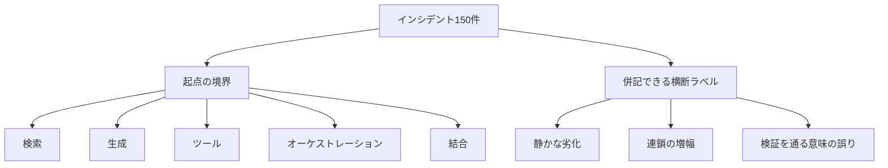

複合 AI システム、つまり検索、生成、ツール、オーケストレーションが組み合わさったシステムの本番障害を、失敗が始まった境界で分ける分類の読み方です。Rudrendu Kumar Paul と Sourav Nandy の [arXiv:2610.02503v1](https://arxiv.org/abs/2610.02503)（2026-10-01）は、インシデント 150 件を 5 境界と 23 モードにまとめ、5 つのレジリエンスパターンを故障注入で測っています。読後には、死活監視が緑のまま品質が落ちる失敗を、どの境界の計器で見るかの点検リストが残ります。改善率の数値は、著者らのテストベッドへ故障を注入した実験の中の値です。

*この記事の全体像。以下、順に解説します。*

## 複合AIシステムの失敗分類とは

この論文は、retriever、generator、tool、orchestrator が組み合わさった複合 AI システムの本番インシデント 150 件を、失敗が始まったコンポーネント境界で 5 分類し、23 の失敗モードへまとめた分類です。複合 AI システムという語は、モデル単体から、検索やツールや制御を組み合わせたシステムへの移行を指す使い方で、論文が参照する Zaharia らの解説「[The Shift from Models to Compound AI Systems](https://bair.berkeley.edu/blog/2024/02/18/compound-ai-systems/)」に沿っています。

著者は Rudrendu Kumar Paul（論文上の所属は Boston University）と Sourav Nandy（論文上の所属は University of Texas at Austin）です。公開版は arXiv:2610.02503v1 で、提出は 2026-10-01 21:25:25 UTC、ライセンスは CC BY 4.0 です。ICML 2026 のワークショップ "The Second Workshop on Agents in the Wild"（2026-07-11、HALL B2）のポスターとして、[公式バーチャル](https://icml.cc/virtual/2026/67983)に載っています。本文と同じ abstract はポスターページにあります。開催日 2026-07-11 と HALL B2 は、ワークショップページの表示と一致します。

分類と対で、5 つのレジリエンスパターンを 6 要素のテストベッドへ故障注入して測っています。論文は、分類を JSON schema として出し、注入スクリプトも practitioner resource にある、と書いています。

コーパスは 150 件です。内訳は次のとおりです。

- 公開のポストモーテムと Issue tracker が 97 件です。12 プロジェクトから取り、本文が名を挙げるのは LangChain、LlamaIndex、AutoGen、CrewAI、Haystack、DSPy です。
- 匿名の企業デプロイが 53 件です。収集期間は 2024-01 から 2025-12 です。

採録条件は、AI/ML コンポーネントが 2 つ以上相互作用し、文書化された原因分析があり、利用者に見える影響か on-call があることです。クラウドや DNS の外部障害は、複合システムの構造が増幅した場合を除いて採録しません。

コーディングは、研究者 2 名の独立コーディングのあと、親和図で 23 モードにしています。Cohen's κ は、2 回の突き合わせのあとで 0.84 と本文にあります。

5 分類の件数は、retrieval 38、generation 31、tool 29、orchestration 28、integration 24 です。合計は 150 です。本文の Table 1 が名前を出すモードは、分類あたり上位 3 つと Other です。個別名があるのは 15 個です。

失敗は、始まった境界で 1 つの分類に入ります。同じインシデントには、横断ラベルが別に付きます。横断ラベルは、5 分類と併記できる別軸です。

横断ラベルの割合は、silent degradation が 51%、cascade amplification が 34%、検証を通る semantic error が 22%、2 つ以上の同時が 11% です。横断ラベルは重ねて付くため、四つの割合の合計は 100% を超えます。

各境界の中身は、次の型です。

- retrieval は、インデックスとクエリの関係が壊れ、retriever 自体の死活は緑のままになる型です。
- generation は、受け取った文脈から出力を作る段の型です。
- tool は、外部 API の遅延、スキーマ、権限の型です。
- orchestration は、リトライ、待ち、未処理タスクの型です。
- integration は、境界をまたぐ型、文字コード、レートの型です。

実験のテストベッドは、query router、Qdrant の vector retriever、reranker、generator（GPT-4o-mini と Llama-3.1-8B）、API ツール 4 つの executor、LangGraph の orchestrator です。パターンは circuit breaker、output quality gate、component isolation、semantic validator、typed interface（本文では Pydantic）の 5 つです。

## 名前の付いた失敗モード

割合は論文 Table 1 の表記です。境界の件数は、150 件に対するその分類の件数です。

| 境界 | 件数 | 名前のあるモード | 論文の % |
|---|---|---|---|
| Retrieval | 38（25.3%） | Index drift / stale embeddings | 10.7 |
| Retrieval | 38（25.3%） | Query-document distribution shift | 7.3 |
| Retrieval | 38（25.3%） | Context poisoning via injection | 4.0 |
| Retrieval | 38（25.3%） | Other | 3.3 |
| Generation | 31（20.7%） | Hallucination under noisy context | 8.0 |
| Generation | 31（20.7%） | Output format regression | 5.3 |
| Generation | 31（20.7%） | Safety bypass via context manipulation | 4.0 |
| Generation | 31（20.7%） | Other | 3.4 |
| Tool | 29（19.3%） | API timeout cascade | 6.7 |
| Tool | 29（19.3%） | Schema drift | 5.3 |
| Tool | 29（19.3%） | Permission escalation via tooling | 4.0 |
| Tool | 29（19.3%） | Other | 3.3 |
| Orchestration | 28（18.7%） | Infinite retry / loop deadlock | 6.0 |
| Orchestration | 28（18.7%） | Agent starvation under load | 5.3 |
| Orchestration | 28（18.7%） | Dead-letter task accumulation | 4.0 |
| Orchestration | 28（18.7%） | Other | 3.4 |
| Integration | 24（16.0%） | Type coercion at boundaries | 5.3 |
| Integration | 24（16.0%） | Encoding mismatch（UTF-8 と token） | 4.7 |
| Integration | 24（16.0%） | Rate limit exhaustion cascade | 3.3 |
| Integration | 24（16.0%） | Other | 2.7 |

本文が挙げる具体例は、次の 5 件です。

導入の RAG は 11 日動き、F1 が 0.82 から 0.59 になりました。index rebuild が embedding の正規化を変え、top-k の 40% が無関係でした。死活監視は通りました。

企業の 1 件では、再インデックスが text-embedding-ada-002 から text-embedding-3-small へ切り替わり、クエリ側のエンコーダは古いままでした。cosine の平均は 0.78 から 0.41 で、9 日後に苦情が出ました。

timeout の 10 件中 8 件では、遅いツール 1 つが数分でスループットを 60% から 80% 下げました。

無限リトライの 1 件は、週末の API コストが $2,400 でした。exponential backoff が無く、壊れた JSON がリトライ除外リストにありませんでした。

型の 1 件は、0.85 が往復で 0.8500000000000001 になり、厳密等価で結果の 23% が落ちました。

## 五つのレジリエンスパターン

本文がパターンを置いている場所と、テストベッド上の費用は次のとおりです。

| パターン | 本文が置いている場所 | テストベッド上の費用 |
|---|---|---|
| Circuit breaker | コンポーネントの失敗が下流へ待ちとして伝わる段。semantic な品質も見る。HTTP 200 の劣化はステータスだけでは開かない | 通常時 2ms 未満。開いたあとのクールダウン 30 秒 |
| Output quality gate | retriever と generator の間、および generator と最終出力の間 | 中央値 +120ms。支配的なのは文脈との factual consistency |
| Component isolation | ツールのレートやメモリが、retriever と generator の予算を食わないように分ける | ピークメモリ +18% |
| Semantic validator | 構造は正しい出力の意味。ツールの値が定義域に入るか、応答が元の問いに答えているか | 80ms から 150ms |
| Typed interface | 境界ごとの実行時の型。緩い JSON の往復を置き換える | 境界ごとに 5ms から 15ms |

circuit breaker を開く閾値は、30 秒に 5 失敗です。quality gate の一つは、mean cosine が τ=0.62 を超えるかです。論文はこの τ を "calibrated" とだけ書いています。

論文は、レイテンシに敏感な経路では quality gate を同期で止めず、記録してアラートにする、と書いています。同期で止めるのは high-stakes の出力に限る、という切り分けです。

## 注意点

見出しのパーセンテージは、この論文のテストベッドと、このコーパスの定義の中の数値です。自環境の MTTR が 71% 下がる、という予測には使えません。測り方は次のとおりです。

| 見出しの数 | 論文本文での定義 | 比較や分母 |
|---|---|---|
| cascade depth −89% ± 4% | 平均 3.8 コンポーネントから 0.4。(3.8−0.4)/3.8 = 89.5% | 注入実験。閾値は 30 秒に 5 失敗で breaker を開く |
| silent degradation の 73% ± 6% を捕捉 | quality gate が見つけた割合 | 利用者に届く前、という本文の言い方。ゲートの一つは mean cosine が τ=0.62 を超えるか |
| blast radius −64% ± 5% | 同時リクエストの 78% から 28%。(78−28)/78 = 64.1% | isolation。ピークメモリは +18% |
| semantic error の 81% ± 7% を捕捉 | schema を通過した意味の誤り | silent degradation の 73% とは別の行 |
| integration failure −92% ± 3% | typed interface が taxonomy 上の integration 失敗を減らした割合 | tool 失敗の割合ではない |
| MTTR −71% | 8.4 ± 2.1 分対 28.7 ± 5.3 分。(28.7−8.4)/28.7 = 70.7% | 3 パターン以上。比較対象は unstructured monitoring のみ |
| 単一パターンは 40% 以下 | 単独で扱う failure mode の割合 | MTTR の削減率ではない |

論文は、本番ではこの実験を走らせていない、と Section 6 に書いています。20 要素以上、入れ子のエージェント、human-in-the-loop は対象外です。exponential backoff 付きの標準リトライとの比較は future work です。

[公式スライド](https://icml.cc/media/icml-2026/Slides/67983_Kw11iGs.pdf)は、同じ見た目の数字を別の文で使っています。ワークショップページはワークショップ全体の案内です。この論文の要約として使うのは、ポスターページにある abstract です。スライドと本文を混ぜると、パターンを境界へ一対一で割り当てる仕様は作れません。数値は本文の定義だけを使います。

- 81% を "silent inter-component degradation" と書き、対応表では Integration に置いています。本文の 81% は schema 通過後の semantic error で、silent の捕捉率は quality gate の 73% です。
- 92% を "boundary failure reduction" と "Tool Failures" に置いています。本文の Table 2 は integration failures です。
- 単一パターンの 40% を MTTR 削減と書いています。本文の 40% は mode coverage です。
- 評価を "matched incident cohorts" と書いています。本文の実験節は、モードあたり 1 本の著者設計の注入で、100 trials です。

「境界で整理した最初の体系的分類」は結論節の主張です。それより前に、別の切り口の分類が公開されています。この論文が関連研究で距離を置いているものも含みます。

| 先行 | 切り口 | この論文との関係 |
|---|---|---|
| [MAST](https://arxiv.org/abs/2503.13657)（arXiv:2503.13657v3、最終改訂 2025-10-26）。リポジトリは [multi-agent-systems-failure-taxonomy/MAST](https://github.com/multi-agent-systems-failure-taxonomy/MAST) | マルチエージェントの 14 モード、3 分類。taxonomy 構築は 150 traces、κ=0.88。データセットは 7 フレームワークの 1600+ traces | 論文は協調層に限ると要約しています。orchestration 1 枠に畳むと、specification と task verification は残りません |
| [AgentErrorTaxonomy](https://arxiv.org/abs/2509.25370)（arXiv:2509.25370、2025-09-29）。コードは [ulab-uiuc/AgentDebug](https://github.com/ulab-uiuc/AgentDebug) | memory、reflection、planning、action、system-level operations | この論文の参考文献の Zhu et al. 2026（フレームワークのバグ）とは別論文です。memory と planning は 5 境界の名前にありません |

論文はほかに、LLM 応用の 15 モードを扱う研究（Vinay、arXiv:2511.19933）と、推論サービスの 156 件を扱う研究（Ranganathan et al.、arXiv:2511.07424。inference engine が 60%、そのうち timeout がおおよそ 40%、という論文本文の要約）を引用しています。この 60% と 40% は論文の引用要約であり、引用先 HTML を本稿では再読していません。serving の timeout は、5 境界の外に残りえます。

コーパスの頻度にも条件があります。silent degradation の 51% と、検知まで平均 4.2 日（クラッシュは 12 分）は、文書化されたインシデントの中の割合です。チケットにならなかった劣化は母集団に入りません。論文はこの打ち切りを限界節に書いていません。51% と 11% は 150 で割ると整数 1 件に一意には戻りません（76/150=50.7%、77/150=51.3%。16/150=10.7%、17/150=11.3%）。

Table 1 の Other のうち、generation と orchestration の 3.4% は、150 件に対する整数件数を小数第 1 位へ四捨五入した結果にはなりません。上位 3 モードの表示（8.0 / 5.3 / 4.0 と 6.0 / 5.3 / 4.0）から一意に決まる件数は 12+8+6=26 と 9+8+6=23 で、残余はどちらも 5 件です。5/150=3.333…% は 3.3 になります。印字の 3.4 は、カテゴリ合計の表示（20.7 と 18.7）に合わせた値に見えます。retrieval が 38 件で最多、という大小はこの 0.1 ポイントでは逆転しません。モード単位の優先順位を 0.1 ポイント差で切る根拠にはしません。

2.3 倍（retrieval の劣化が下流の generation error を増やす、という本文の一文）は、算出手順が本文にありません。推奨の根拠にしません。$2,400 の週末コスト、cosine 0.78 から 0.41、F1 0.82 から 0.59、結果の 23% 欠落は、いずれも本文が挙げる個別事例です。

2026-10-06 時点で、taxonomy の JSON schema と注入スクリプトの URL は、6 ページの PDF と HTML にありません。GitHub のリポジトリ検索 `2610.02503` は 0 件でした。コード検索は 52 件で、先頭は論文索引とニュース要約でした。OpenReview（forum id `06K05My3td`）の添付本文は、同日時点で取得できていません。DOI 10.48550/arXiv.2610.02503 は abs 上、DataCite 登録が pending です。著者の所属は論文の表記です。撤回告知と、この数値に対する独立した再実験は、同日までに見つかっていません。提出から 5 日です。

突き合わせ前の κ、企業 53 件の組織数、τ=0.62 を評価の 100 trials とは別のデータで決めたか、MTTR の時計がテストベッドの自動回復なのか人の作業を含むのかは、本文にありません。factual consistency の手続きと、semantic validator の定義域の決め方も、本文にありません。名前の無い 8 モードは、schema が公開されるまで点検表に書けません。

## 監視を足す順序

ハーネスの監視は、モデルの応答品質とは別に、境界ごとに「何が緑なら次へ渡すか」を置きます。置く場所の候補は、この論文の 5 境界です。最初の点検は、本文が名前を出した次の 8 つで足ります。改善率は期待値にしません。23 モードの完全な一覧としても扱いません。

1. retrieval では、インデックスとクエリで embedding モデルと正規化が一致しているかを見ます。一致しない再インデックスは、死活ではなく類似度の分布で見ます。
2. retrieval から generation では、渡した文脈の関連が、事前に決めた閾値を下回ったら生成へ渡しません。閾値の 0.62 は、このテストベッドの較正値なので、コピーしません。
3. generation では、出力が渡した文脈に対して矛盾していないかを見ます。形式が壊れた回帰（output format regression）は、意味の検査とは別の検査にします。
4. tool では、タイムアウトがオーケストレータの待ちを増やしていないかを見ます。スキーマの破壊的変更は、200 番の成功と分けて数えます。
5. orchestration では、リトライに backoff と除外条件があるかを見ます。dead-letter が溜まっていないか、負荷時にエージェントが飢えていないかを見ます。
6. integration では、境界の型を実行時に検査します。浮動小数の等価は、丸め後の値で比較します。レートの予算はコンポーネントごとに分けます。
7. 遮断では、breaker を開く条件を HTTP ステータスだけにしません。本文は、開いたあとは定型のフォールバックを返し、クールダウン中に下流を待たせない、と書いています。通常時の費用は 2ms 未満、クールダウンは 30 秒です。
8. 影響範囲では、ツールの失敗が同時リクエストの何割に広がったかを、コンポーネント内のエラー率とは別の計器にします。

計画に書いてよいのは、自環境の記録で件数がある境界に、死活以外のゲートを足すことまでです。MTTR が 71% 下がる、という数は、比較対象が unstructured monitoring だけの実験結果なので、計画の期待値には使いません。自環境で先に直す境界は、この 150 件の順位ではなく、自分の障害記録に多い境界です。論文の順位は、文書化された事故の中の順位です。スライドの対応表（typed interface を tool へ、semantic validator を integration の silent 捕捉へ）では設計しません。

優先度は、次の順で決めます。

1. 自分のインシデントに、上の 8 つのどれが何件あるかを数えます。件数が無い境界からパターンを足しません。
2. 件数がある境界について、今の計器がコンポーネントの死活だけかを見ます。死活だけなら、その境界の意味のゲートを足します。
3. ゲートを同期で止めるのは、誤出力の被害がレイテンシより大きい経路だけにします。それ以外は記録してアラートにします。閾値は写しません。

次のどれかが起きたら、上の順序を入れ替えます。

- OpenReview か著者のリポジトリに 23 モードの schema と注入ログが出て、本文の Table 2 を第三者の再実行が再現したら、効果量の扱いを見直します。
- 自分の記録で、失敗の起点が memory や planning に偏るなら、5 境界より AgentErrorTaxonomy のモジュールを先に計器化します。
- 自分の記録がマルチエージェントの役割齟齬に偏るなら、MAST の 3 分類を先に計器化します。

5 分類の件数は合計 150 で、retrieval が最多という大小は Table 1 から読めます。死活が緑のまま品質が落ちる導入事例は、境界を計器しないと見えない失敗の説明として本文にあります。cascade depth の 89% と MTTR の 71% は、本文が示した平均からの算術と一致します。論文自身が、ベースラインの弱さとテストベッドの狭さを Section 6 に書いています。使える範囲は、どこを見るかの候補と、名前のある 15 モードを点検リストの種にすることまでです。

## まとめ

複合 AI の本番障害 150 件は、失敗が始まった境界で retrieval、generation、tool、orchestration、integration に分かれます。死活が緑のまま落ちる品質は、その境界に「何が緑なら次へ渡すか」を置かないと見えません。パターンの改善率は、著者らの注入実験と比較対象の中の値なので、自環境の MTTR 計画には写しません。公式スライドは同じ百分率を別の対象に使っているため、割り当ては本文の表だけを使います。先に数えるのは自分の障害記録で、件数がある境界から意味のゲートを足します。

この記事が少しでも参考になった、あるいは改善点などがあれば、ぜひリアクションやコメント、SNSでのシェアをいただけると励みになります！

## 参考リンク

- Paul, R. K. and Nandy, S. Compound AI System Reliability: A Failure Taxonomy and Resilience Pattern Catalog from 150 Production Incidents. arXiv:2610.02503v1, 2026-10-01. [abs](https://arxiv.org/abs/2610.02503) / [HTML](https://arxiv.org/html/2610.02503)
- ICML 2026 virtual poster. <https://icml.cc/virtual/2026/67983>
- Workshop page. The Second Workshop on Agents in the Wild. 2026-07-11. <https://icml.cc/virtual/2026/workshop/54082>
- Slides PDF. <https://icml.cc/media/icml-2026/Slides/67983_Kw11iGs.pdf>
- Cemri, M. et al. Why Do Multi-Agent LLM Systems Fail? arXiv:2503.13657v3, revised 2025-10-26. <https://arxiv.org/abs/2503.13657>
- MAST repository. <https://github.com/multi-agent-systems-failure-taxonomy/MAST>
- Zhu, K. et al. Where LLM Agents Fail and How They can Learn From Failures. arXiv:2509.25370, 2025-09-29. <https://arxiv.org/abs/2509.25370>
- AgentDebug repository. <https://github.com/ulab-uiuc/AgentDebug>
- Zaharia, M. et al. The Shift from Models to Compound AI Systems. BAIR Blog, 2024. <https://bair.berkeley.edu/blog/2024/02/18/compound-ai-systems/>
- Fowler, M. CircuitBreaker. <https://martinfowler.com/bliki/CircuitBreaker.html>
