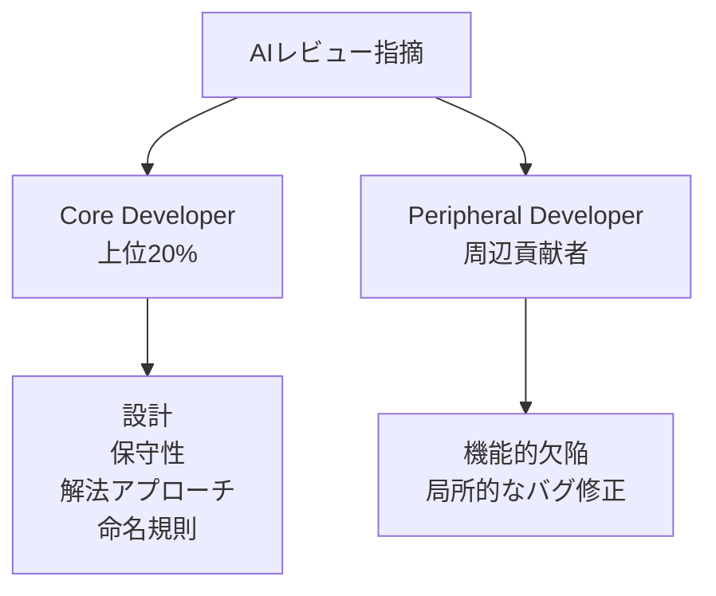

## この記事の対象と得られるもの

対象は、AI コードレビューエージェント (GitHub Copilot / Cursor / Codex など) をチームに導入している、あるいは導入を評価している方です。

得られるものは 3 つです。

- AI の指摘が**実際に直されるかどうか**を決める構造的な条件
- 指摘が放置・拒絶されるときの典型パターンと、その裏にあるメカニズム
- 「検出件数」ではなく「解決率」でツールを評価するための、具体的な運用の勘所

材料は、GitHub 上の Python リポジトリ 342 件から集めた **54,791 件の AI 生成レビューコメント**を分析した実証研究です ([arXiv:2607.21997](https://arxiv.org/abs/2607.21997))。論文タイトルは "Go Home Copilot, You're Drunk": Understanding Developer Responses to Agent-Generated Code Review Comments で、開発者が実際に書いた拒絶コメントがそのまま題名になっています。

## なぜ「検出件数」で評価すると失敗するのか

AI レビューツールの比較記事や PoC レポートは、たいてい「バグを何件検出できたか」を並べます。しかしこの指標は、導入後の価値をほとんど説明しません。

理由は単純で、**指摘は直されて初めて価値になる**からです。直されない指摘は、開発者に確認コストだけを課します。

この研究が評価軸に据えたのが **解決率 (Resolution Rate)** です。「その指摘を受けて、開発者が実際にコードを修正しコミットしたか」を測ります。件数ではなく行動を見る指標です。

先行研究 (Goldman et al., 2025 ほか) でも、LLM 生成レビューコメントの **60〜70% が未解決**のまま終わることが報告されています。つまり検出件数を積み増すほど、未解決コメントの山も比例して積み上がります。これが Review Fatigue (レビュー疲れ) の正体です。

冒頭の「Go home Copilot, you're drunk」という開発者の反応は、精度を欠いた大量指摘に対するコミュニティの反発を象徴しています。

## 何が指摘の解決を決めるのか

研究チームはロジスティック回帰と統計検定 (Mann-Whitney U 検定 / カイ二乗検定) で、解決を予測する要因を抽出しました。結論は明快です。

| 要因 | 解決への影響 |
|---|---|
| インラインコード修正案 (`suggestion` ブロック) の添付 | 最も強い正の予測因子 |
| 簡潔・焦点の絞られた指摘 | 正の影響 |
| 長文・複雑な解説コメント | 放置・無視されやすい |

### 決め手はインライン修正案

GitHub の PR レビューには、`suggestion` 記法のコードブロックで「置き換え後のコード」を提示する機能があります。レビュイーは **Commit suggestion ボタン 1 クリック**で取り込めます。

このブロックが添付されたコメントが、最も高い確率で解決・コミットされていました。指摘の内容そのものより、**適用の摩擦がゼロに近いかどうか**が効いているということです。

````markdown
<!-- PR レビューコメント本文。解決されやすい形 -->
`timeout` が未指定です。ハングを避けるため明示してください。

```suggestion
response = requests.get(url, timeout=30)
```
````

### 長文の解説は逆効果

一方で、文字数の多い複雑な解説文は認知負荷を上げ、読み飛ばされる傾向が強く出ました。

「〜をより堅牢に修正することを検討してください」という定性的な長文は、読む側に「で、具体的に何をどう書き換えるのか」の翻訳作業を丸投げします。その翻訳コストが、修正そのもののコストを上回った時点で放置されます。

つまり **AI レビューの品質は、正しさだけでなく「アクション可能性 (Actionability)」で決まる**というのが、この研究の中核的な主張です。

## エージェントごとの得意領域は分かれている

分析対象の内訳は、Copilot が 33,265 件、Cursor が 4,554 件、Codex が 1,242 件です (Claude 28 件、Devin 50 件はサンプル不足のため比較統計から除外)。

| エージェント | 主要な解決カテゴリ | 特徴 |
|---|---|---|
| Copilot | 解法アプローチ 21.8% / ドキュメント 19.8% / 機能欠陥 18.1% | 解決済みコメント全体の 72.9% を占める汎用型 |
| Cursor | 機能的欠陥 88.0% (4,006/4,554) | バグ・ロジックエラー検出に高特化 |
| Codex | 機能的欠陥 88.6% (1,100/1,242) | ロジック・リソース問題に高特化 |

読み取れることは 2 点です。

1. **Copilot は広く浅くカバーする汎用レビュアー**。ドキュメントや命名まで含め、リポジトリ全般の品質を底上げする位置づけです。
2. **Cursor / Codex は機能バグに集中する**。解決された指摘のほぼ 9 割が機能的欠陥であり、「バグ検出器」として使ったときの受容率が高いことを示します。

ただし Copilot のシェア 72.9% は、そのまま「Copilot が優れている」という意味ではありません。GitHub 標準で導入障壁が低く、母数が圧倒的に大きいことの反映でもあります。カテゴリ構成比のほうが、ツール選定の判断材料としては有効です。

## 誰が指摘を引き受けるのか

研究では、リポジトリでの PR 作成・レビュー実績の上位 20% を **Core Developer**、それ以外を **Peripheral Developer** と定義し、解決挙動を比較しています。



- **Core dev が解決の大半を担う**。たとえば Copilot の指摘のうち **78.1% は Core dev によって解決**されています。設計・保守性・解法アプローチ・命名規則といった、リポジトリ全体像の理解を要する指摘がここに集まります。
- **Peripheral dev は機能バグで存在感を出す**。局所的なバグ修正であれば、リポジトリの全容を知らない貢献者でも AI の指摘に従って直せるためです。

この非対称性は運用上の含意を持ちます。設計・アーキテクチャに関する指摘は、**チームで最も希少な認知資源である Core dev の時間を消費する**ということです。ここに誤指摘を混ぜると、コストが跳ね上がります。

## 直されない指摘の 10 パターン

未解決のまま終わった 15,652 件のコメントのうち、返信のあった 470 スレッド (Core dev 返信 284 件 / Peripheral dev 返信 186 件) をオープンカードソーティングで分類し、10 パターンが特定されました。

| # | パターン | 内容 |
|---|---|---|
| 1 | Intentional Design Decision | プロジェクト固有の文脈・制約に基づき意識的にそう書いている |
| 2 | Incorrect Suggestion | コードや API の挙動を誤解した偽陽性・ハルシネーション |
| 3 | Challenging Agent Feedback | 根拠に疑問を呈し、AI に検証を求め直す |
| 4 | Suggestions Deferred | 有効性は認めるが別 PR・将来タスクへ延期 |
| 5 | Delegation of Work | 対応を別の開発者や AI ツールへ移譲 |
| 6 | Dismissed as Low-Value | 無用・有害として即時却下 |
| 7 | Needs Further Discussion | AI の指摘を契機に人間同士の議論が始まる |
| 8 | Acceptable Trade-offs | 性能や単純さとの引き換えとして現状維持 |
| 9 | Missed Existing Fix | すでに対応済みの問題を重複指摘 |
| 10 | Other Context-bound Failures | その他の文脈不適合 |

未解決理由の大部分は、**1. 意図的設計**と **2. 誤指摘**の 2 つに集約されます。

### 意図的設計との衝突は構造的な限界

具体例として、Docker のストリームにログを直接流す設計や、null ハンドリングよりも実行時例外を意図的に選ぶ判断が挙げられています。どちらも「一般論としては悪い」が「このプロジェクトでは正しい」実装です。

AI エージェントはリポジトリのコードをパースします。しかし、ドキュメント化されていない**過去の決定経緯・インフラ上の制約・チームのコーディング選好**は読めません。したがって、意図的な選択を「バグ」「コードスメル」と誤判定する構造は、モデルの賢さだけでは解消しません。

### 感情的な却下は精度への評価そのもの

パターン 6 には「Comment is not helpful」「No it isn't, go home copilot you're drunk」といった反応が含まれます。個々の指摘への苛立ちに見えますが、実質的には**そのツールに対する信頼の失効**を示すシグナルです。一度失効すると、正しい指摘まで読まれなくなります。

## 実務にどう落とすか

以上を踏まえた、導入・運用の具体策です。

### 1. 評価指標を解決率と対話コストに変える

PoC の評価シートから「検出件数」を外します。代わりに次の 2 つを測ります。

- **解決率**: 指摘のうち何 % が受容され、修正コミットにつながったか
- **対話コスト**: 反論・確認・議論に費やした時間

計測は難しくありません。GitHub の PR API から、bot アカウントのレビューコメントと、その後の同一ファイル・同一行への変更コミットの有無を突き合わせれば近似できます。パターン 3 (反論) やパターン 6 (却下) の返信数を数えれば、対話コストの代理指標になります。

### 2. 出力規約として `suggestion` を必須化する

エージェントのシステムプロンプトやレビュー規約に、次を明記します。

- 修正案は可能な限り `suggestion` ブロック形式の具体コードで出す
- 具体コードを出せない指摘は、そもそも投稿しない (または低優先度に落とす)
- 1 コメント 1 論点。背景説明は最小限にする

「より堅牢にしてください」型の抽象指示を排除するだけで、放置率は下がります。

### 3. 指摘カテゴリごとに通知先と閾値を分ける

Core dev の認知資源を守るための配分です。

| 指摘カテゴリ | 方針 |
|---|---|
| 機能的欠陥 | 積極的に拾う。Peripheral dev でも解決可能 |
| 設計・アーキテクチャ | 確信度が高い場合のみ通知。件数を絞る |
| ドキュメント・命名 | まとめて低優先度で提示。個別に割り込ませない |

### 4. 拒絶理由をコードベースに還元する

パターン 1 (意図的設計) は、放置すると**毎回同じ誤指摘が再発するループ**になります。開発者が「あえてこうしている」と返信したら、その理由をコードコメントや ADR (Architecture Decision Records) として残します。

さらに、その ADR をレビューエージェントのコンテキストに含める運用にすれば、同じ偽陽性を繰り返さない仕組みになります。**拒絶ログは捨てるものではなく、次のレビュー精度への入力**という位置づけです。

## この研究の限界

そのまま自社に当てはめる前に、押さえておくべき制約が 3 つあります。

1. **対象は OSS の Python リポジトリ 342 件**。静的型付け言語 (Go / Rust / TypeScript / Java) では、コンパイラが機能欠陥の一部を先に捕捉するため、AI レビューの指摘カテゴリ構成も解決率も変わり得ます。
2. **企業内のクローズドなリポジトリは含まれない**。社内コーディング標準やレビュー承認フローが存在する環境では、拒絶パターンの分布が変わる可能性があります。
3. **Claude (28 件) / Devin (50 件) はサンプル不足で比較統計から除外**されています。この 2 つについては本研究から性能差を読み取れません。

また、著者らが挙げる未解決の問いとして、次の 3 点があります。

- 型システムの強い言語環境で、解決率と指摘カテゴリはどう変化するか
- Reviewer Agent の指摘を Coder Agent が修正する「AI-in-the-Loop」で、どこまで品質を保ったまま閉じられるか
- 1 クリック適用の常態化が、開発者のコード所有権意識やドメイン理解を希薄化させないか

3 点目は、実務としても無視できません。`suggestion` の適用が容易であるほど、内容を検証せずマージする誘因が働きます。解決率を上げる施策は、同時に**無検証適用のリスクを上げる施策**でもあります。解決率だけを KPI にせず、適用後の不具合率とセットで見るのが安全です。

## まとめ

- AI コードレビューの価値は検出件数ではなく **解決率 (Resolution Rate)** で測る。LLM 生成コメントの 60〜70% は未解決に終わる
- 解決の最大の予測因子は **インラインコード修正案 (`suggestion` ブロック)**。長文・複雑な解説は放置されやすい
- エージェントには得意領域がある。Cursor / Codex は解決済み指摘の約 88% が機能的欠陥、Copilot は広く浅い汎用型
- 指摘の解決は **Core Developer に偏る** (Copilot では 78.1%)。設計系の指摘は希少な認知資源を消費するので、確信度で絞る
- 未解決の 2 大要因は **誤指摘 (ハルシネーション)** と **意図的設計決定**。後者は拒絶理由を ADR 化してエージェントに還流させることで再発を防げる
- 対象は OSS の Python リポジトリ 342 件。型付け言語や企業内リポジトリへの外挿には注意する

## 参考リンク

- [arXiv:2607.21997 — "Go Home Copilot, You're Drunk": Understanding Developer Responses to Agent-Generated Code Review Comments (2026)](https://arxiv.org/abs/2607.21997)
- [arXiv:2508.18771 — Sun et al., Does AI Code Review Lead to Code Changes? A Case Study of GitHub Actions (2025)](https://arxiv.org/abs/2508.18771)
- [arXiv:2601.18345 — Robbes et al., Promises, Perils, and (Timely) Heuristics for Mining Coding Agent Activity (2026)](https://arxiv.org/abs/2601.18345)
- Goldman et al., What types of code review comments do developers most frequently resolve? Proceedings of ASE 2025
- Frömmgen et al., Resolving code review comments with machine learning. Proceedings of ICSE-SEIP 2024
