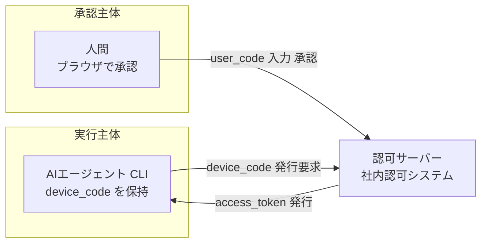
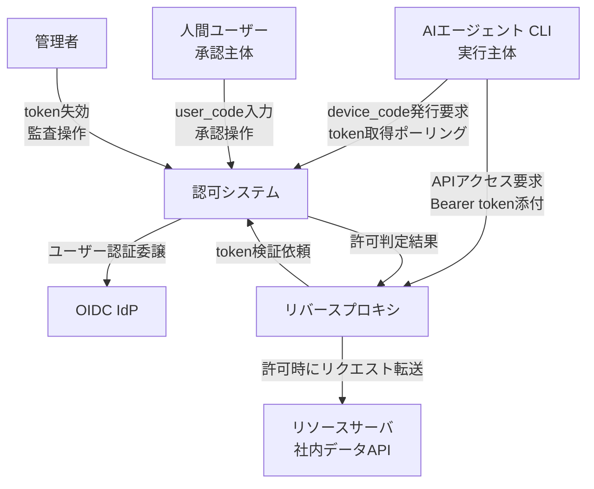
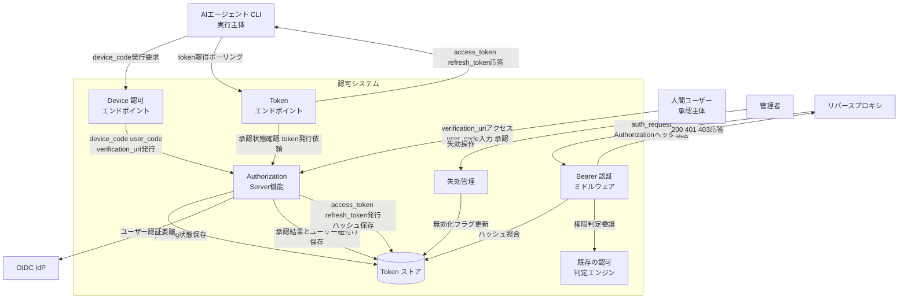
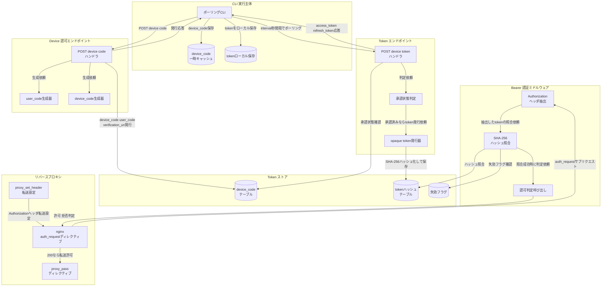
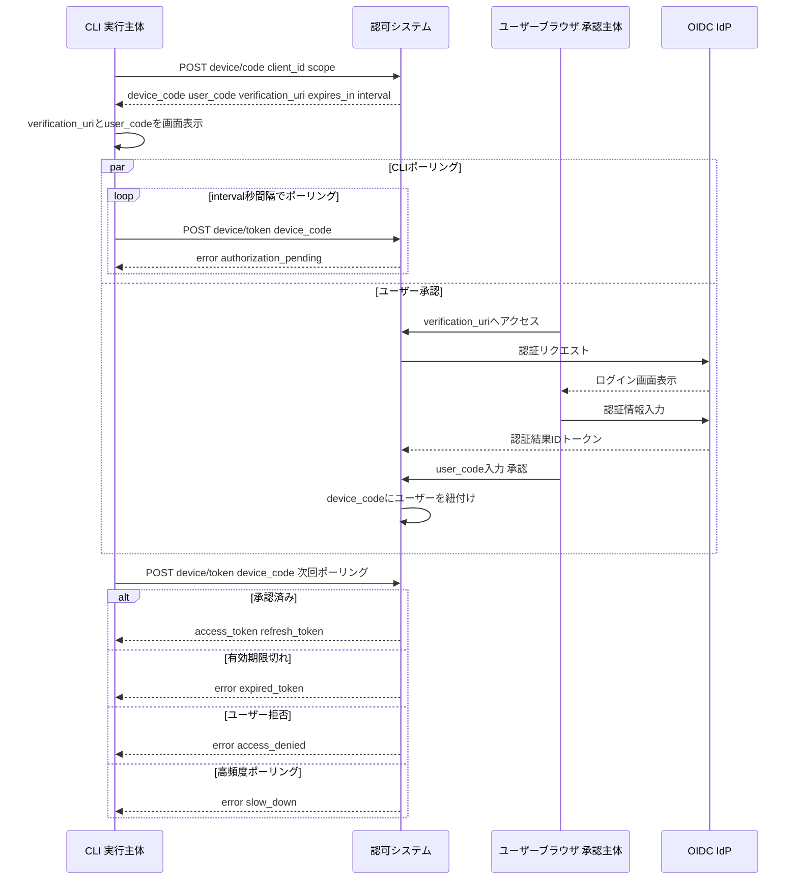
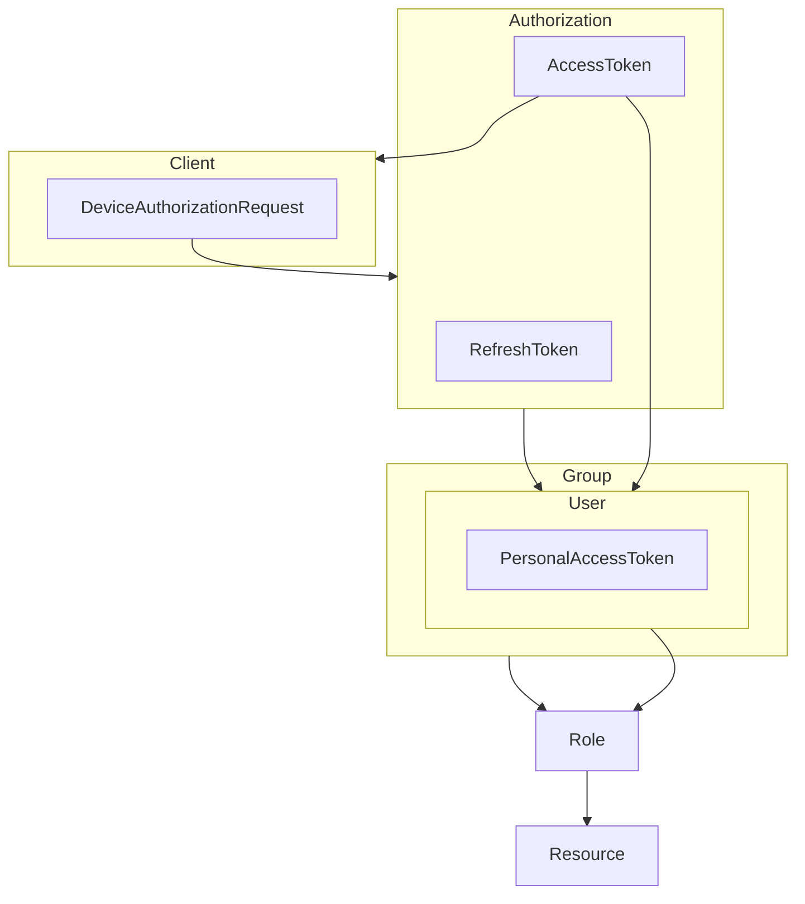
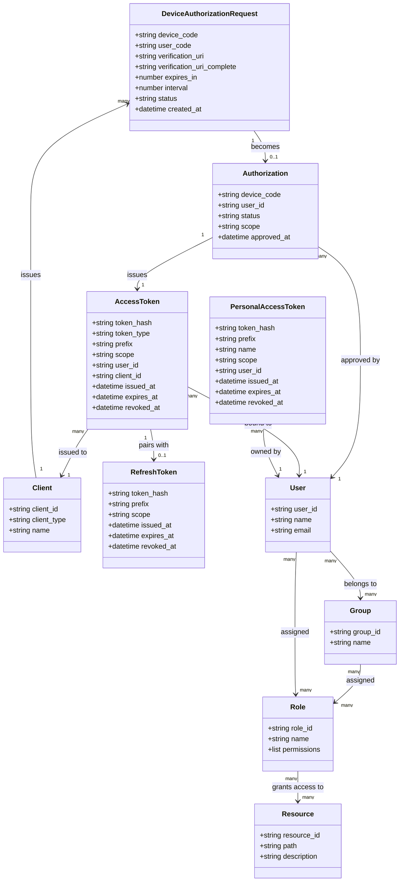
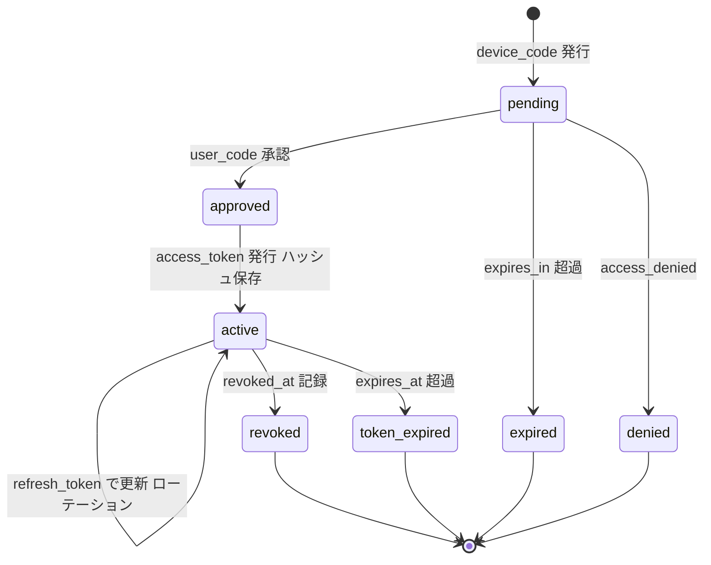
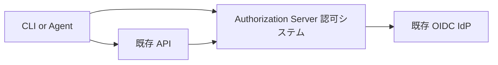
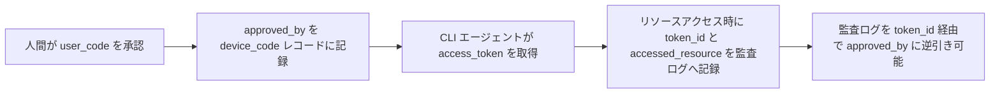

OAuth 2.0 Device Authorization Grant(Device Flow、RFC 8628)を、ブラウザを持たない AI エージェントや CLI へ適用し、実行主体(エージェント)と承認主体(人間)を構造的に分離する認可アーキテクチャの調査です。起点はエムスリーの社内レポート配信システムへの実装事例(2026-07-15 公開)です。

> 本記事は 2026-07-16 時点の RFC 8628・MCP Authorization 仕様と、エムスリーの実装事例(2026-07-15 公開)に基づく技術調査です。RFC が規定しない実装選択には「実装案」と明記しています。

## 概要

### 目的・位置づけ

この認可パターンは、**ブラウザを持たない AI エージェントに、社内データへのアクセス権を安全に与える**ための仕組みです。

OAuth 2.0 Device Authorization Grant(Device Flow、RFC 8628)を応用します。RFC 8628 は本来、スマート TV やプリンタなど「ブラウザがない、または入力が制限されたデバイス」向けの拡張です。この特性が、Claude Code のような **CLI/エージェント実行環境**にも当てはまります。

起点はエムスリーの社内レポート配信システムへの実装事例です。既存の認可システム自身を Authorization Server 化し、インフラを追加せずに導入しています。

### 解決する課題

既存の「人間 + ブラウザ」前提の認可システムには、次の課題がありました。

| 課題 | 内容 |
|---|---|
| ブラウザレス環境からアクセスできない | 踏み台サーバやコンテナ内シェルからレポートを取得できない |
| セッション Cookie をエージェントに渡せない | Cookie を使うセッションはユーザーの認可コンテキスト全体を利用可能にする。エージェント単位での失効ができない |
| 恒久 API キーはリスクが高い | 有効期限がなく、漏えい時の影響範囲が大きい。個人の権限をエージェントへ丸ごと委譲してしまう |
| セッションの権限モデルが粗すぎる | セッションはユーザーの全権限そのもの。エージェント用に権限を絞れない |

これらに共通する本質は、**「誰が実行したか」と「誰が承認したか」を区別できない**ことです。Device Flow は、この 2 つを別チャネルに分離します。なお本記事の「実行主体」は OAuth client のロールを指し、エージェント実体そのものの認証・identity ではありません(この限界は後述の attribution で扱います)。



### 関連技術との関係

| 技術 | この認可パターンとの関係 |
|---|---|
| OAuth 2.0 Authorization Code + PKCE | 人間がブラウザで直接ログインする標準フロー。エージェント自身にブラウザがないと成立しない |
| OAuth 2.0 Client Credentials | クライアント自身が主体になる M2M(Machine to Machine)フロー。人間の承認ステップを持たない |
| OAuth 2.0 Device Authorization Grant(RFC 8628) | 本パターンの土台。本来はブラウザレスデバイス向けだが、AI エージェントにも同じ制約構造が当てはまる |
| OIDC(OpenID Connect) | 人間の**認証**(誰であるか)を担う層。本パターンでは既存 SSO の OIDC IdP に認証を任せ、認可システムは CLI 用トークンの発行・検証だけを担当する。責務を分離することで IdP 側の改修を避けている |
| PAT(Personal Access Token) | Web UI から手動発行し、CLI にコピーする opaque token(有効期限・失効管理あり)。本パターンでは Device Flow 導入前の Phase 1 として先行採用され、トークン保存形式・Bearer 認証ミドルウェア・失効管理の基盤を共通化する土台になる |
| MCP(Model Context Protocol)Authorization | MCP は認可自体を任意(OPTIONAL)とし、採用する HTTP 実装では OAuth 2.1 ベースに従い、Authorization Code を扱う MCP client には PKCE を必須(MUST)としている。STDIO 転送では認可仕様の適用対象外として環境変数からの資格情報取得に委ねている。Device Flow は、ブラウザを起動できないエージェント実行環境の隙間を埋める選択肢にあたる |

### 他方式との比較

| 比較項目 | Authorization Code + PKCE | Client Credentials | PAT / 長期 API キー | Device Authorization Grant(RFC 8628) |
|---|---|---|---|---|
| ブラウザ要否 | 必要(本事例が比較した loopback 型 CLI ではブラウザ起動とクライアント側 redirect 受信が必要。Web client なら client サーバがリダイレクトを受ける) | 不要 | 発行時のみ必要、以降は不要 | エージェント側は不要。承認する人間側は別デバイスで必要 |
| 承認チャネルの分離 | なし(client 側で承認まで完結) | なし(人間の承認ステップ自体が無い) | 部分的(発行時のみ人間が別途承認) | 明確(承認は別デバイス・別チャネルの人間、client はポーリングで受領。`device_code` はエージェント ID ではない点に注意) |
| トークン形式 | Bearer access token(JWT または opaque)+ refresh token | Bearer access token(多くは JWT、audience 固定) | opaque token(プレフィックス付き、DB にはハッシュのみ保存) | access_token(refresh_token は任意。本事例は発行)。形式(JWT/opaque)・prefix・保存方式は AS 実装依存で RFC 8628 は規定しない。本事例は opaque + prefix + ハッシュ保存 |
| 失効の即時性 | 発行者依存。JWT は有効期限切れまで待つ運用になりがち | 発行者依存。多くは有効期限切れ待ち | 高い(DB 該当行を無効化するだけ) | AS 実装依存。本事例は opaque token を採用し、DB 行無効化で即時反映 |
| エージェント適合性 | 低い(ブラウザレス環境で起動不可) | 中(クライアントごとに資格情報を発行すれば個別監査・失効は可能だが、人間の承認記録は持たない) | 高い(実装が簡単。ただし手動コピー運用のため失効漏れ・使い回しのリスクがある) | 高い(ブラウザレス実行と人間承認を両立) |

## 特徴

- **実行主体と承認主体の分離**: エージェントは device_code を保持するだけで、セッション Cookie など人間の権限そのものは受け取らない。人間はブラウザで「このエージェントを承認する」行為を明示的に行う
- **opaque token による即時失効**: トークンを自己完結型の JWT にせず不透明な文字列にする。DB の該当行に失効時刻を打つだけで、次のリクエストから確実に拒否できる
- **既存 RBAC(Role-Based Access Control)の無改修**: Bearer 認証をミドルウェアとして追加するだけで済む。トークンからユーザーを解決した後は、既存のセッション認証と同じ認可判定(ユーザー・グループ・ロールとリソースの紐付け)をそのまま流用できる
- **PAT 先行のインクリメンタル導入**: いきなり Device Flow を作るのではなく、Phase 1 で PAT(Web UI 発行・手動コピー)を先行導入し、トークン保存形式・Bearer 認証ミドルウェア・失効管理という基盤を検証する。Phase 2 で Device Flow を同じ基盤の上に載せることでリスクを抑える
- **インフラ追加ゼロ**: 既存の認可システム自身が Authorization Server を兼ねる設計により、新規サービスや API Gateway の追加が不要。既存 nginx 設定の変更も最小限で済む
- **認証と認可の責務分離**: 人間の認証(誰であるか)は既存 SSO(OIDC IdP)に任せ、認可システムは CLI 向けトークンの発行・検証のみを担当する。IdP 側への改修を避けられる
- **secret として扱いやすい設計**: トークンにプレフィックスを付与し、平文はユーザーに発行時一度だけ表示する。secret scanning 等の既存ツールとも相性がよい

## 構造

AI エージェント向け Device Flow 認可システムの内部アーキテクチャを、C4 model の 3 段階(システムコンテキスト図・コンテナ図・コンポーネント図)で示します。あわせて Device Flow の認可シーケンスを図解します。

### システムコンテキスト図



| 要素名 | 説明 |
|---|---|
| AIエージェント・CLI(実行主体) | 人間に代わって処理を実行する主体。ブラウザを持たず、device_code発行要求とtoken取得ポーリングを行う |
| 人間ユーザー(承認主体) | ブラウザでverification URIを開き、user_code入力と承認操作を行う主体 |
| 管理者 | tokenの失効操作と利用状況の監査を行う主体 |
| 認可システム | Device Flowによるtoken発行・検証・失効を担う本調査の対象システム |
| OIDC IdP | 人間ユーザーの認証(誰であるか)を担う既存の社内IdP |
| リソースサーバ・社内データAPI | 認可されたリクエストに対して実データを返すレポート配信等のAPI |
| リバースプロキシ | クライアントからのリクエストを受け、認可システムへtoken検証を委譲するnginx等のゲートウェイ |

本パターンの主体を RFC 8628 のロールへ対応づけると、次のとおりです。

| 本ドキュメントの呼称 | RFC 8628 のロール |
|---|---|
| AIエージェント・CLI(実行主体) | device client |
| 認可システム | authorization server |
| 人間ユーザー(承認主体) | resource owner |
| リソースサーバ・社内データAPI | resource server(OAuth 2.0 コア) |

### コンテナ図

認可システムをドリルダウンし、内部コンテナ構成を示します。



| 要素名 | 説明 |
|---|---|
| AIエージェント・CLI | Device Flowを開始しポーリングでtokenを取得する実行主体 |
| 人間ユーザー | verification URIで承認操作を行う承認主体 |
| 管理者 | 失効管理コンテナに対して失効操作を行う主体 |
| OIDC IdP | Authorization Server機能から認証を委譲される既存IdP |
| リバースプロキシ | Bearer認証ミドルウェアへtoken検証を委譲するゲートウェイ |
| Device 認可エンドポイント | device_code・user_code・verification_uriを発行するHTTPインターフェース |
| Token エンドポイント | ポーリングを受け付けaccess_token・refresh_tokenを応答するHTTPインターフェース |
| Authorization Server機能 | device_code/user_codeの生成、ユーザー紐付け、token発行可否判断を担う中核ロジック |
| Token ストア | device_code状態とtokenのSHA-256ハッシュを保存する永続化コンテナ |
| Bearer 認証ミドルウェア | 受信リクエストのtokenをハッシュ照合し認可判定エンジンへ委譲するコンテナ |
| 失効管理 | 管理者操作を受けてToken ストアの無効化フラグを更新するコンテナ |
| 既存の認可判定エンジン | 担当者ごとの権限判定を行う既存ロジック。無改修で再利用する |

### コンポーネント図

コンテナごとの実装コンポーネントをドリルダウンします。



#### CLI 実行主体

| 要素名 | 説明 |
|---|---|
| ポーリングCLI | device_code発行要求とinterval間隔でのtoken取得ポーリングを行う実行主体プロセス |
| device_code一時キャッシュ | 発行されたdevice_codeとverification_uriを保持するローカル一時領域 |
| tokenローカル保存 | 取得したaccess_token・refresh_tokenを保存するローカル領域 |

#### Device 認可エンドポイント

| 要素名 | 説明 |
|---|---|
| POST device/codeハンドラ | RFC 8628のdevice authorization endpointに相当するHTTPハンドラ |
| user_code生成器 | 人間が入力しやすい短い検証コードを生成するコンポーネント |
| device_code生成器 | CLIが保持する秘密の検証コードを生成するコンポーネント |

#### Token エンドポイント

| 要素名 | 説明 |
|---|---|
| POST device/tokenハンドラ | RFC 8628のtoken endpointに相当するポーリング受付ハンドラ |
| 承認状態判定 | device_codeに対するユーザー承認の有無をToken ストアから確認するコンポーネント |
| opaque token発行器 | ランダム値の不透明トークンを生成し用途別プレフィックスを付与するコンポーネント |

#### Bearer 認証ミドルウェア

| 要素名 | 説明 |
|---|---|
| Authorizationヘッダ抽出 | リクエストヘッダからBearer tokenを取り出すコンポーネント |
| SHA-256ハッシュ照合 | 抽出したtokenをハッシュ化しToken ストアの保存値と照合するコンポーネント |
| 認可判定呼び出し | 照合成功後に既存の認可判定エンジンへ処理を委譲するコンポーネント |

#### Token ストア

| 要素名 | 説明 |
|---|---|
| device_codeテーブル | device_codeの発行・承認・ユーザー紐付け状態を保持するテーブル |
| tokenハッシュテーブル | access_token・refresh_tokenのSHA-256ハッシュのみを保持するテーブル |
| 失効フラグ | 失効管理からの操作を反映する無効化フラグ |

#### リバースプロキシ

| 要素名 | 説明 |
|---|---|
| proxy_set_header転送設定 | クライアントのAuthorizationヘッダをauth_requestサブリクエストへ転送する設定行 |
| nginx auth_requestディレクティブ | Bearer認証ミドルウェアへ検証を委譲するnginxの認可サブリクエスト機構 |
| proxy_passディレクティブ | 認可成功時にリソースサーバへリクエストを転送する設定 |

### Device Flow 認可シーケンス図

RFC 8628 の device authorization endpoint・token endpoint・ポーリング制御を反映した認可シーケンスです。



| 要素名 | 説明 |
|---|---|
| device_code | CLIが保持する秘密の検証コード。ポーリングに使用する |
| user_code | 人間が承認画面で入力する短い検証コード |
| verification_uri | 人間ユーザーが承認操作のために開くURI |
| interval | ポーリング間隔の最小秒数。既定値は5秒 |
| authorization_pending | ユーザーの承認がまだ完了していないことを示すエラー |
| slow_down | サーバーがポーリング間隔の延長(+5秒)を要求するエラー。典型的には過剰なポーリング時に返る |
| expired_token | device_codeの有効期限が切れたことを示すエラー |
| access_denied | ユーザーが承認を拒否したことを示すエラー |

## データ

### 概念モデル



| 要素名 | 説明 |
|---|---|
| Client | 実行主体であるエージェントやCLIを表すOAuthクライアント |
| DeviceAuthorizationRequest | Clientが発行するデバイス認可要求。device_codeとuser_codeの対を持つ |
| Authorization | 承認主体である人間がDeviceAuthorizationRequestを承認した結果できる認可記録 |
| AccessToken | Authorizationから発行される短命なopaqueトークン |
| RefreshToken | AccessTokenと対で発行される更新用opaqueトークン |
| User | 承認主体となる人間。既存RBACの起点 |
| Group | Userが所属するグループ |
| PersonalAccessToken | Userが自身のためにWeb UIで直接発行するopaqueトークン。段階導入のPhase 1で先行実装 |
| Role | GroupやUserに割り当てる権限の単位 |
| Resource | Roleを通じてアクセス可否を判定される対象。URLパスのプレフィックス等で表現される |

### 情報モデル



| 要素名 | 説明 |
|---|---|
| DeviceAuthorizationRequest | RFC 8628 §3.1/§3.2 のパラメータをそのまま属性化。status/created_atは一次情報に無く一般的な実装から補完 |
| Client | client_idはRFC 8628 §3.1由来。client_typeはRFC 6749のclient概念(confidential/public)を一般的な実装から補完。nameも一般的な実装から補完 |
| Authorization | device_codeとUserを紐付ける承認記録。属性は一次情報に無く一般的な実装から推測 |
| AccessToken | token_hash(SHA-256ハッシュ保存)・prefix はエムスリー実装事例が根拠。scope は RFC 6749/RFC 8628 由来。token_type/issued_at/expires_at/revoked_at 等の具体的な列名は一般的な実装から補完 |
| RefreshToken | AccessTokenと同じ保存形式を踏襲する前提で属性を補完 |
| PersonalAccessToken | エムスリー実装事例が明言する「トークンの保存形式・失効管理はPATとDevice Flowで共通」に基づき、AccessTokenと同型の属性を持たせた。nameはWeb UI手動発行時のラベルとして一般的な実装から補完 |
| User / Group / Role / Resource | エムスリー実装事例が言及する既存RBAC(ユーザー/グループ/ロールとリソースの紐付け)を一般的なRBACモデルで補完 |

### トークンの状態遷移

opaque token の発行から失効までのライフサイクルを状態遷移で示します。



| 要素名 | 説明 |
|---|---|
| pending | device_code 発行後、ユーザー承認を待つ状態 |
| approved | user_code が承認され、device_code にユーザーが紐付いた状態 |
| active | access_token が発行され利用可能な状態。refresh_token で更新できる |
| revoked | revoked_at が記録され、次リクエストから拒否される状態 |
| token_expired | expires_at 超過で失効した状態 |
| expired | device_code が expires_in 超過で失効した状態 |
| denied | ユーザーが承認を拒否した状態 |

## 構築方法

本セクションでは、AI エージェント/CLI 向け Device Flow 認可基盤の初回構築手順をまとめます。

### 全体構成

- 認可システム自身が Authorization Server の役割を兼ねます。
- 既存の OIDC IdP は認証(誰であるか)を担当します。
- 認可システムは CLI 用トークンの発行・検証だけを担当します。
- この責務分離により、IdP が Device Flow 未対応でも認可層で補完できます。



### Authorization Server のエンドポイント構成

エムスリー実装事例では、認可システムに次のエンドポイントを新設しています。

| エンドポイント | メソッド | 役割 |
|---|---|---|
| `/device/code` | POST | device_code と user_code のペアを発行する |
| `/device/token` | POST | CLI からのポーリングを受け、access_token を発行する |
| `/device`(検証 URL) | GET | ユーザーがブラウザで user_code を入力する画面 |

- 検証 URL は `https://reports.example.com/device` のように、既存サービスのドメイン配下に置きます。
- 認証は SSO に委譲します。未ログインの場合は OIDC ログインへ流入させます。

### opaque token の生成と DB 保存スキーマ

- トークン形式は JWT ではなく、ランダム値による opaque token を採用します。
- 用途別に prefix を付与します。GitHub の `ghp_` のような形式です。
- prefix により、トークン種別の識別と secret scanning への対応がしやすくなります。
- DB には生トークンを保存せず、SHA-256 ハッシュのみを保存します。
- 十分なエントロピーを持つランダムトークンであれば、DB が漏洩してもハッシュから元のトークン文字列を求めることは計算上困難です(低エントロピー値なら辞書・総当たり攻撃が成立し得ます)。

DB スキーマ例(実装案):

```sql
CREATE TABLE access_tokens (
  id            BIGSERIAL PRIMARY KEY,
  token_hash    CHAR(64) NOT NULL UNIQUE,  -- SHA-256(secret) の16進文字列
  prefix        VARCHAR(16) NOT NULL,      -- 例: 'rpt_at_' (access) / 'rpt_rt_' (refresh)
  user_id       BIGINT NOT NULL REFERENCES users(id),
  client_id     TEXT,                      -- 実行した OAuth client
  device_authorization_id BIGINT,          -- 監査逆引き用。承認者(approved_by)への JOIN キー
  scope         TEXT,
  issued_at     TIMESTAMPTZ NOT NULL DEFAULT now(),
  expires_at    TIMESTAMPTZ NOT NULL,
  revoked_at    TIMESTAMPTZ,               -- NULL = 有効、非NULL = 失効済み
  last_used_at  TIMESTAMPTZ
);

CREATE INDEX idx_access_tokens_user_id ON access_tokens(user_id);
```

- 失効は `revoked_at` に時刻を打つだけで、次のリクエストから確実に拒否できます。
- refresh_token も同じテーブル構造で prefix のみ変えて管理できます。

トークン検証の擬似コード(実装案):

```python
import hashlib

def verify_token(raw_token: str) -> User | None:
    token_hash = hashlib.sha256(raw_token.encode()).hexdigest()
    row = db.query(
        "SELECT * FROM access_tokens WHERE token_hash = %s "
        "AND revoked_at IS NULL AND expires_at > now()",
        [token_hash],
    )
    if row is None:
        return None
    return get_user(row.user_id)
```

### Bearer 認証ミドルウェアの追加

- Bearer 認証はミドルウェアとして追加します。
- ミドルウェアはトークンからユーザーを解決するだけの役割です。
- ユーザー解決後は、既存のセッション認証と同じ認可判定(ユーザー / グループ / ロールとリソースの紐付け)をそのまま適用します。
- 認可システム本体の「担当者ごとの権限判定」ロジックには一切手を入れません。
- この無改修設計により、「CLI 経由だと見えるはずのないレポートが見える」という事故が構造的に起きません。

ミドルウェア擬似コード(実装案):

```python
def bearer_auth_middleware(request):
    auth_header = request.headers.get("Authorization", "")
    if not auth_header.startswith("Bearer "):
        return  # 従来のセッション認証にフォールスルー
    raw_token = auth_header.removeprefix("Bearer ")
    user = verify_token(raw_token)
    if user is None:
        raise Unauthorized()
    request.current_user = user
    # 以降は既存の認可判定 (RBAC) をそのまま利用
```

### nginx リバースプロキシ設定

- 既存の `auth_request` 構成に、Authorization ヘッダーをサブリクエストへ転送する設定を 1 行追加します。
- 追加行は `proxy_set_header Authorization $http_authorization;` のみです。

```nginx
location /private/ {
    auth_request /auth;
    proxy_pass http://backend;
}

location = /auth {
    internal;
    proxy_pass http://auth-service/verify;
    proxy_pass_request_body off;
    proxy_set_header Content-Length "";
    proxy_set_header X-Original-URI $request_uri;
    # Bearer トークン対応のための追加 1 行
    proxy_set_header Authorization $http_authorization;
}
```

- `auth_request` サブリクエストが 2xx を返せばアクセスを許可します。
- 401 または 403 を返せばアクセスを拒否します。
- それ以外のコードはエラーとして扱われます(nginx `ngx_http_auth_request_module` 仕様)。

### PAT 先行リリースからの段階導入

Device Flow をいきなり導入せず、PAT(Personal Access Token)を Phase 1 として先行リリースします。

| Phase | 内容 | 目的 |
|---|---|---|
| Phase 1 | Web UI で PAT を発行し、CLI にコピー&ペーストで設定する | トークン保存形式・Bearer ミドルウェア・失効管理という基盤を検証する |
| Phase 2 | Device Flow の `/device/code` `/device/token` を追加する | コピー&ペースト運用を撤廃し、認可フローを自動化する |

- PAT と Device Flow はトークンの保存形式・Bearer 認証ミドルウェア・失効管理を共通の基盤として使います。
- Phase 1 で基盤を検証してから、Phase 2 で Device Flow を上乗せする進め方です。
- 基盤が共通のため、Phase 2 での追加実装は device_code/user_code の発行とポーリング処理に絞り込めます。

### 既存 OIDC IdP が Device Flow 未対応の場合の補完

- IdP 側の変更は不要です。
- 認可システムが「SSO でログイン済みのユーザーが、この user_code を承認した」という事実だけを扱います。
- パスワードやセッション情報は CLI 側に渡しません。
- 検証 URL 自体は既存 SSO のログインフローに乗るため、IdP 側の Device Flow 対応を待たずに導入できます。

## 利用方法

### RFC 8628 の必須パラメータ

Device Authorization Request(RFC 8628 Section 3.1):

| パラメータ | 必須/任意 | 内容 |
|---|---|---|
| `client_id` | 必須(クライアント未認証の場合) | クライアント識別子 |
| `scope` | 任意 | 要求する権限範囲 |

Device Authorization Response(RFC 8628 Section 3.2):

| パラメータ | 必須/任意 | 内容 |
|---|---|---|
| `device_code` | 必須 | デバイス側が保持する識別子 |
| `user_code` | 必須 | ユーザーがブラウザに入力するコード |
| `verification_uri` | 必須 | ユーザーが開く検証 URL |
| `verification_uri_complete` | 任意 | user_code を含む URL(QR コード化しやすい) |
| `expires_in` | 必須 | device_code / user_code の有効期限(秒) |
| `interval` | 任意 | ポーリング間隔の最小値(秒)。省略時のデフォルトは 5 秒 |

Device Access Token Request(RFC 8628 Section 3.4):

| パラメータ | 必須/任意 | 内容 |
|---|---|---|
| `grant_type` | 必須 | `urn:ietf:params:oauth:grant-type:device_code` 固定 |
| `device_code` | 必須 | Device Authorization Response で受け取った値 |
| `client_id` | 必須(クライアント未認証の場合) | クライアント識別子 |

エラーコード(RFC 8628 Section 3.5):

| エラーコード | 意味 | ポーリング時の挙動 |
|---|---|---|
| `authorization_pending` | ユーザーの承認がまだ完了していない | 同じ interval で継続ポーリング |
| `slow_down` | ポーリング頻度が高すぎる | interval を 5 秒増やして継続 |
| `access_denied` | ユーザーが承認を拒否した | ポーリング停止 |
| `expired_token` | device_code の有効期限切れ | ポーリング停止、Device Authorization Request からやり直す |

### CLI/エージェントからの Device Flow 実行例

エムスリー記事に掲載された利用イメージです(記事上の例示。`reports.example.com` も例示ドメインで、実出力は未確認)。

```text
$ report login
以下のURLを開き、コードを入力してください:
  URL:  https://reports.example.com/device
  Code: WDJB-MJHT
承認待ち... (有効期限 10 分)
✓ ログインしました
```

- CLI が `POST /device/code` を呼び、device_code と user_code を受け取ります。
- CLI は検証 URL と user_code を画面表示します。
- CLI は `POST /device/token` を interval 秒間隔でポーリングします。
- ユーザーはブラウザで検証 URL を開き、user_code を入力して承認します(未ログインなら OIDC ログインを経由します)。
- サーバーは承認完了後、次のポーリング応答で access_token と refresh_token を返します。

以下は RFC 8628 の記述をもとに補った、動作イメージの実装案です(エムスリー記事には登場しないコマンド/コード例)。

Device Authorization Request の実装案:

```bash
curl -s -X POST https://reports.example.com/device/code \
  -d client_id=cli-tool \
  -d scope=report:read
```

レスポンス例(実装案。`device_code`/`user_code` のみ RFC 8628 §3.2 の例示値を流用。`verification_uri` と `expires_in`(RFC 例は 1800)は本書の実装案):

```json
{
  "device_code": "GmRhmhcxhwAzkoEqiMEg_DnyEysNkuNhszIySk9eS",
  "user_code": "WDJB-MJHT",
  "verification_uri": "https://reports.example.com/device",
  "verification_uri_complete": "https://reports.example.com/device?user_code=WDJB-MJHT",
  "expires_in": 600,
  "interval": 5
}
```

ポーリング CLI 擬似コード(実装案):

```python
import time
import requests

def poll_for_token(device_code: str, interval: int) -> dict:
    while True:
        time.sleep(interval)
        resp = requests.post(
            "https://reports.example.com/device/token",
            data={
                "grant_type": "urn:ietf:params:oauth:grant-type:device_code",
                "device_code": device_code,
                "client_id": "cli-tool",
            },
        )
        body = resp.json()
        if resp.status_code == 200:
            return body  # access_token, refresh_token を含む
        error = body.get("error")
        if error == "authorization_pending":
            continue
        if error == "slow_down":
            interval += 5
            continue
        if error in ("access_denied", "expired_token"):
            raise RuntimeError(f"device flow failed: {error}")
```

### access_token を Bearer で API に付ける利用例

エムスリー記事に掲載された利用イメージです(例示・実出力未確認)。

```bash
$ curl -H "Authorization: Bearer $(report token)" \
       https://reports.example.com/path/to/report.txt
```

- `report token` は保存済み access_token をローカルから取り出すサブコマンドです。
- API 側は Bearer 認証ミドルウェアでトークンを検証し、既存の RBAC 判定をそのまま適用します。

### リフレッシュトークンでの更新(実装案)

RFC 8628 は refresh_token の扱いを直接規定していません。OAuth 2.0 の一般的な Refresh Token 更新フローに沿った実装案です。

```bash
curl -s -X POST https://reports.example.com/device/token \
  -d grant_type=refresh_token \
  -d refresh_token="$(report refresh-token)" \
  -d client_id=cli-tool
```

### トークン失効操作(実装案)

- 管理画面または API から、対象トークンの `revoked_at` に失効時刻を設定します。
- 失効後の最初のリクエストから確実に拒否されます。

```sql
UPDATE access_tokens SET revoked_at = now() WHERE token_hash = :token_hash;
```

## 運用

本セクションは、AI エージェント向け Device Flow(RFC 8628)を稼働させた後の運用設計に集中します。

### トークンの失効運用

opaque token 方式を採用すると、失効はデータベースの 1 レコード更新だけで完結します。エムスリーの実装記事でも「不透明トークンなら DB の該当行に失効時刻を打つだけで、次のリクエストから確実に拒否できる」と説明されています。この設計を運用ルールとして具体化すると、次の 3 パターンに整理できます。

| 失効パターン | トリガー | 処理内容 |
|---|---|---|
| 通常失効 | ユーザーが CLI/エージェントを利用終了 | `revoked_at` に失効時刻を記録し、以後の検証で `revoked_at IS NOT NULL` を却下条件にする |
| 緊急失効 | トークン漏洩の疑い・端末紛失報告 | 対象トークン単体、または当該ユーザーが発行した全トークンを一括 `revoked_at` 更新 |
| 期限切れクリーンアップ | 有効期限(`expires_at`)超過 | バッチで `expires_at < now()` のレコードを物理削除、または `revoked_reason = 'expired'` を付けて論理削除 |

トークン検証ミドルウェアは、次の 3 条件を毎リクエスト評価します。

```sql
-- Bearer トークン検証時の判定クエリ例
SELECT user_id, scope
FROM access_tokens
WHERE token_hash = $1          -- SHA-256(受信トークン)
  AND revoked_at IS NULL       -- 失効していない
  AND expires_at > now();      -- 期限切れでない
```

- `revoked_at` の記録だけでキャッシュ層を持たない設計にすると、失効が次のリクエストから即時反映されます。
- 緊急失効はユーザー単位の一括更新(`UPDATE access_tokens SET revoked_at = now() WHERE user_id = $1`)で足りるようにしておくと、インシデント対応の初動が 1 クエリで完結します。
- 期限切れクリーンアップは日次バッチで十分です。放置しても失効判定には影響しませんが、テーブル肥大化を避けるために定期削除を推奨します。

### トークンのローテーション・更新

Device Flow で発行される `refresh_token` は、access_token の有効期限切れを見越した更新導線です。ローテーションを設計する際は、単純な延命でなく「使い捨て」を前提にします。

- public client の refresh token に対する現行 BCP(RFC 9700 §2.2.2)は「sender-constrained(DPoP/mTLS)」または「rotation」のいずれかを求めます。本書ではこのうち rotation を採用し、`refresh_token` で新しい `access_token` を発行するたびに新しい `refresh_token` も同時に発行し、古い `refresh_token` は即座に無効化します(rotation のみが必須ではなく、sender-constraining も選択肢です)。
- 無効化済みの `refresh_token` が再度使われた場合は「盗用の疑い」と判定し、そのトークンファミリー(同一発行系列の access_token・refresh_token すべて)を一括失効させます。
- ネットワーク瞬断などでクライアントが新トークンを受け取れなかった場合に備え、旧 `refresh_token` を数秒〜数十秒だけ許容する猶予期間(grace period)を設けると、正規クライアントの取りこぼしを防げます。
- スコープの拡大は `refresh_token` の更新時に行いません。スコープ変更が必要な場合は、再度 Device Flow を最初から実行させます。

トークン種別ごとの寿命の目安です。標準はこの値を定めておらず(MCP は short-lived を SHOULD とするのみ)、以下は本書のリスクベース実装案です。組織のリスク・再認可コスト・インシデント対応時間から決めます。

| 用途区分 | access_token 寿命 | refresh_token 寿命 |
|---|---|---|
| 機微リソース(個人情報・決済等) | 5〜15 分 | 7〜30 日 |
| 一般社内リソース | 30〜60 分 | 30〜90 日 |

### 監査ログ

Device Flow の価値は「実行主体(エージェント/CLI)」と「承認主体(人間)」が分離できる点にあります。この分離を意味あるものにするには、監査ログで両者を常に紐づけて記録する必要があります。

監査ログに最低限含めるべき項目です。

| 項目 | 内容 |
|---|---|
| `token_id` | アクセスに使われたトークンの識別子(ハッシュ値の先頭数桁など、生トークンは記録しない) |
| `approved_by` | user_code を承認した人間のユーザー ID(承認主体) |
| `issued_to` | トークンを実行しているエージェント/CLI/ホスト名(実行主体) |
| `approved_at` | 承認日時 |
| `accessed_resource` | アクセス先リソース(URL パス、レポート ID 等) |
| `accessed_at` | アクセス日時 |
| `decision` | 認可判定結果(allow/deny) |



- 承認時点(user_code 承認)で `approved_by` を device_code のレコードに固定し、そこから発行される access_token・refresh_token すべてに `approved_by` を引き継がせます。
- アクセスログには `approved_by` を直接書かず、`token_id` 経由で device_code テーブルを JOIN すれば逆引きできる設計にすると、ログ書き込み時のコストを抑えられます。逆引きを成立させるには、トークンテーブルに `device_authorization_id`(または承認記録への外部キー)を持たせる必要があります(前掲の DB スキーマ例に含めています)。
- 「誰が承認し、どのトークンで、どのリソースにアクセスしたか」を 1 クエリで追えるようにしておくと、インシデント調査・棚卸しの両方で有効です。

### device_code / user_code の有効期限・ポーリング間隔の運用値

RFC 8628 が定義するパラメータと、実運用でよく使われる値です。

| パラメータ | 仕様上の位置づけ | 実運用の目安 |
|---|---|---|
| `expires_in`(device_code/user_code 共通) | 必須応答パラメータ。有効期間を秒で返す | 600〜1800 秒(10〜30 分)。エムスリーの事例では画面表示が「有効期限 10 分」 |
| `interval`(ポーリング間隔) | 任意パラメータ。省略時のデフォルトは 5 秒 | 5 秒起点、`slow_down` 受信のたびに +5 秒 |
| user_code 文字種 | RFC 8628 §6.1 推奨 | RFC は一般原則(紛らわしい文字の排除)を推奨し、具体例として数字・母音を含まない英字のみの base-20 文字集合(`BCDFGHJKLMNPQRSTVWXZ`)を示す。8 文字程度が目安 |

- `expires_in` は「ユーザーが承認操作を完了できる長さ」と「フィッシングに悪用される猶予」のトレードオフです。短すぎると正規ユーザーが承認前にタイムアウトし、長すぎるとフィッシングで奪取した user_code の有効期間が延びます。RFC は具体的な推奨寿命を定めておらず、エムスリー例は 600 秒・RFC の例示値は 1800 秒です。本書ではこの範囲を初期候補とする実装案として扱います(標準の推奨値ではありません)。
- ポーリング間隔はサーバー負荷保護のためのものです。クライアント側は `interval` を必ず尊重し、`slow_down` を受け取るたびに間隔を伸ばす実装にします。

## ベストプラクティス

### 実行主体と承認主体の分離を監査ログで追跡する設計

Device Flow の本質的な価値は「誰が動かしたか(実行主体)」と「誰が許可したか(承認主体)」を構造的に分離し、その両方を記録できる点にあります。

- 実行主体 = device client(CLI・エージェントプロセス)
- 承認主体 = resource owner(user_code を承認した人間)
- authorization server = 認可システム自身(既存 SSO には手を入れない)

この 3 者関係を RFC 8628 のロール定義に対応づけておくと、「誰の権限で実行したか(承認主体の責任範囲)」を設計レベルで担保できます。承認主体の ID を token に紐づけたまま失効管理することで、「エージェントが起こした操作」を「承認した人間の責任範囲」として追跡可能にします。

ただし Device Flow が構造的に分離するのは「人間の承認コンテキスト」と「別チャネルで動くクライアント」までです。「どのエージェント実体が実行したか」の attribution は Device Flow 単独では保証できません。RFC 8628 §5.6 は device client を原則 public client として扱い、偽装可能性を明記しています。`device_code` は一時的な秘密値でありエージェント ID ではなく、監査ログの `issued_to`(ホスト名/エージェント名)は信頼できる登録・証明機構がなければ自己申告にとどまります。エージェント実体の識別まで必要なら、個別クライアント登録・workload identity・mTLS・DPoP・端末 attestation を別レイヤーとして重ね、Device Flow 単独の効果と区別します。

### opaque token vs JWT の選択

| 観点 | opaque token | JWT |
|---|---|---|
| 失効の即時性 | DB の 1 レコード更新で即時反映 | 有効期限が来るまで、または失効リスト(denylist)を都度参照しない限り有効なまま |
| 検証コスト | 毎回 DB(または高速キャッシュ)へ問い合わせ | 署名検証のみでステートレスに完結(高速) |
| ペイロード漏洩リスク | トークン自体に情報を含まない | base64 デコードで claim が読める(暗号化しない限り) |
| 向いている用途 | 即時失効・監査ログ突合が必須な社内システム | マイクロサービス間でネットワーク越しに検証コストを下げたい場合 |

「漏洩時にすぐ止められること」を最優先するなら opaque token が適切です。JWT はステートレス検証が魅力ですが、失効を即座に反映するには結局 denylist や短い有効期限との組み合わせが必要になり、opaque token の DB 参照モデルと同等以上の運用コストがかかります。

### 既存のユーザー/グループ/ロール認可を無改修で引き継ぐ

Device Flow 導入時に既存の RBAC 基盤を作り直すと移行リスクが増えます。無改修で引き継ぐ設計のポイントです。

- Bearer 認証はミドルウェアとして追加し、トークンからユーザーを解決した後は既存の認可判定ロジックにそのまま処理を委譲します。
- nginx 側の変更は `auth_request` へ Authorization ヘッダーを転送する 1 行で足ります。

```nginx
# 既存の auth_request 構成に Authorization ヘッダーを転送するだけ
proxy_set_header Authorization $http_authorization;
```

- 認可システムが担うのは「トークン→ユーザー」の解決だけです。ユーザー/グループ/ロールとリソースの紐付け判定は既存ロジックを一切変更しません。
- この構造により、CLI 経由でアクセスしても、ブラウザセッション経由と同じ認可境界が適用されます。「実行主体≠承認主体」であっても、権限判定は常に承認主体(user_code を承認した人間)のロールに基づいて行われるため、権限逸脱が構造的に起きません。

### 最小権限スコープ・短期トークン・prefix によるトークン種別識別

- スコープは Device Flow 発行時に用途を絞り込み、CLI/エージェントが必要とする最小範囲のみ付与します。
- access_token は短期(用途に応じて 5〜60 分)、refresh_token で継続利用を担保します。
- トークンに prefix を付与すると、ログ・Slack 共有・secret scanning での識別性が上がります。GitHub のトークン形式が参考になります。

| プレフィックス | 用途 |
|---|---|
| `ghp_` | Personal Access Token |
| `gho_` | OAuth access token |
| `ghu_` | User-to-server token |
| `ghs_` | Server-to-server token |
| `ghr_` | Refresh token |

GitHub が 2021 年に導入したトークン形式では、prefix に加えて 32-bit CRC32 を Base62 化してトークン末尾 6 文字に埋め込むことで、DB へ問い合わせなくても形式に合わないランダム文字列・secret scanning の誤検知候補をオフラインで除外できるようにしています(以下の表はこの形式の代表例です)。CRC32 は非暗号学的チェックサムで攻撃者も再計算できるため、真正性検証・偽造耐性の用途には使えません。自社実装でも「種別 prefix + チェックサム + 高エントロピー」の組み合わせは、漏洩トークンの種別特定と誤検知除外を安価に実現する手段として応用できます。

### MCP 認可・エージェント ID・非人間 ID(NHI) の文脈での位置づけ

Device Flow(RFC 8628)と MCP Authorization spec は、扱う層が異なります。両者の関係を整理します。

| 観点 | RFC 8628 Device Flow | MCP Authorization |
|---|---|---|
| 位置づけ | OAuth 2.0 の grant type の 1 つ(ブラウザレスなクライアントが認可を得る手段) | MCP server を OAuth 2.1 resource server と位置づける、トランスポート層の認可仕様 |
| 前提 | authorization server は既存 SSO/IdP、または自前実装 | OAuth 2.1 をベースに、AS discovery(RFC 8414 または OIDC Discovery)+ RFC 9728(Protected Resource Metadata)を組み合わせる。Dynamic Client Registration(RFC 7591)は必須でなく SHOULD/推奨(最新の 2025-11-25 版では Client ID Metadata Documents を推奨) |
| 主な役割 | ブラウザを持たないクライアント(CLI・エージェント・IoT)がどうやってユーザーの承認を得るかを定義 | MCP client がどうやって MCP server(resource server)にアクセストークンを提示し、audience 検証を通すかを定義 |
| 組み合わせ方 | MCP client が Device Flow を認可取得の実装として採用できる(MCP spec 自体は grant type を規定しない) | 発行された access token を Authorization: Bearer で MCP server に提示、resource パラメータ(RFC 8707)で audience を固定 |

- MCP Authorization は仕様上 OPTIONAL であり、「MCP client がどう token を得るか」の grant type も限定していません。STDIO トランスポートでは認可仕様自体を適用せず、環境変数からの資格情報取得を推奨しています。HTTP トランスポートで、かつブラウザを起動できないエージェント実行環境(サーバー内バッチ・踏み台サーバー等)では、Device Flow が現実的な選択肢になります。
- MCP server(resource server)は token の audience 検証を必須とし、他 API 向けに発行された token を受け取らない設計が要求されています(token passthrough の禁止)。これは Device Flow で発行した token を MCP 以外のリソースへ使い回さない設計とも整合します。
- エージェント ID・非人間 ID(NHI)の文脈では、2 つのアプローチがあります。1 つは「承認した人間の権限を、短命な token を介してエージェントに委譲する」設計(本パターンが該当)、もう 1 つは「エージェントに明示的な workload identity を与えて consumer → credential → identity → resource を対応づける」設計です。NHI 管理の実務では、Provision → Rotate → Monitor → Decommission のライフサイクルを回すことが求められており、Device Flow の revoked_at 運用・refresh rotation はこのライフサイクルの Rotate/Decommission 部分に対応します。両アプローチは排他でなく、監査要件に応じて重ねられます。
- 監査上は「AI エージェントが自律的に行動を起こした場合、どのエージェントが・なぜ・誰の権限で行ったか」を追跡できることが、業界のガバナンス上推奨されます。承認主体を token に紐づけて記録する設計は、この要求のうち「誰の権限で」の部分に直接応えます(「どのエージェント実体が」は前述の attribution レイヤーで補完します)。

### RFC 8628 セキュリティ考慮のベストプラクティス

| 考慮事項 | RFC 8628 の要求 | 実装での対応 |
|---|---|---|
| user_code エントロピー(§5.1) | レート制限と組み合わせて brute force を非現実的にする十分なエントロピーを持たせる(RFC の計算例: 8 文字 base-20 = 約 34.5 bit、試行を 5 回に制限) | user_code の試行回数にレート制限を設け、有効期限内に成功しうる試行数を数回に抑える |
| device_code エントロピー(§5.2) | ユーザビリティ制約がないため、very high entropy を持たせる(RFC は具体閾値を定めない) | device_code は長いランダム文字列を採用する(実装案として 128 bit 以上) |
| リモートフィッシング対策 | 承認画面で「デバイスを承認しようとしている」ことを明示し、`verification_uri_complete` 利用時は特に端末の所有確認を徹底する | 承認画面にデバイス種別・アクセス元 IP・リクエスト時刻を表示し、ユーザーが身に覚えのない承認要求を見抜けるようにする |
| user_code の寿命 | 使いやすさを保ちつつ、フィッシングに悪用される猶予を絞るために十分短くする | 10〜30 分の範囲で設定し、超過分は `expired_token` として拒否する |
| session spying 対策 | コードを共有する経路が盗み見られるリスクを考慮する | 画面共有時のスクリーンショット等でコードが写り込むことを想定し、有効期限を短めに保つ |
| 非機密クライアント前提 | device client は資格情報を機密に保持できないため public client 扱いにする | client_secret に依存しない認可設計にし、client_id のみで区別する |

## トラブルシューティング

### device_code/token エンドポイントのエラー

| 症状 | 原因 | 対処 |
|---|---|---|
| `authorization_pending` が返り続ける | ユーザーがまだ user_code を承認していない | `interval` 秒待ってポーリングを継続する。CLI 側で待機中である旨をユーザーに明示する |
| `slow_down` が返る | ポーリング頻度が `interval` を超過している | 以後すべてのポーリング間隔を +5 秒し、その後も継続してポーリングする |
| `expired_token` が返る | `expires_in` を超過し、device_code/user_code のセッションが終了した | ポーリングを停止し、新しい device 認可リクエストを最初からやり直す。即時再試行せず、ユーザー操作を待ってから再開する |
| `access_denied` が返る | ユーザーが承認画面で明示的に拒否した | 直ちにポーリングを停止する。エラーメッセージをそのまま提示し、再試行を自動化しない |

### 運用フェーズの症状別対処

| 症状 | 原因 | 対処 |
|---|---|---|
| ポーリング過多でレート制限にかかる | クライアント実装が `interval`/`slow_down` を無視している、または再接続タイムアウト時に頻度を上げている | クライアントの再実装で `interval` を厳守させる。接続タイムアウト時は指数バックオフ(間隔を倍化)を適用する |
| トークン失効後もアクセスできてしまう | JWT を採用しており、失効を denylist で反映していない、または検証層にキャッシュが残っている | opaque token + DB 直接参照へ切り替えるか、JWT の場合は短い有効期限 + 高頻度な denylist 参照を徹底する。検証キャッシュの TTL を失効反映の許容遅延以下に設定する |
| user_code がフィッシングで盗用された | ユーザーが偽の verification URI に誘導され、正規セッションで user_code を入力してしまった | 緊急失効(該当ユーザーの全トークン一括 `revoked_at` 更新)を実施する。承認画面にデバイス情報・アクセス元を明示する設計に変更し、再発防止とする |
| IdP が Device Flow に未対応 | 既存 SSO(OIDC)が RFC 8628 の device authorization endpoint を持たない | エムスリー事例のように、認可システム自身を独立した authorization server として実装し、認証(誰であるか)は既存 SSO に委譲、認可(user_code の承認)のみ自前で担う設計にする |
| refresh_token の再利用を検知した | 旧 refresh_token が漏洩し、正規クライアントと攻撃者の両方が使用した | トークンファミリー全体(関連する access_token・refresh_token すべて)を即時失効し、ユーザーに再認可を要求する |
| 監査ログから承認者が追えない | `approved_by` を device_code レコードに記録しておらず、token 発行後に承認主体の情報が失われている | 承認時点で `approved_by` を device_code に固定して記録し、以後発行する token すべてに引き継ぐ設計へ是正する |

## まとめ

Device Flow(RFC 8628)は、ブラウザを持たない AI エージェントへ「実行主体(エージェント)」と「承認主体(人間)」を分離したまま社内データへのアクセスを与える手段になります。opaque token のハッシュ保存と即時失効、既存 RBAC の無改修引き継ぎ、PAT 先行の段階導入を組み合わせると、インフラ追加を抑えつつ安全に導入できます。ただし「どのエージェント実体が実行したか」の attribution は Device Flow 単独では保証できないため、必要なら workload identity や mTLS/DPoP を別レイヤーで重ねます。

この記事が少しでも参考になった、あるいは改善点などがあれば、ぜひリアクションやコメント、SNSでのシェアをいただけると励みになります！

## 参考リンク

- 公式ドキュメント・仕様
  - [RFC 8628: OAuth 2.0 Device Authorization Grant](https://www.rfc-editor.org/rfc/rfc8628)
  - [OAuth 2.0 Device Authorization Grant - OAuth.net](https://oauth.net/2/device-flow/)
  - [Authorization (2025-06-18) - Model Context Protocol](https://modelcontextprotocol.io/specification/2025-06-18/basic/authorization)
  - [Authorization (2025-11-25, 最新版) - Model Context Protocol](https://modelcontextprotocol.io/specification/2025-11-25/basic/authorization)
  - [nginx: ngx_http_auth_request_module](http://nginx.org/en/docs/http/ngx_http_auth_request_module.html)
- 実装事例・技術記事
  - [AIエージェント×OAuth 2.0:Device Flowで社内データの安全な認可を実装した話 - エムスリーテックブログ](https://www.m3tech.blog/entry/2026/07/15/100000)
  - [Behind GitHub's new authentication token formats - The GitHub Blog](https://github.blog/engineering/platform-security/behind-githubs-new-authentication-token-formats/)
  - [Refresh Token Rotation - Auth0 Docs](https://auth0.com/docs/secure/tokens/refresh-tokens/refresh-token-rotation)
  - [Non-Human Identity Management Guide - Oasis Security](https://www.oasis.security/blog/non-human-identity-management)
  - [Why do long-lived user tokens create governance risk for AI agents? - NHI Mgmt Group](https://nhimg.org/faq/why-do-long-lived-user-tokens-create-governance-risk-for-ai-agents/)
