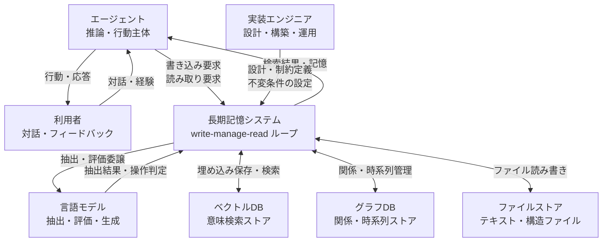
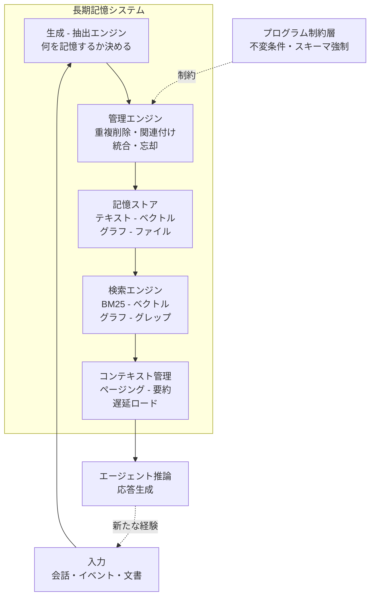
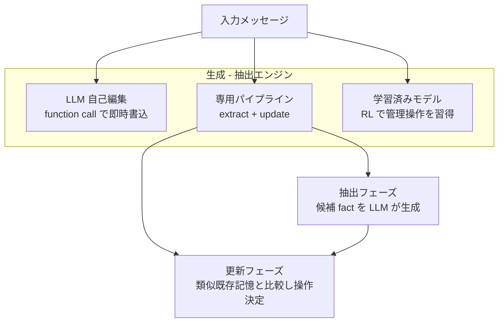
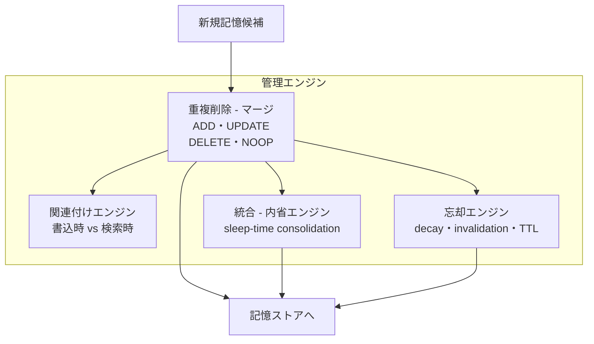
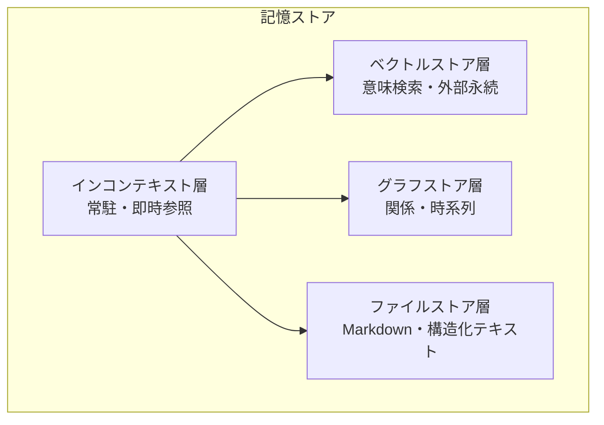
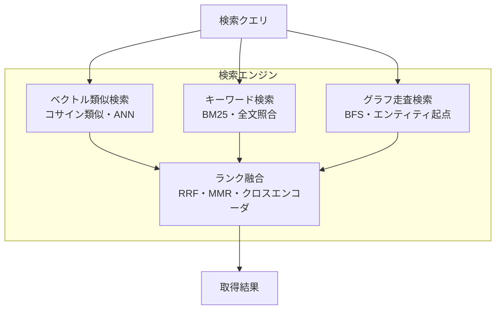
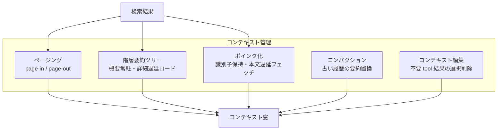
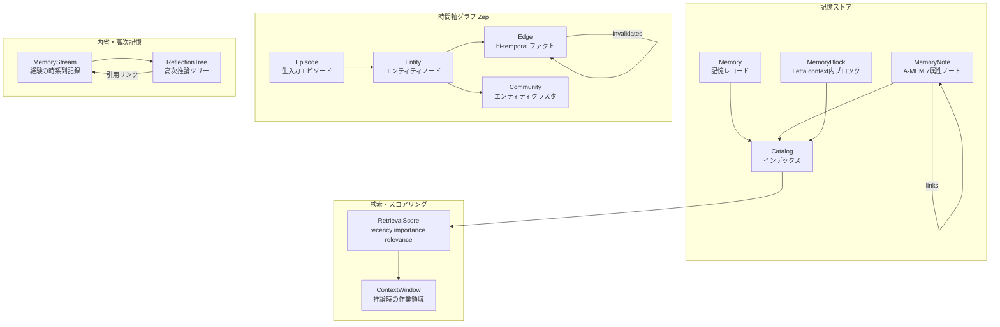
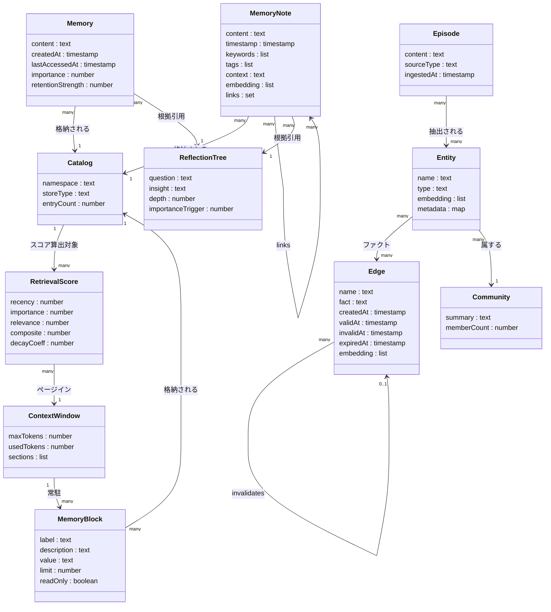

> 検証日: 2026-06-04 / 対象読者: 実装エンジニア・LLMOps・エージェント基盤設計者
> 起点ケース: LayerX「4,552 件のエージェント長期記憶で忘却設計の限界を検証」

## 概要

### 起点ケース: LayerX の大規模シミュレーション実験

LayerX は、AI ニュースレター 60 号分(2024-01〜2025-02)を対象に、607 セッション・約 20 時間・API 換算 $407 をかけて 4,552 個の memory ファイルを生成する運用規模の実験を実施しました。この実験は、ナイーブな「全件カタログ化してコンテキストに載せる」設計の破綻を定量的に示しました。

| 指標 | 値 | 意味 |
|---|---|---|
| 生成 memory ファイル数 | 4,552 件 | 60 号分のニュースレター由来 |
| カタログのコンテキスト占有 | 200k の 228% | 本文ゼロ件でも予算超過 |
| `related`(リンク)保持率 | 11.3% | 88.7% が孤立ノード |
| API コスト | $407 | Claude Sonnet 4.6(200k)使用 |

数値はいずれも LayerX 記事本文の自己報告です。第三者による再現検証は確認できていません。

### 記憶ライフサイクル管理とは

AIエージェントに長期記憶を持たせる取り組みは、2025〜2026 年にかけて Mem0・Letta・Zep・LangMem 等の製品化が急速に進みました。しかし LayerX の実証は、記憶を「検索されるストア(retrieval store)」として設計するだけでは不十分であることを示しました。

記憶のライフサイクル管理は、長期記憶を「生成 → 統合 → 関連付け → 忘却・退役」という状態遷移を持つ write-manage-read ループとして設計する方法論です。

2026 年の survey(arXiv:2603.07670)は、書き込み操作を単純な append でなく「summarize / deduplicate / score priority / resolve contradictions / delete を含む操作集合」と定式化し、最も未実装な次元は retire(忘却 / 退役)だと指摘します。

### 位置づけ: 4 つの設計問い

この方法論が解決しようとする問いは、「どのベクトル DB を選ぶか」という保存技術の問いから、次の 4 つの設計問いへの転換です。

1. 何を覚えるか(write selection) — 全件保存は性能の負債になります。選択的記憶が原則です。
2. いつ関連付けるか(linking) — LayerX の `related` 保持率 11.3% は、LLM 指示だけではグラフ構築が安定しないことを示します。
3. 何を忘れるか(forgetting / retire) — 矛盾は soft delete + invalidation で履歴を残します。純粋 TTL は「古いが今も真な事実」を除去します。
4. どこをプログラムで縛るか(harness) — フォーマット・不変条件は LLM への自然言語指示でなく、プログラム(ハーネス)で強制します。

## 特徴

### 主要メモリシステムの比較

| システム | 表現形式 | 抽出の主体 | 関連付け | 忘却・更新 |
|---|---|---|---|---|
| MemGPT / Letta (arXiv:2310.08560) | main context(system / working / FIFO)+ external archival。pgvector | LLM が function call で自己編集 | 構造リンク無し。検索時に解決 | Queue Manager の evict + 再帰要約。sleep-time agent が background で consolidate |
| Mem0 (arXiv:2504.19413) | 自然言語テキスト + ベクトル(base)/ 有向ラベルグラフ(Mem0^g) | 専用 2 フェーズ(extract → update) | base=ベクトル類似 / Mem0^g=エンティティノード再利用 + 関係エッジ | ADD / UPDATE / DELETE / NOOP。矛盾は soft delete |
| Zep / Graphiti (arXiv:2501.13956) | temporal knowledge graph 3 階層(episode / entity / community) | 話者自動抽出 + reflection 技法 | 意味エッジ + edge dedup | bi-temporal invalidation。物理削除せず履歴保持 |
| Generative Agents (arXiv:2304.03442) | memory stream + reflection tree | observation を逐次追加。importance 合計 150 超で reflection 発火 | reflection tree(根拠引用でリンク) | recency 指数減衰(係数 0.995)のソフト忘却 |
| A-MEM (arXiv:2502.12110) | 7 属性 memory note(content / timestamp / keywords / tags / context / embedding / links) | LLM が note を構造化生成(Zettelkasten 着想) | top-k 近傍 → LLM がリンク判定 | memory evolution: 既存ノードの tag / context を動的更新 |
| LangMem (LangChain) | semantic / episodic / procedural。LangGraph BaseStore | hot path / background の 2 経路 | namespace で編成。検索ベース | Manager が更新 / 削除 / 統合。profile は上書き |
| Anthropic Memory Tool (`memory_20250818`) | クライアント実装依存 | read / write / 忘却はクライアント実装 | クライアント設計に委ねる | 定期クリアを実装者が設計。path traversal 防御が MUST |

### 設計上のポイント

- 「検索されるストア」から「write-manage-read ループ」へのパラダイム転換。従来の記憶設計は「ベクトル DB に詰め込んで検索」が主眼でした。ライフサイクル管理は書き込み時の選択・統合・重複削除・矛盾解決・忘却をループの一部として組み込みます。
- 抽出の主体は三極化。LLM 自己編集(MemGPT)、専用 extract → update パイプライン(Mem0 / Zep / Cognee)、RL 学習済み専用モデル(mem-agent / Memory-R1 arXiv:2508.19828)の三極に分岐します。
- 検索はハイブリッドへ収束。「セマンティック(ベクトル)+ キーワード(BM25)+ グラフ走査」の併用が Zep・新 Mem0 に共通します。BM25 × ベクトル融合で recall@10 が 65–78% → 91% に向上します [二次情報: InfoQ/supermemory/dev.to 集約]。
- 矛盾事実は「削除せず invalidate して履歴保持」が temporal 系の共通設計です。Zep の bi-temporal モデル(4 軸: `created_at` / `valid_at` / `invalid_at` / `expired_at`、公式 Facts ページ一次)と Mem0^g の invalid マーキングが独立に同じ結論へ収束します。
- consolidation はオフライン(sleep-time)非同期バッチへ。Letta の sleep-time agent(default 5 ステップごとに background 起動、公式 docs 一次)、LightMem(arXiv:2510.18866)、SleepGate(arXiv:2603.14517)が同方向です。原型は Generative Agents の reflection(importance 合計 150 超で発火)です。
- コンテキスト上限は「常駐をやめてポインタ化 + 遅延ロード」で対処します。カタログの全件常駐は件数 N に比例して O(N) でウィンドウを消費し構造的に破綻します(LayerX: 4,552 件で 200k の 228%)。さらに context rot(Chroma 研究、18 frontier モデルを評価)により入力長増加で全モデルが精度劣化します(定量値は二次集約)。
- 書き込み時の加工より検索品質が支配的です。arXiv:2603.02473(MemAgents Workshop @ ICLR 2026)は、書き込み戦略の精度差はわずか 3–8pt に留まり、retrieval 手法の差は 20pt(57.1% → 77.2%)だと実験的に示します。
- グラフ関連付けは限定ドメインで有効です。A-MEM は multi-hop QA で MemGPT を 20pt 超上回りますが(GPT-4o-mini, LoCoMo)、arXiv:2506.05690 系の分析(同論文が引用する先行研究の値を含む)では single-hop で GraphRAG が vanilla RAG を 13.4% 下回り、time-sensitive で最大 16.6% 低下、レイテンシ 2.3 倍と報告されています [二次サマリ依存。本文 PDF は 10MB 超で取得不可]。
- プログラム(ハーネス)で不変条件を縛ります。LayerX の実験では、ファイル名指定なのにパス全体を記述する、日付が「2024-08」と月精度にとどまるなどのフォーマット崩れが発生しました。フォーマット・パス・日付精度は検証層・スキーマでプログラム的に強制します。

## 構造

記憶のライフサイクル(write-manage-read ループ)の論理構造を C4 で表現します。

### システムコンテキスト図



| 要素 | 説明 |
|---|---|
| エージェント | 推論・行動を行う主体。記憶システムに書き込みと読み取りを要求する |
| 実装エンジニア | 長期記憶システムを設計・構築し、不変条件や制約をプログラムで定義する |
| 利用者 | エージェントと対話し、経験・フィードバックを与える間接的な記憶の源泉 |
| 長期記憶システム | write-manage-read ループ全体を担う中核 |
| 言語モデル | 記憶の抽出・評価・生成を委譲される外部コンポーネント |
| ベクトルDB | 意味的類似検索を担うストア。埋め込みインデックスを保持する |
| グラフDB | エンティティ間の関係と時系列を管理するストア |
| ファイルストア | テキストや構造化ファイルを保持するストア。Markdown 型・memory ディレクトリ等 |

### コンテナ図



| コンテナ | 説明 |
|---|---|
| 生成 - 抽出エンジン | 入力から何を記憶すべきかを決める。LLM 自己判断・専用パイプライン・学習済みモデルの 3 方式が存在する |
| 管理エンジン | 重複削除・関連付け・統合・忘却を担う。最も設計上の難所であり retire 次元が最も未実装 |
| 記憶ストア | テキスト・ベクトル・グラフ・ファイルの 4 形式でデータを保持する永続層 |
| 検索エンジン | BM25・ベクトル類似・グラフ走査・grep のハイブリッドで必要な記憶を取り出す |
| コンテキスト管理 | 検索結果をコンテキスト窓に載せる際の量・配置・圧縮を制御する |
| プログラム制約層 | LLM 指示では守られない不変条件をプログラムで強制する |

### コンポーネント図 生成 抽出エンジン



| コンポーネント | 具体例 | 説明 |
|---|---|---|
| LLM 自己編集 | MemGPT / Letta | LLM が function call を発行し Working Context や Archival に自律的に書き込む |
| 専用パイプライン - 抽出フェーズ | Mem0 の Extraction Phase | 直近メッセージ・会話要約・過去履歴をプロンプトに与え、LLM が候補 fact 集合を生成する |
| 専用パイプライン - 更新フェーズ | Mem0 の Update Phase | 候補 fact と意味的に近い既存記憶上位 k 件を比較し、操作を LLM の推論で直接決定する |
| 学習済みモデル | mem-agent(GSPO)・Memory-R1 | Retrieval / Updating / Clarification の管理操作を RL で学習した専用モデルが担う |

### コンポーネント図 管理エンジン



| コンポーネント | 具体例 | 説明 |
|---|---|---|
| 重複削除 - マージ | Mem0 の ADD/UPDATE/DELETE/NOOP | 新規候補と既存記憶を意味的に比較し、重複・矛盾を整理する。LLM の推論で操作を選択する |
| 関連付けエンジン - 書込時 | A-MEM の link generation・Zep の edge dedup | 書込時に top-k 近傍を取得し LLM が意味リンクを確立する方式と、エッジ重複を解決する方式がある |
| 関連付けエンジン - 検索時解決 | MemGPT / Letta・LangMem | 構造的リンクを持たず、検索時にベクトル類似で関連を解決する方式 |
| 統合 - 内省エンジン | Letta の sleep-time agent・Generative Agents の reflection | オンライン推論パスから切り離したオフライン非同期バッチで記憶を整理・昇格する |
| 忘却エンジン - 指数減衰 | Generative Agents(係数 0.995)・MemoryBank(R=e^(-t/S)) | 時間経過でスコアを減衰させるソフト忘却。recall のたびに強度を再強化する spacing effect もある |
| 忘却エンジン - temporal invalidation | Zep の bi-temporal invalidation | 矛盾する新事実が来ると古いエッジの invalid_at をセットして論理失効させる。履歴を保持する |
| 忘却エンジン - TTL・重要度 | FadeMem・semantic-category 付き TTL | 不変事実は無限 TTL、一時情報は短 TTL と重要度別 decay を組み合わせる |

### コンポーネント図 記憶ストア



| コンポーネント | 具体例 | 説明 |
|---|---|---|
| インコンテキスト層 | MemGPT の Working Context / FIFO Queue・Letta の memory blocks | コンテキスト窓内に常駐する高速参照層。character limit で制約され overflow 時に外部層へ退避する |
| ベクトルストア層 | Letta の pgvector(HNSW)・Mem0 の Qdrant・A-MEM の ChromaDB | 埋め込みベクトルで意味検索する永続外部ストア。必要時にページインする |
| グラフストア層 | Zep / Graphiti の temporal KG(3 層) | エンティティとその関係・時系列を保持する。bi-temporal 4 タイムスタンプでエッジを管理する |
| ファイルストア層 | Anthropic Memory Tool の /memories・Claude Code の MEMORY.md | テキストファイル・Markdown で記憶を保持する人間可読な形式 |

### コンポーネント図 検索エンジン



| コンポーネント | 具体例 | 説明 |
|---|---|---|
| ベクトル類似検索 | Zep の cosine similarity・Mem0 の semantic search | 埋め込みベクトルを用いた意味的類似検索。レアトークンや固有名詞に弱い |
| キーワード検索 | Zep の Okapi BM25・Mem0 の BM25 | 語彙レベルの完全一致検索。ベクトルが苦手なレアトークンを補完する |
| グラフ走査検索 | Zep の BFS グラフ検索・HippoRAG の Personalized PageRank | グラフ上で近接するノード / エッジを辿る。multi-hop 推論・関係検索に強い |
| ランク融合 | Zep の Reciprocal Rank Fusion・Maximal Marginal Relevance | 複数の検索スコアを統合して最終ランキングを生成する |
| スコアリング関数 | Generative Agents の recency + importance + relevance | 複合スコアで記憶の優先順位を決める。後続研究のベースラインとなった原型 |

### コンポーネント図 コンテキスト管理



| コンポーネント | 具体例 | 説明 |
|---|---|---|
| ページング | MemGPT / Letta の main / external context 間の page-in / page-out | OS の仮想メモリを模倣し、必要な記憶のみをコンテキスト窓に呼び込む |
| 階層要約ツリー | RAPTOR の階層クラスタ要約・Zep の community subgraph | 概要ノードを常駐させ詳細は必要時のみ取得する構造。カタログ窓圧迫への処方箋 |
| コンパクション | Anthropic Compaction(trigger default 150k tokens・min 50k・beta compact-2026-01-12) | 閾値超過で古いコンテキストをサーバーサイドで要約し旧ブロックを drop する |
| コンテキスト編集 | Anthropic Context Editing(trigger default 100k tokens・keep 3 tool uses・beta context-management-2025-06-27) | 古い tool result を placeholder に置換する fine-grained なサーバーサイド操作 |
| ポインタ化 | just-in-time retrieval パターン | 全文でなく軽量識別子をコンテキストに保持し、必要時に本文をフェッチする |
| サブエージェント分離 | Claude Code の subagent 分離・LangMem の hot path / background 分離 | 独立したコンテキスト窓を持つサブエージェントに重い処理を委譲し主ウィンドウを保全する |

## データ

### 概念モデル

記憶システムに登場するエンティティとその所有・利用関係を示します。



### 情報モデル

主要エンティティの属性を示します。型名は汎用名(list / map / set / text / number / timestamp / boolean)を使用します。



主要属性の出典を補足します。

| エンティティ.属性 | 出典 | 備考 |
|---|---|---|
| Memory.importance | Generative Agents arXiv:2304.03442 | LLM が 1–10 で採点。mundane=1, extremely poignant=10 |
| Memory.retentionStrength | MemoryBank arXiv:2305.10250 | `S` の初期値 1、recall のたびに +1、忘却曲線 `R=e^{−t/S}` に使用 |
| Memory.lastAccessedAt | Generative Agents arXiv:2304.03442 | 指数減衰 recency スコアの起点(減衰係数 0.995) |
| MemoryNote.keywords / tags / context | A-MEM arXiv:2502.12110 | LLM が生成。evolution 時に動的更新される |
| MemoryNote.links | A-MEM arXiv:2502.12110 | 双方向リンク。Zettelkasten 着想 |
| MemoryBlock.label / limit | Letta 公式 docs | `label` が一意 ID。`limit` は character 数上限 |
| Edge.validAt / invalidAt | Zep arXiv:2501.13956 / 公式 docs | event time 軸。矛盾時は invalidAt をセット |
| Edge.createdAt / expiredAt | Zep arXiv:2501.13956 / 公式 docs | ingestion time 軸。bi-temporal モデルの 2 軸 |
| Entity.type | Mem0 arXiv:2504.19413 | Person / Location / City 等の意味型ラベル |
| ReflectionTree.importanceTrigger | Generative Agents arXiv:2304.03442 | 直近イベントの importance 合計が閾値(実装値 150)を超えると発火 |
| ReflectionTree.depth | 論文記述から推測 | 論文に depth の数値記載なし |
| RetrievalScore.decayCoeff | Generative Agents arXiv:2304.03442 | 指数減衰係数。実装値 0.995 |
| Catalog.namespace | LangMem / LangGraph 公式 docs | `{user_id}` 等で多階層編成。ユーザー間混線防止 |
| ContextWindow.sections | MemGPT arXiv:2310.08560 | System Instructions / Working Context / FIFO Queue の 3 区画 |

## 構築方法

主要実装を 4 方式に分けてコード例付きで示します。補完したコード例は実装案として明示します。

### LayerX 型ファイル記憶(Claude Code SDK ベース)

LayerX 型はクラウドサービスでなく、Claude Code が備える CLAUDE.md ファイル群と Auto memory の組み合わせです。Auto memory は Claude Code v2.1.59 以降が必要です。

```bash
# バージョン確認
claude --version
```

CLAUDE.md は配置場所によってスコープが変わります。ロード順は広域から特定の順です。

| スコープ | パス | 共有先 |
|---|---|---|
| 組織ポリシー | macOS: `/Library/Application Support/ClaudeCode/CLAUDE.md` | 全ユーザー(除外不可) |
| ユーザー共通 | `~/.claude/CLAUDE.md` | 自分(全プロジェクト) |
| プロジェクト | `./CLAUDE.md` または `./.claude/CLAUDE.md` | チーム(VCS 経由) |
| ローカル個人 | `./CLAUDE.local.md` | 自分(当該プロジェクト) |

Auto memory は `.claude/settings.json` で制御します。

```json
{
  "autoMemoryEnabled": false,
  "autoMemoryDirectory": "~/my-custom-memory-dir"
}
```

```bash
# 環境変数で無効化
CLAUDE_CODE_DISABLE_AUTO_MEMORY=1 claude
```

### Mem0

```bash
pip install mem0ai
```

OSS 版(ローカル)の初期化です。

```python
from mem0 import Memory
import os

os.environ["OPENAI_API_KEY"] = "sk-..."
# デフォルト構成: LLM=gpt-4o-mini, Embedder=text-embedding-3-small,
# Vector store=Qdrant(インメモリ), History=SQLite
m = Memory()
```

カスタム構成は `from_config()` を使います。旧来の graph store(`enable_graph` / `graph_store`)は最新 OSS SDK から削除され、entity linking が初期化後の次回 add 時に自動有効化されます(`{collection_name}_entities` コレクションが自動生成)。

```python
from mem0 import Memory

config = {
    "llm": {"provider": "openai", "config": {"model": "gpt-4o"}},
    "embedder": {"provider": "openai", "config": {"model": "text-embedding-3-small"}},
    "vector_store": {
        "provider": "qdrant",
        "config": {"url": "http://localhost:6333", "collection_name": "my_agent"}
    },
}
m = Memory.from_config(config)
```

Platform 版(マネージド)です。

```python
from mem0 import MemoryClient
client = MemoryClient(api_key="m0-xxxxx")
```

### Letta(memory blocks / sleep-time agents)

```bash
pip install letta-client
```

```python
from letta_client import Letta
import os

client = Letta(api_key=os.getenv("LETTA_API_KEY"))
```

memory blocks の主要フィールドです。

| フィールド | 必須 | 説明 |
|---|---|---|
| `label` | 必須 | ブロックの一意 ID(例: `"human"`, `"persona"`) |
| `value` | 必須 | ブロックの初期内容 |
| `limit` | 任意 | 文字数上限(デフォルト 5000) |
| `description` | 任意 | エージェントがブロックの用途を理解するための説明 |
| `read_only` | 任意 | `True` でエージェントから書き込み不可 |

sleep-time agent は primary agent の N ステップごとに background 起動し、memory block を非同期更新します(デフォルト 5 ステップごと)。公式は experimental と明記しており、token コスト管理のため頻度は 5〜10 程度に保つことを推奨します。

```python
agent = client.agents.create(
    memory_blocks=[{"value": "", "label": "human"}],
    model="anthropic/claude-sonnet-4-6",
    embedding="openai/text-embedding-3-small",
    enable_sleeptime=True,
)
```

### Anthropic Memory Tool(`memory_20250818`)

Memory Tool は Claude API に組み込まれたクライアントサイドのツールです。実際のファイル read/write はアプリケーション側が実装します。

```python
import anthropic

client = anthropic.Anthropic()
message = client.messages.create(
    model="claude-opus-4-8",
    max_tokens=2048,
    messages=[{"role": "user", "content": "このプロジェクトのデバッグを手伝ってください。"}],
    tools=[{"type": "memory_20250818", "name": "memory"}],
)
```

カスタムバックエンドは `BetaAbstractMemoryTool` を継承します。path traversal 防御は公式が MUST と明記しています。

```python
import pathlib
from anthropic.tools import BetaAbstractMemoryTool

MEMORY_DIR = pathlib.Path("/memories")

class MyMemoryTool(BetaAbstractMemoryTool):
    def _safe_path(self, path: str) -> pathlib.Path:
        """path traversal 攻撃対策: /memories 配下に限定する"""
        p = MEMORY_DIR.joinpath(path.lstrip("/")).resolve()
        if not str(p).startswith(str(MEMORY_DIR.resolve())):
            raise ValueError(f"Access denied: {path}")
        return p
    # view / create / str_replace / insert / delete / rename を実装する
```

## 利用方法

### Mem0 add / search / update / delete

`m.add()` の主要パラメータです。

| パラメータ | 型 | 説明 |
|---|---|---|
| `messages` | list | 会話ターンのリスト(`role` と `content`) |
| `user_id` / `agent_id` / `run_id` | str | 記憶スコープの識別子 |
| `metadata` | dict | フィルタリング用の追加属性 |
| `infer` | bool | `True`(デフォルト)で LLM 抽出 + 操作判定。`False` で生メッセージ保存 |

```python
messages = [
    {"role": "user", "content": "Hi, I'm Alex. I love basketball and gaming."},
    {"role": "assistant", "content": "Hey Alex! I'll remember your interests."},
]
m.add(messages, user_id="alex", metadata={"category": "preferences"})

# 検索
results = m.search("What do you know about me?", filters={"user_id": "alex"})
for r in results["results"]:
    print(r["memory"], r["score"])  # score はセマンティック+BM25+entity の複合スコア
```

`m.add(messages, infer=True)` の内部では 2 フェーズが走ります。

```
[Extraction Phase]
  入力メッセージ + 会話要約 + 直近履歴 → LLM が候補 fact 集合を抽出
[Update Phase]
  各候補 fact に対し vector similarity で既存記憶上位 k 件を取得 → LLM が操作を判定:
    ADD    : 同等の記憶がない → 新規作成
    UPDATE : 既存記憶を補完する情報 → 拡張して上書き
    DELETE : 新情報と矛盾する既存記憶 → 削除(soft delete 推奨)
    NOOP   : 既存 or 無関係 → 変更なし
```

`infer=False` と `infer=True` を同一ユーザーに混在させると同一 fact が二重保存されることがあるため、どちらかに統一してください。

なお ADD/UPDATE/DELETE/NOOP の 4 操作は arXiv:2504.19413(旧アルゴリズム)の定式化です。現行の Mem0 OSS(v3 系)では single-pass の ADD 中心抽出 + entity linking + multi-signal retrieval に移行しています。設計思想として 4 操作は de-facto 標準ですが、実装バージョンによって挙動が異なる点に注意してください [出典: Mem0 公式 migration guide]。

### Mem0 をエージェントへ組み込む全体構成

```python
from openai import OpenAI
from mem0 import Memory

openai_client = OpenAI()
memory = Memory()

def chat_with_memories(message: str, user_id: str = "default_user") -> str:
    # 1. 関連記憶を検索
    relevant = memory.search(query=message, filters={"user_id": user_id}, top_k=3)
    memories_str = "\n".join(f"- {e['memory']}" for e in relevant["results"])

    # 2. 記憶をシステムプロンプトに注入して生成
    messages = [
        {"role": "system", "content": f"User Memories:\n{memories_str}"},
        {"role": "user", "content": message},
    ]
    resp = openai_client.chat.completions.create(model="gpt-4o", messages=messages)
    answer = resp.choices[0].message.content

    # 3. 新規記憶を追加
    messages.append({"role": "assistant", "content": answer})
    memory.add(messages, user_id=user_id)
    return answer
```

### Anthropic Memory Tool コマンドと忘却の実装

サポートコマンド一覧です。

| コマンド | 必須引数 | 動作 |
|---|---|---|
| `view` | `path` | ディレクトリ一覧 or ファイル内容表示 |
| `create` | `path`, `file_text` | 新規ファイル作成(既存ならエラー) |
| `str_replace` | `path`, `old_str`, `new_str` | 一意な文字列を置換 |
| `insert` | `path`, `insert_line`, `insert_text` | 指定行に挿入 |
| `delete` | `path` | ファイル / ディレクトリを削除(再帰) |
| `rename` | `old_path`, `new_path` | リネーム / 移動 |

Memory Tool 自体に TTL 設定はありません。公式の推奨に基づき、アクセス日時を記録して定期削除するロジックをアプリケーション側で実装します(実装案)。

```python
# [実装案] 30日以上アクセスされていないファイルを削除する
import time, pathlib

MEMORY_DIR = pathlib.Path("/memories")
EXPIRATION_DAYS = 30

def expire_old_memories():
    now = time.time()
    threshold = EXPIRATION_DAYS * 24 * 3600
    for f in MEMORY_DIR.rglob("*"):
        if f.is_file() and now - f.stat().st_atime > threshold:
            f.unlink()
```

Compaction(`compact_20260112`)との併用で、active context を要約で縮めつつ compaction 境界をまたいで重要情報を永続化できます。compaction は `context_management.edits` 配列に置きます。

```python
# compaction は context_management.edits 配列に置く(system でもトップレベルでもない)
message = client.beta.messages.create(
    betas=["compact-2026-01-12"],
    model="claude-opus-4-8",
    max_tokens=8192,
    messages=messages,
    tools=[{"type": "memory_20250818", "name": "memory"}],
    context_management={
        "edits": [
            {"type": "compact_20260112", "trigger": {"type": "input_tokens", "value": 150000}}
        ]
    },
)
```

## 運用

### コンテキスト予算管理 カタログ常駐をやめポインタ化 + 遅延ロードへ

記憶件数 N に対し、カタログをそのままコンテキストへ積み込むと消費トークンは O(N) で増加します。ウィンドウサイズは固定のため、必ずどこかで溢れます(LayerX: 4,552 件のカタログだけで 200k の 228%)。さらにコスト面だけでなく精度面でも不利です。Chroma の Context Rot 研究(2025)では 18 の frontier モデル全てで入力長の増加に伴い性能が低下し、NIAH 系で 10k→100k+ トークンにかけて 20〜50% の精度低下が報告されています [二次情報: winbuzzer/morph による定量集約。Chroma 本文は定性記述]。「載せられる ≠ 使える」という原則を前提に設計してください。

Anthropic 公式エンジニアリング記事(Effective context engineering for AI agents, 2025-09-29)の指導原理「最小の高シグナルトークン集合を見つける」のもと、次の手法を組み合わせます。

| 手法 | 概要 | 参考 |
|---|---|---|
| Just-in-time retrieval | 全文でなく軽量な識別子のみ常駐させ、必要時にフェッチ | Anthropic 公式 |
| RAPTOR 階層要約ツリー | チャンクを再帰的に embed→cluster→summarize し、上位ノードだけ常駐 | arXiv 2401.18059 |
| MemGPT 式ページング | Main / External Context をエージェント自身の function call で page in/out | arXiv 2310.08560 |
| サブエージェント分割 | fresh context を持つサブエージェントに委譲し主ウィンドウを汚さない | Anthropic 公式 |
| Structured note-taking | 重要メモをコンテキスト外に永続化し必要時に再注入 | Anthropic 公式 |

mem0 の報告ではクエリあたり約 1,294 トークン(full context の約 5%)で 81.95% の精度を達成しており、全件投入と必要分 retrieval のトークン差は 1〜2 桁になり得ます [二次情報: mem0 GitHub / State of AI Agent Memory 2026]。

### Compaction / Context Editing のトリガー設定

Anthropic API では Context Editing(古い tool result の placeholder 化)と Compaction(要約圧縮)が役割分担します。

- Context Editing: trigger default 100k tokens、keep default 3 tool uses。fine-grained 制御用。
- Compaction: trigger default 150k tokens(min 50k)。多くのユースケースで主戦略。

compaction は不可逆な損失を伴うため、捨てる前に重要度スコアでフィルタリングし、ユーザーの不変情報(名前・アレルギー・支払い体系)は TTL 無限として対象から除外してください。

### Sleep-time Consolidation の頻度設計

consolidation はオンライン推論パスから切り離した非同期・オフラインバッチで行うのが 2025-2026 の実装トレンドです。consolidation のたびに全件リビルドせず、probation buffer に入った新規記憶を一定条件で long-term へ promote する dual-buffer 方式(arXiv 2603.07670)が更新コストと整合性を両立します。

| 記憶タイプ | 推奨 consolidation 頻度 | 根拠 |
|---|---|---|
| episodic(会話ログ) | 1 日 1〜2 回(深夜バッチ) | Generative Agents: importance 合計 150 超で発火 |
| semantic(ユーザー選好・事実) | 会話終了ごと or 日次 | Mem0 の extraction パイプライン |
| procedural(検証済み手順) | 週次 or 手動 | 安定性重視、regression チェックが必要 |

### コスト監視 1M フラット課金 vs 閾値課金

| プロバイダー | 長コンテキスト課金 | 注意点 |
|---|---|---|
| Anthropic Opus 4.8/4.7/4.6, Sonnet 4.6 | 1M までフラット単価(200k 超サーチャージ廃止) | Opus 4.7 以降は新トークナイザで同一テキストでも最大 35% 多くトークンを消費しうる |
| OpenAI GPT-5.5 | 272k 超でセッション全体が input 2x / output 1.5x [二次情報: OpenRouter/typingmind 集約] | しきい値超で非線形にコスト増加 |
| Google Gemini 2.5 Pro | 200k 超で 2x にステップアップ [二次情報: pricepertoken / ai.google.dev 集約] | 200k をまたぐ設計は要注意 |

(一次ソース: Anthropic Pricing docs, 2026-06-04 取得)

prompt caching は同じ大ブロックを毎ターン再投入する場合の支配的レバーです。cache read(hit)は base input の 0.1x、5 分 cache write は 1.25x、1 時間 cache write は 2x です。

```python
# ターンごとのトークン使用量ログ
def log_token_usage(response):
    u = response.usage
    print(f"input={u.input_tokens}, cache_read={u.cache_read_input_tokens}")
    if u.input_tokens > 900_000:
        alert("context approaching 1M limit")
```

## ベストプラクティス

### retrieval を最優先で作り込む

記憶精度を上げるには書き込み時に fact extraction や summarization を高度化すべきだ、という考え方が広く信じられています。しかし arXiv:2603.02473(MemAgents Workshop @ ICLR 2026)は、3 種類の write 戦略(raw chunks / fact extraction / summarization)× 3 種類の retrieval を比較し、retrieval 手法の差で精度が 20pt 変動(57.1%→77.2%)したのに対し、write 戦略の差はわずか 3〜8pt にとどまったと示しました。「単純な生チャンクが高コストな抽出 / 要約に匹敵または上回る」という結果です。

write パイプラインを複雑化する前に、まず retrieval を最優先で作り込んでください。ハイブリッド検索(BM25 × ベクトル × grep × グラフ RRF 融合)が 2026 の定石です。

| 手法 | 強み | 弱み | 使いどころ |
|---|---|---|---|
| BM25(sparse) | 完全一致・レアトークンに強い | 意味的類似を取りこぼす | ID・固有名詞・コマンド名で引く |
| ベクトル(dense) | 概念的・言い換えクエリに強い | 識別子に弱い、ドリフトあり | 「あの時の〜」的な意味検索 |
| grep(リテラル) | 索引不要・確定的 | 表記ゆれ・意味検索不可 | 既知文字列のピンポイント取得 |
| グラフ走査 | 関係推論・マルチホップに強い | 設計コスト大、単純検索では遅い | entity 間関係をたどる記憶 |

```python
def reciprocal_rank_fusion(rankings, k=60):
    """複数 ranking を RRF で融合する(k=60 はデフォルト値)"""
    scores = {}
    for ranking in rankings:
        for rank, doc_id in enumerate(ranking):
            scores[doc_id] = scores.get(doc_id, 0) + 1 / (k + rank + 1)
    return sorted(scores, key=scores.get, reverse=True)

def hybrid_memory_search(query, store):
    bm25 = store.bm25_search(query)            # レアトークン・固有名詞
    vector = store.vector_search(query, k=20)  # 意味検索
    fused = reciprocal_rank_fusion([bm25, vector])  # RRF で融合(小規模なら軽量)
    return store.fetch(fused[:10])
```

BM25 + ベクトルを RRF で融合すると recall@10 が 65〜78% から 91% へ改善します [二次情報: dev.to/supermemory]。

### 選択的書き込み + soft delete

add-all 戦略は性能の負債を生みます。tianpan.co の The Forgetting Problem によれば、add-all では 2,400 件蓄積で医療推論精度が 13% へ低下した一方、選択的管理で 248 件に絞ると 39% へ改善したとされます [二次情報: 一次論文の数値は未確認]。Mem0 の ADD/UPDATE/DELETE/NOOP が de-facto 標準で、DELETE は物理削除でなく invalid マーク(soft delete)にして temporal reasoning とロールバックを保ちます。

### 種別ごとの TTL 設計

uniform TTL は「古いが今も真な事実」を誤って捨てます。

| 記憶種別 | TTL の目安 | 例 |
|---|---|---|
| 不変事実 | 無限(TTL なし) | ユーザー名・アレルギー・契約プラン・支払い体系 |
| semantic(一般選好) | 数ヶ月〜1 年 | 好きなフレームワーク・コーディングスタイル |
| episodic(会話記録) | 数日〜数週間 | 「昨日のデバッグセッションで〜」 |
| transient context | 数時間〜数日 | 「今 feature X を実装中」 |
| 推論・inferred 事実 | 短め(確認まで) | confidence が低い推定値 |

FadeMem(arXiv 2601.18642)は重要度の高い指示を緩やかに、低い interaction を急速に減衰させます。TTL × access-frequency reinforcement(retrieve 成功でスコアを上げる LRU 的な仕組み)のハイブリッドが実務で有効です。なお API キー・トークン・秘密鍵は長期記憶へ保存せず、保存禁止または即時 redaction を原則とします。

### プログラム(ハーネス)で不変条件を縛る

LayerX ではフォーマット崩れが実運用上の問題として観察されました。また arXiv 2604.16548 は memory hallucination(extraction / organization / update の各段で記憶が内的起源で破損)を報告しています。LLM が自由にフォーマットを決めるのでなく、ハーネス側のスキーマとバリデーションで不変条件を縛り、LLM は値を埋めることに専念させてください。

```python
# ハーネス側のバリデーション例(実装案)
VALID_MEMORY_TYPES = {"episodic", "semantic", "procedural", "factual"}

def validate_memory_entry(entry: dict) -> bool:
    required = {"id", "content", "type", "created_at", "ttl", "importance"}
    if not required.issubset(entry.keys()):
        raise ValueError(f"Missing keys: {required - entry.keys()}")
    if entry["importance"] not in range(1, 11):
        raise ValueError("importance must be 1-10")
    if entry["type"] not in VALID_MEMORY_TYPES:
        raise ValueError(f"Invalid type: {entry['type']}")
    return True
```

### グラフ / temporal は限定導入

グラフ記憶は multi-hop 推論には強力ですが、単純検索では逆効果になりえます。arXiv 2506.05690 系の分析(同論文が引用する先行研究の値を含む)では single-hop で GraphRAG が vanilla RAG を 13.4% 下回り、time-sensitive で最大 16.6% 低下、レイテンシ 2.3 倍と報告されています [二次情報: 検索サマリ経由]。

```
グラフ記憶を使うべきケース:
  - entity 間の関係を明示的にたどる(誰が・いつ・何を)
  - マルチホップ推論が必要
  - temporal な変化(いつ変わったか)を追跡する
グラフを使うべきでないケース:
  - 単純な fact 検索(ベクトル + BM25 で十分)
  - リアルタイム応答が要る(2.3 倍のレイテンシ)
  - スキーマが頻繁に変わる(entity resolution コストが高い)
```

運用する場合も、Zep Community Edition が deprecated になり自己ホストが Neo4j 直叩きになった例 [二次情報: vectorize.io] のように、グラフ DB の運用コストを事前に見積もってください。

## トラブルシューティング

| 症状 | 原因 | 対処 |
|---|---|---|
| カタログ膨張(228% 問題) | 記憶件数 N に対しカタログが O(N) で増加(4,552 件で 200k の 228%) | カタログをポインタ(ID/slug)に変える。RAPTOR 階層要約で上位ノードのみ常駐し詳細は just-in-time fetch。MemGPT 式 page in/out |
| related 関連付けの低定着(保持率 11.3% / 88.7% が孤立) | entity resolution 未解決、LLM hallucination による誤 relation、embedding ドリフト | KG を denoise してから RAG(arXiv 2510.14271)。entity 正規化を extraction 前に実施。linking は top-k 近傍 + LLM 確認の 2 段階で |
| context rot / lost-in-the-middle | 全 18 モデルで入力長増加に伴い性能低下(Chroma)。中間配置の情報で精度が大きく低下(arXiv 2307.03172。30%+ 低下は [二次集約]) | 関連情報を先頭または末尾に配置。retrieval でトークン削減(full context の 5% を目標)。distractor を減らす。compaction で低価値情報を除去 |
| entity 分裂 | 表記ゆれ(田中太郎 / tanaka.taro)や文脈差による embedding 距離 | extraction 前に名寄せ辞書を整備。soft delete で矛盾 entity を obsolete マークし canonical に統合 |
| メモリ hallucination | 保存段(extraction / organization / update)で内的起源の破損(arXiv 2604.16548) | ハーネス側でスキーマ・バリデーションを実装。書き込み時に confidence スコアを付与し低 confidence は短い TTL で消す。出典(source ID)をレスポンスに要求 |
| ベンチ過信 | メモリ系ベンチに方法論上の問題(MemPalace #29: LoCoMo ground truth 約 99 件のエラー、top-k=50 でバイパス、LLM-as-Judge の preference leakage) | 公開ベンチは参考値とし、自社ユースケースに近いデータで手元評価。LLM-as-Judge 単独でなく人間確認を併用。held-out データで再測定 |

## まとめ

AIエージェントの長期記憶は、「どのベクトル DB に詰め込むか」ではなく「生成・関連付け・忘却・コンテキスト管理を含む write-manage-read ライフサイクルをどう設計するか」が要点です。LayerX の 4,552 件実験が示すとおり無策の全件カタログ投入はコストと精度の両面で破綻しますが、反証研究は専用メモリレイヤーやグラフ関連付けの無条件導入も戒めており、設計の重心は retrieval 品質の作り込み・選択的な書き込み・プログラムによる不変条件の固定に置くべきです。

この記事が少しでも参考になった、あるいは改善点などがあれば、ぜひリアクションやコメント、SNSでのシェアをいただけると励みになります！

## 参考リンク

- 一次論文(本フレームワーク・系譜)
  - [LayerX AI Agentの長期記憶の検証](https://tech.layerx.co.jp/entry/ai-agent-long-term-memory-simulation)
  - [Generative Agents (arXiv:2304.03442)](https://arxiv.org/abs/2304.03442)
  - [MemGPT: Towards LLMs as Operating Systems (arXiv:2310.08560)](https://arxiv.org/abs/2310.08560)
  - [MemoryBank (arXiv:2305.10250)](https://arxiv.org/abs/2305.10250)
  - [A-MEM: Agentic Memory (arXiv:2502.12110)](https://arxiv.org/abs/2502.12110)
  - [Mem0 (arXiv:2504.19413)](https://arxiv.org/abs/2504.19413)
  - [Zep: Temporal Knowledge Graph Architecture (arXiv:2501.13956)](https://arxiv.org/abs/2501.13956)
  - [HippoRAG (arXiv:2405.14831)](https://arxiv.org/abs/2405.14831)
  - [RAPTOR (arXiv:2401.18059)](https://arxiv.org/abs/2401.18059)
  - [Lost in the Middle (arXiv:2307.03172)](https://arxiv.org/abs/2307.03172)
  - [Memory for Autonomous LLM Agents survey (arXiv:2603.07670)](https://arxiv.org/abs/2603.07670)
  - [FadeMem (arXiv:2601.18642)](https://arxiv.org/abs/2601.18642)
  - [LightMem (arXiv:2510.18866)](https://arxiv.org/abs/2510.18866)
  - [SleepGate (arXiv:2603.14517)](https://arxiv.org/abs/2603.14517)
- 反証論文
  - [Diagnosing Retrieval vs. Utilization Bottlenecks (arXiv:2603.02473)](https://arxiv.org/abs/2603.02473)
  - [When to use Graphs in RAG (arXiv:2506.05690)](https://arxiv.org/abs/2506.05690)
  - [Long Context vs. RAG for LLMs (arXiv:2501.01880)](https://arxiv.org/abs/2501.01880)
  - [Preference Leakage in LLM-as-a-judge (arXiv:2502.01534)](https://arxiv.org/abs/2502.01534)
  - [Security of Long-Term Memory in LLM Agents (arXiv:2604.16548)](https://arxiv.org/html/2604.16548v1)
  - [MemPalace GitHub Issue #29](https://github.com/MemPalace/mempalace/issues/29)
- 公式ドキュメント
  - [Anthropic Memory Tool](https://platform.claude.com/docs/en/docs/agents-and-tools/tool-use/memory-tool)
  - [Anthropic Context Editing](https://platform.claude.com/docs/en/docs/build-with-claude/context-editing)
  - [Anthropic Compaction](https://platform.claude.com/docs/en/build-with-claude/compaction)
  - [Anthropic Effective context engineering](https://www.anthropic.com/engineering/effective-context-engineering-for-ai-agents)
  - [Anthropic Pricing docs](https://platform.claude.com/docs/en/about-claude/pricing)
  - [Claude Code Memory](https://code.claude.com/docs/en/memory)
  - [Mem0 公式 docs](https://docs.mem0.ai/core-concepts/memory-operations)
  - [Letta Memory Blocks](https://docs.letta.com/guides/agents/memory-blocks/)
  - [Letta Sleep-time Agents](https://docs.letta.com/guides/agents/architectures/sleeptime/)
  - [Zep Concepts / Facts](https://help.getzep.com/facts)
- GitHub
  - [mem0ai/mem0](https://github.com/mem0ai/mem0)
  - [getzep/graphiti](https://github.com/getzep/graphiti)
- 記事
  - [Chroma: Context Rot](https://www.trychroma.com/research/context-rot)
  - [mem0 State of AI Agent Memory 2026](https://mem0.ai/blog/state-of-ai-agent-memory-2026)
  - [vectorize.io: mem0 vs Zep](https://vectorize.io/articles/mem0-vs-zep)
  - [InfoQ hybrid retrieval](https://www.infoq.com/articles/vector-search-hybrid-retrieval-rag/)
  - [TianPan.co: Long context vs RAG](https://tianpan.co/blog/2026-04-09-long-context-vs-rag-production-decision-framework)
