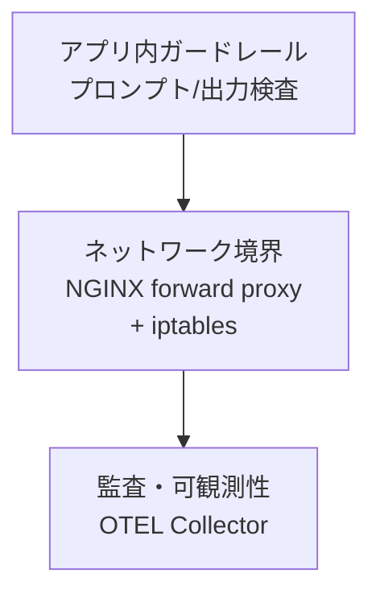
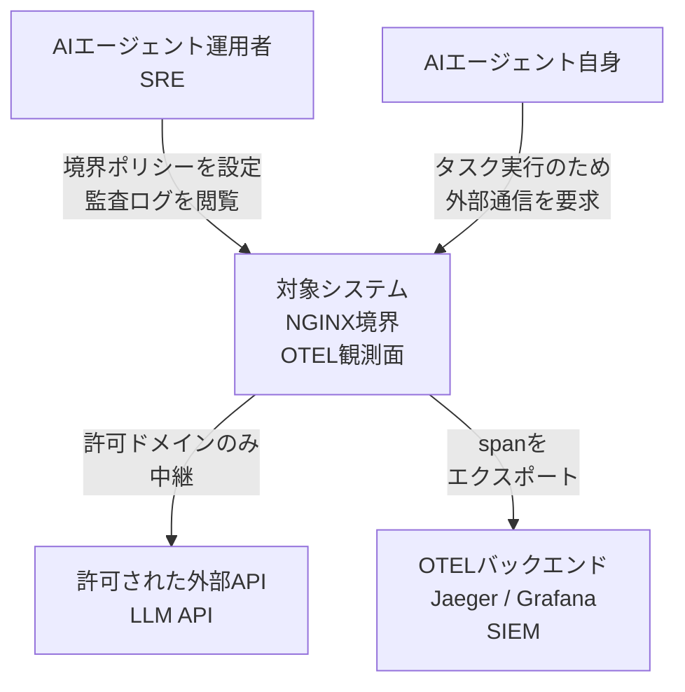
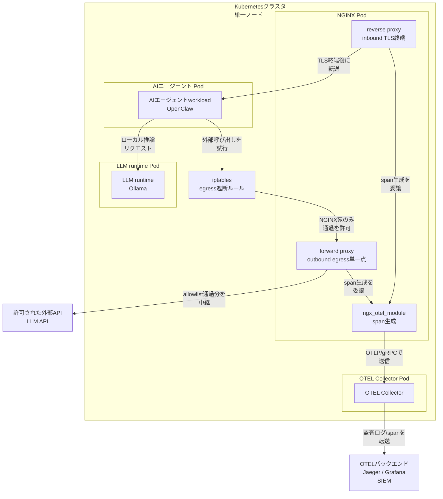
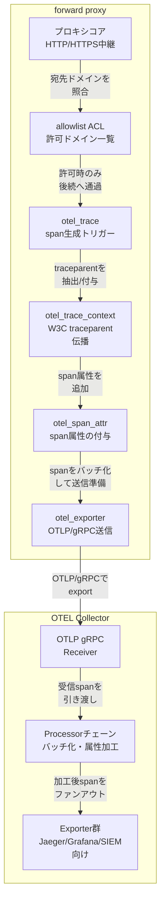
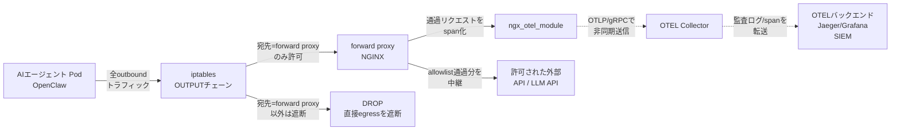
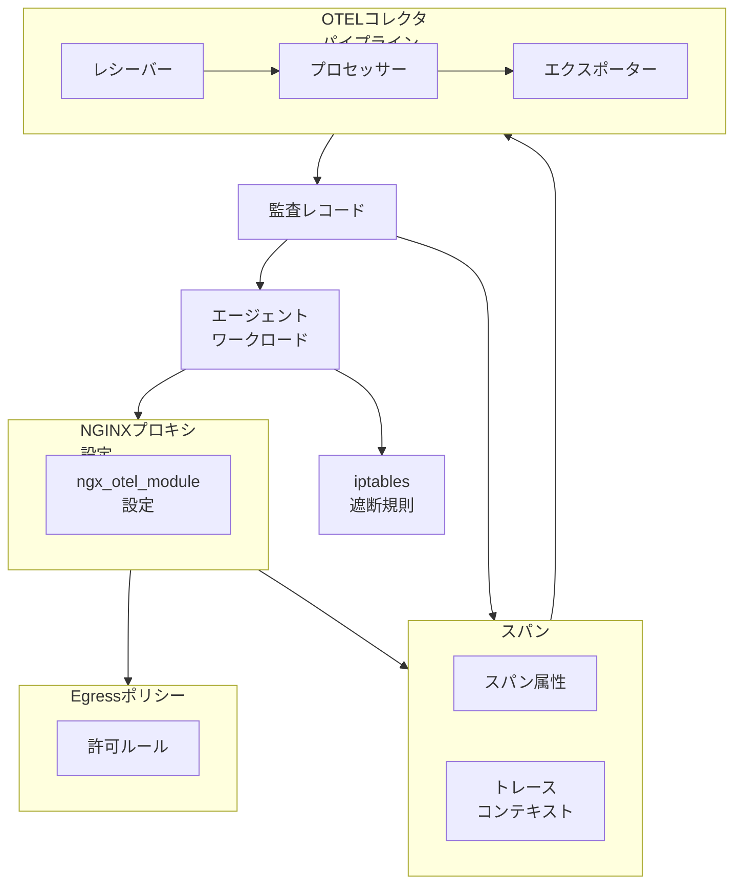
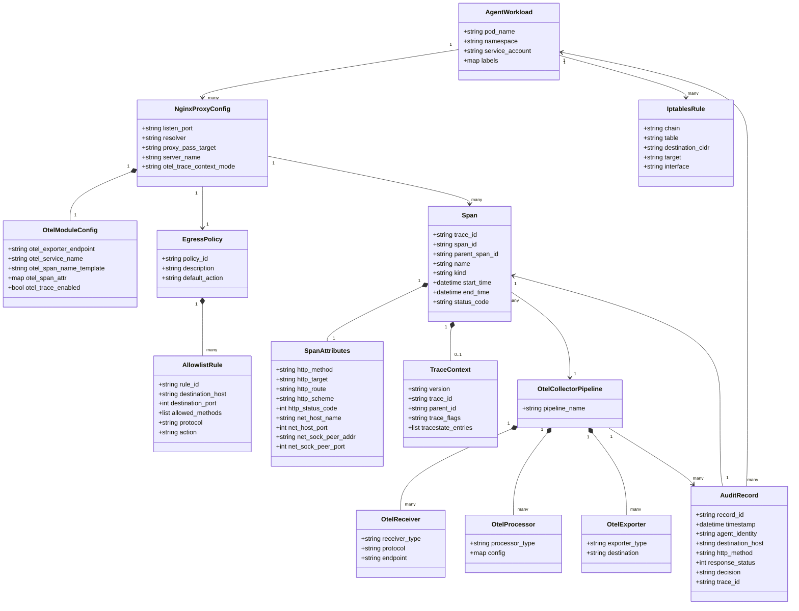
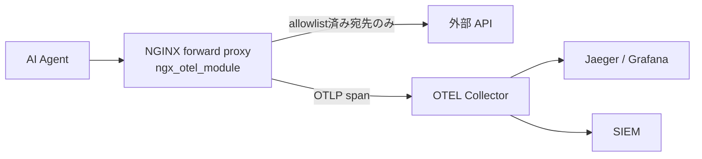

CNCF Blog「Network boundary for AI agents using NGINX and OpenTelemetry」(2026-07-08) が提示した、AI エージェントの外部通信 (egress) を NGINX に単一集約し、iptables で迂回を物理的に塞ぎ、`ngx_otel_module` で全リクエストを OpenTelemetry span として記録するアーキテクチャの技術調査です。
> 検証日: 2026-07-09。主な起点は CNCF Blog 2026-07-08 の記事です。コード例は、NGINX / OpenTelemetry / Kubernetes の公式ドキュメントで確認できる範囲に寄せています。

## 概要

### なぜ AI エージェントに network boundary が必要か

AI エージェントは、ユーザーの指示を解釈してツールを自律的に呼び出します。この自律性が、そのまま制御上の課題になります。

- **意図が不透明**: エージェントが実際に何をしているかを外部から把握しづらいです。CNCF Blog は、ある登壇者の発言として「we don't know what that thing really does」を引用しています。
- **生成時ガードレールは実行時の通信を止められない**: プロンプトやモデル出力を検査するガードレールがあっても、ツール実行フェーズで発生する外部通信そのものは抑制できません。
- **exfiltration・プロンプトインジェクション経由の不正 egress**: エージェントは `.env` や API キーなどの認証情報にアクセスできる場合が多く、悪意ある入力に従って認証情報を外部へ送信するリスクがあります。PipeLab は「プロキシがなければ、侵害されたエージェントは認証情報を無制限に外部へ送信できる」と指摘しています。
- **監査証跡の欠如**: エージェントがどの外部リソースにアクセスしたかを、後から追跡できる仕組みがない環境が大半です。

このアーキテクチャは、これらの課題に対して「エージェントの外部通信を単一の経路に強制的に集約し、その経路を丸ごと記録する」ことで応えます。

### このアーキテクチャの位置づけ

このアーキテクチャは、アプリケーション内のガードレールや利用ポリシーを置き換えるものではありません。**defense-in-depth の 1 層**として、ネットワーク層に強制点を追加する位置づけです。

CNCF Blog は次のように述べています。

> Restricting where an agent can communicate does not guarantee that its decisions are correct or safe.

ネットワーク境界はエージェントの判断の正しさを保証しません。保証するのは「通信できる範囲」だけです。判断の正しさはアプリケーション層の責務のままであり、このアーキテクチャはその外側にもう 1 層、迂回できない制約を足すものです。



| 要素名 | 説明 |
|---|---|
| アプリ内ガードレール | モデルの入出力やツール呼び出し内容を検査する層。判断の正しさを扱う |
| ネットワーク境界 | このアーキテクチャが追加する層。エージェントの外部通信経路そのものを単一化・強制する |
| 監査・可観測性 | 強制された経路を通るリクエストを OTEL span として記録し、後から追跡可能にする層 |

### 「boundary as architecture, not policy」の意味

CNCF Blog のキーフレーズは次の一文に集約されます。

> That makes the boundary a property of the architecture, not a policy we hope the application respects.

この一文が指しているのは、次の違いです。

| 観点 | policy として境界を作る場合 | architecture として境界を作る場合 |
|---|---|---|
| 強制の主体 | アプリケーションコードやエージェント自身の遵守に依存 | iptables 等の OS/ネットワーク機構が強制 |
| 迂回可能性 | コードのバグや想定外の呼び出し経路で迂回されうる | NGINX forward proxy を経由しない egress はそもそも通らない |
| 前提 | アプリがルールを守ることを願う | 守らなくても構造上できない |

このアーキテクチャでは、NGINX forward proxy をエージェントの唯一の egress 経路とし、iptables でそれ以外の送信トラフィックを遮断します。これにより、境界の実効性がアプリケーションの実装品質から切り離されます。

## 特徴

- **open standards ベース**: NGINX (OSS のリバース/フォワードプロキシ) と OpenTelemetry (CNCF の観測標準) という、広く使われるオープンスタンダードの組み合わせで構成します。専用の商用ゲートウェイ製品を新規導入する必要がありません。
- **reverse + forward の二役構成**: 同じ NGINX インスタンスが、受信方向ではリバースプロキシ兼 TLS 終端、送信方向ではフォワードプロキシとして機能します。エージェントの受信・送信の両方が単一のコンポーネントを経由します。
- **iptables による物理的な迂回不能性**: NGINX forward proxy 以外の送信トラフィックを iptables ルールでドロップします。エージェントプロセスが直接外部と通信しようとしても、ネットワークレベルで到達しません。
- **ngx_otel_module による自動 span 化**: NGINX を通過する全リクエストが OpenTelemetry の span として自動生成されます。アプリケーションコード側に計装を追加する必要がありません。
- **OTEL Collector を介した監査ログ集約**: 生成された span は OTEL Collector に送られ、Jaeger・Grafana・SIEM など既存の観測基盤に統合できます。
- **allowlist によるドメイン単位の制御**: NGINX の設定 (例: ConfigMap) で許可ドメインを列挙します。CNCF Blog は `nginx.org` と `duckduckgo.com` のみ許可する例に触れています。
- **ユーザー操作との相関付け**: OTEL の相関 ID により、クライアントからのリクエストとエージェントが行った外部呼び出しを紐づけて追跡できます。
- **Kubernetes デプロイ可能**: CNCF Blog の検証環境は、単一ノードの Kubernetes クラスタ上に NGINX・LLM 推論エンジン・エージェント・OTEL Collector を共存させています。
- **NGINX 製品ラインへの継承予定**: NGINX Ingress Controller (NIC) や NGINX Gateway Fabric (NGF) が、将来的にこの境界機能を継承する計画が言及されています。


### 類似アプローチとの比較

| アプローチ | 強制レイヤ | 迂回耐性 | 監査証跡の取り方 | 導入コスト | AI エージェント特化度 |
|---|---|---|---|---|---|
| NGINX forward proxy + iptables (本アーキテクチャ) | ネットワーク層 (OS の iptables + プロキシ経路の単一化) | 高。iptables が唯一の経路以外を物理遮断 | ngx_otel_module による自動 span 化 + OTEL Collector | 低〜中。既存 OSS の組み合わせ | 中。汎用プロキシをエージェント文脈に適用 |
| service mesh の egress gateway (Istio 等) | メッシュ層 (Envoy サイドカー経由) | 中。既知の外部ホストへの egress は集約できるが、外部 HTTPS プロキシへの自動転送は標準では行われない | Envoy のテレメトリ・アクセスログ | 中〜高。メッシュ全体の導入が前提 | 低。汎用のサービス間通信制御が主目的 |
| MCP gateway / AI gateway 製品 | アプリケーション/プロトコル層 (HTTP・MCP 解析) | 中〜高。ツール呼び出し単位の認可・DLP 検査が可能だが、製品導入とその設定への準拠が前提 | 製品組み込みのログ・ダッシュボード | 中〜高。商用ライセンス・専用導入が多い | 高。MCP ツール ACL・PII フィルタ等の特化機能を持つ |
| eBPF ベースの egress 制御 (Cilium 等) | カーネル層 (eBPF フック) | 高。カーネルレベルでの強制 | Hubble 等のフロー可視化 | 中〜高。Cilium 導入・運用の専門知識が必要 | 低。IP がローテートする動的エンドポイントは静的 allowlist だけでは追いつきにくい |
| アプリ内 allowlist | アプリケーション層 (コード内チェック) | 低。実装漏れやバイパスに弱く、コードの遵守に依存 | アプリ側で個別実装が必要 | 低。追加インフラ不要 | 中。ロジックに組み込めるが遵守を期待する policy に留まる |

## 構造

C4 model に沿って、このアーキテクチャを 3 段階でドリルダウンします。データモデル (属性) や設定ファイルの具体的な書式は扱わず、コンポーネントの名前と責務、ネットワーク上の経路に焦点を当てます。

### システムコンテキスト図

対象システムを 1 つの箱として見たとき、誰がどう関わり、外部の何と通信するかを示します。



| 要素名 | 説明 |
|---|---|
| AI エージェント運用者 SRE | 境界のポリシー (allowlist・遮断ルール) を設定し、監査ログ・span を確認して異常な通信を発見する人 |
| AI エージェント自身 | ツール呼び出しの過程で外部リソースへの通信を発生させる、監視対象のアクター |
| 対象システム NGINX境界 OTEL観測面 | 本調査の対象。エージェントの全 egress を単一経路に強制し、通過した全リクエストを span として記録するシステム |
| 許可された外部API LLM API | allowlist で許可されたドメインのみが到達可能な外部サービス群 |
| OTEL バックエンド Jaeger / Grafana SIEM | 収集された span を保存・可視化・相関分析する既存の観測/セキュリティ基盤 |

### コンテナ図

対象システムをドリルダウンし、単一ノード Kubernetes 上のワークロード配置として表現します。CNCF Blog の検証環境は、同一 namespace 内に NGINX・Ollama (LLM runtime)・OpenClaw (AI エージェント)・OpenTelemetry Collector の 4 ワークロードを配置しています。



#### Kubernetes クラスタ 単一ノード

| 要素名 | 説明 |
|---|---|
| reverse proxy inbound TLS 終端 | 外部クライアント (運用者・上位システム) からの受信リクエストを TLS 終端し、AI エージェント workload に転送する役割 |
| forward proxy outbound egress 単一点 | AI エージェントの送信リクエストが必ず経由する唯一のフォワードプロキシ。同一 NGINX インスタンス内でリバースプロキシと共存する |
| ngx_otel_module span 生成 | NGINX に組み込む OpenTelemetry ネイティブモジュール。通過する全リクエストを span として自動生成する |
| AI エージェントworkload OpenClaw | ユーザーの指示を解釈し、ツール呼び出し・外部通信を自律的に発生させるエージェント本体 |
| LLM runtime Ollama | エージェントが利用するローカル LLM 推論エンジン |
| OTEL Collector | NGINX から送られてきた span を受信し、加工したうえでバックエンドへ転送するコンテナ |
| iptables egress 遮断ルール | ノードのネットフィルタルール。forward proxy 宛て以外の送信トラフィックを物理的に遮断する強制レイヤ |

#### 外部システム

| 要素名 | 説明 |
|---|---|
| 許可された外部API LLM API | allowlist を通過したリクエストのみが到達する外部サービス |
| OTEL バックエンド Jaeger / Grafana SIEM | OTEL Collector からのエクスポート先。span の保存・可視化・監査を担う既存基盤 |


### コンポーネント図

forward proxy と OTEL 観測面をさらにドリルダウンします。allowlist によるドメイン制御、`ngx_otel_module` のディレクティブ、OTLP/gRPC エクスポート、W3C trace context 伝播、Collector のパイプライン構成を示します。



#### forward proxy 内部構成

| 要素名 | 説明 |
|---|---|
| プロキシコア HTTP/HTTPS中継 | エージェントからの送信リクエストを受け付け、宛先へ中継する forward proxy の中核処理 |
| allowlist ACL 許可ドメイン一覧 | 許可ドメインだけを通過させる設定。ConfigMap 等で管理される |
| otel_trace span 生成トリガー | ngx_otel_module のディレクティブ。リクエストごとに span を生成するか (on/off/比率サンプリング) を制御する |
| otel_trace_context W3C traceparent 伝播 | 受信ヘッダから既存の trace context を抽出し、新規または更新した context を後続へ注入するディレクティブ |
| otel_span_attr span 属性の付与 | span にカスタム属性 (変数値等) を追加するディレクティブ |
| otel_exporter OTLP/gRPC送信 | 生成した span を OTLP/gRPC で OTEL Collector のエンドポイントへバッチ送信するディレクティブ |

#### OTEL Collector パイプライン

| 要素名 | 説明 |
|---|---|
| OTLP/gRPC Receiver | ngx_otel_module から OTLP/gRPC で送られてくる span を受信するコンポーネント |
| Processor チェーン バッチ化・属性加工 | 受信した span をバッチ化し、属性の追加・削除・フィルタリングなどを行う中間処理 |
| Exporter 群 Jaeger/Grafana/SIEM向け | 加工済み span を複数のバックエンドへファンアウトして転送するコンポーネント |

#### ネットワーク構成図

AI エージェント Pod から発生する全 egress が NGINX forward proxy を通過する経路と、iptables が forward proxy 以外への直接 egress をドロップする経路を示します。



| 要素名 | 説明 |
|---|---|
| AI エージェント Pod OpenClaw | 全ての egress の発生源。アプリケーションコード自体は経路を選べない |
| iptables OUTPUTチェーン | ノードのパケットフィルタルール。forward proxy 宛て以外の送信パケットを無条件でドロップする迂回不能な強制点 |
| forward proxy NGINX | iptables を通過した唯一の egress 経路。allowlist 判定と span 化がまとめて行われる |
| ngx_otel_module | forward proxy を通過したリクエストを OTEL span として自動生成するモジュール |
| 許可された外部 API / LLM API | allowlist を通過したリクエストのみが到達できる外部サービス |
| DROP 直接egressを遮断 | forward proxy を経由しない送信トラフィックの終着点。パケットは到達せず記録も残らない |
| OTEL Collector | span を受信し、バックエンドへ転送する観測面のコンポーネント |
| OTEL バックエンド Jaeger/Grafana SIEM | span・監査ログの最終的な保存/可視化/分析先 |

## データ

このアーキテクチャが扱うデータは大きく 3 層に分かれます。

| 層 | 役割 |
|---|---|
| 境界制御層 | どの宛先への通信を許可・遮断するかを定義する |
| プロキシ設定層 | NGINX forward proxy がトレースをどう生成・伝播するかを定義する |
| 観測・監査層 | 生成された span を収集し、誰が・いつ・どこへ・何を送り・結果はどうだったかを記録する |

CNCF Blog (2026-07-08) 自体は概念レベルの説明にとどまり、具体的な nginx.conf や iptables ルール文面は公開していません。属性名・ヘッダ形式は `ngx_otel_module` 公式ドキュメントの「Default span attributes」節が実際に自動付与する属性名 (旧世代 semconv)、W3C Trace Context 仕様に整合させて構成しています。

### 概念モデル



| エンティティ | 説明 |
|---|---|
| エージェントワークロード | Kubernetes Pod として動く AI エージェント本体。全 egress 通信は NGINX プロキシ経由と iptables 遮断の 2 経路で強制される |
| Egress ポリシー | 許可ルールの集合。デフォルトは deny、明示的に許可したものだけを通す allowlist モデル |
| 許可ルール | 許可する宛先ドメイン・ポート・メソッドの組。Egress ポリシーに 1 対多で属する |
| iptables 遮断規則 | NGINX を経由しない第二の通信経路を物理的に塞ぐ規則。アーキテクチャの性質として境界を作る |
| NGINX プロキシ設定 | forward proxy 兼 reverse proxy として動く NGINX の設定本体。Egress ポリシーを参照して許可/遮断を実施し、通過する全リクエストに対して span を生成する |
| ngx_otel_module 設定 | NGINX プロキシ設定に属する OTEL span 生成モジュールの設定。エクスポート先・トレースコンテキストの扱い・span 名・カスタム属性を定義する |
| スパン | 1 リクエストに対応する OpenTelemetry の trace 単位データ。スパン属性とトレースコンテキストを保持する |
| スパン属性 | span に付与される属性群。ngx_otel_module が自動付与する旧世代 semconv 属性 (メソッド・target・ホスト・peer アドレス・ステータス等) が実体 |
| トレースコンテキスト | W3C Trace Context 仕様に基づく traceparent/tracestate。エージェントの一連の操作と外部呼び出しを相関させる鍵 |
| OTEL コレクタパイプライン | span を受信・加工・転送する 3 段パイプライン (receiver / processor / exporter) |
| 監査レコード | コレクタパイプラインの出力。どのエージェントがいつどの宛先へ何を送り結果は何だったかを人が確認できる形にした記録 |

### 情報モデル



| クラス | 属性の根拠 |
|---|---|
| `Span` / `SpanAttributes` | `ngx_otel_module` 公式ドキュメント「Default span attributes」が自動付与すると明記する属性 `http.method` / `http.target` / `http.route` / `http.scheme` / `http.status_code` / `net.host.name` / `net.host.port` / `net.sock.peer.addr` / `net.sock.peer.port` (いずれも旧世代 semconv 名)。span kind は公式ドキュメントに明記がなく、自動付与属性の内容から SERVER 相当と推測される (forward proxy 越しの upstream 向け CLIENT span 生成は未実装機能として GitHub Issue で議論中)。span 名の既定は location 名。新世代 semconv 名 (`http.request.method` / `url.full` 等) を使いたい場合は `otel_span_attr` で明示的にカスタム付与する |
| `TraceContext` | W3C Trace Context の `traceparent` ヘッダ形式 `version-trace-id-parent-id-trace-flags` (各々 1/16/8/1 バイトの 16 進数)。`tracestate` は key-value リスト (最大 32 エントリ) |
| `OtelModuleConfig` | `ngx_otel_module` の主要ディレクティブ `otel_exporter` / `otel_service_name` / `otel_span_name` / `otel_span_attr` / `otel_trace` / `otel_trace_context` (extract / inject / propagate / ignore) |
| `OtelCollectorPipeline` とその構成要素 | OTEL Collector の標準パイプライン構造 receiver → processor → exporter |
| `AuditRecord` | CNCF Blog が示す「ユーザーの操作とエージェントが行った外部呼び出しを相関させる」「span のステータスを収集する」という説明から、span 由来の情報を人手監査可能な形に投影したもの。記事はフィールド名まで開示していないため、span 属性から導出可能な最小集合として構成 |


## 構築方法

**捏造防止の注記**: CNCF Blog (2026-07-08) 本文には nginx.conf 全文・iptables ルール・Kubernetes マニフェストのコード掲載がなく、「OpenClaw Network Boundary repository」への言及のみで実リンクは確認できませんでした。本セクションのコード例は `nginx.org` / `docs.nginx.com` / `opentelemetry.io` の現行公式ドキュメントで確認できた仕様のみで組み立てています。確認できなかった箇所は「公式ドキュメントで要確認」と注記します。

### 前提条件

| 要素 | 要件 |
|---|---|
| NGINX 本体 | `nginx-module-otel` プリビルドパッケージが提供される版 (nginx.org のパッケージリポジトリで提供。1.25.3 以降とする情報があるが公式本文での明記は要確認) |
| NGINX Plus (商用、任意) | R29 (`nginx-plus-module-otel` = OpenTelemetry モジュール導入版) 以降。R36 以降で forward proxy 用 `tunnel_pass` が利用可能 |
| ngx_otel_module ビルド元 | https://github.com/nginx/nginx-otel (旧 nginxinc/nginx-otel) |
| OTEL Collector | OTLP/gRPC receiver (既定ポート 4317) |
| ネットワーク | agent Pod から NGINX への到達性 (同一 namespace 内 Service 経由) |

### ngx_otel_module の入手・ロード

`ngx_otel_module` は NGINX 本体に同梱されない**動的モジュール**です。入手方法は 2 通りあります。

**方法 1: 公式パッケージリポジトリからインストール (推奨)**

```bash
# 1. 前提パッケージ
sudo apt update && \
sudo apt install curl gnupg2 ca-certificates lsb-release ubuntu-keyring

# 2. nginx.org 署名鍵の取得
curl https://nginx.org/keys/nginx_signing.key | gpg --dearmor \
  | sudo tee /usr/share/keyrings/nginx-archive-keyring.gpg >/dev/null

# 3. 公式 apt リポジトリの追加
echo "deb [signed-by=/usr/share/keyrings/nginx-archive-keyring.gpg] \
https://nginx.org/packages/ubuntu $(lsb_release -cs) nginx" \
  | sudo tee /etc/apt/sources.list.d/nginx.list

# 4. NGINX 本体 + otel 動的モジュールをインストール
sudo apt update && \
sudo apt install nginx nginx-module-otel
```

- OSS 版のプリビルドパッケージ名は `nginx-module-otel` (nginx.org のパッケージリポジトリで提供)。
- NGINX Plus では `nginx-plus-module-otel` (NGINX Plus R29 以降、商用サブスクリプションが必要)。

**方法 2: ソースからビルド**

```bash
git clone https://github.com/nginx/nginx.git
cd nginx && auto/configure --with-compat
cd ..
git clone https://github.com/nginx/nginx-otel.git
cd nginx-otel && mkdir build && cd build
cmake -DNGX_OTEL_NGINX_BUILD_DIR=/path/to/nginx/objs ..
make
```

- ビルドした `ngx_otel_module.so` は**ビルドに使った NGINX 本体と同一バージョン・同一 OS** でのみ動作します (公式 README に明記)。
- 事前ビルド済みの公式 Docker イメージは、確認した範囲では見当たりませんでした。**公式ドキュメントで要確認**。Dockerfile で方法 1 または方法 2 を実行してイメージを自前ビルドする運用が現実的です。

**ロード (両方法共通)**: `nginx.conf` の先頭 (トップレベルコンテキスト) に追加します。

```nginx
load_module modules/ngx_otel_module.so;

http {
    # ...
}
```

設定反映は通常の NGINX 運用と同じです。

```bash
nginx -t
nginx -s reload
```

### forward proxy として NGINX を構成する方法

**重要な制約 (公式ドキュメントで確認済み)**: NGINX で HTTP `CONNECT` メソッドを使った HTTPS 向け forward proxy (トンネリング) は **NGINX Plus R36 以降の `tunnel_pass` ディレクティブが必要**であり、OSS 版 NGINX には含まれません。OSS で `CONNECT` を扱いたい場合は、サードパーティモジュール `ngx_http_proxy_connect_module` を組み込んでビルドする必要があります。CNCF Blog は agent から DuckDuckGo (HTTPS) への到達を許可する例を挙げていますが、forward proxy の実装方式 (CONNECT 対応版か、TLS 終端方式か) の明記はなく、**公式ドキュメントで要確認**です。

**平文 HTTP のリクエストを forward proxy する場合** (OSS NGINX でそのまま利用可能) は、`resolver` + 絶対 URI の `proxy_pass` で実現します。

```nginx
http {
    resolver 127.0.0.11 valid=30s;   # クラスタ内 DNS (例: kube-dns/coredns) を指す

    server {
        listen 8888;

        location / {
            proxy_pass $scheme://$http_host$request_uri;
            proxy_set_header Host $http_host;
        }
    }
}
```

- `resolver` は宛先ホスト名を都度解決するために**必須**です (公式ドキュメントに明記)。
- `proxy_pass $scheme://$http_host$request_uri;` は、クライアントが送ってきた絶対 URI 形式のリクエストをそのまま宛先へ中継する forward proxy の定石です。

**HTTPS (CONNECT) を扱う場合** (NGINX Plus R36+、`tunnel_pass`) は次の形になります。

```nginx
server {
    listen 8888;

    location / {
        if ($request_method != CONNECT) {
            return 403 "Forbidden: allows only CONNECT method";
        }
        tunnel_pass;
    }
}
```

- `tunnel_pass` はコンテンツ処理ディレクティブのため、`server` に書いても子の `location` には継承されません。`location` 内に明示します。

### allowlist の実装

CNCF Blog は ConfigMap で `nginx.org` と `duckduckgo.com` のみ許可する例に触れています (記事本文はコンセプト説明のみで設定コード全文の掲載はありません)。以下は公式ドキュメントの `map` ディレクティブに基づく実装例です。

**平文 HTTP forward proxy 向け (`map` + `if`)**:

```nginx
map $http_host $is_allowed_host {
    hostnames;
    default          0;
    nginx.org        1;
    www.nginx.org    1;
    duckduckgo.com   1;
    www.duckduckgo.com 1;
}

server {
    listen 8888;
    resolver 127.0.0.11 valid=30s;

    location / {
        if ($is_allowed_host = 0) {
            return 403 "destination not allowed by egress policy";
        }
        proxy_pass $scheme://$http_host$request_uri;
        proxy_set_header Host $http_host;
    }
}
```

**HTTPS CONNECT forward proxy 向け (NGINX Plus `tunnel_allow_upstream`)**:

```nginx
map $host $allowed_host {
    hostnames;
    default             0;
    nginx.org           1;
    duckduckgo.com      1;
}

server {
    listen 8888;

    tunnel_allow_upstream $allowed_host;
    tunnel_pass;
}
```

- `map` の `hostnames;` パラメータにより `*.example.com` のようなワイルドカード指定も可能です (公式ドキュメント記載)。
- 許可対象外は `403` を返す、または `tunnel_allow_upstream` が `0` を返した場合は接続を拒否します。

### iptables で agent の直接 egress を遮断し NGINX 経由に強制する

NGINX と agent を同一 Pod 内のコンテナ (ネットワーク namespace 共有) として配置し、Pod 起動時の `initContainer` (`NET_ADMIN` capability 必須) で iptables ルールを注入する構成を想定します。この起動時ルール投入パターンは Linkerd / Istio の sidecar 注入で広く使われている手法です (以下は標準的な netfilter 構文に基づく例)。

```bash
# 1. ループバック (NGINX との localhost 通信) は許可
iptables -A OUTPUT -o lo -j ACCEPT

# 2. 確立済み・関連する戻り通信は許可
iptables -A OUTPUT -m state --state ESTABLISHED,RELATED -j ACCEPT

# 3. DNS 解決 (NGINX の resolver 用) はクラスタ DNS 宛てのみに限定
#    (宛先無制限の 53/udp を空けると DNS トンネリングで exfiltration される)
iptables -A OUTPUT -p udp -d <cluster-dns-clusterip> --dport 53 -j ACCEPT
iptables -A OUTPUT -p tcp -d <cluster-dns-clusterip> --dport 53 -j ACCEPT

# 4. NGINX (forward proxy) 宛てのみ許可 (同一 Pod 内 localhost:8888 を想定)
iptables -A OUTPUT -p tcp -d 127.0.0.1 --dport 8888 -j ACCEPT

# 5. NGINX プロセス自身 (実行 UID) からの直接 egress はループ回避のため個別許可
iptables -A OUTPUT -m owner --uid-owner <nginx-uid> -j ACCEPT

# 6. 上記いずれにも合致しない agent からの直接 egress は全て遮断
iptables -A OUTPUT -j DROP
```

- ポイントは「NGINX 自身の egress」と「agent からの egress」を UID (`--uid-owner`) または送信元プロセスで区別し、agent には NGINX 宛て以外への `OUTPUT` を許可しないことです。
- **DNS は宛先を絞る**: `--dport 53` を宛先無制限で許可すると、任意の外部 DNS サーバーへの問い合わせを使った DNS トンネリング (帯域外 exfiltration) が残ります。クラスタ内 DNS (kube-dns/coredns の ClusterIP) 宛てのみに限定します。
- **IPv6 も塞ぐ**: 上記は IPv4 (`iptables`) のみです。Pod が IPv6 を持つ環境では同等の `ip6tables` ルールを併記するか、Pod の IPv6 を無効化しない限り IPv6 egress が迂回経路として残ります。
- Kubernetes 上では `initContainer` にこのスクリプトを実行させ、`securityContext.capabilities.add: ["NET_ADMIN"]` を付与します。
- CNCF Blog 本文には具体的なルール例の掲載がないため、**設計思想の再現に留め、正確な運用ルールは自環境で検証してください**。

### OTEL Collector のデプロイ

最小構成の Collector 設定 (`otlp` receiver → `batch` processor → exporter) は公式ドキュメント記載のパターンに準拠します。

```yaml
# otel-collector-config.yaml
receivers:
  otlp:
    protocols:
      grpc:
        endpoint: 0.0.0.0:4317
      http:
        endpoint: 0.0.0.0:4318

processors:
  batch: {}

exporters:
  debug:
    verbosity: detailed
  # 実運用では Jaeger / Grafana Tempo / SIEM 等への OTLP exporter に置き換える
  otlp:
    endpoint: jaeger-collector.observability.svc:4317
    tls:
      insecure: true

service:
  pipelines:
    traces:
      receivers: [otlp]
      processors: [batch]
      exporters: [debug, otlp]
```

## 利用方法

### ngx_otel_module ディレクティブ一覧

出典: https://nginx.org/en/docs/ngx_otel_module.html (現行版で確認)。

| ディレクティブ | 引数 | 既定値 | 設定コンテキスト | 説明 |
|---|---|---|---|---|
| `otel_exporter` | `{ ... }` ブロック | — | `http` | OTLP/gRPC エクスポータ設定ブロック |
| `otel_exporter` 内 `endpoint` | ホスト:ポート | — | `otel_exporter` ブロック内 | OTEL Collector の OTLP/gRPC エンドポイント |
| `otel_exporter` 内 `interval` | 時間 | `5s` | 同上 | 最大エクスポート間隔 |
| `otel_exporter` 内 `batch_size` | 数値 | `512` | 同上 | 1 バッチあたり最大 span 数 |
| `otel_exporter` 内 `batch_count` | 数値 | `4` | 同上 | ワーカーごとの保留バッチ数上限 |
| `otel_exporter` 内 `trusted_certificate` | ファイルパス | OS の CA バンドル | 同上 | TLS 検証用 CA 証明書 (v0.1.2+) |
| `otel_exporter` 内 `header` | 名前 値 | — | 同上 | エクスポートリクエストに付与するカスタムヘッダ (v0.1.2+) |
| `otel_service_name` | 文字列 | `unknown_service:nginx` | `http` | OTEL リソースの `service.name` |
| `otel_resource_attr` | 名前 値 | — | `http` | カスタムリソース属性 (v0.1.2+) |
| `otel_trace` | `on` \| `off` \| `$variable` | `off` | `http`, `server`, `location` | トレーシングの有効化。変数でサンプリング判定も可能 |
| `otel_trace_context` | `extract` \| `inject` \| `propagate` \| `ignore` | `ignore` | `http`, `server`, `location` | トレースコンテキストの伝播方式 |
| `otel_span_name` | 文字列 (変数使用可) | location 名 (静的) | `http`, `server`, `location` | span 名の指定。既定はリクエスト先 location の名前 |
| `otel_span_attr` | 名前 値 (変数使用可) | — | `http`, `server`, `location` | カスタム span 属性の付与 |

### Kubernetes マニフェスト例

**ConfigMap: NGINX 設定 (reverse proxy + forward proxy + allowlist + otel)**

```yaml
apiVersion: v1
kind: ConfigMap
metadata:
  name: nginx-boundary-conf
  namespace: agent-boundary
data:
  nginx.conf: |
    load_module modules/ngx_otel_module.so;

    events {}

    http {
      resolver 127.0.0.11 valid=30s;

      otel_exporter {
        endpoint otel-collector.agent-boundary.svc:4317;
      }
      otel_service_name nginx-agent-boundary;

      map $http_host $is_allowed_host {
        hostnames;
        default            0;
        nginx.org          1;
        www.nginx.org      1;
        duckduckgo.com     1;
        www.duckduckgo.com 1;
      }

      # forward proxy: agent -> 外部
      server {
        listen 8888;
        otel_trace on;
        otel_trace_context propagate;
        otel_span_name "forward_proxy:$http_host";
        otel_span_attr "boundary.direction" "egress";

        location / {
          if ($is_allowed_host = 0) {
            return 403 "destination not allowed by egress policy";
          }
          proxy_pass $scheme://$http_host$request_uri;
          proxy_set_header Host $http_host;
        }
      }

      # reverse proxy: 外部 -> agent (Ollama/OpenClaw)
      server {
        listen 443 ssl;
        ssl_certificate     /etc/nginx/tls/tls.crt;
        ssl_certificate_key /etc/nginx/tls/tls.key;

        otel_trace on;
        otel_trace_context extract;
        otel_span_name "reverse_proxy:$request_uri";
        otel_span_attr "boundary.direction" "ingress";

        location / {
          proxy_pass http://agent-svc.agent-boundary.svc:11434;
        }
      }
    }
```

**agent Pod: egress を iptables で NGINX 経由に強制**

```yaml
apiVersion: v1
kind: Pod
metadata:
  name: openclaw-agent
  namespace: agent-boundary
spec:
  initContainers:
    - name: iptables-init
      image: <NET_ADMIN 権限で iptables を実行できるイメージ>
      securityContext:
        capabilities:
          add: ["NET_ADMIN"]
      command: ["sh", "-c"]
      args:
        - |
          iptables -A OUTPUT -o lo -j ACCEPT
          iptables -A OUTPUT -m state --state ESTABLISHED,RELATED -j ACCEPT
          iptables -A OUTPUT -p udp -d <cluster-dns-clusterip> --dport 53 -j ACCEPT
          iptables -A OUTPUT -p tcp -d <cluster-dns-clusterip> --dport 53 -j ACCEPT
          iptables -A OUTPUT -p tcp -d 127.0.0.1 --dport 8888 -j ACCEPT
          iptables -A OUTPUT -j DROP
  containers:
    - name: agent
      image: <openclaw イメージ>
      env:
        - name: HTTP_PROXY
          value: "http://127.0.0.1:8888"
        - name: HTTPS_PROXY
          value: "http://127.0.0.1:8888"
    - name: nginx-boundary-sidecar
      image: <自前ビルドの nginx + ngx_otel_module イメージ>
      ports:
        - containerPort: 8888
      volumeMounts:
        - name: conf
          mountPath: /etc/nginx/nginx.conf
          subPath: nginx.conf
  volumes:
    - name: conf
      configMap:
        name: nginx-boundary-conf
```

- `agent` と `nginx-boundary-sidecar` を同一 Pod に同居させ、ネットワーク namespace を共有させることで `127.0.0.1:8888` への到達と iptables ルールの Pod 単位適用が両立します。
- Deployment 分離構成 (NGINX を独立 Service にする案) を採る場合、iptables の許可先は NGINX Service の ClusterIP に置き換えます。

**Deployment/Service: OTEL Collector** (前掲 `otel-collector-config.yaml` を ConfigMap 化して参照)

```yaml
apiVersion: apps/v1
kind: Deployment
metadata:
  name: otel-collector
  namespace: agent-boundary
spec:
  replicas: 1
  selector:
    matchLabels: { app: otel-collector }
  template:
    metadata:
      labels: { app: otel-collector }
    spec:
      containers:
        - name: otel-collector
          image: otel/opentelemetry-collector:latest
          args: ["--config=/etc/otel/config.yaml"]
          ports:
            - containerPort: 4317
          volumeMounts:
            - name: conf
              mountPath: /etc/otel
      volumes:
        - name: conf
          configMap:
            name: otel-collector-conf   # otel-collector-config.yaml を config.yaml として格納
---
apiVersion: v1
kind: Service
metadata:
  name: otel-collector
  namespace: agent-boundary
spec:
  selector: { app: otel-collector }
  ports:
    - port: 4317
      targetPort: 4317
```

### 動作確認

**前提の注意 (proxy 方式と CONNECT)**: 下記の `curl -x http://127.0.0.1:8888 https://...` は、`https://` 宛てのため CONNECT メソッドを送ります。前掲の OSS 向け ConfigMap 例 (`proxy_pass $scheme://$http_host$request_uri`) は**平文 HTTP の forward proxy** であり、CONNECT を処理できません。HTTPS を通すには、NGINX Plus の `tunnel_pass`/`tunnel_allow_upstream` 構成か、OSS では `ngx_http_proxy_connect_module` を組み込んだビルドが必要です。以下の検証は CONNECT 対応ビルドを前提とします。平文 HTTP だけを検証する場合は `curl -x http://127.0.0.1:8888 http://nginx.org` のように `http://` 宛てにします。

**許可ドメインへの通信 (通る)**:

```bash
kubectl exec -n agent-boundary openclaw-agent -c agent -- \
  curl -sS -x http://127.0.0.1:8888 https://duckduckgo.com -o /dev/null -w '%{http_code}\n'
# => 200 が返り、NGINX 側で span が生成される
```

**非許可ドメインへの通信 (allowlist で遮断)**:

```bash
kubectl exec -n agent-boundary openclaw-agent -c agent -- \
  curl -sS -x http://127.0.0.1:8888 https://example.com -o /dev/null -w '%{http_code}\n'
# => 403 (allowlist で拒否)
```

**NGINX を迂回した直接 egress (iptables で遮断)**:

```bash
kubectl exec -n agent-boundary openclaw-agent -c agent -- \
  curl -sS --max-time 3 https://duckduckgo.com -o /dev/null -w '%{http_code}\n'
# => 接続がタイムアウト/失敗する (iptables OUTPUT DROP)
```

**span の確認**: OTEL Collector の `debug` exporter ログ、または Jaeger / Grafana Tempo 等で `service.name = nginx-agent-boundary` の span を検索し、`boundary.direction` (`ingress`/`egress`) 属性と宛先ホストが記録されていることを確認します。

```bash
kubectl logs -n agent-boundary deploy/otel-collector | grep -A5 'forward_proxy'
```

## 運用

### 監査ログの活用

- NGINX は `otel_trace on` を設定した location を通過するリクエストごとに OTEL span を 1 本生成します。
- span には HTTP semantic conventions 準拠の属性 (メソッド・宛先・ステータス等) が自動付与され、「どの agent がいつどの宛先へ通信したか」を再構成できます。
- OTEL Collector が span を Jaeger / Grafana / SIEM に転送します。CNCF 記事では監査ログとしての永続化・観測基盤への連携・SIEM 連携の 3 系統が挙げられています。



- 運用フロー: 追いたい agent の service.name / トレース ID で Jaeger を検索し、経路上の span から宛先ホスト・ステータスコード・タイムスタンプを確認します。
- SIEM 連携時は Collector の exporter で SIEM 向け OTLP/HTTP または Kafka などのパイプラインに転送します。

### allowlist の更新運用

- allowlist を ConfigMap 化し、変更後に NGINX Pod を reload (`nginx -s reload` またはローリング再起動) して反映します。
- allowlist の変更は GitOps で管理し、Pull Request → レビュー → 自動デプロイの経路を通すことで「誰が・いつ・なぜ許可を広げたか」の証跡を Git 履歴に残せます。
- allowlist はアプリケーションコードと切り離して管理し、agent の実装変更なしに宛先を絞り込み・拡張できる状態を保ちます。
- `nginx -s reload` は graceful reload (旧 worker が処理中の接続を捌き切ってから新 worker に切り替わる) のため、reload 自体は原則ダウンタイムを生みません。ただし Pod のローリング再起動で反映する構成では切り替え中の接続断があり得るため、監査対象の通信を止めない運用にするなら graceful reload を優先します。

### span の保持・サンプリング

- 監査目的では全リクエストの記録が前提のため、境界となる NGINX 側は基本 `otel_trace on` (全件トレース) を既定にします。
- 母数が多く保持コストが問題になる場合は `otel_trace` に変数を渡すことで比率サンプリングができます。

```nginx
split_clients "$otel_trace_id" $ratio_sampler {
    10%  on;
    *    off;
}

location / {
    otel_trace $ratio_sampler;
}
```

| 方式 | 判定タイミング | 監査での向き不向き |
|---|---|---|
| head-based | span 生成前に一律の確率で決定 | 設定が容易・低コスト。ただしエラーを含む通信だけ残す等の条件付き抽出はできない |
| tail-based | トレース全体を見てから決定 | エラー含有・特定属性の通信を確実に残せるが、実装・運用が複雑でステートフルな Collector 構成が必要 |

- 「異常系だけは絶対に取りこぼさない」要件がある場合は、境界の NGINX 側は head-based (全件 on が基本) で出し、Collector 側の tail_sampling processor でエラー/特定宛先の span を優先的に長期保存する構成が現実的です。

### 性能監視

- NGINX 公式の OpenTelemetry 連携ガイドは、ngx_otel_module 有効時の request processing overhead を 10〜15% に収まるとし、他の OpenTelemetry 実装では最大 50% の性能劣化があり得ると比較しています。
- CNCF 記事では GPU 使用率グラフを用いて、境界導入後も agent のワークロード実行が feasible であることを示していますが、NGINX プロキシ自体の詳細なオーバーヘッド実測値は記事内に明記されていません。
- 運用では NGINX の request 処理レイテンシ (p50/p95/p99) を境界導入前後で比較し、`otel_exporter` の `batch_size` / `batch_count` / `interval` を調整して Collector への送信頻度とバッファリングのバランスを取ります。

### 可用性

- forward proxy を 1 台構成にすると、NGINX 障害時に全 agent の egress が止まる単一障害点になります。
- CNCF 記事はこの点を「proxy-based enforcement introduces another operational component that must be secured and monitored」として運用上の懸念に挙げていますが、具体的な冗長化手段までは踏み込んでいません。
- HA (High Availability) 構成は NGINX 公式ドキュメントの keepalived パターンが利用できます。

| 構成 | 特徴 |
|---|---|
| active-passive | 複数ノードが 1 つの VIP を共有し、priority の高いノードが VIP を保持。障害時に次点ノードへフェイルオーバー |
| active-active | ノードごとに異なる VIP を持ち、互いに priority を逆転させて同時稼働。DNS ロードバランシングで振り分け |

- OTEL Collector 側も単一インスタンスでは同様に SPOF (Single Point of Failure) となるため、agent 型 (各ノードに配置) または gateway 型 (複数レプリカ + ロードバランサ) でスケールし、span 欠落を防ぎます。

## ベストプラクティス

### defense-in-depth の 1 層として位置づける

- CNCF 記事は本アーキテクチャを「it should be viewed as one layer in a broader defense-in-depth strategy alongside identity, policy, runtime security, and application-level guardrails」と明言しています。
- ネットワーク境界だけで agent の安全性を担保しようとせず、identity (認証・認可)・policy・runtime guardrails・application-level guardrails と重ねて設計します。

### boundary as architecture を壊さない運用

- 境界は「agent が守ってくれることを期待するポリシー」ではなく「構造的に迂回できない仕組み」であるべきです。iptables で forward proxy 以外への全 egress を drop し、agent プロセスに迂回経路を残さない構成を取ります。
- agent コンテナ/Pod に新しい sidecar やツールを追加する際、その通信経路が iptables ルールをバイパスしていないか都度確認します。
- デバッグ目的で一時的に iptables ルールを緩めた場合、作業後に必ず revert し、GitOps 管理下の状態と実機の設定に差分が残らないようにします。
- sidecar / init container パターンで network namespace レベルに egress 強制を仕込み、アプリケーションコードの変更や新規コンテナ追加でも境界が自動的に効く構成を維持します。

### 最小許可 (deny-by-default)

- allowlist は「明示的に許可した宛先以外は全て拒否」の deny-by-default を既定とします。
- 宛先は業務上必要な最小セットに絞り、広範なワイルドカード (`*.example.com` のような広すぎるパターン) は避けます。
- 新規宛先の追加は allowlist への明示的な追記を必須にします。
- **保証範囲の限界**: forward proxy が縛れるのは HTTP(S) egress です。DNS・ICMP・生ソケットなどの帯域外チャネルは本アーキテクチャの保証範囲外であり、iptables で DNS を社内リゾルバに限定する・IPv6 を塞ぐ・NetworkPolicy を併用するなど、別の縮小策を重ねます。

### 監査証跡は通信境界から取る

- 監査ログの正とする発生源は、agent のアプリケーション内ログではなく NGINX の span (通信境界) です。
- アプリケーション内ログは agent の実装・プロンプト経由で改変され得る一方、境界の span は agent コードから独立して生成されるため、agent 自身による記録の改竄・欠落から影響を受けません。
- アプリケーション内ログは agent の意思決定コンテキストの補助情報として併用し、監査の一次証跡としては境界の span を採用します。

### TLS 可視性

| 方式 | 見える範囲 | 中身の可視性 |
|---|---|---|
| CONNECT トンネル (TLS パススルー) | SNI / 接続先ホスト・ポートまで | リクエスト/レスポンスの中身は不可視 |
| TLS 終端 (MITM) | ホスト情報に加えリクエスト/レスポンス本文まで | 可視化できるが自前 CA 証明書の配布・信頼設定が必要 |

- CNCF 記事の構成は inbound 側で「terminates TLS, and forwards requests for the agent」と TLS 終端を行っていますが、outbound (agent → 外部 API) 側をどちらの方式にしているかは記事内で明示されていません。監査で通信内容 (payload) まで見たい場合は MITM 型の TLS 終端が必要になる点に留意してください。

### OTEL Collector のセキュア化・監査ログ改竄防止

- 送信側 (NGINX の `otel_exporter`)・受信側 (Collector receiver) の両方で TLS/mTLS を設定し、`trusted_certificate` で CA を明示します。mTLS を有効にしないと Collector の receiver は任意のクライアントからデータを受け付けます。
- 長期保存は Amazon S3 Object Lock、Azure Immutable Blob Storage、GCS の保持ポリシーなど append-only ストレージを使うと、書き込み後の改変・削除を防止できます。
- span に含まれる可能性のある機微情報 (トークン・個人情報等) は Collector の processor で属性削除・マスキング・正規表現変換を行い、監査ログとして保存する前に最小化します。

### 採用前チェックリスト

| 確認観点 | 見るポイント |
|---|---|
| 強制経路 | agent からの HTTP(S) egress が forward proxy 以外へ出られない構成 |
| CONNECT 対応 | HTTPS を通す方式が NGINX Plus `tunnel_pass`、サードパーティモジュール、TLS 終端のいずれかで明確 |
| DNS と IPv6 | DNS の宛先限定、IPv6 egress の遮断または同等制御 |
| 監査証跡 | `otel_trace on`、Collector への mTLS、長期保存先の改変防止 |
| 運用変更 | allowlist 更新の GitOps 化、reload 手順、緊急時の rollback 手順 |

## トラブルシューティング

| 症状 | 主な原因 | 対処 |
|---|---|---|
| allowlist したはずのドメインに繋がらない | forward proxy 用の resolver 未設定、または DNS 解決失敗 | NGINX の `resolver` ディレクティブが設定されているか確認する。proxy から対象ドメインへ `nslookup` / `curl` で疎通確認する |
| span が全く出ない | `otel_trace` が `off` (既定値) のまま、該当 location に未設定 | `otel_trace on;` を対象の `http`/`server`/`location` に設定する。`otel_trace_context` の設定漏れも合わせて確認する |
| span は出るが Collector に届かない | `otel_exporter.endpoint` の誤り、Collector 側 receiver が未起動 | `otel_exporter { endpoint ... }` の host:port を確認する。Collector のログで receiver 起動状態を確認する |
| span が一部しか出ない | サンプリング比率が意図せず低い、`split_clients` の設定ミス | `otel_trace` に渡している変数・比率を見直す。監査要件なら比率を 100% (`on`) に戻す |
| agent が境界を迂回できてしまう | iptables ルールの漏れ、新規追加した sidecar/コンテナが別経路で外部通信 | iptables で forward proxy 以外への egress が全て drop されているか再確認する。新規コンテナ追加時のネットワーク経路を棚卸しする |
| 性能劣化が大きい (10-15% を超える) | `otel_exporter` のバッチ設定が過小、Collector 側の処理遅延がバックプレッシャーになっている | `batch_size` / `batch_count` / `interval` を調整する。Collector のリソースとレプリカ数を見直す |
| trace context が伝播しない (呼び出しチェーンが分断) | `otel_trace_context` が `ignore` (既定値) のまま | 呼び出し元のコンテキストを使うなら `extract`、新規発行なら `inject`、両対応なら `propagate` を設定する |
| allowlist を GitOps で更新したのに反映されない | ConfigMap 更新後に NGINX へ reload/再起動がかかっていない | ConfigMap の変更をトリガーに `nginx -s reload` またはローリング再起動が走る構成か確認する |
| Collector が任意のクライアントからデータを受け付ける | receiver に TLS/mTLS が未設定 | receiver 設定に TLS 証明書、必要であればクライアント証明書検証 (mTLS) を追加する |

## まとめ

AI エージェントの外部通信は、プロンプトやアプリ内ポリシーだけで縛るよりも、NGINX forward proxy と iptables で通信経路を単一化し、OpenTelemetry span を境界で取得する構成にすると監査可能性が上がります。一方で、HTTPS CONNECT の実装方式、DNS・IPv6・Collector の保護、allowlist の GitOps 運用を設計に含める必要があります。

この記事が少しでも参考になった、あるいは改善点などがあれば、ぜひリアクションやコメント、SNSでのシェアをいただけると励みになります！

## 参考リンク

- 公式ドキュメント
  - [Network boundary for AI agents using NGINX and OpenTelemetry (CNCF Blog, 2026-07-08)](https://www.cncf.io/blog/2026/07/08/network-boundary-for-ai-agents-using-nginx-and-opentelemetry/)
  - [Module ngx_otel_module (NGINX docs)](https://nginx.org/en/docs/ngx_otel_module.html)
  - [OpenTelemetry dynamic module 管理ガイド (docs.nginx.com)](https://docs.nginx.com/nginx/admin-guide/dynamic-modules/opentelemetry/)
  - [HTTP CONNECT proxy (docs.nginx.com)](https://docs.nginx.com/nginx/admin-guide/web-server/http-connect-proxy/)
  - [Installing NGINX Open Source (docs.nginx.com)](https://docs.nginx.com/nginx/admin-guide/installing-nginx/installing-nginx-open-source/)
  - [OpenTelemetry Collector Architecture](https://opentelemetry.io/docs/collector/architecture/)
  - [OpenTelemetry Collector Configuration](https://opentelemetry.io/docs/collector/configuration/)
  - [Collector deployment (OpenTelemetry)](https://opentelemetry.io/docs/collector/deployment/)
  - [W3C Trace Context](https://www.w3.org/TR/trace-context/)
  - [Semantic conventions for HTTP spans (OpenTelemetry)](https://opentelemetry.io/docs/specs/semconv/http/http-spans/)
  - [Traces (OpenTelemetry Concepts)](https://opentelemetry.io/docs/concepts/signals/traces/)
  - [Sampling (OpenTelemetry)](https://opentelemetry.io/docs/concepts/sampling/)
  - [Handling sensitive data (OpenTelemetry)](https://opentelemetry.io/docs/security/handling-sensitive-data/)
  - [Configuring Active-Active HA with keepalived (NGINX)](https://docs.nginx.com/nginx/admin-guide/high-availability/ha-keepalived-nodes/)
  - [Istio / Egress Gateways](https://istio.io/latest/docs/tasks/traffic-management/egress/egress-gateway/)
  - [How Linkerd Uses iptables to Route Kubernetes Traffic](https://linkerd.io/2021/09/23/how-linkerd-uses-iptables-to-transparently-route-kubernetes-traffic/)
- GitHub
  - [ngx_otel_module GitHub (nginx/nginx-otel)](https://github.com/nginx/nginx-otel)
  - [ngx_http_proxy_connect_module (chobits)](https://github.com/chobits/ngx_http_proxy_connect_module)
- 記事・ブログ
  - [Using NGINX as an AI Proxy (NGINX Blog)](https://blog.nginx.org/blog/using-nginx-as-an-ai-proxy)
  - [AI Egress Proxy: Control What Your Agents Send (PipeLab)](https://pipelab.org/learn/ai-egress-proxy/)
  - [How to Use an External HTTPS Proxy with Istio (OneUptime)](https://oneuptime.com/blog/post/2026-02-24-how-to-use-an-external-https-proxy-with-istio/view)
  - [How to Build DNS-Based Egress Policies in Cilium (OneUptime)](https://oneuptime.com/blog/post/2026-03-13-build-dns-based-egress-policies-cilium/view)
  - [eBPF for AI Agent Enforcement (ARMO)](https://www.armosec.io/blog/ebpf-based-ai-agent-enforcement/)
  - [MCP Gateway Comparison: 10 Tools for Governing AI Agent Access (Zuplo)](https://zuplo.com/blog/mcp-gateway-comparison)
  - [What is an MCP Gateway? (Kong)](https://konghq.com/blog/learning-center/what-is-a-mcp-gateway)
  - [How to Build an Immutable Audit Log Pipeline Using OpenTelemetry (OneUptime)](https://oneuptime.com/blog/post/2026-02-06-immutable-audit-log-pipeline-otel/view)
  - [Audit Logging for OpenTelemetry Telemetry Access (OneUptime)](https://oneuptime.com/blog/post/2026-02-06-audit-logging-opentelemetry-telemetry-access/view)
