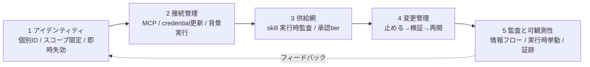
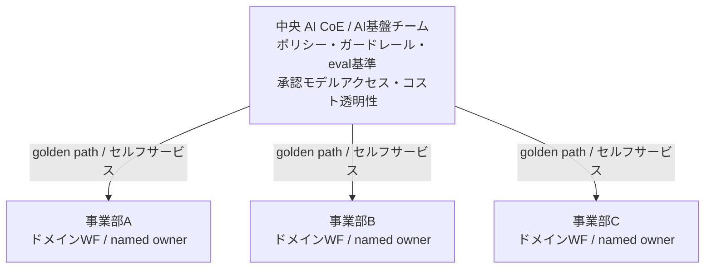

## 概要

AIエージェントを数万人規模で全社展開すると、律速になるのはモデルの賢さではありません。**アカウントの払い出し、機能の許可と制御、ルールの整備、止まらないアップデートへの追従**という、地味な運用が同時多発します。

ソフトバンクは2025年6月から全社員に「1人100本」のAIエージェント作成を号令し、開始から2カ月半で250万本超を作らせました。その裏側でIT部門が回していたのは、**「いったん止める→検証環境で試す→確認できたものからリリース」**というサイクルです。SaaS運用の延長でありながら、回転速度がまるで違います（一次: ＠IT連載本文）。

この記事では、この事例を起点に「AIエージェントの運用部門」がどう再定義されるかを構造化します。結論の骨格は3つに絞れます。

1. **詰まるのはモデルではなく運用です**。より賢い基盤モデルでも、コスト・価値の不透明さ・統制の不備という失敗モードはどれも解けません（一次: Gartner 2025-06-25）。
2. **運用部門は「調達・払い出し・監査」から「止める→検証→再開を高速に回す能動的ガバナンス主体」へ再定義されます**。ただし、ここが重要です。**能動的ガバナンスそれ自体が新しいボトルネックになります**。承認フローはミリ秒のエージェント実行に追いつかず、厳格にするほど現場はシャドー経路へ逃げます。
3. **エージェントは「人でもサービスアカウントでもない第3のアイデンティティクラス」として統制すべきです**。個別ID・スコープ限定・即時失効が設計原則になります。ただし2026年前半時点では、確認できた範囲で、それを買うだけで解決できる製品はまだ乏しい状況です。

「規模を作れた」ことと「運用を成立させられる」ことは別問題です。この記事は前者を成果と誤認せず、後者の設計論として判断材料を提供します。

## 特徴

この論点が「従来のSaaS運用」や「一般的なAIガバナンス論」と決定的に違う点を、5つの差分で示します。

| 観点 | 従来のSaaS/IT運用 | AIエージェント運用（再定義後） |
|---|---|---|
| 中心作業 | 調達・払い出し・定期監査 | 止める→検証→再開の高速ループ |
| 頻度 | 低頻度・静的（年単位の棚卸し） | 常時・変化のたび（更新のたびに再検証） |
| 統制対象 | 端末・アカウント・SaaSライセンス | エージェント（自律アイデンティティ）の振る舞い |
| ガードレール | 手続き・規程（人が守る） | プラットフォーム層のハードストップ（機械が強制） |
| 支出管理 | ライセンス・固定費 | トークン/推論の変動費（per-agent budget） |

この差分を生む固有性は3つあります。

- **非決定性**: プロンプト・モデル・ツール定義・retrieval のいずれかが変わると挙動が揺れます。だから「更新のたびに再検証（regression eval）」が要ります。コード運用との最大の差はここにあります。
- **アイデンティティ・スプロール**: エージェントは1タスク1体で桁違いに増殖します。人間RBACの粒度（職務ロール単位）と棚卸し周期（年単位）が合いません。生成から廃棄が分から時間単位で進み、offboarding 漏れが即リスクになります。
- **新しい変動費**: 支出が「ライセンス」から「トークン/推論」に変わります。台数を常駐前提で増やすと破綻します。

ソフトバンクの当事者（松本浩成氏）は、この現実を「順番に来るのではなく、全て同時に起こる」「生成AI時代の企業ITは『整ったものを入れる』から『未整備なものを運用で成立させる』仕事に変化している」と表現しています（一次: ＠IT連載本文）。ベストプラクティスが未確立のまま走り出す点が、整備済みSaaSの導入と根本的に異なります。

## 概念構造

運用部門が担う統制を、工程で並べると次の5点になります。ソフトバンク事例の課題（＠IT）と、業界のフレームワークが、この構造の上にきれいに重なります。

| 工程 | 統制の主眼 |
|---|---|
| アイデンティティ | 個別ID・スコープ限定・即時失効 |
| 接続管理 | credential 更新と失効伝播の責任境界 |
| 供給網 | skill の実行時監査と承認 tier |
| 変更管理 | 止める→検証→再開のパイプライン |
| 監査と可観測性 | 情報フロー監査と実行時挙動の閉ループ |

### 1. アイデンティティ: 人の権限をそのまま背負わせない

既定の挙動では、エージェントは**デプロイした人と同じIDバッジ**で外部サービスに触ります。接続先は人しか見えず、エージェントを識別できません。1体だけ止めようとすると全体を止めるしかありません（all-or-nothing）。人間RBACの延長ではこれが破綻します。

設計原則は「known / least-privileged / short-lived / revocable」です。人間IAMと同じですが、**適用単位と回転速度が違います**。エージェントを人でもサービスアカウントでもない**第3のアイデンティティクラス**として、個別ID・タスクスコープの短命 credential・named owner・即時失効で管理します。標準文書として OWASP Non-Human Identities Top 10（一次: 2024-12公開、designation は "2025"）があります。

実装の現状は後述の「反証」で留保します。設計原則は正しいものの、製品はまだ追いついていません。

### 2. 接続管理: 「接続方式」ではなく「実行制御の責任境界」で切る

MCP（Model Context Protocol）は接続の共通プロトコルですが、統制の勘所は「どのプロトコルか」ではありません。**credential の更新責任・状態の保管場所・失効の伝播経路を、誰がどこで持つか**です。

remote MCP の認可標準（2025-11確定）は OAuth 2.1 と PKCE を必須とし、access token を短命（5分から60分）、refresh token を長命ローテーションにします（一次: MCP authorization spec）。エージェントの実行は同期リクエストで終わらず、**非同期・長時間・状態保持**を伴います。「background で黙って更新し、しかし失効は即効く」という性質が、背景実行を安全に成立させる前提になります。ここが割れると「失効したはずのトークンで背景ジョブが動き続ける」事故になります。

ソフトバンクの課題【4】「テナント制御」はこの層の話です。同一URLの公式契約アカウントと部署契約アカウントを、**URL単位ではなく認証情報・テナント単位**で判別し、既存のクラウドプロキシで比較的早期に実現しました（一次: ＠IT連載本文）。目標は time-to-revoke を分単位にすることです。

### 3. 供給網: skill は入口スキャンだけでは守れない

third-party skill は「スマホがアプリを入れるように」エージェントに追加され、発行者の権限・credential・shell へ特権アクセスします。ところが検証は publish 時止まりが多いです。

- 静的スキャン回避が容易です。難読化で多くの静的スキャナを80%から96%回避できると報告されます（arXiv 2607.02357 "Cloak and Detonate"）。
- 宣言と実挙動の乖離が支配的です。Palo Alto Unit42 は 49,943 skill 中80%に behavioral mismatch を検出しました。別集計で、分類された逸脱の81.1%は開発者の見落とし、18.9%が敵対的意図とされます（[二次情報] Unit42, 2026-06）。
- **コピー運用が主流です**。skill はレジストリから入れるだけでなく、ローカルにコピーして自環境に合わせ改変して使われます。この実態では「公開元の署名検証」は入口の一部しか守れません。

対策は**入口（署名・整合性検証）と実行時（sandbox detonate・情報フロー taint）と承認 tier** の三点セットです。重大度で承認を段階化し（多段攻撃チェーンは必須レビュー、良性は記録のみ）、検証負荷を上位 tier に寄せます。

### 4. 変更管理: 「止める→検証→再開」を一級市民にする

エージェントの機能更新は挙動が揺れるため、フルロールアウトはリスクです。ソフトバンクが回しているのはまさにこれで、「情報が限られ、検証時間が足りず、対象機能が多く、自動有効化される機能がある」中で、**「いったん止める→検証環境で試す→確認できたものからリリース」**を回し続けています。エージェント機能（ネットアクセス・外部ストレージ・プライベートSaaS連携）は企業環境ではリスクと捉え、一時停止しました（一次: ＠IT連載本文）。

これを業界の変更管理に結線すると、次の対応になります。

| 変更管理の概念 | エージェント更新での実装 |
|---|---|
| change enablement（ITIL 4） | flag ゲートと tier 別承認と自動デプロイ |
| error budget（SRE） | canary の error/KPI 閾値による auto-kill |
| progressive delivery | %ロールアウト（内部→beta→canary→全体） |
| kill switch | 想定外挙動で無関係コードを戻さず即停止 |

重要なのは、ガードレールを**プロンプト（指示）ではなくプラットフォーム層のハードストップ**として強制することです。そして**sandbox は入口検証と隔離であって、本番の段階公開・失効・error budget 連動の停止とは別レイヤ**だと分けることです。安全隔離を厚くするほど実行効率（レイテンシ・コスト）が落ちるため、全実行を毎回フル検証するのは非現実的です。tier 別に負荷を寄せる設計が現実解になります。

### 5. 監査と可観測性: 統制の閉ループ

土台は情報フロー監査・実行時挙動観測・監査証跡です。2026年は OpenTelemetry GenAI semantic conventions（`gen_ai.*`）がデファクトになり、`invoke_agent` を頂点に各LLM呼び出しと各ツール呼び出しを span ツリーで追えます（一次: OpenTelemetry blog）。異常検知を kill switch に直結させ、監査（誰が何に触れたか）と統制（どう動いたか）を閉ループにします。

観測すべき最小セット（エージェント固有）は次の通りです。

| レイヤ | 観測対象 |
|---|---|
| identity | どのエージェントIDが / どのスコープで動いたか |
| 接続 | どのMCP/toolを / どのcredentialで呼んだか、refresh/失効イベント |
| skill | どのskillが実行時に何を materialize し、どこへデータが流れたか |
| 変更 | どのflag/バージョンで / どのrollout段階だったか、kill発火 |
| コスト/挙動 | token消費 / レイテンシ / error / drift |

## 組織モデル: 誰がこの5層を持つのか

運用の型が **SRE / Platform Engineering** に寄ります。中央（AI CoE / AI基盤チーム）が枠を持ち、事業部がワークフローと成果責任を持つ**連邦制（hub-and-spoke）**が業界の既定解とされます。

| 層 | 持ち場 |
|---|---|
| 中央（ハブ） | ポリシー・ガードレール・eval基準・承認モデルアクセス・コスト透明性 |
| 事業部（スポーク） | ドメインワークフロー・採用/活性化・named owner による成果責任 |

- Gartner は「自律度・スコープに関わらず**一律のガバナンスを適用するとAIエージェント施策の失敗を招く**」と明言します（一次: Gartner 2026-05-26）。低自律・狭スコープは軽く、高自律・広スコープは厳格に、という**差別化ガバナンス**が設計原則になります。
- ソフトバンクの利用ルールも、IT部門・セキュリティ部門・CDO部門・法務部門・利用推進部門の**5部門合同**で整備されました（一次: ＠IT連載本文）。さらに各組織に「AI推進担当者」を置き、**IT部門と利用部門の間に立つ翻訳者**として、制限の意図やリスクを業務文脈で伝える構造を作りました。これは中央集権でも完全委譲でもない、連邦制の実装形といえます。

## KPI設計: 「作った数」ではなく「成果」を測る

最重要の原則は **"Measure outcomes, not adoption."** です。デプロイしたエージェント数を測るのではなく、resolution rate / time saved / cost per task を測ります（[二次情報] Gartner/IDC 引用）。ソフトバンクの「250万本」は、この原則に照らすと**作成数（adoption の一種）であって成果ではない**点に注意が要ります（後述「反証」）。

AI基盤チームが計測すべき指標を、DORA / DevEx（一次: ACM Queue）の写像として整理します。

| カテゴリ | KPI | 定義・狙い |
|---|---|---|
| 採用/活性 | active agent rate | 登録のうち実稼働・成果を出す割合。ゾンビ/失効候補の検出 |
| スピード | エージェント作成リードタイム | アイデアから本番までの時間（DORA lead time の応用） |
| 品質/安全 | ガードレール違反検知率 | ハードストップ発動・ポリシー違反の検知率 |
| 変更検証 | 機能更新の検証リードタイム | 更新から eval gate 通過、本番昇格まで。**非決定性ゆえの固有指標** |
| コスト | per-agent cost / cost per task | エージェント/タスク単位のトークン・推論コスト |
| 信頼性 | インシデント率 | エージェント起因の障害・誤動作（SRE change failure rate 応用） |
| 停止/失効 | 失効・停止までの時間 | 異常検知から kill switch、失効完了まで（SRE MTTR 応用） |
| HITL | human-in-the-loop 率 | 人間介入が必要な割合（自律度の成熟指標） |

計測の落とし穴があります。「cost per outcome」を素朴に総額割る件数で算出すると無意味になります。成果の帰属が曖昧だからです。resolution など明確に定義した成果単位に紐づけます。

## 反証: 楽観的な処方箋を留保する

この記事の骨格（モデルではなく運用、一律ガバナンス否定、エージェントは新IDクラスという規範）は反証に耐えます。ただし、そこから導かれる**楽観的な含意4点**には強い反証があります。誠実に留保します。

### 留保1: 「能動的ガバナンスに再定義すれば勝てる」わけではない

「止める→検証→再開」は理屈は正しいものの、**ガバナンスそれ自体が速度を殺します**。多段の合意形成はミリ秒のエージェント実行より遅いです。2026年2月時点で**81%のエージェントが稼働済みなのに、フルのセキュリティ承認を得たのは14.4%のみ**と報告されます（[二次情報] Atlan/QueryPie）。承認体を厳格に運用するほど、現場は「最速経路はそれを避けることだ」と学習し、シャドー経路に逃げます。過剰なガードレールの運用コストは、agentic AIプロジェクトの40%超がキャンセルされる主因の一角でもあります（一次: Gartner 2025-06-25）。

つまり「運用を能動的ガバナンスに再定義すれば解決する」と単純化しません。**どう軽く回すか（差別化・自動強制・enabler化）**が問われます。

### 留保2: 「連邦制にすれば解決」でもない

中央CoEは、それが防ぐはずだったボトルネックそのものになりやすいです。AI施策の失敗率は70%から85%と言われ、CoEが「レビュー/承認ボディ」に堕すと**ガバナンス劇場（Governance Theatre）**化します（[二次情報] Agility-at-Scale）。連邦制もラベルだけでは機能せず、中央を薄くすれば標準がバラつき、厚くすればボトルネックになる板挟みは残ります。

重要なのは構造（連邦制）のラベルではなく、CoEを **gatekeeper ではなく enabler** にする実行様式です。なお「named owner がいる組織は本番移行2.7倍」という数値は二次のみで一次未照合であり、定量根拠としては弱いです。

### 留保3: 「Agent ID 製品を買えば統制できる」段階にない

エージェントは新IDクラスという設計原則への反証はありません（頑健です）。ところが**製品実装が追いついていません**。

- Microsoft Entra Agent ID / Agent 365 や AWS Bedrock AgentCore は「registry sync（preview）のみで**runtime enforcement なし**」の段階があり、Claude / OpenAI Assistants / LangChain / CrewAI は統制プログラム外です。エージェントが実務で使う downstream の OAuth grant / API key / MCP token は依然スコープ外です（[二次情報] Oasis Security）。
- 「2026年4月時点で refresh-token フローを完全実装したMCPクライアントは1つもない」と報告されます（[二次情報] SecureCoders）。「短命 credential と即時失効」の前提が実装側で割れています。
- Gartner は「数千の agentic AI ベンダーのうち実体があるのは約130社のみ」と推定します（agent washing、[二次情報] Gartner 2025-06-25）。
- 統制製品それ自体が新しい攻撃面を作った例もあります。Entra Agent ID の Administrator ロールがテナント内のほぼ任意の Service Principal を変更でき、テナント乗っ取りに繋がる権限昇格が報告されました（Silverfort が2026-02に報告し、Microsoft が2026-04-09に修正したとされます。[二次情報]）。この脆弱性の CVE番号と影響条件は一次（MSRC/NVD）で確認できていないため、番号は記しません。

つまり「即時失効」は目標であって、現状の time-to-revoke は実装依存でギャップが大きいです。製品名で締めません。

### 留保4: 「250万本イコール成功」と断じない

数の事実性（作成本数）を否定する報道はありません。ただし**作成数は活用・定着・ROIの代理になりません**。

- 「tokenmaxxing は死んだ」論（Fortune 2026-05-28）では、AI利用量を生産性の proxy にする発想が否定されました。Amazonでは従業員が「トークン使用統計を維持するためだけに、無意味・不要なタスクを完了するエージェントを乱造した」と報じられます（[二次情報]）。まさに「作っただけ」問題の実例です。
- MIT NANDA（2025）では、生成AI投資に対し**95%の企業が測定可能な成果（P&L影響）を得られていない**、内製ビルドの成功率は専門ベンダー購入の約3分の1と報告されます（[二次情報]）。「1人100個を全社で内製作成」は、成功率が低いとされる「内製かつ全社ロールアウト」の典型に当たります。
- ソフトバンク公式が示す付随成果も「約9割が理解深まった / 約8割が活用イメージできた」というアンケート主観であり（一次: 2025-12-04、回答9,207名）、活用率・定着率・継続率・ROIの客観データは公表されていません。

つまり「開始2.5カ月で250万本」という**普及・文化醸成の規模は事実**です。ただし成果としての評価は、継続率・活用率・ROIの公開待ちです。このケースの価値は「規模を作った後に運用が詰まる」という論点の題材として使うのが堅いです。

## 国内の他社事例（比較）

「1人N本」型の大量作成をKPIに掲げた他社の一次事例は確認できませんでしたが、全社展開の「器」としては次が参考になります。

| 事例 | 規模 | 特徴 | 裏取り |
|---|---|---|---|
| パナソニック コネクト ConnectAI | 約11,600人 | 年44.8万時間削減（2年目）、シャドーAI抑止を導入目的に明文化、特化AI公開7件/検証16件と検証を制度化 | 一次（公式リリース） |
| ソニーグループ Enterprise LLM | 約5.7万人（2025-11） | 30モデル超を内製選択、検証層 Playground / 実用層 Agents / 基礎層の3層 | 二次（登壇ベース） |
| KDDI AI-Chat | 約1万人 | トップダウンとボトムアップの二層、全社員にプロンプト研修 | 一次一部 |
| 三菱UFJ銀行 | 全行3.5万人（2026-01から） | 月22万時間削減試算、文書業務で年20万時間削減目標 | 二次と一次の混在 |

日本語圏の共通見解は、情シスの役割が**「禁止する門番」から「安全な道を舗装する推進者」へ**再定義される、というものです。過度な禁止はシャドーAI化を招きます。役割分担は、情シス（技術統制）・法務（コンプラ・契約）・現場（利用と適合判断）の三者分掌が定着しつつあります（[二次情報] Admina）。制度面では AI事業者ガイドライン（総務省・経産省）第1.2版（2026-03）が AIエージェント・フィジカルAI を追記しました（一次: METI）。

## 未解決の問い

- ソフトバンクの250万本の**活用率・定着率・継続率・運用KPI**は公表されておらず、成果評価は現時点で不能です。
- 「named owner 2.7倍」「MIT 95%無成果」「平均37体のエージェント運用」などのマクロ統計は**二次のみ・一次未照合**です。方向性の参考にとどめ、断定には使いません。
- 「差別化ガバナンス」を**現場でどう軽く回すか**の具体（自動強制・fast-track・early win）は、フレームワークの提言が先行し、実装知が薄いです。
- Entra Agent ID 権限昇格脆弱性の **CVE番号・影響条件**は NVD/MITRE/MSRC で一次確認が必要です。
- ＠IT連載は全3回中の第1回です。クラウドプロキシ詳細・役割分担のさらなる具体は続報を追う価値があります。

## 推奨（AI基盤チームのリード・経営層向け）

1. **KPIを「作成数」から「成果」に張り替えます**。resolution / time saved / cost per task を主軸に、エージェント固有指標（ガードレール違反検知率・検証リードタイム・per-agent cost・失効までの時間・HITL率）を足します。「1人100本」型の作成数目標は、Goodhart の法則で早晩 vanity metric 化します。
2. **運用の中身を「止める→検証→再開」に作り替えます**。ただし承認を重くしすぎません。ガードレールはプラットフォーム層のハードストップで**機械に強制**させ、eval gate と kill switch を error budget に結線して自動化します。人手の多段承認を増やすほど現場は逃げます。
3. **組織は連邦制で立ち上げつつ、中央CoEを enabler にします**。gatekeeper 化・ガバナンス劇場化を失敗パターンとして最初から警戒し、fast-track と early win を用意します。各事業部に named owner を、IT と現場の間に翻訳者を置きます（ソフトバンクの AI推進担当者）。
4. **エージェントを新IDクラスとして扱う設計に投資します。ただし製品で解決したと錯覚しません**。個別ID・スコープ限定・即時失効を目標に据えつつ、現状の runtime 統制欠落・downstream credential 未統制・MCP refresh 未実装・control plane 自体の脆弱性を前提に、time-to-revoke を実測して詰めます。
5. **SaaS管理の統制フレーム（発見→棚卸し→ポリシー→コスト）は流用しつつ、静的棚卸しから振る舞いの継続監視へ拡張します**。shadow AI の可視化ギャップが最大の穴になります。

## まとめ

AIエージェントの全社展開では、詰まるのはモデルではなく運用であり、運用部門は「止める→検証→再開」を高速に回す能動的ガバナンス主体へ再定義されます。ただし、その能動的ガバナンス自体が新しいボトルネックになり得るため、いかに軽く回すか（差別化・自動強制・enabler化）が本当の設計課題です。

この記事が少しでも参考になった、あるいは改善点などがあれば、ぜひリアクションやコメント、SNSでのシェアをいただけると励みになります！

## 参考リンク

- 公式ドキュメント・一次資料
  - [ソフトバンク生成AI導入を支えた企業ITの現場（1）](https://atmarkit.itmedia.co.jp/ait/articles/2607/03/news007.html)
  - [わずか2カ月半で250万超のAIエージェントを作成（ソフトバンクニュース）](https://www.softbank.jp/sbnews/entry/20251204_01)
  - [Gartner: Applying Uniform Governance Across AI Agents Will Lead to Enterprise AI Agent Failure](https://www.gartner.com/en/newsroom/press-releases/2026-05-26-gartner-says-applying-uniform-governance-across-ai-agents-will-lead-to-enterprise-ai-agent-failure)
  - [Gartner: Over 40% of Agentic AI Projects Will Be Canceled by End of 2027](https://www.gartner.com/en/newsroom/press-releases/2025-06-25-gartner-predicts-over-40-percent-of-agentic-ai-projects-will-be-canceled-by-end-of-2027)
  - [OWASP Non-Human Identities Top 10](https://owasp.org/www-project-non-human-identities-top-10/2025/top-10-2025/)
  - [MCP authorization spec (OAuth 2.1)](https://modelcontextprotocol.io/specification/draft/basic/authorization)
  - [OpenTelemetry GenAI observability (2026)](https://opentelemetry.io/blog/2026/genai-observability/)
  - [ACM Queue: DevEx — What Actually Drives Productivity](https://queue.acm.org/detail.cfm?id=3595878)
  - [パナソニック コネクト ConnectAI 2年目実績](https://news.panasonic.com/jp/press/jn250707-2)
  - [総務省 令和7年版 情報通信白書（生成AI利用率）](https://www.soumu.go.jp/johotsusintokei/whitepaper/ja/r07/html/nd112220.html)
  - [AI事業者ガイドライン 第1.2版（METI）](https://www.meti.go.jp/shingikai/mono_info_service/ai_shakai_jisso/pdf/20260331_1.pdf)
- GitHub・arXiv
  - [Cloak and Detonate / SkillDetonate (arXiv 2607.02357)](https://arxiv.org/html/2607.02357)
- 記事・解説
  - [Palo Alto Unit42: AI Agent Supply Chain / BIV](https://unit42.paloaltonetworks.com/ai-agent-supply-chain-risks/)
  - [Oasis Security: Agent 365 & Entra Agent ID vs. Oasis](https://www.oasis.security/blog/agent-365-oasis-for-ai-agent-governance)
  - [SecureCoders: MCP CLI refresh-token gap](https://www.securecoders.com/blog/mcp-cli-refresh-token-gap)
  - [Fortune: Tokenmaxxing is over](https://fortune.com/2026/05/28/tokenmaxxing-is-dead-companies-didnt-get-the-roi-from-ai-they-wanted-to-see/)
  - [Fortune: MIT report — 95% of GenAI pilots failing](https://fortune.com/2025/08/18/mit-report-95-percent-generative-ai-pilots-at-companies-failing-cfo/)
  - [Atlan: AI Agent Risks & Guardrails 2026](https://atlan.com/know/ai-agent-risks-guardrails/)
  - [Agility-at-Scale: AI Center of Excellence](https://agility-at-scale.com/ai/people-change/ai-center-of-excellence/)
  - [Hackread: Microsoft Entra Agent ID Flaw Enabled Tenant Takeover](https://hackread.com/microsoft-entra-agent-id-flaw-tenant-takeover/)
  - [Admina by Money Forward: AIガバナンス](https://admina.moneyforward.com/jp/blog/ai-governance)
