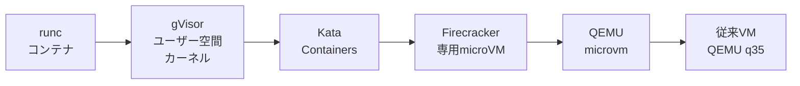
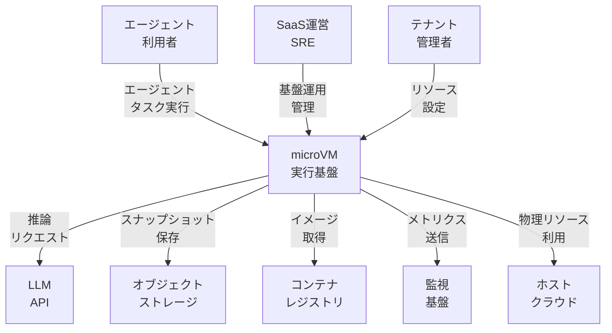
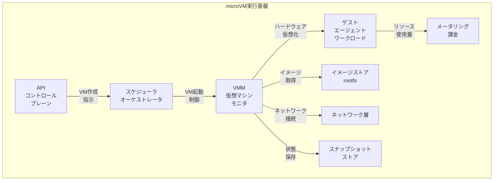
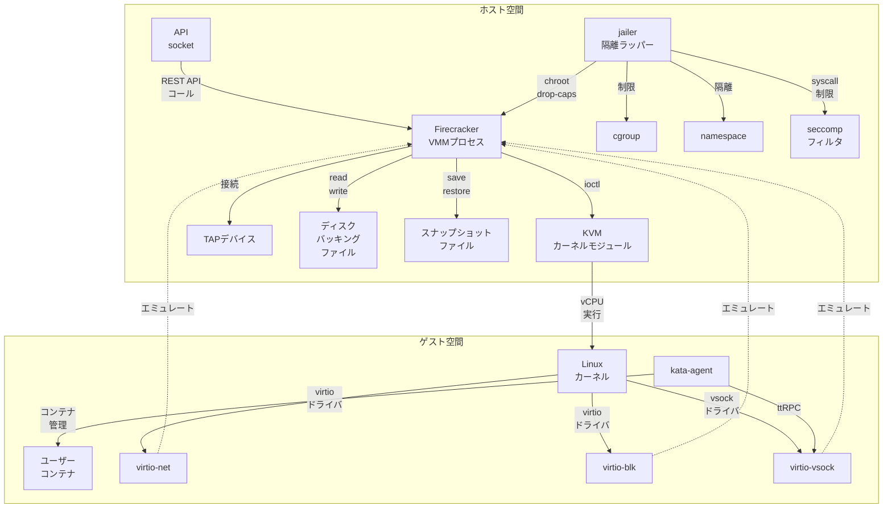
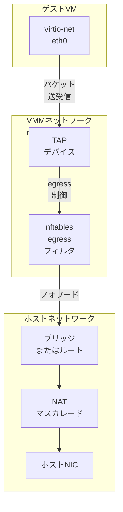
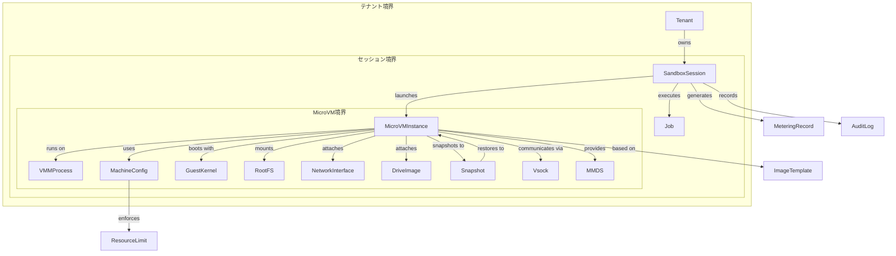
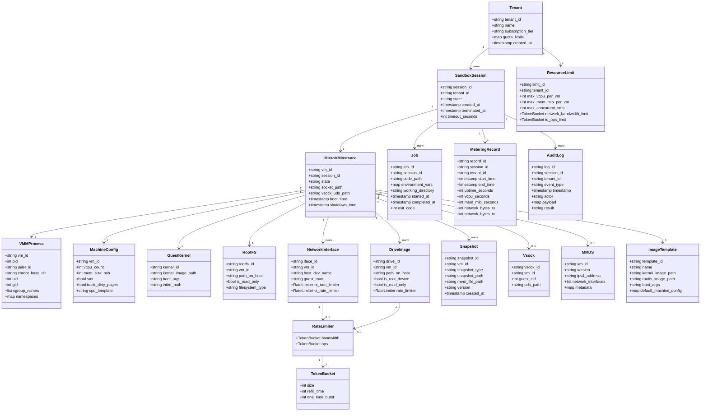

起点: GMO Flatt Security「AI Agent SaaS を支える自社仮想化基盤への挑戦と実運用」(SRE NEXT 2026)。同社は任意コード実行を伴う AI セキュリティ診断エージェント SaaS の実行基盤を、汎用 Kubernetes 上のコンテナ隔離から専用 microVM 基盤へ移行しました。本調査はこの事例を起点に、AI エージェント sandbox を microVM で運用する隔離実行基盤を、Firecracker / Kata Containers / Cloud Hypervisor / gVisor を中心とした再利用可能な技術調査として構造化します。

> 調査日: 2026-07-12 / 対象読者: 任意コード実行を伴う AI エージェント基盤を設計・運用する開発者・SRE・アーキテクト

本記事は次の 3 つの問いを軸にします。汎用 Kubernetes 上のコンテナ隔離で、AI エージェント SaaS の何が問題化したのか。専用 microVM 基盤へ移すと、隔離とコスト構造がどう変わるのか。そして、どの規模になれば自社基盤が損益分岐を超えるのか。前半で技術構造（C4・データモデル・API・構築運用）を押さえ、後半のコスト設計と意思決定フレームで判断軸に落とし込みます。

## 概要

AI エージェント向け microVM ベース隔離実行基盤は、任意コード実行を伴う AI エージェント SaaS において、マルチテナント環境での強固な隔離境界を提供する技術です。従来のコンテナ技術（Linux namespace + cgroups）では不十分な隔離強度を、軽量な仮想マシン（microVM）で補強します。

AI エージェントは、次の特性により従来の Web アプリケーションとは異なる実行基盤要件を持ちます。

- **任意コード実行**: LLM が生成したコード（Python / Shell / JavaScript 等）を実行環境で直接実行します。
- **短命なワークロード**: 1 回のタスク実行は数秒〜数分で完了し、頻繁に起動・破棄されます。
- **強い隔離要求**: マルチテナント環境で、他テナントのデータやホストシステムへの影響を完全に遮断する必要があります。
- **高密度配置**: 1 台のホストで数百〜数千の AI エージェント実行環境を並列稼働させます。

### なぜコンテナ隔離では不十分なのか

コンテナ技術（Docker / containerd / runc）は、Linux カーネルの namespace と cgroups でプロセスとリソースを隔離します。しかしコンテナはホストカーネルを共有するため、次のリスクが残ります。

| リスク分類 | 説明 |
|---|---|
| カーネルエクスプロイトによる脱出 | コンテナ内で Linux カーネルの脆弱性を突かれると、ホストや同居する他コンテナへ侵入される |
| namespace 境界の脆弱性 | namespace 実装のバグや設定ミスにより、コンテナ間でプロセスやファイルシステムが露出する |
| 攻撃面の広さ | ホストカーネルが提供する全システムコールがコンテナから到達可能（seccomp で制限は可能だが、AI エージェントは多様なシステムコールを要求する） |

AI エージェントはユーザー入力由来の任意コードを実行するため、攻撃者が悪意あるコードを LLM に生成させる攻撃（Prompt Injection 等）が成立します。ゼロトラスト前提のマルチテナント AI SaaS では、コンテナ隔離だけで安全性を保証できません。

### microVM による隔離強化

microVM は、次の方式でコンテナ隔離の弱点を補います。

| 要素 | 説明 |
|---|---|
| ハードウェア仮想化境界 | KVM により、ゲスト OS カーネルとホスト OS カーネルを分離する |
| 独立したゲストカーネル | 各 microVM が専用の Linux カーネルを実行し、ホストカーネルへのシステムコール到達を遮断する |
| 最小デバイスモデル | 仮想デバイスを virtio ネットワーク・ブロックデバイス等に絞り、攻撃面を縮小する（従来 VM が持つ USB / サウンド / PCI レガシーデバイスのエミュレーションを削除） |

カーネルエクスプロイトが成功しても、侵害範囲は当該 microVM のゲストカーネルに閉じます。ホストへ脱出するには、さらにハイパーバイザーの脆弱性を突く必要があります。ハイパーバイザーの攻撃面は Linux カーネル全体よりも小さく、厳格に監査されています。

### 関連技術との関係

AI エージェント向け隔離実行基盤では、「隔離強度」と「起動速度」のトレードオフにより、次の技術スペクトラムが存在します。



| 要素名 | 説明 |
|---|---|
| runc コンテナ | Linux namespace + cgroups による最速起動だが、隔離境界はプロセスレベル |
| gVisor | ユーザー空間カーネル（Go 実装の Sentry）がシステムコールを横取りし、ホストカーネルへの到達を制限。ハードウェア仮想化は不要 |
| Kata Containers | OCI 互換の secure container ランタイム。各 Pod（sandbox）を QEMU / Firecracker / Cloud Hypervisor いずれかの VM で包み（Pod 内コンテナは VM を共有）、VM 境界を提供 |
| Firecracker | AWS Lambda / Fargate で使用される専用 VMM。最小デバイスモデルと Rust 実装により、起動 125ms 未満・メモリオーバーヘッド約 5MiB を実現 |
| QEMU microvm | QEMU の最小マシンタイプ。virtio デバイスのみでレガシーエミュレーションを省略し、Firecracker よりやや汎用 |
| 従来 VM | 完全な PC ハードウェアエミュレーション（PCI / USB / VGA 等）。起動は数秒〜数十秒、メモリオーバーヘッドは数百 MB |

### 主要技術の比較

| 項目 | Firecracker | Cloud Hypervisor | Kata Containers | gVisor | runc |
|---|---|---|---|---|---|
| 実行方式 | KVM ベース microVM | KVM / MSHV ベース microVM | OCI ランタイム（複数 VMM 対応） | ユーザー空間カーネル | Linux namespace |
| 隔離境界 | ハードウェア仮想化（VM） | ハードウェア仮想化（VM） | ハードウェア仮想化（VM） | システムコール横取り | プロセス namespace |
| ゲストカーネル | 専用カーネル（VM ごと） | 専用カーネル（VM ごと） | 専用カーネル（VM ごと） | ユーザー空間カーネル（Sentry） | ホストカーネル共有 |
| 起動速度 | 125ms 未満 | 100〜150ms | 200〜500ms（VMM 依存） | 〜50ms | 〜10ms |
| メモリオーバーヘッド | 約 5MiB（総オーバーヘッド。VMM 非共有メモリは約 3MB） | 十数 MiB 規模 | 数十 MiB（VMM + agent） | 10〜20MiB（Sentry） | 〜1MiB |
| デバイスモデル | 最小 virtio（net / block / vsock 等） | 最小 virtio + ホットプラグ | VMM により異なる | デバイスエミュレーションなし | ホストデバイス共有 |
| カーネル脆弱性への耐性 | 高（ゲスト内に閉じる） | 高（ゲスト内に閉じる） | 高（ゲスト内に閉じる） | 中（Sentry が横取り） | 低（共有カーネル） |
| OCI / Docker 互換 | なし（専用 API） | なし（専用 API） | あり（containerd / CRI-O） | あり（runsc） | あり（標準ランタイム） |
| snapshot / restore | あり（高速再開） | あり | ランタイムは未提供（VMM 依存） | 対応あり（制約あり） | なし |
| 想定ユースケース | Serverless FaaS / AI sandbox | Cloud native VM / FaaS | K8s ベース secure container | マルチテナント SaaS | 汎用コンテナ |
| 主な採用事例 | AWS Lambda / Fargate / E2B / Fly.io | Kata Containers 対応 VMM | Kubernetes / OpenStack | GKE Sandbox / App Engine | Docker / K8s（標準） |

> 起動時間・メモリオーバーヘッドの数値は、測定バージョン・ホスト・ゲスト構成・ネットワーク有無で変わる代表値です（Firecracker の 125ms 未満・約 5MiB は NSDI 2020 論文の最小構成での値）。絶対比較ではなくオーダー感として扱ってください。

### ユースケース別の推奨技術

| ユースケース | 推奨技術 | 理由 |
|---|---|---|
| AI コード実行 sandbox | Firecracker / Cloud Hypervisor | 強隔離 + 高速起動 + snapshot 再開で冷間起動を回避。E2B / Fly.io は Firecracker を実採用（Cloud Hypervisor は別の評価対象） |
| Serverless FaaS | Firecracker | AWS Lambda / Fargate で実証済み。数百 ms 起動 + 数千 VM 同時稼働の密度 |
| Kubernetes ベースのマルチテナント SaaS | Kata Containers | K8s の Pod として microVM を透過的に起動。既存 YAML / Helm を流用 |
| CI ビルド環境 | Kata Containers / gVisor | ビルドスクリプトの任意コード実行を隔離 |
| エッジコンピューティング | Firecracker | Fly Machines（Firecracker ベース）を各地の Edge で起動（VM 起動は約 300ms） |
| 従来型 Web アプリ（信頼されたコード） | runc | VM オーバーヘッド不要。ただし任意コード実行があれば不適 |

### 主要な採用事例

| 事例 | 採用技術 | 概要 |
|---|---|---|
| AWS Lambda / Fargate | Firecracker | 各顧客の関数実行環境を microVM 単位で隔離。1 ホストで数千の関数を並列実行 |
| E2B | Firecracker | AI エージェント向けコード実行 sandbox API。使い捨て環境を API 経由で起動 |
| Fly.io | Firecracker | グローバル Edge で microVM を起動し、低レイテンシを実現（Fly Machines の VM 起動は約 300ms） |
| Modal | 既定 Sandbox は gVisor ベース（Beta で VM ベース Sandbox も提供） | Serverless Python 実行基盤。ML パイプライン・データ処理をオンデマンド実行 |
| GMO Flatt Security（本調査の起点） | 自社仮想化基盤 | AI セキュリティ診断エージェント SaaS。汎用 Kubernetes から専用 microVM 基盤へ移行し、任意コード実行への強隔離を実現 |

## 特徴

- **強隔離**: ハードウェア仮想化（KVM）により、ゲストカーネルとホストカーネルを分離します。カーネルエクスプロイトが成功してもホストへの影響を遮断します。
- **高速起動**: Firecracker / Cloud Hypervisor は 100〜150ms 程度で microVM を起動します。従来 VM の数秒〜数十秒と比較して 1〜2 桁高速です。
- **低メモリオーバーヘッド**: VMM プロセスは約 5〜10MiB です。1 台のホストで数百〜数千の microVM を密に配置できます。
- **snapshot / restore**: 起動済み microVM の状態を保存し、高速に再開します。AI エージェントの頻繁な起動・破棄に適合します。
- **最小デバイスモデル**: virtio ネットワーク・ブロックデバイス等のみをエミュレートし、レガシーデバイスを削除して攻撃面を縮小します。
- **CPU / メモリ overcommit**: demand paging により未タッチのメモリページを遅延割当します。使用済みページの回収は virtio-balloon 等の明示設定に依存します。
- **Rust 実装（Firecracker / Cloud Hypervisor）**: メモリ安全言語により、VMM 自体の脆弱性を削減します。
- **jailer による多層隔離（Firecracker）**: VMM プロセス自体も namespace / cgroup / chroot / 権限降格で隔離します（seccomp フィルタは Firecracker 本体が各スレッドへ適用）。VMM 脆弱性の影響を限定します。
- **OCI 互換（Kata Containers）**: 既存の Docker / Kubernetes ワークフローを変更せず、Pod（sandbox）単位で microVM 隔離を適用できます（Pod 内コンテナは VM を共有）。

## 構造

AI エージェント向け microVM 隔離実行基盤の内部アーキテクチャを C4 モデルで 3 段階に図解します。

### システムコンテキスト図

microVM 実行基盤と、その周辺の外部アクター・外部システムを示します。



#### アクター・外部システム

| 要素名 | 説明 |
|---|---|
| エージェント利用者 | AI エージェントのタスク実行をリクエストする外部ユーザー |
| SaaS 運営 SRE | 基盤の運用管理を担当する内部オペレータ |
| テナント管理者 | テナント固有のリソース設定やポリシーを管理する |
| microVM 実行基盤 | 任意コード実行を伴う AI エージェントを隔離実行する仮想化プラットフォーム本体 |
| LLM API | 大規模言語モデルの推論エンドポイント |
| オブジェクトストレージ | microVM スナップショットやワークロード成果物を永続化する外部ストレージ |
| コンテナレジストリ | ワークロード用のイメージや rootfs を配布する外部レジストリ |
| 監視基盤 | メトリクス収集・可視化システム |
| ホストクラウド | 物理サーバーやクラウドインスタンスを提供する下位レイヤ |

### コンテナ図

microVM 実行基盤内の主要構成要素を示します。



#### コンテナ要素

| 要素名 | 説明 |
|---|---|
| API コントロールプレーン | 外部からの VM 作成・削除・設定リクエストを受け付けるインターフェース |
| スケジューラオーケストレータ | リソース空き状況に基づき、VM を起動するホストとタイミングを決定する |
| VMM 仮想マシンモニタ | KVM ベースの軽量 VM を起動・実行するコアプロセス |
| ゲスト・エージェントワークロード | VM 内で実行される OS カーネル、agent プロセス、ユーザーコード環境 |
| イメージストア・rootfs | VM のカーネルイメージとルートファイルシステムを管理するローカルキャッシュ |
| ネットワーク層 | TAP / ブリッジ / ルーティングを介した VM-ホスト間・VM 間通信を制御するネットワークスタック |
| スナップショットストア | VM 起動高速化やクローン作成のため、メモリ・CPU 状態を保存するストレージ |
| メータリング・課金 | VM 単位の CPU・メモリ・ネットワーク・ディスク I/O を計測し、課金データを生成する |

### コンポーネント図

VMM とその周辺コンポーネントの内部構造を、具体的な技術要素で示します。ここでは Firecracker を VMM、Kata Containers をコンテナ管理層とする代表構成を示します。



#### ホスト空間

| 要素名 | 説明 |
|---|---|
| API socket | Firecracker のライフサイクル制御用 UNIX ドメインソケット。VM 起動・設定・停止を操作する |
| jailer | Firecracker プロセスを chroot・mount/PID/network namespace・cgroup で隔離し、非特権ユーザーとして実行するラッパー（seccomp は Firecracker 本体が適用） |
| Firecracker VMM プロセス | Rust 実装の VMM 本体。最小デバイスモデル（virtio-net / blk / vsock, serial, i8042）をエミュレートする |
| KVM カーネルモジュール | Linux カーネル内蔵のハードウェア仮想化ドライバ。Intel VT-x / AMD-V を利用する |
| TAP デバイス | L2 仮想ネットワークインターフェース。ゲストの virtio-net に接続する |
| ディスクバッキングファイル | ゲストのブロックデバイスとして公開されるホスト上のファイル |
| スナップショットファイル | VM 状態（メモリ・デバイス）を直列化した永続ファイル。restore 時に高速起動する |
| cgroup | CPU・メモリ・I/O リソースを制限するカーネル機能 |
| namespace | PID・ネットワーク・マウント・UTS 等を隔離するカーネル機能 |
| seccomp フィルタ | 許可されたシステムコールのみ実行可能にする BPF フィルタ |

#### ゲスト空間

| 要素名 | 説明 |
|---|---|
| Linux カーネル | ゲスト VM 内で起動するミニマルカーネル。virtio ドライバを含む |
| kata-agent | VM 内に常駐するデーモン。ttRPC でホストからコンテナ管理命令を受ける |
| ユーザーコンテナ | kata-agent が管理する OCI 互換コンテナ環境。エージェントワークロードが実行される |
| virtio-net | 仮想ネットワークカード。ゲスト側 virtio ドライバとホスト側 VMM エミュレーションで構成 |
| virtio-blk | 仮想ブロックデバイス。ゲストの virtio-blk ドライバがホスト側ファイルと通信 |
| virtio-vsock | VM-ホスト間ソケット通信。ttRPC で kata-agent とホスト間のコマンドを伝送 |

#### microVM ネットワーク構成図

Firecracker 標準構成では、ゲストの virtio-net をホスト側 TAP デバイスへ接続し、TAP を VMM 用ネットワーク namespace 内に閉じ込めます。ブリッジまたはルーティングと NAT を介して外部へ接続します。



#### ネットワーク要素

| 要素名 | 説明 |
|---|---|
| virtio-net eth0 | ゲスト側の仮想 NIC。ホストの TAP デバイスと 1 対 1 で接続する |
| TAP デバイス | microVM 単位に作成される L2 仮想 NIC。VMM 用ネットワーク namespace 内に置く |
| nftables egress フィルタ | ゲストの外向き通信を制御し、テナント間横移動や SSRF を抑止する |
| ブリッジまたはルート | 複数 TAP を集約してホスト NIC へルーティングする仮想スイッチまたはルーティングテーブル |
| NAT マスカレード | ゲスト IP をプライベート帯に割り当て、外部にはホスト IP で通信する |
| ホスト NIC | 物理 NIC またはホストのメインネットワークインターフェース |

> Kata Containers を Kubernetes 上で使う場合は、CNI が作成した veth と VM の TAP を tc-redirect（Traffic Control フィルタ）で接続するモデルを採ります。Firecracker 単体運用の TAP 直結モデルとは接続経路が異なります。

#### テナント分離手法

- **ネットワーク namespace 分離**: 各 VMM プロセスを専用 namespace で起動し、TAP デバイスも namespace 内へ閉じ込めます。
- **セグメント分離**: テナント単位で VLAN タグやサブネットを分け、論理分離します。
- **NAT マスカレード**: ゲスト IP をプライベート帯（例: 172.16.0.0/12）に割り当て、外部へ露出させません。
- **nftables / iptables フィルタ**: テナント間トラフィックを遮断するファイアウォールルールをホスト側で強制します。

## データ

実行基盤が扱う主要エンティティを、概念モデルと情報モデルで構造化します。属性は Firecracker REST API 仕様と Kata Containers アーキテクチャに基づいて設計しました。

### 概念モデル



#### エンティティ説明

| エンティティ名 | 説明 |
|---|---|
| Tenant | AI Agent SaaS を利用する顧客単位。マルチテナント環境での隔離境界の最上位 |
| SandboxSession | AI エージェントの 1 実行単位。リクエストから microVM 終了までのライフサイクル |
| MicroVMInstance | microVM の論理インスタンス。セッション専用の隔離実行環境 |
| VMMProcess | jailer 配下で動作する VMM プロセス。chroot / cgroup / namespace で隔離 |
| MachineConfig | VM 仕様。vCPU 数・メモリサイズ・SMT・CPU テンプレートを定義 |
| GuestKernel | microVM 起動に使用する Linux カーネルイメージ（vmlinux） |
| RootFS | ゲスト OS 用ルートファイルシステム。ext4 等のブロックデバイスイメージ |
| DriveImage | 永続 / 一時用ブロックデバイス。rootfs と追加ストレージを統合表現 |
| NetworkInterface | TAP デバイス経由のネットワーク接続。MAC / rate limiter を含む |
| Snapshot | VM 状態の永続化。メモリダンプ + デバイス状態の組。Full / Diff を持つ |
| Vsock | ホスト-ゲスト間仮想ソケット通信。guest CID と UDS パスで識別 |
| MMDS | microVM Metadata Service。EC2 IMDS 相当のゲスト向けメタデータ配信 |
| Job | セッション内の実行タスク。コード・入力・成果物を管理 |
| ImageTemplate | 起動用雛形。kernel / rootfs / 初期設定の組 |
| ResourceLimit | リソース制約。vCPU / mem / network 帯域 / I/O ops の rate limiter |
| MeteringRecord | 利用実績。起動時刻・稼働時間・消費リソース・課金用集計 |
| AuditLog | 監査ログ。セッション作成・API 呼出・終了イベントを記録 |

### 情報モデル



#### 主要エンティティの属性

| エンティティ名 | 主な属性 | 説明 |
|---|---|---|
| MachineConfig | vcpu_count / mem_size_mib / smt / track_dirty_pages / cpu_template | Firecracker `PUT /machine-config` に対応。`smt` は Simultaneous Multithreading の有効化フラグ（x86_64 限定）。`cpu_template` は deprecated（新規は `PUT /cpu-config`） |
| DriveImage | drive_id / path_on_host / is_root_device / is_read_only / rate_limiter | Firecracker `PUT /drives/{id}` に対応 |
| NetworkInterface | iface_id / host_dev_name / guest_mac / rx_rate_limiter / tx_rate_limiter | Firecracker `PUT /network-interfaces/{id}` に対応 |
| RateLimiter | bandwidth / ops（各 TokenBucket） | トークンバケットアルゴリズムで帯域と ops を制限 |
| TokenBucket | size / refill_time / one_time_burst | バケット容量・補充間隔（`refill_time` は ms 単位）・初回バースト |
| Snapshot | snapshot_type(Full/Diff) / snapshot_path / mem_file_path / version | Firecracker snapshotting API に対応。Diff は差分のみ保存。`track_dirty_pages` で効率的に差分追跡（v1.13 以降は無効でも条件付きで Diff 作成可） |
| Vsock | guest_cid / uds_path | guest CID は通常 3、ホストは 2。UDS 経由でポート多重化 |
| MMDS | version(V1/V2) / ipv4_address / network_interfaces / metadata | メタデータ配信。V2 はセッショントークンを要求 |
| VMMProcess | chroot_base_dir / uid / gid / cgroup_names / namespaces | jailer による隔離状態 |
| MeteringRecord | uptime_seconds / vcpu_seconds / mem_mib_seconds / network_bytes | 課金・利用計測 |

## 構築方法

### 前提条件

Firecracker を動作させるには次の要件を満たします。

- **CPU アーキテクチャ**: x86_64 または aarch64
- **KVM モジュール**: 現行 Firecracker はホストカーネル 5.10 以上を要件とします（4.14 以降は旧版の要件）
- **KVM デバイスアクセス**: `/dev/kvm` への読み書き権限
- **ホスト環境**: ベアメタル、または nested virtualization 対応のクラウドインスタンス（AWS の `.metal` インスタンス等）

KVM モジュールのロードを確認します。

```bash
lsmod | grep kvm
```

`/dev/kvm` へのアクセス権限を設定します。多くのディストリビューションでは `kvm` グループで管理します。

```bash
# ACL を使う場合
sudo setfacl -m u:${USER}:rw /dev/kvm

# kvm グループを使う場合
[ $(stat -c "%G" /dev/kvm) = kvm ] && sudo usermod -aG kvm ${USER} && echo "Access granted."

# 権限確認
[ -r /dev/kvm ] && [ -w /dev/kvm ] && echo "OK" || echo "FAIL"
```

### Firecracker バイナリの入手

公式リリースからダウンロードします。

```bash
ARCH="$(uname -m)"
release_url="https://github.com/firecracker-microvm/firecracker/releases"
latest=$(basename $(curl -fsSLI -o /dev/null -w %{url_effective} ${release_url}/latest))
curl -L ${release_url}/download/${latest}/firecracker-${latest}-${ARCH}.tgz | tar -xz
mv release-${latest}-$(uname -m)/firecracker-${latest}-${ARCH} firecracker
chmod +x firecracker
```

jailer も同じリリースから入手できます。

```bash
ARCH="$(uname -m)"
VERSION="v1.16.1"
curl -L ${release_url}/download/${VERSION}/firecracker-${VERSION}-${ARCH}.tgz | tar -xz
sudo mv release-${VERSION}-${ARCH}/jailer-${VERSION}-${ARCH} /usr/local/bin/jailer
sudo chmod +x /usr/local/bin/jailer
```

ソースからビルドする場合は Docker を使います。

```bash
git clone https://github.com/firecracker-microvm/firecracker firecracker_src
sudo ./firecracker_src/tools/devtool build
```

### ゲストカーネルと rootfs の準備

ゲストカーネル（vmlinux）と rootfs（ext4 イメージ）を用意します。CI アーティファクトから取得できます。

```bash
ARCH="$(uname -m)"
S3="https://s3.amazonaws.com/spec.ccfc.min"
# 最新 CI ビルドのカーネル (vmlinux) を取得
CI_PREFIX=$(curl -fsSL "$S3?list-type=2&prefix=firecracker-ci/&delimiter=/" | grep -oP "(?<=<Prefix>)firecracker-ci/[0-9]{8}-[^/]+/(?=</Prefix>)" | sort | tail -1)
kernel_key=$(curl -fsSL "$S3?list-type=2&prefix=${CI_PREFIX}${ARCH}/vmlinux-" | grep -oP "(?<=<Key>)(${CI_PREFIX}${ARCH}/vmlinux-[0-9]+\.[0-9]+\.[0-9]{1,3})(?=</Key>)" | sort -V | tail -1)
wget "$S3/${kernel_key}"
```

rootfs は squashfs を展開して ext4 イメージへ変換します。

```bash
# squashfs を展開し ext4 化
unsquashfs ubuntu.squashfs
sudo chown -R root:root squashfs-root
truncate -s 1G ubuntu.ext4
sudo mkfs.ext4 -d squashfs-root -F ubuntu.ext4
```

### jailer のセットアップ

jailer は chroot・cgroup・network namespace で Firecracker プロセスを隔離します。既定の chroot ベースは `/srv/jailer` です。

```bash
sudo mkdir -p /srv/jailer
# cgroup のマウント確認
mount | grep -E "cgroup|cgroup2"
# 専用ネットワーク namespace を作成
sudo ip netns add fc_netns
```

## 利用方法

### Firecracker REST API の主要エンドポイント

Firecracker は UNIX ドメインソケット経由の REST API で制御します。

| エンドポイント | メソッド | 主要パラメータ | 説明 |
|---|---|---|---|
| `/boot-source` | PUT | `kernel_image_path`, `boot_args` | カーネルイメージと起動引数を設定 |
| `/drives/{drive_id}` | PUT | `drive_id`, `path_on_host`, `is_root_device`, `is_read_only` | ブロックデバイスを追加 |
| `/machine-config` | PUT | `vcpu_count`, `mem_size_mib`, `smt`, `track_dirty_pages` | vCPU 数とメモリを設定 |
| `/network-interfaces/{iface_id}` | PUT | `iface_id`, `guest_mac`, `host_dev_name` | ネットワークインターフェースを追加 |
| `/vsock` | PUT | `guest_cid`, `uds_path` | vsock デバイスを設定 |
| `/mmds/config` | PUT | `network_interfaces`, `version`, `ipv4_address` | MMDS を設定 |
| `/mmds` | PUT/PATCH/GET | JSON データ | MMDS データストアを操作 |
| `/actions` | PUT | `action_type: "InstanceStart"` | microVM を起動 |
| `/vm` | PATCH | `state: "Paused"` / `"Resumed"` | 一時停止 / 再開 |
| `/snapshot/create` | PUT | `snapshot_type`, `snapshot_path`, `mem_file_path` | スナップショットを作成 |
| `/snapshot/load` | PUT | `snapshot_path`, `mem_backend`, `resume_vm` | スナップショットから復元 |

### 基本的な起動フロー

Firecracker を API ソケット待機で起動します。

```bash
API_SOCKET="/tmp/firecracker.socket"
sudo rm -f $API_SOCKET
sudo ./firecracker --api-sock "${API_SOCKET}"
```

> `--enable-pci` フラグを付けると、VirtIO デバイスが MMIO ではなく PCI トランスポートで作成されます（スループット向上・レイテンシ低減）。ただし後述の CVE-2026-5747 の影響を受けるため、パッチ済みバージョンの利用が前提です。

ブートソース（カーネル）を設定します。

```bash
KERNEL="./vmlinux-5.10"
KERNEL_BOOT_ARGS="console=ttyS0 reboot=k panic=1 pci=off"
sudo curl -X PUT --unix-socket "${API_SOCKET}" \
    --data "{\"kernel_image_path\": \"${KERNEL}\", \"boot_args\": \"${KERNEL_BOOT_ARGS}\"}" \
    "http://localhost/boot-source"
```

rootfs（ドライブ）を設定します。

```bash
ROOTFS="./ubuntu.ext4"
sudo curl -X PUT --unix-socket "${API_SOCKET}" \
    --data "{\"drive_id\": \"rootfs\", \"path_on_host\": \"${ROOTFS}\", \"is_root_device\": true, \"is_read_only\": false}" \
    "http://localhost/drives/rootfs"
```

マシン設定（vCPU・メモリ）を設定します。

```bash
sudo curl -X PUT --unix-socket "${API_SOCKET}" \
    --data '{"vcpu_count": 2, "mem_size_mib": 1024, "smt": false}' \
    "http://localhost/machine-config"
```

ホスト側で TAP デバイスを作成し、ネットワークを設定します。

```bash
TAP_DEV="tap0"
sudo ip tuntap add dev "$TAP_DEV" mode tap
sudo ip addr add 172.16.0.1/30 dev "$TAP_DEV"
sudo ip link set dev "$TAP_DEV" up
sudo sh -c "echo 1 > /proc/sys/net/ipv4/ip_forward"
HOST_IFACE=$(ip -j route list default | jq -r '.[0].dev')
sudo iptables -t nat -A POSTROUTING -o "$HOST_IFACE" -j MASQUERADE

sudo curl -X PUT --unix-socket "${API_SOCKET}" \
    --data '{"iface_id": "net1", "guest_mac": "06:00:AC:10:00:02", "host_dev_name": "tap0"}' \
    "http://localhost/network-interfaces/net1"
```

microVM を起動します。

```bash
sudo curl -X PUT --unix-socket "${API_SOCKET}" \
    --data '{"action_type": "InstanceStart"}' \
    "http://localhost/actions"
```

### 設定ファイル（JSON）による一括起動

API 呼び出しの代わりに、設定ファイルで起動できます。

```bash
sudo ./firecracker --api-sock /tmp/firecracker.socket --config-file config.json
```

```json
{
  "boot-source": {
    "kernel_image_path": "./vmlinux-5.10",
    "boot_args": "console=ttyS0 reboot=k panic=1 pci=off"
  },
  "drives": [
    {
      "drive_id": "rootfs",
      "path_on_host": "./ubuntu.ext4",
      "is_root_device": true,
      "is_read_only": false
    }
  ],
  "machine-config": { "vcpu_count": 2, "mem_size_mib": 1024, "smt": false },
  "network-interfaces": [
    { "iface_id": "net1", "guest_mac": "06:00:AC:10:00:02", "host_dev_name": "tap0" }
  ]
}
```

### vsock によるゲスト連携

vsock を使うと、ホストとゲスト間で Unix ソケットライクな通信ができます。AI エージェント sandbox では、コード投入と成果物回収の経路に使います。

```bash
sudo curl -X PUT --unix-socket /tmp/firecracker.socket \
    --data '{"guest_cid": 3, "uds_path": "./v.sock"}' \
    "http://localhost/vsock"
```

ホストからゲストのポート 52 へ接続する例です。

```bash
# ホスト側
socat - UNIX-CONNECT:./v.sock
CONNECT 52
# ゲスト側で待受
socat VSOCK-LISTEN:52,fork -
```

### MMDS（メタデータサービス）の利用

MMDS はホストからゲストへメタデータを配信します。V2 はセッショントークンを要求します。

```bash
sudo curl -X PUT --unix-socket /tmp/firecracker.socket \
    --data '{"network_interfaces": ["net1"], "version": "V2", "ipv4_address": "169.254.169.254"}' \
    "http://localhost/mmds/config"

sudo curl -X PUT --unix-socket /tmp/firecracker.socket \
    --data '{"latest": {"meta-data": {"instance-id": "i-agent-001"}}}' \
    "http://localhost/mmds"
```

ゲスト側からトークンを取得して読み出します。

```bash
# ゲスト内
TOKEN=$(curl -X PUT "http://169.254.169.254/latest/api/token" -H "X-metadata-token-ttl-seconds: 21600")
curl -s "http://169.254.169.254/latest/meta-data" -H "X-metadata-token: ${TOKEN}"
```

### スナップショットの作成と復元

スナップショットは microVM の状態を保存し、高速な復元を可能にします。AI エージェント基盤の冷間起動回避の要です。

```bash
# 一時停止 → Full スナップショット作成 → 再開
sudo curl -X PATCH --unix-socket /tmp/firecracker.socket \
    --data '{"state": "Paused"}' "http://localhost/vm"
sudo curl -X PUT --unix-socket /tmp/firecracker.socket \
    --data '{"snapshot_type": "Full", "snapshot_path": "./snapshot_file", "mem_file_path": "./mem_file"}' \
    "http://localhost/snapshot/create"
sudo curl -X PATCH --unix-socket /tmp/firecracker.socket \
    --data '{"state": "Resumed"}' "http://localhost/vm"
```

新しい Firecracker プロセスでスナップショットから復元します。

```bash
sudo curl -X PUT --unix-socket /tmp/firecracker.socket \
    --data '{"snapshot_path": "./snapshot_file", "mem_backend": {"backend_path": "./mem_file", "backend_type": "File"}, "resume_vm": true}' \
    "http://localhost/snapshot/load"
```

- `mem_backend.backend_type`: `File`（カーネルがページフォルトを処理）または `Uffd`（ユーザー空間プロセスが処理）
- `resume_vm`: 復元後に自動再開する場合 `true`

### jailer 経由での起動

本番のマルチテナント環境では jailer を必須とします。

```bash
sudo jailer --id 551e7604-e35c-42b3-b825-416853441234 \
    --exec-file /usr/local/bin/firecracker \
    --uid 1234 --gid 1234 \
    --chroot-base-dir /srv/jailer \
    --cgroup-version 2 \
    --netns /var/run/netns/fc_netns \
    --daemonize
```

- `--id`: microVM の一意な識別子
- `--uid` / `--gid`: Firecracker を実行する非特権ユーザー
- `--chroot-base-dir`: chroot jail のベース（既定 `/srv/jailer`）
- `--cgroup-version`: cgroup バージョン（`1` または `2`）
- `--netns`: ネットワーク namespace のパス
- `--daemonize`: `setsid()` で切り離し、標準入出力を `/dev/null` へ

起動後の API ソケットは次のパスに作成されます。

```
/srv/jailer/firecracker/<id>/root/run/firecracker.socket
```

> cgroup v2 で実際にリソース制限を適用するには、事前に cgroup を作成し `--parent-cgroup`（または `--cgroup <file>=<value>`）で指定します。`--cgroup-version 2` の指定だけでは新しい cgroup を作成・適用しません。

### Kata Containers 経由での利用

Kata Containers は containerd / Kubernetes から RuntimeClass 経由で microVM を透過的に使えます。hypervisor には QEMU / Cloud Hypervisor / Firecracker を選べます。

`/etc/containerd/config.toml` にランタイムを追加します。

```toml
[plugins."io.containerd.grpc.v1.cri".containerd.runtimes.kata]
  runtime_type = "io.containerd.kata.v2"
```

> 上記は containerd 1.x の設定です。containerd 2.x では plugin パスが `io.containerd.cri.v1.runtime` 系に変わるため、利用する containerd のメジャーバージョンに合わせてください。

RuntimeClass を作成し、Pod で指定します。

```yaml
apiVersion: node.k8s.io/v1
kind: RuntimeClass
metadata:
  name: kata
handler: kata
---
apiVersion: v1
kind: Pod
metadata:
  name: isolated-workload
spec:
  runtimeClassName: kata
  containers:
    - name: app
      image: your-image
```

containerd で直接実行する例です。

```bash
sudo ctr run --runtime io.containerd.kata.v2 docker.io/library/alpine:latest test sh
```

### AI エージェント sandbox としての典型フロー

1. **テンプレート snapshot の作成**: 依存関係を導入した microVM のスナップショットを事前に作成します。
2. **高速起動**: `/snapshot/load` でテンプレートから microVM を復元します（数十〜数百 ms）。
3. **コード投入**: vsock 経由でゲストにユーザーコードを送ります。
4. **実行**: ゲスト内でコードを実行します。
5. **成果物回収**: vsock 経由で結果をホストへ返します。
6. **VM 破棄**: microVM を停止し、リソースを解放します。

## 運用

### microVM のライフサイクル管理

- **ウォームプール**: 起動時間を最小化するため、復元済み microVM のウォームプールを維持します。復元元となるゴールデンスナップショットは別途ローカルにキャッシュします（前者はメモリ等の実行資源、後者は主にストレージを消費）。
- **snapshot からの高速再開**: VM の完全な状態（メモリ・CPU・デバイス）を snapshot として保存し、高速に復元してコールドスタートを回避します。
- **アイドル VM の休眠・破棄**: 未使用 VM を定期的にヘルスチェックし、アイドル時間が閾値を超えたら休眠または破棄します（E2B の auto-pause 相当）。
- **プールサイズの動的調整**: リクエストレート・レイテンシ・リソース使用率を監視し、ウォームプールのサイズを自動スケールします。

ウォームプール運用の流れです。

1. CI/CD で定期的にゴールデン snapshot をビルドする
2. ホストが最新 snapshot をプルし、ウォームプールを目標容量まで充填する
3. ワークロード到着時に scheduler が準備済み snapshot を割り当てて起動する
4. プール枯渇を監視し、scaler が復元済み VM を追加補充する
5. 古い snapshot を段階的に drain し、最新版へ入れ替える（パッチ反映）

### スケール

- **同時実行数とホスト台数**: Firecracker は 1 ホストで数千の microVM を実行できます（AWS Lambda の実運用実績）。メモリオーバーヘッドは約 5MiB/VM、起動は 125ms 未満です。
- **oversubscription**: CPU・メモリを論理的にオーバーサブスクライブする場合、実使用率を監視してホスト限界を超えないよう制御します。
- **rate limiter による DoS 抑制**: ネットワークとブロック I/O の rate limiter をテナント単位で設定し、リソース独占を防ぎます。

ネットワーク rate limiter の設定例です。

```json
{
  "rx_rate_limiter": { "bandwidth": { "size": 1048576, "refill_time": 1000 } },
  "tx_rate_limiter": { "bandwidth": { "size": 524288, "refill_time": 1000 } }
}
```

CPU の制限は cgroup v2 を併用します。

```bash
echo "100000 100000" > /sys/fs/cgroup/<vm_slice>/cpu.max
```

### 監視・可観測性

- **VMM メトリクス**: Firecracker は `--metrics-path` で FIFO 経由のメトリクスを公開します。vCPU 使用率・メモリ・ネットワーク / ブロック I/O・rate limiter 統計を取得します。
- **ゲスト health**: ゲスト内 agent が vsock 経由で定期的にヘルスチェックを返します。
- **起動レイテンシ**: snapshot restore 時間を含む VM 起動時間を SLO として追跡します。
- **host cgroup 監視**: 各 VM のリソース使用量を cgroup から収集し、Prometheus + Grafana で可視化します。
- **Kata のメトリクス統合**: kata agent が `/metrics` を公開し、Prometheus で収集します。

### 更新

- **ゲストカーネル / rootfs テンプレの更新**: ゴールデンイメージを定期的にリビルドし、新しい snapshot を配布します。ウォームプールは古い snapshot を drain して置き換えます。
- **脆弱性パッチ・CVE 対応**: Firecracker 本体・ゲストカーネルの CVE を監視し、優先度に応じてパッチを適用します（後述の CVE-2026-5747 等）。
- **ローリング更新**: ホスト側の Firecracker 更新は、ホストを順次 drain して再起動します。

### ログ収集

- **ホスト側 VMM ログ**: `--log-path` で指定した FIFO からログを収集し、集約基盤へ送ります。
- **vsock 経由のゲストログ**: ゲスト内アプリのログを vsock でホストへ転送し、集中ログシステムへ送ります。
- **セキュリティ監査ログ**: VM 起動・停止・snapshot 作成・ネットワーク接続などの重要イベントを監査ログとして記録します。

## ベストプラクティス

### 隔離

- **jailer 必須**: 各 VM プロセスを chroot・namespace・cgroup で隔離し、非特権ユーザーに降格します（seccomp フィルタは Firecracker 本体が各スレッドへ適用）。
- **seccomp フィルタ**: Firecracker 公式の seccomp プロファイルを使い、必要最小限のシステムコールのみ許可します。
- **最小デバイスモデル**: 不要なデバイスは公開しません。
- **ネットワーク egress 制御**: テナント分離・SSRF / 横移動防止のため、nftables / iptables で外向き通信を制限します。
- **read-only rootfs + overlay**: rootfs は read-only でマウントし、書き込みは overlay で受けます。
- **rate limiter / cgroup で DoS 抑制**: ネットワーク・ブロック I/O は Firecracker の rate limiter、CPU・メモリは cgroup でテナントごとに制限します。

jailer の起動例です。

```bash
sudo jailer --id ${vm_id} \
    --uid 12345 --gid 12345 \
    --chroot-base-dir /srv/jailer \
    --daemonize \
    --exec-file /usr/local/bin/firecracker \
    -- --api-sock /run/firecracker.sock
```

### マルチテナント設計

- **VM 境界の粒度**: 1 テナント = 1 VM（強隔離）または 1 ジョブ = 1 VM（細粒度）を選びます。AI Agent SaaS では 1 ジョブ = 1 VM が一般的です。
- **ホスト共有の是非**: 信頼境界が異なるテナントを同一ホストで共有する場合、ホストカーネル脆弱性リスクを評価します。高セキュリティ要件ではテナントごとにホストを分けます。
- **per-tenant ネットワーク namespace**: network namespace をテナントごとに分離し、ネットワーク層の横移動を防ぎます。

### CI/CD 連携・イメージ管理

- **テンプレ snapshot のビルドパイプライン**: ゴールデンイメージを自動ビルドし、テスト後に snapshot として配布します。バージョン管理とロールバックを実装します。
- **イメージのハッシュ検証**: snapshot ファイルのハッシュを検証し、改ざんを検出します。
- **immutable infrastructure**: snapshot は immutable として扱い、修正ではなく再ビルドします。

### Kubernetes 併用

信頼できないコードを実行するワークロードのみ Kata Containers（microVM）で実行し、内部の信頼されたワークロードは runc を使ってオーバーヘッドを抑えるハイブリッド構成が有効です。RuntimeClass で使い分けます。

## トラブルシューティング

| 症状 | 原因 | 対処 |
|---|---|---|
| `/dev/kvm` 権限エラー | ユーザーが kvm グループに属していない | `sudo usermod -aG kvm $USER` 後にセッションを再起動 |
| nested virt 非対応 | nested virtualization が無効 | Intel: `modprobe -r kvm_intel && modprobe kvm_intel nested=1` / AMD: `kvm_amd nested=1` |
| VM boot 失敗（kernel panic） | カーネルまたは rootfs の不整合 | ブート引数（`console=ttyS0` 等）と rootfs のマウント可否を検証 |
| rootfs マウント失敗 | ブロックデバイス設定の誤りまたは破損 | 正しい `drive_id` / `path_on_host` を指定し、rootfs を再ビルド |
| ネットワーク疎通不可 | TAP 設定ミスまたはブリッジ / NAT 未設定 | `ip link show` でデバイス状態を確認し、NAT ルールを見直す |
| snapshot version 不整合 | 作成時と復元時の Firecracker バージョン差異 | バージョンを一致させるか snapshot を再作成 |
| メモリ不足 / OOM | VM メモリ不足またはホストメモリ枯渇 | `mem_size_mib` を増やし、ホストの VM 密度を調整 |
| 起動レイテンシ増大 | snapshot 肥大化またはディスク I/O ボトルネック | snapshot を最小化し、高速ストレージとウォームプールを使う |
| vsock 通信エラー | vsock 未設定またはゲスト非対応 | `PUT /vsock` で追加し、ゲストの `CONFIG_VHOST_VSOCK` を確認 |

一般的な切り分け手順です。

1. `dmesg | grep kvm` でカーネルメッセージを確認する
2. Firecracker ログ（`--log-path`）を確認する
3. ゲストコンソールログ（`console=ttyS0`）を確認する
4. cgroup 制限（`/sys/fs/cgroup/`）を確認する
5. SELinux / AppArmor が拒否していないか確認する

### セキュリティ注意: CVE-2026-5747（virtio PCI transport）

Firecracker の virtio PCI transport に out-of-bounds write の脆弱性（CVE-2026-5747, CVSS v4.0 8.7 / v3.1 7.5）が報告されています。AWS Security Bulletin 2026-015-AWS および GitHub Advisory GHSA-776c-mpj7-jm3r で公表されました。

| 項目 | 内容 |
|---|---|
| 影響バージョン | 1.13.0〜1.14.3 および 1.15.0（x86_64 / aarch64） |
| 発動条件 | `--enable-pci` で PCI transport を有効化した場合。既定の MMIO transport は影響を受けない |
| 影響 | ゲスト root がデバイス活性化後に virtio queue 設定レジスタを改変すると、VMM クラッシュ（DoS）や、条件次第でホスト上の任意コード実行（VM 脱出）に至る |
| 対策 | Firecracker 1.14.4 または 1.15.1 以降へアップグレードする。PCI が不要なら `--enable-pci` を外して MMIO へ戻す |

任意コード実行を伴う AI エージェント sandbox は「ゲストが root を取り得る」前提で運用するため、この種の VMM 脆弱性への即時パッチ運用が重要です。

## コスト設計と意思決定

本調査の起点である GMO Flatt Security の移行事例が示す通り、microVM 基盤の採否は隔離要件だけでなく総コストで決めます。

### 総コストの構成

**技術コスト**

- **起動時間（課金対象時間）**: microVM は 125ms 未満で起動するため、短命ジョブでもオーバーヘッドが小さく、無駄な課金時間を抑えます。
- **隔離境界（セキュリティ工数・監査）**: VM 隔離により監査工数が下がり、コンプライアンス要件に対応しやすくなります。
- **環境破棄コスト**: VM の破棄はプロセス終了で完了し、状態のクリーンアップが容易です。
- **アイドル資源（ウォームプール保持）**: 復元済み VM のウォームプールはメモリ等の実行資源を常時消費し、ゴールデンスナップショットのキャッシュはストレージを消費します。両者を分けてプールサイズを最適化します。

**運用コスト**

- **運用要員**: 自社基盤ではインフラ・セキュリティ・監視の専任が必要です。マネージドサービスは料金に含まれます。
- **ライセンス**: Firecracker・Kata Containers は Apache 2.0 で無償です。
- **マネージド sandbox の従量課金**: E2B・Modal 等は vCPU / メモリ / 秒単位で課金されます。

### 自社基盤が成立する分岐点モデル

マネージドサービスと自社 microVM 基盤の総コストを次の式で比較します。

- 総コスト（マネージド）= `M × C_managed`
- 総コスト（自社）= `C_fixed + M × C_variable`

ここで `M` は代表 VM サイズ（例: 2 vCPU + 4 GiB）での月間総 VM 秒、`C_managed` / `C_variable` は同サイズ 1 VM 秒あたりの単価です。厳密には vCPU 秒とメモリ秒は次元が異なるため、合算せず `S_cpu × P_cpu + S_mem × P_mem` で個別計上します（本節は代表 VM サイズに固定して VM 秒で近似）。`C_fixed` は自社基盤の固定費（ホスト + 人件費）です。損益分岐は次で表せます。

- 分岐点: `M = C_fixed / (C_managed − C_variable)`

`C_fixed` が大きい（専任要員が要る）ため、**規模 `M` が十分大きいときだけ自社基盤が合理化**されます。判断は次の 4 軸で行います。

| 比較軸 | 自社 microVM 基盤が有利になる方向 |
|---|---|
| 同時実行数 | 大きい（ピークで数百〜数千 VM） |
| 環境寿命 | 短命で起動/破棄が頻繁（snapshot 最適化の効果が効く） |
| テナント分離要件 | 強隔離・データ主権・コンプライアンスが必須 |
| スケール規模 | 月間総消費が大きく、固定費を薄められる |

### 分岐点の具体計算例（illustrative）

代表的な VM サイズを 2 vCPU + 4 GiB とし、次の仮定で試算します。値は説明用であり、実際には当該時点の公式単価と自社実測費で再計算してください。

- マネージド単価 `C_managed`: `2 × $0.000014 + 4 × $0.0000045 ≈ $0.000046 / VM 秒`（E2B 公表単価に基づく概算）
- 自社固定費 `C_fixed`: ホスト費 + SRE 0.5 人月 ≈ `$6,000 / 月`（説明用の仮定）
- 自社変動費 `C_variable`: `≈ $0.000010 / VM 秒`（電力・ネットワーク等の説明用仮定）

損益分岐は次のとおりです。

```
M = C_fixed / (C_managed - C_variable)
  = 6,000 / (0.000046 - 0.000010)
  ≈ 166,700,000 VM 秒 / 月
  ≈ 46,300 VM 時間 / 月
```

月間の総 VM 稼働時間がこの分岐点を超えると、自社 microVM 基盤の固定費が薄まり合理化されます。月間 VM 時間は「月間ジョブ数 × ジョブ平均寿命」で概算します。

| 平均同時実行 | ジョブ平均寿命 | 月間ジョブ数 | 月間 VM 時間 | 判定 |
|---:|---:|---:|---:|---|
| 約 11 VM | 30 秒 | 100 万 | 約 8,300 | マネージド有利 |
| 約 68 VM | 60 秒 | 300 万 | 約 50,000 | 自社基盤が有利化 |
| 約 137 VM | 120 秒 | 300 万 | 約 100,000 | 自社基盤が明確に有利 |

単価・固定費は組織のコスト構造（人件費の地域差・クラウド契約条件・ウォームプール保持コスト）で大きく変わります。平均同時実行は「月間 VM 時間 ÷ 730 時間」の概算です。この仮定での損益分岐は平均同時実行 約 63 VM に相当します（判断軸の「ピークで数百〜数千 VM」はホスト容量・オートスケール設計の指標で、コスト回収の指標である平均同時実行とは役割が異なります）。マネージド側は基本プラン料金 + 従量課金の合算で比較してください（例: E2B は無料枠の同時実行上限を超えると Pro の月額が加算されます）。この数字は絶対値ではなく、相対比較の枠組みとして扱ってください。

### 判断フロー

1. 同時実行が少ない、または利用頻度が低い → マネージドサービス（E2B / Modal 等）を使う。初期投資なし・運用要員不要。
2. 同時実行が多く、予測可能なワークロード → 自社 microVM 基盤を検討する。Reserved 系でホストを確保しスケールメリットを取る。
3. 強隔離が必須でコンプライアンス要件が厳しい → 自社 microVM 基盤（Firecracker）でデータ主権と監査対応を確保する。
4. 既に Kubernetes 環境がある → Kata Containers（RuntimeClass）で信頼境界だけ microVM 化するハイブリッドにする。

### GMO Flatt Security が Kubernetes を離れた理由（起点事例の解釈）

起点資料（SRE NEXT 2026 の登壇概要）が主因として挙げるのは、Kubernetes 運用後に顕在化したインフラ維持費と運用の複雑さです。以下はその起点資料からの解釈として、コスト・運用面の理由とセキュリティ設計上の判断を分けて整理します。

- **インフラ維持費・運用コストの複雑さ（主因）**: Kubernetes は汎用オーケストレーションであり、AI エージェント固有の短命ジョブ・snapshot 高速起動・テナント完全分離には最適化されていません。維持費と運用負荷が増大しました。
- **セキュリティ設計上の判断（解釈）**: コンテナ隔離（namespace / cgroup / seccomp）は共有カーネルを前提とし、任意コード実行に対する強隔離という観点では VM 境界に劣ります。専用 microVM 基盤への移行で、運用効率と隔離強度を両立しました。

> なお E2B / Modal 等の従量単価やコールドスタート値は各社の料金ページで変動します。分岐点の試算では、当該時点の公式単価と自社ホストの実測固定費を用いて再計算してください。

## まとめ

任意コード実行を伴う AI エージェント SaaS では、コンテナのプロセス隔離だけでは共有カーネルのリスクを閉じられません。本記事は Firecracker / Kata Containers / Cloud Hypervisor を軸に、microVM による強隔離と snapshot 高速起動、テナント分離、そして「マネージド利用か自社基盤か」を総コストと分岐点で判断する枠組みを、GMO Flatt Security の Kubernetes から自社 microVM 基盤への移行事例を起点に整理しました。

この記事が少しでも参考になった、あるいは改善点などがあれば、ぜひリアクションやコメント、SNSでのシェアをいただけると励みになります！

## 参考リンク

### 起点・事例

- [AI Agent SaaS を支える自社仮想化基盤への挑戦と実運用 - SRE NEXT 2026（GMO Flatt Security）](https://speakerdeck.com/flatt_security/ai-agent-saas-virtualization)
- [SRE NEXT 2026 Schedule](https://sre-next.dev/2026/schedule/)
- [GMO Flatt Security Blog](https://blog.flatt.tech/)

### 概要・比較

- [Firecracker: Lightweight Virtualization for Serverless Applications（公式サイト）](https://firecracker-microvm.github.io/)
- [Firecracker: Lightweight Virtualization for Serverless Applications（NSDI 2020 論文）](https://www.usenix.org/conference/nsdi20/presentation/agache)
- [Cloud Hypervisor](https://www.cloudhypervisor.org/)
- [Kata Containers](https://katacontainers.io/)
- [gVisor Documentation](https://gvisor.dev/docs/)
- [E2B - AI Code Execution Sandbox](https://e2b.dev/)
- [Modal](https://modal.com/)

### 構造・データ

- [Firecracker Design Document](https://github.com/firecracker-microvm/firecracker/blob/main/docs/design.md)
- [Firecracker API (swagger)](https://github.com/firecracker-microvm/firecracker/blob/main/src/firecracker/swagger/firecracker.yaml)
- [Firecracker Network Setup](https://github.com/firecracker-microvm/firecracker/blob/main/docs/network-setup.md)
- [Firecracker Snapshotting](https://github.com/firecracker-microvm/firecracker/blob/main/docs/snapshotting/snapshot-support.md)
- [Firecracker MMDS User Guide](https://github.com/firecracker-microvm/firecracker/blob/main/docs/mmds/mmds-user-guide.md)
- [Kata Containers Architecture](https://github.com/kata-containers/kata-containers/blob/main/docs/design/architecture/README.md)
- [DeepWiki: Firecracker MicroVM](https://deepwiki.com/firecracker-microvm/firecracker)

### 構築・利用

- [Firecracker Getting Started](https://github.com/firecracker-microvm/firecracker/blob/main/docs/getting-started.md)
- [Firecracker Jailer](https://github.com/firecracker-microvm/firecracker/blob/main/docs/jailer.md)
- [Firecracker rootfs and kernel setup](https://github.com/firecracker-microvm/firecracker/blob/main/docs/rootfs-and-kernel-setup.md)
- [Kata Containers Installation](https://github.com/kata-containers/kata-containers/tree/main/docs/install)

### 運用・セキュリティ

- [Firecracker CHANGELOG](https://github.com/firecracker-microvm/firecracker/blob/main/CHANGELOG.md)
- [Firecracker Releases](https://github.com/firecracker-microvm/firecracker/releases)
- [AWS Security Bulletins（2026-015-AWS として公表）](https://aws.amazon.com/security/security-bulletins/)
- [GitHub Advisory GHSA-776c-mpj7-jm3r（CVE-2026-5747）](https://github.com/firecracker-microvm/firecracker/security/advisories/GHSA-776c-mpj7-jm3r)
- [CVE-2026-5747 - NVD](https://nvd.nist.gov/vuln/detail/CVE-2026-5747)
- [Kata Containers Prometheus Monitoring Guide](https://github.com/kata-containers/kata-containers/blob/main/docs/how-to/monitoring/prometheus.md)
