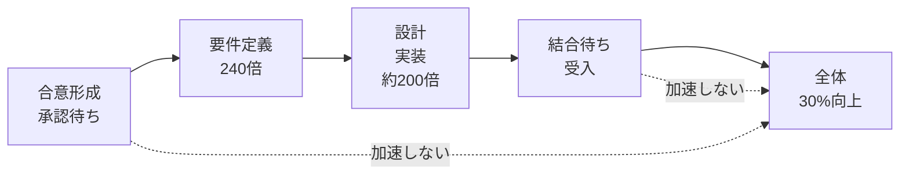
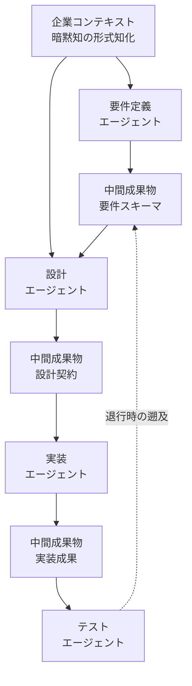

日立製作所が2026年7月24日に発表した「Agentic AI Integration Platform」は、システムインテグレーション(SI)の全工程にAIエージェントを適用する基盤です。社内検証では要件定義工程で最大240倍という数字が出ています。一方で、掲げられている全体目標は「2027年度に工程全体で生産性30%向上」です。

この記事では、**「局所で240倍出ているのに、全体目標がなぜ30%なのか」**という一点を軸に、工程分割型のマルチエージェント構成を採るときに実際の設計対象がどこに移るのかを整理します。対象読者は、AIエージェントによる開発プロセス再構築を評価・発注する立場の方と、その基盤を設計する立場の方です。

## 発表されたものの輪郭

公表内容から要点を抜き出すと、次の3つになります。

| 論点 | 内容 |
| --- | --- |
| 適用範囲 | 外部環境分析・構想策定から要件定義、設計、コーディング、テスト、運用まで |
| 検証値 | 要件定義工程で最大240倍、設計〜テスト工程で約200倍 |
| 全体目標 | 2027年度に工程全体で生産性30%向上 |

構造上の特徴は3点です。

1. **企業コンテキストの蓄積** — 顧客固有の業務知識・判断基準といった暗黙知を「企業コンテキスト」として形式知化し、エージェントがそれを参照・更新しながら開発サイクルを回す。
2. **FDE(Forward Deployed Engineer)の伴走** — 完全自律ではなく、専門チームが顧客現場に入りコンテキストを言語化する体制が前提。
3. **フロンティアモデルのハイブリッド利用** — Anthropic・Google Cloud・OpenAIのモデルを要件に応じて選択する。

注目すべきは1と2です。「どのモデルを使うか」ではなく、**「モデルに何を渡すか」を人間が作り込む体制がセットで提示されている**点が、この基盤の設計思想を表しています。

## なぜ局所240倍が全体30%に収束するのか

240倍と30%は矛盾していません。測っている対象が違います。

- **240倍が測っているもの**: 特定工程の作業時間(画面仕様の確定など、手を動かす部分)
- **30%が測っているもの**: 工程全体を貫いたスループット

システム開発の期間は、手を動かしている時間よりも待機時間が支配的です。仕様の合意形成、ステークホルダーの確認、他システムとの結合待ち。ここはAIエージェントを入れても縮みません。

アムダールの法則をそのまま当てはめると、直感より厳しい結論になります。全体の40%を占める工程を240倍にしても、全体は約1.66倍(所要時間で約40%短縮)にしかなりません。逆に言えば、**全体で30%という目標は「加速できない60%以上が残る」という前提を織り込んだ、むしろ現実的な数字**です。

発注側の判断基準としては、次の1問が効きます。

> **その施策は「手を動かす時間」を縮めるのか、「待つ時間」を縮めるのか。**

前者だけを積んでも、全体のリードタイムは動きません。

## 主戦場は「工程の中身」から「工程の間」へ

工程ごとに特化したエージェントを並べる構成では、要件定義エージェントの出力を設計エージェントが受け取り、その出力を実装エージェントが受け取ります。このバケツリレーで**システム全体の成否を握るのは、各エージェントの賢さではなく、工程間で受け渡される中間成果物のフォーマット**です。

単一の汎用エージェントに全工程を任せる場合、中間成果物は暗黙のまま会話履歴に溶けています。工程を分割した瞬間、その暗黙の受け渡しを**明示的なスキーマとして定義する義務**が発生します。ここが新しい設計対象です。

設計時に決めるべき項目は次のとおりです。

| 決めること | 具体例 |
| --- | --- |
| 表現形式 | JSON Schema、Pydanticモデル、UML等のどれで固定するか |
| 必須項目と任意項目 | 下流が動作するために欠かせない最小集合 |
| 不確実性の表明 | 「未確定」「仮置き」を値として表現できるか |
| 出所の記録 | どの企業コンテキスト・どの発言に由来するか |
| バージョン | 上流を再生成したとき下流がどう追随するか |

特に3番目と4番目が抜けやすい項目です。**上流エージェントが「わからない」と言えないスキーマは、下流に対して確定値として嘘をつく**構造になります。

## 分割しすぎると壊れる3つの経路

工程分割は無条件に善ではありません。壊れ方には型があります。

### 1. 誤りの連鎖的拡大

上流の要件定義エージェントがわずかな幻覚やコンテキスト欠落を起こすと、その中間成果物を受け取った下流が誤った前提でコードを大量生成します。人間のレビューであれば「この要件は変では」と止まるところが、スキーマとして整形された値は下流にとって疑う理由のない入力になります。誤りは検出されないまま増幅されます。

対策は工程の削減ではなく、**受け渡し境界にゲートを置くこと**です。

- スキーマ検証に加えて、値の妥当性を人間または検証エージェントが確認する
- 上流の確信度が低い項目を明示的にフラグ化し、下流の処理を止める
- 中間成果物を成果物としてバージョン管理し、レビュー可能な状態に置く

### 2. オーバーヘッドによる劣後

単純なタスクを無理にマルチエージェント化すると、中間成果物の生成とパースを繰り返す分だけレイテンシとトークン消費が積み上がります。**分割の利得より受け渡しの費用が上回れば、単一エージェントに性能で負けます**。

判断基準はシンプルです。工程を分ける理由が「並列化できる」「別のモデルを当てたい」「監査境界を引きたい」のいずれかに該当しないなら、分けない方が速い可能性が高いといえます。

### 3. 退行時の手戻りコスト

テスト工程でバグが見つかったとき、生成されたコードを直すだけでは根本解決になりません。要件定義のプロンプトや設計エージェントへの中間成果物まで遡らないと、次の再生成で同じバグが復活します。

つまり**中間成果物には、コードから要件へ遡れるトレーサビリティが必要**です。ここを設計しないまま工程分割を進めると、修正のたびに全工程を回し直す羽目になり、240倍の速度がそのまま無駄打ちの速度に変わります。

## 評価する側が確認すべきこと

この種の基盤を評価・発注する立場であれば、確認すべき点は次に集約されます。

1. **生産性◯%の測定単位** — 人月(工数)の削減なのか、ビジネス価値提供までのリードタイム短縮なのか。この2つは経営上の意味がまったく異なります。日立の「30%向上」についても、公表情報からは厳密な定義を確認できていません。
2. **中間成果物のスキーマ実態** — エージェント間で何がどんなデータ構造で受け渡されるのか。公表情報の範囲では標準化の具体は明らかにされていません。ここが不明なまま導入すると、ベンダーロックインの実体はモデルではなくスキーマ側に生まれます。
3. **企業コンテキストの所有権** — 暗黙知を形式知化した資産が、契約終了後にどちらに残るのか。FDEが伴走して作り込む資産である以上、ここは技術ではなく契約の論点です。

FDEという体制が前面に出ていること自体が、示唆的です。**AI駆動開発の律速は、モデルの性能ではなく、企業コンテキストを言語化できる人間の帯域にある**という前提が、そこに表れています。

## まとめ

- 局所240倍と全体30%は矛盾しない。前者は作業時間、後者はスループットを測っており、待機時間は加速しない。
- 工程分割型のマルチエージェントでは、設計対象が「工程の中身」から「工程の間で受け渡される中間成果物」へ移る。
- 中間成果物の設計では、不確実性の表明とトレーサビリティが抜けやすい。抜けると誤りの連鎖と手戻りコストとして跳ね返る。
- 分割の理由が並列化・モデル使い分け・監査境界のいずれでもないなら、受け渡しの費用が利得を上回る。
- 評価する側は「生産性の測定単位」「スキーマの実態」「企業コンテキストの所有権」の3点を確認する。

この記事が少しでも参考になった、あるいは改善点などがあれば、ぜひリアクションやコメント、SNSでのシェアをいただけると励みになります！

## 参考リンク

- [日立、AI駆動開発基盤「Agentic AI Integration Platform」開発、全工程で生産性3割向上目標（日経クロステック）](https://xtech.nikkei.com/atcl/nxt/mag/nc/18/020800017/080701485/)
- [AI駆動型のエンタープライズ向けシステムインテグレーションプラットフォームを開発、安全性を高め生産性を飛躍的に向上（株式会社 日立製作所 プレスリリース）](https://prtimes.jp/main/html/rd/p/000000605.000067590.html)
- [日立、エンタープライズ向けSIの全工程にAIを適用する「Agentic AI Integration Platform」を開発（クラウド Watch）](https://cloud.watch.impress.co.jp/docs/news/2127576.html)
- [日立、SIサービスの全工程にAI駆動開発を適用へ、開発生産性30%向上を目指す（IT Leaders）](https://it.impress.co.jp/articles/-/29623)
