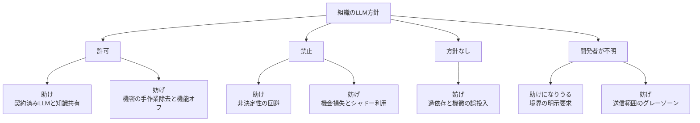

Ferino、Hoda、Grundy、Treude、Gunatilake は、ソフトウェア開発に大規模言語モデル（LLM）を使った経験がある開発者 19 人への半構造化面接から、組織の LLM 方針が開発者を助けるか妨げるかを整理します。論文は [arXiv:2609.16496v1](https://arxiv.org/abs/2609.16496)（投稿 2026-09-15、cs.SE）です。本稿は arXiv v1 初稿を正本にします。IEEE Xplore での採録は確認していません。

この記事では次を整理します。

- 方針の 4 類型が、開発者から見て何を助け、何を残すか
- 許可のあとでも残る入力前処理、機能制限、品質確認を誰が担うか
- 面接知見を、発生率や生産性効果の証拠としてどこまで読んでよいか

対象読者は、部門や全社で LLM 利用を許可するか、許可したあとの経路とレビュー担当を決める発注側です。

*この記事の全体像。以下、順に解説します。*

## 組織のLLM方針とは

**組織の LLM 方針**は、開発者が業務で大規模言語モデルを使ってよいかを、許可、禁止、方針なし、開発者が知らない、の 4 類型で切る枠です。論文の問いは、その方針が開発者を助けるか妨げるかです。対象は、ソフトウェア開発に LLM を使った経験がある開発者 19 人です。所属は北米、中南米、欧州、豪州です。面接は 34 分から 58 分です。事前質問票で属性と所属方針を取ります。募集は LinkedIn と X です。分析は socio-technical grounded theory for data analysis（STGT4DA）です。第一著者がオープンコーディングし、共著者が codes と memos をレビューします。ライセンスは CC BY-NC-SA 4.0 です。倫理承認は Monash HREC Project ID 44875 です。

面接時点の方針は Figure 1 で Allow 14、Prohibit 1、No policy 3、Unsure 1 です。本文が禁止と明示するのは P18 です。P2、P12、P16 は禁止から許可へ移ったと報告します。許可の中身は「全 LLM」または「選定したライセンス済みモデル」です。

面接の核の問いは、方針の有無、導入時期と主体、開発のきっかけ、自分とチームへの助けと妨げです。

| 項目 | 一次の値 |
|---|---|
| 設計 | 半構造化面接。STGT4DA |
| 人数 | 19。Figure 1: Male 14、Female 5 |
| 地域（Figure 1） | Australasia 10、North America 4、Latin America 4、Europe 1 |
| 業種（Figure 1） | IT 11、通信 2、金融 2、政府、ゲーム、エンジニアリング、データが各 1 |
| 役割（Figure 1） | Software Engineer 6、Software Developer 5、Data Engineer 2、他 6 役割が各 1 |
| 経験年（Figure 1） | 1 年未満 3、1 年から 2 年 6、3 年から 5 年 7、6 年から 10 年 2、10 年超 1 |
| 面接時点の方針（Figure 1） | Allow 14、Prohibit 1、No policy 3、Unsure 1 |
| 方針の動き | 面接時点の禁止は P18。P2、P12、P16 は禁止から許可へ移った |
| 補遺 | Zenodo `10.5281/zenodo.22581906`。本稿確認時点で記録 504。質問票本文は未確認 |

方針の型は、組織の動機と開発者の助け、妨げを同じ軸で切ります。許可と禁止はどちらも両面を持ちます。

図は、許可の助けと妨げ、禁止の助けと妨げを同じ軸に置きます。P18 はオフィスの実装には使わず、理解用途に ChatGPT を使います。

実務提案は 3 点です。自動プロンプトサニタイズと既存の品質ゲート、隔離サンドボックス、AI 利用の共有会です。加えて、禁止から許可へ移す 9 項目チェックリストがあります。

## 注意点

19 人の質的記述です。許可後負担の発生率、禁止の因果効果、チェックリストの介入効果は測っていません。

面接時点の禁止は Figure 1 で 1 人です。禁止の「助け」は P18 の単一事例に近いです。Figure 1 の Allow 14 は、P2、P12、P16 の「禁止から移った許可」を含む現在値です。

募集は職業 SNS です。著者自身がサンプル規模、禁止経験の少なさ、自己選択バイアスを Limitations に書きます。摩擦の過大評価を直接示した研究は、本稿の確認範囲では見つかりません。

STGT4DA は Hoda の区分ではフル理論開発ではありません。9 項目チェックリストは emerging な記述からの実務翻訳です。自動サニタイズとサンドボックスの推奨は、面接知見に OWASP LLM02、LLM07 と文献を足したものです。このサンプルで効果検証していません。

論文が導入に置く業界数字は、本論文の発見ではありません。分母も開発者向けコーディング方針ではありません。

| 数字 | 論文の書き方 | 一次照合 |
|---|---|---|
| 21%、73%、50% | Deloitte 2026。自律エージェントの成熟ガバナンスが 21%。懸念上位はプライバシーとセキュリティ 73%、法務、IP、規制 50% | Deloitte *State of AI in the Enterprise* PDF と一致。調査は 3,235 人、24 か国（2025-08〜09）。21% は **agentic ガバナンス** であり、開発者向けコーディング方針の成熟度ではない |
| 88%、70% | Google Cloud ROI of AI 2025。早期採用者の 88% が正の ROI。70% が IT 運用の即時生産性 | 公式ランディングはゲート付きで本文 PDF 未取得。二次情報のプレスでは、88% は **agentic early adopter**（調査の約 13%）が少なくとも 1 ユースケースで ROI。70% は価値ドライバーとしての productivity。論文の「LLM 利用ソフトウェア全般、IT 運用の即時効果」とは分母がずれうる |
| nearly 500 | McKinsey 2026 AI Trust Maturity。セキュリティとリスクがスケールの主障壁 | 公式ページは本稿確認時点で取得失敗。二次情報では約 500 組織、2025-12〜2026-01 |

仕事外実験のストレスは、本面接の直接測定ではありません。論文は Silva et al. 2025（Stack Exchange の生産性議論）を参照します。

Zenodo 補遺の質問票本文、Google Cloud と McKinsey の原典本文の分母は、本稿確認時点では未取得またはゲート付きです。自動サニタイズと宣言義務の開発者時間への純効果、禁止方針と定着、バーンアウトの関係は、論文が未来研究に挙げ、本サンプルでは未測です。

## 4類型は開発者にどう作用するか

4 類型は、開発者が見ている組織の動機と、現場で残る助け、妨げを対にします。

| 類型 | 開発者が見ている動機 | 助け | 妨げ |
|---|---|---|---|
| 許可 | 普通のツール。プライバシーとセキュリティを契約で抑える | 学習に使われないという契約（P14, P19）。会議要約とオンボーディング。シニア経由の Copilot 共有（P12） | プロンプトから機密を手で除く（P7, P15, P17）。Power BI Copilot など統合機能のオフ（P7）。同僚の生成コード品質（P10）。経験者は許可下でも使わない（P16） |
| 禁止 | セキュリティ、顧客信頼、所有権、商標、ライセンス | 非決定性と第三者依存を避ける（P18、金融） | デバッグと生成が遅くなる予想（P15, P18）。許可組織から来たインターンが社内で使えない（P16）。仕事外で試す（P2, P12） |
| 方針なし | 価値探索とリリースが先 | 本文は Not Identified | 過依存、API トークンの誤投入（P5, P13） |
| 不明 | 本文は Not Identified | 境界を示してほしい（P1） | 社内コードを ChatGPT に送ることの不快（P1） |

同じ「許可」でも運用は分かれます。

- ライセンス済み LLM と利用監視（P14）
- プロンプト指針と「会社データを入れない」自己規律。方針はまだ構築中（P7）
- 利用の明示宣言（P17）
- 私設 API（P15）
- 内部システムへのフル統合は制限

許可下の手動フィルタと機能オフは、P7、P15、P17 の一次引用があります。同僚生成コードへの懸念は P10 の一次引用があります。禁止下のシャドーは P18 の一次引用があります。Neumann et al. 2026（独 3 組織、17 面接）の shadow IT と方向は同じです。

マネージャ視点の Khojah et al.（11 社、IEEE Software 43(1) 2026、DOI 10.1109/MS.2025.3622039）は方針の作り手側です。本論文は受け手側で穴を埋めます。

## 許可のあとに残る負担を誰が担うか

正式に許可しても、入力前処理、機能制限、品質確認の担当は残ります。禁止を解くだけでは現場の負担設計は終わりません。社内ヒアリングの論点としては使えます。介入マニュアルとしては n=19 では足りません。

使う側への含意は 3 点です。

1. **許可の有無と、使える経路の設計は別です。** ライセンス、私設 API、統合機能のオンオフ、プロンプト指針、利用宣言が、同じ「許可」の中で分かれます。
2. **残る負担の担当を先に決めます。** 入力前処理（人か DLP、除外か）、品質確認（作者かレビューかゲートか）、機能制限の説明責任です。
3. **面接時点の禁止は 1 人なので、禁止維持の是非はこの論文だけでは決まりません。** 高機微は公開経路を閉じ、企業経路だけ開く、という分割の方が規制実務に近いです。

チェックリスト 9 項目は、ヒアリングの質問リストとしては使えます。ゲート条件（大半が yes なら許可）としては過積載です。銀行実務者は、完成した長い方針を待たず短い方針を出して更新せよ、と述べます（American Banker 2025-03-20）。9 項目が揃ってから許可、という待ち方と衝突します。公開 ChatGPT への顧客情報は、銀行では許可後も禁じたまま、という経路分割があります。全面許可が終点ではありません。

社内ヒアリングでは「許可していますか」より、「機密はどう落としているか」「生成コードのレビュー担当は誰か」「オフにした機能は何か」を聞きます。方針文書を厚くする前に、企業契約経路と公開経路を分けます。

## 製品の機密制御は手動除去をどこまで代わるか

製品機能は手動サニタイズの一部を代替できます。Microsoft Purview はプロンプト内の機微タイプをブロックできます。GitHub content exclusion は Business、Enterprise でパス除外できます。

ただし Purview はアップロードファイルをスキャンしません。content exclusion は VS Code の Agent、Edit モードを対象外とし、symlink とリモート FS も対象外です（GitHub Docs 一次）。製品の DLP と content exclusion を「手動除去が消えた」と読まないでください。公式の対象外を先に確認します。

## 他研究は同じ読みを支えるか

企業現場 RCT（Cui et al.、Microsoft、Accenture、Fortune 100、結合 n=4,867）は、コーディングアシスタントへのアクセスが完了タスクを 26.08%（SE 10.3%）増やします。機密フィルタ時間は非測定です。「許可後の摩擦がネットの生産性を食う」という読みは弱いです。ラボ RCT（Peng et al. 2023、n=95）は完了時間 55.8% 短縮です。品質は非測定と自認します。GitHub、Accenture の企業内報告は満足度とマージ率の改善を書きます。ベンダー測定です。

OSS 量的研究（Chen、Zimmermann、Trinkenreich、[arXiv:2608.03329](https://arxiv.org/abs/2608.03329)。29,624 リポ中 385 が AI 方針）は、ガバナンスが主に規制であり禁止ではない、透明性、責任が制限単独よりコミュニティと品質に効く、と抄録が書きます。企業内機密とは母集団が違います。

n=19 をマネージャ向け実行根拠にするのは、Baltes と Ralph の一般化議論と、Hoda 自身の STGT4DA 範囲と衝突します。本論文を「許可後は生産性が下がる」証拠に使わないでください。負担の種類のカタログとして使います。

## まとめ

組織の LLM 方針は、許可、禁止、方針なし、不明の 4 類型で、助けと妨げが同時に出ます。許可 14 人の面接では、契約済み LLM と知識共有が助けになる一方、機密の手作業除去、統合機能のオフ、同僚の生成コード確認が残ります。禁止の助けは面接時点 1 人の事例に近く、発生率や介入効果は測っていません。

発注側が先に決めるのは、許可の有無そのものより、企業契約経路と公開経路の分割、入力前処理の担当、生成コードのレビュー担当です。製品の DLP と content exclusion は手動除去の一部を代替しますが、公式の対象外が残ります。業界導入数字と RCT の生産性増分は、この面接の発見ではありません。分母と測定対象を分けて読んでください。

この記事が少しでも参考になった、あるいは改善点などがあれば、ぜひリアクションやコメント、SNSでのシェアをいただけると励みになります！

## 参考リンク

1. Ferino, Hoda, Grundy, Treude, Gunatilake. AI Policies: Help or Hindrance? A Software Developer’s Perspective. arXiv:2609.16496v1. 2026-09-15. https://arxiv.org/abs/2609.16496
2. Deloitte. State of AI in the Enterprise 2026. PDF. https://www.deloitte.com/content/dam/assets-zone3/us/en/docs/services/consulting/2026/state-of-ai-2026.pdf
3. Deloitte Insights. Agentic AI is scaling faster than guardrails. https://www.deloitte.com/us/en/insights/topics/emerging-technologies/ai-agents-scaling-faster.html
4. Khojah et al. LLM Company Policies and Policy Implications in Software Organizations. arXiv:2510.06718. IEEE Software 43(1) 2026. DOI 10.1109/MS.2025.3622039
5. Chen, Zimmermann, Trinkenreich. Making AI Visible, Not Vanished. arXiv:2608.03329. 2026-08-04. https://arxiv.org/abs/2608.03329
6. Cui et al. The Effects of Generative AI on High-Skilled Work. Microsoft Research / Management Science 2026. https://www.microsoft.com/en-us/research/publication/the-effects-of-generative-ai-on-high-skilled-work-evidence-from-three-field-experiments-with-software-developers/
7. Peng, Kalliamvakou, Cihon, Demirer. The Impact of AI on Developer Productivity: Evidence from GitHub Copilot. arXiv:2302.06590
8. Microsoft Learn. Purview DLP for Microsoft 365 Copilot. https://learn.microsoft.com/en-us/purview/dlp-microsoft365-copilot-location-learn-about
9. GitHub Docs. Excluding content from GitHub Copilot. https://docs.github.com/en/copilot/concepts/context/content-exclusion
10. Crosman. Banks navigate workers’ use of ChatGPT, set AI policies. American Banker. 2025-03-20. https://www.americanbanker.com/news/banks-navigate-workers-use-of-chatgpt-set-ai-policies
11. Google Cloud. ROI of AI 2025. https://cloud.google.com/resources/content/roi-of-ai-2025
12. OpenAI. Enterprise privacy. https://openai.com/enterprise-privacy/
