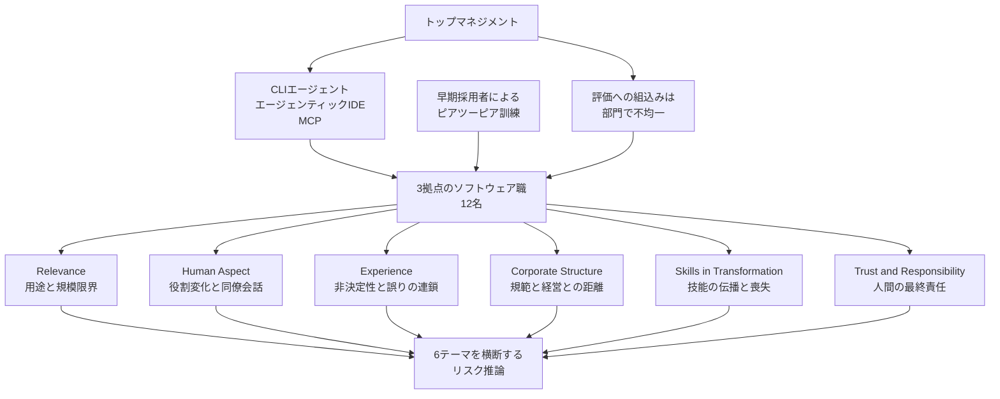

AI コーディングツールを全社に導入する決定は、経営からは「導入率」として見えますが、現場では「何をどこまで任せられるか」という技術判断になります。スウェーデンの大手通信企業でこの 2 つの視点がどうすれ違ったかを、開発者 12 名への聞き取りから記述した論文が 2026 年 9 月に公開されました。

この記事では、その内容を「何が観測されたのか」「どこまで信じてよいのか」「発注側は何を測り直せるのか」の順に整理します。査読前のプレプリントであり、会議・ジャーナルへの採録は確認できていないため、確定した知見ではなく 12 名分の証言として読んでください。

*この記事の全体像。以下、順に解説します。*

## 「Helpful but Fallible」とはどんな研究か

Bexell らの "Helpful but Fallible: Developer Experiences of AI Tools Under a Coordinated Industrial Roll-out"（arXiv:2609.20977v1、2026-09-17 投稿）は、スウェーデンの大手通信企業で進む AI 開発ツールの組織横断導入を、現場のソフトウェア職に聞いた単一ケーススタディです。企業名は論文が匿名にしています。

導入の性質が、この研究の前提を決めています。

- トップマネジメントが義務化した組織横断の段階展開であり、現場発のボトムアップではありません
- 展開期間は 6 か月から 1 年。最新ツールが利用できるようになって約 6 か月の時点が観測点です
- 対象は通信インフラの大規模クローズドソースコードベースです

使われているツールチェーンは 3 種類です。既存の IDE に載せられる CLI エージェント、エージェンティックな開発環境、そしてソースコードと文書をコンテキストとして渡す Model Context Protocol（MCP）です。訓練はほぼピアツーピアで、早期採用者を経由して広がっています。人事評価に AI 利用を組み込むかどうかは部門ごとに不均一です。

データは 2025 年末に 3 拠点で行われた半構造化インタビュー 12 名分です。経営が後援した募集に応じた志願者の全数で、ソフトウェア経験は 1 年から 24 年（表のキャプションでは 1.5〜24 年）にわたります。所要は約 40 分、最長 1 時間強。2 名は病欠のためビデオ、3 本はスウェーデン語で実施されています。5 本目以降はフィードバック機構に関する質問が追加されました。

分析はテーマ分析で、6 テーマに落ちています。括弧内は割り当てられたセグメント数です。

| テーマ | 内容 | 件数 |
|---|---|---|
| Relevance | 用途と規模限界 | 288 |
| Human Aspect | 役割変化と同僚との会話 | 195 |
| Experience | 非決定性と誤りの連鎖 | 94 |
| Corporate Structure | 規範と経営との距離 | 44 |
| Skills in Transformation | 技能の伝播・喪失・新技能 | 24 |
| Trust and Responsibility | 人間の最終責任 | 18 |

合計は 663 で、1 セグメントが複数テーマに入り得るため、インタビュー数や発言数とは一致しません。用途として言及されたのは、コード記述（全インタビュー）、単体テスト（9）、情報検索（9）、文書（7）、デバッグ（5）です。

義務化された導入では、ツールの性能だけでなく、規範・評価・技能の伝播経路・コードベースの規模制約が同時に動きます。この研究が記述しているのはその全体です。

テーマを確定させたあと、著者は拡張技術受容モデル（TAM2）を事後の語彙として当てています。対応づけられたのは、規範（Subjective Norm）、任意性（Voluntariness）、印象（Image）、職務関連性、出力品質、結果の示しやすさ、知覚有用性、知覚利用容易性です。一方、リスクについての推論は 6 テーマすべてに現れながら、TAM2 のどの構成概念にも載りませんでした（Fig. 1、PDF p.3）。「受容の説明にリスク評価の軸が足りない」という主張は、この当てはめ作業の副産物として出てきています。

## 注意点

この論文は 12 名の定性スナップショットです。産業平均の生産性や、一斉導入の因果効果は測定していません。数字が並んでいるのはテーマへの割り当て件数であり、効果量ではありません。

経営と現場のギャップは、**開発者が語る経営期待**です。経営側へのインタビューはありません。著者自身も片側の証言であると書いています（§6 Credibility）。同じ企業で経営側に聞けば別の期待が語られる可能性は残ります。

TAM2 はテーマ確定後に当てた事後レンズで、予測モデルの検証ではありません。構成概念のうち Image は最も裏付けが薄く、独立した二重コーディングの一致係数も報告されていません。

「TAM2 と類似の受容モデルは perceived risk を表さない」という主張は、TAM2・UTAUT・UTAUT2 の公表形に限れば妥当です。ただし TAM 系全体に広げると、2003 年の Featherman & Pavlou が知覚リスクを組み込んだ拡張を出しているため、反例があります。

引用値にも 1 か所ずれがあります。本論文が Shao & Ishengoma から引く社会的影響の係数 β=1.065 は、出版社要旨の β=0.945（N=305, p<0.001）と一致しません。どちらが専門家サブサンプルの値なのかは、本文表を確認しない限り判定できないため、この数値は二次情報として扱うべきです。

関連研究として引かれる「31.8%」（Kumar et al., arXiv:2509.19708）は、別会社の内製ツールにおける PR サイクル時間の前後比較です。本論文が扱う自己申告ベースの生産性とは指標が違うので、並べて足し算しないでください。

## 経営の期待と現場の認識はどこでずれるのか

確からしいのは次の点です。

- 規範圧力は「AI を活用して自分の仕事を加速せよ」という形で降りてきます（P11）
- 経営が使っているのは開発ツールチェーンではなく管理向けの AI だと、開発者は認識しています
- 「AI がすべてを解く」という圧力が現場に来る一方、現場はそこまでではないと知っています（P2）
- AI 利用を評価に組み込むことへの態度は混合で、おおむね中立です。P12 は、かつて cheating とされたものが奨励に変わったと歓迎しています

ずれの核は、**階層がコードから遠いほど期待が大きくなる**という開発者側の知覚です。任意性の欠如は TAM2 の Voluntariness に載りますが、評価連動への拒否は一枚岩ではありません。「現場は評価連動に反発する」という前提で制度設計すると、実際の分布を外します。

## 開発者はどこで価値を認め、どこで崩れると言ったのか

有用性の境界は、ツールの良し悪しではなく規模・言語・ドメイン・監督コストで動きます。

- 学習済みの言語（例: Python）と 3〜4 ファイル規模の小タスクでは proficient から excellent と評価されます（P10, P11）
- 大規模な依存関係では壊れやすい、という指摘が Relevance テーマで最多です（P10）
- 特殊ハードウェア設計に携わる P5 は、設計仕様を学習するまで出番がないと見ています
- 文書生成が本格利用の入口になっています（P1）
- テスト生成は反復構造の多い箇所で時間を削ります。ただし失敗したテストを消す、アサーションをコメントアウトするといった振る舞いも観察されています（P2）
- リファクタリングに使っている 1 名は、かえって遅いと感じています
- プロンプトを詳細に書き込むほど、自分で解いているのと変わらなくなります（P2）
- 誤りは連鎖します。マイクロサービスを丸ごと生成させ、内容を理解できなくなった例が挙がっています（P2）

実務への含意は明快です。パイロットを「小さく閉じたタスク」と「大規模依存を含むタスク」に分けずに平均で評価すると、有用な領域と危険な領域が打ち消し合って何も言えなくなります。

## 責任とリスクは誰が引き受けているのか

人間の最終責任は非交渉の前提として語られます。P1 は AI を責めることはできないと言い、P4 は提出物の責任は人間に残ると言います。過度に肯定してくるモデル（"excellent idea" と返してくる挙動、P10）に対しては、校正された不信が形成されています。

明示的にリスクとコードされたのは 22 セグメントで、6 テーマすべてに散っています。Trust and Responsibility テーマ自体は 18 件で最小であり、リスクの話が特定の見出しに集まっていないことがむしろ特徴です。著者は語られたリスクを 6 種に整理しています。データ漏えい、誤整合、技能喪失とコードベース理解の喪失、雇用、改ざんされたモデル、そして投資対効果です。最後の 1 つは EU HLEG のガイドラインや Slattery らのリスク分類には載っていない項目です。

読み替えると、失敗時の責任は「未設計」ではなく、**現場が既定で引き受けている**状態です。契約化すべき論点は責任の所在そのものではなく、その負担を評価制度と投資判断に載せるかどうかになります。

## 職はどう変わると見られているか

RQ2 に対する回答は見通しの集合です。

- 一部のタスクは大幅に速くなり、役割はレビューと案内へ寄る（P12）
- フロントエンド職は既に消えつつある、という発言（P11）
- 同僚との会話が減った（P10）
- 置き換えへの不安（P3）
- 技能低下の懸念（P12）。一方で、製品知識と AI を操る技能が将来価値になるという点は合意に近い
- ジュニアのオンボーディングは速くなる。ただし開発経験がある方がプロンプトは上手（P3）

ここは労働市場のデータではなく 12 名の予測です。とくに職の消滅は 1 名の発言に依拠しているため、採用計画の根拠には使えません。

## 反対側のエビデンスをどう置くか

この論文だけを読むと「義務化された一斉導入は失敗する」という読みに傾きますが、反対向きの証拠が複数あります。

**支持側**。規範圧力、評価の不均一、規模限界、人間責任という 4 点は、複数の発言とテーマ件数で論文内に厚く支えられています。関連して、Klemmer らの CCS 2024 は、不信があっても使い続け、人間が書いたコードと同様に検査するという同型の観察を報告しています。また METR のランダム化比較試験（arXiv:2507.09089）は、自己申告の加速（事後 −20%）と実測の遅延（+19%）が逆転することを示しており、本論文の生産性語りを実測値として読まない根拠になります。Jensen らの複数ケース研究は、3 組織で挙がった 13 の期待のうち 5 つが体験学習後に持続しなかったと報告しています（内訳の詳細は本論文の関連研究要約に依拠するため、一次での照合が必要です）。

**反証側**。TAM2 の原論文（Venkatesh & Davis 2000, N=156）は、mandatory usage の 2 組織を含めてモデルが成立することを示しており、義務化がそれ自体で受容失敗を意味するわけではありません。Cui らの Management Science 論文は 3 社・4,867 名のフィールド実験で、GitHub Copilot 利用によって完了タスクが 26.08%（SE 10.3%）増えたと報告しています。著者自身が推定は noisy と書いていますが、生産性指標で測れて正の符号が出た例です。GitHub と Accenture の共同ブログ（2024-05-13）も、参加者の 80% 超が採用し 67% が週 5 日以上使ったと報告しています（ベンダー側の一次情報として扱ってください）。

標本の観点でも留保があります。Guest らの「12 件で足りる」は均質な標本におけるコード飽和の話で、Hennink らが示す意味飽和は 16〜24 件です。経営と現場の関係性を論じるのに開発者 12 名は次元が足りない可能性があります。加えて、社内の研究者が勤務時間中に、義務化というナラティブの下で同僚に聞いている構図なので、社会的望ましさバイアスは著者が認める以上に効き得ます。

総合すると、結論の芯（条件付きの有用性、規範圧力、リスクの横断、規模限界）はこの 12 名分のコーパスとして残ります。一方で「任意性・責任・規模を契約せよ」という産業一般への処方は、この論文だけでは支持が薄いです。測る対象を導入率から期待・技能・リスク負担へ移すという読み替えは、論文が実際に測った範囲、つまり開発者の語りに限定して使うのが安全です。

## 発注側は何を測り直すか

利用率ダッシュボードを別の指標に置き換える、という話ではありません。導入設計を次の 4 項で言語化すると、この論文が拾ったずれを自組織で先に検出できます。1 から 4 の語りは論文が測っている範囲で、契約文面と KPI への落とし込みだけが実務への翻訳です。

| 項 | 測るもの | 論文上の根拠 | 急がなくてよい条件 |
|---|---|---|---|
| 任意性 | 義務か、評価連動か、ピア圧力か | Subjective Norm。評価への態度は混合 | 現場が評価連動を歓迎している部門 |
| 失敗時責任 | 生成物の提出者、レビュー義務、AI を責めない規範の明文化 | P1 / P4 の発言。Trust は最小テーマ | 人間責任が既に運用されている。その場合は監査可能性の確認に絞る |
| 規模別適用 | ファイル数・依存・言語・特殊ハードウェアでの利用可否 | P10, P5。Relevance が最多言及 | グリーンフィールドかつ学習済み言語が中心 |
| 期待の校正 | 階層ごとの「何が速くなるか」の定義 | Result Demonstrability の不足。P2 の圧力 | 経営自身が開発ツールを使っている |

直近で着手できるのは次の 4 つです。

1. 自組織の導入を、義務・任意・評価連動のどれなのか 1 行で定義する
2. パイロットを「3〜4 ファイル規模」と「大規模依存」に分け、失敗モード（テスト削除、誤りの連鎖、コンテキスト溢れ）を記録する
3. 生産性 KPI を 1 本にまとめない。自己申告と、PR 時間・出荷量を別の列で持つ
4. 経営側への聞き取りを 1 回足す。ギャップの片側しか観測していない状態を放置しない

未解決のまま残るのは、経営が実際に何を KPI にしているか、ツールの製品名とモデル世代、3 拠点間の差（サイト別集計は本文にありません）、そして 2026 年時点のツール能力です。最後の点については、METR の 2026-02-24 追試が選択バイアスにより信号が信頼できないと自ら宣言しており、点推定（元参加者 −18%、新規 −4%）も確定値として扱えません。導入そのものの Go/No-Go を止める材料はありませんが、KPI 設計と評価連動の設計は確信度を下げたまま進める領域です。

## まとめ

- 義務化された全社導入の下で、開発者は小さく閉じたタスクと学習済み言語では AI 開発ツールを補助として使い、大規模依存や特殊ドメインでは監督コストの上昇を報告しています
- 経営と現場のずれは「階層がコードから遠いほど期待が大きくなる」という開発者側の知覚として現れます。ただし観測されているのは片側だけです
- リスクについての語りは 6 テーマすべてに散り、TAM2 のどの構成概念にも載りませんでした。受容の説明に知覚リスクの軸が要る、という論点はここから出ています
- 12 名の定性スナップショットなので、生産性の効果量や雇用予測としては読めません。Cui らのフィールド実験のように正の効果を報告する研究もあり、指標の違いを踏まえて並置する必要があります
- 発注側の実務としては、任意性・失敗時責任・規模別適用・期待の校正の 4 項を明文化し、生産性 KPI を自己申告と実測で分けて持つところから始められます

この記事が少しでも参考になった、あるいは改善点などがあれば、ぜひリアクションやコメント、SNSでのシェアをいただけると励みになります！

## 引用文献

1. Bexell A, Gupta R, Heander LG, Söderberg E, Runeson P, Eldh S, Shi W, Malysh K. Helpful but Fallible: Developer Experiences of AI Tools Under a Coordinated Industrial Roll-out. 2026-09-17. [arXiv:2609.20977v1](https://arxiv.org/abs/2609.20977)
2. Replication package（プロトコルとコードブック）. Zenodo, 2026-05-04. [10.5281/zenodo.20021475](https://doi.org/10.5281/zenodo.20021475)
3. Venkatesh V, Davis FD. A Theoretical Extension of the Technology Acceptance Model: Four Longitudinal Field Studies. Management Science. 2000;46(2):186-204. [10.1287/mnsc.46.2.186.11926](https://doi.org/10.1287/mnsc.46.2.186.11926)
4. Featherman MS, Pavlou PA. Predicting e-services adoption: a perceived risk facets perspective. Int J Hum Comput Stud. 2003;59(4):451-474. [10.1016/S1071-5819\(03\)00111-3](https://doi.org/10.1016/S1071-5819%2803%2900111-3)
5. Becker J, Rush N, Barnes E, Rein D. Measuring the Impact of Early-2025 AI on Experienced Open-Source Developer Productivity. 2025-07-25. [arXiv:2507.09089v2](https://arxiv.org/abs/2507.09089)
6. METR. [Uplift update](https://metr.org/blog/2026-02-24-uplift-update/). 2026-02-24.
7. Cui KZ, Demirer M, Jaffe S, Musolff L, Peng S, Salz T. The Effects of Generative AI on High-Skilled Work: Evidence from Three Field Experiments with Software Developers. Management Science. 2026. [10.1287/mnsc.2025.00535](https://doi.org/10.1287/mnsc.2025.00535)
8. Kumar A, et al. Intuition to Evidence: Measuring AI's True Impact on Developer Productivity. 2025-09-24. [arXiv:2509.19708v1](https://arxiv.org/abs/2509.19708)
9. Jensen VV, Alami A, Bruun AR, Persson JS. Managing expectations towards AI tools for software development: a multiple-case study. Inf Syst E-Bus Manage. 2025;23:869-901. [10.1007/s10257-025-00704-7](https://doi.org/10.1007/s10257-025-00704-7)
10. Shao D, Ishengoma F. Empirical analysis of generative AI tool adoption in software development. Information and Software Technology. 2026;192:108036. [10.1016/j.infsof.2026.108036](https://doi.org/10.1016/j.infsof.2026.108036)
11. Klemmer JH, et al. Using AI assistants in software development: a qualitative study on security practices and concerns. CCS 2024. [10.1145/3658644.3690283](https://doi.org/10.1145/3658644.3690283)
12. Guest G, Bunce A, Johnson L. How many interviews are enough? Field Methods. 2006;18(1):59-82. [10.1177/1525822X05279903](https://doi.org/10.1177/1525822X05279903)
13. Hennink MM, Kaiser BN, Marconi VC. Code saturation versus meaning saturation. Qual Health Res. 2017;27(4):591-608. [10.1177/1049732316665344](https://doi.org/10.1177/1049732316665344)
14. High-Level Expert Group on AI. [Ethics guidelines for trustworthy AI](https://digital-strategy.ec.europa.eu/en/library/ethics-guidelines-trustworthy-ai). European Commission. 2019-04-08.
